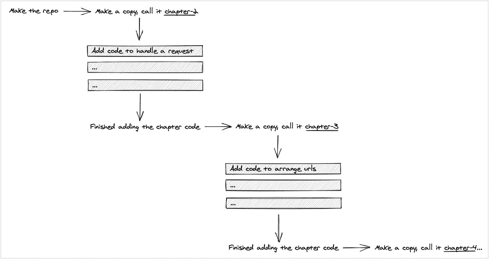
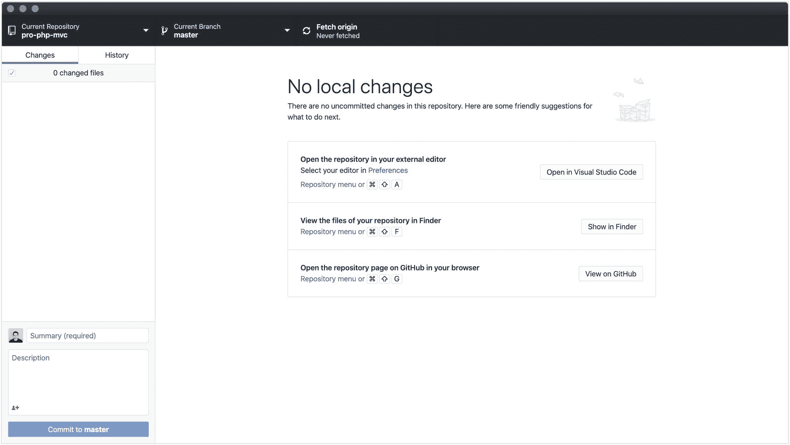
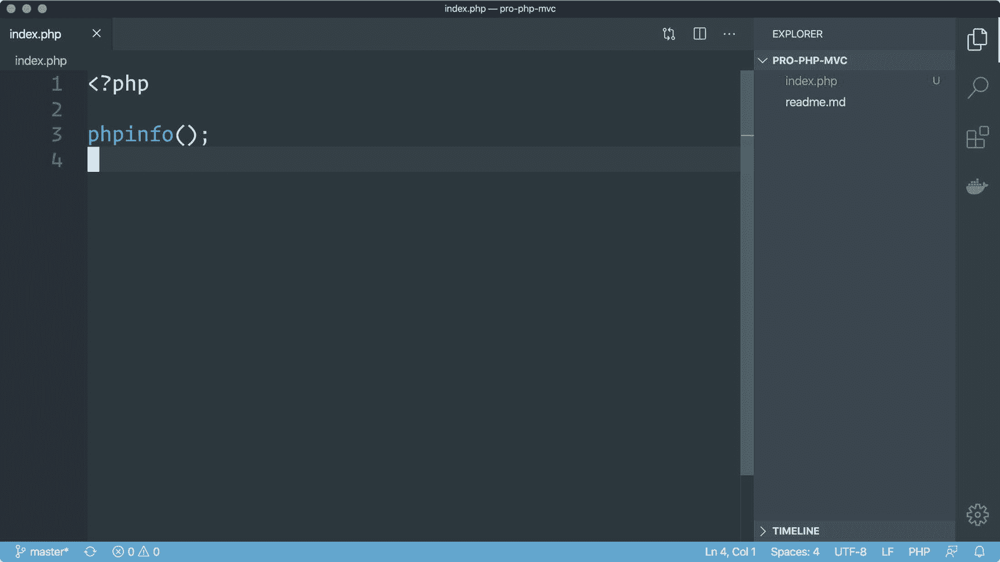
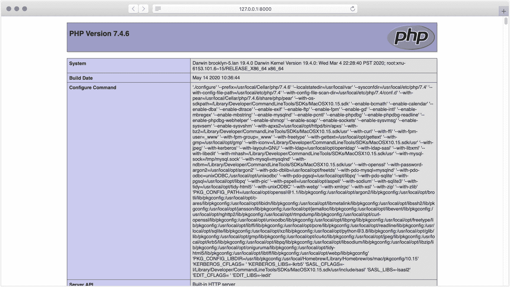

# 2.编写我们的第一段代码

是时候开始编写代码了！Whoosh 需要一个网站，我们将为他们建立一个网站。因为这是我们第一次编码，至少在本书的上下文中，我将花一点时间谈论我们如何以及在哪里写代码。

我给你看的所有代码都会在 GitHub 上[。如果这是你第一次使用 Git 这样的东西，不要紧张。这是一个存储代码并跟踪代码变化的系统。有点像一个事件数据库，这些事件是由应用程序代码中发生的事情定义的。有了它，你可以回到代码中的任何一点，看看你之前有什么。](https://github.com/assertchris/pro-php-mvc)

这也是与其他开发人员合作的好方法。他们可以创建您的代码的副本，并使用这些副本来建议您进行更改。GitHub 提供了一个易于使用的界面来检查和接受这些变更，这样您就可以随时了解项目的进展情况。

我将让 a =神奇的 GitHub guide to Git 来介绍基础知识。在阅读本书中的代码时，您只需要几个命令:

1.  `git clone` `git@github.com:assertchris/pro-php-mvc.git`

2.  `cd pro-php-mvc`

3.  `git branch -a`

    如果你熟悉 GitHub 和 Git，请随意跳到本章中我们处理请求的部分。

这些命令在终端窗口当前所在的文件夹中创建源代码存储库的本地副本。然后，他们导航到包含这些文件的文件夹，并列出存储库中可用的分支。

分支就像房子里的不同房间，每个房间都松散地建立在前一个房间的基础上。假设我有一个包含三个文件的应用程序。我想添加第四个文件，但是在我处理它的时候，我不希望这个文件在存储库的主分支(或者房间)中。

我可以偏离主分支，在新的分支中处理我的第四个文件。我可以将这个变化合并回主分支，或者它可以永远存在于它的新分支中。我可以再一次偏离，或者离开主树枝，或者我做的这个新树枝。

这是我用来存储每章源代码的模式。每个分支都有前面所有章节的代码，而且还有以该分支命名的章节的代码。如果你在第五章[中](05.html)，你可以切换到名为`chapter-5`的分支，你会在那一章结束时看到代码是什么样的。



章节的分支

要切换到您想要查看的分支，使用命令`git switch chapter-5`，其中`chapter-5`是您想要切换到的分支的名称。如果你喜欢更直观的界面， [GitHub 也有一个简洁的应用](https://desktop.github.com)你可以试试。



可视化检查来自 GitHub 库的代码

如果你找不到你要找的代码，请随时在 Twitter 上联系我。

## 处理请求

本章的代码可以在 GitHub 上找到[。正如你可能已经收集到的，这本书关注的是 PHP 8，这意味着你需要有那个版本，否则你可能会看到弹出的错误消息。除了学习如何制作我们自己的框架，我们还学习了所有可以用 PHP 8 编写的新代码…](https://github.com/assertchris/pro-php-mvc/tree/chapter-2)

你可以克隆回购协议，看看我是如何写的东西，或者如果你有一个讨厌的错误，你只是不能过去。我建议你开始一个单独的“新”项目，在那里你写你在本书中看到的代码，作为帮助你学习和记忆的一种方式。

打开您的代码编辑器，为您的 Whoosh 网站版本创建一个新的项目/空间。我个人最喜欢的是 [Visual Studio 代码](https://code.visualstudio.com)，但是你可以使用任何你喜欢的编辑器。

我提到过我喜欢在我的终端和代码编辑器中使用相同的主题。超级终端和 VS 代码都允许大量的定制。我使用的主题来自 rainglow.io。在那里，你可以找到如何在代码编辑器和终端中安装主题的说明链接。

每个 PHP 网站都以一个文件开始。甚至最流行的框架也是这样工作的。在深处的某个地方，有一个 web 服务器正在向其发送请求的`index.php`文件。



创建我们的第一个框架文件

马上，我们需要确保 PHP 处于工作状态。如果你要通过终端运行你的代码，你可以从同一个文件夹中使用类似于`php -S 0.0.0.0:8000`的命令，然后你应该能够在你的网络浏览器中打开`http://0.0.0.0:8000`。



检查 PHP 信息

你的版本号可能和我的不同，因为你可能在我写完几个月后才读到这篇文章。不管怎样，你用 Homebrew 安装的 PHP 版本应该和你在这个网页上看到的版本一样。

如果你通过图形用户界面、网络服务器或 iPad 运行你的网站，你需要把这个`index.php`文件放在网络服务器指向的网络根目录(有时也称为“root”)。

在 XAMPP 上，这意味着打开 GUI，启动服务器，单击 volumes，然后在`/opt/lampp`上单击 mount。这将挂载一个网络共享，您可以从代码编辑器中打开它。

无论是通过本地开发服务器还是通过 web 服务器运行该文件，结果应该是一样的。您正在寻找这个略带紫色的浅灰色页面，它显示了 PHP 的最新版本。

更具体地说，我们看到一个页面，显示了这个版本的 PHP 安装的所有设置和模块。一旦我们知道这个代码在工作，我们就可以开始响应不同的请求。每次 PHP 脚本以这种方式运行时，我们都可以访问请求周围的一堆上下文。让我告诉你我的意思:

```php
var_dump(getenv('PHP_ENV'), $_SERVER, $_REQUEST);

```

如果我们用“变量转储”替换`phpinfo()`函数调用，我们可以看到正常请求提供了什么上下文。

如果很难看到所有的细节，右键单击网页，然后单击“查看源代码”这将显示浏览器用来呈现页面的底层 HTML。有时候格式会稍微好一点…

如果我们用类似于`export PHP_ENV=prod && php -S 127.0.0.1:8000`的命令重启服务器并刷新浏览器页面，我们会看到响应发生了变化。

您可能需要在操作系统中以不同的方式导出环境变量。稍后，我们将创建一个适用于任何机器的系统。

每个框架都使用这些全局变量来决定应该触发哪些功能，应该显示哪些页面。通常，根据代码运行的环境，会有一组不同的变量。

例如，当代码在您的家庭计算机上运行时，您可能不希望它访问生产数据库。您将希望使用与您的家庭计算机相匹配的数据库凭据。

不同的框架(甚至 web 服务器)都有办法将这些变量放入 PHP。有些人更喜欢在启动服务器时导出变量的方式。有些使用特殊命名的文件(如`.env`和`.env.production`)，他们使用这些不同的文件名来确定在当前环境中应该加载哪个文件。

我们将在第 [11](11.html) 章探索这些加载环境变量的方法。

PHP 还提供了对变量(或上下文)的访问，这些变量与通过脚本的请求有关。特别有启发性的变量是那些告诉我们使用了哪个请求方法以及请求了什么路径或 URL 的变量:

```php
$requestMethod = $_SERVER['REQUEST_METHOD'] ?? 'GET';
$requestPath = $_SERVER['REQUEST_URI'] ?? '/';

if ($requestMethod === 'GET' and $requestPath === '/') {
    print 'hello world';
} else {
    print '404 not found';
}

```

如果您在浏览器中打开`http://0.0.0.0:8000`，您应该会看到“hello world”消息。将地址更改为其他地址(如`http://0.0.0.0:8000/missing`)，您应该会看到“404 not found”消息。

当然，我们可以退回到 web 服务器通常提供的基于文件的路由，但它没有这种方法有用或具体。我们可以根据触发反应的具体情况来定制反应。

这里，我使用的是`and`关键字，而不是常用的`&&`操作符。在这种情况下，它在语义上没有什么不同，但对我来说，它读起来更清楚。

## 用 HTML 响应

在回应的方式中，我们能表现出什么？

我们想要什么都行，真的。通常，网站会为简单的请求返回 HTML。它们也可以返回 JSON 或 XML 或可下载的文件。我们可以直接返回 HTML，也可以通过包含文件的方式返回:

```php
$requestMethod = $_SERVER['REQUEST_METHOD'] ?? 'GET';
$requestPath = $_SERVER['REQUEST_URI'] ?? '/';

if ($requestMethod === 'GET' and $requestPath === '/') {
    print <<<HTML
        <!doctype html>
        <html lang="en">
            <body>
                hello world
            </body>
        </html>
    HTML;
} else {
    include(__DIR__ . '/includes/404.php');
}

```

我在这里使用的多行字符串称为 Heredoc。它们对 PHP 来说并不陌生，但是新的是你可以像我在这里做的那样缩进它们。直到最近，除了第一行之外，所有的 Heredoc 字符串都需要紧靠文件的左侧。

`??`语法意味着如果左边的东西是`null`或未定义的，那么使用右边的东西。

我选择使用单引号和三重等号。如果你熟悉 PHP，你应该知道这些意味着什么。我认为它们是很好的风格选择。如果我们需要[插值](https://en.wikipedia.org/wiki/String_interpolation)或[类型强制](https://en.wikipedia.org/wiki/Type_conversion)，我们可以将它们作为代码库一般规则的例外。

虽然可以在 HTML 之间混合 PHP 代码块，但这是非常不规则的，会导致混乱的代码库。稍后，我们将学习如何制作我们自己的模板引擎，它会做到这一点，但以一种我们不需要看到或使用的方式。

目前，最好的方法是直接输出数据(HTML、JSON 等)。)或者像我在这里所做那样包含输出。不用担心这个是否优雅。这只是第一步！

## 重定向到另一个 URL

有时候，一个成功的响应并不意味着向浏览器发送一点 HTML。有时候重点是重定向到其他地方。假设你决定将一个网址从`/info`改为`/contact`，但是你不想断开所有人已经加了书签的`/info`的链接。

在这种情况下，您*可以*更改 URL，但保持通常所说的重定向 URL 指向新的 URL。这样，当人们转到旧网址时，他们将被转到新网址。

这通常使用一个特殊的 HTTP 头来完成，浏览器应该正确地将它解释为“该页面已经移动”:

```php
$requestMethod = $_SERVER['REQUEST_METHOD'] ?? 'GET';
$requestPath = $_SERVER['REQUEST_URI'] ?? '/';

if ($requestMethod === 'GET' and $requestPath === '/') {
    print <<<HTML
        <!doctype html>
        <html lang="en">
            <body>
                hello world
            </body>
        </html>
    HTML;
} else if ($requestPath === '/old-home') {
    header('Location: /', $replace = true, $code = 301);
    exit;
} else {
    include(__DIR__ . '/includes/404.php');
}

```

通过这段代码，当用户访问`/old-home`路径时，他们将被重定向到`/`路径。`301`意味着浏览器应该记住这是一个永久的重定向。如果重定向只是暂时的，您可以使用`302`。

[我需要等待命名参数 roc 投票结束，然后再处理下一章的反馈。PHP 可能突然支持命名参数…]

我写过`$replace = true, $code = 301`。PHP 不会突然支持命名参数——它只是一种注释这些值的含义的简洁方式。如果我告诉你第二个参数值应该是`true`，如果不去查阅文档，你不会知道这个值意味着什么。

这是赋值，所以你绝对不应该重复使用你已经拥有或者打算使用的变量的名字。或者，创建您自己的函数，这些函数清楚它们的参数是什么意思，或者提供好的缺省值。

不使用`header`函数，我们可以创建自己的重定向函数:

```php
$requestMethod = $_SERVER['REQUEST_METHOD'] ?? 'GET';
$requestPath = $_SERVER['REQUEST_URI'] ?? '/';

function redirectForeverTo($path) {
    header("Location: {$path}", $replace = true, $code = 301);
    exit;
}

if ($requestMethod === 'GET' and $requestPath === '/') {
    print <<<HTML
        <!doctype html>
        <html lang="en">
            <body>
                hello world
            </body>
        </html>
    HTML;
} else if ($requestPath === '/old-home') {
    redirectForeverTo('/');
} else {
    include(__DIR__ . '/includes/404.php');
}

```

终止脚本执行也很重要(在本例中是通过调用`exit`函数)，因为仅仅是`header`函数并不能完成交易。它仍然可以在设置后输出内容，甚至用另一个`Location`标题替换它。当您计划重定向时，请确保这是脚本停止运行前您做的最后一件事。

您还可以使用`die`函数来终止脚本执行。

## 显示错误页面

信不信由你，我们已经处理过一个常见的错误场景:找不到页面。实际上，知道用户是否应该看到 404 错误页面的唯一方法是首先检查他们是否应该看到站点中的其他页面。

但是如果错误不是因为他们寻找的页面丢失了呢？如果是代码库出了问题怎么办？

还有另外三种常见的错误:

1.  URL 是对的，但是请求方法是错的。

2.  URL 和请求方法是正确的，但是代码中有一个错误。

3.  URL 和请求方法是正确的，但是在其他一些请求参数中有错误，比如表单输入值。

为了处理第一种情况，我们需要跟踪所有可能的 URL 以及它们所允许的请求方法:

```php
$routes = [
    'GET' => [
        '/' => fn() => print
            <<<HTML
                <!doctype html>
                <html lang="en">
                    <body>
                        hello world
                    </body>
                </html>
            HTML,
        '/old-home' => fn() => redirectForeverTo('/'),
    ],
    'POST' => [],
    'PATCH' => [],
    'PUT' => [],
    'DELETE' => [],
    'HEAD' => [],
    '404' => fn() => include(__DIR__ . '/includes/404.php'),
    '400' => fn() => include(__DIR__ . '/includes/400.php'),
];

// this combines all the paths (for all request methods)
// into a single array, so we can quickly see if a path
// exists in any of them
$paths = array_merge(
    array_keys($routes['GET']),
    array_keys($routes['POST']),
    array_keys($routes['PATCH']),
    array_keys($routes['PUT']),
    array_keys($routes['DELETE']),
    array_keys($routes['HEAD']),
);

if (isset(
    $routes[$requestMethod],
    $routes[$requestMethod][$requestPath],
)) {
    $routes[$requestMethod][$requestPath]();
} else if (in_array($requestPath, $paths)) {
    // the path is defined, but not for this request method;
    // so we show a 400 error (which means "Bad Request")
    $routes['400']();
} else {
    // the path isn't allowed for any request method
    // which probably means they tried a url that the
    // application doesn't support
    $routes['404']();
}

```

这里发生了很多事情。

浏览器可以使用不同的方法与 web 服务器交互。对于“只是阅读”网站信息，他们通常会发送一个`GET`请求。对于向网站“发送”信息(比如填表)，他们通常会发送一个`POST`方法。

现在理解其中的机制并不是非常重要，但是您应该知道您的应用程序将需要处理这些不同的请求方法。随着我们开始以不同的方式与 web 服务器进行通信，我们将会更加了解这些方法是如何工作的(以及它们的不同之处)。第 [5](05.html) 章和第 [6](06.html) 章处理发送不同种类的请求。

我们没有在不断扩展的 if 语句中声明可能的路径，而是预先定义了路径。我们没有为从`POST`到`HEAD`的请求定义任何路由，但是我们可能确实希望允许这些请求方法。

我们还需要生成一个可能路径的列表，这样我们就可以判断某人是否使用了正确的路径(或 URL)但使用了错误的请求方法。如果 URL 和请求方法都不正确，我们可以退回到旧的“404”行为。

我们可以用类似于`curl -X POST http://0.0.0.0:8000/`的命令来测试`400`错误。cURL 是一个系统实用程序，常见于 Unix 和 Linux 系统，可以向远程服务器发出请求。这里，我们要求它请求 home URL，但是使用了一个`POST`请求方法，我们知道这个方法会触发`400`错误。

PHP 语言最近增加的一项功能是我们可以在函数调用中使用尾随逗号，就像我对`array_merge`的调用一样。在 7.4 之前，尾随逗号会导致致命错误。

另一个最近增加的是我们用来定义路由的短闭包语法。短闭包隐式地返回它们表达式的值，但是因为我们不使用这些返回值，所以我们可以忽略这种行为。

我们还使用`throw new Exception`作为一个简短闭包的单一表达式。这是 PHP 8.0 的一个新特性。`throw`关键字现在可以在表达式可以使用的任何地方使用，这对于需要抛出的短闭包非常有用。

我们可以更进一步，通过定义一个 abort 方法来重定向到错误页面，并在框架代码中出现错误的用户数据或错误时使用它:

```php
$routes = [
    'GET' => [
        '/' => fn() => print
            <<<HTML
                <!doctype html>
                <html lang="en">
                    <body>
                        hello world
                    </body>
                </html>
            HTML,
        '/old-home' => fn() => redirectForeverTo('/'),
        '/has-server-error' => fn() => throw new Exception(),
        '/has-validation-error' => fn() => abort(400),
    ],
    'POST' => [],
    'PATCH' => [],
    'PUT' => [],
    'DELETE' => [],
    'HEAD' => [],
    '404' => fn() => include(__DIR__ . '/includes/404.php'),
    '400' => fn() => include(__DIR__ . '/includes/400.php'),
    '500' => fn() => include(__DIR__ . '/includes/500.php'),
];

$paths = array_merge(
    array_keys($routes['GET']),
    array_keys($routes['POST']),
    array_keys($routes['PATCH']),
    array_keys($routes['PUT']),
    array_keys($routes['DELETE']),
    array_keys($routes['HEAD']),
);

function abort($code) {
    global $routes;
    $routes[$code]();
}

set_error_handler(function() {
    abort(500);
});

set_exception_handler(function() {
    abort(500);
});

if (isset(
    $routes[$requestMethod],
    $routes[$requestMethod][$requestPath],
)) {
    $routes[$requestMethod][$requestPath]();
} else if (in_array($requestPath, $paths)) {
    abort(400);
} else {
    abort(404);
}

```

随着新代码的加入，为了处理服务器和验证错误，我们现在可以应对我们可能遇到的所有最常见的网站错误。

起初，在请求方法旁边有错误代码可能看起来很奇怪；但是你很快就会开始看到(特别是在下一章),在请求方法旁边定义它们是多么的方便…

对`set_error_handler`和`set_exception_handler`的调用确保了我们的`500`错误被显示出来，即使发生了我们没有准备好的错误。

PHP 脚本通常会在两种情况下失败。一个是由异常抛出的。异常应该被捕获，以一种可以恢复的方式。

如果没有捕获到异常，那么除了可以在浏览器中显示的默认错误消息之外，`set_exception_handler`还提供了一种通知方式。

另一方面，错误通常是不可恢复的。`set_error_handler`是一种类似的通知机制。我们启用了这两种方式，因此我们可以为每种情况显示定制的 HTML 页面。

设置自定义错误处理程序或异常处理程序会禁用默认的错误标题。这可能不是您想要的，但是您可以通过将它们添加回您的`abort`函数来重新启用这些头:

```php
function abort($code) {
    global $routes;
    header('HTTP/1.1 500 Internal Server Error');
    $routes[$code]();
}

```

## 摘要

没有真正尝试，我们已经做了一个相当健壮的路由代码。路由实际上是我们下一章的主题。

我们将把所有这些代码打包到一个类中，这个类将记住我们的路由，并根据请求方法和路径决定匹配和执行哪个路由。

在后面的章节中，我们还将看看如何改进我们在本章开始的模板化。

我对我们所取得的成就感到非常高兴，我期待着这个代码库的发展以及我们对 PHP 8 中 MVC 的理解。