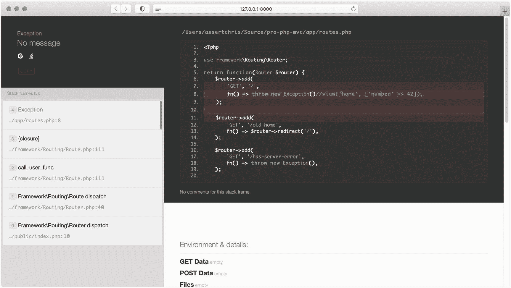

# 五、构建验证器

是时候开始给我们的应用添加更多的结构了。我们一直非常关注框架代码——这并不是一件坏事——但这意味着我们忽略了开始构建一个合适的网站所需的一些基本东西。

大多数网站都有表格。让我们更容易地构建和使用它们来捕获用户输入！首先，我们需要制定一个替代方案，将所有应用代码保存在 routes 文件中…

## 什么是控制器？

我们已经讨论了 MVC 的大部分“视图”部分，我们将在下一章深入探讨模型部分。在本章中，我们将创建我们的第一个控制器。

有许多方法可以组织应用，并将普通代码与业务逻辑分开。在这上面花很多时间很诱人，但这不是本书或本章的目的。相反，我建议你看一看马蒂亚斯关于这个主题的书。

控制器更多地由它们不应该包含的代码定义，而不是由它们应该包含的代码定义——至少如果你问 Twitter 或 Reddit:

*   "控制器不应该包含应该在浏览器中显示的代码，比如 HTML 和 CSS . "

*   "控制器不应该包含处理数据库或文件系统的代码."

这些建议可以带来更清晰的代码库，但它们无助于解释控制器中应该包含哪些代码。简单地说，控制器应该是应用深层部分之间的粘合剂。

就我们的框架和应用而言，它们是 HTTP 请求将被发送到的地方，并通过它们将响应发送回浏览器。

## 这与构建验证器有什么关系？

因为控制器处理请求数据并安排响应数据，所以它们是应该进行验证的地方。以下是我们将在验证库中构建的主要功能:

*   定义验证函数的一些结构

*   一些预建的验证函数

*   一种给验证类简单命名的方法，这样它们就可以被快速使用

*   针对请求数据运行一组验证规则的方法

*   一种自定义验证错误信息的方法

一旦我们完成了，我们将看看一些流行的验证库和方法，这样我们就可以对那里有什么有一个感觉。

## 改进错误处理

在我们开始控制器和验证之前，我想解决一个问题，自从我们制造路由以来，我一直在努力解决这个问题。在`Router->dispatch()`方法中，我们捕捉异常并显示一个简单的错误页面。

我认为我们可以做一些更有用的东西，至少对于开发环境来说。让我们安装一个伟大的开源库来格式化错误响应:

```php
composer require filp/whoops

```

然后，我们可以显示一个有用的堆栈跟踪，而不是显示上一个(相当无用的)错误页面:

```php
public function dispatch()
{
    $paths = $this->paths();

    $requestMethod = $_SERVER['REQUEST_METHOD'] ?? 'GET';
    $requestPath = $_SERVER['REQUEST_URI'] ?? '/';

    $matching = $this->match($requestMethod, $requestPath);

    if ($matching) {
        $this->current = $matching;

        try {
            return $matching->dispatch();
        }
        catch (Throwable $e) {
            $whoops = new Run();
            $whoops->pushHandler(new PrettyPageHandler());
            $whoops->register();
            throw $e;

            return $this->dispatchError();
        }
    }

    if (in_array($requestPath, $paths)) {
        return $this->dispatchNotAllowed();
    }

    return $this->dispatchNotFound();
}

```

这是来自`framework/Routing/Router.php`。

现在我们的错误将更容易追查。



更好的错误信息

不过，有一个问题。在生产环境中保留这样的东西通常不是一个好主意，因为它可能会暴露危及您的服务器、服务或用户的秘密。

我们需要添加一些东西来确保它只在开发环境中显示。我们可以根据 URL 过滤，但是有一个更好的解决方案！

让我们创建一个名为`.env`的文件，其中存储了环境名:

```php
APP_ENV=dev

```

这是来自`.env`。

将这个文件添加到`.gitignore`中是很重要的，这样存储在其中的任何秘密都不会被提交和推送到像 GitHub 这样的地方:

```php
vendor
.env

```

这是来自`.gitignore`。

想法是这样的:

*   秘密保存在`.env`和特定于环境的事物中(比如环境的名称或类型)。

*   没有共享或提交给源代码控制系统。

*   当应用需要知道某个秘密或环境的名称或类型时，它会查看这个文件。

当然，我们可以创建一个模板，以便人们在他们的机器上设置应用时，知道他们需要什么秘密和环境细节:

```php
APP_ENV=

```

这是来自`.env.example`。

通常把这个文件叫做`.env.example`，这样文件名就暗示了这个文件就是一个例子。当你看到一个包含这个文件的项目时，你可以自信地认为这个项目需要一个`.env`文件中的秘密。

我们将环境称为“dev”，但是我们如何在路由中获得这个值呢？我们可以使用另一个很棒的开源库:

```php
composer require vlucas/phpdotenv

```

这个库读取`.env`中的秘密，并将它们放入 PHP 环境中。我们需要在应用生命周期的开始“加载”这些秘密:

```php
require_once __DIR__ . '/../vendor/autoload.php';

$dotenv = Dotenv\Dotenv::createImmutable(__DIR__ . '/..');
$dotenv->load();

$router = new Framework\Routing\Router();

$routes = require_once __DIR__ . '/../app/routes.php';
$routes($router);

print $router->dispatch();

```

这是来自`public/index.php`。

`createImmutable`方法寻找一个`.env`文件，所以我们需要告诉它这个文件可能在哪个文件夹中。现在，我们可以在路由中看到我们的`APP_ENV`变量:

```php
public function dispatch()
{
    $paths = $this->paths();

    $requestMethod = $_SERVER['REQUEST_METHOD'] ?? 'GET';
    $requestPath = $_SERVER['REQUEST_URI'] ?? '/';

    $matching = $this->match($requestMethod, $requestPath);

    if ($matching) {
        $this->current = $matching;

        try {
            return $matching->dispatch();
        }
        catch (Throwable $e) {
            if (isset($_ENV['APP_ENV']) && $_ENV['APP_ENV'] === 'dev') {
                $whoops = new Run();
                $whoops->pushHandler(new PrettyPageHandler());
                $whoops->register();
                throw $e;
            }

            return $this->dispatchError();
        }
    }

    if (in_array($requestPath, $paths)) {
        return $this->dispatchNotAllowed();
    }

    return $this->dispatchNotFound();
}

```

这是来自`framework/Routing/Router.php`。

通过此项检查，仅当`APP_ENV=dev`出现时，才会出现呜呜堆栈跟踪错误页面。我建议您将`APP_ENV`的默认值设置为其他值，这样使用您的应用(或框架)的人就不会看到这个错误页面。就安全而言，这是最安全的位置。

## 创建控制器

让我们将我们的路由闭包代码移到控制器中。首先，让我们制作一个新的主页控制器:

```php
namespace App\Http\Controllers;

class ShowHomeController
{
    public function handle()
    {
        return view('home', ['number' => 42]);
    }
}

```

这是来自`app/Http/Controllers/ShowHomePageController.php`。

我喜欢冗长的名字，像这样。关于这样的后缀是否好，有一个有趣的讨论，但我更喜欢这样命名常见的事物:

*   型号→事物(单数)→“产品”

*   控制器→动词+事物+“控制器”→“ShowProductController”

*   事件→事物+动词(过去式)→“product created”

根据我的经验，这种命名方案会导致更少的冲突和混乱。

现在，我们需要将路线从使用内联闭包改为使用这个控制器:

```php
use App\Http\Controllers\ShowHomePageController;
use Framework\Routing\Router;

return function(Router $router) {
    $router->add(
        'GET', '/',
        [ShowHomePageController::class, 'handle'],
    );

    //...
};

```

这是来自`app/routes.php`。

这不会马上奏效，原因有几个:

*   我们已经在`Router`和`Route`类中输入了`callable`。

*   即使我们不是，我们也不能像调用函数一样调用数组，除非第二项是可以静态调用的方法的名称。

让我们解决这两个问题，从`Router`类开始，我们移除了`$handler`的类型:

```php
public function add(string $method, string $path, $handler): Route
{
    $route = $this->routes[] = new Route($method, $path, $handler);
    return $route;
}

```

这是来自`framework/Routing/Router.php`。

现在，我们可以在`Route`类中做同样的事情:

```php
public function __construct(string $method, string $path, $handler)
{
    $this->method = $method;
    $this->path = $path;
    $this->handler = $handler;
}

```

这是来自`framework/Routing/Route.php`。

这只是问题的一半。我们还需要使`Route->dispatch()`方法能够处理非静态控制器方法:

```php
public function dispatch()
{
    if (is_array($this->handler)) {
        [$class, $method] = $this->handler;
        return (new $class)->{$method}();
    }

    return call_user_func($this->handler);
}

```

这是来自`framework/Routing/Route.php`。

这个数组引用技巧很巧妙。它让我们将数组分成几个命名的变量，这样我们就可以创建一个变量类并调用一个变量方法。

主页又开始工作了！让我们创建另一个控制器:

```php
namespace App\Http\Controllers\Products;

class ListProductsController
{
    public function handle()
    {
        $parameters = $router->current()->parameters();
        $parameters['page'] ??= 1;

        $next = $router->route(
            'list-products', ['page' => $parameters['page'] + 1]
        );

        return view('products/list', [
            'parameters' => $parameters,
            'next' => $next,
        ]);
    }
}

```

这是来自`app/Http/Controllers/Products/ShowProductsController.php`。

这不会立即生效，因为我们不再能够访问局部变量`$router`。现在，让我们改变我们的`Route->dispatch`方法来接受一个类名或者一个已经创建的对象，这样我们就有可能提供一个已经被赋予路由的控制器对象:

```php
public function dispatch()
{
    if (is_array($this->handler)) {
        [$class, $method] = $this->handler;

        if (is_string($class)) {
            return (new $class)->{$method}();
        }

        return $class->{$method}();
    }

    return call_user_func($this->handler);
}

```

这是来自`framework/Routing/Route.php`。

我们假设如果第一项不是类名，它就是一个对象。情况可能并非如此，所以您可能需要对此进行更多的验证。

我不太担心，因为我们会回到这个问题上来，以这样一种方式重构依赖关系管理，当以这种方式创建路由时，您不需要或不想传递对象。

现在，我们可以这样定义路线:

```php
$router->add(
    'GET', '/products/{page?}',
    [new ListProductsController($router), 'handle'],
)->name('list-products');

```

这是来自`app/routes.php`。

但是，我们需要将路由存储在我们的控制器中:

```php
namespace App\Http\Controllers\Products;

use Framework\Routing\Router;

class ListProductsController
{
    public function __construct(Router $router)
    {
        $this->router = $router;
    }

    public function handle()
    {
        $parameters = $this->router->current()->parameters();
        $parameters['page'] ??= 1;

        $next = $this->router->route(
            'list-products', [
                'page' => $parameters['page'] + 1,
            ]
        );

        return view('products/list', [
            'parameters' => $parameters,
            'next' => $next,
        ]);
    }
}

```

这是来自`app/Http/Controllers/Products/ShowProductsController.php`。

我们可以制作的另外两个控制器用于显示单个产品和单个服务。它们很小，所以我不会展示代码。如果你不能解决这些问题，请查看项目资源库…

重构后的路由文件如下所示:

```php
use App\Http\Controllers\ShowHomePageController;
use App\Http\Controllers\Products\ListProductsController;
use App\Http\Controllers\Products\ShowProductController;
use App\Http\Controllers\Services\ShowServiceController;
use App\Http\Controllers\Users\ShowRegisterFormController;
use Framework\Routing\Router;

return function(Router $router) {
    $router->add(
        'GET', '/',
        [ShowHomePageController::class, 'handle'],
    )->name('show-home-page');

    $router->errorHandler(
        404, fn() => 'whoops!'
    );

    $router->add(
        'GET', '/products/view/{product}',
        [new ShowProductController($router), 'handle'],
    )->name('view-product');

    $router->add(
        'GET', '/products/{page?}',
        [new ListProductsController($router), 'handle'],
    )->name('list-products');

    $router->add(
        'GET', '/services/view/{service?}',
        [new ShowServiceController($router), 'handle'],
    )->name('show-service');
};

```

这是来自`app/routes.php`。

这比以前整洁多了，部分原因是我们删除了一些调试路径，但也因为它没有内联闭包。

我已经给所有的路线起了名字(并且安排了现有的名字，所以它们与控制器的名字一致)。您还将看到，我已经重构了视图，因此它们都使用相同的布局和引擎。你可以不做这些改变，但是我推荐你做！

## 创建表单

我们需要为 Whoosh 构建的东西之一是客户购买火箭的能力。他们将需要一个帐户，通过扩展，应用将需要一个注册页面。

让我们创建一个表单:

```php
@extends('layout')
<h1 class="text-xl font-semibold mb-4">Register</h1>
<form
  method="post"
  action="{{ $router->route('show-register-form') }}"
  class="flex flex-col w-full space-y-4"
>
  <label for="name" class="flex flex-col w-full">
    <span class="flex">Name:</span>
    <input
      id="name"
      name="name"
      type="text"
      class="focus:outline-none focus:border-blue-300 border-b-2 border-gray-300"
      placeholder="Alex"
    />
  </label>
  <label for="email" class="flex flex-col w-full">
    <span class="flex">Email:</span>
    <input
      id="email"
      name="email"
      type="email"
      class="focus:outline-none focus:border-blue-300 border-b-2 border-gray-300"
      placeholder="alex.42@gmail.com"
    />
  </label>
  <label for="password" class="flex flex-col w-full">
    <span class="flex">Password:</span>
    <input
      id="password"
      name="password"
      type="password"
      class="focus:outline-none focus:border-blue-300 border-b-2 border-gray-300"
    />
  </label>
  <button
    type="submit"
    class="focus:outline-none focus:border-blue-500 focus:bg-blue-400 border-b-2 border-blue-400 bg-blue-300 p-2"
  >
    Register
  </button>
</form>

```

这是来自`resources/views/register.advanced.php`。

这里没什么可说的。它是一个表单中的三个表单字段，提交给一个名为`register-user`的路由。为此，我们需要创建几条新路线:

```php
$router->add(
    'GET', '/register',
    [new ShowRegisterFormController($router), 'handle'],
)->name('show-register-form');

$router->add(
    'POST', '/register',
    [new RegisterUserController($router), 'handle'],
)->name('register-user');

```

这是来自`app/routes.php`。

第一个控制器类似于我们以前制作的其他“只读”控制器，因为它只需要返回一个视图:

```php
namespace App\Http\Controllers\Users;

use Framework\Routing\Router;

class ShowRegisterFormController
{
    protected Router $router;

    public function __construct(Router $router)
    {
        $this->router = $router;
    }

    public function handle()
    {
        return view('users/register', [
            'router' => $this->router,
        ]);
    }
}

```

这是来自`app/Http/Controllers/ShowRegisterFormController.php`。

第二个是事情开始变得有趣的地方。我们需要在其中做以下事情:

*   获取从表单发送的数据。

*   检查它是否通过各种标准。

*   如果没有通过标准，则返回错误。

*   创建新的数据库记录。

*   重定向至成功消息。

我们将在接下来的两章中学习数据库，所以现在我们可以假装这一部分。以下是其余部分:

```php
namespace App\Http\Controllers\Users;

use Framework\Routing\Router;

class RegisterUserController
{
    protected Router $router;

    public function __construct(Router $router)
    {
        $this->router = $router;
    }

    public function handle()
    {
        $data = validate($_POST, [
            'name' => ['required'],
            'email' => ['required', 'email'],
            'password' => ['required', 'min:10'],
        ]);

        // use $data to create a database record...

        $_SESSION['registered'] = true;

        return redirect($this->router->route('show-home-page'));
    }
}

```

这是来自`app/Http/Controllers/RegisterUserController.php`。

该控制器需要一组额外的功能-`validate`和`redirect`。让我们先解决`redirect`，因为这是两者中比较简单的一个:

```php
if (!function_exists('redirect')) {
    function redirect(string $url)
    {
        header("Location: {$url}");
        exit;
    }
}

```

这是来自`framework/helpers.php`。

有很多不同的方法来处理重定向，但我认为这是最干净的。从技术上讲，我们不需要将调用结果返回给`redirect`，但这有助于提醒我们`redirect`是一个“终结”动作。在我们呼叫`redirect`之后，在控制器中不会也不应该发生任何事情。

以这种方式设置标题并退出并不理想。应用最好能区分重定向和响应。当我们到第 9 章关于测试的时候，我们会为这个问题建立一个更好的解决方案。

现在我们需要研究`validate`方法。它应该创建一个“验证”服务类，我们可以向其中添加框架支持的可用验证方法。

这就是它的样子:

```php
if (!function_exists('validate')) {
    function validate(array $data, array $rules)
    {
        static $manager;

        if (!$manager) {
            $manager = new Validation\Manager();

            // let's add the rules that come with the framework
            $manager->addRule('required', new Validation\Rule\RequiredRule());
            $manager->addRule('email', new Validation\Rule\EmailRule());
            $manager->addRule('min', new Validation\Rule\MinRule());
        }

        return $manager->validate($data, $rules);
    }
}

```

这是来自`framework/helpers.php`。

这与我们用视图管理器所做的类似。如果这是第一次调用`validate`函数，那么我们设置验证管理器。

我们向它添加规则，比如`required`和`min`，这样人们就可以在他们的控制器中使用这些验证器，而不需要自己添加规则。

稍后，我们将学习如何允许其他人将他们自己的验证规则添加到系统中，但这将需要一个比我们目前拥有的更好的“记住”经理的结构。

在我们深入验证管理器类之前，让我们看看规则类是如何定义的。它们基于这个接口:

```php
namespace Framework\Validation\Rule;

interface Rule
{
    public function validate(array $data, string $field, array $params);
    public function getMessage(array $data, string $field, array $params);
}

```

这是来自`framework/Validation/Rule/Rule.php`。

每个规则都应该有一种方法来判断表单数据是通过还是失败，以及一种方法来返回相应的失败错误消息。然后，我们可以定义我们正在使用的每个规则:

```php
namespace Framework\Validation\Rule;

class EmailRule implements Rule
{
    public function validate(array $data, string $field, array $params)
    {
        if (empty($data[$field])) {
            return true;
        }

        return str_contains($data[$field], '@');
    }

    public function getMessage(array $data, string $field, array $params)
    {
        return "{$field} should be an email";
    }
}

```

这是来自`framework/Validation/Rule/EmailRule.php`。

`EmailRule`不应该要求表单中有任何数据(因为那是`RequiredRule`的工作)。这就是为什么如果没有任何数据，我们会返回一个成功的响应。

另一方面，如果数据存在，那么我们检查它是否包含一个“@”符号。我们可以做更复杂的检查来判断值*看起来是否更像电子邮件地址，但它们几乎不能确保电子邮件地址有效。维护它们是一种痛苦。*

如果你真的在乎用户提供一个有效的电子邮件地址，那就给他们发一封电子邮件，里面有一个链接，点击后可以验证他们的账户。

对于`min`规则，我们需要检查提供的表单值的长度是否至少与我们在声明有效性规则时传递的参数一样多。记住，我们将规则定义为`'password' => ['required', 'min:10']`。这意味着我们需要获取第一个参数，并在与密码的字符串长度进行比较之前检查是否提供了该参数:

```php
namespace Framework\Validation\Rule;

use InvalidArgumentException;

class MinRule implements Rule
{
    public function validate(array $data, string $field, array $params)
    {
        if (empty($data[$field])) {
            return true;
        }

        if (empty($params[0])) {
            throw InvalidArgumentException('specify a min length');
        }

        $length = (int) $params[0];

        strlen($data[$field]) >= $length;
    }

    public function getMessage(array $data, string $field, array $params)
    {
        $length = (int) $params[0];

        return "{$field} should be at least {$length} characters";
    }
}

```

这是来自`framework/Validation/Rule/EmailRule.php`。

`MinRule`类寻找长度参数，并确保所提供的数据至少一样长。如果参数丢失，我们可能会抛出一个异常，但这应该很容易自己解决:

```php
namespace Framework\Validation\Rule;

class RequiredRule implements Rule
{
    public function validate(array $data, string $field, array $params)
    {
        return !empty($data[$field]);
    }

    public function getMessage(array $data, string $field, array $params)
    {
        return "{$field} is required";
    }
}

```

这是来自`framework/Validation/Rule/RequiredRule.php`。

最后，`RequiredRule`类只检查表单字段是否为空。

好的，这些是我们需要的规则，但是我们如何利用它们呢？下面是验证管理器类:

```php
namespace Framework\Validation;

use Framework\Validation\Rule\Rule;
use Framework\Validation\ValidationException;

class Manager
{
    protected array $rules = [];

    public function addRule(string $alias, Rule $rule): static
    {
        $this->rules[$alias] = $rule;
        return $this;
    }

    public function validate(array $data, array $rules): array
    {
        $errors = [];

        foreach ($rules as $field => $rulesForField) {
            foreach ($rulesForField as $rule) {
                $name = $rule;
                $params = [];

                if (str_contains($rule, ':')) {
                    [$name, $params] = explode(':', $rule);
                    $params = explode(',', $params);
                }

                $processor = $this->rules[$name];

                if (!$processor->validate($data, $field, $params)) {
                    if (!isset($errors[$field])) {
                        $errors[$field] = [];
                    }

                    array_push($errors[$field], $processor->getMessage($data, $field, $params));
                }
            }
        }

        if (count($errors)) {
            $exception = new ValidationException();
            $exception->setErrors($errors);
            throw $exception;
        }

        return array_intersect_key($data, $rules);
    }
}

```

这是来自`framework/Validation/Manager.php`。

通过阅读代码，没有什么需要解释的。`validate`方法执行以下步骤:

1.  对于每个字段，遍历规则。

2.  对于每个规则，获取处理器(或`Rule`类)并通过其`validate`方法运行数据。

3.  如果出现故障，获取处理器的消息并将其添加到`$errors`数组中。

4.  如果有错误，抛出一个包含错误记录的异常。

5.  或者，返回经过验证的表单值。

    这是我们需要回来重构的另一件事。使用这种`ValidationException`方法，我的目的是提供一个人们可以扩展/定制的异常处理程序，这样他们就可以对验证异常做出不同的反应。我们将在第 9 章回到这个话题。

这预先假定了一个`ValidationException`类:

```php
namespace Framework\Validation;

use InvalidArgumentException;

class ValidationException extends InvalidArgumentException
{
    protected array $errors = [];

    public function setErrors(array $errors): static
    {
        $this->errors = $errors;
        return $this;
    }

    public function getErrors(): array
    {
        return $this->errors;
    }
}

```

这是来自`framework/Validation/ValidationException.php`。

现在，如果我们提交无效数据，我们应该会看到一个错误的堆栈跟踪屏幕。这并不完全有帮助，因为我们希望客户看到他们错误提交了哪些字段。

在路由级别处理验证异常会更有帮助，这样我们就可以重定向错误:

```php
public function dispatch()
{
    $paths = $this->paths();

    $requestMethod = $_SERVER['REQUEST_METHOD'] ?? 'GET';
    $requestPath = $_SERVER['REQUEST_URI'] ?? '/';

    $matching = $this->match($requestMethod, $requestPath);

    if ($matching) {
        $this->current = $matching;

        try {
            return $matching->dispatch();
        }
        catch (Throwable $e) {
            if ($e instanceof ValidationException) {
                $_SESSION['errors'] = $e->getErrors();
                return redirect($_SERVER['HTTP_REFERER']);
            }

            if (isset($_ENV['APP_ENV']) && $_ENV['APP_ENV'] === 'dev') {
                $whoops = new Run();
                $whoops->pushHandler(new PrettyPageHandler);
                $whoops->register();
                throw $e;
            }

            return $this->dispatchError();
        }
    }

    if (in_array($requestPath, $paths)) {
        return $this->dispatchNotAllowed();
    }

    return $this->dispatchNotFound();
}

```

这是来自`framework/Routing/Router.php`。

如果截获的错误类型是验证异常，我们可以将错误消息存储在会话中，并重定向回提交表单的前一个页面。

我们不应该忘记启动会话，否则错误消息(以及前面的“注册”会话变量)将不会被存储:

```php
require_once __DIR__ . '/../vendor/autoload.php';

session_start();

//...

```

这是来自`public/index.php`。

我们还应该显示错误消息，这样客户就知道哪里出错了。我们可以在登记表上这样做:

```php
@extends('layout')
<h1 class="text-xl font-semibold mb-4">Register</h1>
<form
  method="post"
  action="{{ $router->route('register-user') }}"
  class="flex flex-col w-full space-y-4"
>
  @if(isset($_SESSION['errors']))
  <ol class="list-disc text-red-500">
    @foreach($_SESSION['errors'] as $field => $errors) @foreach($errors as
    $error)
    <li>{{ $error }}</li>
    @endforeach @endforeach
  </ol>
  @endif //...
</form>

```

这是来自`resources/views/register.advanced.php`。

如果有错误，我们可以遍历它们并打印出每一个。通过一点点的格式化，我们可以让它们在客户面前脱颖而出。就这样，我们实现了可重用的表单验证！

## 保护我们的形式

如果不解决[跨站请求伪造(或 CSRF)](https://owasp.org/www-community/attacks/csrf) 的问题，我无法结束这一章。这是一个漏洞，迫使用户在他们不知情的情况下，在他们被认证的网站上做一些事情。

想象一下，我们建立了一个网站，客户可以在那里购买火箭。现在，想象一下有人在另一个网站上嵌入了一些 JavaScript(使用跨站点脚本),该网站将使用我们客户的认证会话来购买最大最好的火箭:所有这些都在我们客户不知情的情况下进行。

CSRF 保护通过强制经过身份验证的用户发起操作，使这变得更加困难。这种保护依赖于启动生成唯一令牌的操作的页面，以及表单提交以检查令牌是否与预期相符的页面。

让我们看看这在代码中是什么样子的:

```php
if (!function_exists('csrf')) {
    function csrf()
    {
        $_SESSION['token'] = bin2hex(random_bytes(32));
        return $_SESSION['token'];
    }
}

if (!function_exists('secure')) {
    function secure()
    {
        if (!isset($_POST['csrf']) || !isset($_SESSION['token']) ||
!hash_equals($_SESSION['token'], $_POST['csrf'])) {
            throw new Exception('CSRF token mismatch');
        }
    }
}

```

这是来自`framework/helpers.php`。

第一个函数创建一个令牌并将其存储在会话中。第二个检查令牌是否由表单提供，以及它是否与会话存储的令牌匹配。

我们应该用这个来保护每一个重要的控制器，最好是自动的。当我们开发我们的框架时，我们将学习我们可以使用的伟大模式——比如中间件——来达到这个目的。现在，我们可以手动添加安全性:

```php
public function handle()
{
    secure();

    //...

    return redirect($this->router->route('show-home-page'));
}

```

这是来自`app/Http/Controllers/Users/RegisterUserController.php`。

现在，如果我们提交表单，我们应该会看到抛出的异常。我们需要将令牌添加为隐藏字段:

```php
@extends('layout')
<h1 class="text-xl font-semibold mb-4">Register</h1>
<form
  method="post"
  action="{{ $router->route('register-user') }}"
  class="flex flex-col w-full space-y-4"
>
  <input type="hidden" name="csrf" value="{{ csrf() }}" />
  //...
</form>

```

这是来自`resources/views/register.advanced.php`。

表单应该可以再次工作，但是这次更加安全。

## 专家是如何做到的

我们模仿 Laravel 使用的许多模式来建模我们的验证库。框架本身附带了许多内置的验证器，并且有一种明确的方法来扩展验证，以添加定制的验证功能:

```php
namespace App\Rules;

use Illuminate\Contracts\Validation\Rule;

class Uppercase implements Rule
{
    public function passes($attribute, $value)
    {
        return strtoupper($value) === $value;
    }

    public function message()
    {
        return 'The :attribute must be uppercase.';
    }
}

// later...

use App\Rules\Uppercase;

$request->validate([
    'name' => ['required', 'string', new Uppercase],
]);

```

它还接受闭包作为验证规则，因此您甚至不需要跳出控制器来定义自己的验证规则:

```php
$validator = Validator::make($request->all(), [
    'title' => [
        'required',
        'max:255',
        function ($attribute, $value, $fail) {
            if ($value === 'foo') {
                $fail($attribute.' is invalid.');
            }
        },
    ],
]);

```

这是 Laravel 让用户变得超级容易的领域之一。与构成框架的许多库一样，验证库可以在 Laravel 应用之外使用。

另一个伟大的验证库是[尊重](https://github.com/Respect/Validation)。这里，规则是使用更灵活的语法定义的:

```php
use Respect\Validation\Validator as v;

$username = v::alnum()->noWhitespace()->length(1, 15);
$username->validate('assertchris'); // returns true

```

尊重有许多内置的规则，所以即使你想使用 Laravel 的验证库，你可能会发现一个验证规则的实现，尊重实现了，但 Laravel 没有。

### 处理验证错误

Laravel 最酷的特性之一是处理框架抛出的任何异常的扩展点。每个新应用都有一个异常`Handler`类:

```php
namespace App\Exceptions;

use Illuminate\Foundation\Exceptions\Handler as ExceptionHandler;

class Handler extends ExceptionHandler
{
    /**
     * A list of the exception types that are not reported.
     *
     * @var array
     */
    protected $dontReport = [
        //
    ];

    /**
     * A list of the inputs that are never flashed for validation exceptions.
     *
     * @var array
     */
    protected $dontFlash = [
        'password',
        'password_confirmation',
    ];

    /**
     * Register the exception handling callbacks for the application.
     *
     * @return void
     */
    public function register()
    {
        //
    }
}

```

这通常是从`app/Exceptions/Handler.php`开始的。

当我们构建我们的框架时，我想构建一些类似的东西，以便我们添加到路由的验证异常处理代码有一个更合适的位置。

## 摘要

我们在这一章中讨论了很多。我们从添加更好的错误处理和环境秘密开始。接下来，我们将应用安排到控制器中，这样我们就不必费力地通过一个巨大的 routes 文件。

然后，我们添加验证规则和助手函数来运行它们。帮助器函数以这种方式和那种方式重定向。帮助器函数为我们的表单添加 CSRF 保护。

多么忙碌的一章！

在下一章，我们将开始在数据库中工作。我们将学习如何连接到各种引擎，以及如何读写它们。