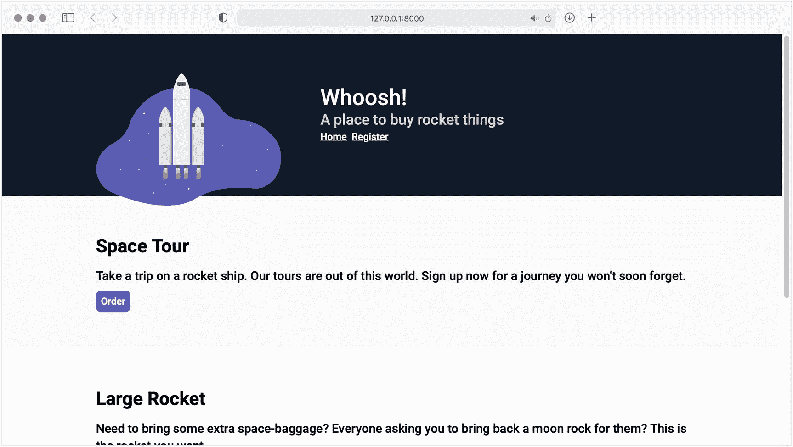
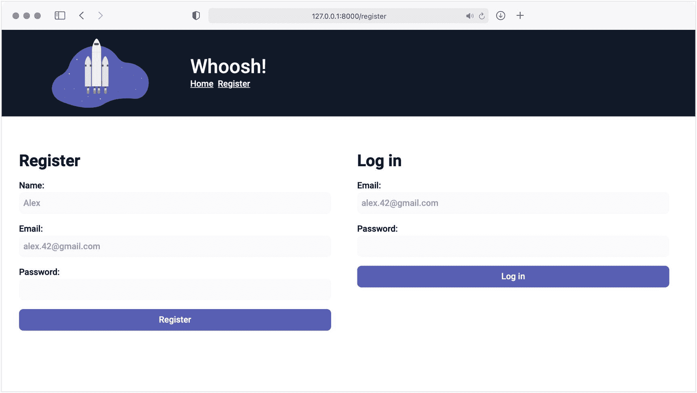
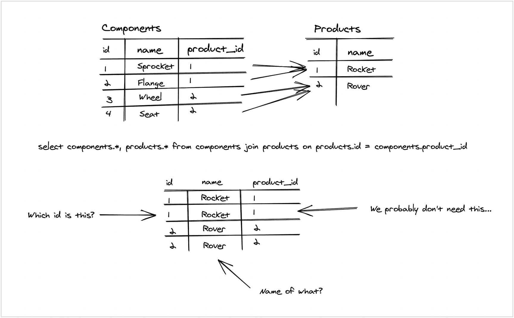
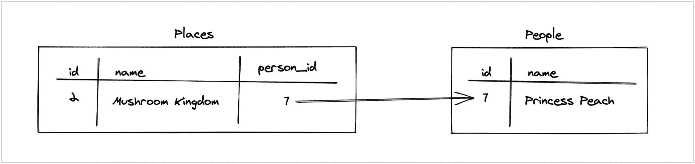
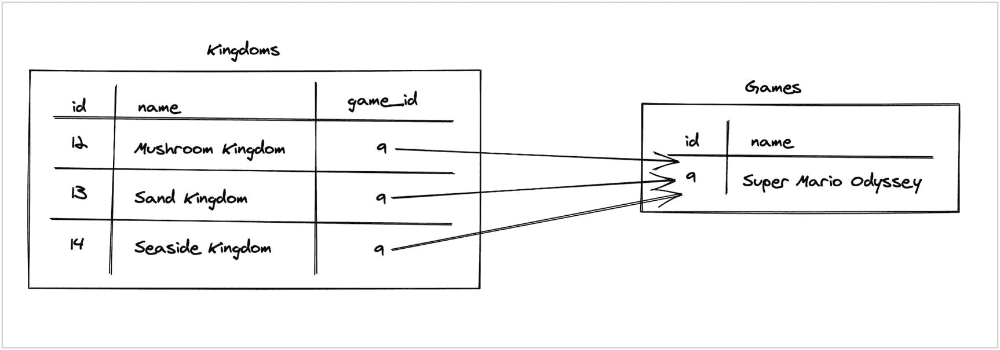
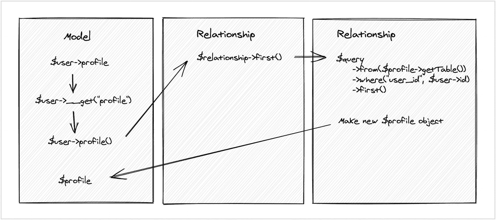

# 七、构建 ORM 库

在前一章中，我们为数据库工作打下了坚实的基础。我们有一个基于驱动的数据库的库，通过它我们可以以一种与引擎无关的方式执行 SQL 查询。

在这一章中，我们将更进一步。我们将构建一个对象关系映射器(或 ORM)库，将数据库行和表表示为 PHP 对象。

我们已经构建了足够的框架，然后嗖！我们可以对网站的设计和功能做很多改进。在本书中，我不会花时间去做这些，而是在两章之间开始做这些工作。

## 同时…

在我们深入 ORM 库之前，我想谈谈自上一章的代码以来发生了什么变化。

你可以在 [GitHub](https://github.com/assertchris/pro-php-mvc/tree/between-chapter-6-and-7) 上找到我将要讨论的变化的代码。对于章节之间出现的代码，我将遵循这种`between-chapter-x-and-y`模式。

### 重新设计的注册、主页和产品页面

我认为是时候改进这些页面的视觉设计了。我不是设计师，但我认为 Tailwind 提供了一系列工具来简化视觉设计。

我去了一趟 undraw.co，找到了一个火箭的插图，并创作了几个不同的“特征”包括。我还在主页上列出了产品，并添加了一个订购按钮…



新的主页设计

注册页面进行了改版，使用了更小的“特性”include，现在包括了一个登录表单。



新注册页面

最后，我更改了产品页面，增加了一张订单。它将需要一些登录只显示订单的认证用户，但它是在一个很好的地方，我们在它的工作。


新订单页面

### 新迁移标志和播种

我认为是时候在迁移中构建 products 表，并用示例产品填充它了。用示例数据填充迁移表的过程称为播种。这在代码中并没有很大的不同:

```php
use Framework\Database\Connection\Connection;

class SeedProducts
{
    public function migrate(Connection $connection)
    {
        $products = [
            [
                'name' => 'Space Tour',
                'description' => 'Take a trip on a rocket ship. Our tours are out of this world. Sign up now for a journey you won&apos;t soon forget.',
            ],
            [
                'name' => 'Large Rocket',
                'description' => 'Need to bring some extra space-baggage? Everyone asking you to bring back a moon rock for them? This is the rocket you want...',
            ],
            [
                'name' => 'Small Rocket',
                'description' => 'Space exploration is expensive. This rocket comes in under budget and atmosphere.',
            ],
        ];

        foreach ($products as $product) {
            $connection
                ->query()
                ->from('products')
                ->insert(['name', 'description'], $product);
        }
    }
}

```

这是来自`database/migrations/006_SeedProducts.php`。

这段代码依赖于对数据库结构和库的一些重要更改。添加产品表的迁移如下所示:

```php
use Framework\Database\Connection\Connection;

class CreateProductsTable
{
    public function migrate(Connection $connection)
    {
        $table = $connection->createTable('products');
        $table->id('id');
        $table->string('name');
        $table->text('description');
        $table->execute();
    }
}

```

这是来自`database/migrations/005_CreateProductsTable.php`。

下一个重大变化是引入了插入新数据库记录的方法:

```php
protected array $values;

public function insert(array $columns, array $values): int
{
    $this->type = 'insert';
    $this->columns = $columns;
    $this->values = $values;

    $statement = $this->prepare();

    return $statement->execute($values);
}

public function prepare(): PdoStatement
{
    // ...

    if ($this->type === 'insert') {
        $query = $this->compileInsert($query);
    }

    // ...
}

protected function compileInsert(string $query): string
{
    $joinedColumns = join(', ', $this->columns);
    $joinedPlaceholders = join(', ', array_map(fn($column) => ":{$column}", $this->columns));

    $query .= " INSERT INTO {$this->table} ({$joinedColumns}) VALUES ({$joinedPlaceholders})";

    return $query;
}

```

这是来自`framework/Database/QueryBuilder/QueryBuilder.php`。

这段代码与我们之前使用的 SQL“select”代码非常相似，但是它使用了 PDO 预准备语句的一个特性，其中通过使用占位符来插入值。以下 SQL 语句告诉 PDO 需要占位符中的值:

```php
INSERT INTO products (name, description) VALUES (:name, :description)

```

这些值通过以下代码发送:

```php
$sql = "...the above SQL statement";

$values = [
    'name' => $name,
    'description' => $description,
];

$affectedRows = $pdo->prepare($sql)->execute($values);

```

我还修改了`protected array $columns`属性以期望一个数组而不是一个字符串，并对`select`方法做了相应的修改。

手动删除表来验证这些更改有点烦人，所以我给`migrate`命令添加了一个新标志，所以我们现在可以开始了

```php
php command.php migrate --fresh

```

migrate 命令现在还创建了一个`migrations`表，以便迁移仅在尚未运行时才运行(或者如果存在`--fresh`标志):

```php
protected function configure()
{
    $this
        ->setDescription('Migrates the database')
        ->addOption('fresh', null, InputOption::VALUE_NONE, 'Delete all tables before running the migrations')
        ->setHelp('This command looks for all migration files and runs them');
}

protected function execute(InputInterface $input, OutputInterface $output)
{
    // ...get the migration files and connection

    if ($input->getOption('fresh')) {
        $output->writeln('Dropping existing database tables');

        $connection->dropTables();
        $connection = $this->connection();
    }

    if (!$connection->hasTable('migrations')) {
        $output->writeln('Creating migrations table');
        $this->createMigrationsTable($connection);
    }

    foreach ($paths as $path) {
        // ...run the migration

        $connection
            ->query()
            ->from('migrations')
            ->insert(['name'], ['name' => $class]);
    }

    return Command::SUCCESS;
}

private function createMigrationsTable(Connection $connection)
{
    $table = $connection->createTable('migrations');
    $table->id('id');
    $table->string('name');
    $table->execute();
}

```

这是来自`framework/Database/Command/MigrateCommand.php`。

这意味着我还必须向`Connection`类添加方法，以找到表并删除它们:

```php
/**
 * Return a list of table names on this connection
 */
abstract public function getTables(): array;

/**
 * Find out if a table exists on this connection
 */
abstract public function hasTable(string $name): bool;

/**
 * Drop all tables in the current database
 */
abstract public function dropTables(): int;

```

这是来自`framework/Database/Connection/Connection.php`。

这些方法因数据库引擎而异，所以如果您感兴趣的话，可以看看`MysqlConnection`和`SqliteConnection`是如何实现这些方法的。

`SqliteConnection->dropTables`方法有一个警告:只有当文件路径不是`:memory:`时，它才会删除表。你看，有可能有一个内存中的 SQLite 数据库，它不存储在文件系统中，并且需要一个更复杂的`dropTables`实现。

### 验证错误和会话

我还对验证错误处理做了一个小改动。现在可以选择在会话中存储错误的名称。这使得在同一页面上有多个表单并分别显示表单错误成为可能。

### 控制器

为了更好地设计表单，我不得不修改一些控制器代码。这主要是一个将`csrf`调用移动到控制器(以便它们可以在同一页面上的多个表单中使用)并从控制器发送表单动作(路由)的过程。

我还添加了一种向`QueryBuilder`类发送“where”子句的方法，并改变了单行的返回方式:

```php
protected array $wheres = [];

public function all(): array
{
    $statement = $this->prepare();
    $statement->execute($this->getWhereValues());

    return $statement->fetchAll(Pdo::FETCH_ASSOC);
}

protected function getWhereValues(): array
{
    $values = [];

    if (count($this->wheres) === 0) {
        return $values;
    }

    foreach ($this->wheres as $where) {
        $values[$where[0]] = $where[2];
    }

    return $values;
}

public function prepare(): PdoStatement
{
    $query = '';

    if ($this->type === 'select') {
        $query = $this->compileSelect($query);
        $query = $this->compileWheres($query);
        $query = $this->compileLimit($query);
    }

    // ...
}

protected function compileWheres(string $query): string
{
    if (count($this->wheres) === 0) {
        return $query;
    }

    $query .= ' WHERE';

    foreach ($this->wheres as $i => $where) {
        if ($i > 0) {
            $query .= ', ';
        }

        [$column, $comparator, $value] = $where;

        $query .= " {$column} {$comparator} :{$column}";
    }

    return $query;
}

public function first(): array
{
    $statement = $this->take(1)->prepare();
    $statement->execute($this->getWhereValues());

    $result = $statement->fetchAll(Pdo::FETCH_ASSOC);

    if (count($result) === 1) {
        return $result[0];
    }

    return null;
}

```

这是来自`framework/Database/QueryBuilder/QueryBuilder.php`。

这使用相同的“:placeholder”语法来定义 where 子句。我们可以提供许多类似的功能，以便更容易地处理空值和“likes”等等。

这些是自上一章以来的重大变化。花些时间浏览一下代码，看看我是如何解决上一章末尾为您设置的挑战的。

## 为什么不仅仅是数据库的库呢？

正如你所看到的，从上一章和我从那以后所做的工作来看，数据库的库已经相当强大了。当然，我们可以把它包装得更好一点——这样当我们想要一个新的连接时就没有那么多样板文件了——但是它已经很好地使用和扩展了。

那么，为什么我们还需要更多呢？

作为 PHP 开发人员，我们所做的大部分工作都涉及到从数据库中存储和检索数据。这分两个阶段发生:

1.  从数据库中提取数据或向其中写入数据

2.  转换需要写入数据库或刚从数据库中读取的数据

除此之外，我们经常需要通过外键对数据库数据的相关位进行分组。关系数据库引擎通常提供一种基于这些类型的关系进行选择的方法，但是它们不能以一种有用的方式表示相关的行。



令人困惑的查询…

虽然更复杂的查询确实有助于避免这种令人困惑的情况(以及随之而来的 SQL 查询错误)，但是访问两种相关的数据类型并没有那么困难。

如果有一些东西可以对数据库行进行查询，并返回代表每个数据库行的单独的数据类型(或对象),那就更好了。

这些对象也可以表示对象列表(映射到底层数据库行)，但是我们可以利用 PHP 结构(比如迭代器和 getter/setter)来简化底层行的操作。

我们的数据库的库非常适合从数据库中提取数据和向数据库中写入数据，但是它的职责没有扩展到将行(和相关的行)表示为 PHP 对象。

这就是术语“对象关系映射器”的由来。ORM 的核心是表示对象(表示数据库行)之间的关系。

我们可以写几本书来介绍构建 ORM 的业务，所以将我们的努力限制在几个核心特性上是明智的:

1.  一个抽象的基础 PHP `Model`类，每个“数据类型”都可以扩展和定制。

2.  `Model`应该能够通过 SQL“where”子句找到多条记录或一行。

3.  `Model`应该提供对行的底层属性的对象访问，以及为属性定义 getters 或 setters 的能力。

4.  `Model`应该能够判断它是一个新行(将要创建)还是一个现有行的表示。

5.  应插入新行；现有的行表示应该更新现有的行。

6.  `Model`应该允许将行值转换为非字符串类型。

7.  `Model`应该允许检索简单的关系数据(比如“有一个”、“有许多”和“属于”)。

### “有……一个吗？”

这些关系类型并不特定于 PHP 或 ORM，但是理解它们很重要。当链接数据库行时，我们可以根据数据的定义和含义来描述它们之间的关系。

“有一个”关系是您关心的行在另一行(甚至可能是另一个表中的一行)中被引用的一种方式。一个例子可能会有所帮助:

1.  桃子公主是蘑菇王国的统治者。

2.  蘑菇王国属于桃子公主。

3.  所以桃公主“有一个”王国。

    我们从历史中知道，统治者可以统治多个王国。在 Peach 公主统治多个王国的情况下，我们可能需要将这种关系表示为一对多。一个桃公主**到多个**王国…

它可以用以下数据库结构表示:



“有一个”关系

“属于”关系正好相反。我们说桃子公主“有一个”蘑菇王国，但我们也可以说蘑菇王国“属于”桃子公主。

“多”关系是指多行属于一行。



“有很多”

这种关系有点不同:

1.  超级马里奥奥德赛发生在几个不同的王国。

2.  每个王国“属于”游戏超级马里奥奥德赛。

3.  超级马里奥奥德赛“有很多”王国。

    这些王国也有可能出现在多个游戏中，在这种情况下，这种关系将成为多对多的关系。**多个**王国**隶属于多个**游戏。我们不打算冒险深入 ORM 中的关系，因为实现起来很复杂，而且收益很少。

## 把它放在一起

让我们从抽象基类`Model`开始。我们可以让它设置默认连接，并为订单和产品创建几次子类:

```php
namespace Framework\Database;

use Framework\Database\Connection\Connection;
use Framework\Database\Connection\MysqlConnection;
use Framework\Database\Connection\SqliteConnection;
use Framework\Database\Exception\ConnectionException;

abstract class Model
{
    protected Connection $connection;

    public function setConnection(Connection $connection): static
    {
        $this->connection = $connection;
        return $this;
    }

    public function getConnection(): Connection
    {
        if (!isset($this->connection)) {
            $factory = new Factory();

            $factory->addConnector('mysql', function($config) {
                return new MysqlConnection($config);
            });

            $factory->addConnector('sqlite', function($config) {
                return new SqliteConnection($config);
            });

            $config = require basePath() . 'config/database.php';

            $this->connection = $factory->connect($config[$config['default']]);
        }

        return $this->connection;
    }
}

```

这是来自`framework/Database/Model.php`。

我们添加的第一个方法允许覆盖模型将使用的数据库连接，但也提供了一个默认的连接。这将为我们节省相当多的样板文件。

当涉及到建立新的数据库连接时，它仍然不是最终的解决方案，但是我们将在下一章看到它是什么样子的！

我们可以用自定义数据类型扩展这个`Model`类:

```php
namespace App\Models;

use Framework\Database\Model;

class Product extends Model
{
}

```

这是来自`app/Models/Product.php`。

现在，我们可以使用下面的代码访问默认的数据库连接:

```php
(new Product())->getConnection()

```

接下来，我们需要弄清楚哪个数据库表应该用于`Product`模型。我们可以从类名中推断出表名，但我认为我们可以明确地说明这一点:

```php
protected string $table;

public function setTable(string $table): static
{
    $this->table = $table;
    return $this;
}

public function getTable(): string
{
    if (!isset($this->table)) {
        throw new Exception('$table is not set and getTable is not defined');
    }

    return $this->table;
}

```

这是来自`framework/Database/Model.php`。

我认为表名最好是显式的，因为这使得系统总体上更加灵活——因为覆盖显式的表名更容易。它还通过自动化导致更少的混乱和错误(像奇数单数到复数的转换情况)。

这意味着我们的产品类可以覆盖`getTable`方法(如果它需要动态确定一个表名)或者定义一个`$table`属性:

```php
namespace App\Models;

use Framework\Database\Model;

class Product extends Model
{
    protected string $table = 'products';
}

```

这是来自`app/Models/Product.php`。

让我们也为一个`Model`创造一种方法，用一系列属性来水合:

```php
protected array $attributes;

public static function with(array $attributes = []): static
{
    $model = new static();
    $model->attributes = $attributes;

    return $model;
}

```

这是来自`framework/Database/Model.php`。

## 绑定到查询构建器

现在，我们可以将一行或多行装载到这些数据库对象中。我们使用我在章节和我插入到表格中的三行之间创建的`005_CreateProductsTable.php`迁移:

```php
public function all(): array
{
    if (!isset($this->type)) {
        $this->select();
    }

    // ...
}

public function first(): array
{
    if (!isset($this->type)) {
        $this->select();
    }

    // ...
}

public static function query(): mixed
{
    $model = new static();

    return $model->getConnection()->query()
        ->from($model->getTable());
}

public static function __callStatic(string $method, array $parameters = []): mixed
{
    return static::query()->$method(...$parameters);
}

```

这是来自`framework/Database/Model.php`。

这个`__callStatic`方法意味着我们可以调用我们的`Product`类上的任何`QueryBuilder`方法，并且该方法将被转发给查询构建器的一个实例。例如，使用章节间实现的`all`方法，我们可以获取所有产品:

```php
Product::all();
// → [['id' => '1', 'name' => 'Large Rocket', ...], ...]

```

我们甚至可以使用“where”子句找到单行:

```php
Product::where('id', 1)->first();
// → ['id' => '1', 'name' => 'Large Rocket', ...]

```

这很好，但是它没有将行作为模型对象提供给我们，所以我们需要弄清楚如何做到这一点。一种方法是为我们的每个数据类型创建一个子类`MysqlQueryBuilder`和`SqliteQueryBuilder`，并在我们的每个定制模型类型中覆盖`newQuery`。

对我来说，那听起来像是许多可怕的工作。相反，我们可以定义一个装饰类来打包我们的行:

```php
namespace Framework\Database;

use Framework\Database\QueryBuilder\QueryBuilder;

class ModelCollector
{
    private QueryBuilder $builder;
    private string $class;

    public function __construct(QueryBuilder $builder, string $class)
    {
        $this->builder = $builder;
        $this->class = $class;
    }

    public function __call(string $method, array $parameters = []): mixed
    {
        $result = $this->builder->$method(...$parameters);

        // in case it's a fluent method...
        if ($result instanceof QueryBuilder) {
            $this->builder = $result;
            return $this;
        }

        return $result;
    }

    public function first()
    {
        $class = $this->class;

        $row = $this->builder->first();

        if (!is_null($row)) {
            $row = $class::with($row);
        }

        return $row;
    }

    public function all()
    {
        $class = $this->class;

        $rows = $this->builder->all();

        foreach ($rows as $i => $row) {
            $rows[$i] = $class::with($row);
        }

        return $rows;
    }
}

```

这是来自`framework/Database/ModelCollector.php`。

这个装饰器获取了一个`QueryBuilder`的实例和一个模型的类名，这样它就可以拦截所有对`first`和`all`方法的调用，并且每次都返回水合模型。当我们创建新的查询时，我们需要使用这个“收集器”:

```php
public static function query(): ModelCollector|QueryBuilder
{
    $model = new static();
    $query = $model->getConnection()->query();

    return (new ModelCollector($query, static::class))
        ->from($model->getTable());
}

```

这是来自`framework/Database/Model.php`。

当我们查询产品行时，它们现在将是`Product`实例，而不是数组:

```php
Product::all();
// → [object(App\Models\Product), ...]

Product::where('id', 1)->first();
// → object(App\Models\Product)

```

### Getters 和 Setters

这比使用普通的旧数组要好得多。我们引入了一个新的问题，那就是我们不再能够容易地获得行属性。我们需要创建一个通用的 getter 方法，以便可以使用对象查找语法来访问属性:

```php
public function __get(string $property): mixed
{
    if (isset($this->attributes[$property])) {
        return $this->attributes[$property];
    }

    return null;
}

public function __set(string $property, $value)
{
    $this->attributes[$property] = $value;
}

```

这是来自`framework/Database/Model.php`。

您可能想更进一步，当`__get`方法试图查找数据库行中不存在的属性时，或者当`__set`方法试图设置未知行的值时，您可能会抛出异常。我认为，要正确地做到这一点，我们需要存储数据库行的原始列名，或者在每个模型类中有一个已知列的列表…

给定这些`__set`和`__get`方法，我们现在可以使用对象查找语法来访问属性:

```php
Product::where('id', 1)->first()->name;
// → 'Large Rocket'

```

如果我们想让`Product`定义自定义的 getters 和 setters，会怎么样呢？让我们定义一个以大写字母开始每个单词的`name` getter 和一个将描述字符数限制为 50 的`description` setter:

```php
protected function setDescriptionAttribute(string $value)
{
    $limit = 50;
    $ending = '...';

    if (mb_strwidth($value, 'UTF-8') <= $limit) {
        return $value;
    }

    return rtrim(mb_strimwidth($value, 0, $limit, '', 'UTF-8')) . $ending;
}

```

这是来自`app/Models/Product.php`。

用`Attribute`作为这些方法的后缀更安全一些，因为我们在下面的代码片段中动态地组合了它们的名称。“属性”与数据库行属性数组的内部名称相关。

我们需要根据被访问的属性的名称来判断是否应该调用这些方法:

```php
public function __get(string $property): mixed
{
    $getter = 'get' . ucfirst($property) . 'Attribute';

    if (method_exists($this, $getter)) {
        return $this->$getter($this->attributes[$property] ?? null);
    }

    if (isset($this->attributes[$property])) {
        return $this->attributes[$property];
    }

    return null;
}

public function __set(string $property, $value)
{
    $setter = 'set' . ucfirst($property) . 'Attribute';

    if (method_exists($this, $setter)) {
        $this->attributes[$property] = $this->$setter($value);
    }

    $this->attributes[$property] = $value;
}

```

这是来自`framework/Database/Model.php`。

这些神奇的方法检查名为`get*Attribute`和`set*Attribute`的方法是否存在，而是调用它们。如果我们愿意，我们仍然可以在我们的 getters 和 setters 中访问`$this->attributes`,但是大多数时候我们只需要设置或查找一个值。

### 插入、更新和删除

判断我们是否需要插入或更新的最简单的方法是检查是否存在一个`id`属性。不过，我们确实需要给`QueryBuilder`添加一个更新和删除方法。让我们从更新方法开始:

```php
public function prepare(): PdoStatement
{
    // ...

    if ($this->type === 'update') {
        $query = $this->compileUpdate($query);
        $query = $this->compileWheres($query);
    }

    // ...
}

protected function compileUpdate(string $query): string
{
    $joinedColumns = '';

    foreach ($this->columns as $i => $column) {
        if ($i > 0) {
            $joinedColumns .= ', ';
        }

        $joinedColumns = " {$column} = :{$column}";
    }

    $query .= " UPDATE {$this->table} SET {$joinedColumns}";

    return $query;
}

public function update(array $columns, array $values): int
{
    $this->type = 'update';
    $this->columns = $columns;
    $this->values = $values;

    $statement = $this->prepare();

    return $statement->execute($this->getWhereValues() + $values);
}

```

这是来自`framework/Database/QueryBuilder/QueryBuilder.php`。

我们遵循与我们用于“where”和“insert”子句的代码相似的模式，包括准备好的语句中值的占位符。

SQL“update”子句插入语句的语法略有不同:

```php
UPDATE products SET field = :field WHERE id = :id

```

一些引擎支持更接近“插入”子句语法的替代语法，但它不像这个标准版本那样可跨引擎移植。

使用这个新的`update`方法，我们可以更新`Model`类来拥有一个通用的`save`方法:

```php
protected array $dirty = [];

public function __set(string $property, $value)
{
    $setter = 'set' . ucfirst($property) . 'Attribute';

    array_push($this->dirty, $property);

    // ...
}

public function save(): static
{
    $values = [];

    foreach ($this->dirty as $dirty) {
        $values[$dirty] = $this->attributes[$dirty];
    }

    $data = [array_keys($values), $values];

    $query = static::query();

    if (isset($this->attributes['id'])) {
        $query
            ->where('id', $this->attributes['id'])
            ->update(...$data);

        return $this;
    }

    $query->insert(...$data);

    $this->attributes['id'] = $query->getLastInsertId();
    $this->dirty = [];

    return $this;
}

```

这是来自`framework/Database/Model.php`。

如果我们将完整的`$attributes`属性传递给`update`和`insert`方法，我们可能会保存没有改变的字段。

相反，我们可以使用`$dirty`数组来存储已经更改的字段的名称。这意味着我们将只发送已经设置或更改的字段的数据。

我们需要确保将新创建的行的 ID 存储回模型对象中，以便后续对`save`方法的调用执行更新而不是插入。

为此，我们需要添加一个方法来将先前插入的行返回到`QueryBuilder`类:

```php
public function getLastInsertId(): string
{
    return $this->connection->pdo()->lastInsertId();
}

```

这是来自`framework/Database/QueryBuilder/QueryBuilder.php`。

我们可以使用它来获取和存储新创建的行的 ID:

```php
public function save(): static
{
    // ...

    $query->insert(...$data);

    $this->attributes['id'] = $query->getLastInsertId();

    return $this;
}

```

这是来自`framework/Database/Model.php`。

这段代码非常好用！我们可以使用非常相似的代码创建或更新行(而不关心下面使用的是什么 SQL 查询):

```php
$product = Product::where('id', 1)->first();
$product->description = 'This is a new, better description';
$product->save();
// → updated existing database row

$product = new Product();
$product->name = 'A whole new product';
$product->description = 'The best description in the world';
$product->save();
// → created new database row and set $product->id

```

现在，让我们把注意力集中在从数据库中删除行上。我们需要几个新方法:一个在`QueryBuilder`上，另一个在`Model`上:

```php
public function prepare(): PdoStatement
{
    // ...

    if ($this->type === 'delete') {
        $query = $this->compileDelete($query);
        $query = $this->compileWheres($query);
    }

    // ...
}

protected function compileDelete(string $query): string
{
    $query .= " DELETE FROM {$this->table}";
    return $query;
}

public function delete(): int
{
    $this->type = 'delete';

    $statement = $this->prepare();

    return $statement->execute($this->getWhereValues());
}

```

这是来自`framework/Database/QueryBuilder/QueryBuilder.php`。

“删除”子句不需要数据或列。它们甚至不需要“where”子句，但是没有子句就使用它们是不明智的。不过这没关系，因为`Model->delete`方法将总是定义一个(或无操作):

```php
public function delete(): static
{
    if (isset($this->attributes['id'])) {
        static::query()
            ->where('id', $this->attributes['id'])
            ->delete();
    }

    return $this;
}

```

这是来自`framework/Database/Model.php`。

如果一行在保存之前被删除，抛出异常也是有效的，但是我们至少应该确保没有向数据库发送不受约束的“delete”子句。

我们的实现不能很好地处理先调用`delete`方法，然后再调用`save`方法的情况。我们可能想让“保存”成为一个无操作，或者抛出一个异常，表明一个被删除的模型不能被再次保存。

### 铸造值

大多数数据库引擎以字符串格式返回数据。让我们添加一些代码，将每一列的值转换为适当的类型。我们可以在`Model`类中这样做:

```php
public function __get(string $property): mixed
{
    $getter = 'get' . ucfirst($property) . 'Attribute';

    $value = null;

    if (method_exists($this, $getter)) {
        $value = $this->$getter($this->attributes[$property] ?? null);
    }

    if (isset($this->attributes[$property])) {
        $value = $this->attributes[$property];
    }

    if (isset($this->casts[$property]) && is_callable($this->casts[$property])) {
        $value = $this->casts[$property]($value);
    }

    return $value;
}

```

这是来自`framework/Database/Model.php`。

我们已经交换了东西，这样我们得到的任何值都可以通过一个可调用的东西传递，在`$casts`属性中设置。用一个例子解释就简单一点了。假设我们想将一个产品的 ID 值转换成一个整数；我们可以定义一个可调用函数，并将其设置在`$casts`属性上:

```php
namespace App\Models;

use Framework\Database\Model;

function toInt($value): int
{
    return (int) $value;
}

class Product extends Model
{
    protected array $casts = [
        'id' => 'App\Models\toInt',
    ];

    // ...
}

```

这是来自`app/Models/Product.php`。

ID 属性的值将通过这个`toInt`函数传递，然后通过对象访问(`$obj->id`)返回。我们可以在框架帮助器中定义强制转换函数，甚至扩展这些代码来识别和使用类而不是函数。不过，我认为这已经足够好了…

### 关系

我想处理的最后一点代码是管理简单的关系。考虑以下示例:

```php
$user = new User();
$user->email = "cgpitt@gmail.com";
$user->save();

$profile = new Profile();
$profile->user_id = $user->id;
$profile->save();

$user->profile;
// → object(App\Models\Profile)

```

我想让这种代码工作。它表示“有一个”类型的关系，因为用户“有一个”简档。

让我们在`Model`上定义一个方法，我们可以用它来表示这种关系，然后看看如何使用这个方法:

```php
public function hasOne(string $class, string $foreignKey, string $primaryKey = 'id'): mixed
{
    $model = new $class;
    $query = $class::query()->from($model->getTable())->where($foreignKey, $this->attributes['id']);

    return new Relationship($query, 'first');
}

```

这是来自`framework/Database/Model.php`。

表示关系的一种简单方法是部分完成的查询。这里，我们开始构建一个关于相关数据的查询。`Relationship`类看起来像这样:

```php
namespace Framework\Database;

use Framework\Database\ModelCollector;

class Relationship
{
    public ModelCollector $collector;
    public string $method;

    public function __construct(ModelCollector $collector, string $method)
    {
        $this->collector = $collector;
        $this->method = $method;
    }

    public function __invoke(array $parameters = []): mixed
    {
        return $this->collector->$method(...$parameters);
    }

    public function __call(string $method, array $parameters = []): mixed
    {
        return $this->collector->$method(...$parameters);
    }
}

```

这是来自`framework/Database/Relationship.php`。

只是个装修工。所有的方法调用都被传递给底层的`ModelCollector`实例——这是静态的`query`方法返回的结果——关系实例也可以像函数一样被调用。这意味着我们可以通过以下方式使用这种关系:

```php
$user = new User();
$user->email = 'cgpitt@gmail.com';
$user->save();

$profile = new Profile();
$profile->user_id = $user->id;
$profile->save();

$user->profile()->first();
// → object(App\Models\Profile)

// or

$relationship = $user->profile();
$relationship()->first();
// → object(App\Models\Profile)

```

我们存储额外的`$method`属性，因为它告诉我们如果与对象访问一起使用，如何解析查询。让我告诉你我的意思。让我们修改一下`Model->__get`方法:

```php
public function __get(string $property): mixed
{
    $getter = 'get' . ucfirst($property) . 'Attribute';

    $value = null;

    if (method_exists($this, $property)) {
        $relationship = $this->$property();
        $method = $relationship->method;

        $value = $relationship->$method();
    }

    // ...
}

```

这是来自`framework/Database/Model.php`。

这意味着我们现在可以用下面的代码访问相关的模型:

```php
$user = new User();
$user->email = 'cgpitt@gmail.com';
$user->save();

$profile = new Profile();
$profile->user_id = $user->id;
$profile->save();

$user->profile;
// → object(App\Models\Profile)

```



关系调用图

让我们扩展这些关系来表示“有许多”和“属于”关系类型:

```php
public function hasMany(string $class, string $foreignKey, string $primaryKey = 'id'): mixed
{
    $model = new $class;
    $query = $class::query()->from($model->getTable())->where($foreignKey, $this->attributes['id']);

    return new Relationship($query, 'all');
}

public function belongsTo(string $class, string $foreignKey, string $primaryKey = 'id'): mixed
{
    $model = new $class;
    $query = $class::query()->from($model->getTable())->where($primaryKey, $this->attributes[$foreignKey]);

    return new Relationship($query, 'first');
}

```

这是来自`framework/Database/Model.php`。

这些方法可用于在各自的模型中定义新的关系类型:

```php
namespace App\Models;

use Framework\Database\Model;

class Order extends Model
{
    protected string $table = 'orders';

    public function user(): mixed
    {
        return $this->belongsTo(User::class, 'user_id');
    }
}

```

这是来自`app/Models/Order.php`。

```php
namespace App\Models;

use Framework\Database\Model;

class Profile extends Model
{
    protected string $table = 'profiles';

    public function user(): mixed
    {
        return $this->belongsTo(User::class, 'user_id');
    }
}

```

这是来自`app/Models/Product.php`。

```php
namespace App\Models;

use Framework\Database\Model;

class User extends Model
{
    protected string $table = 'users';

    public function profile(): mixed
    {
        return $this->hasOne(Profile::class, 'user_id');
    }

    public function orders(): mixed
    {
        return $this->hasMany(Order::class, 'user_id');
    }
}

```

这是来自`app/Models/User.php`。

我认为，我们能够对现有的`Model`和`QueryBuilder`类进行如此少的调整就能表示这些关系，这是很不可思议的。

### 属性呢

PHP 8.0 的一个引人入胜的特性是定义和使用属性的能力。它们看起来有点像注释(因此会被旧版本的 PHP 忽略)，但是它们可以通过不同类型的反射来访问。

假设我们希望允许用户将他们的模型的表定义为一个属性，可能使用如下代码:

```php
#[Table('users')]
class User extends Model
{
    public function profile(): mixed
    {
        return $this->hasOne(Profile::class, 'user_id');
    }

    public function orders(): mixed
    {
        return $this->hasMany(Order::class, 'user_id');
    }
}

```

我们实际上可以深入到这个类的属性中，并从那里获得表名。让我们在`Model`课堂上试试:

```php
public function getTable(): string
{
    if (!isset($this->table)) {
        $reflector = new ReflectionClass(static::class);

        foreach ($reflector->getAttributes() as $attribute) {
            if ($attribute->getName() == TableName::class) {
                return $attribute->getArguments()[0];
            }
        }

        throw new Exception('$table is not set and getTable is not defined');
    }

    return $this->table;
}

```

这是来自`framework/Database/Model.php`。

我们还需要定义这个属性——因为所有属性都需要定义为类:

```php
namespace Framework\Database;

#[Attribute]
class TableName
{
    public string $name;

    public function __construct(string $name)
    {
        $this->name = $name;
    }
}

```

这是来自`framework/Database/TableName.php`。

我认为这是一个有趣的属性用法，但是注意不要过度使用属性，因为这会导致大量的搜索，当人们想知道属性在幕后做什么的时候。

使用方法覆盖(这是我们用于`getTable`的方法)，非常清楚表名是如何以及在哪里生成的。属性格式不太好。

我不想让人觉得我不喜欢属性。我认为同样的问题(过度使用)也适用于魔法方法。在这个 ORM 代码中，我们甚至可能已经用神奇的方法跨过了那条线。

我认为衡量属性和魔法方法使用的一个很好的标准是它们是否可以在保持一个灵活和易于理解的系统的同时被使用。当代码更难更改或理解时，这是一个信号，表明我们应该审查和重构我们的代码，以使用更少的魔法。

## 警告

以下是您在框架和应用中需要克服的更多挑战:

1.  我们目前正在几个地方对`id`列名进行硬编码。如果这是我们可以忽略的东西，那就更酷了…

2.  我们仍然在控制器中使用旧的`QueryBuilder`代码。

3.  我们可以围绕`$this->attributes['id']`做更多的类型检查，以确保我们处理的是数字 id。

4.  我认为我们用得太多了。如何更好地定义返回类型，甚至通过联合类型？

我将在这一章和下一章之间解决其中的一些问题，所以在阅读下一章之前，一定要尝试任何你感兴趣的东西。

## 职业选手是如何做到的

本章中的 ORM 代码在很大程度上受到了 Laravel 的 ORM 开发经验的启发。它不像雄辩那样功能丰富，并且做一些不同的小事情(比如如何处理造型和定义关系)，但是对于 Laravel 开发人员来说感觉很熟悉。

Laravel 有一组更广泛的关系可以定义，比如“属于许多”和“多态”关系。我认为它们是很棒的特性，但是在这一章中它们可能还需要 20 页才能实现。

雄辩术不使用属性，也不使用之前广泛使用的属性形式——phpDoc 注释。大多数配置都是通过属性和覆盖来完成的，如本章所述。

雄辩术和 Laravel 数据库紧密地交织在一起，数据库具有丰富的特性。例如，关于 where 子句的文档非常多。

concertive 在构建 concertive 查询时重用了这一底层数据库功能(与我们在本章中所做的方式类似)，但是数据库的库的所有附加功能都可以在 concertive 模型上使用。

口才还提供了所谓的渴望加载和懒惰加载的功能。这些规避了我们构建的 ORM 中的一个问题，称为 N+1 问题。

不涉及太多细节，我们采用的方法可能会导致在获取相关记录时出现大量查询。急切加载通过执行尽可能少的查询并将相关记录链接到内存中来防止这种情况。

只有在需要的时候，惰性加载才尽可能多地完成(从数据库查询的)工作。

### ORM 理论

教条是库的集合的组织，最流行的是教条形式。Doctrine 也有一个数据库的库，ORM 就是在这个基础上构建的。

ORM 和 convention 之间的主要区别在于，前者更喜欢一种叫做实体管理的方法，而后者更喜欢配置而不是约定。

实体管理是一个过程，通过这个过程，对象被一次保存到数据库中，而不是通过它们自己的逻辑。也许我可以用一些伪代码来更好地说明这种区别:

```php
// in eloquent
$product = new Product();
$product->name = 'ACME product';
$product->save();

// in doctrine orm
$product = new Product();
$product->name = 'ACME product';

$manager = new EntityManager();
$manager->persist($product);
$manager->flush();

```

口才比配置更喜欢约定，所以在开始之前需要设置的东西要少得多，但是也有很多关于您希望数据如何显示以及逻辑如何工作的假设。

事实上，雄辩的模型看起来与教条模型非常不同。教条模型中几乎没有魔法，而雄辩模型却非常神奇。

## 摘要

这是对构建 ORM 过程的一次有益的深入探索。我希望你和我一样感到兴奋。这可能是我们将在本书中涉及的最复杂的主题，所以如果您需要额外的时间来理解我们所涉及的内容，请不要难过。

在下一章中，我们将解决样板文件的问题，因为我们要构建自己的服务定位器。