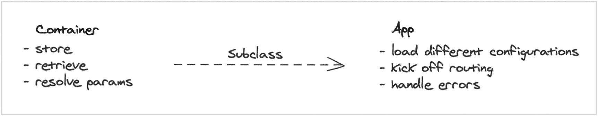

# 八、构建依赖注入容器

在前一章中，我们构建了一个非常棒的 ORM。有了它，我们可以将数据库工作提升到一个全新的水平。它应该给你很多东西去修补和思考。

在这一章中，我们将致力于消除样板文件，使系统不同部分之间的依赖关系更容易共享。

## 课间休息时…

在我们开始构建依赖注入容器之前，我们要回顾一下我在章节之间对网站做的一些改进。

最大的变化是将数据库的库代码换成了 ORM 代码。这是之前版本的样子:

```php
$factory = new Factory();

$factory->addConnector('mysql', function($config) {
    return new MysqlConnection($config);
});

$factory->addConnector('sqlite', function($config) {
    return new SqliteConnection($config);
});

$config = require __DIR__ . '/../../../config/database.php';

$connection = $factory->connect($config[$config['default']]);

$products = $connection
    ->query()
    ->select()
    ->from('products')
    ->all();

$productsWithRoutes = array_map(fn($product) => array_merge($product, [
    'route' => $this->router->route('view-product', ['product' => $product['id']]),
]), $products);

```

这是来自`app/Http/Controllers/ShowHomePageController.php`。

这是新版本的样子:

```php
$products = Product::all();

$productsWithRoutes = array_map(function($product) {
    $product->route = $this->router->route('view-product', ['product' => $product->id]);
    return $product;
}, $products);

```

这是来自`app/Http/Controllers/ShowHomePageController.php`。

不可否认，这在很大程度上减少了建立新数据库连接的样板代码。这些代码已经移到了模型类中，但是它将再次移到本章中。

对模型的这种改变意味着在模板中使用对象访问:

```php
@extends('layout') @includes('includes/large-feature') @foreach($products as $i
=> $product)
<div
  class="
        z-10
        @if($i % 2 === 0)
            bg-gray-50
        @endif
    "
>
  <div class="container mx-auto px-8 py-8 md:py-16">
    <h2 class="text-3xl font-bold">{{ $product->name }}</h2>
    <p class="text-xl my-4">{!! $product->description !!}</p>
    <a
      href="{{ $product->route }}"
      class="bg-indigo-500 rounded-lg p-2 text-white"
    >
      Order
    </a>
  </div>
</div>
@endforeach

```

这是来自`resources/views/home.advanced.php`。

在产品视图页面上，我们需要根据路线参数获取单个产品。我在`Model`类中添加了一个方法来更快地完成这项工作:

```php
public static function find(int $id): static
{
    return static::where('id', $id)->first();
}

```

这是来自`framework/Database/Model.php`。

这使得控制器看起来像这样:

```php
public function handle()
{
    $parameters = $this->router->current()->parameters();

    $product = Product::find((int) $parameters['product']);

    return view('products/view', [
        'product' => $product,
        'orderAction' => $this->router->route('order-product', ['product' => $product->id]),
        'csrf' => csrf(),
    ]);
}

```

这是来自`app/Http/Controllers/Products/ShowProductController.php`。

在涉及数据库的应用中,`find`是非常有用和常见的操作。

最后，我认为人们可以注册新账户并使用这些账户登录会很酷。用户注册对于商业应用来说是必不可少的。

注册和登录控制器如下所示:

```php
public function handle()
{
    // check the csrf token...
    secure();

    $data = validate($_POST, [
        'name' => ['required'],
        'email' => ['required', 'email'],
        'password' => ['required', 'min:10'],
    ], 'register_errors');

    $user = new User();
    $user->name = $data['name'];
    $user->email = $data['email'];
    $user->password = password_hash($data['password'], PASSWORD_DEFAULT);
    $user->save();

    // store a variable to show a message to the user...
    $_SESSION['registered'] = true;

    return redirect($this->router->route('show-home-page'));
}

```

这是来自`app/Http/Controllers/Users/RegisterUserController.php`。

`password_hash`是 PHP 的一个相对较新的补充。它提供了一种便捷的方式来生成加密的强密码。 [Bcrypt](https://en.wikipedia.org/wiki/Bcrypt) 提供者生成一个 salt 并将其添加到散列中。

因为我们只存储散列，所以我们需要使用另一个内置函数来验证密码是否正确:

```php
public function handle()
{
    // check the csrf token...
    secure();

    $data = validate($_POST, [
        'email' => ['required', 'email'],
        'password' => ['required', 'min:10'],
    ], 'login_errors');

    $user = User::where('email', $data['email'])->first();

    if ($user && password_verify($data['password'], $user->password)) {
        $_SESSION['user_id'] = $user->id;
    }

    return redirect($this->router->route('show-home-page'));
}

```

这是来自`app/Http/Controllers/Users/LogInUserController.php`。

我没有记录登录/注册/注销成功或失败的消息，但是如果您感兴趣的话，可以随时继续。这就完成了认证工作，所以是时候开始依赖注入和服务定位了。

## 依赖注入容器是用来做什么的？

正如我们所看到的，在将大型应用和定制框架缝合在一起的过程中，涉及到许多样板文件。助手就是这样一个例子:

```php
function view(string $template, array $data = []): View\View
{
    static $manager;

    if (!$manager) {
        $manager = new View\Manager();

        // ...lots of manager setup
    }

    return $manager->resolve($template, $data);
}

```

这是来自`framework/helpers.php`。

我们有几个助手——就像这样——在那里我们创建和配置新的管理器。这个设置是必需的，但是它不应该存在于这些函数中。定制配置并不容易，测试起来大概也比较棘手。

另一个有问题的样板文件的例子可以在`Model`中找到:

```php
public function getConnection(): Connection
{
    if (!isset($this->connection)) {
        $factory = new Factory();

        $factory->addConnector('mysql', function($config) {
            return new MysqlConnection($config);
        });

        $factory->addConnector('sqlite', function($config) {
            return new SqliteConnection($config);
        });

        $config = require basePath() . 'config/database.php';

        $this->connection = $factory->connect($config[$config['default']]);
    }

    return $this->connection;
}

```

这是来自`framework/Database/Model.php`。

至少，如果在调用`getConnection`之前调用`setConnection`，或者在子类中覆盖`getConnection`，那么覆盖连接会更容易。

一个更微妙的例子在 routes 文件中:

```php
$router->add(
    'GET', '/',
    [new ShowHomePageController($router), 'handle'],
)->name('show-home-page');

```

这是来自`app/routes.php`。

我们需要在`ShowHomePageController`类中生成路由，所以我们将路由的一个实例传递给它。如果我们需要访问别的东西呢？在几章中，我们将构建会话、缓存和日志记录。这些都不是我们每次使用时想要创建的新实例。

如果我们可以键入提示方法参数并自动解析这些参数，岂不是更酷？想象一下这样的事情:

```php
public function handle(Request $request, Router $router, Session $session)
{
    secure();

    $data = $request->validate([
        'email' => ['required', 'email'],
        'password' => ['required', 'min:10'],
    ], 'login_errors');

    $user = User::where('email', $data['email'])->first();

    if ($user && password_verify($data['password'], $user->password)) {
        $session->put('user_id', $user->id);
    }

    return redirect($router->route('show-home-page'));
}

```

并不是我不喜欢 helper 函数，但它们真的应该更简洁，定制它们使用和返回的内容应该毫不费力。

以下是我希望我们的依赖注入容器具备的一些特性:

1.  一种存储(或绑定)依赖实例的方式

2.  检索(或解析)这些依赖实例的方法

3.  一种代理函数或方法调用的方式，以便可以在容器外解析类型提示的参数

4.  如何配置容器的一些结构

容器是框架的核心，但是我们需要将依赖注入部分与配置和加载部分分开。



容器和应用结构

随着我们的发展，这种设计的工作原理会变得更加清晰。

## 让我们开始建造吧！

前两个需求类似于我们以前编写的代码。我们可以创建两个数组:一个存储工厂函数，另一个存储这些工厂函数创建的东西:

```php
namespace Framework;

use InvalidArgumentException;

class Container
{
    private array $bindings = [];
    private array $resolved = [];

    public function bind(string $alias, callable $factory): static
    {
        $this->bindings[$alias] = $factory;
        $this->resolved[$alias] = null;

        return $this;
    }

    public function resolve(string $alias): mixed
    {
        if (!isset($this->bindings[$alias])) {
            throw new InvalidArgumentException("{$alias} is not bound");
        }

        if (!isset($this->resolved[$alias])) {
            $this->resolved[$alias] = call_user_func($this->bindings[$alias], $this);
        }

        return $this->resolved[$alias];
    }
}

```

这是来自`framework/Container.php;`。

我希望我们能够尽快使用它，所以让我们创建`App`子类并将大部分`public/index.php`移入其中。我们使用容器作为中央存储，所以我们需要使它成为单例。

如果我们非常小心地只在一个地方创建容器，那么使容器成为单例容器并不是严格必需的。强迫它作为一个单例来使用，可以确保它永远是我们所指的同一个实例，不管我们试图“创建”它多少次。

```php
namespace Framework;

use Dotenv\Dotenv;
use Framework\Routing\Router;

class App extends Container
{
    private static $instance;

    public static function getInstance()
    {
        if (!static::$instance) {
            static::$instance = new static();
        }

        return static::$instance;
    }

    private function __construct() {}
    private function __clone() {}

    public function run()
    {
        session_start();

        $dotenv = Dotenv::createImmutable(__DIR__ . '/..');
        $dotenv->load();

        $router = new Router();

        $routes = include __DIR__ . '/../app/routes.php';
        $routes($router);

        print $router->dispatch();
    }
}

```

这是来自`framework/App.php`。

这意味着我们可以从`public/index.php`中删除一些代码。下面是注释掉现有代码并调用新方法后的样子:

```php
require_once __DIR__ . '/../vendor/autoload.php';

// basePath(__DIR__ . '/../');

// session_start();

// $dotenv = Dotenv\Dotenv::createImmutable(__DIR__ . '/..');
// $dotenv->load();

// $router = new Framework\Routing\Router();

// $routes = require_once __DIR__ . '/../app/routes.php';
// $routes($router);

// print $router->dispatch();

$app = \Framework\App::getInstance();
$app->bind('paths.base', fn() => __DIR__ . '/../');
$app->run();

```

这是来自`public/index.php`。

最后，在我们有一个简洁的方法将`$app`传递给其他类之前，我们应该实现单例方法和一个助手来使用它们:

```php
use Framework\App;

if (!function_exists('basePath')) {
    function basePath(string $newBasePath = null): ?string
    {
        // static $basePath;

        // if (!is_null($newBasePath)) {
        //     $basePath = $newBasePath;
        // }

        // return $basePath;

        return app('paths.base');
    }
}

if (!function_exists('app')) {
    function app(string $alias = null): mixed
    {
        if (is_null($alias)) {
            return App::getInstance();
        }

        return App::getInstance()->resolve($alias);
    }
}

```

这是来自`framework/helpers.php`。

### 绑定和解析

确保这一点的最好方法是重构其他助手函数来使用容器，而不是静态变量。让我们改变`view`和`validate`助手来使用`app`助手功能:

```php
if (!function_exists('view')) {
    app()->bind('view', function($app) {
        $manager = new View\Manager();

        $manager->addPath(__DIR__ . '/../resources/views');
        $manager->addPath(__DIR__ . '/../resources/images');

        $manager->addEngine('basic.php', new View\Engine\BasicEngine());
        $manager->addEngine('advanced.php', new View\Engine\AdvancedEngine());
        $manager->addEngine('php', new View\Engine\PhpEngine());
        $manager->addEngine('svg', new View\Engine\LiteralEngine());

        $manager->addMacro('escape', fn($value) => htmlspecialchars($value, ENT_QUOTES));
        $manager->addMacro('includes', fn(...$params) => print view(...$params));

        return $manager;
    });

    function view(string $template, array $data = []): View\View
    {
        return app()->resolve('view')->resolve($template, $data);
    }
}

if (!function_exists('validate')) {
    app()->bind('validator', function($app) {
        $manager = new Validation\Manager();

        $manager->addRule('required', new Validation\Rule\RequiredRule());
        $manager->addRule('email', new Validation\Rule\EmailRule());
        $manager->addRule('min', new Validation\Rule\MinRule());

        return $manager;
    });

    function validate(array $data, array $rules, string $sessionName = 'errors')
    {
        return app('validator')->validate($data, $rules, $sessionName);
    }
}

```

这是来自`framework/helpers.php`。

这将考验`bind`、`resolve`和`app`。`view`和`validate`都减少到一行代码，这很好，因为这些依赖项的配置不应该发生在这些方法内部。

不过，我讨厌对`app()->bind(...)`的调用放在这个助手文件中。让我们将视图配置移到一个配置类中。

我们将把它放在一个新的类中，称为“提供者”，框架将使用它来“加载”常用代码。这是我们要打造的众多供应商中的第一家:

```php
namespace Framework\Provider;

use Framework\App;
use Framework\View\Manager;
use Framework\View\Engine\BasicEngine;
use Framework\View\Engine\AdvancedEngine;
use Framework\View\Engine\PhpEngine;
use Framework\View\Engine\LiteralEngine;

class ViewProvider
{
    public function bind(App $app)
    {
        $app->bind('view', function($app) {
            $manager = new Manager();

            $this->bindPaths($app, $manager);
            $this->bindMacros($app, $manager);
            $this->bindEngines($app, $manager);

            return $manager;
        });
    }

    private function bindPaths(App $app, Manager $manager)
    {
        $manager->addPath($app->resolve('paths.base') . '/resources/views');
        $manager->addPath($app->resolve('paths.base') . '/resources/images');
    }

    private function bindMacros(App $app, Manager $manager)
    {
        $manager->addMacro('escape', fn($value) => htmlspecialchars($value, ENT_QUOTES));
        $manager->addMacro('includes', fn(...$params) => print view(...$params));
    }

    private function bindEngines(App $app, Manager $manager)
    {
        $app->bind('view.engine.basic', fn() => new BasicEngine());
        $app->bind('view.engine.advanced', fn() => new AdvancedEngine());
        $app->bind('view.engine.php', fn() => new PhpEngine());
        $app->bind('view.engine.literal', fn() => new LiteralEngine());

        $manager->addEngine('basic.php', $app->resolve('view.engine.basic'));
        $manager->addEngine('advanced.php', $app->resolve('view.engine.advanced'));
        $manager->addEngine('php', $app->resolve('view.engine.php'));
        $manager->addEngine('svg', $app->resolve('view.engine.literal'));
    }
}

```

这是来自`framework/Provider/ViewProvider.php`。

这是非常相似的，除了我们还使视图引擎可用，以防它们需要被重用。让我们添加一个新的配置文件，列出我们希望框架加载的提供者:

```php
return [
    \Framework\Provider\ViewProvider::class,
];

```

这是来自`config/providers.php`。

我们可以在`App`类中使用这个配置文件来加载提供者并执行它们的`bind`函数。我们可能想在这些提供者中挂接应用的其他部分，所以让我们将`bind`方法设为可选:

```php
public function run()
{
    session_start();

    $basePath = $this->resolve('paths.base');

    $this->configure($basePath);
    $this->bindProviders($basePath);
    $this->dispatch($basePath);
}

private function configure(string $basePath)
{
    $dotenv = Dotenv::createImmutable($basePath);
    $dotenv->load();
}

private function bindProviders(string $basePath)
{
    $providers = require "{$basePath}/config/providers.php";

    foreach ($providers as $provider) {
        $instance = new $provider;

        if (method_exists($instance, 'bind')) {
            $instance->bind($this);
        }
    }
}

private function dispatch(string $basePath)
{
    $router = new Router();

    $this->bind(Router::class, fn() => $router);

    $routes = require "{$basePath}/app/routes.php";
    $routes($router);

    print $router->dispatch();
}

```

这是从`framework/App.php`开始的。

现在，我们可以注释掉`view`助手之前的所有配置，视图仍然会被呈现:

```php
if (!function_exists('view')) {
    // app()->bind('view', function($app) {
    //     $manager = new View\Manager();

    //     $manager->addPath(__DIR__ . '/../resources/views');
    //     $manager->addPath(__DIR__ . '/../resources/images');

    //     $manager->addEngine('basic.php', new View\Engine\BasicEngine());
    //     $manager->addEngine('advanced.php', new View\Engine\AdvancedEngine());
    //     $manager->addEngine('php', new View\Engine\PhpEngine());
    //     $manager->addEngine('svg', new View\Engine\LiteralEngine());

    //     $manager->addMacro('escape', fn($value) => htmlspecialchars($value, ENT_QUOTES));
    //     $manager->addMacro('includes', fn(...$params) => print view(...$params));

    //     return $manager;
    // });

    function view(string $template, array $data = []): View\View
    {
        return app()->resolve('view')->resolve($template, $data);
    }
}

```

这是来自`framework/helpers.php`。

移动这个配置是我在这个应用中做过的最令人满意的事情之一。花一些时间将验证器的配置迁移到它自己的新 provider 类，以掌握这种配置风格。

### 解析函数参数

我们现在要实现的另一个特性是调用函数或方法并从容器中解析缺失参数的能力。我们将不得不使用一些反射来解决这个问题，从函数期望的参数开始:

```php
public function call(array|callable $callable, array $parameters = []): mixed
{
    $reflector = $this->getReflector($callable);

    $dependencies = [];

    foreach ($reflector->getParameters() as $parameter) {
        $name = $parameter->getName();
        $type = $parameter->getType();

        // ...do something with name and type
    }
}

private function getReflector(array|callable $callable): ReflectionMethod|ReflectionFunction
{
    if (is_array($callable)) {
        return new ReflectionMethod($callable[0], $callable[1]);
    }

    return new ReflectionFunction($callable);
}

```

这是来自`framework/App.php`。

`ReflectionFunction`和`ReflectionMethod`有这个方便的`getParameters`方法，它为函数或方法中定义的每个参数返回`ReflectionParameter`对象。

为了得到这些，我们需要在一个可调用的(函数或字符串或`Closure`)和一个数组之间进行选择。它成为数组的唯一原因是如果我们引用一个类或对象的方法。

给定名称和类型，我们实际上可以判断参数是否已经提供，或者它们是否需要从容器中解析:

```php
foreach ($reflector->getParameters() as $parameter) {
    $name = $parameter->getName();
    $type = $parameter->getType();

    if (isset($parameters[$name])) {
        $dependencies[$name] = $parameters[$name];
        continue;
    }

    if ($parameter->isDefaultValueAvailable()) {
        $dependencies[$name] = $parameter->getDefaultValue();
        continue;
    }

    if ($type instanceof ReflectionNamedType) {
        $dependencies[$name] = $this->resolve($type);
        continue;
    }

    throw new InvalidArgumentException("{$name} cannot be resolved");
}

```

这是来自`framework/App.php`。

我们尝试按以下顺序解析参数:

1.  如果有人用一个参数数组调用`app()->call(...)`，并且期望的方法参数在第二个`call`参数中有一个匹配值，那么我们就使用它。

2.  如果这个方法有这个参数的默认值，那就是我们使用的值。

3.  最后，如果没有定义值，也没有默认值，那么我们尝试从容器中解析依赖关系。

这两个新方法使用联合类型来定义它们的参数类型提示。它允许我们指定类型，但也允许不同的用法。

为了将它用于路由，我们需要更改路由调用它们的方式:

```php
public function dispatch()
{
    if (is_array($this->handler)) {
        [$class, $method] = $this->handler;

        if (is_string($class)) {
            // return (new $class)->{$method}();
            return app()->call([new $class, $method]);
        }

        // return $class->{$method}();
        return app()->call([$class, $method]);
    }

    // return call_user_func($this->handler);

    return app()->call($this->handler);
}

```

这是来自`framework/Routing/Router.php`。

现在，我们可以注入我们需要的任何依赖项:

```php
// protected Router $router;

// public function __construct(Router $router)
// {
//     $this->router = $router;
// }

public function handle(Router $router)
{
    $products = Product::all();

    $productsWithRoutes = array_map(function ($product) use ($router) {
        $product->route = $router->route('view-product', ['product' => $product->id]);
        return $product;
    }, $products);

    return view('home', [
        'products' => $productsWithRoutes,
    ]);
}

```

这是来自`app/Http/Controllers/ShowHomePageController.php`。

此外，我们可以通过用`call`方法调用它来解析我们喜欢的任何方法的依赖性:

```php
use App\Models\Product;
use Framework\View\Manager;

$html = app()->call(
    fn(Manager $view, $product) => $view->resolve('embed', $product),
    ['product' => Product::first()],
);

```

相当干净！我认为这将带来巨大的变化，并给我们一个机会来重构我们现有的代码。

## 警告

以下是我会考虑添加或更改的一些内容。体验其中的一些乐趣:

1.  如前所述，我认为为验证代码提供服务会很酷。

2.  我们甚至可以将其他配置转移到提供者，比如启动会话的代码或者将路由绑定到容器的代码。

3.  可以用更新的或修饰过的依赖项替换绑定的依赖项，但这并不简单。我想知道我们是否可以添加另一个容器方法来扩展绑定。

## 不同的探索方法

我们采用了一种非常固执的方法来构建这个服务定位器和依赖注入容器。Laravel 的容器有很多替代品——这也是我构建这个模式的基础——它们都很棒。

以下是我们可以考虑支持的一些事情:

1.  为方法调用挑选参数的一种不太“神奇”的方法

2.  允许构造函数依赖注入，这样依赖可以在方法之间共享，而不是为每个“神奇的”方法调用进行解析

其中一个库，类似于我们制作的，我经常喜欢使用的，叫做 PHP-DI。它更喜欢配置而不是约定，但是它的外观和感觉与我们制作的容器库相似。

## 摘要

在这一章中，我们在组织代码方面向前迈进了一大步。我很兴奋这对我们的框架和网站意味着什么。我将忙于应对前面提到的一些挑战…

在下一章中，我们将讨论这个期待已久的测试主题。我们将弄清楚如何开始测试并构建一组我们可以继续重用的助手。