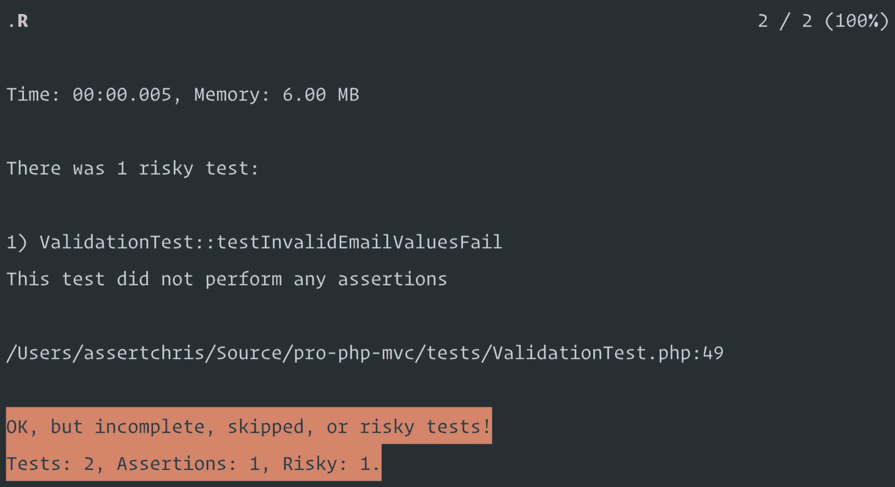
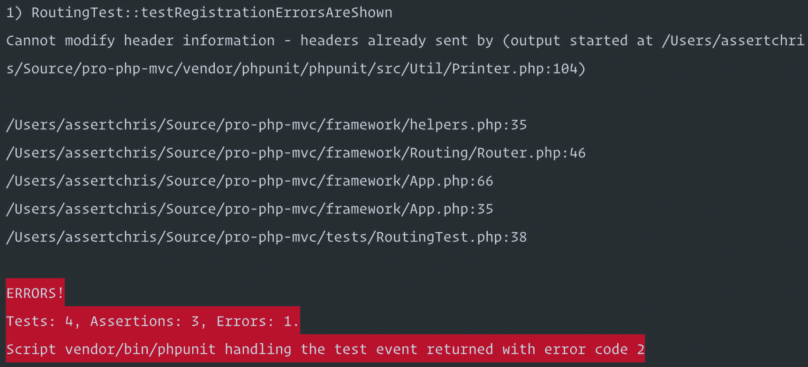
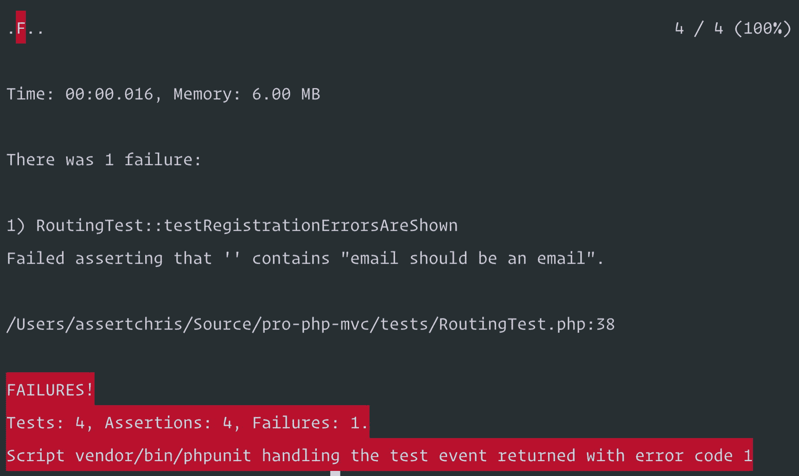
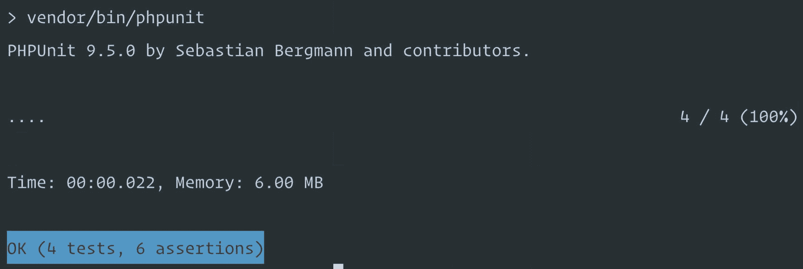

# 九、测试我们的框架

在前一章中，我们构建了一个服务定位器和依赖注入容器，这样我们就可以共享框架的各个部分，而无需多余的样板文件。

在这一章中，我们将学习如何测试新的代码，以及如何构建我们的应用和测试，从而使我们投入的时间获得最大的收益。

## 在章节之间…

我想快速介绍一下自上一章以来我所做的一些改变。依赖注入容器是一个强大的工具，因为它减少了代码的重复，使构建框架代码变得更加容易。

使用容器，我能够将验证代码移动到一个新的提供者:

```php
namespace Framework\Provider;

use Framework\App;
use Framework\Validation\Manager;
use Framework\Validation\Rule\RequiredRule;
use Framework\Validation\Rule\EmailRule;
use Framework\Validation\Rule\MinRule;

class ValidationProvider
{
    public function bind(App $app)
    {
        $app->bind('validator', function($app) {
            $manager = new Manager();

            $this->bindRules($app, $manager);

            return $manager;
        });
    }

    private function bindRules(App $app, Manager $manager)
    {
        $app->bind('validation.rule.required', fn() => new RequiredRule());
        $app->bind('validation.rule.email', fn() => new EmailRule());
        $app->bind('validation.rule.min', fn() => new MinRule());

        $manager->addRule('required', $app->resolve('validation.rule.required'));
        $manager->addRule('email', $app->resolve('validation.rule.email'));
        $manager->addRule('min', $app->resolve('validation.rule.min'));
    }
}

```

这是来自`framework/Provider/ValidationProvider.php`。

我喜欢将单个规则绑定到容器上(就像上一章我们对视图引擎所做的那样)，因为它们可以扩展、修饰和重新配置。

例如，我们可以解决电子邮件验证规则，改变它的工作方式，或者覆盖它以提供一些新的逻辑。如果没有办法把它从容器中取出来，那就不那么简单了。

由于我们改变了路由(使用容器来解析处理程序)，我也可以删除每个路由动作构造器方法。我不会展示所有这些变化，但它们类似于以下内容:

```php
namespace App\Http\Controllers\Products;

use App\Models\Product;
use Framework\Routing\Router;

class ShowProductController
{
    // protected Router $router;

    // public function __construct(Router $router)
    // {
    //     $this->router = $router;
    // }

    public function handle(Router $router)
    {
        $parameters = $router->current()->parameters();

        $product = Product::find((int) $parameters['product']);

        return view('products/view', [
            'product' => $product,
            'orderAction' => $router->route('order-product', ['product' => $product->id]),
            'csrf' => csrf(),
        ]);
    }
}

```

这是来自`app/Http/Controllers/Products/ShowProductcontroller.php`。

这些是对代码库的唯一更改。您是否尝试过将验证管理器配置转移到它自己的提供者？对我来说这是一次有趣的经历…

## 为什么我们要测试我们的代码？

在我们研究测试的实用性之前，重要的是要考虑我们为什么要测试。测试有多种形式，毫无疑问，你已经在做一种形式的测试了。

最常见的是在编码时保持浏览器或终端标签打开，并定期刷新浏览器或运行与编码内容相关的脚本。

这是手工测试，没有什么特别的问题。如果这是你唯一做的测试，你可能会错过一些重要的东西:

*   你还记得你需要测试的所有东西吗？

*   你的测试有效率吗？

*   您是否有最新的文档向团队中的其他人解释什么需要测试？

如果没有我们将在本章中探讨的那种测试，这些事情是很难实现的。

我们将要探索的这种测试叫做自动化测试。通过设计，它解决了前面列出的每个问题。自动化测试是当你写代码来测试你的其他代码时发生的事情，这些代码可以在尽可能少的交互和尽可能多的系统上运行。

### 不同类型的测试

围绕不同种类的测试有很多信息和困惑。我们将探讨一对夫妇，我将把他们称为“单元”和“集成”

这两者之间的主要区别是“单元”测试针对的是很小一部分代码，并且尽可能少地依赖于其他部分。另一方面,“集成”测试是关于测试一些东西，就像我们手工做的一样。如果您是测试新手，那么这可能会有点混乱。

在相关的地方，我一定会描述我们正在编写什么样的测试，以及为什么它们是那种测试。总是知道或关心测试的种类并不是非常重要，但是当与其他开发人员谈论测试时，知道一些术语是有帮助的。

## 我们将要测试的方法

我们已经写了相当多的代码，所以还有很多要测试。在这一章中，我将检查一些我想测试的东西，剩下的留给你自己去测试。以下是我希望我们涵盖的内容:

1.  测试验证库，以确保返回正确的消息，并在适当的时候引发错误

2.  测试路由库，以确保路由被适当地分派，并且从容器中解析依赖性

3.  测试那各种嗖！网站页面正常工作，注册和登录页面正常工作

这个列表可能看起来很小，但是有大量的工作要做。和第 6 章一样，我们将会看到存在哪些流行的测试库，以及为什么把我们的时间集中在为它们构建测试和助手上是明智的，而不是重新发明一个完整的测试库。

我们开始吧！

## 把这一切放在一起

测试是一个很大的话题，但是大多数测试分三步进行:

1.  设置测试开始时的条件

2.  计算预期的结果是什么

3.  运行您希望生成预期结果的代码，并将结果与预期进行比较

每一个好的测试框架都会让这些事情变得更容易。我们可以用代码描述这些步骤，如下所示:

```php
// tests use framework classes...
require __DIR__ . '/../vendor/autoload.php';

// validation manager uses $_SESSION...
session_start();

use Framework\Validation\Manager;
use Framework\Validation\Rule\EmailRule;
use Framework\Validation\ValidationException;

class ValidationTest
{
    protected Manager $manager;

    public function setUp()
    {
        $this->manager = new Manager();
        $this->manager->addRule('email', new EmailRule());
    }

    public function testInvalidEmailValuesFail()
    {
        $this->setUp();

        $expected = ['email' => ['email should be an email']];

        try {
            $this->manager->validate(['email' => 'foo'], ['email' => ['email']]);
        }
        catch (Throwable $e) {
            assert($e instanceof ValidationException, 'error should be thrown');
            assert($e->getErrors()['email'] === $expected['email'], 'messages should match');
            return;
        }

        throw new Exception('validation did not fail');
    }

    public function testValidEmailValuesPass()
    {
        $this->setUp();

        try {
            $this->manager->validate(['email' => 'foo@bar.com'], ['email' => ['email']]);
        }
        catch (Throwable $e) {
            throw new Exception('validation did failed');
            return;
        }

    }
}

$test = new ValidationTest();
$test->testInvalidEmailValuesFail();
$test->testValidEmailValuesPass();

print 'All tests passed' . PHP_EOL;

```

这是来自`tests/ValidationTest.php`。

这里发生了很多事情，所以让我们把它分成更小的部分:

*   我们有两个测试，第一个确保验证器在无效邮件通过时抛出一个`ValidationException`,第二个确保有效邮件不会触发邮件验证异常。

*   两个测试都期望一个验证`Manager`，并添加了`email`规则，这是我们在`setUp`方法中设置的。

*   第一个测试明确声明了预期，即`ValidationException`中会有一个电子邮件错误。

*   第二个测试隐式地声明了期望，即当有效的电子邮件地址被验证时不会发生错误。

*   我称之为可接受的测试代码库的一小部分，使这成为一个单元测试。

你将会看到的一件事是，测试通常会比它所测试的代码花费更多的代码。那是因为好的测试测试的不仅仅是“快乐之路”好的测试还需要测试广泛的故障条件…

“快乐之路”是一个短语，意思是通过一个接口或一段代码的路径，其中接口或代码被完全按照预期使用。

像`addIntegerToInteger`这样的方法可能需要两个整数，并返回两个整数的和，所以“快乐的路径”是当有人用两个整数调用它并希望这两个数字相加时。

用两个字符串调用它不是“好方法”，期望该方法执行乘法也不是。

有些事情我们可以留给静态分析工具去做——比如输入是正确的类型。其他的事情对于静态分析来说更难解决，而这些肯定是我们应该在测试中涉及的事情。

正如我所说的，每一个好的测试框架都会使这些步骤变得更容易。他们会做一些有用的事情，比如自动加载你的框架和应用代码，而不需要你调用`require`。

他们将确保像`setUp`这样的方法在每次测试前运行。他们将运行测试方法(通常寻找前缀，就像我们用`testX`添加的一样)，这样我们就不需要创建新的测试类实例并手动调用这些方法。

一些测试框架会使分离代码单元、进行测试或者创建虚假的依赖变得更加容易。

正如我们所了解的，对于我们为数据库的库添加的控制台命令，有些东西不值得我们花费时间去构建。

如果你喜欢从头开始创建你自己的测试库，那就去做吧！看看 PHPUnit 做了什么，并从我们刚刚看到的代码中进行推断。即使我们从使用 PHPUnit 开始，我们也有大量的工作要做，比如允许来自测试的请求通过路由，然后检查响应。

让我们安装 PHPUnit 并设置它需要运行的配置文件:

```php
composer require --dev phpunit/phpunit

```

PHPUnit 的配置文件是一个 XML 文件，它定义了运行哪些测试文件，以及其他内容:

```php
<phpunit
    backupGlobals="true"
    bootstrap="vendor/autoload.php"
    colors="true"
>
    <testsuites>
        <testsuite name="Test Suite">
            <directory>tests</directory>
        </testsuite>
    </testsuites>
</phpunit>

```

这是来自`phpunit.xml`。

这是完整配置的精简版: [3。XML 配置文件–PHPUnit 9。5 手动](https://phpunit.readthedocs.io/en/9.5/configuration.html)。通过指定`tests`目录，PHPUnit 将查找以`Test.php`结尾的文件(默认情况下)。

PHPUnit 附带了一个类，该类提供了一些断言助手方法。我们可以扩展该类并删除一些现有的样板文件:

```php
// tests use framework classes...
// require __DIR__ . '/../vendor/autoload.php';

// validation manager uses $_SESSION...
session_start();

use Framework\Validation\Manager;
use Framework\Validation\Rule\EmailRule;
use Framework\Validation\ValidationException;

class ValidationTest extends \PHPUnit\Framework\TestCase
{
    protected Manager $manager;

    public function testInvalidEmailValuesFail()
    {
        $manager = new Manager();
        $manager->addRule('email', new EmailRule());

        $expected = ['email' => ['email should be an email']];

        try {
            $manager->validate(['email' => 'foo'], ['email' => ['email']]);
        }
        catch (Throwable $e) {
            assert($e instanceof ValidationException, 'error should be thrown');
            assert($e->getErrors()['email'] === $expected['email'], 'messages should match');
            return;
        }

        throw new Exception('validation did not fail');
    }

    public function testValidEmailValuesPass()
    {
        $manager = new Manager();
        $manager->addRule('email', new EmailRule());

        try {
            $manager->validate(['email' => 'foo@bar.com'], ['email' => ['email']]);
        }
        catch (Throwable $e) {
            throw new Exception('validation did failed');
            return;
        }
    }
}

// $test = new ValidationTest();
// $test->testInvalidEmailValuesFail();
// $test->testValidEmailValuesPass();

// print 'All tests passed' . PHP_EOL;

```

这是来自`tests/ValidationTest.php`。

`TestCase`类自动调用`setUp`，测试运行器自动调用所有前缀为`testX`的方法。

这些测试方法仍然非常混乱，因为我们在处理异常。我们只需要第一个方法中的异常，但是也许我们可以进一步精简代码。

不过，在此之前，让我们先进行测试:

```php
vendor/bin/phpunit

```

PHPUnit 没有显示测试失败，但也没有显示成功。它有方法表明当某些代码运行时会出现异常，但是它没有一种简单的方法来查看该异常包含的内容(就异常消息和嵌套数据而言)。

让我们创建一个框架助手类，使检查异常更容易:

```php
namespace Framework\Testing;

use Closure;
use Exception;
use PHPUnit\Framework\TestCase as BaseTestCase;
use Throwable;

class TestCase extends BaseTestCase
{
    protected function assertExceptionThrown(Closure $risky, string $exceptionType)
    {
        $result = null;
        $exception = null;

        try {
            $result = $risky();
            $this->fail('exception was not thrown');
        }
        catch (Throwable $e) {
            $actualType = $e::class;

            if ($actualType !== $exceptionType) {
                $this->fail("exception was {$actualType}, but expected {$exceptionType}");
            }

            $exception = $e;
        }

        return [$exception, $result];
    }
}

```

这是来自`framework/Testing/TestCase.php`。

这个新的`assertExceptionThrown`运行一个函数并记录抛出的异常和方法的结果。如果没有抛出异常，正在运行的测试将失败。

`$result`只有在没有抛出预期的异常时才有用。它只是为了帮助调试，以防有风险的闭包没有产生期望的异常。

这使得`testValidEmailValuesPass`更加干净:

```php
public function testInvalidEmailValuesFail()
{
    $expected = ['email' => ['email should be an email']];

    // try {

    // }
    // catch (Throwable $e) {
    //     assert($e instanceof ValidationException, 'error should be thrown');
    //     assert($e->getErrors()['email'] === $expected['email'], 'messages should match');
    //     return;
    // }

    [ $exception ] = $this->assertExceptionThrown(
        fn() => $this->manager->validate(['email' => 'foo'], ['email' => ['email']]),
        ValidationException::class,
    );

    $this->assertEquals($expected, $exception->getErrors());

    // throw new Exception('validation did not fail');
}

```

这是来自`tests/ValidationTest.php`。

我们还使用 PHPUnit 的`assertEquals`方法来比较完整的期望值和异常中返回的错误的完整数组。让我们添加一个 Composer 脚本来更快地运行测试:

```php
"scripts": {
    "serve": "php -S 127.0.0.1:8000 -t public",
    "test": "vendor/bin/phpunit"
},

```

这是来自`composer.json`。

现在，我们可以用`composer test`运行测试。结果看起来超级酷，但目前只有一个测试通过了。



用 PHPUnit 运行测试

让我们将下一个测试改为使用 PHPUnit 的断言。我们不妨只检查`validate`方法的返回值:

```php
public function testValidEmailValuesPass()
{
    // try {
    //     $this->manager->validate(['email' => 'foo@bar.com'], ['email' => ['email']]);
    // }
    // catch (Throwable $e) {
    //     throw new Exception('validation did failed');
    //     return;
    // }

    $data = $this->manager->validate(['email' => 'foo@bar.com'], ['email' => ['email']]);
    $this->assertEquals($data['email'], 'foo@bar.com');
}

```

这是来自`tests/ValidationTest.php`。

为我们已经拥有的另外两个验证规则添加测试是很好的，但是它们看起来将与这些非常相似。也许你可以把它们加在章节之间？(轻推和眨眼。)

### 测试 HTTP 请求

让我们继续测试 routes 加载正确的页面，没有错误。我们可以通过实例化路由来做到这一点(就像我们刚刚为验证而做的单元测试)，但我认为这是向应用发出请求的好机会。

对于设置，我们需要启动应用。然后，我们可以伪造对它的 HTTP 请求:

```php
use Framework\App;

class RoutingTest extends Framework\Testing\TestCase
{
    protected App $app;

    public function setUp(): void
    {
        parent::setUp();

        $this->app = App::getInstance();
        $this->app->bind('paths.base', fn() => __DIR__ . '/../');
    }

    public function testHomePageIsShown()
    {
        $_SERVER['REQUEST_METHOD'] = 'GET';
        $_SERVER['REQUEST_URI'] = '/';

        ob_start();
        $this->app->run();
        $html = ob_get_contents();
        ob_end_clean();

        $expected = 'Take a trip on a rocket ship';

        $this->assertStringContainsString($expected, $html);
    }
}

```

这是来自`tests/RoutingTest.php`。

路由使用`REQUEST_METHOD`和`REQUEST_URI`来计算选择哪条路由。我们可以输入自己的值——就像这些值是从浏览器发送的一样——路由将选择归属路由。

我们可以伪造更复杂的请求，比如我们想测试验证错误消息是否被正确显示:

```php
public function testRegistrationErrorsAreShown()
{
    $_SERVER['REQUEST_METHOD'] = 'POST';
    $_SERVER['REQUEST_URI'] = '/register';
    $_SERVER['HTTP_REFERER'] = '/register';

    $_POST['email'] = 'foo';
    $_POST['csrf'] = csrf();

    $expected = 'email should be an email';

    $this->assertStringContainsString($expected, $this->app->run());
}

```

这是来自`tests/RoutingTest.php`。

可惜，这是行不通的。从理论上来说，应该是这样，因为我们在为注册动作伪造表单提交的理想条件。问题是应用已经在发送消息头，可能与启动会话有关。



邮件头已发送…

PHP 不喜欢我们在任何文本已经发送到浏览器或终端之后再发送标题。这个问题的解决方案并不简单。

我们基本上需要开始将我们的响应包装在响应对象中，我们可以检查这些对象以查看它们包含的内容，而无需将它们的文本内容发送到浏览器或终端。

让我们创建这个新的`Response`类，并将其绑定到容器:

```php
namespace Framework\Http;

use InvalidArgumentException;

class Response
{
    const REDIRECT = 'REDIRECT';
    const HTML = 'HTML';
    const JSON = 'JSON';

    private string $type = 'HTML';
    private ?string $redirect = null;
    private mixed $content = '';
    private int $status = 200;
    private array $headers = [];

    public function content(mixed $content = null): mixed
    {
        if (is_null($content)) {
            return $this->content;
        }

        $this->content = $content;

        return $this;
    }

    public function status(int $code = null): int|static
    {
        if (is_null($code)) {
            return $this->code;
        }

        $this->code = $code;

        return $this;
    }

    public function header(strign $key, string $value): static
    {
        $this->headers[$key] = $value;
        return $this;
    }

    public function redirect(string $redirect = null): mixed
    {
        if (is_null($redirect)) {
            return $this->redirect;
        }

        $this->redirect = $redirect;
        $this->type = static::REDIRECT;
        return $this;
    }

    public function json(mixed $content): static
    {
        $this->content = $content;
        $this->type = static::JSON;
        return $this;
    }

    public function type(string $type = null): string|static
    {
        if (is_null($type)) {
            return $this->type;
        }

        $this->type = $type;

        return $this;
    }

    public function send(): string
    {
        foreach ($this->headers as $key => $value) {
            header("{$key}: {$value}");
        }

        if ($this->type === static::HTML) {
            header('Content-Type: text/html');
            http_response_code($this->status);
            print $this->content;
        }

        if ($this->type === static::JSON) {
            header('Content-Type: application/json');
            http_response_code($this->status);
            print json_encode($this->content);
        }

        if ($this->type === static::REDIRECT) {
            header("Location: {$this->redirect}");
            http_response_code($this->code);
        }

        throw new InvalidArgumentException("{$this->type} is not a recognised type");
    }
}

```

这是来自`framework/Http/Response.php`。

我认为支持三种最常见的响应类型是个好主意:HTML、JSON 和重定向响应。这里，我们遵循以前遵循的模式，即将 getters 和 setters 混合在一起。这种情况下特别有效，因为我们在每个控制器中发送响应。

这个类和我们之前采用的方法之间的一个重要区别是，没有任何东西被自动发送到浏览器。我们*必须*调用`send`方法来实现这一点。

让我们将这个类绑定到容器，这样我们就可以在应用的其余部分使用它:

```php
namespace Framework\Provider;

use Framework\App;
use Framework\Http\Response;

class ResponseProvider
{
    public function bind(App $app)
    {
        $app->bind('response', function($app) {
            return new Response();
        });
    }
}

```

这是来自`framework/Provider/ResponseProvider.php`。

你可能在想:“坚持住。回应不是一种服务。我们为什么要将它绑定为服务？”

它不是，这是一种奇怪的传递方式，但它是我们希望能够重用的东西，所以我们在应用的生命周期中添加到现有的响应对象。

现在，我们可以使用`response`绑定来包装所有响应:

```php
public function run()
{
    if (session_status() !== PHP_SESSION_ACTIVE) {
        session_start();
    }

    $basePath = $this->resolve('paths.base');

    $this->configure($basePath);
    $this->bindProviders($basePath);

    return $this->dispatch($basePath);
}

private function dispatch(string $basePath): Response
{
    $router = new Router();

    $this->bind(Router::class, fn() => $router);

    $routes = require "{$basePath}/app/routes.php";
    $routes($router);

    $response = $router->dispatch();

    if (!$response instanceof Response) {
        $response = $this->resolve('response')->content($response);
    }

    return $response;
}

```

这是来自`framework/App.php`。

如果控制器返回的不是这个响应类，我们可以假设这个值应该是发送到浏览器的 HTML。最后，我们应该更改`public.php`入口点，以便它发送响应:

```php
$app = \Framework\App::getInstance();
$app->bind('paths.base', fn() => __DIR__ . '/../');
$app->run()->send();

```

这是来自`public/index.php`。

花点时间启动服务器(你可以用`composer serve`来完成)，确保你仍然可以看到所有的页面。

我们还可以重构重定向助手来使用这种新的重定向方法:

```php
if (!function_exists('response')) {
    function response()
    {
        return app('response');
    }
}

if (!function_exists('redirect')) {
    function redirect(string $url)
    {
        return response()->redirect($url);
    }
}

```

这是来自`framework/helpers.php`。

测试也需要更新以使用这种新的`run`方法:

```php
public function testHomePageIsShown()
{
    $_SERVER['REQUEST_METHOD'] = 'GET';
    $_SERVER['REQUEST_URI'] = '/';

    $expected = 'Take a trip on a rocket ship';

    $this->assertStringContainsString($expected, $this->app->run()->content());
}

public function testRegistrationErrorsAreShown()
{
    $_SERVER['REQUEST_METHOD'] = 'POST';
    $_SERVER['REQUEST_URI'] = '/register';
    $_SERVER['HTTP_REFERER'] = '/register';

    $_POST['email'] = 'foo';
    $_POST['csrf'] = csrf();

    $expected = 'email should be an email';

    $this->assertStringContainsString($expected, $this->app->run()->content());
}

```

这是来自`tests/RoutingTest.php`。

有了这个新的抽象，错误就不再是在内容之后发送标题了。



新的错误

现在的问题是重定向没有被发送到终端。对于如何检查测试中的响应，我们需要更聪明一点。让我们创建一个 response decorator 类，它可以在响应中“跟随重定向”,而无需向终端或浏览器发送任何头或内容:

```php
namespace Framework\Testing;

use Framework\App;
use Framework\Http\Response;

class TestResponse
{
    private Response $response;

    public function __construct(Response $response)
    {
        $this->response = $response;
    }

    public function isRedirecting(): bool
    {
        return $this->response->type() === Response::REDIRECT;
    }

    public function redirectingTo(): ?string
    {
        return $this->response->redirect();
    }

    public function follow(): static
    {
        while ($this->isRedirecting()) {
            $_SERVER['REQUEST_METHOD'] = 'GET';
            $_SERVER['REQUEST_URI'] = $this->redirectingTo();
            $this->response = App::getInstance()->run();
        }

        return $this;
    }

    public function __call(string $method, array $parameters = []): mixed
    {
        return $this->response->$method(...$parameters);
    }
}

```

这是来自`framework/Testing/TestResponse.php`。

就我们测试的内容而言，这也使我们的注册错误测试更加清晰:

```php
public function testRegistrationErrorsAreShown()
{
    $_SERVER['REQUEST_METHOD'] = 'POST';
    $_SERVER['REQUEST_URI'] = '/register';
    $_SERVER['HTTP_REFERER'] = '/register';

    $_POST['email'] = 'foo';
    $_POST['csrf'] = csrf();

    $response = new TestResponse($this->app->run());

    $this->assertTrue($response->isRedirecting());
    $this->assertEquals('/register', $response->redirectingTo());

    $response->follow();

    $this->assertStringContainsString('email should be an email', $response->content());
}

```

这是来自`tests/RoutingTest.php`。

这些测试几乎向应用发出完整的 HTTP 请求，是集成测试的例子。我们不只是在测试一个类或方法:我们在测试完整的控制器功能、重定向和存储在会话中的错误。

这是一种不太集中的测试，但它在短时间内覆盖了很多领域。最好的测试套件是单元测试和集成测试的健康结合。

我们的测试现在应该通过了！



测试通过

### 测试浏览器交互

我想谈的最后一个主题是测试网站，就像我们使用浏览器一样(但仍然是自动化过程)。这类测试往往很脆弱，因为它们依赖于 HTML 的结构，但它们是测试所有 JavaScript 代码工作正常的唯一方法…

为了实现这一目标，我们将引入另一个优秀的依赖项——Symfony Panther。它是 PHP 和浏览器之间的桥梁:

```php
composer require --dev symfony/panther
composer require --dev dbrekelmans/bdi
vendor/bin/bdi detect drivers

```

这些命令安装 Panther 和一个推荐的浏览器驱动程序。Panther 提供了一些助手，用于与浏览器交互。它基于脸书的网络驱动库。有了 Panther，我们可以做各种很酷的事情:

```php
use Facebook\WebDriver\WebDriverBy;
use Framework\Testing\TestCase;
use Symfony\Component\Panther\Client;

class BrowserTest extends TestCase
{
    public function testLoginForm()
    {
        $client = Client::createFirefoxClient();
        $client->request('GET', 'http://127.0.0.1:8000/register');

        $client->waitFor('.log-in-button');
        $client->executeScript("document.querySelector('.log-in-button').click()");

        $client->waitFor('.log-in-errors');
        $element = $client->findElement(WebDriverBy::className('log-in-form'));

        $this->assertStringContainsString('password is required', $element->getText());
    }
}

```

这是来自`tests/BrowserTest.php`。

如果你使用 ChromeDriver，而不是 GeckoDriver，你应该使用`createChromeClient`方法。这些方法启动一个测试浏览器，代码使用它与页面的 HTML 进行交互。

浏览器测试通常是一系列的步骤，在这些步骤中，我们等待东西变得可用，然后使用它们(通过点击、键入等)。在本例中，我们等待一个登录按钮，单击它，然后确保显示错误消息。

这不是严格地测试 JavaScript 功能，但是如果你需要这样做，那么你可以这样做。

确保将所有这些助手类添加到您的登录表单的 HTML 中:

```php
<form
  method="post"
  action="{{ $logInAction }}"
  class="flex flex-col w-full space-y-4 max-w-xl log-in-form"
>
  @if(isset($_SESSION['login_errors']))
  <ol class="list-disc text-red-500 log-in-errors">
    @foreach($_SESSION['login_errors'] as $field => $errors) @foreach($errors as
    $error)
    <li>{{ $error }}</li>
    @endforeach @endforeach
  </ol>
  @endif
  <!-- ... -->
  <button
    type="submit"
    class="bg-indigo-500 rounded-lg p-2 text-white log-in-button"
  >
    Log in
  </button>
</form>

```

这是来自`resources/views/users/register.advanced.php`。

如果您希望看到测试浏览器工作，您可以使用一个特殊的环境变量来运行测试:

```php
PANTHER_NO_HEADLESS=1 composer test

```

如果你使用的是正确的浏览器客户端，并且你已经把所有的东西都编码好了，你应该会看到 Chromium 或者 Firefox 启动并进入你网站的注册页面。

您还应该看到测试浏览器单击 login 按钮，并看到错误消息作为结果出现。

我推荐看一下 Symfony Panther 文档和[脸书 WebDriver 文档](https://github.com/php-webdriver/php-webdriver)，以了解更多关于这些库如何工作的信息。

## 警告

这是旋风般的一章。关于测试，关于支撑我们的应用和框架代码以便更容易测试，有太多东西需要学习。

在我们的框架中有很多我们可以改进的地方，使它更容易测试。例如，我们需要在测试文件中启动会话，这并不好。我们将在接下来的章节中修正这些问题，但是不要让框架中需要改进的地方阻止你尝试测试。

要在你的头脑中巩固这一知识，有很多事情要做:

*   如果能完成测试验证、路由和表单交互就太好了。

*   如果我们有某种 HTTP 请求抽象，测试请求会更容易，就像我们有 HTTP 响应抽象一样。

*   我们如何在测试套件开始时自动启动网站服务器，并在所有测试运行后停止它？

## 专业人士如何做事

每个好的和流行的框架都有测试助手，几乎所有的都在幕后使用 PHPUnit。这是业内测试的标准。

这并不是说您不能或不应该尝试构建自己的替代方案，但这确实意味着您可以依赖这个可爱的开源库。

Laravel 有更多的测试工具，但是测试 HTTP 响应的底层方法是相同的。Laravel 的 HTTP 类建立在 Symfony 的 HTTP 类之上。

这意味着在 Symfony 中工作的代码和方法很可能在 Laravel 应用中工作，没有什么大惊小怪的。这也意味着对这些类的理解是必不可少的，并且可以在用两种框架编写的应用之间转移。

有许多社区支持的库和方法可以向浏览器发送不同种类的响应，比如 RSS、XML 和流响应。

我们已经看到了 Panther，但是 Laravel 有一个类似的浏览器测试库，叫做 Dusk。在框架之外，它不是超级可移植的，但是如果您在 Laravel 应用中进行浏览器测试，那么使用它是一种享受。

## 摘要

在这一章中，我们学习了很多关于测试的知识。随着我们构建更多的框架，这是我们应该继续做的事情，但这可能是一个陡峭的学习曲线。

在下一章，我们将开始用基于驱动程序的库来填充我们的框架，以做一些有用的事情(比如处理会话和文件系统)。