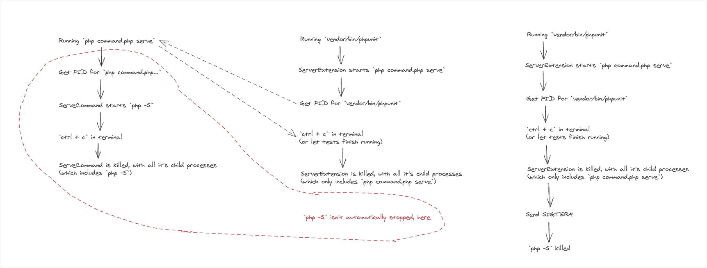

# 10.配置、缓存、会话、文件系统

既然我们已经解决了测试和服务地点的问题，现在我们已经进入了旅程的最后阶段。在这一章中，我们将制定一个更好的加载配置的方法。

我们还将为缓存、会话管理和文件系统访问添加驱动程序。我们将关注每个技术领域的一到两个驱动程序，但我们将建立一个良好的基础，在此基础上您可以添加自己的驱动程序。

## 自上次以来有什么变化？

在我们进入这一章的主要内容之前，我想回顾一下我在这两章之间做了哪些修改。在前一章快结束时，我设置了一些挑战，这是我为解决这些挑战所做的工作的总结…

我开始清理一些已经转移到`Model`类的数据库配置。这是我开始之前的样子:

```php
public function getConnection(): Connection
{
    if (!isset($this->connection)) {
        $factory = new Factory();

        $factory->addConnector('mysql', function($config) {
            return new MysqlConnection($config);
        });

        $factory->addConnector('sqlite', function($config) {
            return new SqliteConnection($config);
        });

        $config = require basePath() . 'config/database.php';

        $this->connection = $factory->connect($config[$config['default']]);
    }

    return $this->connection;
}

```

这是来自`framework/Database/Model.php`。

我认为最好在提供者中进行配置:

```php
namespace Framework\Provider;

use Framework\App;
use Framework\Database\Factory;
use Framework\Database\Connection\MysqlConnection;
use Framework\Database\Connection\SqliteConnection;

class DatabaseProvider
{
    public function bind(App $app): void
    {
        $app->bind('database', function($app) {
            $factory = new Factory();
            $this->addMysqlConnector($factory);
            $this->addSqliteConnector($factory);

            $config = $this->config($app);

            return $factory->connect($config[$config['default']]);
        });
    }

    private function config(App $app): array
    {
        $base = $app->resolve('paths.base');
        $separator = DIRECTORY_SEPARATOR;

        return require "{$base}{$separator}config/database.php";
    }

    private function addMysqlConnector($factory): void
    {
        $factory->addConnector('sqlite', function($config) {
            return new SqliteConnection($config);
        });
    }

    private function addSqliteConnector($factory): void
    {
        $factory->addConnector('mysql', function($config) {
            return new MysqlConnection($config);
        });
    }
}

```

这是来自`framework/Provider/DatabaseProvider.php`。

这意味着任何需要预配置数据库连接的东西都可以直接从容器中访问它。我们可以显著缩短模型代码:

```php
public function getConnection(): Connection
{
    if (!isset($this->connection)) {
        $this->connection = app('database');
    }

    return $this->connection;
}

```

这是来自`framework/Database/Model.php`。

我把剩下的时间花在了添加自动化测试套件上。我为注册表单的验证添加了浏览器测试，并为剩余的验证规则添加了单元测试。

我不喜欢在一个终端选项卡中保持服务器运行，而在另一个选项卡中运行浏览器测试，所以我想出了一种方法让浏览器测试在运行时“引导”服务器。

为了实现这一点，我必须将`composer serve`命令重构为一个框架命令:

```php
namespace Framework\Support\Command;

use InvalidArgumentException;
use Symfony\Component\Console\Command\Command;
use Symfony\Component\Console\Input\InputOption;
use Symfony\Component\Console\Input\InputInterface;
use Symfony\Component\Console\Output\OutputInterface;
use Symfony\Component\Process\Process;

class ServeCommand extends Command
{
    protected static $defaultName = 'serve';

    private Process $process;

    protected function configure()
    {
        $this
            ->setDescription('Starts a development server')
            ->setHelp('You can provide an optional host and port, for the development server.')
            ->addOption('host', null, InputOption::VALUE_REQUIRED)
            ->addOption('port', null, InputOption::VALUE_REQUIRED);
    }

    protected function execute(InputInterface $input, OutputInterface $output): int
    {
        $base = app('paths.base');
        $host = $input->getOption('host') ?: env('APP_HOST', '127.0.0.1');
        $port = $input->getOption('port') ?: env('APP_PORT', '8000');

        if (empty($host) || empty($port)) {
            throw new InvalidArgumentException('APP_HOST and APP_PORT both need values');
        }

        $this->handleSignals();
        $this->startProcess($host, $port, $base, $output);

        return Command::SUCCESS;
    }

    private function command(string $host, string $port, string $base): array
    {
        $separator = DIRECTORY_SEPARATOR;

        return [
            PHP_BINARY,
            "-S",
            "{$host}:{$port}",
            "{$base}{$separator}server.php",
        ];
    }

    private function handleSignals(): void
    {
        pcntl_async_signals(true);

        pcntl_signal(SIGTERM, function($signal) {
            if ($signal === SIGTERM) {
                $this->process->signal(SIGKILL);
                exit;
            }
        });
    }

    private function startProcess(string $host, string $port, string $base, OutputInterface $output): void
    {
        $this->process = new Process($this->command($host, $port, $base), $base);
        $this->process->setTimeout(PHP_INT_MAX);

        $this->process->start(function($type, $buffer) use ($output) {
            $output->write("<info>{$buffer}</info>");
        });

        $output->writeln("Serving requests at http://{$host}:{$port}");

        $this->process->wait();
    }
}

```

这是来自`framework/Support/Command/ServeCommand.php`。

这个命令封装了运行 PHP 开发服务器的代码，但是它不是指向一个公共文件夹，而是指向一个`server.php`文件。这是对`public/index.php`的代理:

```php
$path = __DIR__;
$separator = DIRECTORY_SEPARATOR;
$uri = urldecode(parse_url($_SERVER['REQUEST_URI'], PHP_URL_PATH));

if (is_file("{$path}{$separator}public{$separator}{$uri}")) {
    return false;
}

require_once "{$path}{$separator}public{$separator}index.php";

```

这是来自`server.php`。

也在用信号做一些有趣的事情。有一个 PHP 扩展，默认情况下与 PHP 一起安装，可以用来拦截许多中断信号。

我实现了一个信号监听器，这样我就可以在命令停止时优雅地停止 PHP 开发服务器。这是我从 Cal Evans 的 [*信令 PHP* 中学来的一招。](https://leanpub.com/signalingphp)

使用这个 serve 命令，我可以添加一个 PHPUnit 扩展，它在测试之前启动服务器，在测试运行之后停止服务器:

```php
namespace Framework\Testing;

use PHPUnit\Runner\BeforeFirstTestHook;
use PHPUnit\Runner\AfterLastTestHook;
use Symfony\Component\Process\Process;

final class ServerExtension implements BeforeFirstTestHook, AfterLastTestHook
{
    private Process $process;
    private bool $startedServer = false;

    private function startServer()
    {
        if ($this->serverIsRunning()) {
            $this->startedServer = false;
            return;
        }

        $this->startedServer = true;

        $base = app('paths.base');
        $separator = DIRECTORY_SEPARATOR;

        $this->process = new Process([
            PHP_BINARY,
            "{$base}{$separator}command.php",
            "serve"
        ], $base);

        $this->process->start(function($type, $buffer) {
            print $buffer;
        });
    }

    private function serverIsRunning()
    {
        $connection = @fsockopen(
            env('APP_HOST', '127.0.0.1'),
            env('APP_PORT', '8000'),
        );

        if (is_resource($connection)) {
            fclose($connection);
            return true;
        }

        return false;
    }

    private function stopServer()
    {
        if ($this->startedServer) {
            $this->process->signal(SIGTERM);
        }
    }

    public function executeBeforeFirstTest(): void
    {
        $this->startServer();
    }

    public function executeAfterLastTest(): void
    {
        $this->stopServer();
    }
}

```

这是来自`framework/Testing/ServerExtension.php`。

在这里，我们看到 SIGTERM 信号被发送到 serve 命令。如果没有它(和信号处理)，就有测试运行结束时服务器没有关闭的风险。有点奇怪，但事情就是这样发生的。



处理信号

还有其他一些小变化，但这些是需要了解的重要变化。现在，我想我们已经准备好进入这一章的内容了！

## 更好的配置管理

我们一直使用有限的配置数据，通常使用`require`语句。我认为，通过实现以下目标，我们可以做得更好:

1.  根据需要缓存配置

2.  抽象加载配置文件的文件系统细节

可能有很多方法可以存储和加载配置(例如，从数据库或第三方服务)，但我们将保持简单。让我们将文件系统配置文件访问转移到一个中心类，并将其绑定到容器。

Laravel 使用了一种点符号，我希望我们朝着这个方向发展。配置查找采用`config('database.default')`的形式，这会导致`config/database.php`文件被加载，第一个点之后的所有内容都用于遍历嵌套数组。

例如，`config('database.mysql.username')`正在从`config/database.php`加载`['mysql']['username']`。这不是太多的工作要复制…

让我们从`Config`类开始:

```php
namespace Framework\Support;

use Framework\App;

class Config
{
    private array $loaded = [];

    public function get(string $key, mixed $default = null): mixed
    {
        $segments = explode('.', $key);
        $file = array_shift($segments);

        if (!isset($this->loaded[$file])) {
            $base = App::getInstance()->resolve('paths.base');
            $separator = DIRECTORY_SEPARATOR;

            $this->loaded[$file] = (array) require "{$base}{$separator}config{$separator}{$file}.php";
        }

        if ($value = $this->withDots($this->loaded[$file], $segments)) {
            return $value;
        }

        return $default;
    }

    private function withDots(array $array, array $segments): mixed
    {
        $current = $array;

        foreach ($segments as $segment) {
            if (!isset($current[$segment])) {
                return null;
            }

            $current = $current[$segment];
        }

        return $current;
    }
}

```

这是来自`framework/Support/Config.php`。

我们首先将`$key`解构为我们想要的配置值。第一部分是文件名，其余部分用于嵌套查找。

`withDots`是一种遍历嵌套数组的迭代方法，但是递归方法也同样有效。

这需要绑定到容器，以便更容易使用:

```php
namespace Framework\Provider;

use Framework\App;
use Framework\Support\Config;

class ConfigProvider
{
    public function bind(App $app): void
    {
        $app->bind('config', function($app) {
            return new Config();
        });
    }
}

```

这是来自`framework/Provider/ConfigProvider.php`。

将`ConfigProvider`类添加到`config/providers.php`中，以便加载应用。它应该是第一个条目，以便后续的提供者可以访问新的配置抽象…

我们现在可以清理框架中使用配置的各个部分。下面是清理数据库提供程序代码的方法:

```php
public function bind(App $app): void
{
    $app->bind('database', function($app) {
        $factory = new Factory();
        $this->addMysqlConnector($factory);
        $this->addSqliteConnector($factory);

        // $config = $this->config($app);
        $config = $app->resolve('config')->get('database');

        return $factory->connect($config[$config['default']]);
    });
}

// private function config(App $app): array
// {
//     $base = $app->resolve('paths.base');
//     $separator = DIRECTORY_SEPARATOR;

//     return require "{$base}{$separator}config/database.php";
// }

```

这是来自`framework/Provider/DatabaseProvider.php`。

我们可以通过创建一个配置助手来做得更好:

```php
if (!function_exists('config')) {
    function config(string $key, mixed $default = null): mixed
    {
        return app('config')->get($key, $default);
    }
}

```

这是来自`framework/helpers.php`。

最终的数据库提供程序代码如下所示:

```php
public function bind(App $app): void
{
    $app->bind('database', function($app) {
        $factory = new Factory();
        $this->addMysqlConnector($factory);
        $this->addSqliteConnector($factory);

        $config = config('database');

        return $factory->connect($config[$config['default']]);
    });
}

```

这是来自`framework/Provider/DatabaseProvider.php`。

除了使配置更容易使用之外，这种抽象还使配置管理更有效——因为配置文件只加载一次。

现在我们有了这个，我们可以毫不费力地使用越来越多的配置文件(用于缓存、会话和文件系统)!

## 躲藏

我能想到许多不同的缓存提供者，但大多数都涉及第三方服务或与 web 服务器并行运行的服务器。让我们实现对以下几种更简单的缓存提供者的支持:

1.  内存缓存(也就是我们用来缓存配置的那种)

2.  文件系统缓存

3.  快取记忆体

    Memcache 是一个与 web 服务器并行运行的服务器，这意味着我们需要安装它来运行这个缓存驱动程序。如果你在安装时遇到问题，那么你可以跳过这个特殊的“驱动程序”…

我们需要一个与数据库连接类似的工厂设置:

```php
namespace Framework\Cache;

use Closure;
use Framework\Cache\Driver\Driver;
use Framework\Cache\Exception\DriverException;

class Factory
{
    protected array $drivers;

    public function addDriver(string $alias, Closure $driver): static
    {
        $this->drivers[$alias] = $driver;
        return $this;
    }

    public function connect(array $config): Driver
    {
        if (!isset($config['type'])) {
            throw new DriverException('type is not defined');
        }

        $type = $config['type'];

        if (isset($this->drivers[$type])) {
            return $this->drivers[$type]($config);
        }

        throw new DriverException('unrecognised type');
    }
}

```

这是来自`framework/Cache/Factory.php`。

`DriverException`是`RuntimeException`的空子类。缓存配置文件如下所示:

```php
return [
    'default' => 'memory',
    'memory' => [
        'type' => 'memory',
        'seconds' => 31536000,
    ],
];

```

这是来自`config/cache.php`。

目前这真的很简单，但是随着我们增加额外的驱动程序，会变得更加复杂。`31536000`秒是 1 年，我们将使用它作为默认的缓存到期值。然而,`Driver`界面更有趣一些:

```php
namespace Framework\Cache\Driver;

interface Driver
{
    /**
     * Tell if a value is cached (still)
     */
    public function has(string $key): bool;

    /**
     * Get a cached value
     */
    public function get(string $key, mixed $default = null): mixed;

    /**
     * Put a value into the cache, for an optional number of seconds
     */
    public function put(string $key, mixed $value, int $seconds = null): static;

    /**
     * Remove a single cached value
     */
    public function forget(string $key): static;

    /**
     * Remove all cached values
     */
    public function flush(): static;
}

```

这是来自`framework/Cache/Driver/Driver.php`。

我们可以通过将这些方法签名中的每一个连接到内部数组来创建内存中的驱动程序:

```php
namespace Framework\Cache\Driver;

class MemoryDriver implements Driver
{
    private array $config = [];
    private array $cached = [];

    public function __construct(array $config)
    {
        $this->config = $config;
    }

    public function has(string $key): bool
    {
        return isset($this->cached[$key]) && $this->cached[$key]['expires'] > time();
    }

    public function get(string $key, mixed $default = null): mixed
    {
        if ($this->has($key)) {
            return $this->cached[$key]['value'];
        }

        return $default;
    }

    public function put(string $key, mixed $value, int $seconds = null): static
    {
        if (!is_int($seconds)) {
            $seconds = (int) $this->config['seconds'];
        }

        $this->cached[$key] = [
            'value' => $value,
            'expires' => time() + $seconds,
        ];

        return $this;
    }

    public function forget(string $key): static
    {
        unset($this->cached[$key]);
        return $this;
    }

    public function flush(): static
    {
        $this->cached = [];
        return $this;
    }
}

```

这是来自`framework/Cache/Driver/MemoryDriver.php`。

`has`和`get`方法看起来类似于我们对`Config`类所做的，只是增加了一个`expires`键。当有人告诉我们一个值要缓存多少秒时，我们将这些秒加到 unix 时间戳上。我们可以将其与 unix 时间戳(将来)进行比较，以确定该值是否应该过期。

让我们将它连接到一个提供者中，这样我们就可以快速地使用它:

```php
namespace Framework\Provider;

use Framework\App;
use Framework\Cache\Factory;
use Framework\Cache\Driver\MemoryDriver;

class CacheProvider
{
    public function bind(App $app): void
    {
        $app->bind('cache', function($app) {
            $factory = new Factory();
            $this->addMemoryDriver($factory);

            $config = config('cache');

            return $factory->connect($config[$config['default']]);
        });
    }

    private function addMemoryDriver($factory): void
    {
        $factory->addDriver('memory', function($config) {
            return new MemoryDriver($config);
        });
    }
}

```

这是来自`framework/Provider/CacheProvider.php`。

我们可以利用这一点来存储不太可能经常改变的数据:

```php
$cache = app('cache');
$products = Product::all();

$productsWithRoutes = array_map(function ($product) use ($router) {
    $key = "route-for-product-{$product->id}";

    if (!$cache->has($key)) {
        $cache->put($key, $router->route('view-product', ['product' => $product->id]));
    }

    $product->route = $cache->get($key);

    return $product;
}, $products);

return view('home', [
    'products' => $productsWithRoutes,
]);

```

这是来自`app/Http/Controllers/ShowHomePageController.php`。

在这个例子中，我们可以一次性计算出每个产品的路线，并将其存储在缓存中。

不要忘记将`CacheProvider`类添加到`config/providers.php`中，这样就可以加载应用了。

在使用 PHP 开发服务器时，内存驱动程序有点没用，因为在每个页面返回到浏览器后，内存都会被清除。这对于测试目的或者在每次请求后都不清除内存的环境中非常有用。

让我们添加下一个驱动程序，其中缓存的值存储在文件系统中:

```php
namespace Framework\Cache\Driver;

use Framework\App;

class FileDriver implements Driver
{
    private array $config = [];
    private array $cached = [];

    public function __construct(array $config)
    {
        $this->config = $config;
    }

    public function has(string $key): bool
    {
        $data = $this->cached[$key] = $this->read($key);

        return isset($data['expires']) and $data['expires'] > time();
    }

    private function path(string $key): string
    {
        $base = $this->base();
        $separator = DIRECTORY_SEPARATOR;
        $key = sha1($key);

        return "{$base}{$separator}{$key}.json";
    }

    private function base(): string
    {
        $base = App::getInstance()->resolve('paths.base');
        $separator = DIRECTORY_SEPARATOR;

        return "{$base}{$separator}storage{$separator}framework{$separator}cache";
    }

    private function read(string $key)
    {
        $path = $this->path($key);

        if (!is_file($path)) {
            return [];
        }

        return json_decode(file_get_contents($path), true);
    }

    public function get(string $key, mixed $default = null): mixed
    {
        if ($this->has($key)) {
            return $this->cached[$key]['value'];
        }

        return $default;
    }

    public function put(string $key, mixed $value, int $seconds = null): static
    {
        if (!is_int($seconds)) {
            $seconds = (int) $this->config['seconds'];
        }

        $data = $this->cached[$key] = [
            'value' => $value,
            'expires' => time() + $seconds,
        ];

        return $this->write($key, $data);
    }

    private function write(string $key, mixed $value): static
    {
        file_put_contents($this->path($key), json_encode($value));
        return $this;
    }

    public function forget(string $key): static
    {
        unset($this->cached[$key]);

        $path = $this->path($key);

        if (is_file($path)) {
            unlink($path);
        }

        return $this;
    }

    public function flush(): static
    {
        $this->cached = [];

        $base = $this->base();
        $separator = DIRECTORY_SEPARATOR;

        $files = glob("{$base}{$separator}*.json");

        foreach ($files as $file){
            if (is_file($file)) {
                unlink($file);
            }
        }

        return $this;
    }
}

```

这是来自`framework/Cache/Driver/FileDriver.php`。

这里，我们保留了内部缓存数组的概念，但这样做只是为了减少多次读取同一个文件的次数。缓存值及其到期时间保存在 JSON 文件中。

这不是一个有效的缓存驱动程序，所以它只在没有更好的替代驱动程序可用的情况下，或者在只有缓存的值比多个文件系统读取和写入花费更长时间的情况下才真正有用。

让我们扩展这个文件系统驱动程序的配置，以及我们将要添加的 Memcache 驱动程序:

```php
return [
    'default' => 'memcache',
    'memory' => [
        'type' => 'memory',
        'seconds' => 31536000,
    ],
    'file' => [
        'type' => 'file',
        'seconds' => 31536000,
    ],
    'memcache' => [
        'type' => 'memcache',
        'host' => '127.0.0.1',
        'port' => 11211,
        'seconds' => 31536000,
    ],
];

```

这是来自`config/cache.php`。

最终的缓存驱动程序使用 Memcache:

```php
namespace Framework\Cache\Driver;

use Memcached;

class MemcacheDriver implements Driver
{
    private array $config = [];
    private Memcached $memcache;

    public function __construct(array $config)
    {
        $this->config = $config;

        $this->memcache = new Memcached();
        $this->memcache->addServer($config['host'], $config['port']);
    }

    public function has(string $key): bool
    {
        return $this->memcache->get($key) !== false;
    }

    public function get(string $key, mixed $default = null): mixed
    {
        if ($value = $this->memcache->get($key)) {
            return $value;
        }

        return $default;
    }

    public function put(string $key, mixed $value, int $seconds = null): static
    {
        if (!is_int($seconds)) {
            $seconds = (int) $this->config['seconds'];
        }

        $this->memcache->set($key, $value, time() + $seconds);
        return $this;
    }

    public function forget(string $key): static
    {
        $this->memcache->delete($key);
        return $this;
    }

    public function flush(): static
    {
        $this->memcache->flush();
        return $this;
    }
}

```

这是来自`framework/Cache/MemcacheDriver.php`。

这比文件系统驱动程序实现起来要快得多，因为 Memcache 在后台完成了大量的文件系统和序列化操作。

唯一棘手的是,`Memcache`实例是在构造函数中创建的，通过 getter 和 setter 或者构造函数注入(wink)可能会更好。

让我们将这两个新驱动程序添加到提供程序中:

```php
public function bind(App $app): void
{
    $app->bind('cache', function($app) {
        $factory = new Factory();
        $this->addFileDriver($factory);
        $this->addMemcacheDriver($factory);
        $this->addMemoryDriver($factory);

        $config = config('cache');

        return $factory->connect($config[$config['default']]);
    });
}

private function addFileDriver($factory): void
{
    $factory->addDriver('file', function($config) {
        return new FileDriver($config);
    });
}

private function addMemcacheDriver($factory): void
{
    $factory->addDriver('memcache', function($config) {
        return new MemcacheDriver($config);
    });
}

private function addMemoryDriver($factory): void
{
    $factory->addDriver('memory', function($config) {
        return new MemoryDriver($config);
    });
}

```

这是来自`framework/Provider/CacheProvider.php`。

花几分钟时间切换默认的缓存提供者，从`memory`到`file`再到`memcache`。我觉得有趣的是，在使用非常不同的技术(在引擎盖下)，改变一个配置变量的情况下，系统工作得很好。

## 会议

我们已经使用了会话，但是让我们在一个相似的因素/驱动安排中形式化代码。我们将继续支持本地会话管理——通过更好的初始化和简洁的`get`和`put`方法。

虽然可以创建和使用其他会话驱动程序，但是考虑到我们在本章已经看到的内容，这个练习会变得有点乏味。如果你觉得这样做有挑战性，我建议尝试在章节之间添加额外的会话驱动。

让我们创建另一个工厂和相应的驱动程序接口:

```php
namespace Framework\Session;

use Closure;
use Framework\Session\Driver\Driver;
use Framework\Session\Exception\DriverException;

class Factory
{
    protected array $drivers;

    public function addDriver(string $alias, Closure $driver): static
    {
        $this->drivers[$alias] = $driver;
        return $this;
    }

    public function connect(array $config): Driver
    {
        if (!isset($config['type'])) {
            throw new DriverException('type is not defined');
        }

        $type = $config['type'];

        if (isset($this->drivers[$type])) {
            return $this->drivers[$type]($config);
        }

        throw new DriverException('unrecognised type');
    }
}

```

这是来自`framework/Session/Factory.php`。

这与缓存工厂类完全相同。想起来了。也许这是一个很好的抽象候选——一个这些库可以重用的通用类…

该接口不同于我们在缓存库中使用的接口:

```php
namespace Framework\Session\Driver;

interface Driver
{
    /**
     * Tell if a value is session
     */
    public function has(string $key): bool;

    /**
     * Get a session value
     */
    public function get(string $key, mixed $default = null): mixed;

    /**
     * Put a value into the session
     */
    public function put(string $key, mixed $value): static;

    /**
     * Remove a single session value
     */
    public function forget(string $key): static;

    /**
     * Remove all session values
     */
    public function flush(): static;
}

```

这是来自`framework/Session/Driver/Driver.php`。

主要区别在于会话方法不关心到期时间。如果过期是受管理的，那么它应该是配置的一部分，并在会话启动时设置。

本机会话驱动程序如下所示:

```php
namespace Framework\Session\Driver;

class NativeDriver implements Driver
{
    private array $config = [];

    public function __construct(array $config)
    {
        $this->config = $config;

        if (session_status() !== PHP_SESSION_ACTIVE) {
            session_start();
        }
    }

    public function has(string $key): bool
    {
        $prefix = $this->config['prefix'];
        return isset($_SESSION["{$prefix}{$key}"]);
    }

    public function get(string $key, mixed $default = null): mixed
    {
        $prefix = $this->config['prefix'];

        if (isset($_SESSION["{$prefix}{$key}"])) {
            return $_SESSION["{$prefix}{$key}"];
        }

        return $default;
    }

    public function put(string $key, mixed $value): static
    {
        $prefix = $this->config['prefix'];
        $_SESSION["{$prefix}{$key}"] = $value;
        return $this;
    }

    public function forget(string $key): static
    {
        $prefix = $this->config['prefix'];
        unset($_SESSION["{$prefix}{$key}"]);
        return $this;
    }

    public function flush(): static
    {
        foreach (array_keys($_SESSION) as $key) {
            if (str_starts_with($key, $prefix)) {
                unset($_SESSION[$key]);
            }
        }

        return $this;
    }
}

```

这是来自`framework/Session/Driver/NativeDriver.php`。

需要指出的一点是，我们存储的会话变量带有以可配置前缀为前缀的键。我们这样做是为了让框架可以与其他可能也在会话中存储值的库共存，而不存在键冲突的可能性。

因为我们要将对`session_start`的调用转移到这个类，所以我们可以将它从`App`类中移除:

```php
public function run()
{
    // if (session_status() !== PHP_SESSION_ACTIVE) {
    //     session_start();
    // }

    $basePath = $this->resolve('paths.base');

    $this->configure($basePath);
    $this->bindProviders($basePath);

    return $this->dispatch($basePath);
}

```

这是来自`framework/App.php`。

现在，我们需要会话配置文件和将它绑定到容器的提供者:

```php
return [
    'default' => 'native',
    'native' => [
        'type' => 'native',
        'prefix' => 'framework_',
    ],
];

```

这是来自`config/session.php`。

```php
namespace Framework\Provider;

use Framework\App;
use Framework\Session\Factory;
use Framework\Session\Driver\NativeDriver;

class SessionProvider
{
    public function bind(App $app): void
    {
        $app->bind('session', function($app) {
            $factory = new Factory();
            $this->addNativeDriver($factory);

            $config = config('session');

            return $factory->connect($config[$config['default']]);
        });
    }

    private function addNativeDriver($factory): void
    {
        $factory->addDriver('native', function($config) {
            return new NativeDriver($config);
        });
    }
}

```

这是来自`framework/Provider/SessionProvider.php`。

这看起来像是抽象的另一个候选，因为它基本上与`CacheProvider`类相同…

不要忘记将`SessionProvider`类添加到`config/providers.php`中，这样就可以加载应用了。

这意味着我们现在可以从任何地方使用会话，而不需要每次都引导它:

```php
app('session')->put(
    'hits', app('session')->get('hits', 0) + 1
);

```

## 文件系统

本章中我们要看的最后一个库是用于文件系统的。我们可以使用文件系统做很多事情:

1.  加载与模板相关的文件

2.  加载国际化文件，以显示特定于区域设置的 UI 标签

3.  存储图像、视频和音频文件等应用资产

还有各种我们可以存储东西的地方——各种可以称为文件系统的系统:

1.  本地服务器文件系统

2.  基于云的对象商店，像 [S3](https://aws.amazon.com/s3) 和 [GFS](https://cloud.google.com/storage)

3.  基础设施服务，如 FTP、T2、SFTP 和 T3

我们可以着手构建一些这样的驱动程序，但是我认为这是一个很好的机会来看看在我们自己的 API 中“包装”一个现有的文件系统库会涉及到什么。

我们将使用一个名为 [Flysystem](https://flysystem.thephpleague.com) 的库，但我们将通过自己的镜头来呈现它。

让我们使用

```php
composer require league/flysystem

```

现在，让我们创建另一个工厂，使用 Flysystem 自带的所有驱动程序:

```php
namespace Framework\Filesystem;

use Closure;
use Framework\Filesystem\Driver\Driver;
use Framework\Filesystem\Exception\DriverException;

class Factory
{
    protected array $drivers;

    public function addDriver(string $alias, Closure $driver): static
    {
        $this->drivers[$alias] = $driver;
        return $this;
    }

    public function connect(array $config): Driver
    {
        if (!isset($config['type'])) {
            throw new DriverException('type is not defined');
        }

        $type = $config['type'];

        if (isset($this->drivers[$type])) {
            return $this->drivers[$type]($config);
        }

        throw new DriverException('unrecognised type');
    }
}

```

这是来自`framework/Filesystem/Factory.php`。

更多相同的…

让我们为文件系统驱动程序创建一个配置文件:

```php
return [
    'default' => 'local',
    'local' => [
        'type' => 'local',
        'path' => __DIR__ . '/../storage/app',
    ],
    's3' => [
        'type' => 's3',
        'key' => '',
        'secret' => '',
        'token' => '',
        'region' => '',
        'bucket' => '',
    ],
    'ftp' => [
        'type' => 'ftp',
        'host' => '',
        'root' => '',
        'username' => '',
        'password' => '',
    ],
];

```

这是来自`config/filesystem.php`。

代替接口，我们可以使用一个抽象类来定义驱动程序的签名。这是因为我们实际上没有实现它们的任何功能，我们只是实例化了 Flysystem 驱动程序:

```php
namespace Framework\Filesystem\Driver;

use League\Flysystem\Filesystem;

abstract class Driver
{
    protected Filesystem $filesystem;

    public function __construct(array $config)
    {
        $this->filesystem = $this->connect($config);
    }

    abstract protected function connect(array $config): Filesystem;

    public function list(string $path, bool $recursive = false): iterable
    {
        return $this->filesystem->listContents($path, $recursive);
    }

    public function exists(string $path): bool
    {
        return $this->filesystem->fileExists($path);
    }

    public function get(string $path): string
    {
        return $this->filesystem->read($path);
    }

    public function put(string $path, mixed $value): static
    {
        $this->filesystem->write($path, $value);
        return $this;
    }

    public function delete(string $path): static
    {
        $this->filesystem->delete($path);
        return $this;
    }
}

```

这是来自`framework/Filesystem/Driver/Driver.php`。

我通过研究 Flysystem 文档构建了这些方法。每个 Flysystem 方法都“包装”在一个方法中，该方法与我们用其他库创建的模式相匹配。

每个驱动程序需要实现的唯一方法是抽象的`connect`方法。在`LocalDriver`类中是这样的:

```php
namespace Framework\Filesystem\Driver;

use League\Flysystem\Filesystem;
use League\Flysystem\Local\LocalFilesystemAdapter;

class LocalDriver extends Driver
{
    protected function connect()
    {
        $adapter = new LocalFilesystemAdapter($this->config['path']);
        $this->filesystem = new Filesystem($adapter);
    }
}

```

这是来自`framework/Filesystem/Driver/LocalDriver.php`。

记住，我们还需要一个在容器中绑定这些类的提供者:

```php
namespace Framework\Provider;

use Framework\App;
use Framework\Filesystem\Factory;
use Framework\Filesystem\Driver\LocalDriver;

class FilesystemProvider
{
    public function bind(App $app): void
    {
        $app->bind('filesystem', function($app) {
            $factory = new Factory();
            $this->addLocalDriver($factory);

            $config = config('filesystem');

            return $factory->connect($config[$config['default']]);
        });
    }

    private function addLocalDriver($factory): void
    {
        $factory->addDriver('local', function($config) {
            return new LocalDriver($config);
        });
    }
}

```

这是来自`framework/Provider/FilesystemProvider.php`。

最后，需要将这个提供者添加到`config/providers.php`中。该文件在本章的过程中不断发展，因此最终的提供者配置文件如下所示:

```php
return [
    // load config first, so the rest can use it...
    \Framework\Provider\ConfigProvider::class,

    \Framework\Provider\CacheProvider::class,
    \Framework\Provider\DatabaseProvider::class,
    \Framework\Provider\FilesystemProvider::class,
    \Framework\Provider\ResponseProvider::class,
    \Framework\Provider\SessionProvider::class,
    \Framework\Provider\ValidationProvider::class,
    \Framework\Provider\ViewProvider::class,
];

```

这是来自`config/providers.php`。

现在可以从应用中的任何地方访问文件系统抽象，如下例所示:

```php
if (!app('filesystem')->exists('hits.txt')) {
    app('filesystem')->put('hits.txt', '');
}

app('filesystem')->put(
    'hits.txt',
    (int) app('filesystem')->get('hits.txt', 0) + 1,
);

```

## 警告

我们以创纪录的速度创建了缓存、会话和文件系统库。还有几件事要做，可以让这些变得更好:

*   我们只创建了一个会话驱动程序。如果我们有更多的驱动程序，这将会很酷，但它肯定会涉及到使用内置的会话驱动方法来做好…

*   我们只“包装”了一个 Flysystem 适配器——在本地驱动程序中。使用我们设置的配置和我们使用的模式，你认为你可以添加 S3 和 FTP 支持吗？

*   到最后，很明显这些类中的一些可以重用——特别是工厂和提供者类。并非所有的工厂都是相同的(例如，数据库工厂)，也并非所有的提供者都是相同的(例如，验证提供者)。对于非常相似的工厂和提供商，这可以减少我们需要维护的代码量…

*   我们所有的配置都是无类型的和未经检查的。我们对配置值的结构和存在做了许多假设，所以在这里增加一些安全性是有用的。

*   在其他库中重用其中的一些库会很好，比如重用文件系统库来支持基于文件的会话存储。你准备好迎接挑战了吗？

## 摘要

在本章中，我们创建了一个有用的配置抽象，然后用它来实现一些关键的框架组件。大多数流行的框架都包括这些组件以及其他一些组件。

在接下来的一章中，我们将会实现更多的，因为我们一起完成了我们的时间。试着在下一章之前完成一些挑战，这样你对这些组件的知识就会增长。