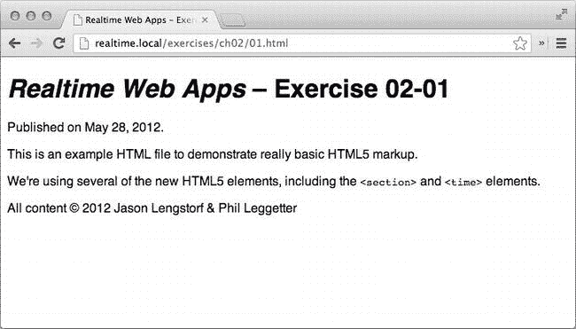
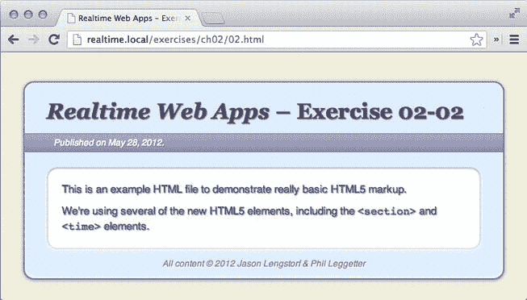
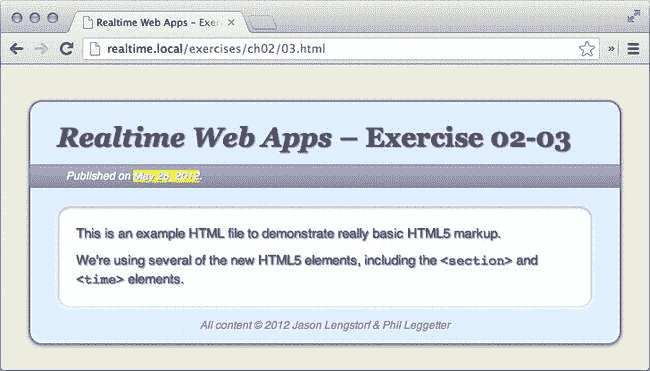
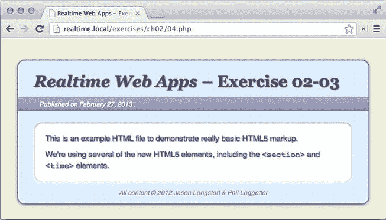

# 二、工具

在这一章中，你将对你将要构建的应用有一个大致的了解，以便学习如何使用实时网络技术。您将使用这个粗略的想法来确定构建应用所需的工具，并快速浏览每个工具的角色和功能。

在本章结束时，你应该对你已经知道的技术有所更新，并准备开始学习新的知识。

我们在建造什么？

在我们做任何其他事情之前，看一看我们正在试图构建的东西可能是一个好主意。这应该给我们一个应用需要做什么的粗略轮廓，这允许我们创建一个工具列表，我们将需要使这一切发生。

我们在本书中的目标是创建一个问答应用。该应用将允许演示者创建一个“房间”，与会者可以加入。

与会者将能够提出一个问题，该问题将立即显示在演示者的设备上，任何带有浏览器的设备，如笔记本电脑、平板电脑或智能手机，都将得到回答。如果另一个与会者已经问了这个问题，与会者将能够投票选择答案，以向演示者表明哪些问题是最紧迫的。

演示者可以将问题标记为已回答，还可以在演示结束时关闭房间。这些行动的结果将立即显示给所有与会者。

从发展角度来看，这意味着什么？

现在我们知道了应用的基本功能，我们需要将它分成不同的层，这也有助于我们将应用分成不同的技术。

首先，我们需要一个用户界面，这样用户就可以用简单的方式与我们的应用交互。没有出色的用户界面，我们的应用再酷、再有用也没用；如果它很难或令人困惑，它就不会被使用。

其次，我们需要**处理用户请求，并处理他们在与应用交互过程中执行的各种操作**。为了让应用有用，它需要做一些事情。

第三，我们需要**存储用户提供的应用数据**,以便房间可以存档，设置可以存储，并且各种其他数据可以在整个应用中保持。

第四，**更新需要是即时的**。如果用户不得不不断刷新以获取数据，那么问题重叠和错过信息的可能性会高得多。这个应用的有用性几乎完全取决于信息传递的实时性。

最后，我们需要确保认证并开始使用该网站**是简单而不费力的。用户可能会在演示开始时第一次使用这个应用，所以他们不会有很多时间来填写个人信息或查看确认电子邮件；我们需要让他们尽可能快地启动并运行应用。**

选择我们的工具

现在我们对应用的各个部分有了一个大致的概念，我们可以选择技术来满足每个部分的需求。让我们看看您将用来构建该应用的各种技术，并深入了解每种技术将扮演的角色。

HTML5

HTML5 是在开发界引起巨大轰动的技术之一，因此它的意义已经被营销人员、博客和一般极客媒体严重淡化了。

虽然 HTML5 的发布意味着我们开发网站的方式发生了很多变化和改进，但我们专注于几个关键部分，这些部分将帮助您实现这款应用。


我们为什么需要它？

HTML5 将提供一些我们需要的东西，让我们的应用以我们想要的方式工作，即这些:

*   **标记创建我们的应用的用户界面:**如果没有标记语言，就很难以一种易于理解的方式向用户呈现应用数据。几乎互联网上的每个网站和 web 应用都使用某种形式的 HTML 来呈现数据，我们的也不例外。
*   **WebSockets 允许演示者和出席者之间的实时交互:**我们将在本章的后面更详细地讨论这一点。
*   **比以前的 HTML 规范** **:** [<sup>1</sup>](#Fn1) 更干净、更简单的语法 HTML5 中的新元素——比如`<header>`和`<section>`——使得标记更容易扫描和调试，这减少了维护方面的麻烦，加快了我们的初始开发。
*   ****数据**属性，它允许我们轻松地包含额外的数据:**它本身并不是特别有用，但是当我们将它与 jQuery 结合使用时，它提供了一个非常简单有效的语法来处理特殊效果和事件。稍后，当您开始使用 jQuery 时，您将了解到更多这方面的内容。
*   **更健壮的表单元素来改善用户界面:**最初，HTML 只支持少得可怜的几种输入类型，这意味着开发人员不得不将大多数数据硬塞进带有`type="text"`的`<input>`中，并依赖客户端和服务器端的验证脚本来确保提供正确的信息。虽然 HTML5 还没有完全解决验证的问题，但它*已经*为我们提供了许多更有用的输入类型——包括`e-mail`、`number`和`URL`——这改善了一些现代浏览器的用户体验。

起到什么作用？

在我们的应用中，HTML5 将扮演应用骨架的角色。它将为数据和效果提供一个合适的结构。

它是如何工作的？

HTML5 由浏览器解释，浏览器读取 HTML 标签并分配表示样式。这些可以用 CSS 来修改，我们将在接下来讨论。

 **注意**因为本书假设了 HTML 的工作知识，所以只解释本书中将要用到的 HTML5 的新特性。如果你需要更多关于 HTML 或 HTML5 的信息，请查阅克里斯托弗·墨菲、理查德·克拉克、奥利·斯图德霍尔姆和迪维娅·马年的《HTML5 的开始》和《T4 的 CSS3》、《T5》、《T6》和《T7》、《T8》。

练习 2-1:使用 HTML5 标签创建一个 HTML 文件

下面是一个使用一些新标签的 HTML5 标记的基本例子:

```php
<!doctype html>
<html lang="en">

    <head>
        <meta charset="utf-8" />
        <title>Realtime Web Apps &ndash; Exercise 02-01</title>
    </head>

    <body>

        <header>
            <h1><em>Realtime Web Apps</em> &ndash; Exercise 02-01</h1>
            <p>
                Published on
                <time datetime="2012-05-28T20:26:00-07:00">May 28, 2012</time>.
            </p>
        </header>

        <section>
            <p>
                This is an example HTML file to demonstrate really basic
                HTML5 markup.
            </p>
            <p>
                We're using several of the new HTML5 elements, including
                the <code>&lt;section&gt;</code> and
                <code>&lt;time&gt;</code> elements.
            </p>
        </section>

        <footer>
            <p>All content &copy; 2012 Jason Lengstorf &amp; Phil Leggetter</p>
        </footer>

    </body>

</html>
```

该代码在浏览器中加载时，将呈现类似于[图 2-1](#Fig1) 的效果。



[图 2-1。](#_Fig1)我们的 HTML5 标记生成的浏览器输出

CSS3

和 HTML5 类似，CSS3 被过度炒作，被淡化了。就其核心而言，CSS3 规范的采用是朝着消除我们对黑客技术和大量图像的依赖以在我们的网站上创建酷效果迈出的一步。它引入了对视觉效果的支持——阴影、圆形边缘、渐变等等——并为开发人员提供了一种使用非标准字体而无需 Flash 或 JavaScript 破解的方式。它提供了选择元素的新方法，并为我们提供了一种无需使用 Flash 或 JavaScript 就能在页面上制作元素动画的方法。

我们为什么需要它？

CSS3 给了我们一些工具来做一些非常酷的效果，这将会改善我们的应用。其中包括:

*   让用户界面看起来更好的视觉效果:我们是视觉动物，我们倾向于被视觉上吸引人的东西所吸引。您将使用 CSS3，通过使用阴影和渐变等东西，为应用增添一些特色。
*   **改善用户体验的非必要动画:**由于还不完全支持，我们不能依赖 CSS3 过渡来制作必要的动画，但我们肯定可以使用它们为现代浏览器上的用户增加一些额外的活力。
*   **告诉浏览器如何显示标记的样式规则:**为了给我们的应用一个基本的外观，我们需要创建一个带有规则的样式表，告诉浏览器页面上的每个元素是什么样子。这是 CSS 的首要目的。

起到什么作用？

出于我们的目的，CSS3 将充当视觉层。它将赋予应用“皮肤”,提供我们所追求的精致美感，并创建小的、非必要的效果，以增强那些使用支持它们的浏览器的用户的体验。

它是如何工作的？

CSS 通过文档的`head.`中的`link`标签链接到 HTML 文档中，然后由浏览器解析，将样式规则应用于标记中包含的元素。这本书假设了 CSS 的基本知识，所以我们将只讨论你将在应用中使用的 CSS3 的新特性。

练习 2-2:将 CSS 添加到页面

让我们继续练习 2-1 中的代码，并在页面中添加一些 CSS。首先在 HTML 文件所在的文件夹中创建一个名为`styles`的新文件夹，然后在`styles`中创建一个名为`02.css`的新文件。

接下来，在我们在练习 02-01 的`<head>`部分创建的 HTML 文件中添加一个`<link>`标签。这将加载我们的 CSS 文件:

```php
<head>
    <meta charset="utf-8" />
    <title>Realtime Web Apps &ndash; Exercise 02-01</title>
    <link rel="stylesheet" href="styles/02.css" />
</head>

The CSS file is empty right now, so let's add a few rules to give our HTML some style. We'll include some CSS3 for extra flair as well:

/*
* Exercise 02-02, Realtime Web Apps
*
* @author Jason Lengstorf <jason@copterlabs.com>
* @author Phil Leggetter <phil@leggetter.co.uk>
*/

html { background: #efefdc; }

body {
    width: 660px;
    margin: 40px auto;
    background: #def;
    border: 2px solid #779;

    /* Creates two shadow effects: outer and inner */
    -webkit-box-shadow: 0 1px 6px #88a, inset 0 -1px 10px white;
    -moz-box-shadow: 0 1px 6px #88a, inset 0 -1px 10px white;
    -o-box-shadow: 0 1px 6px #88a, inset 0 -1px 10px white;
    -ms-box-shadow: 0 1px 6px #88a, inset 0 -1px 10px white;
    box-shadow: 0 1px 6px #88a, inset 0 -1px 10px white;
}

section {
    margin: 20px 30px 10px;
    padding: 20px 20px 10px;
    overflow: hidden;
    background: white;
    border: 1px solid #dfdfef;

    /* Creates two shadow effects: outer and inner */
    -webkit-box-shadow: inset 0 1px 4px #88a, 0 1px 10px white;
    -moz-box-shadow: inset 0 1px 4px #88a, 0 1px 10px white;
    -o-box-shadow: inset 0 1px 4px #88a, 0 1px 10px white;
    -ms-box-shadow: inset 0 1px 4px #88a, 0 1px 10px white;
    box-shadow: inset 0 1px 4px #88a, 0 1px 10px white;
}

body,section {
    /* Sets a border radius for every element that needs it */
    -webkit-border-radius: 15px;
    -moz-border-radius: 15px;
    -o-border-radius: 15px;
    -ms-border-radius: 15px;
    border-radius: 15px;
}

footer { margin: 0 0 10px; }

h1 {
    margin: 20px 30px 10px;
    color: #446;
    font: bold 30px/40px georgia, serif;
}

p {
    margin: 0 0 10px;
    font: 15px/20px sans-serif;
    color: #557;
}

h1,p { text-shadow: 1px 1px 1px #88a; }

header p {
    margin: 0;
    padding: 2px 40px;
    border-top: 1px solid #779;
    border-bottom: 1px solid #779;
    color: white;
    font-size: 12px;
    font-style: italic;
    line-height: 20px;
    text-shadow: 1px 1px 1px #779;

    /* Adds a gradient fade */
    background: #889;
    background-image: -webkit-linear-gradient(top, #aac 0%, #88a 100%);
    background-image: -moz-linear-gradient(top, #aac 0%, #88a 100%);
    background-image: -o-linear-gradient(top, #aac 0%, #88a 100%);
    background-image: -ms-linear-gradient(top, #aac 0%, #88a 100%);
    background-image: linear-gradient(top, #aac 0%, #88a 100%);
    background-image: -webkit-gradient(
                            linear,
                            left top,
                            left bottom,
                            color-stop(0, #aac),
                            color-stop(1, #88a)
                        );
}

footer p {
    margin: 0;
    color: #889;
    font: italic 12px/1.67em sans-serif;
    text-align: center;
    text-shadow: 1px 1px 1px white;
}
```

将这些规则保存在`02.css`中；然后保存并刷新 HTML 文件以查看规则生效(参见[图 2-2](#Fig2) )。为了获得最佳效果，请使用支持 CSS3 效果的最新浏览器，但是样式表可以在任何浏览器中工作，因为 CSS3 只添加了非必要的效果。



[图 2-2。](#_Fig2)应用了 CSS 样式表的(略微更新的)HTML 文件

 **注意**您可能已经注意到，有几个规则用一个供应商前缀声明了多次(`-webkit-`、`-moz-`等等)，这可能看起来有点混乱。因为 CSS3 还没有 100%完成，每个浏览器处理新规则的方式都略有不同。

如果没有办法在浏览器之间进行补偿，这可能会给开发人员带来问题，因此添加了供应商前缀，以允许不同的规则应用于不同的浏览器。希望不久的某一天，每一个新的 CSS3 规则都有一个统一的语法，但是事情仍然在变化，这是不可避免的。

JavaScript 和 jQuery

JavaScript 是一种客户端脚本语言，这意味着它在用户的计算机上执行。这使得它非常适合于一些任务，比如动画页面上的元素、进行动态计算，以及其他各种如果需要页面刷新就会非常不方便的操作。

JavaScript 还允许通过异步调用脚本来执行某些服务器端操作。这项技术通常被称为 AJAX:异步 JavaScript 和 XML。这个术语的 *XML* 部分的出现是因为请求通常会返回 XML 数据。虽然这不再是常见的用例，但是这个名字已经被记住了。本质上，AJAX 允许加载不同的页面，并使用 JavaScript 将其内容返回到当前页面。加载的页面可以接收来自 AJAX 请求的数据、处理数据、存储数据、检索新数据，并将数据返回给请求数据的脚本。(我们之前在[第一章](01.html)中讨论过这个问题)。

然而，尽管 JavaScript 拥有强大的功能，但它一直是个麻烦的动物，因为它的文档不够优秀，有时语法混乱，并且在其他浏览器上的实现不一致。因此，JavaScript 的学习曲线非常陡峭，任何希望在项目中使用它的开发人员都需要投入大量的时间。

为了应对这种挫折，一些团体和个人开始着手简化 JavaScript，让每个人都能使用它。他们创建了处理常见任务的框架，克服了跨浏览器的麻烦，并为新开发人员提供了良好的文档和支持社区。

起初有几十个这样的框架，包括 MooTools、YUI、Dojo、Prototype 和 jQuery。两者各有优缺点，但是 jQuery 似乎获得了最多的社区支持，这主要是因为它有很好的文档和非常简单的语法。

我们为什么需要它？

改进的 JavaScript 文档、对该技术使用的普遍接受以及语言标准化为使用该语言的开发人员带来了更好的开发体验。然而，在某些情况下，库还是非常有用的。jQuery 将处理任何未解决的跨浏览器不一致问题，并为我们提供执行以下任务所需的工具:

*   **创建动画来显示应用中正在发生的事情:**通过动画显示各种动作来显示用户正在发生的事情是增强用户界面的一种很好的方式，它增加了我们正在努力实现的整体完美性。
*   **处理用户事件:**当用户与应用交互时——无论是点击、轻击还是滑动——浏览器都会触发一个事件，jQuery 可以检测到该事件并根据用户的动作执行任务。
*   **显示实时事件的结果:**当用户执行某些操作时，应用需要向当前与之交互的所有用户显示操作的结果。您将使用 WebSocket 技术和 Pusher 来处理数据发送——我们将很快介绍这一点——但是通过 WebSocket 连接接收到的信息将触发一个事件，就像单击或任何其他用户交互一样。我们将使用 jQuery 来处理这些事件，并根据应用中发生的事情来执行任务。

起到什么作用？

jQuery 将扮演这款应用一半大脑的角色。它会根据用户交互或实时事件注意到应用中的任何变化，并适当地处理这些变化，或者通过制作动画，或者在其他地方(如另一个用户的设备上)发生变化时更新用户。

它是如何工作的？

使用一个由浏览器解析的`<script>`标签将 JavaScript 加载到 HTML 标记中。本书假设读者具备 jQuery 的基础知识，因此为了简洁起见，很多基础知识将被跳过。

 **注意**如果你想学习 jQuery 的基础知识，可以去拿一本 Jason Lengstorf 写的 *Pro PHP 和 jQuery* [<sup> 3 </sup>](#Fn3) 。

练习 2-3:添加一个简单的 JQUERY 效果

为了试验 jQuery，让我们向 HTML 文件添加一个小脚本，它将执行以下操作:

1.  绑定到所有`<code>`元素上的悬停事件。
2.  当鼠标悬停时，它将从用户鼠标悬停的标签中获取文本，并使用该元素的文本内容来标识页面上的其他元素；例如，`<code>&lt;time&gt;</code>`标识其他`<time>`元素。
3.  其他元素的背景将被设置为黄色。

第一步是在 HTML 文件所在的目录下创建一个名为`scripts`的新文件夹，并在其中创建一个名为`03.js`的新文件。

接下来，使用`<script>`标签将 jQuery 和`03.js`加载到 HTML 文件中，将它们插入到结束标签的上方

```php
</body> tag:</footer>
<script src="[http://code.jquery.com/jquery-1.7.2.min.js"></script](http://code.jquery.com/jquery-1.7.2.min.js"></script)>
<script src="scripts/03.js"></script>
</body>

```

现在我们需要将代码添加到`03.js`中。关于代码的更多细节，它将遵循的步骤如下:

*   为每个`<code>`标签的`hover`事件绑定两个函数:一个用于鼠标进入悬停状态，一个用于鼠标退出悬停状态。
*   使用 jQuery 的`.text()`方法检测`<code>`元素中的标记名；使用简单的正则表达式删除任何非字母数字的字符(删除左括号和右括号)；并将匹配的字符串转换为一个`String`来防止错误。
*   悬停时，找到匹配的元素，使用`.data()`存储每个元素的原始背景色；然后使用`.css()`将背景颜色更改为黄色。
*   悬停结束后，用`.data()`取回原来的背景色；然后用`.css()`恢复。

```php
/*
* Exercise 02-03, Realtime Web Apps
*
* @author Jason Lengstorf <jason@copterlabs.com>
* @author Phil Leggetter <phil@leggetter.co.uk>
*/

(function($) {

    // Highlights the element contained in the <code> tag
    $('code').hover(
        function() {
            var elem = $(getElementName(this)),
                bg   = elem.css("background");
            elem.data('bg-orig', bg).css({ "background": "yellow" });
        },
        function() {
            var elem = $(getElementName(this)),
                bg   = elem.data('bg-orig');
            $(elem).css({ "background": bg });
        }
    );

    /**
     * Retrieves the element name contained within a code tag
     */
    function getElementName(element) {
        return String($(element).text().match(/\w+/));
    }

})(jQuery);

```

保存您的代码；然后重新加载 HTML 并将鼠标放在其中一个`<code>`标签上以查看结果(如图 2-3 中的[所示)。](#Fig3)



[图 2-3。](#_Fig3)一个简单的 jQuery 效果在 HTML5 标签的名字被悬停时高亮显示。当用户将鼠标悬停在<时间>文本上时，会高亮显示<时间>元素

PHP

PHP 是一种服务器端脚本语言，为处理数据提供了强大的工具。它为开发人员提供了一种在 HTML 标记中构建动态内容的方法，并且已经发展成为互联网上使用最广泛的服务器端脚本语言之一。

PHP 不是我们可以使用的唯一语言，因为有许多语言可以让我们构建 web 应用。许多语言也让我们使用实时网络技术，但有些语言做得比其他语言好。Node.js 与实时 web 技术紧密相关，主要是因为它的事件性质和 socket.io， [<sup>4</sup>](#Fn4) ，这可能是最著名的实时 web 框架；Ruby 有很多解决方案，最流行的是 FAYE[T55](#Fn5)。NET 有一个相当新的微软支持的解决方案，叫做 SignalR [<sup>6</sup>](#Fn6) Python 有很多基于 Tornado 框架的解决方案； [<sup>7</sup>](#Fn7) 以此类推。

有趣的是，PHP 应用通常运行在 Apache 上，并不太适合实时 web 技术，因为它们是在考虑 HTTP 和请求响应范例的情况下构建的。它们不是为处理维护大量持久连接甚至高容量轮询而构建的。这实际上给了我们一个使用 Pusher 的很好的理由，作为一种托管服务，Pusher 消除了维护我们实时 web 技术基础设施的潜在痛苦。

我们为什么需要它？

您的应用将利用 PHP 的几个特性来为应用添加功能，例如:

*   **动态生成输出以定制应用的显示:**像用户名、当前“房间”的名称和演示者的姓名这样的东西需要动态插入到 HTML 标记中。
*   **连接到 Pusher API 以实现实时通信:**我们将在本章的后面讨论这一点，并在[第 3 章](03.html)中详细讨论。

起到什么作用？

如果 JavaScript/jQuery 是我们应用的半脑，PHP 将扮演另一半的角色。它将处理用户发送到应用的数据，并发送回各种用户请求的处理后的响应。

它是如何工作的？

PHP 是一个*预处理器* ，这意味着它在页面呈现之前进行计算和数据操作。这意味着 PHP 代码被嵌入到标记中，服务器读取 PHP 并在将标记传递给浏览器之前用适当的输出替换它。

 **注意**这本书假设了 PHP 的工作知识，所以基本概念和语法将不被涵盖。如果你想提高你的 PHP 水平，请阅读 Jason Lengstorf 为绝对初学者编写的*PHP*、 [<sup> 8 </sup>](#Fn8) 。

练习 2-4:使用 PHP 插入动态内容

让我们通过将当前日期动态插入标记来试验 PHP。为此，我们需要将 HTML 的一个新副本保存为 PHP 文件，我们将其命名为`04.php`。

接下来，让我们在文件的最顶端插入一些 PHP 代码，就在`<!doctype>`声明的上面:

```php

<?php

    // Set the timezone and generate two formatted date strings
    date_default_timezone_set('US/Pacific');
    $datetime = date('c');
    $date_fmt = date('F d, Y');?>
<!doctype html>

```

如注释所示，这段代码将时区设置为太平洋时区，然后在变量中存储两个格式化的日期字符串。

现在我们有了变量，让我们通过在标记中插入以下内容将它们插入到`<time>`标记中:

```php

<header>
    <h1><em>Realtime Web Apps</em> &ndash; Exercise 02-04</h1>
    <p>
        Published on
        <time datetime="
<?php echo $datetime; ?>">
            <?php echo $date_fmt; ?>
        </time>.
    </p>
</header>

```

保存此文件；然后将其加载到浏览器中，查看显示的当前日期(参见[图 2-4](#Fig4) )。



[图 2-4。使用 PHP，在标记中输出当前日期](#_Fig4)

MySQLt1 版

MySQL 是一个数据库管理系统——准确地说是一个关系数据库管理系统(RDBMS)——是这个星球上使用最广泛的。它提供了一种易于阅读的语法来存储和检索表中的数据，并允许开发人员创建可以存储用户设置等数据的应用，在我们的应用中，还可以存储房间名称和问题。

我们为什么需要它？

某些数据(如房间名称和提出的问题)需要存储在数据库中，以便日后检索:

*   **会议室的详细信息:**会议室名称和会议信息等详细信息，以便演示者日后返回会议室参考。
*   **在每个房间问的问题:**这允许新与会者迟到，不会错过任何东西。

起到什么作用？

MySQL 将扮演我们应用的内存角色。它会记住各种房间和问题的详细信息，并在将来需要时做好准备。

它是如何工作的？

MySQL 安装在服务器上，通过创建数据库、数据库中的表和表中的行来工作。

每一行都是一段特定的数据。例如，如果表名为 *rooms* ，那么每一行都将包含一个房间的信息，比如它的名称、惟一标识符和其他相关数据。

 **注意** MySQL 也涵盖在前面提到的 *PHP 绝对初学者*中。

练习 MYSQL 的乐趣

因为将 MySQL 与我们的 HTML 标记集成在一起需要太多的设置，所以让我们变得古怪一点，在命令行上使用 MySQL。当然，您需要在您的系统上安装和配置 MySQL。打开终端并连接到 MySQL，用您的 MySQL 用户名替换*您的用户名*:

```php
mysql -uyour_username -p
```

应该会提示您输入密码，然后您将连接到 MySQL 服务器。你也可以使用桌面客户端或者 phpMyAdmin 来做这个练习——在 Mac 上我们推荐 SequelPro， [<sup>9</sup>](#Fn9) ，在 Windows 上我们听说过 Navicat 的优点。 [<sup>10</sup>](#Fn10)

一旦您连接到服务器，创建一个数据库来玩，并确保事情按预期工作。姑且称之为`awesome_test_db`:

```php
CREATE DATABASE awesome_test_db;
```

这将为您提供以下输出:

```php
Query OK, 1 row affected (0.00 sec)
```

现在，让我们选择将对其执行查询的数据库:

```php
USE awesome_test_db;
```

这应该告诉您数据库已经更改，这意味着我们现在可以创建一个表:

```php
CREATE TABLE awesome_things (
    id      INT PRIMARY KEY AUTO_INCREMENT,
    name    VARCHAR(64),
    percent TINYINT
);
```

准备好表格后，我们可以插入几行；每一行都有一个事物的名称和一个百分比来表示它有多棒。请记住，这只是为了好玩，并证明 MySQL 正在工作:

```php
INSERT INTO awesome_things (name, percent)
VALUES
    ('Wooden sunglasses', 72),
    ('Pabst Blue Ribbon', 85),
    ('Bands no one has heard of', 100),
    ('Vintage clothing', 67);
```

这将为您提供以下输出:

```php
Query OK, 4 rows affected (0.00 sec)
Records: 4  Duplicates: 0  Warnings: 0
```

既然我们知道了什么是令人敬畏的，让我们确保我们知道所有超过 75%令人敬畏的事情:

```php
SELECT CONCAT(name, ': ', percent, '% awesome, which means I'm onboard.')
FROM awesome_things
WHERE percent>75
ORDER BY percent DESC;
```

使用`CONCAT()`允许我们将输出组合成一个句子，而不仅仅是查看原始数据。使用`WHERE`子句，我们可以过滤结果，以便我们只看到超过 75%的精彩行，因为我们想首先看到最精彩的内容，所以我们按照*降序*中的`percent`排序，或者从高到低排序。执行时，您将看到以下内容:

```php
+----------------------------------------------------------------------+
| CONCAT(name, ': ', percent, '% awesome, which means I'm onboard.') |
+----------------------------------------------------------------------+
| Bands no one has heard of: 100% awesome, which means I'm onboard.     |
| Pabst Blue Ribbon: 85% awesome, which means I'm onboard.           |
+----------------------------------------------------------------------+
2 rows in set (0.00 sec)
```

现在您知道什么是最棒的了，您可能想要通过完全删除数据库来销毁证据:

```php
DROP DATABASE awesome_test_db;
```

这将完全删除数据库，这样您的 MySQL 服务器就不会塞满测试数据。

HTML5 WebSocket 技术和推送器

我们已经谈了一点 WebSocket 和 realtime，但是让我们回顾一下:HTML5 WebSocket 允许应用将数据推送到客户端，而不是要求客户端不断请求新数据。

练习 2-6:试用 WEBSOCKET API

让我们看一下本地 WebSocket API，以了解如何使用它。创建一个包含以下内容的 HTML 文件。该文件包含连接到 WebSocket echo 测试服务的 JavaScript。这意味着您可以测试连接、发送和接收消息。

```php
<!doctype html>
<html lang="en">

    <head>
        <meta charset="utf-8" />
        <title>Trying out the WebSocket API 02-06</title>
    </head>

    <body>

        <script>
            var ws = new WebSocket( 'ws://echo.websocket.org' );

            ws.onopen = function() {
              console.log( 'connected' );
              console.log( '> hello' );
              ws.send( 'hello' );
            };
            ws.onmessage = function( ev ) { console.log( '< ' + ev.data ); };
            ws.onclose = function() { console.log( 'closed' ); };
            ws.onerror = function() { console.log( 'error' ); };
        </script>

    </body>

</html>
```

如果您在支持 WebSocket 的浏览器中打开此页面，并打开浏览器的 JavaScript 控制台，您将看到以下内容:

```php
connected
> hello
< hello
```

当 WebSocket 已经连接到服务器，并且已经调用了`onopen`函数处理程序时，显示`connected`消息。代码随后记录`> hello`以表明它将通过 WebSocket 连接使用 WebSocket `send`函数发送`hello`到服务器。最后，当服务器回显消息时，调用`onmessage`函数处理程序，并将`< hello`记录到控制台。

这演示了如何使用 WebSocket API，并向您展示了它的用处。但是，正如我们在[第 1 章](01.html)中所提到的，WebSocket API 还没有被所有的浏览器完全支持，我们需要一个后备机制。因此，如果我们必须自己处理浏览器兼容性问题，实现实时应用可能会很麻烦、棘手，而且非常耗时。

幸运的是，对于我们其他人来说，有许多服务已经克服了这些障碍，并创建了从检查 WebSocket 支持开始的 APIs 然后回归检查下一个最好的解决方案，直到他们找到一个工作。结果是强大的实时功能，而没有向后兼容的麻烦。

在这些提供实时服务的公司中，Pusher 以其极其简单的实现方式脱颖而出，为那些没有庞大用户群、优秀文档和有帮助的支持人员的服务提供免费账户。

Pusher 提供了一个 JavaScript 库 [<sup>11</sup>](#Fn11) ，它不仅可以处理旧浏览器的回退，还可以通过其 API 提供自动重新连接和发布/订阅 [<sup>12</sup>](#Fn12) 消息传递抽象等功能，这比我们使用原生 WebSocket API 时简单处理一般消息要容易得多。

最后，因为 Pusher 是一个托管服务，它将负责维护数据传输的持久连接，并且可以处理扩展以满足我们的需求。虽然后一点对于我们的示例应用来说可能不是什么大问题，但是在构建生产应用时，这是一个值得考虑的问题。

出于这些原因，我们将在本书中使用 Pusher 来构建我们的实时系统。

我们为什么需要它？

Pusher 将允许您向应用添加实时通知和更新，包括以下内容:

*   **添加新问题时更新所有用户:**这意味着当用户添加新问题时，该房间中当前使用该应用的所有用户都会立即收到新问题。
*   **当演示者将问题标记为“已回答”时更新与会者:**当演示者回答问题时，将其标记为“已回答”将会立即更新所有与会者的设备，以防止混淆。
*   **当多个与会者希望回答同一个问题时更新演示者:**如果多个用户对某个问题的答案感兴趣，他们可以投票支持该问题。演示者将收到一个视觉提示，让他们知道问题很紧迫。
*   **会议室关闭时更新所有与会者:**当演示者关闭会议室时，需要更新与会者，以便他们知道不要问任何不会得到回答的问题。

起到什么作用？

Pusher 将扮演应用神经系统的角色:当发生变化时，它会收到通知，并将信息传递给应用的大脑，以便它们可以处理信息。

它是如何工作的？

简而言之，Pusher 提供了一种机制，让客户端“监听”应用的变化。当事情发生时，Pusher 会向所有正在监听的客户发送通知，以便他们能够做出适当的反应。这就是我们前面提到的发布/订阅范例。

第 3 章专注于更详细的细节，因此我们将跳过这一部分的练习。

oath

与目前讨论的技术不同，OAuth 是一种协议，而不是一种真正的编程语言。这是 2007 年起草的一个概念，旨在解决提供重叠服务的网站带来的问题；想想社交网络如何访问你的地址簿来寻找朋友，或者照片共享网站如何连接到 Twitter，让你的关注者知道你何时发布了新照片。

问题是这样的:当这些服务开始协同工作时，它们要求用户提供用户名和密码来访问服务，这是一个潜在的巨大风险。怎样才能阻止一个可疑的服务出于自己的目的使用那个密码，包括改变你的密码并把你锁在外面？

这是一个大问题。OAuth 基于对许多其他解决问题的尝试的研究，设计了一个解决方案，使用了它认为每个方案的最佳部分。

套用 OAuth 网站上一个很好的比喻: [<sup>13</sup>](#Fn13)

OAuth 就像给某人一辆豪华汽车的代客钥匙。一把代客钥匙只能让汽车行驶几英里；它不允许进入后备箱；它阻止使用汽车车载电脑中的任何存储数据，如地址簿。OAuth 类似于您的在线服务的代客钥匙:您不需要提供密码，并且您可以只允许帐户的某些特权，而不会暴露您的所有信息。

例如，脸书使用 OAuth 对第三方服务进行用户认证。如果您已经登录到脸书，您会看到一个对话框(在脸书的域上)，告诉您需要哪些权限，并允许您接受或拒绝请求。特权是分门别类的——例如，阅读某人的时间表不同于查看他们的好友列表——以确保第三方服务只获得他们需要的特权。

这保证了用户的安全，并减少了网络应用的责任。它还为开发人员提供了一个极好的好处:我们可以允许用户使用他们的脸书、Twitter 或其他使用简单 API 的凭证登录我们的应用。

我们为什么需要它？

我们在构建的应用中不需要它，但它会是一个很好的功能，所以如果你想知道如何包含它，我们将它包含在附录 A 中。简而言之，我们将使用 OAuth 来消除构建用户管理系统的需要。这也将极大地减少注册账户所需的时间，而不会减少应用运行所需的信息。

让我们面对现实吧:大多数人在互联网上拥有的账号比他们能记住的还要多。有人使用我们的应用和不使用我们的应用之间的区别可能就像他必须点击多少个按钮才能开始一样简单。

OAuth 提供了一种很好的方式来获得我们需要的一切:

*   **验证这个人确实是真实的:**我们可以合理地假设，任何登录到有效的脸书或推特账户的人都是真实的。
*   **收集关于用户的必要数据:**对于这个应用，我们只需要一个名字和电子邮件。
*   **降低准入门槛:**通过消除创建账户的所有常规步骤，我们可以让用户只需点击两下就能在几秒钟内进入我们的应用。

起到什么作用？

OAuth 将是我们应用的看门人。它将使用第三方服务来验证用户的真实性，并收集应用运行所需的必要信息。

它是如何工作的？

你可以在附录 A 中找到关于 OAuth 细节的更多细节，但是在它的核心，OAuth 联系服务，我们希望通过它来验证我们的用户，并发送一个标识我们应用的令牌。如果用户尚未登录第三方服务，系统会提示用户登录，然后允许或拒绝我们的应用请求的权限。如果用户允许我们的应用访问所请求的数据，服务会发回一个令牌，我们可以使用它来检索必要的数据，并认为用户“登录”了我们的应用。

摘要

此时，我们已经成功地为我们的应用定义了一个粗略的功能和需求列表。我们还利用这些信息充实了一个工具列表，我们将使用这些工具来使这款应用变得更加生动。

在下一章中，您将熟悉 Pusher 及其底层技术，并将构建您的第一个实时应用。

[<sup>1</sup>](#_Fn1) 这是 100%作者的意见。

[<sup>2</sup>](#_Fn2)T0】

[<sup>3</sup>](#_Fn3)T0】

[<sup>4</sup>](#_Fn4)T0】

[<sup>6</sup>](#_Fn6)T0】

[<sup>5</sup>](#_Fn5)T0】

[<sup>7</sup>](#_Fn7)T0】

[<sup>8</sup>](#_Fn8)T0】

[<sup>9</sup>](#_Fn9)T0】

[<sup>10</sup>](#_Fn10)T0】

[<sup>11</sup>](#_Fn11)T0】

[<sup>12</sup>](#_Fn12)T0】

[<sup>13</sup>](#_Fn13)T0】