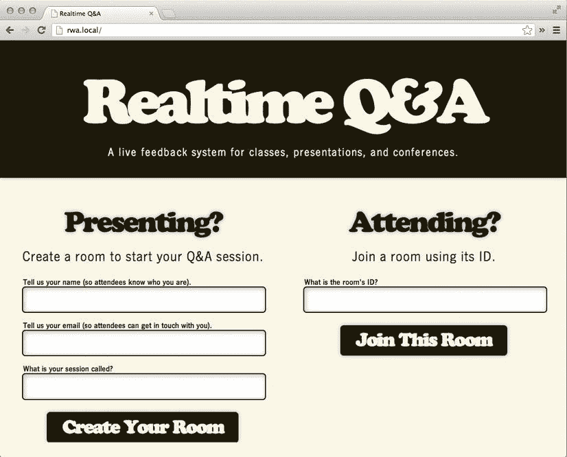
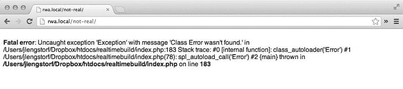
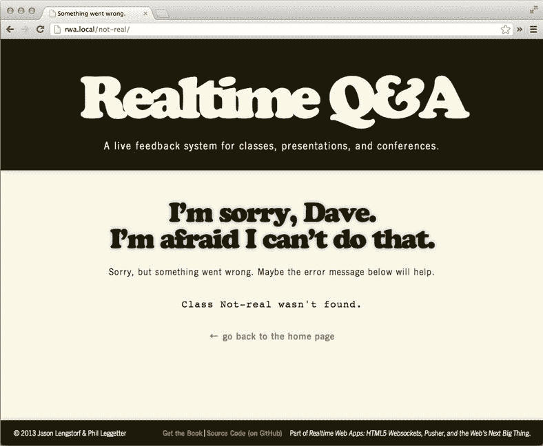
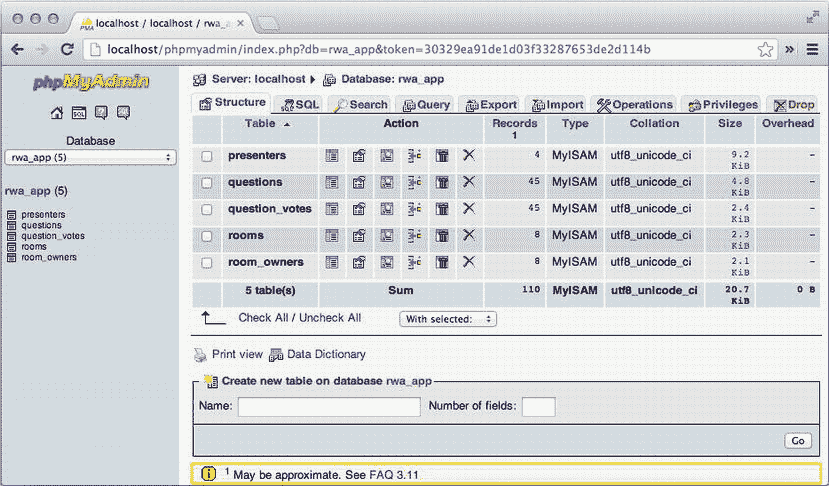

第八章


构建后端:第 1 部分

到目前为止，在 app 开发过程中，大部分的努力都是针对网站的前端。在本章中，您将构建驱动前端的后端脚本。

滚动你自己的简单 MVC 框架

在构建应用程序之前，你的首要任务是为它构建一个框架。正如我们之前所确定的，模型-视图控制器(MVC)框架将是这个特定构建中的最佳选择。

在本节中，您将从头开始构建一个 MVC 框架。这是一项复杂的任务，所以我们分两章来完成。在第一章中，你将建立主页的框架和它背后的一些逻辑，在第九章中，我们将填充 MVC 结构并完成应用程序。

确定目录结构

一个好的应用程序从适当的组织开始。在 web 根文件夹中，创建两个文件夹并添加子文件夹，如下所示:

*   `assets`

*   `images`
*   `scripts`
*   `styles`

*   `system`

*   `config`
*   `controllers`
*   `core`
*   `inc`
*   `lib`
*   `models`
*   `views`

在我们构建应用程序时，我们将介绍这些文件夹的用途；现在，请放心，这个应用程序将组织良好。

为所有请求设置路由器

您的框架需要的第一件事是一个将请求路由到适当位置的脚本。该脚本将初始化任何必要的配置变量，加载任何额外的必需脚本，并确定用户通过适当的控制器发送请求的意图(通过 URL)。

设置配置变量

因为这个应用程序的每个安装可能会有不同的配置，你将建立一个配置文件。在`/system/config`中，创建一个名为`config.inc.php`的新文件，并插入以下内容:

```php
<?php

/**
 * A sample configuration file
 *
 * The variables below need to be filled out with environment specific data.
 *
 * @author  Jason Lengstorf <jason@lengstorf.com>
 * @author  Phil Leggetter <phil@leggetter.co.uk>
 */

// Set up an array for constants
$_C = array();

//-----------------------------------------------------------------------------
// Converts the constants array into actual constants
//-----------------------------------------------------------------------------

foreach ($_C as $constant=>$value) {
    define($constant, $value);
}
```

到目前为止，这实际上并没有创建任何配置变量，但是它建立了一个结构来实现这一点。所有配置变量都将被添加到`$_C`数组中，该数组通过脚本底部的一个`foreach`循环运行，将每个变量定义为一个常量。

 **注意**配置变量被定义为常量是因为 1)它们是不可变的，这意味着它们在执行过程中不能被更改；2)它们需要在全局范围内，以便对函数和类可用。

结构就绪后，开始添加配置变量。在本章中，我们需要存储以下特定于应用程序的数据:

*   应用程序的时区
*   数据库配置信息
*   是否显示调试信息

在`config.inc.php`中，添加粗体显示的代码，将配置变量声明为常量:

```php
<?php

/**
 * A sample configuration file
 *
 * The variables below need to be filled out with environment specific data.
 *
 * @author  Jason Lengstorf <jason@lengstorf.com>
 * @author  Phil Leggetter <phil@leggetter.co.uk>
 */

// Set up an array for constants
$_C = array();

//-----------------------------------------------------------------------------
// General configuration options
//-----------------------------------------------------------------------------

$_C['APP_TIMEZONE'] = 'US/Pacific';

//-----------------------------------------------------------------------------
// Database credentials
//-----------------------------------------------------------------------------

$_C['DB_HOST'] = 'localhost';
$_C['DB_NAME'] = '';
$_C['DB_USER'] = '';
$_C['DB_PASS'] = '';

//-----------------------------------------------------------------------------
// Enable debug mode (strict error reporting)
//-----------------------------------------------------------------------------

$_C['DEBUG'] = TRUE;

//-----------------------------------------------------------------------------
// Converts the constants array into actual constants
//-----------------------------------------------------------------------------

foreach ($_C as $constant=>$value) {
    define($constant, $value);
}
```

为每个变量添加正确的值后，保存此文件；您可以稍后在编辑器中关闭它，因为在本章中您不需要再次编辑该文件。

 **注意**不要忘记使用您的开发数据库凭证更新`DB_HOST`、`DB_NAME`、`DB_USER`和`DB_PASS`值。如果没有它们，当您在本章后面构建数据库连接脚本时，应用程序将抛出一个致命错误。

正在初始化应用程序

应用程序的首要任务是设置环境变量和全局设置。这将让应用程序知道文件在哪里，如何连接到数据库，是否显示调试信息，以及其他步骤，使事情在引擎盖下顺利运行。

在 web 根文件夹中，创建一个名为`index.php`的新文件。在里面，首先设置应用程序的基础:

```php
<?php

/**
 * The initialization script for the app
 *
 * @author  Jason Lengstorf <jason@lengstorf.com>
 * @author  Phil Leggetter <phil@leggetter.co.uk>
 */

//-----------------------------------------------------------------------------
// Initializes environment variables
//-----------------------------------------------------------------------------

// Server path to this app (i.e. /var/www/vhosts/realtime/httpdocs/realtime)
define('APP_PATH',   dirname(__FILE__));

// App folder, relative from web root (i.e. /realtime)
define('APP_FOLDER', dirname($_SERVER['SCRIPT_NAME']));

// URL path to the app (i.e.http://example.org/realtime/)
define(
    'APP_URI',
    remove_unwanted_slashes('http://' . $_SERVER['SERVER_NAME'] . APP_FOLDER . '/')
);

// Server path to the system folder (for includes)
define('SYS_PATH',   APP_PATH . '/system');
```

`APP_PATH`是一个常量，它将存储应用程序在服务器上的绝对路径。这是用于 PHP 包含。

另一方面，`APP_FOLDER`存储来自 web 根的相对路径。它将用于相对链接或 CSS 包含和资产路径。为了避免从子目录运行应用程序的问题，包含了一个尾随斜线。由于调用了`remove_unwanted_slashes()`，我们可以轻松地做到这一点。

`APP_URI`是app 的实际 URI。例如，如果应用程序位于`www.example.org`的网络根目录下，`APP_URI`将包含`http://www.example.org/;`，如果应用程序位于名为 realtime 的子目录中，`APP_URI`将存储`http://www.example.org/realtime/`。

 **注** `APP_URI`部分是用一个叫做`remove_unwanted_slashes()`的函数确定的，这个函数还没有定义。这将在下一节中添加。

最后，`SYS_PATH`包含系统文件的路径(这是 MVC 框架的大部分)。

在应用程序常量下面，您现在可以设置会话，包括配置变量，为应用程序设置适当的错误报告级别，以及设置应用程序时区。将粗体显示的代码添加到`index.php` :

```php
<?php

/**
 * The initialization script for the app
 *
 * @author  Jason Lengstorf <jason@lengstorf.com>
 * @author  Phil Leggetter <phil@leggetter.co.uk>
 */

//-----------------------------------------------------------------------------
// Initializes environment variables
//-----------------------------------------------------------------------------

// Server path to this app (i.e. /var/www/vhosts/realtime/httpdocs/realtime)
define('APP_PATH',   dirname(__FILE__));

// App folder, relative from web root (i.e. /realtime)
define('APP_FOLDER', dirname($_SERVER['SCRIPT_NAME']));

// URL path to the app (i.e.http://example.org/realtime)
define(
    'APP_URI',
    remove_unwanted_slashes('http://' . $_SERVER['SERVER_NAME'] . APP_FOLDER)
);

// Server path to the system folder (for includes)
define('SYS_PATH',   APP_PATH . '/system');

// Relative path to the form processing script (i.e. /realtime/process.php)
define('FORM_ACTION', remove_unwanted_slashes(APP_FOLDER . '/process.php'));

//-----------------------------------------------------------------------------
// Initializes the app
//-----------------------------------------------------------------------------

// Starts the session
if (!isset($_SESSION)) {
    session_start();
}

// Loads the configuration variables
require_once SYS_PATH . '/config/config.inc.php';

// Turns on error reporting if in debug mode
if (DEBUG===TRUE) {
    ini_set('display_errors', 1);
    error_reporting(E_ALL^E_STRICT);
} else {
    ini_set('display_errors', 0);
    error_reporting(0);
}

// Sets the timezone to avoid a notice
date_default_timezone_set(APP_TIMEZONE);
```

因为这个应用程序将利用会话在页面加载之间传递数据，所以如果没有设置`$_SESSION`超级全局，脚本将调用`session_start()`。

然后，在加载配置变量之后，脚本检查`DEBUG`的值，并且——如果它被设置为`TRUE`,在开发期间应该总是这样——打开严格的错误报告；否则，会抑制错误。

最后，因为 PHP 会抛出一个没有它的通知，所以使用`APP_TIMEZONE`变量来设置时区。

设置实用功能

为了避免混淆路由器的逻辑，复杂的操作应该封装在函数中。幸运的是，本节没有太多复杂的操作，所以我们只需要创建四个实用函数:

*   解析 URI 并将其各部分作为数组返回的函数
*   使用 URI 部件确定控制器名称的函数
*   一种功能，用于防止 URI 中除其协议以外的任何部分出现双斜线
*   一个自动加载器，将检查我们的应用程序中的类，并包括它们(或提供一个有用的错误消息，如果请求的类不存在)

解析 URI

因为我们希望我们的应用程序有漂亮的 URIs，而不是笨拙的查询字符串，我们需要一种方法来确定 URI 的哪些部分是用于配置的，哪些只是 URI 的一部分。

 **注意**因为这个应用可能不总是安装在 URI 的根目录下，所以解析脚本需要将 URI 与应用的位置进行比较，并只返回*URI 中不引用应用在服务器上的位置的部分。*

 *例如，如果应用程序安装在`http://www.example.org/`，房间 ID 1234 的 URI 将是`http://www.example.org/room/1234`。然而，如果应用程序安装在名为`realtime`的子目录中，则房间 ID 1234 的 URI 将是`http://www.example.org/realtime/room/1234`。

在这两种情况下，我们只希望通过`parse_uri()`函数返回“房间”和“1234”。

然后，URI 中与位置无关的部分将被以正斜杠分开，并存储为供应用程序使用的数组，应用程序将使用它们来确定要显示的视图(以及稍后将介绍的其他一些内容)。

在`index.php`的底部，使用粗体显示的代码添加 URI 解析函数:

```php
//-----------------------------------------------------------------------------
// Initializes the app
//-----------------------------------------------------------------------------

// Starts the session
if (!isset($_SESSION)) {
    session_start();
}

// Loads the configuration variables
require_once SYS_PATH . '/config/config.inc.php';

// Turns on error reporting if in debug mode
if (DEBUG===TRUE) {
    ini_set('display_errors', 1);
    error_reporting(E_ALL^E_STRICT);
} else {
    ini_set('display_errors', 0);
    error_reporting(0);
}

// Sets the timezone to avoid a notice
date_default_timezone_set(APP_TIMEZONE);

//-----------------------------------------------------------------------------
// Function declarations
//-----------------------------------------------------------------------------

/**
 * Breaks the URI into an array at the slashes
 *
 * @return array  The broken up URI
 */
function parse_uri(  )
{
    // Removes any subfolders in which the app is installed
    $real_uri = preg_replace(
            '∼^'.APP_FOLDER.'∼',
            '',
            $_SERVER['REQUEST_URI'],
            1
        );

    $uri_array = explode('/', $real_uri);

    // If the first element is empty, get rid of it
    if (empty($uri_array[0])) {
        array_shift($uri_array);
    }

    // If the last element is empty, get rid of it
    if (empty($uri_array[count($uri_array)-1])) {
        array_pop($uri_array);
    }

    return $uri_array;
}
```

`parse_uri()`函数首先使用`preg_replace()`从请求的 URI 中删除`APP_FOLDER`，只留下告诉应用程序用户请求什么的位。然后，该函数使用`explode()`在正斜杠处分割 URI，然后在返回数组之前检查数组开头和结尾的空元素。

获取控制器名称

接下来，您需要找出合适的控制器名称来加载给定的 URI 部件。为此，将以下粗体代码添加到`index.php`:

```php
//-----------------------------------------------------------------------------
// Function declarations
//-----------------------------------------------------------------------------

/**
 * Breaks the URI into an array at the slashes
 *
 * @return array  The broken up URI
 */
function parse_uri(  )
{
    // Removes any subfolders in which the app is installed
    $real_uri = preg_replace(
            '∼^'.APP_FOLDER.'∼',
            '',
            $_SERVER['REQUEST_URI'],
            1
        );

    $uri_array = explode('/', $real_uri);

    // If the first element is empty, get rid of it
    if (empty($uri_array[0])) {
        array_shift($uri_array);
    }

    // If the last element is empty, get rid of it
    if (empty($uri_array[count($uri_array)-1])) {
        array_pop($uri_array);
    }

    return $uri_array;
}

/**
 * Determines the controller name using the first element of the URI array
 *
 * @param $uri_array array  The broken up URI
 * @return string           The controller classname
 */
function get_controller_classname( &$uri_array )
{
    $controller = array_shift($uri_array);
    return ucfirst($controller);
}
```

这个函数很简单:通过引用将 URI 传递给函数*，将第一个元素加载到变量`$controller`中，然后将第一个字母大写并返回该值。*

 **注意**使用&符号(`&`)通过引用传递变量意味着在函数内部执行的操作不仅会影响传递给它的数据，还会影响调用该函数的范围。

这意味着`http://example.com/room/1234/`的 URI 将被解析为具有以下结构的数组:

```php
array(2) {
  [0]=>
  string(4) "room"
  [1]=>
  string(4) "1234"
}
```

数组的第一个元素“room”将被隔离、大写，然后返回，给我们这个`get_controller_classname()`函数的返回值:

```php
Room
```

 **注**我们将在本章的稍后部分讨论如何使用这个返回值。

避免不必要的斜线

每当你处理 URIs 时，URI 部分总有可能有前导或尾随斜线。当这些部分结合在一起时，就会产生问题。

例如，站点的 URI 可能存储在一个变量中，如下所示:

```php
$site_uri = 'http://www.example.org/';
```

如果一个链接被设置为相对于 web 根目录，它可能会被声明如下:

```php
$services_link = '/services/';
```

现在假设您的应用程序需要提供一个可以从任何网页访问的服务页面链接。您的第一反应可能是:

```php
$services_uri = $site_uri . $services_link;
```

但是，该变量将具有以下值:

```php
http://www.example.org//services/
```

第二个双斜线是一个问题，当你的 URI 组件从不同的位置被抓取时(`$_SERVER`超全局，特定于应用程序的配置，等等。)不太可能会出现不想要的双斜线情况。

因此，值得编写一个函数来检测并删除给定 URI 中任何不需要的双斜线。但是，因为协议——意思是“http://”部分——有两个斜线，所以需要特别注意不要破坏 URI。

为此，将以下粗体代码添加到 index.php 中:

```php
//-----------------------------------------------------------------------------
// Function declarations
//-----------------------------------------------------------------------------

/**
 * Breaks the URI into an array at the slashes
 *
 * @return array  The broken up URI
 */
function parse_uri(  )
{
    // Removes any subfolders in which the app is installed
    $real_uri = preg_replace(
            '∼^'.APP_FOLDER.'∼',
            '',
            $_SERVER['REQUEST_URI'],
            1
        );

    $uri_array = explode('/', $real_uri);

    // If the first element is empty, get rid of it
    if (empty($uri_array[0])) {
        array_shift($uri_array);
    }

    // If the last element is empty, get rid of it
    if (empty($uri_array[count($uri_array)-1])) {
        array_pop($uri_array);
    }

    return $uri_array;
}

/**
 * Determines the controller name using the first element of the URI array
 *
 * @param $uri_array array  The broken up URI
 * @return string           The controller classname
 */
function get_controller_classname( &$uri_array )
{
    $controller = array_shift($uri_array);
    return ucfirst($controller);
}

/**
 * Removes unwanted double slashes (except in the protocol)
 *
 * @param $dirty_path string    The path to check for unwanted slashes
 * @return string               The cleaned path
 */
function remove_unwanted_slashes( $dirty_path )
{
    return preg_replace('∼(?<!:)//∼', '/', $dirty_path);
}
```

使用`preg_replace()`，该函数检查前面没有冒号(`:`)的双斜线(`//`)的出现，并用单斜线(`/`)替换它们。

因为正则表达式看 [<sup>1</sup>](#Fn1) 会有点毛，所以我们把这个一点一点分解一下:

*   `∼`—开始分隔符；这只是告诉函数一个正则表达式模式开始了
*   `(?<!:)`—所谓的“负面回顾”，有三个主要组成部分:

*   括号—定义后视
*   `?<!`—实际的 look back，字面意思是告诉正则表达式，“在匹配的字符之前查看该字符”
*   `:`—我们*不想*匹配的表情或性格；在这种情况下，它是两个斜杠前面的冒号，这表明它是协议，不应该被替换

*   `//`—要查找的字符；在这种情况下，双斜线
*   `∼`—结束分隔符；这告诉函数正则表达式模式结束了

继续前面的 URI 例子，双斜线问题是通过运行组合的 URI 部分到`remove_unwanted_slashes()`来解决的:

```php
$services_uri = remove_unwanted_slashes($site_uri . $services_link);
```

这在`$services_uri`中存储了一个适当的 URI:

```php
http://www.example.org/services/
```

自动加载类

最后，为了避免加载大量未使用的 PHP 类，您需要一个自动加载器，只在需要访问文件时才抓取它们。

这是通过创建一个函数在所有存储类的地方进行搜索来实现的；然后使用`spl_autoload_register()`将该功能注册为自动加载器。

 **注意**`__autoload()`函数曾经是标准的，但是 PHP 现在推荐使用`spl_autoload_register()`，因为它有更好的灵活性和性能。

首先，让我们参考应用程序的文件夹结构，并确定在构建应用程序时可能保存类文件的所有位置。

该函数将加载三个类类型:

*   控制器将存储在`system/controllers/`中
*   模型存储在`system/models/`中
*   核心文件将存储在`system/core/`中(我们将在后面详细讨论这些文件)

有了可能位置的列表，该函数将遍历每个位置，并查看该类是否存在；如果是，它将加载该类并返回`TRUE`；如果没有，它抛出一个`Exception`,声明该类不存在。

添加以下粗体代码来实现这一点。*别忘了调用 app 初始化块中的* `spl_autoload_register()` *！*

```php
<?php

/**
 * The initialization script for the app
 *
 * @author  Jason Lengstorf <jason@lengstorf.com>
 * @author  Phil Leggetter <phil@leggetter.co.uk>
 */

//-----------------------------------------------------------------------------
// Initializes environment variables
//-----------------------------------------------------------------------------

// Server path to this app (i.e. /var/www/vhosts/realtime/httpdocs/realtime)
define('APP_PATH',   dirname(__FILE__));

// App folder, relative from web root (i.e. /realtime)
define('APP_FOLDER', dirname($_SERVER['SCRIPT_NAME']));

// URI path to the app (i.e.http://example.org/realtime)
define(
    'APP_URI',
    remove_unwanted_slashes('http://' . $_SERVER['SERVER_NAME'] . APP_FOLDER)
);

// Server path to the system folder (for includes)
define('SYS_PATH',   APP_PATH . '/system');

// Relative path to the form processing script (i.e. /realtime/process.php)
define('FORM_ACTION', remove_unwanted_slashes(APP_FOLDER . '/process.php'));

//-----------------------------------------------------------------------------
// Initializes the app
//-----------------------------------------------------------------------------

// Starts the session
if (!isset($_SESSION)) {
    session_start();
}

// Loads the configuration variables
require_once SYS_PATH . '/config/config.inc.php';

// Turns on error reporting if in debug mode
if (DEBUG===TRUE) {
    ini_set('display_errors', 1);
    error_reporting(E_ALL^E_STRICT);
} else {
    ini_set('display_errors', 0);
    error_reporting(0);
}

// Sets the timezone to avoid a notice
date_default_timezone_set(APP_TIMEZONE);

// Registers class_loader() as the autoload function
spl_autoload_register('class_autoloader');

//-----------------------------------------------------------------------------
// Function declarations
//-----------------------------------------------------------------------------

/**
 * Breaks the URI into an array at the slashes
 *
 * @return array  The broken up URI
 */
function parse_uri(  )
{
    // Removes any subfolders in which the app is installed
    $real_uri = preg_replace(
            '∼^'.APP_FOLDER.'∼',
            '',
            $_SERVER['REQUEST_URI'],
            1
        );

    $uri_array = explode('/', $real_uri);

    // If the first element is empty, get rid of it
    if (empty($uri_array[0])) {
        array_shift($uri_array);
    }

    // If the last element is empty, get rid of it
    if (empty($uri_array[count($uri_array)-1])) {
        array_pop($uri_array);
    }

    return $uri_array;
}

/**
 * Determines the controller name using the first element of the URI array
 *
 * @param $uri_array array  The broken up URI
 * @return string           The controller classname
 */
function get_controller_classname( &$uri_array )
{
    $controller = array_shift($uri_array);
    return ucfirst($controller);
}

/**
 * Removes unwanted slashes (except in the protocol)
 *
 * @param $dirty_path string    The path to check for unwanted slashes
 * @return string               The cleaned path
 */
function remove_unwanted_slashes( $dirty_path )
{
    return preg_replace('∼(?<!:)//∼', '/', $dirty_path);
}

/**
 * Autoloads classes as they are instantiated
 *
 * @param $class_name string    The name of the class to be loaded
 * @return bool                 Returns TRUE on success (Exception on failure)
 */
function class_autoloader( $class_name )
{
    $fname = strtolower($class_name);

    // Defines all of the valid places a class file could be stored
    $possible_locations = array(
        SYS_PATH . '/models/class.' . $fname . '.inc.php',
        SYS_PATH . '/controllers/class.' . $fname . '.inc.php',
        SYS_PATH . '/core/class.' . $fname . '.inc.php',
    );

    // Loops through the location array and checks for a file to load
    foreach ($possible_locations as $loc) {
        if (file_exists($loc)) {
            require_once $loc;
            return TRUE;
        }
    }

    // Fails because a valid class wasn't found
    throw new Exception("Class $class_name wasn't found.");
}
```

完成路由器

创建了实用程序函数并准备好自动加载器来加载所请求的控制器后，路由器脚本的最后一步是实际处理请求控制器的 URI 组件，并最终将正确的视图发送给用户。

加载控制器

在`index.php`中，在初始化块和函数声明之间添加以下代码:

```php
// Registers class_loader() as the autoload function
spl_autoload_register('class_autoloader');

//-----------------------------------------------------------------------------
// Loads and processes view data
//-----------------------------------------------------------------------------

// Parses the URI
$uri_array  = parse_uri();
$class_name = get_controller_classname($uri_array);
$options    = $uri_array;

// Sets a default view if nothing is passed in the URI (i.e. on the home page)
if (empty($class_name)) {
    $class_name = 'Home';
}

// Tries to initialize the requested view, or else throws a 404 error
try {
    $controller = new $class_name($options);
} catch (Exception $e) {
    $options[1] = $e->getMessage();
    $controller = new Error($options);
}

//-----------------------------------------------------------------------------
// Function declarations
//-----------------------------------------------------------------------------
```

使用效用函数，URI 被分解并存储在`$uri_array`中。然后它被传递给`get_controller_classname()`，T1 将控制器的类名存储在`$class_name`中。剩余的 URI 组件储存在`$options`中以备后用。

接下来，检查`$class_name`以确保它不为空；如果是，则提供默认的类名“Home”。

最后，使用一个`try...catch`块，实例化一个请求类型的新控制器对象，将`$options`作为参数传递给构造函数。如果出现任何问题，就会创建一个新的`Error`对象来显示错误消息。

 **注意**你将在本章的后面构建`Error`类。

输出视图

加载控制器后，除了输出标记之外，没有什么要做的了。在`index.php`中，添加以下粗体代码:

```php
//-----------------------------------------------------------------------------
// Loads and processes view data
//-----------------------------------------------------------------------------

// Parses the URI
$uri_array  = parse_uri();
$class_name = get_controller_classname($uri_array);
$options    = $uri_array;

// Sets a default view if nothing is passed in the URI (i.e. on the home page)
if (empty($class_name)) {
    $class_name = 'Home';
}

// Tries to initialize the requested view, or else throws a 404 error
try {
    $controller = new $class_name($options);
} catch (Exception $e) {
    $options[1] = $e->getMessage();
    $controller = new Error($options);
}

//-----------------------------------------------------------------------------
// Outputs the view
//-----------------------------------------------------------------------------

// Includes the header, requested view, and footer markup
require_once SYS_PATH . '/inc/header.inc.php';

$controller->output_view();

require_once SYS_PATH . '/inc/footer.inc.php';

//-----------------------------------------------------------------------------
// Function declarations
//-----------------------------------------------------------------------------
```

页眉和页脚标记——您将在本章稍后创建——是简单的包含，夹在它们之间的是对控制器对象的`output_view()`方法的调用，该方法为请求的视图输出格式化的标记。

添加 URI 重写本

让路由器运行的最后一步是添加`.htaccess`文件，该文件将通过路由器引导所有请求(除非直接请求文件或子目录)。

在应用程序的根目录下，创建一个名为`.htaccess`的新文件，并插入以下代码:

```php
<IfModule mod_rewrite.c>
RewriteEngine On
RewriteBase /
RewriteRule ^index\.php$ - [L]
RewriteCond %{REQUEST_FILENAME} !-f
RewriteCond %{REQUEST_FILENAME} !-d
RewriteRule . index.php [L]
</IfModule>
```

您可能需要更新`RewriteBase`的值，以匹配应用程序的路径。一些服务器设置将在没有设置`RewriteBase`的情况下运行，因此如果您遇到错误，请先尝试删除它，然后将其设置为您的应用程序的路径。

 **注意**如果你是一名 WordPress 开发者，你可能会认出这段代码。这和 WordPress 网站上使用的重写规则是一样的。

设置核心类

因为应用程序中使用的每个控制器、视图和模型都有基线功能，所以在构建它们之前，你需要创建*抽象类*来容纳公共方法，并声明需要包含在扩展它们的所有类中的任何方法和/或属性存根。

什么是抽象类？

*定义为* *抽象的类不能被实例化，任何包含至少一个抽象方法的类也必须是抽象的。定义为抽象的方法只是声明方法的签名，它们不能定义实现。*

从抽象类继承时，所有在父类声明中标记为抽象的方法必须由子类定义。]

—摘自 PHP 手册关于类抽象的词条 [<sup>2</sup>](#Fn2)

这意味着，抽象类允许开发人员创建充当其他类的模板的类，同时还提供公共功能。因为抽象类不能被直接实例化，所以可以创建方法“存根”，这要求子类声明那些方法并为它们提供功能。

举个简单的例子，一个抽象类可以定义一个人。所有人都睡觉和喝酒，所以抽象类应该定义那些方法。因为睡眠对所有人来说几乎都是一样的，这可以在课堂上定义。然而，不是所有的人都喝同样的东西；该动作应该被定义为要在子类中声明的存根。

下面是这个简单的例子在真实代码中的样子:

```php
abstract class Person
{
    public $rest   = 0,
           $drinks = array();

    public function sleep(  )
    {
        ++$rest;
    }

    abstract public function drink(  );
}

class Jason extends Person
{
    private $_wishes = array(
        'a little bit taller',
        'a baller',
        'a girl who looks good',
        'a rabbit in a hat',
        'a bat',
        'a \'64 Impala',
    );

    public function drink(  )
    {
        $this->drinks[] = 'coffee';
    }

    public function wish(  )
    {
        $wish_index = mt_rand(0, count($this->_wishes)-1);
        return $this->_wishes[$wish_index];
    }
}

class Phil extends Person
{
    public function drink(  )
    {
        $this->drinks[] = 'tea';
    }
}
```

`Person`类设置了通用的属性，以及一个所有扩展该类的类(人)将共享的`sleep()`方法。

然后它定义了一个抽象方法`drink()`。因为所有的人都喝，但不是所有的人都喝同样的饮料，这个方法需要被要求，但没有被定义；这就是抽象类的强大之处。

现在，当定义了`Jason`和`Phil`类时，基础就已经奠定了——不需要额外的代码来允许休眠——所以完成这些类的代码非常简单。

同样值得注意的是，扩展抽象类的类不受所提供的方法和方法存根的限制；可以根据需要声明附加的属性和方法。例如，`Jason`类包含一个私有属性——`$_wishes`——和一个名为`wish()`的附加方法。 [<sup>3</sup>](#Fn3)

创建抽象控制器类

`Controller`类非常简单:它需要检查所需的数据是否被传入，并为生成页面标题和解析视图定义方法存根。

创建一个名为`class.controller.inc.php`的新文件，并保存在`system/core/`子目录中。在内部，粘贴以下代码:

```php
<?php

/**
 * An abstract class that lays the groundwork for all controllers
 *
 * @author  Jason Lengstorf <jason@lengstorf.com>
 * @author  Phil Leggetter <phil@leggetter.co.uk>
 */
abstract class Controller
{

    public $actions = array(),
           $model;

    protected static $nonce = NULL;

    /**
     * Initializes the view
     *
     * @param $options array    Options for the view
     * @return void
     */
    public function __construct( $options )
    {
        if (!is_array($options)) {
            throw new Exception("No options were supplied for the room.");
        }
    }

    /**
     * Generates a nonce that helps prevent XSS and duplicate submissions
     *
     * @return string   The generated nonce
     */
    protected function generate_nonce(  )
    {
        // TODO: Add the actual nonce generation script
        return "tempnonce";
    }

    /**
     * Performs basic input sanitization on a given string
     *
     * @param $dirty    string  The string to be sanitized
     * @return          string  The sanitized string
     */
    protected function sanitize( $dirty )
    {
        return htmlentities(strip_tags($dirty), ENT_QUOTES);
    }

    /**
     * Sets the title for the view
     *
     * @return string   The text to be used in the <title> tag
     */
    abstract public function get_title(  );

    /**
     * Loads and outputs the view's markup
     *
     * @return void
     */
    abstract public function output_view(  );

}
```

`__construct()`方法检查中的选项数组(将是由`index.php`中的`parse_uri()`提取的数组),如果没有提供选项，则抛出`Exception`。

目前，`generate_nonce()`方法只是返回一个临时字符串。在本章后面的“处理表单提交”一节中，您将再次用到这个方法。

`sanitize()`方法做一些非常基本的输入净化，这应该总是在用户提供的数据上执行。

在本章的后面，你将构建一个扩展这个类的控制器，但是首先你需要一个处理视图的方法(否则`output_view()`方法会崩溃)。

创建视图类

为了让显示输出，你需要一个`View`类。本质上，这个类将加载由`Controller`类请求的视图并返回它们。但是，因为显示的数据会因房间而异，`View`类也需要将数据插入视图；这将需要一个简单的*设置器*实现，我们将在稍后讨论。

在`system/core/`子目录中，创建一个名为`class.view.inc.php`的新文件。在内部，添加以下代码:

```php
<?php

/**
 * Parses template files with loaded data to output HTML markup
 *
 * @author  Jason Lengstorf <jason@lengstorf.com>
 * @author  Phil Leggetter <phil@leggetter.co.uk>
 */
class View
{

    protected $view,
              $vars = array();

    /**
     * Initializes the view
     *
     * @param $view array   The view slug
     * @return void
     */
    public function __construct( $view=NULL ) {
        if (!$view) {
            throw new Exception("No view slug was supplied.");
        }

        $this->view = $view;
    }

    /**
     * Stores data for the view into an array
     *
     * @param $key string   The variable name
     * @param $var string   The variable value
     * @return void
     */
    public function __set( $key, $var ) {
        $this->vars[$key] = $var;
    }

    /**
     * Loads and parses the selected template using the provided data
     *
     * @param $print boolean    Whether the markup should be output directly
     * @return mixed            A string of markup if $print is TRUE or void
     */
    public function render( $print=TRUE ) {
        // Converts the array of view variables to individual variables
        extract($this->vars);

        // Checks to make sure the requested view exists
        $view_filepath = SYS_PATH . '/views/' . $this->view . '.inc.php';
        if (!file_exists($view_filepath)) {
            throw new Exception("That view file doesn't exist.");
        }

        // Turns on output buffering if markup should be returned, not printed
        if (!$print) {
            ob_start();
        }

        require $view_filepath;

        // Returns the markup if requested
        if (!$print) {
            return ob_get_clean();
        }
    }

}
```

 **注意**你可能已经注意到`View`类不是抽象的。这是因为它的功能不需要在这个应用中扩展。

从顶部开始，这个类定义了两个属性:`$view`，存储要加载的视图的名称；和`$vars`，这是一个特定于视图的键值对数组，用于定制输出。

`__construct()`方法检查视图段或标识视图的字符串，并将其存储在对象中以备后用，如果没有提供，则抛出`Exception`。

`__set()`方法是另一个神奇的方法(我们将在下一节详细讨论),类似于`__construct()`,它允许将数据作为属性存储在对象中，即使属性没有明确定义。这为在视图中添加输出变量创建了一个快捷方式。

最后，`render()`函数使用函数`extract()`将所有定制属性存储到变量中，检查有效的视图文件，并根据`$print`标志打印或返回视图的标记。

为什么 SETTERS 有用

像 PHP 中所有其他神奇的方法一样，`__set()`方法实际上并没有那么神奇；它只是提供了一条捷径来做一些原本会很麻烦的事情。

例如，我们的各种视图将不会共享相同的输出变量:一个房间将有一个标题和演讲者，而问题视图将有问题文本和投票数。

虽然您*可以*在各自的视图中显式声明每个属性，但是如果将来添加了额外的属性，就会增加维护的麻烦。

或者，您可以使用一个专用属性来保存每个视图的自定义变量数组:

```php
<?php

class RWA_Example
{
    public $vars = array();
}

$test = new RWA_Example;

// Sets custom variables
$test->vars['foo'] = 'bar';
$test->vars['bat'] = 'baz';

// Gets custom variables
echo $test->vars['foo'];
echo $test->vars['bat'];
```

这是一个完全可以接受的解决方案，但是输入起来有点笨拙。

使用 magic setter 方法通过提供一种快捷方式简化了这个过程:简单地设置属性，就像它们被显式声明一样，然后使用`__set()`将它们放入一个数组中。

为了检索定制变量，还有另一个神奇的方法叫做`__get()`。

下面是上一个使用 getters 和 setters 的例子:

```php
<?php

class RWA_Example
{
    protected $magic = array();

    public function __set( $key, $val )
    {
        $this->magic[$key] = $val;
    }

    public function __get( $key )
    {
        return $this->magic[$key];
    }
}

$test = new RWA_Example;

// Sets custom properties
$test->foo = 'bar';
$test->bat = 'baz';

// Gets custom properties
echo $test->foo;
echo $test->bat;
```

这极大地提高了代码的可读性，降低了输入错误的风险，从而为动态地向对象添加属性创建了一个有效的快捷方式。

创建抽象模型类

需要的最后一个核心类是`Model`类，这是三个类中最简单的一个。对于这个应用程序，所有的`Model`类需要做的就是创建一个数据库连接。

在`system/core/`子目录中，创建一个名为`class.model.inc.php`的新文件，并插入以下代码:

```php
<?php

/**
 * Creates a set of generic database interaction methods
 *
 * @author  Jason Lengstorf <jason@lengstorf.com>
 * @author  Phil Leggetter <phil@leggetter.co.uk>
 */
abstract class Model
{

    public static $db;

    /**
     * Creates a PDO connection to MySQL
     *
     * @return boolean  Returns TRUE on success (dies on failure)
     */
    public function __construct(  ) {
        $dsn = 'mysql:dbname=' . DB_NAME . ';host=' . DB_HOST;
        try {
            self::$db = new PDO($dsn, DB_USER, DB_PASS);
        } catch (PDOExeption $e) {
            die("Couldn't connect to the database.");
        }

        return TRUE;
    }

}
```

`__construct()`方法试图使用存储在`system/config/config.inc.php`中的值创建一个新的 MySQL 连接，如果连接失败，将抛出一个`Exception`。

 **注意**我们使用 PHP 数据对象(PDO) [<sup> 4 </sup>](#Fn4) 进行数据库访问，因为它提供了一个简单的接口，如果使用得当，几乎不可能使用 SQL 注入。

添加页眉和页脚标记

在实际构建应用程序页面之前的最后一步是将页眉和页脚标记添加到应用程序中以供通用。

从最简单的文件开始，在`system/inc/`中创建一个名为`footer.inc.php`的新文件，并插入您在[第 7 章](07.html)中构建的页脚标记:

```php
<footer>
    <ul>
        <li class="copyright">
            &copy; 2013 Jason Lengstorf &amp; Phil Leggetter
        </li><!--/.copyright-->
        <li>
            Part of <em>Realtime Web Apps: With HTML5 WebSocket, PHP,
                and jQuery</em>.
        </li>
        <li>
            <a href="http://amzn.to/XKcBbG">Get the Book</a> |
            <a href="http://cptr.me/UkMSmn">SourceCode (on GitHub)</a>
        </li>
    </ul>
</footer>

</body>

</html>
```

页脚标记中没有什么值得注意的；然而，头部引入了我们第一个需要可变数据的标记。让我们从创建标记开始，然后在下一节处理变量的设置。

创建一个名为`header.inc.php`的新文件，并保存在`system/inc/`中，其中包含以下标记(变量以粗体显示):

```php
<!doctype html>
<html lang="en">

<head>

<meta charset="utf-8" />

<title><?php echo $title; ?></title>

<!-- Fonts via fonts.com -->
<script type="text/javascript"
        src="http://fast.fonts.com/jsapi/6a912a6e-163c-4c8b-afe0-e3d22ffab02e.js"></script>

<!-- Main site styles -->
<link rel="stylesheet" href="<?php echo $css_path; ?>" />

</head>

<body>

<header>
    <h1>Realtime Q&amp;A</h1>
    <p class="tagline">
        A live feedback system for classes, presentations, and conferences.
    </p><!--/.tagline-->
</header>
```

该标记设置 HTML5 文档类型和基本元数据，使用变量设置页面标题，然后加载字体样式表(来自 Fonts.com)。站点样式表的位置存储在一个变量中，因为它的位置需要相对于应用程序的安装来确定，以避免破坏 URI。

因为应用程序在每个页面的顶部共享通用的标题标记，所以这也包括在内。

为标题设置变量

为了设置标题的变量，再次打开`index.php`并添加以下代码，以粗体显示:

```php
//-----------------------------------------------------------------------------
// Outputs the view
//-----------------------------------------------------------------------------

// Loads the <title> tag value for the header markup
$title = $controller->get_title();

// Sets the path to the app stylesheet for the header markup
$dirty_path = APP_URI . '/assets/styles/main.css';
$css_path = remove_unwanted_slashes($dirty_path);

// Includes the header, requested view, and footer markup
require_once SYS_PATH . '/inc/header.inc.php';

$controller->output_view();

require_once SYS_PATH . '/inc/footer.inc.php';

//-----------------------------------------------------------------------------
// Function declarations
//-----------------------------------------------------------------------------
```

使用控制器对象的`get_title()`方法设置第一个变量`$title`。

接下来，使用`APP_URI`常量和样式表的路径生成样式表路径，在存储到`$css_path`用于输出之前，检查样式表的双斜线。

这个样式表路径变量是不是大材小用了？

乍一看，生成`$css_path`变量的步骤似乎是不必要的，URI 可以很容易地硬编码到标题标记中。毕竟档案一直在`assets/styles/main.css`吧？

因为我们使用 URI 重写，所以我们不能使用相对路径(即`href="./assets/styles/main.css"`)。

使用绝对 URI，比如`href="/assets/styles/main.css"`，只要应用程序安装在服务器的根目录下就可以了。

然而，如果应用程序安装在子目录中，绝对 URI 需要编辑，以包括子目录路径，我们不希望每次安装都需要编辑标题标记。

因此，将两行代码放在一起确定样式表的绝对路径是避免大麻烦的一件小事。

将样式表和资产复制到正确的目录中

现在头部标记已经就位并引用了样式表，您应该将[第 7 章](07.html)中的`main.css`复制到`assets/styles/`文件夹中。你也应该复制图像精灵到`assets/img/`。

 **注意**为了让事情向前发展，本章将不再提及或打印 CSS 标记和资产。别忘了把[第七章](07.html)的`main.css`抄过来，不然 app 跟后面的截图不匹配。

建立主页

路由器创建完毕。核心类都写好了。通用标记已经准备就绪。剩下要做的就是创建应用程序的第一个实际页面。

首先从最简单的页面开始，让我们构建主页。

创建家庭控制器

首先，在`system/controllers/`中创建一个名为`class.home.inc.php`的新文件。在内部，添加以下代码:

```php
<?php

/**
 * Generates output for the Home view
 *
 * @author  Jason Lengstorf <jason@lengstorf.com>
 * @author  Phil Leggetter <phil@leggetter.co.uk>
 */
class Home extends Controller
{

    /**
     * Overrides the parent constructor to avoid an error
     *
     * @return bool TRUE
     */
    public function __construct(  )
    {
        return TRUE;
    }

    /**
     * Generates the title of the page
     *
     * @return string   The title of the page
     */
    public function get_title(  )
    {
        return 'Realtime Q&amp;A';
    }

    /**
     * Loads and outputs the view's markup
     *
     * @return void
     */
    public function output_view(  )
    {
        $view = new View('home');

        $view->render();
    }

}
```

正如我们在构建抽象的`Controller`类时讨论的那样，`Home`类扩展了`Controller`。

首先—因为主页不接受任何参数—构造函数被覆盖以避免`Exception`。

然后声明了`get_title()`，它简单地返回了在`<title>`标签中使用的应用程序的名称。

最后，`output_view()`方法创建了一个`View`类的新实例，并调用它的`render()`方法来输出标记。

接下来，让我们创建主页标记并为输出生成任何必要的变量。

创建主视图

主页的标记将保存在一个名为`home.inc.php`的文件中，该文件应该在`system/views/`中创建并保存。在里面，添加你在[第 7 章](07.html)中创建的 home 标记(需要由变量设置的部分已经加粗):

```php
<section>

    <form id="attending" method="post"
          action=" <?php echo $join_action; ?>">
        <h2>Attending?</h2>
        <p>Join a room using its ID.</p>
        <label>
            What is the room's ID?
            <input type="text" name="room_id" />
        </label>
        <input type="submit" value="Join This Room" />
        <input type="hidden" name="nonce"
               value=" <?php echo $nonce; ?>" />
    </form><!--/#attending-->

    <form id="presenting" method="post"
          action=" <?php echo $create_action; ?>">
        <h2>Presenting?</h2>
        <p>Create a room to start your Q&amp;A session.</p>
        <label>
            Tell us your name (so attendees know who you are).
            <input type="text" name="presenter-name" />
        </label>
        <label>
            Tell us your email (so attendees can get in touch with you).
            <input type="email" name="presenter-email" />
        </label>
        <label>
            What is your session called?
            <input type="text" name="session-name" />
        </label>
        <input type="submit" value="Create Your Room" />
        <input type="hidden" name="nonce"
               value=" <?php echo $nonce; ?>" />
    </form><!--/#presenting-->

</section>
```

这个视图需要三个变量:

*   `$join_action`:允许用户加入现有房间的表单动作
*   `$nonce`:一个安全令牌，防止表单被欺诈或重复提交
*   `$create_action`:允许用户创建新房间的表单动作

两个表单中都使用了`$nonce`,因为没有办法同时提交两个表单(即使有，这个应用程序也不支持这种行为)。

生成输出变量

要创建输出主视图的变量，请返回主控制器(`class.home.inc.php`)并添加以下粗体代码:

```php
    /**
     * Loads and outputs the view's markup
     *
     * @return void
     */
    public function output_view(  )
    {
        $view = new View('home');
        $view->nonce = $this->generate_nonce();

        // Action URIs for form submissions
        $view->join_action   = APP_URI . 'room/join';
        $view->create_action = APP_URI . 'room/create';

        $view->render();
    }
```

使用您在`View`类中创建的 setter，添加变量就像在`View`对象中声明新属性一样简单。

 **注意**记住，这些属性被`View` class' `render()`方法转换成独立的变量，所以无论您为属性选择什么名称，都是视图可用的变量名(也就是说，`$view->nonce`作为`$nonce`对视图可用)。

让应用程序第一次旋转

随着主视图的完成，你的应用终于可以在浏览器中加载了。在你的浏览器中导航到应用程序——本书假设应用程序安装在`http://rwa.local/`——你会看到在[第 7 章](07.html)中设计的主页(见[图 8-1](#Fig1) )。



[图 8-1。](#_Fig1)主视图，由应用程序生成

添加错误处理程序

接下来，应用程序需要一个错误处理程序。当前，如果访问了不工作的 URI(如`http://rwa.loca/not-real/`)，会显示一条难看的“未发现异常”错误信息(见[图 8-2](#Fig2) )。



[图 8-2。](#_Fig2)不工作的 URIs 导致显示难看的错误

如果出现问题，应用程序已经在尝试加载`Error`类，所以您需要做的就是构建控制器和视图来捕捉错误，并以易读的方式显示它们。

创建错误控制器

首先，创建一个名为`class.error.inc.php`的新文件，并将其保存在`system/controllers/`中。在内部放置以下代码:

```php
<?php

/**
 * Processes output for the Room view
 *
 * @author  Jason Lengstorf <jason@lengstorf.com>
 * @author  Phil Leggetter <phil@leggetter.co.uk>
 */
class Error extends Controller
{
    private $_message = NULL;

    /**
     * Initializes the view
     *
     * @param $options array    Options for the view
     * @return void
     */
    public function __construct( $options )
    {
        if (isset($options[1])) {
            $this->_message = $options[1];
        }
    }

    /**
     * Generates the title of the page
     *
     * @return string   The title of the page
     */
    public function get_title(  )
    {
        return 'Something went wrong.';
    }

    /**
     * Loads and outputs the view's markup
     *
     * @return void
     */
    public function output_view(  )
    {
        $view = new View('error');
        $view->message = $this->_message;
        $view->home_link = APP_URI;

        $view->render();
    }

}
```

Error 类有一点不同，它声明了一个私有属性`$_message`，该属性将存储`Exception`类的错误消息。

构造函数将提供的错误消息存储在`$_message`中(如果提供了一个的话),并且`get_title()`返回一个针对`<title>`标签的通用错误消息。

`view()`方法只是将错误消息和主页 URI 添加到视图对象中，以便在标记中使用；然后呈现输出。

创建错误视图

为了显示`Error`控制器的结果，在`system/views/`中创建一个名为`error.inc.php`的新文件，并添加以下标记:

```php
<section id="error">

    <h2>
        I&rsquo;m sorry, Dave.<br />
        I&rsquo;m afraid I can&rsquo;t do that.
    </h2>

    <p>
        Sorry, but something went wrong. Maybe the error message below
        will help.
    </p>

    <p><code> <?php echo $message; ?></code></p>

    <p>
        <a href=" <?php echo $home_link; ?>">&larr; go back to the home page</a>
    </p>

</section>
```

`$message`变量输出提供给`Exception`的实际信息。“返回主页”链接使用`$home_link`链接到主页。

添加特定于错误的样式

错误页面需要对样式表进行一些小的调整，以便正确显示，所以打开`assets/styles/main.css`并在媒体查询上方添加以下内容:

```php
/* Error Styling
 ----------------------------------------------------------------------------*/

section#error { text-align: center; }

section#error p { margin: 0 auto 2em; }
```

测试错误页面

为了验证一切正常，访问浏览器中的断开链接(`http://rwa.local/not-real/`)以查看错误页面(参见[图 8-3](#Fig3) )。



[图 8-3。](#_Fig3)错误页面现在更容易阅读了

建立数据库

在我们可以在应用程序中走得更远之前，需要建立数据库。剩下的两个控制器——问题和房间——都存储数据，因此需要模型。

我们已经在第 5 章中讨论了如何构建数据库，所以我们将直接进入这里的代码。在 phpMyAdmin 中，终端，或者你喜欢的执行 MySQL 查询的方法，运行下面的命令:

```php
CREATE TABLE IF NOT EXISTS 'presenters' (
  'id' int(11) NOT NULL AUTO_INCREMENT,
  'name' varchar(255) COLLATE utf8_unicode_ci NOT NULL,
  'email' varchar(255) COLLATE utf8_unicode_ci NOT NULL,
  PRIMARY KEY ('id'),
  UNIQUE KEY 'email' ('email')
) ENGINE=MyISAM  DEFAULT CHARSET=utf8 COLLATE=utf8_unicode_ci;

CREATE TABLE IF NOT EXISTS 'questions' (
  'id' int(11) NOT NULL AUTO_INCREMENT,
  'room_id' int(11) NOT NULL,
  'question' text COLLATE utf8_unicode_ci NOT NULL,
  'is_answered' tinyint(1) NOT NULL DEFAULT '0',
  PRIMARY KEY ('id'),
  KEY 'room_id' ('room_id')
) ENGINE=MyISAM  DEFAULT CHARSET=utf8 COLLATE=utf8_unicode_ci;

CREATE TABLE IF NOT EXISTS 'question_votes' (
  'question_id' int(11) NOT NULL,
  'vote_count' int(11) NOT NULL,
  PRIMARY KEY ('question_id')
) ENGINE=MyISAM DEFAULT CHARSET=utf8 COLLATE=utf8_unicode_ci;

CREATE TABLE IF NOT EXISTS 'rooms' (
  'id' int(11) NOT NULL AUTO_INCREMENT,
  'name' varchar(255) COLLATE utf8_unicode_ci NOT NULL,
  'is_active' tinyint(1) NOT NULL DEFAULT '1',
  PRIMARY KEY ('id')
) ENGINE=MyISAM  DEFAULT CHARSET=utf8 COLLATE=utf8_unicode_ci;

CREATE TABLE IF NOT EXISTS 'room_owners' (
  'room_id' int(11) NOT NULL,
  'presenter_id' int(11) NOT NULL,
  KEY 'room_id' ('room_id','presenter_id')
) ENGINE=MyISAM DEFAULT CHARSET=utf8 COLLATE=utf8_unicode_ci;
```

这段代码创建了应用程序运行所需的数据库表。如果您在 phpMyAdmin 中查看数据库，您将看到新创建的表(参见[图 8-4](#Fig4) )。



[图 8-4。](#_Fig4)在 phpMyAdmin 中查看的数据库表

处理表单提交

任何应用程序的主要组成部分之一是它接受表单提交的方式。为了最大限度地提高应用程序的效率，有必要花些时间来计划如何组织、清理、处理和存储所有表单提交。

规划表单提交工作流程

首先，我们需要建立表单提交工作流:

1.  用户向适当的控制器提交一个表单，这由表单的`action`属性决定。
2.  控制器识别表单提交并检查有效的动作。
3.  如果找到了有效的动作，则使用 nonce 检查提交的合法性。
4.  有效的提交被发送到操作指定的方法。
5.  handler 方法处理数据，将其交给模型进行存储，并返回一个布尔标志来指示成功或失败。
6.  用户被重定向到正确的页面(或者，在许多情况下，页面只是用新数据更新)。

有了这个工作流，您现在可以开始充实表单提交过程的不同步骤了。

设置并检查有效动作

在本章的前面，你设置了抽象的`Controller`类，它有一个名为`$actions`的属性。这个属性将被`Room`和`Question`控制器用来定义一组动作和它们相应的方法。

每个控制器都有自己独特的动作，所以数组需要在`Controller`类的构造函数中声明。带有动作的示例控制器可能如下所示:

```php
class Example extends Controller
{

    public function __construct( $options )
    {
        parent::__construct($options);

        $this->model = new Example_Model;

        $this->actions = array(
            'action-one' => 'say_foo',
        );

        if (array_key_exists($options[0], $this->actions)) {
            $this->handle_form_submission($options[0]);
            exit;
        }else {
            // If we get here, no valid form was submitted...
        }
    }

    /* get_title() and output_view() would go here */

}
```

上面重要的部分被加粗了。现在，忽略`new Example_Model`位；我们会在几页后讨论这个问题。

`$actions`数组被设置为一个键-值对，其中键是动作的名称(由提交 URI 触发)，值是处理表单的方法的名称。

构造函数添加了一个`if...else`检查来查看是否到达了有效的表单提交 URI。如果是这样，它将触发尚未编写的`handle_form_submission()`方法。

要触发一个动作，表单需要提交给一个 URI，它有类名、一个正斜杠，然后是动作:

```php
<form action="http://rwa.local/example/action-one">...</form>
```

处理动作的方法也需要添加到这个类中，但是我们将在本节的稍后部分讨论这一点。

防止重复或欺诈提交

为了防止错误的、重复的或欺诈性的表单提交，您需要实现一个*nonce*——或*n*number used*once*——以确保每个表单提交都来自一个有效的表单并且是第一次提交。

创建随机数

要创建一个 nonce，您需要做的就是为每个用户在每次页面加载时生成一个随机字符串。然后，这个随机数被添加为当前视图中加载的任何表单的隐藏表单字段，并存储在用户的会话中。

打开`system/core/class.controller.inc.php`并将以下粗体代码添加到`generate_nonce()`方法中:

```php
protected function generate_nonce(  )
{
    // Checks for an existing nonce before creating a new one
    if (empty(self::$nonce)) {
       self::$nonce = base64_encode(uniqid(NULL, TRUE));
       $_SESSION['nonce'] = self::$nonce;
    }

    return self::$nonce;
}
```

该方法首先检查`$nonce`是否为空，因为 app 中经常会显示多个表单；如果第一个表单的 nonce 被覆盖，它就不能成功提交，这会破坏应用程序。

如果 nonce 没有设置，则通过生成一个`uniqid()`然后用`base64_encode()`对其进行编码来生成一个新的 nonce。这既作为静态属性存储在对象中(因此所有基于`Controller`的类在其视图中使用相同的 nonce ),也存储在`$_SESSION`超全局中，以便在提交后验证 nonce。

检查随机数

提交表单时，首先需要检查的是通过表单提交的随机数是否与会话中存储的随机数相匹配。如果它们不匹配，就说明有问题，提交的内容不应该被处理。

要检查 nonce，用下面的粗体代码向`system/core/class.controller.inc.php`添加一个名为`check_nonce()`的新方法:

```php
protected function generate_nonce(  )
{
    // Checks for an existing nonce before creating a new one
    if (empty(self::$nonce)) {
       self::$nonce = base64_encode(uniqid(NULL, TRUE));
       $_SESSION['nonce'] = self::$nonce;
    }

    return self::$nonce;
}

/**
* Checks for a valid nonce
*
* @return bool     TRUE if the nonce is valid; otherwise FALSE
*/
protected function check_nonce(  )
{
    if (
        isset($_SESSION['nonce']) && !empty($_SESSION['nonce'])
        && isset($_POST['nonce']) && !empty($_POST['nonce'])
        && $_SESSION['nonce']===$_POST['nonce']
    ) {
        $_SESSION['nonce'] = NULL;
        return TRUE;
    } else {
        return FALSE;
    }
}

/**
* Performs basic input sanitization on a given string
*
 * @param $dirty    string  The string to be sanitized
* @return          string  The sanitized string
*/
protected function sanitize( $dirty )
{
    return htmlentities(strip_tags($dirty), ENT_QUOTES);
}
```

该方法检查三个标准:

*   随机数存储在会话中
*   随机数是和表单一起提交的
*   会话和表单中的随机数是相同的

如果所有三个条件都满足，nonce 将从会话中删除(因此表单无法再次成功提交),并返回 Boolean `TRUE`以表示 nonce 检查成功。

编写表单处理方法

要实际处理表单提交，您需要三种方法:

*   第一个将检查 nonce，执行 action handler 方法，并将用户重定向到正确的位置，等待成功或失败。
*   第二个是前面提到的动作处理程序，它实际上处理提交的表单数据。
*   第三种是模型方法，它从动作处理程序获取处理过的数据，并相应地操作数据库。

添加主窗体处理方法

第一个方法将驻留在`system/core/class.controller.inc.php`中，称为`handle_form_submission()`。它接受一个参数:动作。

将以下粗体代码添加到`Controller`类中:

```php
protected function check_nonce(  )
{
    if (
        isset($_SESSION['nonce']) && !empty($_SESSION['nonce'])
        && isset($_POST['nonce']) && !empty($_POST['nonce'])
        && $_SESSION['nonce']===$_POST['nonce']
    ) {
        $_SESSION['nonce'] = NULL;
        return TRUE;
    } else {
        return FALSE;
    }
}

/**
 * Handles form submissions
 *
 * @param   $action string  The form action being performed
 * @return          void
 */
protected function handle_form_submission( $action )
{
    if ($this->check_nonce()) {

        // Calls the method specified by the action
        $output = $this->{$this->actions[$action]}();

        if (is_array($output) && isset($output['room_id'])) {
            $room_id = $output['room_id'];
        } else {
            throw new Exception('Form submission failed.');
        }

        header('Location: ' . APP_URI . 'room/' . $room_id);
        exit;
    } else {
        throw new Exception('Invalid nonce.');
    }
}

/**
 * Performs basic input sanitization on a given string
 *
 * @param $dirty    string  The string to be sanitized
 * @return          string  The sanitized string
 */
protected function sanitize( $dirty )
{
    return htmlentities(strip_tags($dirty), ENT_QUOTES);
}
```

该方法从验证随机数开始；然后，它调用操作处理程序方法，并将输出存储在一个变量中。对于这个应用程序，每个操作都将返回一个房间 ID，因此该方法检查以确保返回了一个房间 ID。使用房间 ID，用户然后被重定向到她应该查看的房间。

向控制器添加动作方法

为了实际处理提交的表单数据，需要向输出表单的`Controller`类添加一个新方法。使用我们之前的`Example`类，定义的两个动作需要将名为`say_foo()`和`say_bar()`的方法添加到`Example`类中，这里用粗体显示:

```php
class Example extends Controller
{

    public function __construct( $options )
    {
        parent::__construct($options);

        $this->actions = array(
            'action-one' => 'say_foo',
        );

        if (array_key_exists($options[0], $this->actions)) {
            $this->handle_form_submission($options[0]);
            exit;
        } else {
            // If we get here, no form was submitted...
        }
    }

    /* get_title() and output_view() would go here */

    protected function say_foo(  )
    {
        $room_id  = $this->sanitize($_POST['room_id']);
        $sayer_id = $this->sanitize($_POST['sayer_id']);

        echo 'Foo!';

        return $this->model->update_foo_count($room_id, $sayer_id);
    }

}
```

首先，这个方法获取从提交的表单传递来的任何数据，对其进行清理，并将其存储在一个变量中。尽管这个方法只是一个例子，但是`$room_id`被传递来跟随应用程序中存在的动作处理程序。

接下来，动作处理程序执行请求的动作:在本例中，输出字符串“Foo！”对着屏幕。

最后，它执行模型方法并返回结果。

向模型类添加方法

表单处理链的最后一步是添加一个模型方法。但首先，我们需要一个模型类。

幸运的是，这个应用程序将使事情变得简单，所以模型类简单地扩展了`Model`类，这使它们能够访问 PDO 驱动的数据库连接，然后声明所需的方法。不需要额外的设置。

继续我们的`Example`类，我们需要创建前面实例化的`Example_Model`类。该类需要的唯一方法是由动作处理程序方法调用的`update_foo_count()`方法，该方法只需要增加已经发生的“foo”的计数，并返回一个数据数组。

这看起来是这样的:

```php
class Example_Model extends Model
{
    public function vote_question( $room_id, $sayer_id )
    {
        // Increments the vote count for the question
        $sql = "UPDATE sayings
                SET foo_count = foo_count+1
                WHERE sayer_id = :sayer_id";
        $stmt = self::$db->prepare($sql);
        $stmt->bindParam(':sayer_id', $sayer_id, PDO::PARAM_INT);
        $stmt->execute();
        $stmt->closeCursor();

        return array(
            'room_id'  => $room_id,
            'sayer_id' => $sayer_id,
        );
    }
}
```

这是将在此应用程序中构建的所有模型的基本模式。该方法创建一个 SQL 语句，使用 PDO 准备它，然后执行所需的任何数据库操作(在本例中是更新)。

执行查询后，将返回一个包含相关数据的数组。

 **注意**该应用中的模型严重依赖于预处理语句，这比标准的 SQL 查询安全得多。要完成本书中的模型，你不需要知道比上一个例子中显示的更多的东西，但是如果你需要重温一下 PDO，请访问位于`http://php.net/pdo`的 PHP 手册。

摘要

这一章很难懂。至此，您已经成功地为您的应用程序构建了一个基于 MVC 原则的框架。

然而，在后端完成之前，您还有一段路要走。在下一章中，您将为房间和问题数据类型构建控制器、视图和模型。

[<sup>1</sup>](#_Fn1) RegEx 复杂到足以配得上它自己的书，这本书已经在`http://www.regular-expressions.info/`方便地在线编译了

[<sup>2</sup>](#_Fn2)T0】

[<sup>3</sup>](#_Fn3) 菲尔不愿意。他计划。

[<sup>4</sup>](#_Fn4)T0】*