第九章


构建后端:第 2 部分

在上一章中，您构建了一个可工作的 MVC 框架，并将家庭控制器和视图放在一起。在本章中，您将通过构建`Question`和`Room`组件来完成应用程序的后端。本章使用了`Model`类，以及您在前一章中构建的表单提交处理。

构建问题

在`Room`控制器之前构建`Question`控制器似乎有些落后，但是因为`Room`控制器需要来自`Question`控制器的几个标记片段来输出它的视图，所以让我们从这里开始，然后处理`Room`控制器。

构建问题控制器

首先，在`system/controllers/`中创建一个名为`class.question.inc.php`的新文件，并添加以下代码:

```php
<?php

/**
 * Processes output for the Question view
 *
 * @author  Jason Lengstorf <jason@lengstorf.com>
 * @author  Phil Leggetter <phil@leggetter.co.uk>
 */
class Question extends Controller
{

    public $room_id,
           $is_presenter = FALSE;

    /**
     * Initializes the class
     *
     * @param $options  array   Options for the controller
     * @return          void
     */
    public function __construct( $options )
    {
        parent::__construct($options);

        $this->room_id = isset($options[0]) ? (int) $options[0] : 0;
        if ($this->room_id===0) {
            throw new Exception("Invalid room ID supplied");
        }
    }

    /**
     * Generates the title of the page
     *
     * @return string   The title of the page
     */
    public function get_title(  )
    {
        // Questions can't be called directly, so this is unused
        return NULL;
    }

    /**
     * Loads and outputs the view's markup
     *
     * @return string   The HTML markup to display the view
     */
    public function output_view(  )
    {
        $questions = $this->get_questions();

        $output = NULL;
        foreach ($questions as $question) {

            /*
             * Questions have their own view type, so this section initializes
             * and sets up variables for the question view
             */
            $view = new View('question');
            $view->question     = $question->question;
            $view->room_id      = $this->room_id;
            $view->question_id  = $question->question_id;
            $view->vote_count   = $question->vote_count;

            if ($question->is_answered==1) {
                $view->answered_class = 'answered';
            } else {
                $view->answered_class = NULL;
            }

            // TODO: Check if the user has already voted up the question
            $view->voted_class = NULL;

            // TODO: Load the vote up form for attendees, but not presenters
            $view->vote_link = '';

            // TODO: Load the answer form for presenters, but not attendees
            $view->answer_link = '';

            // Returns the output of render() instead of printing it
            $output .= $view->render(FALSE);
        }

        return $output;
    }

}
```

这个方法还没有完成，但是构建模块已经就位，可以开始查看视图将如何形成。

构造函数触发主`Controller`构造函数，然后检查有效的房间 id，如果在 URI 中没有传递，则抛出一个错误。

因为问题永远不会单独显示——意思是在房间的上下文之外——`get_title()`方法只返回`NULL`。记住它*不需要声明，因为它是抽象父类的一部分。*

`output_view()`方法使用`get_questions()`方法加载房间的所有问题，稍后您将对其进行定义。然后它遍历每个问题，加载问题视图并用单个问题的数据填充它。一些变量需要更新；它们中的每一个都被标上了`TODO`的注释，所以以后回来写这些内容时，很容易就能发现它们。

添加问题视图

问题应用的视图看起来不太像；这只是你在第七章写的 HTML 的一个片段。然而，它有很多变数。

创建一个名为`question.inc.php`的新文件，并将其存储在`system/views/`中。在里面，添加以下内容:

```php
<li id="question-<?php echo $question_id; ?>"
    data-count="<?php echo $vote_count; ?>"
    class="<?php echo $voted_class, ' ', $answered_class; ?>">
    <?php echo $answer_link; ?>
    <p>
        <?php echo $question; ?>
    </p>
    <?php echo $vote_link; ?>
</li><!--/#question-<?php echo $question_id; ?>-->
```

这个标记显示了在`output_view()`中设置的变量，如前所示。目前，这个视图看起来不太像，因为`$voted_class`、`$voted_link`和`$answer_link`都是`NULL`或空的。

完成视图

声明的几个变量是`NULL`或空的，因为检索所需数据的方法还不存在。根据注释中的`TODO` s，循环还需要:

*   检查用户是否已经对问题投了赞成票
*   为与会者而不是演示者加载“向上投票”表单
*   为演示者而不是与会者加载答案表单

检查用户是否已经对某个问题投了赞成票

为了确定用户是否对某个问题投了赞成票，我们将使用一个简单的 cookie。当用户为一个问题投票时，会存储一个名为`voted_for_n`(其中 n 是问题的 ID)的 cookie。这将允许应用程序防止一个用户提交多个投票。

要检查 cookie，将以下粗体代码添加到`output_view()`:

```php
public function output_view(  )
{
    $questions = $this->get_questions();

    $output = NULL;
    foreach ($questions as $question) {

        /*
         * Questions have their own view type, so this section initializes
         * and sets up variables for the question view
         */
        $view = new View('question');
        $view->question     = $question->question;
        $view->room_id      = $this->room_id;
        $view->question_id  = $question->question_id;
        $view->vote_count   = $question->vote_count;

        if ($question->is_answered==1) {
            $view->answered_class = 'answered';
        } else {
            $view->answered_class = NULL;
        }

        // Checks if the user has already voted up this question
        $cookie = 'voted_for_' . $question->question_id;
        if (isset($_COOKIE[$cookie]) && $_COOKIE[$cookie]==1) {
            $view->voted_class = 'voted';
        } else {
            $view->voted_class = NULL;
        }

        // TODO: Load the vote up form for attendees, but not presenters
        $view->vote_link = '';

        // TODO: Load the answer form for presenters, but not attendees
        $view->answer_link = '';

        // Returns the output of render() instead of printing it
        $output .= $view->render(FALSE);
    }

    return $output;
}
```

这段代码检查一个 cookie，这个 cookie 表示这个问题已经被投票了，如果是的话，设置一个类名来改变样式。

 **警告**在生产环境中，应用程序需要为关闭 cookie 的用户添加故障保护，或者在未启用 cookie 的情况下禁止用户使用应用程序。完全锁定表单提交超出了本书的范围，但是如果你想了解更多，网上有很多很好的资源。

加载向上投票表单

为了向与会者而不是演示者显示向上投票表单，需要创建一个新方法，该方法将有条件地生成一个视图，该视图可用于问题视图中的输出。

在`system/controllers/class.question.inc.php`中，添加以下粗体代码:

```php
public function output_view(  )
{
    $questions = $this->get_questions();

    $output = NULL;
    foreach ($questions as $question) {

        /*
         * Questions have their own view type, so this section initializes
         * and sets up variables for the question view
         */
        $view = new View('question');
        $view->question     = $question->question;
        $view->room_id      = $this->room_id;
        $view->question_id  = $question->question_id;
        $view->vote_count   = $question->vote_count;

        if ($question->is_answered==1) {
            $view->answered_class = 'answered';
        } else {
            $view->answered_class = NULL;
        }

        // Checks if the user has already voted up this question
        $cookie = 'voted_for_' . $question->question_id;
        if (isset($_COOKIE[$cookie]) && $_COOKIE[$cookie]==1) {
            $view->voted_class = 'voted';
        } else {
            $view->voted_class = NULL;
        }

        $view->vote_link = $this->output_vote_form(
            $this->room_id,
            $question->question_id,
            $question->is_answered
        );

            // TODO: Load the answer form for presenters, but not attendees
            $view->answer_link = '';

        // Returns the output of render() instead of printing it
        $output .= $view->render(FALSE);
    }

    return $output;
}

/**
 * Generates the voting form for attendees
 *
 * @param $question_id  int     The ID of the question
 * @param $answered     int     1 if answered, 0 if unanswered
 * @return              mixed   Markup if attendee, NULL if presenter
 */
protected function output_vote_form( $room_id, $question_id, $answered )
{
    $view = new View('question-vote');
    $view->room_id     = $room_id;
    $view->question_id = $question_id;
    $view->form_action = APP_URI . 'question/vote';
    $view->nonce       = $this->generate_nonce();
    $view->disabled    = $answered==1 ? 'disabled' : NULL;

    return $view->render(FALSE);
}
```

`output_vote_form()`方法接受三个参数:当前房间的 ID、当前问题的 ID 以及该问题是否已被回答。

然后它加载一个新的视图—`question-vote`—并为输出设置变量。房间 ID、问题 ID、表单动作和 nonce 以及`$disabled`都被存储，如果问题已经被标记为已回答，则防止表单被提交。

这个方法返回它的输出，存储在`$vote_link`变量中，在这里它成为问题视图的一部分。

添加向上投票表单视图

投票表单的视图非常简单。在`system/views/`中创建一个名为`question-vote.inc.php`的新文件，并添加以下标记:

```php
<form method="post" class="vote"
      action="<?php echo $form_action; ?>">
    <input value="I also have this question."
           type="submit"<?php echo $disabled; ?>/>
    <input type="hidden" name="question_id"
           value="<?php echo $question_id; ?>" />
    <input type="hidden" name="room_id"
           value="<?php echo $room_id; ?>" />
    <input type="hidden" name="nonce"
           value="<?php echo $nonce; ?>" />
</form>
```

该标记使用在`output_vote_form()`中设置的变量来动态生成按钮，该按钮允许与会者提交对某个问题的投票。

加载答案表单

与 vote up 表单非常相似，您现在需要添加一个方法来加载答案表单，这允许演示者标记一个已回答的问题。将以下代码添加到`Question`类:

```php
public function output_view(  )
{
    $questions = $this->get_questions();

    $output = NULL;
    foreach ($questions as $question) {

        /*
         * Questions have their own view type, so this section initializes
         * and sets up variables for the question view
         */
        $view = new View('question');
        $view->question     = $question->question;
        $view->room_id      = $this->room_id;
        $view->question_id  = $question->question_id;
        $view->vote_count   = $question->vote_count;

        if ($question->is_answered==1) {
            $view->answered_class = 'answered';
        } else {
            $view->answered_class = NULL;
        }

        // Checks if the user has already voted up this question
        $cookie = 'voted_for_' . $question->question_id;
        if (isset($_COOKIE[$cookie]) && $_COOKIE[$cookie]==1) {
            $view->voted_class = 'voted';
        } else {
            $view->voted_class = NULL;
        }

        $view->vote_link = $this->output_vote_form(
            $this->room_id,
            $question->question_id,
            $question->is_answered
        );

        $view->answer_link = $this->output_answer_form(
            $this->room_id,
            $question->question_id
        );

        // Returns the output of render() instead of printing it
        $output .= $view->render(FALSE);
    }

    return $output;
}

protected function output_vote_form( $room_id, $question_id, $answered )
{
    $view = new View('question-vote');
    $view->room_id     = $room_id;
    $view->question_id = $question_id;
    $view->form_action = APP_URI . 'question/vote';
    $view->nonce       = $this->generate_nonce();
    $view->disabled    = $answered==1 ? 'disabled' : NULL;

    return $view->render(FALSE);
}

/**
 * Generates the answering form for presenter
 *
 * @param $room_id      int     The ID of the room
 * @param $question_id  int     The ID of the question
 * @return              mixed   Markup if presenter, NULL if attendee
 */
protected function output_answer_form( $room_id, $question_id )
{
    $view = new View('question-answer');
    $view->room_id     = $room_id;
    $view->question_id = $question_id;
    $view->form_action = APP_URI . 'question/answer';
    $view->nonce       = $this->generate_nonce();

    return $view->render(FALSE);
}
```

<small>该方法遵循与</small> `output_vote_form()` <small>相同的模式:它使用</small> `question-answer` <small>创建一个新视图，并设置用于生成标记的变量。</small>

添加答案表单视图

创建一个名为`question-answer.inc.php`的新文件，并将其保存在`system/views/`中，其中包含以下标记:

```php
<form method="post" class="answer"
      action="<?php echo $form_action; ?>">
    <input type="submit" value="Answer this question." />
    <input type="hidden" name="question_id"
           value="<?php echo $question_id; ?>" />
    <input type="hidden" name="room_id"
           value="<?php echo $room_id; ?>" />
    <input type="hidden" name="nonce"
           value="<?php echo $nonce; ?>" />
</form>
```

该标记使用在`output_answer_form()`中设置的变量来生成标记，供演示者将问题标记为已回答。

为投票和回答的问题添加样式

因为已经被投票或回答的问题不再是交互式的，按钮应该不再显示为可点击的。打开`assets/styles/main.css`并在媒体查询上方插入以下 CSS:

```php
/* Voted and answered styles
 ----------------------------------------------------------------------------*/

#questions .voted .vote input {
    background-position: left bottom;
    width: 78px;
    cursor: initial;
}

#questions .answered .answer input:active,
#questions .answered .answer input:hover,
#questions .answered .answer input:focus {
    background-position: right top;
    cursor: initial;
}

#questions .answered .vote input:active,
#questions .answered .vote input:hover,
#questions .answered .vote input:focus {
    background-position: left bottom;
    cursor: initial;
}

/* Transition effects
 ----------------------------------------------------------------------------*/

#questions li,#questions .vote {
    -webkit-transition: opacity 1s ease-in-out;
       -moz-transition: opacity 1s ease-in-out;
        -ms-transition: opacity 1s ease-in-out;
         -o-transition: opacity 1s ease-in-out;
            transition: opacity 1s ease-in-out;
}

#questions.closed,#questions li.answered { opacity: .4; }

#questions.closed .vote,#questions .answered .vote { opacity: .2; }
```

这些样式防止按钮在悬停时高亮显示，并防止鼠标光标变成指针，这是元素可点击的标准指示。

当投票或回答问题时，过渡效果可以创建动画淡入淡出效果。在这种情况下，为了触发 CSS 转换，元素需要添加一个类，所以请记住，在下一章实现 realtime 和 jQuery 效果之前，转换是不可见的。

加载房间的所有问题

`output_view()`方法的最后一部分是目前不存在的方法`get_questions()`。实际的数据库查询将在本章稍后添加到问题模型中，但是现在，让我们在控制器中声明方法。

将以下粗体代码添加到`Question`类中:

```php
public function output_ask_form( $is_active, $email )
{
    if ($is_active) {
        $view = new View('ask-form');
        $view->room_id     = $this->room_id;
        $view->form_action = APP_URI . 'question/ask';
        $view->nonce       = $this->generate_nonce();

        return $view->render(FALSE);
    } else {
        $view = new View('room-closed');
        $view->email = $email;

        return $view->render(FALSE);
    }
}

/**
 * Loads questions for the room
 *
 * @return array   The question data as an array of objects
 */
protected function get_questions(  )
{
    return $this->model->get_room_questions($this->room_id);
}
```

<small>这个方法只是从</small> `Question_Model` <small>类中调用一个方法，这个类还没有被定义。一旦建立了模型，这个方法将返回给定房间 ID 的所有问题。</small>

添加提问表单

除了投票和回答表单之外，还有一个表单需要添加到`Question`类中:用于提出新问题的表单。

添加提问方法

在`Question`类中，使用下面的粗体代码添加新方法:

```php
protected function output_answer_form( $room_id, $question_id )
{
    $view = new View('question-answer');
    $view->room_id     = $room_id;
    $view->question_id = $question_id;
    $view->form_action = APP_URI . 'question/answer';
    $view->nonce       = $this->generate_nonce();

    return $view->render(FALSE);
}

/**
 * Generates the form to ask a new question
 *
 * @param  $is_active   bool    Whether or not the room is active
 * @param  $email       string  The email address of the presenter
 * @return              string  The markup to display the form
 */
public function output_ask_form( $is_active, $email )
{
    if ($is_active) {
        $view = new View('ask-form');
        $view->room_id     = $this->room_id;
        $view->form_action = APP_URI . 'question/ask';
        $view->nonce       = $this->generate_nonce();

        return $view->render(FALSE);
    } else {
        $view = new View('room-closed');
        $view->email = $email;

        return $view->render(FALSE);
    }
}
```

这个方法与其他两个 form 方法非常相似，但是有一个重要的区别:根据房间是否活动，这个方法可以返回两个视图。

`ask-form`视图输出允许与会者提出新问题的表单。

`room-closed`视图使用演示者的电子邮件地址，允许任何进入封闭房间的人跟进任何其他问题。

添加提问视图

在`system/views/`中创建一个名为`ask-form.inc.php`的新文件，并插入以下标记:

```php
<form id="ask-a-question" method="post"
      action="<?php echo $form_action; ?>">
    <label>
        If you have a question and you don't see it below, ask it here.
        <input type="text" name="new-question" tabindex="1" />
    </label>
    <input type="submit" value="Ask" tabindex="2" />
    <input type="hidden" name="room_id"
           value="<?php echo $room_id; ?>" />
    <input type="hidden" name="nonce"
           value="<?php echo $nonce; ?>" />
</form><!--/#ask-a-question-->
```

这种标记创建了询问新问题的形式。

添加房间封闭视图

在`system/views/`中，用以下标记添加一个名为`room-closed.inc.php`的新文件:

```php
<h3>This session has ended.</h3>
<p>
    If you have a question that wasn't answered, please
    <a href="mailto:<?php echo $email; ?>">email the presenter</a>.
</p>
```

这种标记让与会者知道房间关闭了，但提供了一个电子邮件地址，以便与演示者联系，这样他就不会完全不走运。

构建问题模型

为了存储关于问题及其投票的数据，您现在需要创建一个模型类，它将包含所有与问题相关的数据库操作方法。

首先在`system/models/`中创建一个名为`class.question_model.inc.php`的新文件，其类定义如下:

```php
<?php

/**
 * Creates database interaction methods for questions
 *
 * @author  Jason Lengstorf <jason@lengstorf.com>
 * @author  Phil Leggetter <phil@leggetter.co.uk>
 */
class Question_Model extends Model
{

}
```

加载房间的所有问题

为了加载一个房间的所有问题，房间 ID 被传递给`get_room_questions()`方法。结果作为对象加载，然后传递回控制器进行处理。

为了按逻辑顺序检索问题(即，最高票数、未回答的问题显示在列表顶部)，使用`LEFT JOIN`来利用来自`question_votes`的投票计数进行排序。

将以下粗体代码添加到`Question_Model`:

```php
class Question_Model extends Model
{

    /**
     * Loads all questions for a given room
     *
     * @param   $room_id    int     The ID of the room
     * @return              array   The questions attached to the room
     */
    public function get_room_questions( $room_id )
    {
        $sql = "SELECT
                    id AS question_id,
                    room_id,
                    question,
                    is_answered,
                    vote_count
                FROM questions
                    LEFT JOIN question_votes
                        ON( questions.id = question_votes.question_id )
                WHERE room_id = :room_id
                ORDER BY is_answered, vote_count DESC";
        $stmt = self::$db->prepare($sql);
        $stmt->bindParam(':room_id', $room_id, PDO::PARAM_INT);
        $stmt->execute();
        $questions = $stmt->fetchAll(PDO::FETCH_OBJ);
        $stmt->closeCursor();

        return $questions;
    }

}
```

保存新问题

为了将新问题保存到数据库，房间 ID 和新问题文本(作为字符串)都被传递给`create_question()`方法。第一个查询将问题插入到`questions`表中，然后将新保存的问题的 ID 存储在`$question_id`中。

接下来，使用新创建的问题 ID 将问题的第一票(因为提问的用户算作第一票)添加到`question_votes`表中。

通过将以下粗体代码添加到`Question_Model`来实现该方法:

```php
public function get_room_questions( $room_id )
{
    $sql = "SELECT
                id AS question_id,
                room_id,
                question,
                is_answered,
                vote_count
            FROM questions
                LEFT JOIN question_votes
                    ON( questions.id = question_votes.question_id )
            WHERE room_id = :room_id
            ORDER BY is_answered, vote_count DESC";
    $stmt = self::$db->prepare($sql);
    $stmt->bindParam(':room_id', $room_id, PDO::PARAM_INT);
    $stmt->execute();
    $questions = $stmt->fetchAll(PDO::FETCH_OBJ);
    $stmt->closeCursor();

    return $questions;
}

/**
 * Stores a new question with all the proper associations
 *
 * @param   $room_id    int     The ID of the room
 * @param   $question   string  The question text
 * @return              array   The IDs of the room and the question
 */
public function create_question( $room_id, $question )
{
    // Stores the new question in the database
    $sql = "INSERT INTO questions (room_id, question)
            VALUES (:room_id, :question)";
    $stmt = self::$db->prepare($sql);
    $stmt->bindParam(':room_id', $room_id);
    $stmt->bindParam(':question', $question);
    $stmt->execute();
    $stmt->closeCursor();

    // Stores the ID of the new question
    $question_id = self::$db->lastInsertId();

    /*
     * Because creating a question counts as its first vote, this adds a
     * vote for the question to the database
     */
    $sql = "INSERT INTO question_votes
            VALUES (:question_id, 1)";
    $stmt = self::$db->prepare($sql);
    $stmt->bindParam(":question_id", $question_id, PDO::PARAM_INT);
    $stmt->execute();
    $stmt->closeCursor();

    return array(
        'room_id'     => $room_id,
        'question_id' => $question_id,
    );
}
```

向问题添加投票

更新投票计数很简单:对于给定的问题 ID，`vote_question()`方法将投票计数增加`1`。将这个方法(粗体)添加到`Question_Model`类:

```php
        return array(
            'room_id'     => $room_id,
            'question_id' => $question_id,
        );
    }

    /**
     * Increases the vote count of a given question
     *
     * @param   $room_id        int     The ID of the room
     * @param   $question_id    int     The ID of the question
     * @return                  array   The IDs of the room and the question
     */
    public function vote_question( $room_id, $question_id )
    {
        // Increments the vote count for the question
        $sql = "UPDATE question_votes
                SET vote_count = vote_count+1
                WHERE question_id = :question_id";
        $stmt = self::$db->prepare($sql);
        $stmt->bindParam(':question_id', $question_id, PDO::PARAM_INT);
        $stmt->execute();
        $stmt->closeCursor();

        return array(
            'room_id'     => $room_id,
            'question_id' => $question_id,
        );
    }

}
```

数据库查询通过在当前值`vote_count = vote_count+1`上加 1，将具有给定 ID 的问题的投票计数增加 1，然后返回房间和问题 ID。

将问题标记为已回答

最后，为了将问题标记为已回答，具有给定 ID 的问题的`is_answered`列被更新为`1`。将以下粗体代码添加到`Question_Model` :

```php
        $stmt->closeCursor();

        return array(
            'room_id'     => $room_id,
            'question_id' => $question_id,
        );
    }

    /**
     * Marks a given question as answered
     *
     * @param   $room_id        int     The ID of the room
     * @param   $question_id    int     The ID of the question
     * @return                  array   The IDs of the room and question
     */
    public function answer_question( $room_id, $question_id )
    {
        $sql = "UPDATE questions
                SET is_answered = 1
                WHERE id = :question_id";
        $stmt = self::$db->prepare($sql);
        $stmt->bindParam(':question_id', $question_id, PDO::PARAM_INT);
        $stmt->execute();
        $stmt->closeCursor();

        return array(
            'room_id'     => $room_id,
            'question_id' => $question_id,
        );
    }

}
```

向控制器添加表单处理程序和数据访问方法

应用程序问题部分的最后一点是将动作数组、模型和动作处理程序类添加到`Question`控制器中。

首先用模型声明和动作数组更新构造函数。将以下内容添加到`system/controllers/class.question.inc.php` :

```php
public function __construct( $options )
{
    parent::__construct($options);

    $this->model = new Question_Model;

    // Checks for a form submission
    $this->actions = array(
        'ask'    => 'create_question',
        'vote'   => 'vote_question',
        'answer' => 'answer_question',
    );

    if (array_key_exists($options[0], $this->actions)) {
        $this->handle_form_submission($options[0]);
        exit;
    } else {
        $this->room_id = isset($options[0]) ? (int) $options[0] : 0;
        if ($this->room_id===0) {
            throw new Exception("Invalid room ID supplied");
        }
    }
}
```

这将加载用于数据访问的`Question_Model`类，然后声明三种可能的表单动作及其所需的动作处理程序方法。

保存新问题

保存新问题的操作处理程序相当复杂，因为它是在下一章构建的——在下一章中，我们将开始添加实时功能——考虑在内。因此，它不仅存储新的问题，还生成新的问题视图以供返回，这样以后就不需要在客户端呈现标记了。它还为用户添加了一个 cookie，表明他们已经为这个问题投了票。

将下面的粗体代码添加到`Question`类中:

```php
    protected function get_questions(  )
    {
        return $this->model->get_room_questions($this->room_id);
    }

    /**
     * Adds a new question to the database
     *
     * @return array    Information about the updated question
     */
    protected function create_question(  )
    {
        $room_id  = $this->sanitize($_POST['room_id']);
        $question = $this->sanitize($_POST['new-question']);

        $output = $this->model->create_question($room_id, $question);

        // Make sure valid output was returned
        if (is_array($output) && isset($output['question_id'])) {
            $room_id     = $output['room_id'];
            $question_id = $output['question_id'];

            // Generates markup for the question (for realtime addition)
            $view = new View('question');
            $view->question       = $question;
            $view->room_id        = $room_id;
            $view->question_id    = $question_id;
            $view->vote_count     = 1;
            $view->answered_class = NULL;
            $view->voted_class    = NULL;

            $view->vote_link = $this->output_vote_form(
                $room_id,
                $question_id,
                FALSE
            );

            $view->answer_link = $this->output_answer_form(
                $room_id,
                $question_id
            );

            $output['markup'] = $view->render(FALSE);
        } else {
            throw new Exception('Error creating the room.');
        }

        // Stores a cookie so the attendee can only vote once
        setcookie('voted_for_' . $question_id, 1, time() + 2592000, '/');

        return $output;
    }

}
```

该方法首先净化提交的数据，使用模型的`create_question()`方法将其存储在数据库中，并检查有效的返回值。然后，它创建一个新的`question`视图，并存储所有变量，为一个新问题生成标记。存储了一个 cookie，表明与会者发布了问题的第一个向上投票；然后返回标记。

向问题添加投票

向一个问题添加新的投票会执行`vote_question()`方法，将新的投票存储在数据库中，然后为投票者设置一个 cookie，以防止对同一个问题进行多次投票。将以下粗体代码添加到`Question`控制器中:

```php
        // Stores a cookie so the attendee can only vote once
        setcookie('voted_for_' . $question_id, 1, time() + 2592000, '/');

        return $output;
    }

    /**
     * Increments the vote count for a given question
     *
     * @return array    Information about the updated question
     */
    protected function vote_question(  )
    {
        $room_id     = $this->sanitize($_POST['room_id']);
        $question_id = $this->sanitize($_POST['question_id']);

        // Makes sure the attendee hasn't already voted for this question
        $cookie_id = 'voted_for_' . $question_id;
        if (!isset($_COOKIE[$cookie_id]) || $_COOKIE[$cookie_id]!=1) {
            $output = $this->model->vote_question($room_id, $question_id);

            // Sets a cookie to make it harder to post multiple votes
            setcookie($cookie_id, 1, time() + 2592000, '/');
        } else {
            $output = array('room_id'=>$room_id);
        }

        return $output;
    }

}
```

将问题标记为已回答

为了将问题标记为已回答，提交表单的用户必须是演示者。这和投票一样，是基于 cookie 的。该方法在执行`answer_question()`方法之前检查演示者的 cookie。

将以下粗体显示的代码添加到`Question`控制器中:

```php
        // Stores a cookie so the attendee can only vote once
        setcookie('voted_for_' . $question_id, 1, time() + 2592000, '/');

        return $output;
    }

    /**
     * Marks a given question as answered
     *
     * @return array    Information about the updated question
     */
    protected function answer_question(  )
    {
        $room_id     = $this->sanitize($_POST['room_id']);
        $question_id = $this->sanitize($_POST['question_id']);

        // Makes sure the person answering the question is the presenter
        $cookie_id = 'presenter_room_' . $room_id;
        if (isset($_COOKIE[$cookie_id]) && $_COOKIE[$cookie_id]==1) {
            return $this->model->answer_question($room_id, $question_id);
        }

        return array('room_id'=>$room_id);
    }

}
```

该方法清理提交的表单值，然后检查演示者的 cookie，以验证当前用户是否有权将问题标记为已回答。如果 cookie 有效，模型的`answer_question()`方法被触发，其返回的数据被传递；无效或缺失的 cookie 只会将用户返回到房间，而不会通过返回房间 id 进行任何处理。

建造房间

这个应用程序的最后一部分是为房间添加控制器、模型和视图。这与问题的功能非常相似，除了它实际上加载了`Question`控制器来加载那些视图并利用它的方法。

添加房间控制器

第一步是创建`Room`控制器。在`system/controllers/`中，添加一个名为`class.room.inc.php`的新文件，并从以下代码开始:

```php
<?php

/**
 * Processes output for the Room view
 *
 * @author  Jason Lengstorf <jason@lengstorf.com>
 * @author  Phil Leggetter <phil@leggetter.co.uk>
 */
class Room extends Controller
{

    public $room_id,
           $is_presenter,
           $is_active;

    /**
     * Initializes the view
     *
     * @param $options array    Options for the view
     * @return void
     */
    public function __construct( $options )
    {
        parent::__construct($options);

        $this->model = new Room_Model;

        $this->room_id = isset($options[0]) ? (int) $options[0] : 0;
        if ($this->room_id===0) {
            throw new Exception("Invalid room ID supplied");
        }

        $this->room         = $this->model->get_room_data($this->room_id);
        $this->is_presenter = $this->is_presenter();
        $this->is_active    = (boolean) $this->room->is_active;
    }

    /**
     * Generates the title of the page
     *
     * @return string   The title of the page
     */
    public function get_title(  )
    {
        return $this->room->room_name . ' by ' . $this->room->presenter_name;
    }

    /**
     * Loads and outputs the view's markup
     *
     * @return void
     */
    public function output_view(  )
    {
        $view = new View('room');
        $view->room_id   = $this->room->room_id;
        $view->room_name = $this->room->room_name;
        $view->presenter = $this->room->presenter_name;
        $view->email     = $this->room->email;

        if (!$this->is_presenter) {
            $view->ask_form = $this->output_ask_form();
            $view->questions_class = NULL;
        } else {
            $view->ask_form = NULL;
            $view->questions_class = 'presenter';
        }

        if (!$this->is_active) {
            $view->questions_class = 'closed';
        }

        $view->controls  = $this->output_presenter_controls();
        $view->questions = $this->output_questions();

        $view->render();
    }

}
```

除了标准的构造函数——调用父构造函数，设置模型，并确保提供了有效的选项—`Room`构造函数还设置了一些特定于房间的属性。

`$room`属性将保存房间的基本信息，这些信息作为对象从`get_room_data()`方法返回。该模型将在本章后面的内容中进行设置以检索这些数据。

为了处理演示者和与会者在房间标记上的差异，`$is_presenter`保存了一个由`is_presenter()`方法确定的布尔值，稍后将编写这个方法。

最后，`$is_active`属性作为房间活动状态的快捷方式。因为它在数据库中存储为`1`或`0`，所以它被转换为布尔值，以允许在控制器的方法中进行严格的布尔比较。

`get_title()`方法使用房间和演示者的名字为房间生成一个有意义的标题。

在`output_view()`中，加载了房间视图，并设置了一些变量，这将在本章的稍后部分进行介绍。

确定用户是否是演示者

因为向演示者显示的标记不同于向与会者显示的标记，所以应用程序需要一种方法来确定用户是否是当前房间的演示者。这将被存储为一个 cookie。

将以下粗体代码添加到`Room`控制器中:

```php
        $view->controls  = $this->output_presenter_controls();
        $view->questions = $this->output_questions();

        $view->render();
    }

    /**
     * Determines whether or not the current user is the presenter
     *
     * @return boolean  TRUE if it's the presenter, otherwise FALSE
     */
    protected function is_presenter(  )
    {
        $cookie = 'presenter_room_' . $this->room->room_id;
        return (isset($_COOKIE[$cookie]) && $_COOKIE[$cookie]==1);
    }

}
```

该方法使用当前房间的 ID 计算出 cookie 名称，然后如果 cookie 设置为等于`1`，则返回`TRUE`。

添加房间视图

使用第 7 章的[中的房间标记，通过将以下代码添加到位于`system/views/room.inc.php` :](07.html) 的新文件中来创建房间视图

```php
<section>

    <header>
        <h2><?php echo $room_name; ?></h2>
        <p>
            Presented by<?php echo $presenter; ?>
            (<a href="mailto:<?php echo $email; ?>">email</a>)
        </p>
        <?php echo $controls; ?>
    </header>

    <?php echo $ask_form; ?>

    <ul id="questions" class="<?php echo $questions_class; ?>">
        <?php echo $questions; ?>
    </ul><!--/#questions-->

</section>
```

该标记生成向与会者和演示者显示房间及其问题所需的一切。

显示 Ask 表单

ask 表单需要一个新视图，该视图将由`Room`类中的一个新方法加载。如果您还记得，ask 表单的生成已经由`Question`控制器处理了，所以新方法将简单地调用`Question`控制器上的`output_ask_form()`方法。

将以下粗体代码添加到`Room`控制器中:

```php
    $view->controls  = $this->output_presenter_controls();
    $view->questions = $this->output_questions();

    $view->render();
}

/**
 * Shows the "ask a question" form or a notice that the room has ended
 *
 * @param $email string The presenter's email address
 * @return string       Markup for the form or notice
 */
protected function output_ask_form(  )
{
    $controller = new Question(array($this->room_id));
    return $controller->output_ask_form(
        $this->is_active,
        $this->room->email
    );
}

/**
 * Determines whether or not the current user is the presenter
 *
 * @return boolean  TRUE if it's the presenter, otherwise FALSE
 */
protected function is_presenter(  )
{
```

显示演讲者控制

对于房间的展示者，我们需要提供房间的直接链接和关闭房间的选项(如果房间已经关闭，则重新打开房间)。为此，向`Room`控制器添加一个新方法，检查用户是否是演示者；然后检查该房间是否是活动的。

对于非活动房间，重新打开控件将被加载并返回，以便在主房间视图中使用。

活动房间加载标准控件并返回它们。

将以下粗体代码添加到`class.room.inc.php`:

```php
    return $controller->output_ask_form(
        $this->is_active,
        $this->room->email
    );
}

/**
 * Shows the presenter his controls (or nothing, if not the presenter)
 *
 * @return mixed    Markup for the controls (or NULL)
 */
protected function output_presenter_controls(  )
{
    if ($this->is_presenter) {
        if (!$this->is_active) {
            $view_class  = 'presenter-reopen';
            $form_action = APP_URI . 'room/open';
        } else {
            $view_class  = 'presenter-controls';
            $form_action = APP_URI . 'room/close';
        }

        $view = new View($view_class);
        $view->room_id     = $this->room->room_id;
        $view->room_uri    = APP_URI . 'room/' . $this->room_id;
        $view->form_action = $form_action;
        $view->nonce       = $this->generate_nonce();

        return $view->render(FALSE);
    }

    return NULL;
}

/**
 * Determines whether or not the current user is the presenter
 *
 * @return boolean  TRUE if it's the presenter, otherwise FALSE
 */
protected function is_presenter(  )
{
```

添加不活跃的会议室演示者控制视图

非活动房间的视图是一个简单的表单，输入内容为“打开该房间”。

使用以下标记在`system/views/`中创建一个名为`presenter-reopen.inc.php`的文件:

```php
<form id="close-this-room" method="post"
      action="<?php echo $form_action; ?>">
    <input type="submit" value="Open This Room" />
    <input type="hidden" name="room_id"
           value="<?php echo $room_id; ?>" />
    <input type="hidden" name="nonce"
           value="<?php echo $nonce; ?>" />
</form><!--/#close-this-room-->
```

添加活跃的会议室演示者控制视图

对于活动房间，显示带有房间 URI 的禁用输入，以及显示“关闭此房间”的按钮。

将以下标记添加到`system/views/`中名为`presenter-controls.inc.php`的新文件中:

```php
<form id="close-this-room" method="post"
      action="<?php echo $form_action; ?>">
    <label>
        Link to your room.
        <input type="text" name="room-uri"
               value="<?php echo $room_uri; ?>"
               disabled />
    </label>
    <input type="submit" value="Close This Room" />
    <input type="hidden" name="room_id"
           value="<?php echo $room_id; ?>" />
    <input type="hidden" name="nonce"
           value="<?php echo $nonce; ?>" />
</form><!--/#close-this-room-->
```

展示问题

为了显示房间的问题，`output_questions()`方法将利用`Question`控制器遍历现有的问题并返回标记。

在生成标记之前，它设置了`$is_presenter`属性，以便为用户类型返回正确的标记。

将以下粗体代码添加到`Room`控制器中:

```php
        return $view->render(FALSE);
    }

    return NULL;
}

/**
 * Loads and formats the questions for this room
 *
 * @return string   The marked up questions
 */
protected function output_questions(  )
{
    $controller = new Question(array($this->room_id));

    // Allows for different output for presenters vs. attendees
    $controller->is_presenter = $this->is_presenter;

    return $controller->output_view();
}

/**
 * Determines whether or not the current user is the presenter
 *
 * @return boolean  TRUE if it's the presenter, otherwise FALSE
 */
protected function is_presenter(  )
{
```

建立房间模型

因为应用程序需要存储和操作房间数据，所以您需要为房间创建一个模型，名为`Room_Model`。这将存储在名为`class.room_model.inc.php`的文件的`system/models/`子目录中。

创建文件，并以这个基本的类定义开始:

```php
<?php

/**
 * Creates database interaction methods for rooms
 *
 * @author  Jason Lengstorf <jason@lengstorf.com>
 * @author  Phil Leggetter <phil@leggetter.co.uk>
 */
class Room_Model extends Model
{

}
```

创建房间

模型的第一种方法是将新房间保存到数据库中。

这是一个多步骤的过程；该方法需要做以下工作:

*   在`rooms`表格中创建新房间
*   检索新房间的 ID
*   将演示者添加到`presenters`表中(或者在电子邮件重复的情况下更新演示者的显示名称)
*   从`presenters`表中检索演示者的 ID
*   将房间 ID 映射到`room_owners`表中演示者的 ID。

将以下粗体代码添加到房间模型中:

```php
class Room_Model extends Model
{

    /**
     * Saves a new room to the database
     *
     * @param   $presenter  string  The name of the presenter
     * @param   $email      string  The presenter's email address
     * @param   $name       string  The name of the room
     * @return              array   An array of data about the room
     */
    public function create_room( $presenter, $email, $name )
    {
        // Creates a new room
        $sql = 'INSERT INTO rooms (name) VALUES (:name)';
        $stmt = self::$db->prepare($sql);
        $stmt->bindParam(':name', $name, PDO::PARAM_STR, 255);
        $stmt->execute();
        $stmt->closeCursor();

        // Gets the generated room ID
        $room_id = self::$db->lastInsertId();

        // Creates (or updates) the presenter
        $sql = "INSERT INTO presenters (name, email)
                VALUES (:name, :email)
                ON DUPLICATE KEY UPDATE name=:name";
        $stmt = self::$db->prepare($sql);
        $stmt->bindParam(':name', $presenter, PDO::PARAM_STR, 255);
        $stmt->bindParam(':email', $email, PDO::PARAM_STR, 255);
        $stmt->execute();
        $stmt->closeCursor();

        // Gets the generated presenter ID
        $sql = "SELECT id
                FROM presenters
                WHERE email=:email";
        $stmt = self::$db->prepare($sql);
        $stmt->bindParam(':email', $email, PDO::PARAM_STR, 255);
        $stmt->execute();
        $pres_id = $stmt->fetch(PDO::FETCH_OBJ)->id;
        $stmt->closeCursor();

        // Stores the room:presenter relationship
        $sql = 'INSERT INTO room_owners (room_id, presenter_id)
                VALUES (:room_id, :pres_id)';
        $stmt = self::$db->prepare($sql);
        $stmt->bindParam(":room_id", $room_id, PDO::PARAM_INT);
        $stmt->bindParam(":pres_id", $pres_id, PDO::PARAM_INT);
        $stmt->execute();
        $stmt->closeCursor();

        return array(
            'room_id' => $room_id,
        );
    }

}
```

检查房间是否存在

作为加入房间过程的一部分，`Room`控制器需要能够验证房间的存在。这个方法简单地选择与给定 ID 匹配的`rooms`表中的`COUNT()`个房间；计数`1`表示房间存在，`0`表示不存在。

将以下粗体代码添加到`Room_Model`:

```php
        // Stores the room:presenter relationship
        $sql = 'INSERT INTO room_owners (room_id, presenter_id)
                VALUES (:room_id, :pres_id)';
        $stmt = self::$db->prepare($sql);
        $stmt->bindParam(":room_id", $room_id, PDO::PARAM_INT);
        $stmt->bindParam(":pres_id", $pres_id, PDO::PARAM_INT);
        $stmt->execute();
        $stmt->closeCursor();

        return array(
            'room_id' => $room_id,
        );
    }

    /**
     * Checks if a given room exists
     *
     * @param   $room_id    int     The ID of the room being checked
     * @return              bool    Whether or not the room exists
     */
    public function room_exists( $room_id )
    {
        // Loads the number of rooms matching the provided room ID
        $sql = "SELECT COUNT(id) AS the_count FROM rooms WHERE id = :room_id";
        $stmt = self::$db->prepare($sql);
        $stmt->bindParam(':room_id', $room_id, PDO::PARAM_INT);
        $stmt->execute();
        $room_exists = (bool) $stmt->fetch(PDO::FETCH_OBJ)->the_count;
        $stmt->closeCursor();

        return $room_exists;
    }

}
```

使用`(bool)`将计数显式转换为布尔值意味着该方法将总是返回`TRUE`或`FALSE`，这对于唯一目的是检查某个东西是否存在的方法很有帮助。

开房

对于一个已经关闭的房间，重新打开它非常简单，只需将具有给定 ID 的房间的`rooms`表中的`is_active`列设置为`1`。

将粗体显示的代码添加到`class.room_model.inc.php` :

```php
        $room_exists = (bool) $stmt->fetch(PDO::FETCH_OBJ)->the_count;
        $stmt->closeCursor();

        return $room_exists;
    }

    /**
     * Sets a given room's status to "open"
     *
     * @param   $room_id    int     The ID of the room being checked
     * @return              array   An array of data about the room
     */
    public function open_room( $room_id )
    {
        $sql = "UPDATE rooms SET is_active=1 WHERE id = :room_id";
        $stmt = self::$db->prepare($sql);
        $stmt->bindParam(':room_id', $room_id, PDO::PARAM_INT);
        $stmt->execute();
        $stmt->closeCursor();

        return array(
            'room_id' => $room_id,
        );
    }

}
```

关闭房间

关闭一个房间与打开一个房间的过程相同，只是在`rooms`表中`is_active`列被设置为`0`。将以下粗体代码插入`Room_Model` :

```php
    public function open_room( $room_id )
    {
        $sql = "UPDATE rooms SET is_active=1 WHERE id = :room_id";
        $stmt = self::$db->prepare($sql);
        $stmt->bindParam(':room_id', $room_id, PDO::PARAM_INT);
        $stmt->execute();
        $stmt->closeCursor();

        return array(
            'room_id' => $room_id,
        );
    }

    /**
     * Sets a given room's status to "closed"
     *
     * @param   $room_id    int     The ID of the room being checked
     * @return              array   An array of data about the room
     */
    public function close_room( $room_id )
    {
        $sql = "UPDATE rooms SET is_active=0 WHERE id = :room_id";
        $stmt = self::$db->prepare($sql);
        $stmt->bindParam(':room_id', $room_id, PDO::PARAM_INT);
        $stmt->execute();
        $stmt->closeCursor();

        return array(
            'room_id' => $room_id,
        );
    }

}
```

装货间信息

加载房间信息可以说是应用程序中最复杂的查询。它要求如下:

*   将`room_owners`工作台连接到`rooms`工作台；然后将`presenters`表连接到该表，形成一个完整的数据集
*   从`rooms`表中加载`id`、`name`和`is_active`列
*   将`id`更名为`room_id`，将`name`更名为`room_name`
*   从演示者表格中加载`id`、`name`和`email`列
*   将`id`更名为`presenter_id`，将`name`更名为`presenter_name`

使用添加到`class.room_model.inc.php`中的以下粗体代码所示的查询完成上述步骤:

```php
    public function close_room( $room_id )
    {
        $sql = "UPDATE rooms SET is_active=0 WHERE id = :room_id";
        $stmt = self::$db->prepare($sql);
        $stmt->bindParam(':room_id', $room_id, PDO::PARAM_INT);
        $stmt->execute();
        $stmt->closeCursor();

        return array(
            'room_id' => $room_id,
        );
    }

    /**
     * Retrieves details about a given room
     *
     * @param   $room_id    int     The ID of the room being checked
     * @return              array   An array of data about the room
     */
    public function get_room_data( $room_id )
    {
        $sql = "SELECT
                    rooms.id AS room_id,
                    presenters.id AS presenter_id,
                    rooms.name AS room_name,
                    presenters.name AS presenter_name,
                    email, is_active
                FROM rooms
                LEFT JOIN room_owners
                    ON( rooms.id = room_owners.room_id )
                LEFT JOIN presenters
                    ON( room_owners.presenter_id = presenters.id )
                WHERE rooms.id = :room_id
                LIMIT 1";
        $stmt = self::$db->prepare($sql);
        $stmt->bindParam(':room_id', $room_id, PDO::PARAM_INT);
        $stmt->execute();
        $room_data = $stmt->fetch(PDO::FETCH_OBJ);
        $stmt->closeCursor();

        return $room_data;
    }

}
```

向房间控制器添加表单处理程序

应用程序后端的最后一步是将表单动作和动作处理程序添加到`Room`控制器中。

将表单动作添加到房间控制器

`Room`控制器支持四种动作:

*   加入房间
*   创建房间
*   开房
*   关闭房间

将以下粗体代码添加到`Room`类的构造函数中，以添加对这四个动作的支持:

```php
public function __construct( $options )
{
    parent::__construct($options);

    $this->model = new Room_Model;

    // Checks for a form submission
    $this->actions = array(
        'join'   => 'join_room',
        'create' => 'create_room',
        'open'   => 'open_room',
        'close'  => 'close_room',
    );

    if (array_key_exists($options[0], $this->actions)) {
        $this->handle_form_submission($options[0]);
        exit;
    } else {
        $this->room_id = isset($options[0]) ? (int) $options[0] : 0;
        if ($this->room_id===0) {
            throw new Exception("Invalid room ID supplied");
        }
    }

    $this->room         = $this->model->get_room_data($this->room_id);
    $this->is_presenter = $this->is_presenter();
    $this->is_active    = (boolean) $this->room->is_active;
}
```

该数组为应该调用的方法创建一个操作映射。接下来，`if...else`语句检查一个有效的动作，如果传递了一个动作，它就调用`handle_form_submission()`来处理它。

加入房间

当用户试图加入一个房间时，控制器需要首先使用来自`Room_Model`的`room_exists()`方法检查它是否存在。如果是，用户应该被重定向到所请求的房间；否则，他们应该会收到一条错误消息。

将以下粗体代码添加到`Room`控制器中:

```php
protected function output_questions(  )
{
    $controller = new Question(array($this->room_id));

    // Allows for different output for presenters vs. attendees
    $controller->is_presenter = $this->is_presenter;

    return $controller->output_view();
}

/**
 * Checks if a room exists and redirects the user appropriately
 *
 * @return void
 */
protected function join_room(  )
{
    $room_id = $this->sanitize($_POST['room_id']);

    // If the room exists, creates the URL; otherwise, sends to a 404
    if ($this->model->room_exists($room_id)) {
        $header = APP_URI . 'room/' . $room_id;
    } else {
        $header = APP_URI . 'no-room';
    }

    header("Location: " . $header);
    exit;
}

/**
 * Determines whether or not the current user is the presenter
 *
 * @return boolean  TRUE if it's the presenter, otherwise FALSE
 */
protected function is_presenter(  )
{
```

创建新房间

要创建一个新房间，控制器需要整理演示者的姓名、电子邮件和房间名称；使用房间模型的`create_room()`方法存储它们；然后检查房间是否创建成功。它还应该设置一个 cookie，将房间的创建者标识为演示者。

在`class.room.inc.php`中，添加以下粗体代码:

```php
    if ($this->model->room_exists($room_id)) {
        $header = APP_URI . 'room/' . $room_id;
    } else {
        $header = APP_URI . 'no-room';
    }

    header("Location: " . $header);
    exit;
}

/**
 * Creates a new room and sets the creator as the presenter
 *
 * @return array Information about the updated room
 */
protected function create_room(  )
{
    $presenter = $this->sanitize($_POST['presenter-name']);
    $email     = $this->sanitize($_POST['presenter-email']);
    $name      = $this->sanitize($_POST['session-name']);

    // Store the new room and its various associations in the database
    $output = $this->model->create_room($presenter, $email, $name);

    // Make sure valid output was returned
    if (is_array($output) && isset($output['room_id'])) {
        $room_id = $output['room_id'];
    } else {
        throw new Exception('Error creating the room.');
    }

    // Makes the creator of this room its presenter
    setcookie('presenter_room_' . $room_id, 1, time() + 2592000, '/');

    return $output;
}

/**
 * Determines whether or not the current user is the presenter
 *
 * @return boolean  TRUE if it's the presenter, otherwise FALSE
 */
protected function is_presenter(  )
{
```

重新打开一个封闭的房间

为了重新打开一个已经关闭的房间，清理后的房间 ID 被传递给模型的`open_room()`方法。

```php
    // Makes the creator of this room its presenter
    setcookie('presenter_room_' . $room_id, 1, time() + 2592000, '/');

    return $output;
}

/**
 * Marks a given room as active
 *
 * @return array Information about the updated room
 */
protected function open_room(  )
{
    $room_id = $this->sanitize($_POST['room_id']);
    return $this->model->open_room($room_id);
}

/**
 * Determines whether or not the current user is the presenter
 *
 * @return boolean  TRUE if it's the presenter, otherwise FALSE
 */
protected function is_presenter(  )
{
```

关闭房间

关闭一个房间和打开一个房间几乎是一样的，只是调用了`close_room()`方法。

```php
protected function open_room(  )
{
    $room_id = $this->sanitize($_POST['room_id']);
    return $this->model->open_room($room_id);
}

/**
 * Marks a given room as closed
 *
 * @return array Information about the updated room
 */
protected function close_room(  )
{
    $room_id = $this->sanitize($_POST['room_id']);
    return $this->model->close_room($room_id);
}

/**
 * Determines whether or not the current user is the presenter
 *
 * @return boolean  TRUE if it's the presenter, otherwise FALSE
 */
protected function is_presenter(  )
{
```

全部测试完毕

此时，您的应用程序代码已经完成，可以进行测试了。让我们运行每一个可用的行动，以验证一切都在按计划进行。

创建您的第一个房间

首先，在您选择的浏览器中加载应用程序，并输入新房间的详细信息(参见[图 9-1](#Fig1) )。

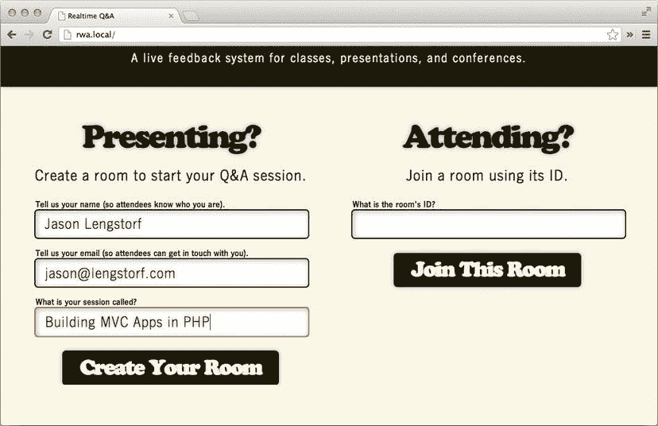

[图 9-1。](#_Fig1)在应用程序的主页上创建新房间

点击创建你的房间，你将被带到新的空房间(见[图 9-2](#Fig2) )。

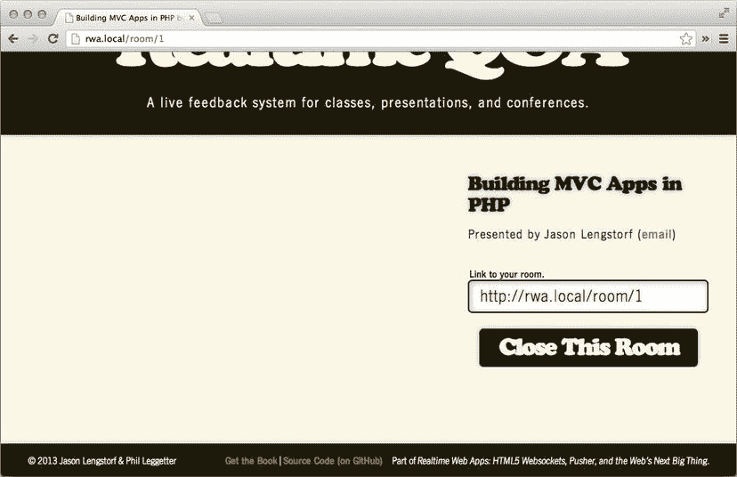

[图 9-2。](#_Fig2)新创建的房间

 **注意**在一些服务器配置中，运行`PDO::__construct()`时可能会出现 MySQL 错误。这通常意味着您需要将您的`php.ini`文件指向`mysql.sock`的正确位置。在`https://gist.github.com/jlengstorf/5184301`有一个简单的演练，如果您在 Google 上搜索错误消息，还有几个可用的演练。

关闭房间

关闭房间，测试演示者控制是否正常工作。点击关闭此房间按钮，房间变为非活动状态(参见[图 9-3](#Fig3) )。

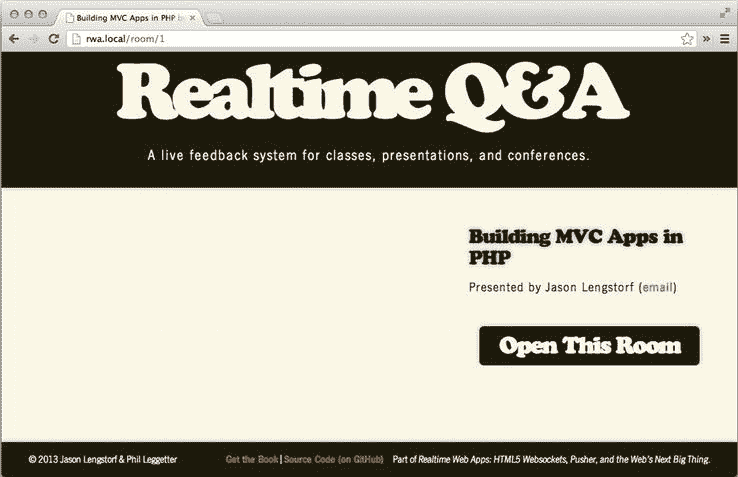

[图 9-3。](#_Fig3)封闭的房间

重新开放房间

确保房间可以通过点击打开此房间按钮重新打开，这将使房间回到其最初的活动状态(参见[图 9-4](#Fig4) )。

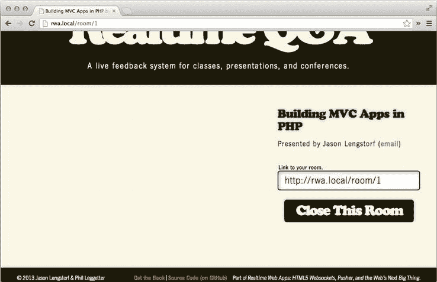

[图 9-4。](#_Fig4)重新开放的房间

加入房间

接下来，打开不同的浏览器(这意味着完全不同的应用程序:Firefox、Safari、Opera 或 Internet Explorer，如果你开始使用 Google Chrome 的话)并导航到`http://rwa.local/`。

根据本节中的数字，输入 1 作为房间的 ID，并点击加入此房间按钮(参见[图 9-5](#Fig5) )。

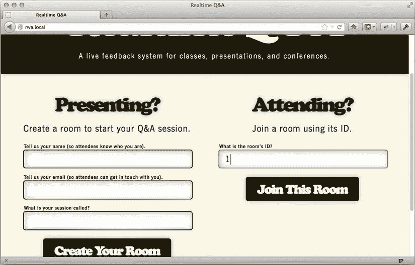

[图 9-5。](#_Fig5)从主页加入房间(使用不同的浏览器)

房间打开，您现在可以看到“提问”表单(参见[图 9-6](#Fig6) )。

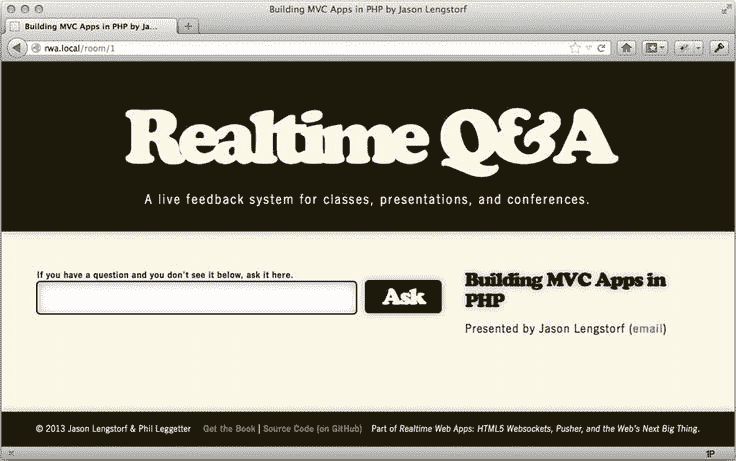

[图 9-6。](#_Fig6)您作为与会者查看房间时，会看到“提问”表单

问你的第一个问题

通过在表格字段中键入新问题，测试与会者是否可以提出新问题(参见[图 9-7](#Fig7) )。

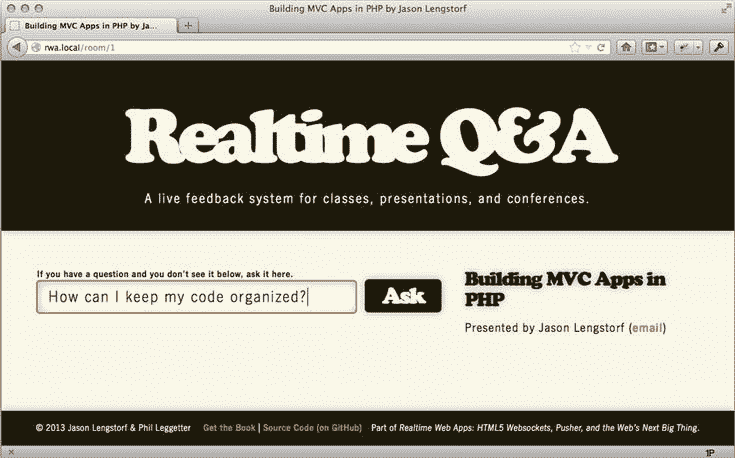

[图 9-7。](#_Fig7)通过“提问”表单提出新问题

点击提问按钮后，新问题被创建并显示为已被您投票通过(见[图 9-8](#Fig8) )。

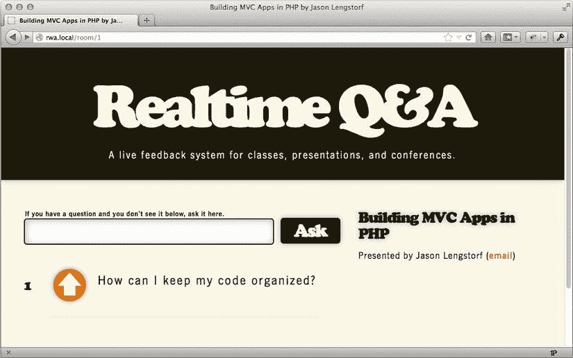

[图 9-8。](#_Fig8)问题被创建；创造者的投票已经被计算了

投票表决这个问题

为了测试对问题的投票，您需要打开第三个浏览器，这样您就可以作为尚未对新问题投票的与会者加入房间(参见[图 9-9](#Fig9) )。

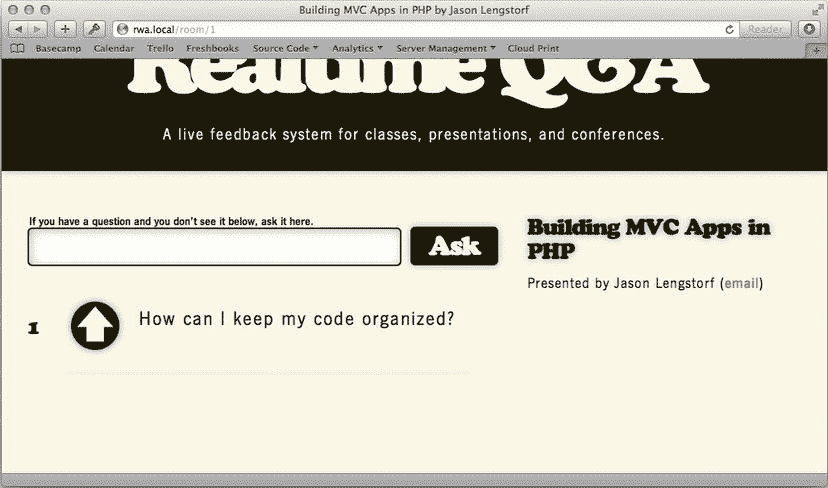

[图 9-9。](#_Fig9)未投票的与会者看到的问题

点击投票按钮，将投票数增加 1(见[图 9-10](#Fig10) )。

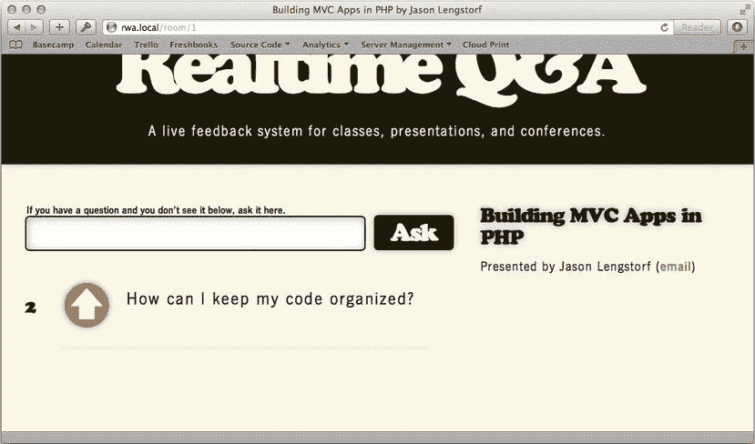

[图 9-10。](#_Fig10)收到第二次投票后的问题

回答问题

回到第一个浏览器——您的用户是演示者的浏览器——重新加载以查看新问题(参见[图 9-11](#Fig11) )。

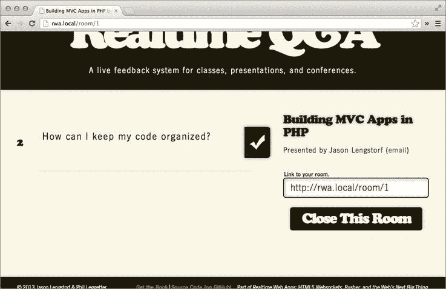

[图 9-11。](#_Fig11)演示者仪表盘上的问题，完成计票

现在点击回答按钮，将问题标记为已回答(参见[图 9-12](#Fig12) )。

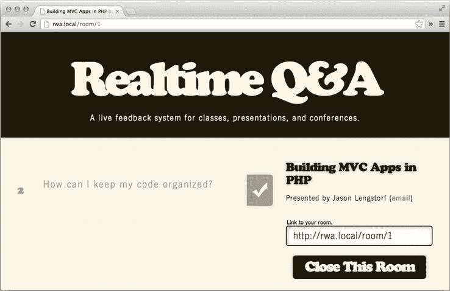

[图 9-12。](#_Fig12)演示者眼中的已回答问题

通过检查其他两个浏览器中的任何一个，验证这也能正确显示给与会者(参见[图 9-13](#Fig13) )。

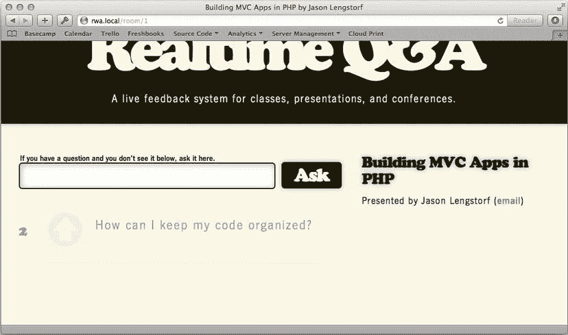

[图 9-13。](#_Fig13)与会者眼中的已回答问题

摘要

从这一章到上一章，你已经在最后 100 页左右的篇幅里涉及了很多内容。您现在应该有一个功能齐全的 MVC 应用程序，允许创建、关闭和重新打开房间；以及提问、投票和回答问题。

在下一章中，您将向应用程序添加实时事件通知，并实现 JavaScript 效果来动画显示这些事件。