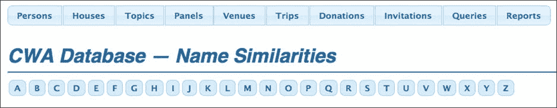
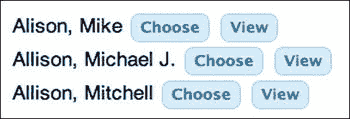
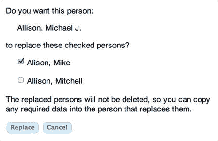
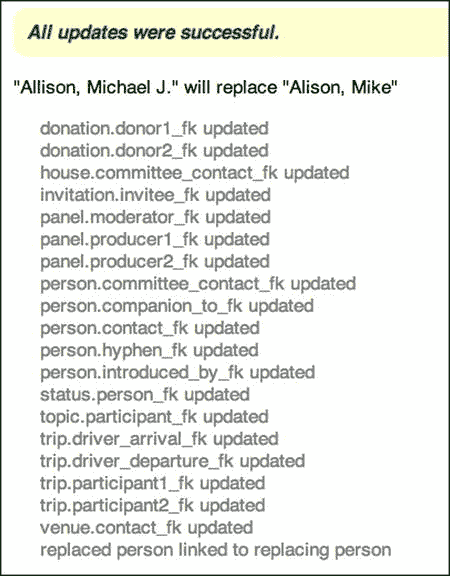

第八章


数据转换

我只希望他们把我的名字拼对。

——宇航员艾伦·谢泼德，谈到他希望如何被人们记住

我猜某处有人已经构建了一个数据库应用程序，它从一个空数据库开始，但我从未见过。总有一些预先存在的东西必须转换到新系统中，即使它只是钉在公告栏或常客文件盒上的志愿者名册。更常见的是，它还不止这些:电子表格、文件、电子邮件、文本文件，或者可能是基于 FileMaker、Microsoft Access 甚至 MySQL 的现有数据库系统。

我在本章中涉及的主题是转换在开发过程中的位置、要转换的数据源、处理问题数据(如日期和字符集)、测试和纠正以及合并变体名称(Shepard、Shephard、Shepherd)。

开发过程中的转换

当你安装新系统时，转换不仅仅是你必须做的一件讨厌的事情。它可以在开发过程中发挥有价值的作用。

提前转换

转换是我将在本书中讨论的最后一个主题，但是在开发的早期进行转换是明智的。

正如我在[第 4 章](4.html)中所建议的，一旦我设计了数据库并创建了表，我会尝试在应用程序本身之前开发转换，原因如下:

*   当我使用转换源时，我发现了数据库的问题，主要是缺少列和不正确的类型。有时，即使是一个关系问题，比如一对多必须改为多对多，也需要添加另一个表。
*   转换后的数据是最好的测试数据，因为它是真实的，而不是编造的，并且充满了新系统必须处理的所有怪异的情况。
*   它教会了我关于数据的知识，所以当我开始编写应用程序时，我更好地了解了系统。

首先开发转换的唯一缺点是，我暂时没有任何应用程序可以向客户演示。

转换后的数据可能不足以测试旧系统中没有的功能；为此，您必须创建测试数据。

经常转换

一旦你开发了转换程序，不要只是运行几次来测试它们。每周运行一次，或者，如果您直接连接到遗留数据库，并且不会给任何人带来负担，则每晚运行一次。那样的话，皈依日就不特别了——它只是另一天。

另一个好处是，假设旧的应用程序仍在使用，您的测试转换使用了一组扩展的数据，增加了在开发期间出现奇怪情况的可能性，因为有足够的时间来处理它们。

绊脚石可能是客户的 IT(信息技术)人员，他们对过去的转换有可怕的记忆，认为你每天都想这样做是疯了。当这种情况发生在我身上时，我称之为测试，这似乎很有效。当我写这篇文章时，大约是八年前了。如今我们有了现代术语*持续集成* ，你可以这么称呼它。仔细想想，it *是*持续集成，运行完全转换是进行持续测试的一个很好的方式。

转换源

有时有一个单一的数据源用于转换，但在我的经验中，它比那更多样。

枚举转换源

在我为 CWA 建立的系统中，我们有一个在助理协调员的 Mac 电脑上运行的 FileMaker 数据库，六个左右的 Excel 电子表格，一个必须搜索传记信息的网站，对网络服务器上照片目录的 FTP 访问，以及大量手写索引卡。

对于我为 Richardson (Texas)学区构建的年级记录本应用程序，我们有一个非常旧的 DB2 数据库，由州政府设立的服务机构在 IBM 大型机上运行，还有一个在 VAX 虚拟机上运行的自主开发的系统。

在这两种情况下，仅仅获得所有来源的完整列表是令人惊讶的困难。不定期更新的来源，例如年度会议的数据，可能在项目规划期间被遗忘。

更重要的是，有时一个被忽视的转换源掩盖了一个被忽视的需求。例如，一旦每个人都认识到您必须从每年创建的电子表格转换来处理小组成员的住房，问题就出现了，新系统是否应该处理住房。在开发中途发现这样的主要需求是非常具有破坏性的。不仅仅是另一份报告，这很容易。这是数据模型中的新实体！

采访处理数据的最底层人员。IT 经理会告诉你他们所有的数据都在 Oracle 中，因为这是他或她希望总裁和董事会听到的，中层经理会告诉你 Microsoft Access 上还有一些遗留数据，但秘书会告诉你一些数据在 Excel 电子表格中。(当然没有备份，但新系统会解决这个问题。)工作，直到你确定你有完整的清单。

如果不同的人对数据是否必须转换有不同意见，不要感到惊讶。我听到的对话大致是这样的:

*   IT 经理:“我们不再使用那个电子表格了。所有的数据都在甲骨文里。”
*   数据输入员:“不全是。部门排名还在 Excel 里。”
*   IT 经理:“这些不需要。”
*   较小的 IT 经理:“是的，他们是。用于逐年比较。”
*   IT 经理:“好吧，我明白你的意思，但我们不做那些。”
*   Lesser IT 经理:“我们没有，但是我们每个月都会将数据发送给学区。”

如果你关注对话，你会发现这不仅仅是一个被遗忘的转换源。它还涉及新系统是否必须提供与地区办公室的年度比较，这在你认为已经确定的要求中是没有的。

所以，在清单上工作，检查两次。

静态与动态源

在转换开发开始和转换到新系统之间，静态数据源不会改变。例子可以是关于以前的订单或过去的会议的数据。动态源作为持续业务的一部分进行更新。

对于静态源，一旦枚举了它们，您需要做的就是开始收集数据文件。你可以开发转换程序来处理它们，一旦它们工作了，你就完成了。只需运行程序来加载新的数据库。因为数据不会改变，所以即使您在开发期间每天都在运行转换，也只需要在数据库模式改变时重新转换静态数据。

对于动态源，就更复杂了。您可以开发程序并运行它们来填充数据库，但每次运行它们时，数据都会发生变化，这就增加了出现新问题的可能性。如果这发生在开发期间，这是一件好事，因为这是你想了解问题的时候。

在系统切换期间，当旧系统退役并且正在进行的操作转移到新系统时，可能会出现新的情况。任何问题都必须迅速解决，因为更新动态源必须在切换日冻结。从那时起，数据更新将与新系统一起进行，旧系统将被抛弃。问题是，“当您修复最后一分钟的数据问题时，冻结旧系统并让新系统离线会给客户带来多长时间的不便？”

你可能有将近一周的时间来进行缓慢的运作，就像一个非营利组织，除了捐助者和志愿者来来往往之外，没有什么比这更有活力的了。但是对于像网上书店这样的快速运行的书店，你没有那么多时间。

对于快速的情况，转换将是棘手的，因为您必须转换并验证一切正常的窗口很小，可能只有周日凌晨 2 点开始的几个小时。要做到这一点，需要非常仔细的计划和大量的测试。

一开始看起来很有吸引力的一个想法是并行运行新旧系统，直到新系统被证明是可行的，这样旧系统可以作为后备。但这增加了许多复杂性，更不用说那些必须更新这两个系统的人的大量额外工作了。也许你必须这样做，但我建议你尽可能避免这样做，每天进行转换是最好的方法。

直接连接到源数据库

如果转换源是一个数据库，最好使用 PHP 数据库 API 之一直接连接到它。您应该能够将 PDO 用于许多著名的数据库，比如 Oracle、Informix、PostgreSQL、SQLite，当然还有 MySQL。如果没有特定的 PDO 接口，那么就有一个通用的 PDO 接口来处理 ODBC 驱动程序，这些驱动程序通常可以从数据库供应商那里获得。(ODBC 是我在德克萨斯州做年级记录本项目时在大型机上连接 DB2 的方式。)如果您不能使用 PDO，请使用本机 API，您可以在 DB2、SQL Server、Sybase 等等中找到这种 API。

与其他 PHP 数据库 API 相比，我更喜欢 PDO 的一个原因是，它非常好地支持参数化查询，从而避免了 SQL 注入。然而，转换程序通常不会从用户那里获取数据，所以 SQL 注入并不是一个真正的问题。如果你必须使用 PDO 以外的东西，那就用吧。

与电子表格、文本文件和其他古怪的文档相比，连接到真实的数据库具有巨大的优势:日期和时间(通常)保证以标准的方式格式化，规范化(通常)消除了同一个人的多个记录等问题，并且从操作上来说，每天晚上运行转换要容易得多。

导出格式

现有的数据文件就是它们的样子，但是从数据库源中导出可以让您选择如何获取数据。

如果您不能直接连接—可能是桌面数据库，如 FileMaker—您将不得不导出数据或让您客户的员工为您导出。有时你可以选择如何导出数据；CSV(逗号分隔值)、制表符分隔值、XML 或 SQL 是最常见的选择。

在一个项目中，我从同一个 FileMaker 数据库中定期导出 CSV 文件，但是文件第一行的字段名因导出而异。我不知道为什么，做出口的人也不知道。最后，我不得不在我的转换程序中编写两个额外的特性:检测文件与文件之间不同的字段名，以及允许 CSV 文件中的字段具有几个不同名称之一的方案。这是一个烂摊子，我选择不真正解决，因为它只是为了转换，所以我只是让它尽可能防弹。我们克服了它，系统本身运行良好。教训是，在生产系统中完全不可接受的不便在转换过程中可能是可以忍受的。

自动生成转换程序

大部分转换工作涉及从转换数据构建数据库行，使用如下语句序列，类似于我编写的用于转换关于过去 CWA 小组成员的数据的程序中的语句:

```php
$row['name_first'] = $data['Name_First'];
$row['name_last'] = $data['Name_Last'];
$row['appellation'] = $data['Appellation'];
$row['home_street1'] = $data['Home Address'];
$row['home_city'] = $data['Home City'];
...
$this->db->update('person', ..., $row);
```

左边的键(如`name_first`)是数据库列；右边的(`Name_First`)是从 FileMaker 数据库导出的 CSV 数据文件中使用的。

不用键入所有这些作业，运行一个程序来写它们是很容易的。首先，这里有一些代码来读取 CSV 文件的第一行，其中包含字段名称，并构建一个按列号索引的字段名称数组。

```php
$path = "/Users/marc/Sites/cwadb/pastdata/Participant 2007-UTF8.csv";
$in = fopen($path, "r") or die("can't open $path");
if ($a = fgetcsv($in)) {
    $k = 0;
    foreach ($a as $f) {
        $colname[$k] = $f;
        echo "<br>{$colname[$k]}";
        $k++;
    }
}
fclose($in);
```

最初的几行输出是

```php
Name_First
Name_Last
Appellation
Home Address
Home City
```

请注意，由于这只是一个实用程序，不是部署的应用程序的一部分，甚至不是转换的一部分，所以我在处理错误的方式上有些生涩。如果 CSV 文件打不开，我有一个对`die`的调用，其他错误留给 PHP 去抱怨。

如果程序可以列出字段，它也可以输出赋值，减去它不知道的数据库列。

```php
$path = "/Users/marc/Sites/cwadb/pastdata/Participant 2007-UTF8.csv";
$in = fopen($path, "r") or die("can't open $path");
if ($a = fgetcsv($in)) {
    $k = 0;
    foreach ($a as $f) {
        $colname[$k] = $f;
        echo "<br>\$row[''] = \$data['{$colname[$k]}']";
        $k++;
    }
}
fclose($in);
```

现在我有了可以复制粘贴到转换程序中的代码。

```php
$row[''] = $data['Name_First']
$row[''] = $data['Name_Last']
$row[''] = $data['Appellation']
$row[''] = $data['Home Address']
$row[''] = $data['Home City']
...
```

这省去了大量繁琐且容易出错的打字工作。这个特殊的 CSV 文件有 56 列，我转换的其他文件有更多列。

对于大多数列，我所要做的就是在每行的空单引号之间键入适当的数据库列名。如果我不需要转换源中的列，我就删除那一行。这就是我如何得到这部分顶部显示的作业的。

清单 8-1 显示了转换程序的重要部分，基于之前写出骨架赋值的程序。

***[清单 8-1](#_list1)*** 。自动生成赋值的转换程序

```php
$path = "/Users/marc/Sites/cwadb/pastdata/Participant 2007-UTF8.csv";
$in = fopen($path, "r") or die("can't open $path");
if ($a = fgetcsv($in)) {
    $k = 0;
    foreach ($a as $f)
        $colname[$k++] = $f;
}
while ($a = fgetcsv($in)) { // for lines 2 and beyond
        $k = 0;
        foreach ($a as $v)
            $data[$colname[$k++]] = trim($v);
        $row = array();
        $row['name_first'] = $data['Name_First'];
        $row['name_last'] = $data['Name_Last'];
        $row['appellation'] = $data['Appellation'];
        $row['home_street1'] = $data['Home Address'];
        $row['home_city'] = $data['Home City'];
        ...
        $this->db->update('person', ..., $row);
}
fclose($in);
```

记下填充`$data`数组的代码。

```php
foreach ($a as $v)
$data[$colname[$k++]] = trim($v);
```

循环中的语句不是

```php
$data[$k++] = trim($v)
```

因为我们想要下标的列名，而不是整数。

虽然大部分任务可以不做改动，但是有几个可能需要调整，比如那些处理日期和名字的任务，其中名字和中间名在同一个 CSV 列中。一旦做了这些调整，其中一些我将在下面的章节中讨论，转换程序就准备好了。

也就是说，如果 CSV 文件对应于单个数据库表，就可以开始了。很多情况下不会。例如，包含有关过去 CWA 面板的数据(可追溯到 1957 年)的 CSV 文件具有以下未标准化的字段集合以及其他内容(拼写错误为“Appelation 8”):

```php
Moderator/Chairman/Presiding        Appellation 7
Moderator Appellation               Speaker 8
Speaker 1                           Appelation 8
Appellation 1                       Discussant 1
Speaker 2                           Appellation d1
Appellation 2                       Discussant 2
Speaker 3                           Appellation d2
Appellation 3                       Discussant 3
Speaker 4                           Appellation d3
Appellation 4                       Discussant 4
Speaker 5                           Appellation d4
Appellation 5                       Discussant 5
Speaker 6                           Appellation d5
Appellation 6                       Discussant 6
Speaker 7                           Appellation d6
```

当您从电子表格转换时，您会一直看到这种排列，因为电子表格不支持连接。(至少，不是任何一个普通用户都能搞清楚怎么用的方式。)相反，当需要输入更多的数据时，它们会促使工作表变得越来越宽。

我的转换程序将大部分列放入`panel`表，然后在`person`表中为主持人和每个发言者和讨论者添加一行。然后，这些人通过多对多关系连接到他们所在的面板，这种关系涉及一个交集表。但即使在这种更复杂的情况下，我自动合成的骨骼分配也非常方便。他们甚至顺利地处理了拼写错误的列名。(事实上，直到我为这本书准备了示例代码，我才注意到它被拼错了。)

日期、时间和字符转换

很难说您会在文本文件和电子表格中发现什么，因为数据类型通常是不强制的。即使是数据库，有时规则也相当宽松。这是日期和时间的一个特殊问题。字符集之间的转换也是一个问题。

古怪的日期格式

我看到一个 4000 亿美元的数字，作为 2000 年前几年解决 Y2K 问题的总费用，如果你还记得，这些问题主要是由处理和存储两位数年份的计算机系统造成的。但是，根据我看到的转换数据，人们仍然在这样做。我看到类似于`6-11`、`11-12-10`、`04/05`以及更糟糕的日期。

一旦将数据放入新数据库，问题就迎刃而解了，因为 MySQL 和其他所有数据库都按照严格的格式规则存储类型为`date`或`datetime`的列。如果您是从数据库源进行转换的，那么很有可能该列就是这样定义的，这样就没问题了。

但是，如果源是电子表格或其他文本文件，或者数据库列是文本类型，那么您就有麻烦了，因为无论谁输入日期，都可以把他或她想要的任何东西放在那里。每行的格式甚至都不一致。如果您在日期字段中看到类似“与 A/P 相同”的内容，请不要感到惊讶。

通常，如果你从文本文件转换，行数足够少，所以有人可以检查每个日期被正确转换。哪怕是几百，也值得去做。但是如果行数很大，有几千或几万行，你不可能检查每一行。你唯一的选择是对转换后的数据进行采样，并不断修改你的翻译方案，直到你确定你做对了为止。即使这样，一些日期也会转换不正确。

有两类问题:月份和日期的混淆以及两位数年份的模糊性。

通常，我看到的是以下形式之一的日期，其中 A、B 和 C 是数字:

```php
AA-BB-CC
AA.BB.CC
AA/BB/CC
```

在美国，AA 通常是月份，BB 是日期，所以 2013 年 12 月 11 日应该写成 12-11-13。但是在欧洲，月和日是颠倒的，所以是 11-12-13。我不知道世界其他地方是怎么做的，这也没关系，因为一些美国人在欧洲工作，做他们习惯的事情，反之亦然，所以你真的不能依靠地理来解决这个难题。

您最多可以做到以下几点:

*   暂时假设每个文件至少与自身一致。
*   仔细观察数据，寻找不会有歧义的日期，比如 1999 年 9 月 20 日，不管怎么写，其中的 99 只能是一年，20 必须是一天，09 必须是一个月，因为其他数字都被指定了。
*   如果你所有的都是 2000 年以后的日期，年份就没用了，因为数字 01 到 12 可以是日、月或年。因此，假设最后两位数字是年份，并寻找日期和月份的组合，不能有歧义，因为这一天是 13 或更大。这将告诉你是否至少你正在看的文件的部分使用美国或欧洲惯例。
*   当你有了模式，写一个 PHP 函数来解析日期，允许分隔符是破折号，斜线，句号，或其他任何东西。
*   如果日期不完全是带有两个分隔符的六对数字，请将其记录为错误，以便以后检查。
*   当您完成了前面的所有编码后，对数据运行算法以报告您的发现。如果只有几百条记录，打印出原始数据和转换后的数据，并全部检查。如果有太多需要检查，就随机打印出几百个来检查。

你用 2000 年时使用的同样方法来处理两位数的年份:你根据上下文选择一年，该年之后的所有事情都被认为是在 20 世纪，在 21 世纪之前。例如，所有与 CWA 有关的日期都是 1948 年以后，也就是会议开始的时候，除了小组成员的生日，我们没有记录。所以如果两位数小于 48，加 2000 得到四位数年份；48 以上，加 1900。在另一个应用程序中，比方说一个图书数据库，您可能有 100 年或更久以前的出版日期，所以它变得更加棘手。查看是否有其他列可以提供线索，例如格式在 1985 年发生变化的书号，或者表示旧卷的收藏名称。您可能别无选择，只能手动更正日期(不是您个人，而是为您的客户工作的人)。

清单 8-2 展示了我在最近的一次转换中使用的函数`convert_date`，以及一些测试用例的代码。

***[清单 8-2](#_list2)*** 。日期转换测试程序

```php
test('01-02-03');
test('01-02-88');
test('02-Jan-03');
test('02-Jan-88');
test('January 2, 1988');

function test($s) {
    echo "<br>$s --> " . convert_date($s);
}

function convert_date($s) {
    if (empty($s))
        return null;
    if (preg_match("∼^(\d{1,2})[-/.](\d{1,2})[-/.](\d{1,2})$∼", trim($s), $m)) {
        $y = $m[3] < 40 ? 2000 + $m[3] : 1900 + $m[3];
        return "$y-{$m[1]}-{$m[2]}";
    }
    if (preg_match("∼^(\d{1,2})[-/.]([A-Za-z]+)[-/.](\d{1,2})$∼", trim($s), $m)) {
        $y = $m[3] < 40 ? 2000 + $m[3] : 1900 + $m[3];
        $month = date('m', strtotime($m[2]));
        return "$y-$month-{$m[1]}";
    }
    return date("Y-m-d", strtotime($s)); // can handle above, but not well defined
}
```

这是输出。

```php
01-02-03 --> 2003-01-02
01-02-88 --> 1988-01-02
02-Jan-03 --> 2003-01-02
02-Jan-88 --> 1988-01-02
January 2, 1988 --> 1988-01-02
```

从第二次调用`preg_match`开始的代码似乎是不需要的，因为`strtotime`可以处理带有月份名称的日期(例如，“一月”)，但是`strtotime`的问题是它的行为没有精确定义。例如，它把 1957 年 1 月 2 日作为 2057 年，这是行不通的，因为 CWA 早在 1957 年就有会议。所以我包含了中间的案例以确保它被正确处理，以及与其他两个案例不匹配的`strtotime`案例。这是一个有问题的决定——发出一条消息可能更好，这样我就可以跟踪数据中与这两个显式编码模式不匹配的任何日期。确保在没有针对您自己的情况进行调整的情况下，不要在您自己的程序中使用该函数。

请注意，函数`convert_date`返回 YYYY-MM-DD 形式的字符串，而不是实际的日期对象。这是因为 MySQL `insert`或`update`语句会将格式正确的字符串正确地转换成日期。

阅读了前面的文本，您将不难理解为什么从具有类型为`date`或`datetime`的列的数据库转换比从文本文件转换要容易得多，也更可靠。但是，不幸的是，这种情况不会经常发生。如果您的客户已经有一个数据库，他或她可能不会要求您构建一个新的。实际情况是，通常你要处理的是电子表格和文本文件。

处理时间

就像日期一样，如果时间来自数据库，而不是来自电子表格或文本文件，就更有可能正确转换时间。像月/日/年这样的歧义是不存在的，因为每个人都同意唯一有意义的顺序是小时/分钟/秒。

检查数据以查看时间是否使用 24 小时制或具有上午/下午指示器。如果是后者，你会发现写指标的各种方式，比如`10:20a`、`10:20 AM`、`10:20 A`等等。使用正确的正则表达式并不难处理这些问题。

到目前为止，最常见的分隔符是冒号，尽管有时会看到句号。破折号、斜线、逗号和其他字符很少出现，但请保持警惕。

最常见的问题是缺少时区指示。有时，您可以从数据库的位置推断时区。例如，一个诊所预约应用程序总是使用当地时区。一个更困难的例子是全球使用的在线信息系统。也许还有其他数据可以告诉你时区是什么。每个案例都不一样。

即使您有时区，也可能无法将其存储在 MySQL 数据库中。类型`datetime`和`time`不存储时区；类型`timestamp`可以，但是在包含时区的`insert`或`update`语句中没有可以使用的文字。最好的方法是使用 MySQL `CONVERT_TZ`函数将`timestamp`从一个时区转换到另一个时区。(它对`datetime`或`time`值不起作用。)

如果时区很重要，就像它们对于地理数据一样，那么您最好将`datetimes`以 ISO 8601 格式存储在一个文本字段中(例如`1994-11-05T08:15:30-05:00`，从而完全绕过 MySQL 的时间工具。

字符转换

当人们在表单、电子表格或文本文档中输入数据时，他们通常会使用键盘似乎能做的任何事情来键入母语以外的字符。如果角色像他们期望的那样出现在屏幕上，并且像他们期望的那样打印出来，他们就很高兴。他们不知道他们用的是什么字符编码。如果事情看起来不对劲，他们就会瞎搞，直到事情变好，或者问别人如何进入角色，或者只是接受错误的角色，比如在“诺埃尔·考沃德”中而不是“诺埃尔·科沃德”

转换过程中的问题是将转换源中的字符编码转换成 PHP 程序和 MySQL 数据库所期望的编码。我的建议是让这个 UTF-8。将所有的 MySQL 编码选项设置为 UTF-8，将你的文本编辑器设置为 UTF-8，在 HTML 表单中使用 UTF-8，就像我在这本书里一直做的那样。

在你能翻译成 UTF 8 之前，你需要知道源代码是什么编码。这可能是输入数据的计算机操作系统使用的本地编码。例如，如果使用了 Mac，它可能是 Mac Roman。如果是 Windows 的话，很可能是 Windows 拉丁语 1。

如果您有一个文本文件，比如 CSV，请在文本编辑器中打开它，看看国际字符看起来是否正确。如果是这样，将编辑器的编码改为 UTF-8，验证字符仍然正确，并保存文件的副本。然后使用 UTF-8 版本。

这是个简单的例子。如果在文本编辑器中查看文件时字符看起来不正确，请查看是否可以通过调整编辑器的字符编码来使它们正确显示。我使用的编辑器是 BBEdit(仅用于 Mac OS)，它有一个方便的“使用编码重新打开”命令，用于测试不同的编码。试几次就足以告诉我文件是什么，几乎总是 Mac Roman、Windows Latin 1 (ISO-8859-1)或 UTF-8。然后我用 UTF-8 保存了文件的副本。另一个选择是我在 Mac App Store 上找到的价值 3 美元的实用文本编码转换器。在 Windows 上，免费的 Notepad++允许你通过从编码菜单中选择一种来轻松尝试不同的编码，这真的很方便，甚至比 BBEdit 还要好。

如果转换源文件是 UTF 8 版本，PHP 将保持它读取的字符串不变，因此来自该文件的任何字符串仍然是 UTF 8 版本。如果你已经为 UTF 8 设置了 MySQL，就像我经常做的那样，字符串可以直接进入数据库。

转换后

一旦你开发并运行了转换程序，你就可以看到可能不愉快的结果了。

测试转换后的数据

当您用转换后的数据加载数据库时，您会希望通过比较新数据库中的内容和旧系统中的内容来测试转换。有两种有效的方法可以做到这一点。

*   行的直接比较。编写一个 PHP 程序来显示包含转换数据的每个表中的行，以及转换源中的相应数据。如果您只有几百个已转换的行，请对它们进行比较。如果数量太多，随机选择 200 行左右。如果发现错误，请停止测试，修复转换程序，重新运行转换，然后重新开始测试。
*   既然你无论如何都要实现报告，你最好在转换之后，在你实现应用程序的主要部分之前实现它们。然后，您可以将新报告与旧报告进行比较。

如果在最初的几次转换测试中，您发现了数据库模式中的问题，请不要感到惊讶。这就是测试的全部意义！但是在几轮查找错误、进行修复和恢复测试之后，事情会平静下来，您应该能够以及格分数通过测试。

修复坏数据

假设您的转换程序检测到错误的数据，例如日期格式错误或必填字段中缺少数据(例如，性别或出生日期)。有两种处理坏数据的方法。

*   修复旧系统中的数据，在数据完好之前不接受最终转换，或者
*   继续加载数据，即使它是坏的，并在新系统中修复它。

第一种方法的缺点是，你可能不知道如何修复数据，或者你知道，但旧的系统不能很好地修复它。另一个问题是，修复所有旧数据可能需要几天或几周的时间，这会延迟转换和转换测试的完成。

第二种方法的缺点是坏数据可能不会进入数据库。像 2007-02-30 这样的日期根本不会转换，或者说即使它转换成了什么也不会转换成 2 月 30 日。

因此，这两种方法都不完美。

在某些情况下，您可以在转换期间放松验证，稍后再收紧验证。例如，所有 CWA 小组成员必须被指定为“新成员”或“老成员”，如果他们只参加一年，他们就像新成员一样。我们没有过去小组成员的信息，也不想重建它，所以我最初允许该列为空。这正是 null 的用途:表示“未知”然后，在转换之后，我将该列设为非 null，以确保所有新数据都具有所需的值。(MySQL 将新的非法 nulls 改为空字符串。)但是这种方法只在有限的情况下有效。

对于看起来部分正确的数据项，所以你不想完全抛弃它们，比如 2007 年 2 月 30 日，如果可行并且不会不必要地延迟项目，你可以尝试在旧系统中进行修复。如果您必须进行转换，您别无选择，只能将坏数据存储在另一个列中，可能是一个名为`date_received_raw, as type text`的列，它位于正式列`date_received`的旁边。

也许你可以看出，我的偏好是以某种方式将数据放入数据库。我喜欢让事情向前发展。

保存未转换的数据

当您和您的客户检查转换的质量时，甚至之后，您希望能够跟踪数据库中的数据是如何从其转换源到达那里的。最简单的方法是将原始转换数据放入一个列中。

清单 8-3 展示了当我从一个文本文件转换时，我是如何做的，大多数时候是这样的:在我读完每一行数据后，我把它组合成一个字符串。

***[清单 8-3](#_list3)*** 。将未转换的数据保存在数据库中

```php
...
$row = array();
$row['name_first'] = $data['Name_First'];
$row['name_last'] = $data['Name_Last'];
$row['appellation'] = $data['Appellation'];
$row['home_street1'] = $data['Home Address'];
$row['home_city'] = $data['Home City'];
...
$row['conversion_data'] = conversion_data($row, basename($path));
$this->db->update ('person', ..., $row);
...

function conversion_data($row, $label) {
    $s .= "$label\n\n";
    foreach ($row as $k => $v)
        if (!empty($v))
            $s .= "$k: $v\n";
    return $s;
}
```

`conversion_data`字段的典型值是(不是他的真实地址)

```php
Participant 2007-UTF8.csv

name_first: Dave
name_last: Grusin
appellation: Musician; Composer; Arranger
home_street1: 123 Main Street
home_city: Somewhere
```

这个例子只有几个简单的字段，并没有真正说明轻松访问这些数据有多重要。也许更好的例子是这个实际数据的摘录，它要复杂和神秘得多(一些个人数据被更改)。

```php
...
Reply: Accept
ArrivalNote: LGA 745
DepartureNote: 310 LGA
ConfirmationSheet?: No
TopicsReceived?: Yes
TopicsLetterSent?: 2008-12-19
ReplyFollowup?: No
Bio_Received: Yes
Photo_Received: Yes
Thank_You_Letter_Sent?: No
Companions: 1
CompanionNames: John Smith
NeedsHousing?: Needs Housing
Primary_Phone: 303.123.4567
Note: **late tues eve. **as close to cs as poss. **same contact info** us ly photo **sent bio 2/18 changes **DIFFERENT FLIGHT FROM SMITH
PetsOK: Yes
SmokingOK: No
Gender: F
...
```

`Note`字段根本没有被转换，我甚至不确定它是什么意思(例如，“us ly photo”)，但它在新数据库中是完整的，以防我们在那里找到我们需要的东西。

必要时，如果您发现在转换到新系统几周后，转换出现了问题，那么您很有可能能够解析`conversion_data`字段中的文本并纠正错误。这比试图追踪原始文件和相关文本行的位置要方便和可靠得多。

变体名称

大多数情况下，当您从电子表格、文本文件和非标准化的数据库进行转换时，您会有一个人的数据转换为不同的人，因为在不同的源中该姓名的拼写不同。您最终会得到多条记录，名字分别为“大卫·麦克米伦”、“大卫·麦克米伦”和“大卫·麦克米伦”，都是同一个人，但在数据库中有三个不同的行。这些行需要合并，这样这个人就只有一个名字，最好是正确的名字。

转换后合并

前面，我提出了一些您可能希望在转换之前修复源代码中的坏数据的原因，以及一些您可能希望在转换之后修复数据的原因。对于不同的名称拼写，after 通常是最好的。

您可以尝试在转换之前解决这些问题，但很可能很多问题仍然不正确。许多打字员不能很快分辨出“McMillen”和“MacMillen”之间的区别，所以你仍然需要清理变体。或者，您可能有一个像 CWA 的 panel archive 电子表格这样的案例，它有 66 列宽，7700 行高，几乎无法处理。试图使名字一致可能导致的意外损坏得不偿失。这是假设 CWA 办公室有人可以做这项工作，但当我开始实施 CWA 的数据库时，情况并非如此，因为 2013 年 4 月的会议计划正在紧锣密鼓地进行。

此外，有一种有效的方法来呈现不同的名称，选择最佳名称，并清理其他名称，我现在将解释这一点。

发现名称变体

我设计的这个系统的核心是一个计算两个字符串有多近的函数。PHP 有一个名为`levenshtein`的内置函数，用于计算“Levenshtein 距离”。几年前，当我在 Richardson (Texas)学区学生数据库中遇到类似情况时，我使用了这个函数，但后来我发现了一个更好的函数，叫做`JaroWinkler`，在 Cohen、Ravikumar 和 Fienberg 的一篇论文中有描述(“姓名匹配任务的字符串距离度量比较”)，你可以在`cs.cmu.edu/∼pradeepr/papers/ijcai03.pdf`找到它。我使用 Ivo Ugrina 的 PHP 实现，你可以在`iugrina.com/files/JaroWinkler/JaroWinkler.phps`获得。

该功能是

```php
JaroWinkler($string1, $string2, $toupper = false, $PREFIXSCALE = 0.1)
```

我保留最后一个参数，并将第三个参数设置为`true`。它返回一个介于 0 和 1 之间的数字，1 表示完全匹配。

为了查看该函数做了什么，这几行

```php
echo '<br>' . JaroWinkler('McMillen', 'MacMillen', true);
echo '<br>' . JaroWinkler('David', 'Dave', true);
echo '<br>' . JaroWinkler('apples', 'oranges', true);
echo '<br>' . JaroWinkler('watermelon', 'sharkskin', true);
```

制作了这个

```php
0.96666666666667
0.84833333333333
0.64285714285714
0.54444444444444
```

这些数字意味着前两对名字接近，后两对不接近。自然，自动匹配并不完美，所以它必须嵌入一个系统，允许一个人做最后的决定。没有标准的数字来区分“接近”和“不接近”；视情况而定。你可以在清单 8-4 中看到我的选择。

组织数据库搜索

因为数据库中有数百个潜在的匹配，所以我按首字母对它们进行细分，这样用户就可以一次处理几个。[图 8-1](#Fig1) 显示了初始屏幕，允许用户选择要处理的字母。



[图 8-1](#_Fig1) 。选择字母的初始请求屏幕

每个字母按钮导致调用`MyPage::do_letter`，它通过首字母查询`person`表。该方法如下所示(我将在[清单 8-5](#list5) 中完整展示):

```php
protected function do_letter($letter) {
    ...
    $stmt = $this->db->query('select person_pk, name_last,
      name_first, name_middle
      from person where name_last like :letterpat and
      replacedby_fk is null
      order by name_last, name_first, name_middle',
      array('letterpat' => "$letter%"));
    while ($row = $stmt ->fetch()) {
        ...
        $this->find_matches($row['person_pk'],
            $row['name_last'], $row['name_first'],
            $row['name_middle'], $names, $pks);
        ...
    }
    ....
}
```

(注意，在 CWA 数据库中，我将主键列命名为`person_pk`，而不是`person_id`，这是我现在的做法，因为它是一个代理键。)

如果对包含不同拼写的`person`行的引用将被对优选行的引用所替换，则被替换行的`replacedby_fk`列被设置为优选行的主键(`person_pk`)，从而不会删除任何数据，并且可以看到进行了哪些替换。这

```php
replacedby_fk is null
```

`select`中的测试防止考虑已经被处理的行。(在“替换外键”一节中有更多关于这方面的内容)

真正的工作是在函数`find_matches`中完成的，在[清单 8-4](#list4) 中，它取一个名字的三个部分(姓、名和中间名)并返回两个数组:`$names`包含匹配的名字，`$pks`包含它们对应的主键。

***[清单 8-4](#_list4)*** 。`MyPage::find_matches`方法

```php
protected function find_matches($pk, $last, $first, $middle,
  &$names, &$pks) {
    if (strlen($last) < 2)
        return;
    $pfx = mb_substr($last, 0, 2, 'UTF-8');
    $stmt = $this->db->query('select person_pk, name_last,
      name_first, name_middle
      from person where name_last like :pfxpat and
      person_pk != :pk and
      replacedby_fk is null order by name_last, name_first,
      name_middle',
      array('pfxpat' => "$pfx%", 'pk' => $pk));
    while ($row = $stmt ->fetch()) {
        $jw1 = JaroWinkler($last, $row['name_last'], true);
        if (empty($first))
            $jw2 = $jw3 = $jw4 = 1;
        else {
            $name1 = explode(' ', trim($first));
            $name2 = explode(' ', trim($row['name_first']));
            $jw2 = JaroWinkler($name1[0], $name2[0], true);
            $jw3 = JaroWinkler($name1[0], $row['name_middle'], true);
            $jw4 = JaroWinkler($name2[0], $middle, true);
        }
        if ($jw1 > .9 && ($jw2 > .75 || $jw3 > .75 || $jw4 > .75)) {
            $names[] = $this->build_name($row);
            $pks[] = $row['person_pk'];
        }
    }
}
```

顶部是一个`select`,用于那些还没有匹配的以相同的两个字母开头的名字，我发现这对于 CWA 数据集很有效，但你可能想根据自己的情况进行调整。在进行这一点和后面描述的其他权衡时，我不想要太多的匹配——超过几百个就太麻烦了。我还希望标准足够宽松，这样我们就能得到足够多的匹配。

第一次 JaroWinkler 比较是使用传入的姓氏和每个选定行的姓氏，存储在`$jw1`中。另外三个度量标准，`$jw2`、`$jw3`和`$jw4`，用于名和中间名。如果缺少名字，这些将被设置为 1，这意味着测试将只使用姓氏。(有了这个数据，如果名字不见了，中间名的任何东西都是相当没有意义的。)

多年来，不同的人在源数据文件中输入姓名时，有时会将名字和中间名放在同一个字段中，因此两个`explode`行将名字字段分开。`$jw2`是名字字段中第一个单词(可能是唯一的单词)的度量。`$jw3`使用`selected`行的名字字段的第一个字和传入的中间名，`$jw4`反之亦然。这适用于 CWA 的数据，因为小组成员经常使用他们的中间名。例如，前一年是“r·巴克明斯特·富勒”，第二年是“巴克明斯特·富勒”(如果您想知道，在源数据中，以首字母作为名字的名字总是将首字母和中间名输入到名字字段中，所以我编程的比较方式是有效的。您必须为您自己的数据结构修改进行比较的确切方式。)

无论如何，我认为如果姓的度量是. 9，任何名和中间名的度量是. 75，那么这个比较就是匹配的。如果匹配的话，名字和它的主键被存储在`$names`和`$pks`数组中。函数`build_name` 从行数据中构造一个字符串名称。

```php
function build_name($row) {
    return htmlspecial (trim(
      "{$row['name_last']}, {$row['name_first']} {$row['name_middle']}"
      ));
}
```

为了了解`find_matches`在实践中的作用，这里有一些实际的比赛。

```php
Abrams, Karen
Abrams, Kevin

Adams, Tom
Adams, W. Thomas

Bakeman, Liz
Bake, Elizabeth
Bakeman, Nina Elizabeth

Elliott, Patricia
Elliot, Patricia
```

仅凭我的直觉，不了解历史小组成员，艾布拉姆斯和贝克匹配看起来是错误的，而其他人看起来是正确的，尽管在没有检查更多数据的情况下无法确定。汤姆·亚当斯和 w·托马斯·亚当斯可能是两个不同的人。我最终发现，莉兹·贝克曼和尼娜·伊丽莎白·贝克曼实际上是两个不同的人。稍后我将介绍您如何决定采取什么行动。首先我将解释完匹配代码。

回到主`select`循环，[清单 8-5](#list5) 展示了整个`do_letter`函数，这样你可以看到来自`find_matches`的结果是如何处理的。

***[清单 8-5](#_list5)*** 。MyPage : : do_letter 方法

```php
protected function do_letter($letter) {
    $found = false;
    $skip = array();
    $stmt = $this->db->query('select person_pk, name_last,
      name_first, name_middle
      from person where name_last like :letterpat and
      replacedby_fk is null
      order by name_last, name_first, name_middle',
      array('letterpat' => "$letter%"));
    while ($row = $stmt ->fetch()) {
        if (!in_array($row['person_pk'], $skip)) {
            $names = array($this->build_name($row));
            $pks = array($row['person_pk']);
            $this->find_matches($row['person_pk'],
              $row['name_last'], $row['name_first'],
              $row['name_middle'], $names, $pks);
            if (count($names) > 1) {
                for ($i = 0; $i < count($names); $i++) {
                    $pkstring = '';
                    foreach ($pks as $p)
                        if ($p != $pks[$i])
                            $pkstring .= ',' . $p;
                    $pkstring = substr($pkstring, 1);
                    echo "<br>{$names[$i]}";
                    $this->button('Choose',
                      array('action_choose' => 1,
                      'pk' => $pks[$i],
                      'others' => $pkstring),
                      'persons_link.php', true);
                    $this->button('View',
                      array('action_detail' => 1,
                      'pk' => $pks[$i]),
                      'person.php', true);
                    $found = true;
                }
                $skip = array_merge($skip, $pks);
                echo '<hr>';
            }
        }
    }
    if (!$found)
        echo "<p>Letter {$letter}: No persons found.";
}
```

关于`$skip`数组:它包含所有被处理行的主键，或者是在`do_letter`中选择的，或者是由`find_matches`匹配的。跳过任何已经考虑过的行，因为将“Adams，Tom”与“Adams，W. Thomas”进行匹配，然后再将“Adams，W. Thomas”与“Adams，Tom”进行匹配是多余的。在`while`后面有`in_array`的那一行跳过。

假设我要处理一行(不在`$skip`数组中的一行)，我用所选行的列值初始化`$names`和`$pks`数组，然后调用`find_matches`。如果它找到了什么(`count($names) > 1`)，我会遍历这些名字，并通过两个按钮输出每个名字。

*   Choose 按钮选择我们想要保留的名称，一个或多个与之匹配的名称将被替换。
*   “查看”按钮显示与姓名相关的完整记录，以帮助用户决定他或她想要保留哪个姓名以及应该替换哪些相似的姓名。有时在用户准备做决定之前需要几分钟的研究。

选择按钮创建一个新的弹出窗口(`true`的最后一个参数)，打开到页面`persons_link.php`,带有两个参数，被选择的人和潜在匹配列表。替换工作由`persons_link.php`完成。

潜在匹配的列表作为参数`others`的值传递，您可以在 Choose 按钮的代码中看到。因为 PHP 数组不能通过 JavaScript 直接传递给 PHP(这是传递参数的方式)，所以主键列表被转换成一个字符串，其内容如下:

```php
$pkstring = '';
foreach ($pks as $p)
    if ($p != $pks[$i])
        $pkstring .= ',' . $p;
$pkstring = substr($pkstring, 1);
```

最后一行去掉了前面多余的逗号。我发现在最后去掉它比写额外的代码来避免把它放进去更容易。(我没有用`implode`是因为`others`数组一定不能包含被选中的人。)

为了阐明“选择”按钮的外观，请使用名称

```php
Alison, Mike
Allison, Michael J.
Allison, Mitchell
```

第一个可能有`23456`作为主键，其他选项是`24598,21034`，第二个有`24598`和`23456,21034`，第三个有`21034`和`23456,24598`。换句话说，三个主键中的每一个都出现在一个按钮后面，另外两个作为其他选择。[图 8-2](#Fig2) 显示了实际输出的截图。



[图 8-2](#_Fig2) 。匹配的名称和按钮

如果您希望，比如说，Michael J. Allison 成为首选行，并更改对 Mike Alison 的所有引用，那么您可以单击 Michael J. Allison 旁边的选择按钮。这些参数通过 POST 发送到页面`persons_link.php`。

```php
pk = 24598
others = 23456,21034
```

当从 Choose 按钮调用时，文件`persons_link.php`显示一个表单，这样用户可以指示哪些人应该被选中的人替换，如清单 8-6 中的[所示。](#list6)

***[清单 8-6](#_list6)*** 。`MyPage::action_choose`方法

```php
protected function action_choose() {
    $others = explode(",", $_POST['others']);
    $chosen_name = $this->GetNameByID($_POST['pk']);
    $f = new Form();
    $f->start($_POST);
    $f->hidden('pk', $_POST['pk']);
    echo <<<EOT
        <p>Do you want this person:
        <p style='margin-left:20px;'>$chosen_name
        <p>to replace these checked persons?
EOT;
    foreach ($others as $p)
        $f->checkbox("replace[$p]", $this->GetNameByID($p));
    echo <<<EOT
        <p>The replaced persons will not be deleted,
        so you can copy<br>any required data into the person
        that replaces them.
EOT;
    $f->button('action_replace', 'Replace');
    echo "<button class=button type=button
      onclick='window.close();'>Cancel</button>";
    $f->end();
}
```

传递给`Form::checkbox`的字段名是`replace[$p]`，这意味着当方法`MyPage::action_replace`接收到表单数据时，被检查的名字将组成数组`$_POST['replace']`。我将在[清单 8-7](#list7) 中展示如何访问这个数组。

方法`GetNameByID`，没有显示，返回一个人的名字，给定主键。[图 8-3](#Fig3) 显示了显示内容的示例；用户选中了 Mike Alison，没有选中 Mitchell Allison，因为他是另一个人。



[图 8-3](#_Fig3) 。选择被替换人员的表格

具有讽刺意味的是，虽然我们想要的人 Michael J. Allison 和我们想要替换的人 Mike Alison 最引人注目的一点是他们的名字不同，但就数据库模型而言，这并不是真正的问题。毕竟，很容易设计出一个人可以有不同的名字(Mike 可能是他的昵称)。回想一下模型:问题是我们有两个实体，而我们只想要一个。因此，对实体 Mike Alison 的每个引用(外键)都必须替换为对实体 Michael J. Allison 的引用。这将使模型符合只有一个 Michael j .(“Mike”)Allison 出席会议的现实。

替换外键

从代码中可以看出，Cancel 按钮只是关闭窗口。Replace 按钮将表单数据发送回`persons_link.php`，由清单 8-7 中的代码处理。

***[清单 8-7](#_list7)*** 。MyPage : : replace 方法

```php
protected function action_replace() {
    if (empty($_POST['replace'])) {
        $this->message('No replacements were checked.');
        return;
    }
    $this->db->query("begin");
    $pk = $_POST['pk'];
    foreach ($_POST['replace'] as $p => $v) {
        echo '<p>"' . $this->GetNameByID($pk) . '" will replace "' .
          $this->GetNameByID($p) . '"';
        $this->replace($pk, $p, 'donation', 'donor1_fk');
        $this->replace($pk, $p, 'donation', 'donor2_fk');
        $this->replace($pk, $p, 'house', 'committee_contact_fk');
        $this->replace($pk, $p, 'invitation', 'invitee_fk');
        $this->replace($pk, $p, 'panel', 'moderator_fk');
        $this->replace($pk, $p, 'panel', 'producer1_fk');
        $this->replace($pk, $p, 'panel', 'producer2_fk');
        $this->replace($pk, $p, 'person', 'committee_contact_fk');
        $this->replace($pk, $p, 'person', 'companion_to_fk');
        $this->replace($pk, $p, 'person', 'contact_fk');
        $this->replace($pk, $p, 'person', 'hyphen_fk');
        $this->replace($pk, $p, 'person', 'introduced_by_fk');
        $this->replace($pk, $p, 'status', 'person_fk');
        $this->replace($pk, $p, 'topic', 'participant_fk');
        $this->replace($pk, $p, 'trip', 'driver_arrival_fk');
        $this->replace($pk, $p, 'trip', 'driver_departure_fk');
        $this->replace($pk, $p, 'trip', 'participant1_fk');
        $this->replace($pk, $p, 'trip', 'participant2_fk');
        $this->replace($pk, $p, 'venue', 'contact_fk');
        $this->link_person($pk, $p);
    }
    $this->db->query("commit");
    $this->message('All updates were successful.', true);
}
$this->db->query("commit");
    $this->message('All updates were successful.', true);
}
```

`$_POST['replace']`数组的每个元素都是一个人的主键，在数据库中的任何地方都将被所选择的人的主键`$_POST['pk’]`替换。这项工作是通过`MyPage::replace`的方法完成的。九个表中有 19 个外键需要替换。最后，对方法`MyPage::link_person`的调用通过`replacedby_fk`字段将被替换的人链接到替换的人，因此我们可以跟踪进行了哪些替换，正如我前面解释的那样。

`action_replace`函数是事务的一个很好的例子，在这种情况下，围绕所有被替换的人的所有更新。这样，如果出现错误，就可以清楚地知道数据库处于什么状态:未更改。

下面是`MyPage::replace`函数。

```php
protected function replace($pk, $p, $table, $col) {
  $this->db->query("update $table set $col = :pk where $col = :p",
    array('pk' => $pk, 'p' => $p));
    echo "<p class=replace-msg>$table.$col updated</p>";
}
```

而这里是`MyPage::link_person`。

```php
protected function link_person($pk, $p) {
    $this->db->query('update person set replacedby_fk = :pk
      where person_pk = :p',
      array('pk' => $pk, 'p' => $p));
    echo "<p class=replace-msg>replaced person linked to
      replacing person</p>";
}
```

[图 8-4](#Fig4) 显示了一些示例输出。



[图 8-4](#_Fig4) 。成功更新的确认

查找外键

如何获得要替换的外键的完整列表？有三种方法可以做到这一点，假设您已经谨慎地将外键约束合并到您的表定义中，就像我一直做的那样。第一种是查看 MySQL Workbench 中的模式或您用来管理数据库的任何工具，并找到引用`person.person_pk`的外键。这仅适用于小型、简单的数据库。

第二种方法是将整个模式导出为 SQL 的文本文件，并用文本编辑器扫描它。您可以使用 MySQL 工作台*管理*窗口上的*数据导出*命令。检查*导出到独立文件*和*跳过表数据*。在文本编辑器中，搜索如下行:

```php
CONSTRAINT `constraint_donation_donor1_fk` FOREIGN KEY (`donor1_fk`)
REFERENCES `person` (`person_pk`) ON DELETE NO ACTION ON UPDATE NO ACTION,
CONSTRAINT `constraint_donation_donor2_fk` FOREIGN KEY (`donor2_fk`)
REFERENCES `person` (`person_pk`) ON DELETE NO ACTION ON UPDATE NO ACTION
```

你要找的是对`person.person_pk`的引用。然后在文本编辑器中修改文本，直到得到您需要的对`replace_person`的调用。

第三种，也是目前最好的方法，是对 MySQL 用来存储用户模式结构的信息模式运行查询。您可以使用`concat`函数获得 PHP 代码形式的结果，以便直接整合到 *action_replace* 函数中。以下是我使用的查询:

```php
select
concat("$this->replace($pk, $p, '", table_name, "', '", column_name, "');")
from information_schema.key_column_usage
where referenced_table_name = 'person' and
referenced_column_name = 'person_pk' and
table_schema = 'cwadb'
order by table_name, column_name
```

实际上，输出是

```php
$this->replace($pk, $p, 'donation', 'donor1_fk');
$this->replace($pk, $p, 'donation', 'donor2_fk');
$this->replace($pk, $p, 'house', 'committee_contact_fk');
$this->replace($pk, $p, 'invitation', 'invitee_fk');
$this->replace($pk, $p, 'panel', 'moderator_fk');
$this->replace($pk, $p, 'panel', 'producer1_fk');
$this->replace($pk, $p, 'panel', 'producer2_fk');
$this->replace($pk, $p, 'person', 'committee_contact_fk');
$this->replace($pk, $p, 'person', 'companion_to_fk');
$this->replace($pk, $p, 'person', 'contact_fk');
$this->replace($pk, $p, 'person', 'hyphen_fk');
$this->replace($pk, $p, 'person', 'introduced_by_fk');
$this->replace($pk, $p, 'person', 'replacedby_fk');
$this->replace($pk, $p, 'status', 'person_fk');
$this->replace($pk, $p, 'topic', 'participant_fk');
$this->replace($pk, $p, 'trip', 'driver_arrival_fk');
$this->replace($pk, $p, 'trip', 'driver_departure_fk');
$this->replace($pk, $p, 'trip', 'participant1_fk');
$this->replace($pk, $p, 'trip', 'participant2_fk');
$this->replace($pk, $p, 'venue', 'contact_fk');
```

我删除了`person.replacedby_fk`(加粗)的行，因为该列供变体名称代码本身使用。还剩 19 行。

所有这三种技术的缺点是，如果数据库以这种方式改变，您必须记住包括任何引用`person.person_pk`的新外键。一个改进可能是用检索到的表和列名直接调用`replace`，而不是生成 PHP 代码复制并粘贴到程序中。类似于以下内容:

```php
$stmt = $this->db->query(
    "select table_name, column_name
    from information_schema.key_column_usage
    where referenced_table_name = 'person' and
    referenced_column_name = 'person_pk' and
    table_schema = 'cwadb'
    order by table_name, column_name");
while ($row = $stmt->fetch())
    $this->replace ($pk, $p, $row['table_name'], $row['column_name']);
```

它很聪明，但是使用起来太危险了。您真的不希望完全基于信息模式上的查询结果，将外键插入到您从未见过其身份的列中。实际上，已经有一个 bug: `person.replacedby_fk`因为被选中的人得到了一个非被选中的键的值，这是完全错误的，因为被选中的人应该让那个字段为 null，因为它没有被替换。(被替换人员非空。)我们可以放入一个测试来避免为该列调用`replace`,但是，即使有了这个修正，这个循环运行起来还是太危险了。我只想查看打给`replace`的电话。

标记替换行

我喜欢做一些事情来帮助用户理解被替换的人发生了什么。

*   当进行搜索时，我将替换人员显示为灰色。另一种方法是完全跳过它们，这很容易做到，就像我之前展示的，通过测试一个空的`replacedby_fk`字段。但是我认为向用户展示它们可以让用户确信替换操作已经执行，并且数据仍然在那里，如果需要的话。毕竟，我在这里展示的代码都没有将数据(如电子邮件或电话号码)从被替换的人复制到首选人。这太复杂了，无法自动完成。一些数据的手动复制必须作为后续任务进行。
*   如果检索到替换人员的数据，我会显示一条红色的大消息，表明该数据不再有效，并且我还将表单设为只读。这是为了避免将数据输入错误的人的行。

因此，我所展示的是一个相当复杂，但非常值得实现的半自动解决不同拼写的方法。计算机进行匹配，一旦用户做出选择，就替换外键，如果做得不完美，这真的会搞乱数据库。用户做出决策，可能是在查看了详细数据或者甚至咨询了其他来源之后。而且，正如我所说的，用户可能希望将重要数据从被替换的行复制到替换行。

章节总结

*   作为检查设计和提供测试数据的一种方式，转换应该在数据库设计之后立即进行。
*   经常转换，甚至每晚转换，为持续集成提供了持续的测试。
*   列举转换源有时非常困难，但这是必不可少的。
*   静态数据源很容易处理。对于动态源，最好直接连接到数据库。
*   日期、时间和字符编码需要小心处理，有时甚至需要技巧。
*   通过将数据或报告(如果有)与旧系统进行比较来测试转换。
*   如果可能的话，你会发现使用新系统转换坏数据并修复它很方便。
*   考虑在新数据库的文本字段中保存原始的、未转换的数据，以便可以参考。
*   使用自动和手动机制的组合，变体名称最好被合并到新的数据库中。