# 一、PHP 7 简介

Electronic supplementary material The online version of this chapter (doi:[10.​1007/​978-1-4842-1730-6_​1](http://dx.doi.org/10.1007/978-1-4842-1730-6_1)) contains supplementary material, which is available to authorized users.

> "PHP is a popular universal scripting language, especially suitable for web development. Fast, flexible and practical PHP provides power for everything from your blog to the most popular websites in the world. — [`www` `.` `php` `.` `net`](http://www.php.net/)

## 章节目标/学生学习成果

完成本章后，学生将能够:

*   理解灯，WAMP 和 MAMP 之间的区别
*   成功安装 LAMP、WAMP 或 MAMP 的版本
*   搜索互联网以解决问题
*   解释编程语言和脚本语言的区别
*   创建一个没有错误的简单 PHP 程序

## PHP 5.5+，PHP 7+和 PHP.NET

今天，PHP(超文本预处理器)是 web 应用开发中最流行的语言之一。该语言已经发展到允许程序员使用过程化和面向对象的编程技术快速开发结构良好的无错误程序。它提供了使用许多预先存在的代码库的能力，这些代码库要么是基本安装自带的，要么可以安装在 PHP 环境中。这为您提供了多种完成特定任务的方法。它比许多其他语言提供了更多的灵活性。额外的代码库可以很容易地添加到环境中，这是它受欢迎的众多驱动力之一。过程语言——过程编程语言包括可以从程序的主流程中调用的函数/方法。程序流程跳转到函数/方法，执行模块内的代码，然后返回到程序主流程中的下一条语句。一些过程语言包括一个在程序执行时自动调用的主函数/方法。面向对象的语言—面向对象的语言使用类和对象。类类似于蓝图。一个类描述了一个对象可以包含什么，包括属性/变量和函数/方法。一个对象是一个类的实例(就像一个从蓝图中创建的建筑)。面向对象的语言提供了多态性、封装和继承。通过在对象本身中包含所有相关的函数/方法和属性/变量，对象被自然地封装。多态性允许在面向对象的对象中使用重复的方法/函数名。但是，“签名”必须是不同的。“签名”是传入方法/函数的变量类型(数字和字符)和从方法/函数传出的信息类型的组合。例如，可以创建几个 add 方法—一个只接受整数(整数)，一个只接受浮点数(带小数的数字)，一个接受组合。程序将根据传递给方法/函数的内容来决定调用哪个方法/函数。面向对象编程中的继承允许一个对象从另一个对象继承属性/变量和函数/方法。该对象还可以重写那些继承的项。这类似于孩子从父母那里继承特征。面向对象的语言也可以是事件驱动的。事件驱动的程序将“休眠”直到事件发生。这类似于 ATM 机程序等待用户输入 ATM 卡。

PHP 是一种开源语言。因此，这种语言的每个版本都是使用使用它的个人——程序员自己——的输入创建的。随着时间的推移，这允许语言向用户驱动的方向发展。自 1995 年拉斯马斯·勒德尔夫作为个人主页工具(PHP)首次发布以来，这些版本已经在互联网上发布，并提供论坛，让用户能够提出建议，甚至提供代码更改和添加。今天 [`www.php.net`](http://www.php.net/) 是 PHP 官方网站。

> Open source language-open source programming language is developed by related groups. The community accepts input from programmers' partners to suggest upgrades and corrections. Several community members work together to make suggestions and make language changes. Open source languages are "free". Non-open source languages (such as Microsoft C#) are created and updated by companies or major organizations. Non-open source languages are usually not "free".

图 1-1。

PHP.NET (09/24/15)

[`www.php.net`](http://www.php.net/) 主页提供了该语言每个最新版本的信息。它还提供了有关未来版本的信息、为这些版本计划的功能以及计划的发布日期。此外，还可以找到其他相关的 PHP 信息，包括主要 PHP 会议的链接和信息。

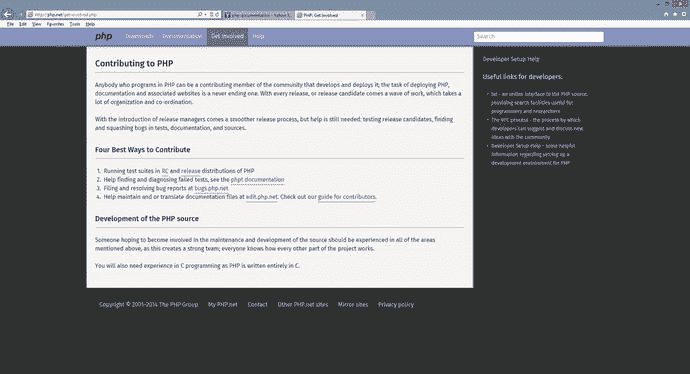

图 1-2。

Get involved (09/24/15)

如前所述，这个网站为用户提供了帮助语言未来发展的能力。用户可以参与测试 beta 版本，并报告错误或程序错误。访问者还可以查看与未来可能的版本开发相关的文档。这是在向公众发布重大公告之前发现未来增强功能或安全修复的好方法。

图 1-3。

Download page (09/24/15)

正如您可能已经猜到的，下载页面提供了轻松访问该语言最新版本的能力。然而，正如您将注意到的，只提供了语言本身。更常见的是，建议初级用户使用 WAMP (Windows、Apache、MySQL、PHP)；LAMP (Linux，Apache，MySQL，PHP)；或者 MAMP (Mac，Apache，MySQL，PHP)包进行初始安装。这些包(我们将在后面看到)允许同时安装多个产品。否则，您必须运行许多单独的安装，如果安装了不兼容的版本，这会变得复杂并且容易出错。WAMP/LAMP/MAMP——开源(免费)组合，包括 Apache Web Server、MySQL 和针对特定操作系统(Windows、Linux 和 Mac)的 PHP。这些包是开源的。该软件组合用于创建动态网站和网络应用。

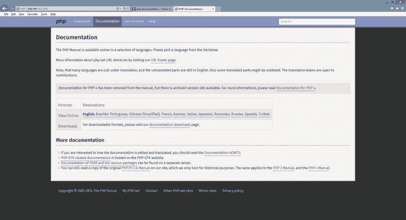

图 1-4。

Documentation pages (09/24/15)

PHP 网站的一个更重要的页面是文档页面。该页面允许用户搜索语言本身的描述和功能。您也可以下载完整的文档。但是，由于这是一个“实时”网站，可能会发生变化，因此最好直接从网站上获取最新信息。

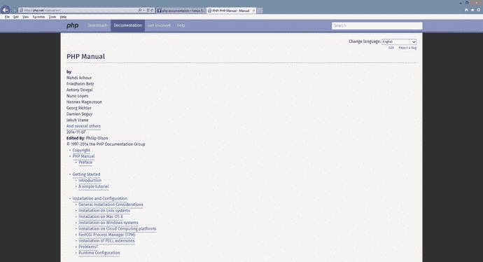

图 1-5。

The Manual (11/11/14)

通过从头开始点击每个链接，您可以像使用教科书一样使用手册。手册的每一部分所提供的有限的解释可能会导致初学者想要放弃编程，而将兴趣转向像网络这样可怕的东西！该手册确实为有经验的程序员提供了很好的指导，因为该语言的语法类似于其他语言，如 JavaScript、Perl 和 Java。

图 1-6。

Search (11/11/14)

在网站的任何页面上，用户都可以输入一个术语、一个表达式，甚至一个函数名来查找更多信息。当在搜索框中输入信息时，网页将在搜索框下方向用户提供一个或多个选项供用户选择。

一旦用户选择了一个选项(例如图 [1-7](#Fig7) 中所示的 echo)，搜索结果将为用户提供所请求项目的一般描述、功能的任何输入或输出(参数)以及示例代码。

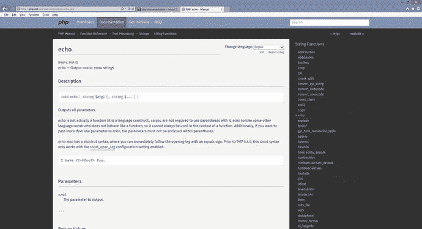

图 1-7。

Echo (11/11/14)

示例代码通过使用注释(在图 [1-8](#Fig8) 中用`//`和金色表示)在代码本身中解释了函数的用法。注释不是可执行代码。可执行代码用颜色编码，突出显示字符串(红色)、变量(蓝色)、关键字(绿色)和 PHP 开始和结束标记(蓝色)。颜色编码有助于提高代码的可读性。它还可以使创建程序时更容易发现语法错误。许多 PHP 编辑器都提供了类似的配色方案。

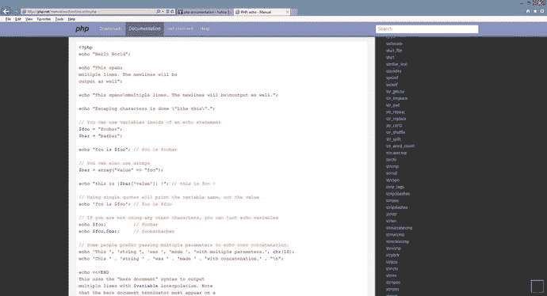

图 1-8。

Echo code (11/11/14)

### PHP 5.6+和 PHP 7+

随着 PHP 7 环境的发布，发生了很大的改进。PHP 5.5+极大地提高了安全性。在本书中，我们将使用最新的 PHP 加密工具“password hash ”,而不是目前许多书使用的 MD5。在过去的几年中，MD5 已经被证明易受黑客攻击。

> "PHP 7 is based on the PHPNG project (PHP Next-Gen), which is led by Zend and aims to speed up PHP applications. The performance improvement realized by PHP 7 is enormous! Their differences in real applications are between 25% and 70%, all of which are realized by upgrading PHP without changing any line of code! " — [`www` `.` `zend` `.` `com`](http://www.zend.com/)

PHP 7 还取代了致命错误，以前致命错误会导致程序崩溃，异常可以在程序内部处理。

如果您要从以前的 PHP 版本迁移到 PHP 7，请查看以下链接:

[T2`http://php.net/manual/en/migration70.php`](http://php.net/manual/en/migration70.php)

本书示例中使用的代码与 PHP 7 兼容。大多数例子也兼容 PHP 5.5 和 PHP 5.6。

### 做它

Go to [www.​php.​net](http://www.php.net/). Search for information on the `print` and `printf` functions. How are these functions similar? How are they different?   How do you “join the team” and help with the creation of the next version of PHP? Hint: Go to the “Get Involved” section of [`www.php.net`](http://www.php.net/) , select “Guide for Contributors,” and then find the “Join the team” link. Of course, the web site changes, so you may need to find a different route to the information.   Which ways can the [`www.php.net`](http://www.php.net/) web site be useful for a beginning PHP programmer?   What language is used to create PHP? Hint: The answer is somewhere on the [`www.php.net`](http://www.php.net/) web site.   Go to [`www.php.net`](http://www.php.net/) . Search for the list of improvements and changes with PHP 7\. List those improvements and changes. Which of these do you think will affect a beginning level programmer?  

## PHP、JavaScript、CSS、HTML 和 Apache Web 服务器

PHP 是一种脚本语言。脚本语言不同于实际的编程语言。编程语言(如 Java)是由程序员用类似英语的语法编写的。程序被编译，这意味着它从英语语法转换成机器代码(0 和 1)。该代码然后在兼容的操作系统和硬件中执行(运行)。脚本语言不使用编译器。第一次访问代码时，会在程序执行时逐行解释。

您可能想知道这是否会导致代码比编译后的代码慢。答案是否定的。一旦代码被执行了一次，被解释的代码就留在计算机或服务器的内存中，供其他执行使用。如果程序员修改了这段代码，新的版本将替换内存中的前一个版本。

JavaScript 也是一种脚本语言。您可能知道，通过查看源代码，可以在 web 浏览器中看到 JavaScript 代码，如图 [1-9](#Fig9) 所示。

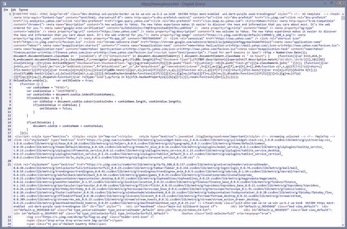

图 1-9。

JavaScript, HTML, and CSS code from yahoo.com (11/11/14)

图 [1-9](#Fig9) 中显示的源代码来自 [`www.yahoo.com`](http://www.yahoo.com/) ，它显示了几种语言的组合，包括 HTML、CSS 和 JavaScript。JavaScript 代码(以黑色显示)位于脚本标签`(`之间。如果您的浏览器允许 cookie，这段 JavaScript 代码将尝试在您的机器上创建一个 cookie。

然而，当我们查看 [`www.php.net`](http://www.php.net/) 源代码时(图 [1-10](#Fig10) ，我们看不到任何 PHP 脚本代码。这里有一些 PHP 文件的链接，但是没有显示实际的 PHP 代码。为什么？

图 1-10。

The [`www.php.net`](http://www.php.net/) source code (11/11/14)

JavaScript 代码驻留在用户的计算机上。它在浏览器中被解释和执行。PHP 代码驻留在 web 服务器上。代码也可以被解释和执行，但是是由 web 服务器，而不是浏览器。执行 PHP 代码的结果被返回给浏览器，而不是实际的代码本身。

`<?php`

`Print "Hello";`

`?>`

Note

您可能会注意到使用 PHP 的其他格式(例如:`<%`、`<%=`、`%>`或`<script language="php">`)；在 PHP 7 中，这些样式不再有效。以前实际上已经折旧了，但是仍然可以使用。

您可能会猜测这段代码会显示`Hello`。虽然这是正确的，但问题是，产生这种结果的过程是什么？

如果这段代码放在 web 服务器上的一个文件中(如`hello.php`)，我们将使用我们的 web 浏览器通过在 URL(地址)框中输入它的名称和位置来请求这个文件(如 [`http://servera.com/hello.php`](http://servera.com/hello.php) )。输入的地址指示浏览器向 web 服务器(`servera.com`)发送 HTTP `Get`请求，以返回网页(`hello.php`)。

图 1-11。

Requesting an HTML/JavaScript web page

接收请求的 web 服务器将确定 PHP 代码必须首先被解释和执行。它只是通过查看所请求文件的文件扩展名(`.php`)来确定这一点。文件中的任何 PHP 代码都会被发送到 PHP 处理器进行解释和执行。代码的执行结果被返回给 web 服务器，web 服务器又将它(以及任何其他 HTML 和/或 JavaScript 代码)发送回浏览器。在本例中，浏览器将返回并显示`Hello`。如果我们接着查看源代码，如上所述，我们只会看到真正的单词`Hello`。我们不会看到任何 HTML 或 PHP。为什么呢？因为我们没有向浏览器发回任何 HTML。

图 1-12。

Requesting a web page with PHP code

您可能想知道是否可以使用这个过程发送回实际的 HTML(和/或 JavaScript)代码来创建动态 web 页面。答案是肯定的。PHP `print`函数将返回放置在`""`之间的任何 HTML(或 JavaScript)代码。浏览器将解释 web 服务器返回的任何代码。

> Print function. Print function is not actually a function. It is a linguistic structure. The function string is required to be enclosed in quotation marks when passing. Structure does not need to enclose strings in quotation marks. Still recommended. Print will pass the content passed to it to the browser. It will try to convert any item that is not a string into a string (text) format, because all items displayed in the web page are in text format. For more information, `visit:` [`http` `://` `php` `.` `net` `/` `manual` `/` `en` `/` `function` `.` `.` `php`](http://php.net/manual/en/function.print.php) [T11 Please visit the free "New Boston" (`thenewboston` `.` `com`) video (s) at `https` `://` `www` `.` `thenewboston` `.` `com` `/` `videos` `.` [T30.

Note

本书提供的所有链接均可从 [`http://www.littleoceanwaves.com/securephp`](http://www.littleoceanwaves.com/securephp) 进入。

`<?php`

`Print "<h1>Hello</h1>";`

`?>`

如果我们将代码更改为上面的清单，浏览器会将`Hello`显示为 HTML 标题(`h1`)。使用`print`函数的缺点是程序无法控制语句在网页上的显示位置。该语句实际上将显示为代码的第一行，甚至在任何其他现有的 HTML 标记之前。如果我们只是向用户返回一个语句，比如“您的过程已经完成”，这可能没问题。但是，如果您的目标是在页面上的精确位置格式化输出，这可能是不可接受的。我们可以选择其他技术和功能来消除这个问题。但是，这超出了我们目前的讨论范围。

现在我们知道我们必须在 web 服务器的帮助下解释和执行 PHP 代码，那么我们应该使用什么服务器呢？

Apache web 服务器是最常用于托管和处理 PHP 网页请求的服务器。像其他 web 服务器一样，Apache 也可以接受和返回对其他类型文件的请求，包括 HTML、JavaScript、PERL、图像和 RSS 提要。如前所述，Apache 通过首先查看所请求文件的文件扩展名来确定 HTTP 请求需要完成哪些进程。

图 1-13。

Apache.org web site (09/24/15)

Apache 和 PHP 一样，都是开源产品。Apache web 服务器的所有更改都由 Apache 软件基金会协调。ASP 维护着`apache.org`网站，为用户和开发人员提供发现当前正在开发的项目的能力，以及下载最新版本的 Apache 的能力。然而，如前所述，下载 PHP、Apache 和 MySQL 的不同版本会导致版本不兼容的问题。除非你知道自己在做什么，否则下载完整的 WAMP、LAMP 或 MAMP 版本要明智得多。

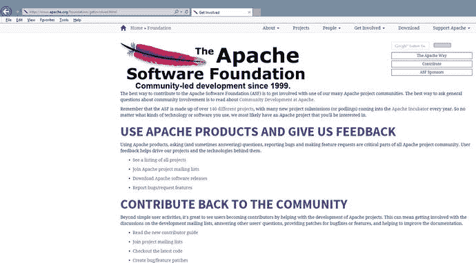

图 1-14。

Apache’s Get Involved (09/24/15)

Apache 软件基金会还鼓励他们产品的所有用户保持更新，并参与未来产品的开发。我们鼓励用户加入讨论和邮件组，测试新版本，甚至帮助修复 bug 或为他们的产品添加新功能。

### 做它

What are the differences in executing PHP code compared to executing Java code?   What is the difference between a scripting language and a programming language? What type of language is PHP?   How does the Apache web server handle requests for a PHP web page?   Why can we see JavaScript code within a web browser but we can’t see PHP code?   Go to [`www.apache.org`](http://www.apache.org/) . What are some of the ways that you can become involved with the development of Apache projects, even though you have limited experience?  

## PHP、Apache 和 MySQL

当网页向数据库请求信息时会发生什么？

通常，数据库存储在独立于 web 服务器本身的服务器上。

对数据的请求是来自 web 服务器还是来自 PHP 处理器？

由于 SQL 语句包含在 PHP 代码本身中，PHP 处理器将 SQL 语句发送到数据库管理系统(MySQL)进行处理。SQL—结构化查询语言是一种特殊的语言，用于更新、插入或删除 DBMS(数据库管理系统)中的数据。DBMS 是一种应用，它与程序语言和数据库进行交互，以更新、插入或删除数据。DBMS 使用 SQL 来解释数据库中数据所需的更改。有关 SQL 的更多信息，请访问[`http``://``en``.``wikipedia``.``org``/``wiki``/``SQL`](http://en.wikipedia.org/wiki/SQL)`.`

图 1-15。

Requesting a PHP web page that retrieves information from a MySQL database

Apache 服务器将首先发现 PHP 代码必须被解释。PHP 代码将被发送到 PHP 处理器。PHP 处理器解释代码(一行一行)。在这样做的时候，它会发现 SQL 语句必须针对数据库执行。然后，SQL 语句被传输到适当的数据库管理系统(DBMS)进行处理。DBMS 将把 SQL 语句的执行结果返回给 PHP 处理器。然后，PHP 处理器将使用这些结果来格式化输出，以提供给 Apache 服务器。然后，Apache 服务器将把 PHP 处理器返回的结果与可能驻留在原始请求页面上的任何其他 HTML(和/或 JavaScript)代码结合起来，并将所有输出返回给用户机器上的浏览器。然后，浏览器将解释 HTML 和 JavaScript 来显示所请求页面的结果。

你全都明白了吗？

让我们看一个“真实世界”的例子，如图 [1-16](#Fig16) 所示。

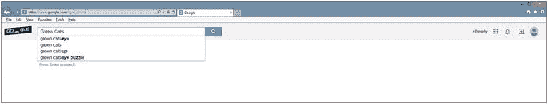

图 1-16。

Google.com search for “green cats” (11/12/14)

出于一些非常奇怪的原因，我们决定在互联网上查找“绿猫”。当我们将字符串输入到我们最喜欢的搜索引擎(本例中是 Google)中，然后单击 search 按钮，信息就会被传递到某个 Google 服务器群。哪里？

谁知道；它可能在地球上的任何地方。但互联网的强大之处在于，只要能快速拿回结果，我们就不在乎。

图 1-17。

Green cats (11/12/14)

好吧，我必须说我很惊讶有 1.04 亿个可能和绿猫有关的链接。哇哦。也许我们应该过滤掉一些。然而，关键是 Google 返回一个网页，上面有链接列表和对这些链接的描述(外加广告)。

Google 是否返回了一个已经存在的静态页面？

没有。服务器根据用户的请求创建了一个动态页面。谷歌算法(软件)搜索巨大的谷歌数据库农场。该请求首先从用户的浏览器发送到 Google web 服务器。然后，web 服务器向 Google 数据库发送请求(实际上使用了一种类似于 SQL 的 Google 查询语言)以返回关于“绿猫”的信息。web 服务器上的软件然后编译结果，添加 HTML 和 JavaScript(还有一些 Google Script 语言代码)来格式化结果网页，并将信息返回给用户。

> Static and dynamic web pages-static web pages will not change due to user requests or inputs. This page is created by a web developer and resides on a web server. When a user requests a page through a browser, a copy of the page is sent to the browser for display. There is no dynamic page in the web server. Use input from users to create pages. The program residing on the web server will create and format the page. The page created by the program is then downloaded to the user's browser. A copy of the web page (usually) is not saved on the web server. For more information about static web pages, please visit [`http` `://` `en` `.` `wikipedia` `.` `org` `/` `wiki` `/` `Static` `_` `_` `page`](http://en.wikipedia.org/wiki/Static_web_page) For more dynamic webpage information, please visit: [`http` `://` `en` `.` `wikipedia` `.` `org` `/` `wiki` `/` `Dynamic` `_` `web` `_` 【T39】 [T29](http://en.wikipedia.org/wiki/Dynamic_web_page)

每个页面都被下载到用户的网络浏览器了吗？

不，只是第一页。第一个结果页面底部的页面链接向 web 服务器返回信息，请求下一组信息(以动态创建第二个页面或另一个请求的页面)。正如您现在可能开始发现的，我们刚刚讨论的与处理互联网上的 PHP 文件相关的相同过程是创建动态页面的一个非常常见的过程。

您可能已经注意到显示的结果页面 URL 地址有一些有趣的地方。现在的地址是 [`https://www.google.com/?gws_rd=ssl#q=Green+Cats`](https://www.google.com/?gws_rd=ssl#q=Green+Cats) ，而不是 [`www.google.com`](http://www.google.com/) 。Google 算法在向服务器发送搜索请求时使用 GET HTTP 请求。

> HTTP—-Hypertext Transfer Protocol is a protocol (standard) for transmitting messages (text and web pages) between nodes (computers and servers) on the Internet. This is a request-response protocol. For example, the user "requests" a web page through the browser. The web server "responds" to the request and returns the page to the browser. Convert the browser request into an HTTP Get request (such as GET `/` `pages` `/` `mypage` `.` `html HTTP` `/` `.` `1`) and send it to the web server. The web server responds with the requested information and status code (such as http `/` `1` `.` `1 200 OK`). For more information about HTTP, please visit [`http` `://` `en` `.` `wikipedia` `.` `org` `/` `wiki` `/` `Hypertext` `_` `Transfer` `_` `Protocol` `Protocol`](http://en.wikipedia.org/wiki/Hypertext_Transfer_Protocol#Request_methods)

`<form name="orders" method="get" id="orders" action="searchprocess.php">`

`Name: <input type="text" name="customername" id="customername"> `

`<input type="submit" value="Submit your name">`

`</form>`

让我们看一个简单的例子来发现发生了什么。假设上面的代码保存在本地主机网站上的`projects`文件夹下的`index.html`文件中。

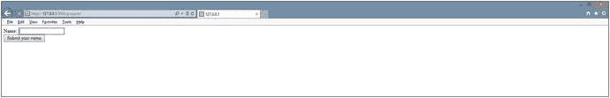

图 1-18。

Index.html example

如果用户在浏览器显示的文本框中输入`Fred`，结果页面(通过在 web 服务器上解释并执行`searchprocess.php`文件并将结果发送回浏览器而创建)将显示 URL 行: [`http://127.0.0.1/projects/searchprocess.php?customername=Fred`](http://127.0.0.1/projects/searchprocess.php?customername=Fred) 。

图 1-19。

Execution of searchprocess.php

文本框的名称(`customername`)和文本框中输入的值(Fred)现在在 URL 行上可见。实际上，`customername`现在是一个参数，`Fred`现在是参数的值。这是使用 GET 进程的结果。

当我们单击 Google Search 按钮或简单示例中的 Search 按钮时，请求的信息通过 GET HTTP 进程发送。接收程序所需的所有信息(和变量)都在实际的 URL 行上发送，由处理初始请求的 web 服务器上的程序接收。

为什么谷歌搜索引擎通过 GET 而不是 POST 发送信息(这样会隐藏信息)？

主要原因是为了节省服务器内存。想想谷歌对信息的数百万次请求。如果所有这些请求都驻留在内存中，服务器很快就会崩溃。此外，由于用户是在“公开”搜索信息，因此没有理由隐藏信息。在后面的章节中，我们将发现如何在 PHP 程序中读取 GET 和 POST 参数。

然而，现在让我们回到我们对 Apache、PHP 和 DBMS 的讨论。

PHP 可以从许多类型的 DBMS 系统中访问信息，包括 Oracle 和 SQL Server。然而，最流行的组合(如前所述)是将 PHP 与 MySQL 配对。我敢打赌，在这一点上，你能猜到为什么？是的，它是开源和免费的。MySQL 也是比较容易使用的 DBMS 系统之一。

图 1-20。

[www.​mysql.​com](http://www.mysql.com/) (09/24/15)

就像我们讨论过的所有开源产品一样，用户可以去官方网站( [`www.mysql.com`](http://www.mysql.com/) )下载最新版本。此外，正如您可能猜到的，您可以加入帮助开发 MySQL 新版本和相关产品的乐趣。可以下载当前版本和几个以前版本的文档。文档内容相当丰富，不适合智力低下的人或初学者。另外，由于你可能已经厌倦了阅读，所以不建议你单独下载 MySQL 的新版本，直到你有了更多的经验。坚持 WAMP，灯，MAMP 套餐，至少现在是这样。

### 做它

Why does the PHP processor send SQL to the DBMS instead of the Apache web server sending it directly to the DBMS?   What might Apache do with the information received from the DBMS before sending it back to the user’s browser?   Go to [`www.mysql.com`](http://www.mysql.com/) . What is the latest version of MySQL? Which versions of Apache and PHP are compatible?   Why do search engines pass information via GET HTTP requests instead of POST HTTP requests? When would you use a POST request?  

## 把它们放在一起——PHP、Apache 和 MySQL

到目前为止，您可能已经发现，PHP、Apache 和 MySQL 需要无缝地一起运行，才能成功地创建动态网页。有许多开发包提供了这些产品的组合，以及其他工具，如 PhpMyAdmin(这对设置 web 服务器和数据库有很大的帮助)。通过安装这些产品中的一个，你将大大降低你的沮丧程度，甚至可能设法保留你的大部分头发。我们将简要地看两个最流行的；EasyPHP 和 XAMPP。出于两个原因，我们不会深入探讨或提供分步安装指导。一旦这本书出版，方向可能会改变，使用默认设置是没问题的。大多数时候，接受开发人员的建议是可行的。

### EasyPHP

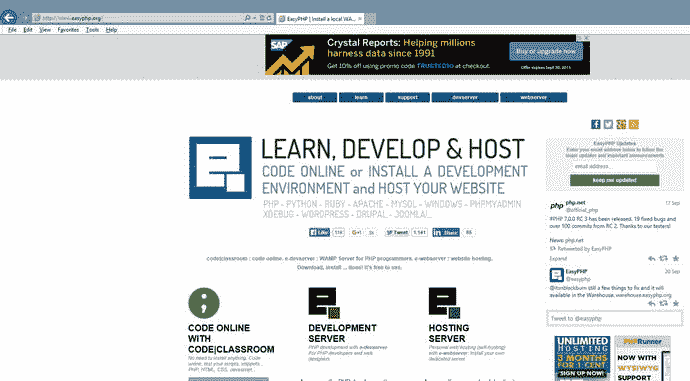

图 1-21。

[www.​easyphp.​org](http://www.easyphp.org/) (09/24/15)

你可以从下面的链接下载 EasyPHP 的开发者版本。没有必要下载主机版本，除非您计划将“实时”网页直接从您的计算机托管到互联网上。

[T2`http://www.easyphp.org/easyphp-devserver.php`](http://www.easyphp.org/easyphp-devserver.php)

开发者版本的 EasyPHP 是一个 WAMP (Windows，Apache，MySQL，PHP)包，用于微软的 Windows 环境中。您还可以选择安装其他工具来帮助开发。然而，对于我们的目的，您只需要基本安装。安装后，这些文件将位于 EasyPHP 目录下的 program files 目录中。

Warning

下载时请注意您点击了网站上的哪些按钮。如果您在单击按钮之前没有阅读您正在下载的内容，您可能会下载您不感兴趣的额外项目。

单击网站上的下载箭头下载安装程序后，按照软件提供的说明进行操作。第一次尝试时，保留所有默认设置。希望一切都能正确安装。如果没有，请阅读下一节“常见安装问题”。

#### 常见安装问题

##### 缺少 C#库

PHP 7(以及 PHP 的早期版本)需要 Microsoft Visual Studio C#库。如果您使用的是 Windows 8 或更高版本，可能已经安装了该库。此外，如果您有最新版本的 Microsoft Visual Studio，它也可能已经安装。如果您收到一条错误消息，指出 C#丢失或版本错误，请将该消息粘贴到 Internet 上的搜索引擎中。搜索 Microsoft 的响应以获得修复错误的指导。响应应包括下载缺失文件和安装说明的链接。

##### 端口冲突

如果您已经有一个使用端口 80 的服务，端口 80 是您的 PC 和外部世界之间的 HTML 流量的默认端口，当它试图运行时，您将收到来自 Apache 的错误消息。您可以通过多种方式解决这个问题。

> Wikipedia defines ports as: in computer networks, ports are application-specific or process-specific software structures that are used as communication endpoints in computer host operating systems. The purpose of port is to uniquely identify different applications or processes running on a single computer, so that they can share a single physical connection to a packet-switched network like the Internet. In the context of Internet protocol, a port is associated with the IP address of the host and the type of protocol used for communication. For more information about ports, please visit: [`http` `://` `en` `.` `wikipedia` `.` `org` `/` `wiki` `/` `Port` `_(` `_` `networking`](http://en.wikipedia.org/wiki/Port_(computer_networking) [T11

A.如果您不介意在开发时关闭使用该端口的其他服务，您可以遵循下面的说明。一旦你使用完 Apache 和 PHP，你可以重新打开服务或者重启你的电脑，服务就会重新打开。

Go to the Microsoft Windows 7/8/10 Task Manager (press Ctrl+Alt+Delete at the same time).   Select the Services tab.   Look for any of the following services in Windows 7/8/10\. If you find one running, right-click it and turn it off. Then try restarting Apache again. If that does not work, turn that one back on and try another one. (The names may be slightly different depending on the version of Windows.)  

SQL Server Reporter、Web 部署代理、BranchCache、同步共享服务、WAS (IIS 管理员)和 W3SVC

B.如果您需要运行其他服务，或者您没有关闭端口 80 上的服务的管理权限，您可以更改 Apache 的默认监听端口位置。

转到系统托盘(屏幕右下角)。通过滚动图标找到 EasyPHP 图标。应该会出现每个的描述。如果看不到图标，请单击系统托盘中的向上箭头以查看更多图标。右键单击 EasyPHP 图标。选择配置，然后选择 Apache。这将在记事本(或您的默认文本编辑器)中打开 Apache 配置文件(`httpd.conf`)。首先在某个地方保存这个文件的副本，以防出错。这将让你从任何重大错误中恢复过来。然后在文件中搜索`Listen 127.0.0.1:80`。仅在该行上将`80`的出现改为`8080`或`81;`。这将允许 Apache 服务器监听一个不常用的端口。重新保存文件(确保将原始文件重新保存到原始位置)。

Note

确保在使用记事本或任何其他文本编辑器时使用“另存为”，然后选择“所有文件”作为文件类型。还要确保包含文件扩展名`.conf`。如果您不将文件类型更改为所有文件，您的文件将被保存为`httpd.conf.txt`。如果发生这种情况，服务器将看不到该文件。您可以通过重新打开文件并以正确的方法保存它来轻松解决这个问题。

然后，您可以通过返回系统托盘找到 EasyPHP 图标来重新启动 Apache。双击图标；将出现一个消息框，显示 Apache 和 MySQL 的状态。对于 Apache 状态，您可能会看到红色。单击 Apache 按钮。几分钟后，它应该会变成绿色。这将表明服务器现在正在运行。对 MySQL 做同样的事情。

##### 丢失的文件

如果您收到一条与此相关的错误消息，不知何故，您的文件在安装前已经损坏。返回 EasyPHP 网站，再次下载文件。此外，如果您不知何故弄乱了 Apache 配置文件，请返回并重新安装产品。

##### 无法在程序文件目录中安装文件

这表明您或其他人对该目录有很高的安全性限制。重新运行安装，并将安装位置更改为另一个目录。请记住，当我们在本书后面引用程序文件目录时，您应该查看文件的安装目录。

##### Apache 延迟和挂起

在 Windows 8/10 中，您可能会遇到 Apache 运行缓慢或挂起的问题。要纠正这个问题，请转到系统托盘(屏幕右下角)。通过滚动图标找到 EasyPHP 图标。应该会出现每个的描述。如果看不到图标，请单击系统托盘中的向上箭头以查看更多图标。右键单击 EasyPHP 图标。选择配置，然后选择 Apache。这将在记事本(或您的默认文本编辑器)中打开 Apache 配置文件(httpd.conf)。首先在某个地方保存这个文件的副本，以防出错。这将让你从任何重大错误中恢复过来。然后将下面两行添加到文件的底部。

接受过滤器 http 无

AcceptFilter https none 重新保存文件(确保将原始文件重新保存到原始位置)。

##### 其他错误

对于这里没有讨论的错误，将错误复制并粘贴到搜索引擎中。找到一个回答专栏或博客，提供修复错误的建议。网上有很多免费资源。不要花钱请网站(或其他人)来解决你的问题。

#### 配置

您需要确定希望 Apache 何时运行。Apache 可以设置为在您启动 PC 时、应用需要时运行，或者手动运行。要更改设置，您可以右键单击系统托盘(屏幕右下角)中的 EasyPHP 图标，然后选择配置，然后选择 EasyPHP。如果看不到图标，请点按系统托盘中的向上箭头。应该会出现一个小屏幕，允许您选中(或取消选中)两个选项—在会话启动时启动和在应用启动时启动服务器。

有许多可选的库，您可以根据需要链接或取消链接到 PHP。在许多情况下，库已经被加载，只需要被链接。您可以通过转到 PHP 配置文件(`php.ini`)并删除行首的注释(`;`)字符来添加这些库。右键单击系统托盘中的 EasyPHP 图标可以很容易地找到 PHP 配置文件。然后选择配置和 PHP。此时没有必要进行任何更改。还建议您仅在需要时进行这些更改。可以使用 Curl 和本书后面章节讨论的其他方法添加其他库。

要更深入地了解`php.ini`文件，请在`https://www.thenewboston.com/videos.php?cat=11&video=16993`观看免费的“新波士顿”(`thenewboston.com`)视频。

### XAMPP(洗发精)

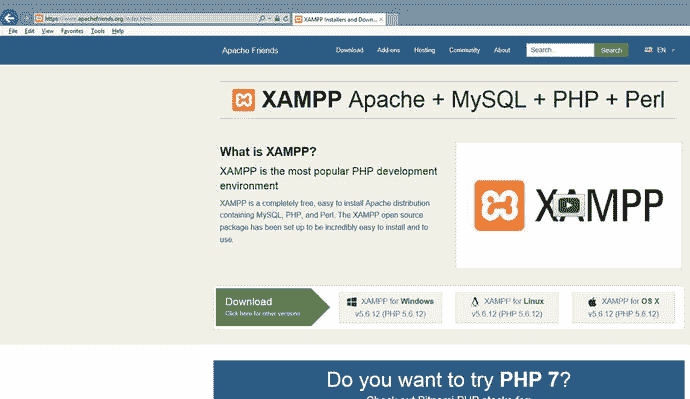

图 1-22。

XAMPP at [www.​apachefriends.​org](http://www.apachefriends.org/) (09/24/15)

虽然 XAMPP 与 EasyPHP 相似，但 XAMPP 更受欢迎，因为它有免费的 Windows、Linux 和 OS X 版本。它还包括许多附加组件，包括一些最流行的内容管理系统——Drupal、Joomla 和 WordPress。可以在 XAMPP 官方网站或许多其他下载位置直接获得最新下载。

[T2`https://www.apachefriends.org/`](https://www.apachefriends.org/)

Warning

注意你在网站上点击的按钮。如果您在单击按钮之前没有阅读您正在下载的内容，您可能会下载您不感兴趣的额外项目。

在您第一次尝试安装时，请使用开发人员在安装软件中建议的默认设置。你将大大减少出现问题或头痛的可能性。如果确实有错误，请阅读下一节“常见安装问题”以获得帮助。

#### 常见安装问题

##### 端口冲突

如果您已经有一个使用端口 80 的服务，端口 80 是您的 PC 和外部世界之间的 HTML 流量的默认端口，当它试图运行时，您将收到来自 Apache 的错误消息。您可以通过多种方式解决这个问题。

A.如果您不介意在开发时关闭使用该端口的其他服务，您可以按照视频链接上的说明进行操作。一旦你使用完 Apache 和 PHP，你可以重新打开服务或者重启你的电脑，服务就会重新打开。

Go to the Windows 7/8/10 Task Manager (press Ctrl+Alt+Delete at the same time).   Select the Services tab.   Look for any of the following services in Windows 7/8/10\. If you find one running, right-click it and turn it off. Then try restarting Apache again. If that does not work, turn that one back on and try another one. (The names may be slightly different depending on the version of Windows.) SQL Server Reporter, Web Deployment Agent, BranchCache, Sync Share Service, WAS (IIS Administrator), and W3SVC  

B.如果您需要运行其他服务，或者您没有关闭端口 80 上的服务的管理权限，您可以更改 Apache 的默认监听端口位置。

转到系统托盘(在 Microsoft Windows 中，它位于屏幕的右下角)。通过在图标上滚动鼠标找到 XAMPP 图标。应该会出现每个的描述。如果看不到图标，请单击系统托盘中的向上箭头以查看更多图标。双击该图标。应该会出现控制面板。您应该会在控制台上看到红色的启动错误消息。如果是端口冲突，单击 Apache 右侧的 Config 按钮。从提供的列表中选择`httpd.conf`。这将在记事本(或您的默认文本编辑器)中打开 Apache 配置文件(`httpd.conf`)。首先在某个地方保存这个文件的副本，以防你出错。这将允许您恢复原始文件。在文件中搜索 Listen 80。将`80`的发生更改为`8080`或`81`。这将允许 Apache 服务器监听其中一个不常用的端口。重新保存文件(确保将原始文件重新保存到原始位置)。

Note

确保在使用记事本或任何其他文本编辑器时使用另存为，然后选择所有文件作为文件类型。还要确保包含文件扩展名`.conf`。如果您不将文件类型更改为所有文件，您的文件将被保存为`httpd.conf.txt`。如果发生这种情况，服务器将看不到该文件。您可以通过重新打开文件并以正确的方法保存它来轻松解决这个问题。

然后，您可以通过在 XAMPP 控制台中单击 Apache 旁边的 start 按钮来重新启动 Apache。如果 Apache 的状态为绿色，那么您还需要通过单击 MySQL 右侧的 start 按钮来启动 MySQL。

##### 丢失的文件

如果您收到一条与此相关的错误消息，不知何故，您的文件在安装前已经损坏。返回 XAMPP 网站，再次下载文件。如果您不知何故弄乱了 Apache 配置文件，您还需要再次下载这些文件。

##### 无法在程序文件目录中安装文件

这表明您或其他人对该目录有很高的安全性限制。重新运行安装，并将安装位置更改为另一个目录。请记住，当您在本书后面引用程序文件目录时，您应该查看文件的安装目录。

##### Apache 延迟和挂起

在 Windows 8/10 中，您可能会遇到 Apache 运行缓慢或挂起的问题。要纠正这个问题，请转到系统托盘(屏幕右下角)。通过滚动图标找到 XAMPP 图标。应该会出现每个的描述。如果看不到图标，请单击系统托盘中的向上箭头以查看更多图标。右键单击 XAMPP 图标。选择配置，然后选择 Apache。这将在记事本(或您的默认文本编辑器)中打开 Apache 配置文件(httpd.conf)。首先在某个地方保存这个文件的副本，以防出错。这将让你从任何重大错误中恢复过来。然后将下面两行添加到文件的底部。

接受过滤器 http 无

AcceptFilter https none

重新保存文件(确保将原始文件重新保存到原始位置)。

##### 其他错误

对于这里没有讨论的错误，将错误复制并粘贴到搜索引擎中。找到一个回答专栏或博客，提供修复错误的建议。网上有很多免费资源。不要花钱请网站(或其他人)来解决你的问题。

#### 配置

您可以转到控制面板来更改 XAMPP 的配置(双击屏幕右下角系统托盘上的 XAMPP)。然后单击屏幕右上角的配置按钮(不是应用右侧的配置按钮)。然后，您可以选中(或取消选中)那些希望在下次控制面板启动时自动启动的应用。你应该在 Apache 和 MySQL 中查找这本书的内容。当然，你可以在需要的时候从控制面板启动它们。

有许多可选的库，您可以根据需要链接或取消链接到 PHP。在许多情况下，库已经被加载，只需要被链接。您可以添加这些库，方法是转到 PHP 配置文件(`php.ini`)并删除行首的注释(`;`)字符。双击系统托盘中的 XAMPP 图标可以很容易地找到 PHP 配置文件。然后单击 Apache 右侧的 Config 按钮。将显示一个列表；选择`php.ini`。此时没有必要进行任何更改。还建议您仅在需要时进行这些更改。可以使用 Curl 和本书后面章节讨论的其他方法添加其他库。

### 微软互联网信息服务器

或者，如果您无法让 Apache 在 Windows(尤其是 Windows 8 或 Windows 10)中正常运行，或者您喜欢微软的 IIS 服务器，您可以安装 PHP 来使用微软 IIS(互联网信息服务器)而不是 Apache。有关更多信息，请访问:

[T2`http://www.microsoft.com/web/platform/phponwindows.aspx`](http://www.microsoft.com/web/platform/phponwindows.aspx)

### 做它

Use a search engine to answer this question: You receive the following error either while installing or as soon as you try to start XAMMP or EasyPHP. How can you find the solution to your problem? What might be causing this error? `Internal Server Error` `The server encountered an internal error or misconfiguration and was unable to complete your request.` `Please contact the server administrator,` `you@example.com` `and inform them of the time the error occurred, and anything you might have done that may have caused the error.` `More information about this error may be available in the server error log.`   Use a search engine to answer this question: What is XAMPP error #1130? How can you fix this error?   Use a search engine to answer this question: When trying to run a PHP program using EasyPHP (and Apache) you receive the error below. What is causing this error? How can you fix it? `Cannot load mcrypt extension. Please check your PHP configuration.`   If you have not already attempted to do so, install either EasyPHP or XAMPP on your personal machine. Did you have any problems with your installation? If so, what problems did you have? How did you solve those problems?  

## 测试您的环境

你现在有绿灯了，对吧？一切正常吗？

希望如此。然而，你需要确保。最好的方法是测试您的环境。

### 测试您的管理环境

首先，我们需要测试服务器，看看我们的管理页面是否会显示。在 EasyPHP 中，您可以执行以下任一操作:

1.右键单击 EasyPHP 图标并选择管理。

或者

2.打开您最喜欢的浏览器，输入以下内容:

[T2`http://127.0.0.1/home/`](http://127.0.0.1/home/)

如果由于冲突而不得不更改您的端口，您可能需要输入端口号，例如:

[T2`http://127.0.0.1:8080/home/`](http://127.0.0.1:8080/home/)

您应该会看到一个类似于图 [1-23](#Fig23) 所示的屏幕。

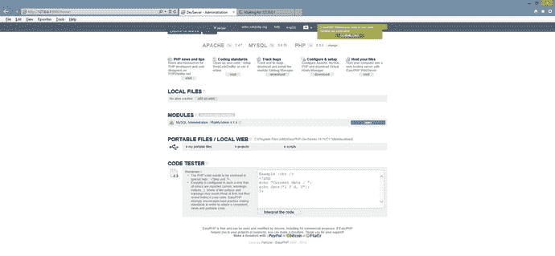

图 1-23。

EasyPHP administration screen (PHP 5.6)

对于 XAMPP，打开您最喜欢的浏览器，输入以下地址:

[T2`http://127.0.0.1/dashboard/`](http://127.0.0.1/dashboard/)

如果由于冲突而不得不更改您的端口，那么您还必须包括此端口:

[T2`http://127.0.0.1:8080/dashboard/`](http://127.0.0.1:8080/dashboard/)

如果 XAMPP 安装正确，您应该会看到类似于图 [1-24](#Fig24) 所示的屏幕。

图 1-24。

XAMPP dashboard screen (09/24/15)

如果此时你看不到这个页面(或显示 XAMPP 的某个页面)，那一定是出了问题。检查以下内容:

是 EasyPHP 还是 XAMPP 在运行(启动)？你在 XAMPP 控制面板或 EasyPHP 中看到 Apache 的绿灯或绿色阴影了吗？如果没有，请尝试单击开始按钮或链接。

如果 Apache 无法启动，您会看到错误信息吗？如果没有，请检查错误日志文件。对于 EasyPHP，右键单击系统托盘上的图标，并选择 Apache 的错误日志文件。对于 XAMPP，单击 Apache 旁边的控制面板上的日志按钮，并选择错误日志。

如果您看到绿色并且页面似乎被锁定，请尝试停止并重新启动 Apache。可能要试几次才能唤醒它。如果它继续挂起，请检查您的计算机设置。您是否最大限度地利用了 CPU？

你能确定问题吗？如果你有一个错误信息，把它粘贴到你最喜欢的搜索引擎中，看看专家对这个问题怎么说。

### 做它

1.如果您还没有这样做，请按照上面的说明测试您的环境。你有什么问题吗？如果是，发生了什么问题？你是如何解决这些问题的？

### 测试您的 PHP 环境

希望此时一切都好。要么你运气一直很好，要么你设法解决了你遇到的所有问题。然而，你仍然需要看看你是否能在 Apache 中运行你自己的 PHP 程序。

打开一个文本编辑器(不是 Word，但是 Notepad 或 Notepad++都可以)，按照显示的内容输入下面的代码。

`<?php`

`print "Hello World";`

`?>`

图 1-25。

Using Save As with All Files to save PHP programs

使用文件菜单上的另存为选项，将文件类型更改为所有文件或`php`。输入文件名`myfirstprogram.php`并将其保存在以下位置之一。

如果您使用的是 EasyPHP，请将其保存到:

`C:\Program Files (x86)\EasyPHP-DevServer-14.1VC11\data\localweb\projects`

当然，您应该将版本名称(或程序文件名)更改为您在计算机上使用的正确版本(位置)。如果您的 EasyPHP 版本没有 localweb\projects 文件夹，请在 EasyPHP 文件夹下找到`www`文件夹的位置，并创建一个名为`projects`的文件夹。然后将文件保存在该文件夹下。

如果你正在使用 XAMPP，首先转到`C:\xampp\htdocs`并创建一个名为`projects`的文件夹。然后回到你的文本编辑器，选择另存为(不要忘记将文件类型改为所有文件或`php`)，将文件命名为`myfirstprogram.php`并保存到下面的位置。

`C:\xampp\htdocs\projects`

如果你在 EasyPHP 或 XAMPP 位置正确地保存了你的文件，你可以通过在你的浏览器 URL 框中输入以下内容来运行你的程序。

[T2`http://127.0.0.1/projects/myfirstprogram.php`](http://127.0.0.1/projects/myfirstprogram.php)

如果您更改了端口，则将第一部分更改为 [`http://127.0.0.1:8080/`](http://127.0.0.1:8080/) (输入您正在使用的正确端口来代替`8080`)。

你的程序应该显示如图 [1-26](#Fig26) 所示的信息。

图 1-26。

Hello World

#### 常见问题

不显示任何内容，错误 404:

Make sure you typed the address exactly as shown.   Your server might be hung up. Stop and restart it.   Make sure you placed your file in the correct location.   Make sure you saved your file as a `.php` file and not as `.txt`. Try Save As again and renaming the file (make sure file type is either All Files or `php`).   Check for typos in your actual program code. Did you remember the semicolon (`;)`? Fix any and resave. You might need to stop and start the server if it does not see the changes for some reason. You can go to the log files and look at the PHP log files to see any errors that might exist in your code.   Go to the Apache log files (see directions in previous common problems) to look for errors. If you cannot correct them, copy the errors and paste them in a search engine to see what others have found as solutions.  

显示的是实际的程序代码，而不是执行代码的结果:

Make sure you saved your file as a `.php` file and not as `.txt`. Try Save As again and renaming the file (make sure file type is either All Files or `php`).   Your Apache server or PHP might not be started or is hung. Stop and start Apache again.   Did you forget or have a typo in the `<?php` or `?>` lines?   Go to the Apache log files (see directions in previous common problems) to find the errors. If you cannot correct them, copy the errors and paste them in a search engine to see what others have found as solutions.  

对于任何其他错误，将它们复制并粘贴到网络搜索引擎中，看看其他人发现了什么解决方案。

### EasyPHP 的代码教室

如果你在电脑上安装 LAMP、MAMP 或 WAMP 软件时仍然有问题，一切都还没完。

EasyPHP ( [`www.easyphp.org`](http://www.easyphp.org/) )现在为学生和教师提供了一个在线编码环境。这个环境(见图 [1-27](#Fig27) )允许你输入代码(下面的黑色窗口)，点击提交按钮(红色按钮)，并在右边看到你的结果(白色窗口)。

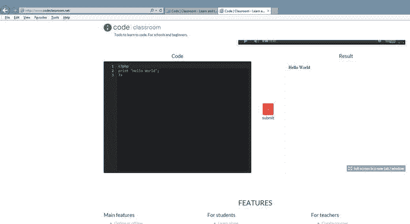

图 1-27。

[www.​codeclassroom.​net](http://www.codeclassroom.net/)

### 做它

1.如果您尚未测试您的环境，请进行测试。测试成功了吗？你遇到过什么问题，如果有的话？你是如何解决那些问题的？

## 别名目录

在现实世界中，在 web 服务器中创建别名目录是常见的做法。别名目录是文件的“虚假”位置，它欺骗网站的用户，使他们相信文件在一个位置，而它在另一个位置。

为什么要使用别名目录？随着网站的增长，文件在服务器上的位置可能必须改变。通过使用别名，网站的用户不会知道文件的实际位置已经改变。别名使您能够将文件存储在计算机(服务器)上的任何位置。如果不使用别名，所有文件都必须存储在默认位置。默认位置是:

easy PHP:t0]

xampp:t0]

您可能需要考虑创建一个别名目录，尤其是当您希望将文件放在一个跳转驱动器上时。在本书中，我们假设文件位于默认位置下的一个`projects`文件夹中。

easy PHP:t0]

xampp〔t0〕

这将允许我们使用相同的 URL 测试程序，不管我们是使用 EasyPHP 还是 XAMPP。

[T2`http://127.0.0.1/projects/myfirstprogram.php`](http://127.0.0.1/projects/myfirstprogram.php)

如果您确实创建了一个别名目录，请记住用您正在使用的别名替换`projects`。

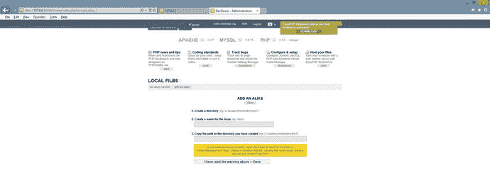

图 1-28。

EasyPHP alias screen

在 EasyPHP 中，可以从管理屏幕创建别名目录。转到系统托盘(屏幕右下角)，右键单击 EasyPHP 图标，然后选择 Administration。在屏幕中间，找到本地文件，然后找到右侧的添加别名按钮。点击并按照指示操作。添加别名之前，该文件夹必须已经存在。

图 1-29。

The httpd-xampp file

在 XAMPP，这需要更多的工作。双击 XAMPP 图标打开系统面板。然后单击 Apache 右侧的 Config 按钮。从列表中选择`httpd-xampp`配置文件。选择编辑。从文本编辑器菜单中查找。搜索字符串`'<IfModule alias_module>'`。不要更改本节中已经列出的任何内容。但是，您可以为您的可执行文件添加位置(使用下面的代码)。一旦输入了所需的行，停止并启动 Apache 来帮助它找到新的变化。

`Alias /myfiles "C:/Temp"`

`<Directory "C:/Temp">`

`Options Indexes FollowSymLinks MultiViews ExecCGI`

`AllowOverride All`

`Require all granted`

`</Directory>`

有关创建别名目录的更多信息，请访问:

[`https://www.youtube.com/watch?v=XX6t3zJRXF8`](https://www.youtube.com/watch?v=XX6t3zJRXF8) 。

Note

此目录设置允许对目录的完全读写能力。我们将在后面的章节中讨论保护“实时”网站目录的选项。

图 1-30。

Hello World running from the alias directory called myfiles as an index.php file

当用户在 URL 行中输入目录名`myfiles`时，这个清单将允许在 Apache 中执行`C:/Temp`目录中的任何文件。所提供的目录设置不太安全。然而，这只是为了在测试机上进行测试。如果你在一个真实的环境中，你需要加强`directory`标签下的安全设置。要执行这个目录中的文件，您可以在浏览器中输入 URL [`http://127.0.0.1/myfiles`](http://127.0.0.1/myfiles) 。如果不包含文件名，Apache 将尝试查找一个`index.html`或`index.php`文件。如果两者都不存在，Apache 将使用当前设置列出目录中的文件。这允许容易地访问用于测试的文件。然而，在真实环境中，这并不是一个好主意。您可以通过添加文件名( [`http://127.0.0.1/myfiles/myfirstprogram.php`](http://127.0.0.1/myfiles/myfirstprogram.php) )来请求不是索引文件的文件。如果必须更改端口号，请记住包括端口号( [`http://127.0.0.1:8080/myfiles/myfirstprogram.php`](http://127.0.0.1:8080/myfiles/myfirstprogram.php) )。当然，在浏览器中测试 URL 之前，目录必须存在并且文件必须在目录中。

### 做它

1.创建一个名为`myfiles`的别名文件夹，该文件夹指向硬盘或跳转驱动器上的现有位置。将您用来测试您的环境的`hello world`程序放在文件夹中。尝试使用前面的说明运行文件夹中的程序。你成功了吗？如果不是，你有什么问题？你是如何解决这些问题的？

## 记事本++编辑器和代码测试器

创建 PHP 代码时，您不需要使用特定的编辑器或购买编辑器。您可以在文本编辑器中(甚至在记事本中)创建所有代码。然而，拥有一个突出显示(着色)代码的编辑器确实有助于更容易地发现编码(语法)错误。

### 记事本++

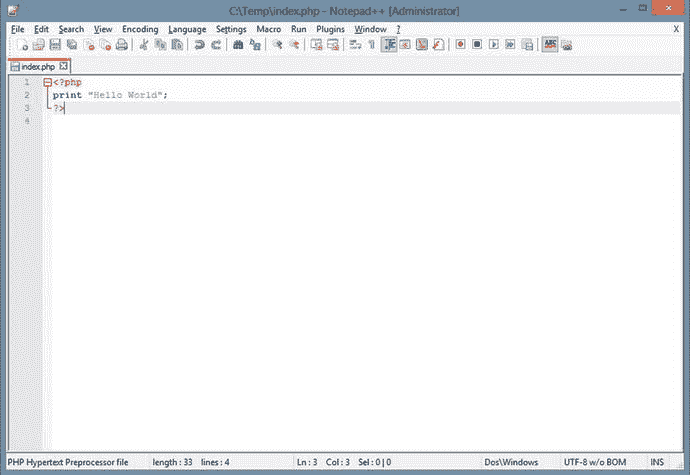

图 1-31。

Hello World inside Notepad++

记事本++可在 [`www.notepad-plus-plus.org`](http://www.notepad-plus-plus.org/) 下载。这是一个简单易用的编辑器。它可以创建超过 20 种不同形式的文件(包括 PHP)。本书中提供的大多数编码示例都是用 Notepad++创建的。当你在 Notepad++中创建新的 PHP 程序时，你必须告诉应用文件的类型。您可以通过选择语言菜单项，然后选择 PHP 来完成此操作。这将允许应用帮助您进行颜色编码和其他功能。

### 其他编辑

还有数百个其他可用的编辑器。我建议你挑一个你用起来最舒服的； [`www.download.com`](http://www.download.com/) 是一个寻找 PHP 免费编辑的好网站。选择一个有很多用户和一个强大的评级。

如前所述，您可能还想试试 EasyPHP 的代码教室，网址是:

[T2`www.codeclassroom.net`](http://www.codeclassroom.net/)

### 做它

1.在使用这本书的时候，决定一个你将用来完成你的编码的文本编辑器。将编辑器下载到您的 PC 上。在编辑器中重新键入您的`hello world`程序，并保存该程序。从浏览器运行程序。你为什么选择你下载的编辑器？你喜欢编辑的什么？你不喜欢编辑的什么？

## 章节术语

  
| 服务器端编程语言（Professional Hypertext Preprocessor 的缩写） | 过程语言 |
| 面向对象语言 | www.php.net |
| 服务器 | 灯 |
| 美国。 | 脚本语言 |
| 程序设计语言 | Java Script 语言 |
| 网络浏览器 | 源代码 |
| 超文本标记语言 | 半铸钢ˌ钢性铸铁(Cast Semi-Steel) |
| 脚本标签 | 网络服务器 |
| `print`功能 | 街头流氓 |
| 阿帕奇软件基金会 | 结构化查询语言 |
| 数据库管理系统 | 静态页面 |
| 动态页面 | 获取 HTTP 请求 |
| 关系型数据库 | EasyPHP(开发者版本) |
| 端口 80 | `httpd.conf` |
| `php.ini` | XAMPP(洗发精) |
| XAMPP 控制面板 | 别名目录 |
| 开放源码 | 记事本++ |

## 第二章问题和项目

多重选择

MAMP stands for Mobile Application Motor Processor   My Awesome Mobile Program   Apache-MySQL-PHP   Modern Application Modular Programing   None of these     The goals of the Apache Software Foundation (ASP) include Coordination of all changes to the Apache web server   Overseeing the selling of all Apache software   Licensing all web servers   Maintaining membership to open source programming through the Apache web server     What scripting languages can be viewed within a web browser? Java   XML   JavaScript   PHP     Select the statements that are true about static web pages: They are sometimes called flat page/stationary pages   They are generated by a web application   Static web pages display the same information for all users   All of the above   A and C     ___________ is an object-oriented computer programming language commonly used to create interactive effects within web browsers. HTML   XML   JavaScript   PHP     What is the correct way to end a PHP statement? `;`   New line   `<!php>`   `.`     The configurations button on the XAMPP Control Panel allow the user to do what? Install XAMPP   Select applications to automatically start   Manage add-ons   Configure MYSQL     `php.net` provides all of the following except Information of each latest release   PHP language documentation   LAMP, MAMP, and WAMP downloads   Contributions to the PHP documentation     Which of the following best describes a scripting language? The language is compiled.   The program must be compatible with operating system and hardware.   The first time the code is accessed is when the program is first executed.   The code is slower than compiled code    

真/假

The alias directory allows you to save your web page files in a directory (folder) of your choice rather than a `www` directory. It allows a URL address to point directly to that folder.   A static page is a page added to the dryer when drying clothes to prevent static cling.   A client browser submits a GET HTTP request to the server, then the server returns a response to the client browser.   The (Developer’s Version) of EasyPHP can be purchased only for one year at a time.   A dynamic web page never changes but a static web page is always changing.   WAMP stands for Windows, Apache, MySQL, and PHP.   Apache is an example of a web server.   HTML stands for Hypertext Markup Language.   PHP originally stood for Personal Home Page.   A procedural language is a programming language that uses classes and objects.   While viewing a web site in a browser, you may view the source code, which can show you HTML, JavaScript, and CSS. However, PHP code will not be visible.   Java is a procedural programming language.  

简答/短文

Explain the process that occurs when a browser requests a static web page.   Explain the process that occurs when a browser requests a dynamic web page.   Explain the difference between a procedural language and a scripting language.   How do you add access to PHP library code to your program?   Why should you use WAMP, MAMP, or LAMP instead of installing each application individually?  

项目

Create a PHP program to display a summary of your work history and educational history.   Create a PHP program to display your major and the courses required to complete your major.   Create a PHP program to display the goals and/or objectives of your college/university.  

学期项目

Your supervisor has requested that you design a secure application that will keep track of inventory in the warehouse of the ABC Computer Parts Corporation. This application will be accessible both within the warehouse itself and outside (via the Internet and/or smart phones). What data fields are necessary to keep track of this information? What size and data types (string, integer, floating point) should define these fields? What other restrictions on input (no negative values for item number) should be defined for these fields? For example, if a Social Security Number (SSN) was a required field: SSN: SIZE: Min: 9 characters (string) Max: 9 characters (string) Restrictions: Valid SSN format Notice that it uses characters, not integers, because no calculations will be done on the SSN number.