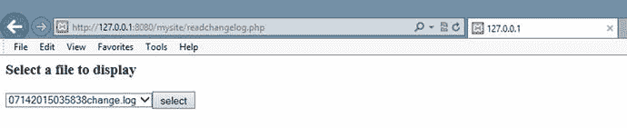
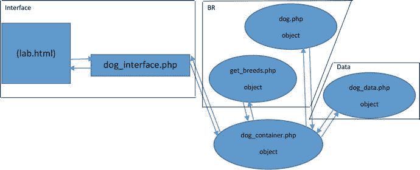

# 6.数据对象

Electronic supplementary material The online version of this chapter (doi:[10.​1007/​978-1-4842-1730-6_​6](http://dx.doi.org/10.1007/978-1-4842-1730-6_6)) contains supplementary material, which is available to authorized users.

“我是一个理想主义者。我不知道我要去哪里，但我在路上。”——卡尔·桑德堡，杂项(1904)

## 章节目标/学生学习成果

完成本章后，学生将能够:

*   创建插入、更新和删除 XML 或 JSON 数据的数据类
*   解释如何创建一个使用 SQL 脚本更新 MySQL 数据的数据类
*   创建一个 PHP 程序来创建一个变更备份日志
*   创建一个 PHP 程序，可以从以前的备份中恢复数据
*   应用更改以创建最新的有效信息
*   使用依赖注入将数据类附加到 BR 层中的另一个类
*   创建一个三层 PHP 应用

## 数据类

接口和业务规则层不应该存储应用信息。这些层甚至不应该知道信息是如何存储的(文本文件、XML 或数据库)或者存储信息的位置。存储的任何信息都必须从业务规则层传递到数据层。数据层还负责响应来自业务规则层的信息请求。

这使得接口层和业务规则层不知道存储方法类型(文本文件、XML 或数据库)和存储项位置的任何变化。签名(接受的参数)和从数据层返回的项应该在应用的生命周期中保持不变。只要这些没有改变，当数据层发生变化时，其他层就不需要改变。

安全性和性能—使用数据库时，在业务规则层构建一个 SQL 字符串并将该字符串传递给数据层似乎是合乎逻辑的。这将在应用中造成一个主要的安全漏洞。黑客可以传递任何 SQL 字符串(包括一个`delete`字符串)。将 SQL 更新命令(`DELETE`、`UPDATE`和`INSERT`)传递到数据层似乎也是合乎逻辑的。这又提供了一个大洞。为一个`WHERE` SQL 命令传递数据也是一个坏主意，因为它可能允许黑客删除或更改数据库中的任何数据组合。

数据类应该为操作信息提供完整的功能。这包括读取、插入、更新和删除信息的能力。即使当前应用不需要所有这些命令，从逻辑上讲，它们也应该存在于数据类中以备将来使用。

应该在性能和存储信息的需求之间取得平衡。虽然非常重要的信息可能需要立即存储，但其他信息可以保存在应用的数据结构(列表、数组和数据集)中，直到用户完成任何更新。在服务器的内存中保存信息并对其进行更改，比在存储位置更有效。仅在完成所有更改后存储信息会将对存储位置的几次调用减少到两次(初始信息检索和更新信息的保存)。对内存中的信息进行更改总是比在存储设备(如硬盘)上进行更改更有效。

使用数据类提供了自动填充数据结构并将信息保存在存储位置的逻辑能力。假设只有在需要更新信息时才会创建数据类的实例，则可以使用该类的构造函数从存储中检索信息，并将其放入服务器的内存中。当不再需要数据对象时，从逻辑上讲，不再需要对信息进行更改。类的析构函数可用于将信息从内存返回到存储区。

`class dog_data`

`{`

`function __construct()`

`{`

`$xmlfile = file_get_contents(get_dog_application("datastorage"));`

`$xmlstring = simplexml:load_string($xmlfile);`

`$array = (array)$xmlstring;`

`print_r($array);`

`}`

`}`

这个示例构造函数非常接近于从 XML 文件中提供有用的信息。PHP `file_get_contents`方法打开一个文本文件，将内容放入一个字符串中，然后关闭文件。构造函数调用这个方法和`get_dog_application`方法(与示例 [5-5](5.html#FPar5) 中的`dog_container`使用的方法相同)来确定 XML 数据文件的文件名和位置。然后文件的内容被放在`$xmlfile`中。PHP `simplexml:load_string`方法然后格式化数据，以允许 SimpleXML 数据模型遍历信息。此时，可以使用 SimpleXML 方法来显示和操作数据。但是，下一行试图将 XML 数据转换成数组。(`array`)语句尝试使用类型转换。`print_r`语句显示结果。

`<?xml version="1.0" encoding="UTF-8"?>`

`<dogs>`

`<dog>`

`<dog_name>Woff</dog_name>`

`<dog_weight>12</dog_weight>`

`<dog_color>Yellow</dog_color>`

`<dog_breed>Lab</dog_breed>`

`</dog>`

`<dog>`

`<dog_name>Sam</dog_name>`

`<dog_weight>10</dog_weight>`

`<dog_color>Brown</dog_color>`

`<dog_breed>Lab</dog_breed>`

`</dog>`

`</dogs>`

假设 XML 文件的格式如下所示，输出包括:

`Array ( [dog] => Array ( [0] => SimpleXMLElement Object ( [dog_name] => Woff [dog_weight] => 12`

`[dog_color] => Yellow [dog_breed] => Lab ) [1] => SimpleXMLElement Object ( [dog_name] => Sam`

`[dog_weight] => 10 [dog_color] => Brown [dog_breed] => Lab ) ) )`

已经创建了多维数组和 SimpleXML 对象的组合。这不能提供易于操作的有用数据。但是，您可以使用 JSON 方法来欺骗 PHP 创建一个多维关联数组。

`class dog_data`

`{`

`function __construct()`

`{`

`$xmlfile = file_get_contents(get_dog_application("datastorage"));`

`$xmlstring = simplexml:load_string($xmlfile);`

`$json = json_encode($xmlstring);`

`print_r($json);`

`}`

`}`

`{"dog":[{"dog_name":"Woff","dog_weight":"12","dog_color":"Yellow","dog_breed":"Lab"},{"dog_name"`

`:"Sam","dog_weight":"10","dog_color":"Brown","dog_breed":"Lab"}]}`

使用 PHP `json_encode`方法将数据转换成结构良好的 JSON 数据。您可以使用几种 PHP 技术中的一种来操作 JSON 数据，或者通过一个额外的语句(`json_decode`)，您可以创建一个结构良好的多维关联数组。

`class dog_data`

`{`

`function __construct()`

`{`

`$xmlfile = file_get_contents(get_dog_application("datastorage"));`

`$xmlstring = simplexml:load_string($xmlfile);`

`$json = json_encode($xmlstring);`

`$dogs_array = json_decode($json,TRUE);`

`print_r($dogs_array);`

`}`

`}`

`Array ( [dog] =>`

`Array (`

`[0] => Array ( [dog_name] => Woff [dog_weight] => 12 [dog_color] => Yellow [dog_breed] => Lab )`

`[1] => Array ( [dog_name] => Sam [dog_weight] => 10 [dog_color] => Brown [dog_breed] => Lab ) ) )`

如您所见，不再有数组和 SimpleXML 对象的混合。创建了一个关联数组，它使用关键字代替下标(索引)的数值。在前面的例子中，一个名为`"dog"`的数组已经创建了两行(每行由一个数组表示)。在每一行中，列(单元格)由列名(`dog_name`、`dog_weight`、`dog_color`和`dog_breed`)而不是索引(0、1、2、3)引用。这些行和列可以使用您在前面章节中看到的一些技术来操作。

一旦您完成了对数组的所有更改(按照业务规则层的请求)，您将把信息返回到析构函数中的存储位置。

`private $dogs_array = array(); // defined as an empty array initially`

`function __construct()`

`{`

`$xmlfile = file_get_contents(get_dog_application("datastorage"));`

`$xmlstring = simplexml:load_string($xmlfile);`

`$json = json_encode($xmlstring);`

`$this->dogs_array = json_decode($json,TRUE);`

`}`

`function __destruct()`

`{`

`$xmlstring = '<?xml version="1.0" encoding="UTF-8"?>';`

`$xmlstring .= "\n<dogs>\n";`

`foreach ($this->dogs_array as $dogs=>$dogs_value) {`

`foreach ($dogs_value as $dog => $dog_value)`

`{`

`$xmlstring .="<$dogs>\n";`

`foreach ($dog_value as $column => $column_value)`

`{`

`$xmlstring .= "<$column>" . $dog_value[$column] . "</$column>\n";`

`}`

`$xmlstring .= "</$dogs>\n";`

`}`

`}`

`$xmlstring .= "</dogs>\n";  file_put_contents(get_dog_application("datastorage"),$xmlstring);`

`}`

有许多方法可以在 PHP 中创建 XML 数据。前面的例子采用了一种简单的方法，从数组中提供 XML 标记。如结构所示，这个多维数组中有三组数组。第一个`foreach`循环用于流经第一个数组(dogs)。第二个`foreach`循环处理狗数组(行)。一旦进入这个循环，第三个`foreach`循环控制每个 dog 数组中的列(每行)。

第三个循环检索列名(从`$column`)并将它们放在 XML 标签中。`$column`也用于拉动`($dog_value[$column]`列中的值。`$xmlstring`提供了与原始 XML 文件相同的标签和结构。请注意，每一行都包含一个换行符(`\n`)来显示文件中的不同行。没有这种添加，该结构也能工作。但是，它使文件在文本编辑器中更具可读性。

一旦创建了`$xmlstring`，代码使用 PHP `file_put_contents`方法和`get_dog_application`方法的组合(来自[第 4 章](4.html))来打开 XML 文件，用`$xmlstring`中包含的字符串替换内容，并关闭文件。

您需要对构造函数进行最后一次调整，以允许它处理 XML 解析错误。当 XML 结构有问题时，就会出现解析错误。之前的`dog_breed`和`dog_application` XML 文件没有被应用更新，相当稳定。然而，狗的信息的 XML 文件将被频繁地更新。你需要处理任何可能出现的问题。您将提出一个一般性错误，该错误将被`dog_interface`视为一个重要错误，并记录下来，通过电子邮件发送给支持人员。它还会向用户显示一条`"System currently not available please try again later"`消息。

`private $dogs_array = array(); defined as an empty array initially`

`libxml:use_internal_errors(true);`

`function __construct() {`

`$xmlfile = file_get_contents(get_dog_application("datastorage"));`

`$xmlstring = simplexml:load_string($xmlfile);`

`if ($xmlstring === false) {`

`$errorString = "Failed loading XML: ";`

`foreach(libxml:get_errors() as $error) {`

`$errorString .= $error->message . " ";  }`

`throw new Exception($errorString); }`

`$json = json_encode($xmlstring);`

`$this->dogs_array = json_decode($json,TRUE);`

`}`

默认情况下，XML 解析错误将导致系统向用户显示错误并关闭程序。`libxml:user_internal_errors(true)`方法将抑制错误。当字符串通过`simplexml:load_string`方法被转换成 XML 格式时，XML 被解析以确定它是否有效。如果无效，该方法将返回`FALSE`而不是 XML 信息。所示的`if`语句将创建一个`$errorString`，并使用`foreach`语句遍历由`libxml:get_errors`方法返回的每个错误(返回一个包含错误的数组)。一旦收集了所有错误，它将通过`$errorString`引发一个异常。`dog_interface`程序将捕捉这个错误并处理它，如[第 5 章](5.html)所示。

这个例子做了一个不好的假设(这简化了这个例子)。它假设`$errorString`没有超过日志文件 120 个字符的最大容量。一个格式非常糟糕的文件可能会很快导致`$errorString`超过这个大小。这个限制可以在 PHP 配置文件中调整。

当数据对象从内存中删除时，数据会自动保存，插入、更新和删除方法只需要调整多维关联数组的内容。让我们先来看看如何创建一个`delete`方法，因为你已经在[第 5 章](5.html)中看到了一个例子。

在`readerrorlog`程序中(在示例 [5-8](5.html#FPar10) 中)你创建了一个`deleterecord`方法。该方法用于常规多维数组。我们可以对这个例程做一些调整，为`dog_data`类创建`deleteRecord`方法。

`function deleteRecord($recordNumber) {`

`foreach ($this->dogs_array as $dogs=>&$dogs_value) {`

`for($J=$recordNumber; $J < count($dogs_value) -1; $J++)`

`{`

`foreach ($dogs_value[$J] as $column => $column_value)`

`{`

`$dogs_value[$J][$column] = $dogs_value[$J + 1][$column];`

`}`

`}`

`unset ($dogs_value[count($dogs_value) -1]);`

`}`

`}`

在前面的`deleterecord`方法中，数组中的行数和数组本身被传递到方法中。`dog_data`类中的数组由包含狗信息的 XML 文件填充。没有设置记录数的属性。这不是问题。PHP 方法 count 将返回数组的大小。您可以使用`$this`指针访问和更新`dogs_array`(这是一个受保护的私有财产)。类中的方法可以使用`this`指针来访问和更新受保护的属性；没有必要将它们传递到方法中。您需要传递给`deleteRecord`方法的惟一属性是要删除的记录号(`$recordNumber`)。

相关阵列具有三维。外部维度与 XML 结构中的 dogs 标记相关。虽然狗只有一个“行”，但是仍然需要一个循环来移动到下一个数组(`dog`)。`foreach`循环穿透 dogs 数组并提供对`dog`数组的访问(该数组是从 XML 文件中的 dogs 标记创建的)。`$dogs`将包含当前使用的狗排的数量。`$dogs_value`将包含该行的内容(包含`dog_name`、`dog_weight`、`dog_color`和`dog_breed`中的值的数组)。

为了遍历 dog 数组中包含的每一行(数组),该方法使用了一个`for`循环。条件语句(`$J < count($dogs_value) -1`)使用`count`方法来确定`dog`数组的大小。`count`方法返回数组的大小，而不是数组的最后一个位置。因此循环计数必须小于(`count`)。从这个值中减去一。如第 5 章中的[所述，被删除行之后的任何一行都必须从当前位置上移一行。将不再需要数组的最后一个位置，这将所需的循环数减少了一个。](5.html)

在[第 5 章](5.html)的例子中，使用了一个`for`循环从行中取出每一列，并将其放入上面的行中。对于关联数组，使用一个`foreach`循环。`$column`参数包含列名(`$J`包含行号)，用于将列中的值放入适当的位置。移动行中的值后，使用 PHP unset 方法移除数组的最后一个位置。

类似的逻辑几乎可以用在任何编程语言中。然而，PHP 关联数组允许跳过索引号。不像其他语言会在丢失的索引中放置一个空值，PHP 关联数组只是跳过实际的索引。因此，任何数组的索引都可以是 0、1、2、4、5，foreach 循环可以正确地遍历数组。考虑到这一点，我们可以大大简化前面的 delete 示例，使其只包含一行代码，只包含所示的 unset 命令。unset 命令将从`dog_array`中删除传递给该方法的索引。任何使用`dog_array`的 for 循环仍然可以正确地遍历数组。演示网站中包含的示例代码提供了这种能力。

您还可以对[第 5 章](5.html)中的`displayRecords`方法做一些调整，以返回调用程序(比如`Dog`类)请求的任何记录。

`function readRecords($recordNumber) {`

`if($recordNumber === "ALL") {`

`return $this->dogs_array["dog"];`

`}`

`else {`

`return $this->dogs_array["dog"][$recordNumber];`

`} }`

如你所见，`readRecords`方法比`displayRecords`方法更简单。该方法结果的所有格式都留给调用程序处理(如果需要)。请记住，输出的显示和格式化发生在接口层，而不是数据层(或业务规则层)。

该方法允许调用程序请求所有记录或特定记录。无论哪种情况，它都返回一个包含一行(所请求的特定记录)或所有行的数组。当返回所有行时，移除顶部数组(表示 rows XML 标记),以保持两个选择的维数(两个)相同。

`insertRecords`方法接受带有前面提到的下标名的关联数组。然而，为了在 XML 文件的标记名中允许依赖注入和灵活性，调用程序不需要知道标记名，直到创建了一个类的实例。这可以通过使用`readRecords`方法提取第一条记录，然后让调用程序检查从该记录返回的下标名来实现。

`function insertRecords($records_array)`

`{`

`$dogs_array_size = count($this->dogs_array["dog"]);`

`for($I=0;$I< count($records_array);$I++)`

`{`

`$this->dogs_array["dog"][$dogs_array_size + $I] = $records_array[$I];`

`}`

`}`

Note

使用前面显示的 JSON 函数创建`dog_array`的过程将在创建`dog_array`时产生一个不一致。如果`dog_data.xml`文件只包含一条记录，JSON 函数将不会创建一个数字索引(比如‘0’)。当 xml 文件中包含多条记录时，将创建数字索引(如“0”、“1”)。教科书网站上的演示文件中提供了处理这些差异的替代解决方案。

在`insertRecords`方法中，所有记录都被添加到数组的末尾(如果需要，调用程序可以对它们进行排序)。`dogs_array`的当前大小由`count`方法确定并存储到`$dogs_array_size`中。在`for`结构中也使用了`count`方法来确定`$records_array`的大小和循环的数量。因为`count`方法的结果产生了数组的大小，它比上一个下标位置大 1，所以`count`的结果也给出了可用于插入记录的下一个位置。

在第一次循环中，`$I`为 0。`$records_array`的第一条记录放入`$dogs_array_size`加 0，或`$dogs_array_size`(放置记录的第一个开放行)。下一次循环时，`$records_array` ( `$I`被循环递增)的第二条记录被放入位置`$dogs_array_size`加 1。这是插入第一条记录后的下一个可用位置。循环将继续，直到`$records_array`中不再有记录。顺便说一下，这个方法也适用于只插入一条记录的情况(只要它是作为关联数组传递的)。该循环将只执行一次。

您需要检查的最后一个方法是`update`方法。这个方法是析构函数方法的一种非常简单的形式。

`function updateRecords($records_array)`

`{`

`foreach ($records_array as $records=>$records_value) {`

`foreach ($records_value as $record => $record_value) {`

`$this->dogs_array["dog"][$records] = $records_array[$records];`

`}`

`}`

`}`

这个小小的方法将接受任意大小的关联数组并更新`dogs`数组。它基于 PHP 动态构建数组的能力。

`$records_array = Array (`

`0 => Array ( "dog_name" => "Jeffrey", "dog_weight" => "19", "dog_color" => "Green", "dog_breed" => "Lab" ),`

`2 => Array ( "dog_name" => "James", "dog_weight" => "21", "dog_color" => "Black", "dog_breed" => "Mixed" ));`

动态构建的数组不需要数组中每个位置都有值。如果前面显示的动态数组被传递到`updateRecords`方法中，记录 0 和 2 将被更新为新的信息。在`dogs`数组中位置 1 的值将保持不变。

花点时间看看这些方法。在方法中只有两个 XML 标记被编码(`dogs`和`dog`)。甚至这两个都可以从 XML 文件中检索到。然而，假设这些标签将一直存在于一个有效的 dog XML 文件中是合乎逻辑的。通过从 XML 文件中动态提取所有其他标签(`dog_name`、`dog_weight`、`dog_color`和`dog_breed`)，可以对文件进行更改，而不会导致任何代码更改。可以添加、移除和/或改变附加标签。

让我们把它们放在一起。

Example 6-1\. The dog_data.php file

`<?php`

`class dog_data`

`{`

`private $dogs_array = array(); //defined as an empty array initially`

`private $dog_data_xml = "";`

`function __construct() {`

`libxml:use_internal_errors(true);`

`$xmlDoc = new DOMDocument();`

`if ( file_exists("e5dog_applications.xml") )        {`

`$xmlDoc->load( 'e5dog_applications.xml' );`

`$searchNode = $xmlDoc->getElementsByTagName( "type" );`

`foreach( $searchNode as $searchNode )`

`{`

`$valueID = $searchNode->getAttribute('ID');`

`if($valueID == "datastorage")`

`{`

`$xmlLocation = $searchNode->getElementsByTagName( "location" );`

`$this->dog_data_xml = $xmlLocation->item(0)->nodeValue;`

`break;`

`}`

`}  }`

`else { throw new Exception("Dog applications xml file missing or corrupt"); }`

`$xmlfile = file_get_contents($this->dog_data_xml);`

`$xmlstring = simplexml:load_string($xmlfile);`

`if ($xmlstring === false) {`

`$errorString = "Failed loading XML: ";`

`foreach(libxml:get_errors() as $error) {`

`$errorString .= $error->message . " " ;  }`

`throw new Exception($errorString); }`

`$json = json_encode($xmlstring);`

`$this->dogs_array = json_decode($json,TRUE);`

`}`

`function __destruct()`

`{`

`$xmlstring = '<?xml version="1.0" encoding="UTF-8"?>';`

`$xmlstring .= "\n<dogs>\n";`

`foreach ($this->dogs_array as $dogs=>$dogs_value) {`

`foreach ($dogs_value as $dog => $dog_value)`

`{`

`$xmlstring .="<$dogs>\n";`

`foreach ($dog_value as $column => $column_value)`

`{`

`$xmlstring .= "<$column>" . $dog_value[$column] . "</$column>\n";`

`}`

`$xmlstring .= "</$dogs>\n";`

`}`

`}`

`$xmlstring .= "</dogs>\n";`

`file_put_contents($this->dog_data_xml,$xmlstring);`

`}`

`function deleteRecord($recordNumber)`

`{`

`foreach ($this->dogs_array as $dogs=>&$dogs_value) {`

`for($J=$recordNumber; $J < count($dogs_value) -1; $J++) {`

`foreach ($dogs_value[$J] as $column => $column_value)`

`{`

`$dogs_value[$J][$column] = $dogs_value[$J + 1][$column];`

`}`

`}`

`unset ($dogs_value[count($dogs_value) -1]);`

`}`

`}`

`function readRecords($recordNumber)`

`{`

`if($recordNumber === "ALL") {`

`return $this->dogs_array["dog"];`

`}`

`else`

`{`

`return $this->dogs_array["dog"][$recordNumber];`

`}`

`}`

`function insertRecords($records_array)`

`{`

`$dogs_array_size = count($this->dogs_array["dog"]);`

`for($I=0;$I< count($records_array);$I++)`

`{`

`$this->dogs_array["dog"][$dogs_array_size + $I] = $records_array[$I];`

`}`

`}`

`function updateRecords($records_array)`

`{`

`foreach ($records_array as $records=>$records_value)`

`{`

`foreach ($records_value as $record => $record_value)`

`{`

`$this->dogs_array["dog"][$records] = $records_array[$records];`

`}`

`}`

`}`

`}`

`?>`

Note

教科书网站上提供了另一种解决方案，它处理带有缺失索引的关联数组，以及`dog_data.xml`文件可能包含一个或零个记录的可能性。

在这个最终版本的`dog_data`类中，唯一的变化是在构造函数中包含了`get_dog_application`方法代码，以检索保存狗数据的 XML 文件的位置和名称。

Example 6-2\. The testdata.php file

`<?php`

`include("dog_data.php");`

`$tester = new dog_data();`

`$records_array = Array (`

`0 => Array ( "dog_name" => "Sally", "dog_weight" => "19", "dog_color" => "Green", "dog_breed" => "Lab" ));`

`$tester->insertRecords($records_array);`

`print_r ($tester->readRecords("ALL"));`

`print(" ");`

`$records_array = Array (`

`1 => Array ( "dog_name" => "Spot", "dog_weight" => "19", "dog_color" => "Green", "dog_breed" => "Lab" ));`

`$tester->updateRecords($records_array);`

`print_r ($tester->readRecords("ALL"));`

`print(" ");`

`$tester->deleteRecord(1);`

`print_r ($tester->readRecords("ALL"));`

`$tester = NULL; // calls the destructor and saves the xml records in the file`

`?>`

示例 [6-2](#FPar4) 测试了一些使用`dog_data`类的可能场景。注意最后一行代码调用了析构函数(保存数据)。这是通过将指向对象的指针(`$tester`)设置为`NULL`来实现的，这样就释放了对象。这将通知操作系统的垃圾收集器应该从内存中移除该对象。这将导致析构函数执行，从而更新 XML 文件并从服务器内存中移除对象。

## JSON 数据

让我们花点时间回顾一下，看看读取和写入 JSON 数据的能力。使用本章中显示的示例代码，当您使用除 XML 之外的其他形式的数据时，只需要调整构造函数和析构函数。访问和使用 JSON 数据甚至比使用 XML 数据更容易。

`...`

`$json = file_get_contents($this->dog_data_JSON);`

`$this->dogs_array = json_decode($json,TRUE);`

`if ($this->dogs_array === null && json_last_error() !== JSON_ERROR_NONE)`

`{`

`throw new Exception("JSON error: " . json_last_error_msg());`

`}`

`...`

在构造函数中，在从`dog_application.xml`文件中检索数据位置的`if else`结构之后，访问和格式化 XML 数据的多行可以替换为前面显示的行。`json_decode`方法(如前所示)试图将文本文件中的数据格式化成相关的数组格式。如果数据不是有效的 JSON 格式，就会抛出一个异常，传递错误消息。由于使用了`Exception`类，`dog_interface`程序会将此信息记录在错误日志中，通过电子邮件发送给支持人员，并向用户显示一般消息。

`$json = json_encode($this->dogs_array);`

`file_put_contents($this->dog_data_JSON,$json);`

析构函数的完整代码只需要两行。`json_encode`方法将关联数组数据转换成 JSON 格式。然后，`file_put_contents`方法会将信息保存到 JSON 文件`($this->dog_data_JSON`的适当位置。不需要对`dog_data`中的任何其他方法进行修改。注意:使用 JSON 数据的示例应用可以在本书网站的第 6 章[中找到。](6.html)

## mysql 日期

这本书旨在介绍 PHP 语言。因此，您不会花太多时间来学习数据库的用法。不过，现在是给出一个简单示例的好时机，您可以对构造函数和析构函数方法进行调整，以访问和更新数据库信息。

Note

`mysql`从 PHP5.5 开始已经被移除，建议大家使用`mysqli`或者`pdo_mysql`。

`$mysqli =mysqli_connect($server, $db_username, $db_password, $database);`

`if (mysqli_connect_errno())`

`{`

`throw new Exception("MySQL connection error: " . mysqli_connect_error());`

`}`

`$sql="SELECT * FROM Dogs";`

`$result=mysqli_query($con,$sql);`

`If($result===null)`

`{`

`throw new Exception("No records retrieved from Database");`

`}`

`$this->dogs_array = mysqli_fetch_assoc($result);`

`mysqli_free_result($result);`

`mysqli_close($con);`

构造函数方法所需的大部分代码都与数据库的连接、检索和断开连接相关。`mysqli_connect`方法使用服务器位置(`$server`)、数据库用户 ID ( `$db_username`)、数据库密码(`$db_password`)和数据库名称(`$database`)来连接数据库。如果`mysqli_connect_errno`包含任何错误，则抛出`Exception`描述错误。如果没有错误，使用 SQL SELECT 语句(`$sql`)从数据库的`Dogs`表中检索所有记录。如果没有检索到记录，则会引发另一个异常。如果检索到记录，`mysqli_fetch_assoc`方法会将数据转换成一个关联数组。`mysqli_free_result`语句从`$result`中释放数据。`mysqli_close`方法关闭对数据库的访问。

析构函数需要更多的编码。然而，循环类似于保存 XML 数据。

`$mysqli = new mysqli($server, $db_username, $db_password, $database);`

`if ($mysqli->connect_errno)`

`{`

`throw new Exception("MySQL connection error:" . $mysqli->connect_error);`

`}`

`If( (!$mysqli->query("DROP TABLE IF EXISTS Dogs") ||`

`(!$mysqli->query("CREATE TABLE IF NOT EXISTS Dogs (dog_id CHAR(4), dog_name CHAR(20), dog_weight CHAR(3), dog_color CHAR(15), dog_breed CHAR(35)") )`

`{`

`throw new Exception("Dog table can't be created or deleted. Error: " . $mysqli->error);`

`}`

`foreach ($this->dogs_array as $dogs=>$dogs_value) {`

`foreach ($dogs_value as $dog => $dog_value)`

`{`

`$dog_id = $dog_value["dog_id"];`

`$dog_name = $dog_value["dog_name"];`

`$dog_weight = $dog_value["dog_weight"];`

`$dog_color = $dog_value["dog_color"];`

`$dog_breed = $dog_value["dog_breed"];`

`If(!$mysqli->query("INSERT INTO Dogs(dog_id, dog_name, dog_weight, dog_color,`

`dog_breed) VALUES ('$dog_id', '$dog_name', '$dog_weight', '$dog_color',`

`'$dog_breed')"))`

`{`

`throw new Exception("Dog Table Insert Error: " . $mysqli->error);`

`}`

`}`

`}`

`...`

析构函数方法试图连接到数据库。如果连接成功，该方法将删除任何预先存在的`Dogs`表，并创建一个包含必需字段的新表。(注意:重命名旧的并创建一个新的可能会更好。).如果可以移除旧表并创建新表，则该方法会尝试向表中插入行。SQL `INSERT`语句将来自`$dog_name`、`$dog_weight`、`$dog_color`和`$dog_breed`的值放入表中的一行。`foreach`循环从关联数组中检索每一行，并放入表中。如果任何插入不成功，就会引发异常。在本书网站的第 6 章下有一个示例程序。

> Programming shows that Apache server must be configured correctly and MySQL must be installed correctly to run this (or similar) database example. `$server` must be set to URL, "localhost" or "127.0.0.1". `$db_username` must be set to the user ID name to access the database (`'root'` if the user ID has not been configured). `$db_password` must be set to the database password (or `''` if there is no password). `$database` must be set to the database name. There are many ways to access and operate databases in PHP.

### 做它

Download the example files for this section from the book’s web site. Adjust the `deleteRecords` method to allow the ability to delete multiple records. However, also include a check to limit the amount of records that can be deleted. It would not be very secure to allow all records to be deleted. If an attempt is made to delete all records (or too many records), an exception should be raised. The exception should cause the calling program (eventually `dog_interface`) to write an error message to the main log file, e-mail the support personnel, and display the general message to the users (shown in [Chapter 5](5.html)). Adjust the `testdata` program to test the ability to delete multiple records and catch the exceptions.   Download the example files for this section from the book’s web site. Adjust the `testdata` program to test all remaining scenarios that have not already been tested. These are related to inserting, updating (more than one), reading, and deleting records. Be sure to test improperly formatted information. Create a `try catch` block in the `testdata` program to capture any exceptions. You can use the `try catch` block from `dog_interface` in [Chapter 5](5.html) as an example.  

## 备份和恢复

对存储的信息进行更改时，总有可能出错。而一个开发良好的应用必须在保存数据之前过滤和清理数据；它还必须准备好处理坏数据仍可能流过并破坏信息的可能性。除了蓄意破坏之外，还可能出现无法预料的问题(如系统崩溃)。应用必须能够在不丢失数据的情况下进行恢复。这可以通过记录变更请求和备份有效信息来实现。通过使用有效的备份并对备份文件重新应用有效的更改以产生最新的信息，可以完成恢复。

您可以对`dogdata`文件(例如 [6-1](#FPar2) )进行一些小的修改，以创建一个变更日志并提供备份和恢复功能。首先，您将创建一个 main 方法(`processRecords`)，它将解释传递给该类的任何数据。该函数允许恢复程序将所有更改日志信息传递到一个方法中，从而简化了恢复过程。这也将使依赖注入更容易完成。

`function processRecords($change_Type, $records_array)`

`{`

`switch($change_Type)`

`{`

`case "Delete":`

`$this->deleteRecord($records_array);`

`break;`

`case "Insert":`

`$this->insertRecords($records_array);`

`break;`

`case "Update":`

`$this->updateRecords($records_array);`

`break;`

`case "Display":`

`$this->readRecords($records_array);`

`Break;`

`default:`

`throw new Exception("Invalid XML file change type: $change_Type");`

`}`

`}`

所有变更请求现在都将通过此方法传递。该方法接受变更类型(`Insert`、`Delete`、`Update`或`Display`)和数组(对于`Insert`或`Update`)或记录号(对于`Delete`或`Update`)。传入`$record_array. $record_array`的值被动态创建为数组或字符串。这允许`processRecords`方法提供多态性(同一方法调用接受不同参数的能力)，这是面向对象语言的需求之一(以及封装和继承)。`switch`语句查看`$change_Type`以确定调用哪个方法。然后它调用相关的方法。如果传递了无效类型，则会引发异常。

> And security-in a "real-time" environment, it is safer to pass "code" to this type of method than to use a value indicating the action that will happen. For example, 101 can be used to indicate an update. You can easily adjust the `switch` statement to check the code to determine which method to call.

您之前检查过的每个方法(除了构造函数和析构函数)现在都被设置为`'private'`。这使得该过程更加安全；只有使用`processRecords`方法才能进行更改。在这三种方法的末尾还添加了三行代码，以提供备份和恢复功能。

`...`

`$change_string = date('mdYhis') . " | Delete | " . $recordNumber . "\n";`

`$chge_log_file = date('mdYhis') . $this->change_log_file;`

`error_log($change_string,3,$chge_log_file); // might exceed 120 chars`

`...`

第一行格式化更改日志文件的字符串。使用的格式类似于你在第五章中看到的格式。在前面的例子中，记录号是按照`delete`方法的要求传递的。

`$change_string = date('mdYhis') . " | Update | " . serialize($records_array) . "\n";`

对于`update`和`insert`，数组通过。但是，数组不能放在字符串中。`serialize`方法将一个数组转换成如下所示的字符串格式。

`a:1:{i:0;a:4:{s:8:"dog_name";s:7:"Spot";s:10:"dog_weight";s:2:"19";s:9:"dog_color";s:5:"Green";s:9:"dog_breed";s:3:"Lab";}}`

可以使用`unserialize`方法将序列化字符串中的数据返回到数组格式(或另一种格式)。第二行创建一个字符串`($chge_log_file`，它使用`date`方法和位于`dog_applications` XML 文件中的日志文件名来创建一个备份文件名(和位置)。然后使用`error_log`方法将创建的字符串传递给这个日志。日志文件的内容将类似于以下内容。

`07142015042510 | Insert | a:1:{i:0;a:4:{s:8:"dog_name";s:7:"tester1";s:10:"dog_weight";s:2:"19";s:9:"dog_color";s:5:"Green";s:9:"dog_breed";s:3:"Lab";}}`

`07142015042510 | Update | a:1:{i:1;a:4:{s:8:"dog_name";s:7:"tester2";s:10:"dog_weight";s:2:"19";s:9:"dog_color";s:5:"Green";s:9:"dog_breed";s:3:"Lab";}}`

`07142015042510 | Delete | 1`

此格式提供了帮助恢复过程所需的所有信息。如果 dog 数据文件的当前版本被破坏，则可以使用更改日志文件将更改应用到文件的良好版本，以开发新的当前版本。

对`data`类唯一需要的其他改变是析构函数中的一些额外的代码行。

`$new_valid_data_file = preg_replace('/[0-9]+/', '', $this->dog_data_xml);`

`// remove the previous date and time if it exists`

`$oldxmldata = date('mdYhis') . $new_valid_data_file;`

`if (!rename($this->dog_data_xml, $oldxmldata))`

`{`

`throw new Exception("Backup file $oldxmldata could not be created.");`

`}`

`file_put_contents($new_valid_data_file,$xmlstring);`

在析构函数使用`file_put_contents`方法将更改应用到 XML 文件之前，应该创建一个备份，以防更改导致当前数据损坏。恢复过程将允许支持人员选择哪个数据文件包含好的数据，以及哪个(些)改变文件将被应用于数据以产生数据的正确的当前版本。

因为该过程可能使用数据的备份文件，其中包括带有日期和时间的文件名，所以使用`preg_replace`方法从数据文件名中删除任何数字信息。第一个参数中的正则表达式(`/[0-9]+/`)指示该方法在`$this->dog_data_xml`中搜索所有出现的数字。如果找到任何匹配项，它将被替换为第二个参数中的值(`''`)。在这种情况下，什么都没有。然后新文件名被放入`$new_valid_data_file`。这不会导致“正常”非备份文件名的任何改变，因为它不包含任何数字信息。使用带有日期和时间信息的`$new_valid_data_file`中的文件名创建一个新的备份文件名。新的备份文件名保存在`$oldxmldata`中。

现在可以使用`rename`方法将最后的有效数据移动到新的备份文件中。`$this->dog_data_xml`中的数据(没有变化的好数据的位置)被复制到新的备份文件位置(`$oldxmldata`)。如果文件无法重命名，将引发异常。

最后，有效的已更改数据(位于`$xmlstring`中)可以被放置到包含在`$new_valid_data_file`属性中的有效数据(没有任何日期信息的相同文件名)的新位置。

例如，如果`07142015042510dog_data.xml`包含最后可用的有效数据，则在应用任何更改之前，`07152015001510dog_data.xml`可能是该数据的新位置。`dog_data.xml`是应用更改后有效数据的位置。对`dog`数据类的最后一个编码更改是包含了一个`set`方法。

`function setChangeLogFile($value)`

`{`

`$this->dog_data_xml = $value;`

`}`

要允许恢复应用使用最后的有效数据，该应用必须能够更改有效数据的位置。`setChangeLogFile`方法改变`$this->dog_data_xml`中的值。该属性最初是根据 dog 应用 XML 文件中的定位信息设置的。但是，这可能不是当前有效数据的位置。添加到析构函数中的代码将使用有效数据的新位置，应用所需的更改，并将有效数据放回原始数据文件中。没有必要对`data_application` XML 文件做任何修改。析构函数完成后，数据文件现在将包含最新的有效数据。

Example 6-3\. The dogdata.php file with logging as well as backup and recovery processes

`<?php`

`class dog_data {`

`private $dogs_array = array(); //defined as an empty array initially`

`private $dog_data_xml = "";`

`private $change_log_file = "change.log";`

`function __construct() {`

`libxml:use_internal_errors(true);`

`$xmlDoc = new DOMDocument();`

`if ( file_exists("e5dog_applications.xml") )        {`

`$xmlDoc->load( 'e5dog_applications.xml' );`

`$searchNode = $xmlDoc->getElementsByTagName( "type" );`

`foreach( $searchNode as $searchNode )         {`

`$valueID = $searchNode->getAttribute('ID');`

`if($valueID == "datastorage") {`

`$xmlLocation = $searchNode->getElementsByTagName( "location" );`

`$this->dog_data_xml = $xmlLocation->item(0)->nodeValue;`

`break;`

`}`

`}`

`}`

`else { throw new Exception("Dog applications xml file missing or corrupt"); }`

`$xmlfile = file_get_contents($this->dog_data_xml);`

`$xmlstring = simplexml:load_string($xmlfile);`

`if ($xmlstring === false) {`

`$errorString = "Failed loading XML: ";`

`foreach(libxml:get_errors() as $error) {`

`$errorString .= $error->message . " " ;  }`

`throw new Exception($errorString); }`

`$json = json_encode($xmlstring);`

`$this->dogs_array = json_decode($json,TRUE);`

`}`

`function __destruct() {`

`$xmlstring = '<?xml version="1.0" encoding="UTF-8"?>';`

`$xmlstring .= "\n<dogs>\n";`

`foreach ($this->dogs_array as $dogs=>$dogs_value) {`

`foreach ($dogs_value as $dog => $dog_value) {`

`$xmlstring .="<$dogs>\n";`

`foreach ($dog_value as $column => $column_value)`

`{`

`$xmlstring .= "<$column>" . $dog_value[$column] . "</$column>\n";`

`}`

`$xmlstring .= "</$dogs>\n";`

`}   }`

`$xmlstring .= "</dogs>\n";`

`$new_valid_data_file = preg_replace('/[0-9]+/', '', $this->dog_data_xml); // remove the previous date and time if it exists`

`$oldxmldata = date('mdYhis') . $new_valid_data_file;`

`if (!rename($this->dog_data_xml, $oldxmldata)) {   throw new Exception("Backup file $oldxmldata could not be created."); }`

`file_put_contents($new_valid_data_file,$xmlstring);`

`}`

`private function deleteRecord($recordNumber)`

`{`

`foreach ($this->dogs_array as $dogs=>&$dogs_value) {`

`for($J=$recordNumber; $J < count($dogs_value) -1; $J++) {`

`foreach ($dogs_value[$J] as $column => $column_value)`

`{`

`$dogs_value[$J][$column] = $dogs_value[$J + 1][$column];`

`}`

`}`

`unset ($dogs_value[count($dogs_value) -1]);`

`}`

`$change_string = date('mdYhis') . " | Delete | " . $recordNumber . "\n";`

`$chge_log_file = date('mdYhis') . $this->change_log_file;`

`error_log($change_string,3,$chge_log_file); // might exceed 120 chars`

`}`

`private function readRecords($recordNumber)`

`{`

`if($recordNumber === "ALL") {`

`return $this->dogs_array["dog"];`

`} else {`

`return $this->dogs_array["dog"][$recordNumber];`

`}`

`}`

`private function insertRecords($records_array)`

`{`

`$dogs_array_size = count($this->dogs_array["dog"]);`

`for($I=0;$I< count($records_array);$I++) {`

`$this->dogs_array["dog"][$dogs_array_size + $I] = $records_array[$I];`

`}`

`$change_string = date('mdYhis') . " | Insert | " . serialize($records_array) . "\n";`

`$chge_log_file = date('mdYhis') . $this->change_log_file;`

`error_log($change_string,3,$chge_log_file); // might exceed 120 chars`

`}`

`private function updateRecords($records_array)`

`{`

`foreach ($records_array as $records=>$records_value)`

`{`

`foreach ($records_value as $record => $record_value)`

`{`

`$this->dogs_array["dog"][$records] = $records_array[$records];`

`}`

`}`

`$change_string = date('mdYhis') . " | Update | " . serialize($records_array) . "\n";`

`$chge_log_file = date('mdYhis') . $this->change_log_file;`

`error_log($change_string,3,$chge_log_file); // might exceed 120 chars`

`}`

`function setChangeLogFile($value)`

`{`

`$this->dog_data_xml = $value;`

`}`

`function processRecords($change_Type, $records_array)`

`{`

`switch($change_Type)`

`{`

`case "Delete":`

`$this->deleteRecord($records_array);`

`break;`

`case "Insert":`

`$this->insertRecords($records_array);`

`break;`

`case "Update":`

`$this->updateRecords($records_array);`

`break;`

`default:`

`throw new Exception("Invalid XML file change type: $change_Type");`

`} } }`

Note

教科书网站上提供了一个替代解决方案，它允许数组与丢失的索引相关联，并且在`dog_data.xml`文件中有一个或没有记录。

既然您已经有能力提供备份和恢复，那么让我们对`readerrorlog`文件做一些调整(在示例 [5-8](5.html#FPar10) )。新的应用将需要允许支持人员选择(和修改)任何有效的变更日志文件，选择最有效的可用数据文件，并应用来自变更日志文件的变更以产生新的有效数据 XML 文件。

`if(isset($_POST['data_File']))`

`{`

`update_XML_File_Process();`

`}`

`else if(isset($_GET['rn']))`

`{`

`delete_Process();`

`}`

`else if(isset($_POST['change_file']))`

`{`

`display_Process();`

`}`

`else`

`{`

`select_File_Process();`

`}`

由于代码的长度增加了，如果大部分工作是在方法中完成的，那么遵循逻辑流程(并在必要时修改代码)会容易得多。与许多应用一样，程序的主要流程变成了一个嵌入式的`if else`语句。

图 6-1。

The readchangelog.php file requesting selection of a change log file

打开应用时，列表框将允许用户选择使用哪个有效的更改日志文件(以及可能的更新)。语句的`else`部分将把程序引导到`select_File_Process`，后者将处理这个请求。

图 6-2。

The readchangelog file displaying the selected log and requesting the valid data file

一旦用户选择了一个更改文件，文件的内容将以与[第 5 章](5.html)相同的方式显示。`display_Process`方法将提供这些信息。用户可以决定删除所选更改文件中的一些条目。如果需要删除的话，`delete_Process`方法将使用[第 5 章](5.html)中显示的相同技术完成这个过程。此外，相同的方法将允许用户选择最近的有效数据文件来应用更改。

一旦选择了数据文件，`update_XML_File_Process`将使用`dogdata`程序将更改应用到文件中(例如 [6-3](#FPar7) )。该流程将向用户显示“更改已完成”消息。

`select_File_Process`方法使用类似于`getbreeds.php`程序中的逻辑(例如 [4-5](4.html#FPar8) )。

`function select_File_Process()`

`{`

`$directory = "";`

`$files = glob($directory . "*change.log");`

`echo "<form id='file_select' name='file_select' method='post' action='readchangelog.php'>";`

`echo "<h3>Select a file to display</h3>";`

`echo "<select name='change_file' id='change_file'>";`

`foreach($files as $file)`

`{`

`echo "<option value='$file'>$file</option>";`

`}`

`echo "</select>";`

`echo "<input type='submit' id='submit' name='submit' value='select'>";`

`echo "</form>";`

`}`

PHP `glob`方法将给定目录(`$directory`)中的所有文件名放入一个数组(`$files`)中。将`$directory`设置为`""`表示将搜索当前目录。第二个参数提供了过滤检索到的文件类型的能力。`*change.log`指示该方法提取所有以`change.log`结尾的文件。`*`(星号)是接受任何字符的通配符。这种组合将提取由`dog_data`类产生的所有变更日志文件。剩余的行创建一个 HTML 下拉列表，显示检索到的文件名。一个`submit`将导致程序使用驻留在`change_file`属性中的选定文件再次调用自身。

`function display_Process()`

`{`

`$change_Array = load_Array();`

`$row_Count = count($change_Array) -1;`

`displayRecords($row_Count, $change_Array, $_POST['change_file']);`

`}`

`display_Process is called when a change file has been selected. This method calls the``load_Array method`T2】

`function load_Array()`

`{`

`$change_File = $_POST['change_file'];`

`$logFile = fopen($change_File, "r");`

`$row_Count = 0;`

`while(!feof($logFile))`

`{`

`$change_Array[$row_Count] = explode(' | ', fgets($logFile));`

`$row_Count++;`

`}`

`$row_Count--;`

`fclose($logFile);`

`return $change_Array;`

`}`

`load_Array`方法非常类似于`dog_data`类中的构造函数。该方法检索`change_file`中的值，并将其放在`$change_File`中。然后打开该文件，文件中的所有条目都被放入`$change_Array`。`explode`方法将产生三列(日期/时间、变更类型、用于变更的数组或字符串)。它将这个数组返回给调用程序(`display_Process`)。

数组返回到`display_Process`中的`$change_Array`。`count`方法决定了这个数组的大小。它的值放在`$row_co` unt 中。`displayRecords`被调用，通过`row_count`、`change_Array`、`change_file`进入`displayRecords`。

`function displayRecords($row_Count, $change_Array, $change_File)`

`{`

`echo "<html><head>";`

`echo "";`

`echo "</head><body>";`

`echo "<table>";`

`echo "<caption>Log File: " . $change_File . "</caption>";`

`echo "<tr><th></th><th>Date/Time</th><th>Change Type</th><th>Change Data</th></tr><tr>";`

`for ($J=$row_Count -1; $J >= 0; $J--)`

`{`

`echo "<td><a href='readchangelog.php?rn=$J&change_File=$change_File'>Delete</a></td>";`

`for($I=0; $I < 3; $I++)`

`{`

`echo "<td> " . $change_Array[$J][$I] . " </td> ";`

`}`

`echo "</tr>";`

`}`

`echo "</table>";`

`echo "</body></html>";`

`$directory = "";`

`$files = glob($directory . "*dog_data.xml");`

`echo "<form id='data_select' name='data_select' method='post' action='readchangelog.php'>";`

`echo "<h3>Delete entries above or select a file to update with change log $change_File</h3>";`

`echo "<select name='data_File' id='data_File'>";`

`foreach($files as $file)`

`{`

`echo "<option value='$file'>$file</option>";`

`}`

`echo "</select>";`

`echo "<input type='hidden' id='change_file' name='change_file' value='$change_File'>";`

`echo "<input type='submit' id='submit' name='submit' value='select'>";`

`echo "</form>";`

`}`

`displayRecords`使用与`readerrorlog`程序的`displayRecords`方法几乎完全相同的逻辑显示变更日志文件的内容(例如 [5-8](5.html#FPar10) )。它还使用与`selectFileProcess`(前面解释过)几乎相同的逻辑来显示数据文件，以便用户选择最后一个未损坏的文件。

如果用户决定从变更日志中删除一些记录，就会调用`delete_Process`。

`function delete_Process()`

`{`

`$change_Array = load_Array();`

`deleteRecord($_GET['rn'], $row_Count, $change_Array);`

`saveChanges($row_Count,$change_Array,$change_File);`

`displayRecords($row_Count,$change_Array,$change_File);`

`}`

如前所示，`delete_Process`方法将使用相同的`change_Array`将变更文件记录放入`$change_Array`中。它将把要删除的记录号(`$_GET['rn']`)、数组中的行数(`$row_Count`)和数组(`$change_Array`)传递给`deleteRecord`方法。`deleteRecords`方法将使用与`readerrorlog`(例如 [5-8](5.html#FPar10) )程序中的`deleteRecord`方法相同的逻辑。然后`delete_Process`将调用`saveChanges`方法，传入`row_count`、`change_Array`和`change_File`信息。

`function saveChanges($row_Count,$change_Array,$change_File)`

`{`

`$changeFile = fopen($change_File, "w");`

`for($I=0; $I < $row_Count; $I++)`

`{`

`$writeString = $change_Array[$I][0] . " | " . $change_Array[$I][1] . " | " . $change_Array[$I][2];`

`fwrite($changeFile, $writeString);`

`}`

`fclose($changeFile);`

`}`

`saveChanges`方法从`change_Arr` ay 构建了`date/time-changetype-changedata`格式，如前所述。该信息保存在`$writeString`中，用于替换更新版本的变更日志文件(减去被删除的记录)。

然后，`delete_Process`方法调用`displayRecords`方法(前面描述过)来显示更新的变更日志(减去删除的记录)和数据文件下拉列表。

一旦用户选择了要更改的数据文件，就会调用`update_XML_File_Process`方法。

`function update_XML_File_Process()`

`{`

`$change_Array = load_Array();`

`require_once("dog_data.php");`

`$data_Changer = new dog_data();`

`$row_Count = count($change_Array) -1;`

`for($I=0;$I < $row_Count; $I++)`

`{`

`if($change_Array[$I][1] != "Delete")`

`{`

`$temp = unserialize($change_Array[$I][2]);`

`}`

`else`

`{`

`$temp = (integer)$change_Array[$I][2];`

`}`

`$data_Changer->processRecords($change_Array[$I][1], $temp);`

`}`

该方法调用`load_Array`方法将更改返回到`$change_Array`中。`dog_data`文件被导入到方法中，为用户选择的数据文件的更改做准备。创建了一个`data_data`类的实例`($data_Changer`。

使用一个`for`循环来仔细检查变化数组，并将每个变化传递给数据类的`processRecords`方法。但是，在传递记录之前，必须使用`unserialize`方法将序列化数据返回到关联的数组格式。如果更改请求是`Delete`，则必须进行类型转换，将数据(记录号)更改为整数。这是 PHP 要求类型转换的少数几次之一。序列化数据不被视为数据类型。必须通过取消序列化或类型转换来转换数据。变更类型(`Update`、`Delete`或`Insert`)被传递到`processRecords`方法的第一个参数中。更改数组或记录号被传递到该方法的第二个参数中。对数据进行所有更改，备份文件，并创建新的更改日志，以防出现更多损坏问题。

Example 6-4\. The displaychangelog.php file

`<?php`

`function displayRecords($row_Count, $change_Array, $change_File) {`

`echo "<html><head>";`

`echo "";`

`echo "</head><body><table><caption>Log File: " . $change_File . "</caption>";`

`echo "<tr><th></th><th>Date/Time</th><th>Change Type</th><th>Change Data</th></tr><tr>";`

`for ($J=$row_Count -1; $J >= 0; $J--) {`

`echo "<td><a href='readchangelog.php?rn=$J&change_File=$change_File'>Delete</a></td>";`

`for($I=0; $I < 3; $I++) {`

`echo "<td> " . $change_Array[$J][$I] . " </td> ";`

`}`

`echo "</tr>";`

`}`

`echo "</table>";`

`echo "</body></html>";`

`echo "</table>";`

`echo "</body></html>";`

`$directory = "";`

`$files = glob($directory . "*dog_data.xml");`

`echo "<form id='data_select' name='data_select' method='post' action='readchangelog.php'>";`

`echo "<h3>Delete entries above or select a file to update with change log $change_File</h3>";`

`echo "<select name='data_File' id='data_File'>";`

`foreach($files as $file) {`

`echo "<option value='$file'>$file</option>";`

`}`

`echo "</select>";`

`echo "<input type='hidden' id='change_file' name='change_file' value='$change_File'>";`

`echo "<input type='submit' id='submit' name='submit' value='select'>";`

`echo "</form>";`

`}`

`function deleteRecord($recordNumber, &$row_Count, &$change_Array) {`

`for ($J=$recordNumber; $J < $row_Count - 1; $J++) {`

`for($I=0; $I < 3; $I++) {`

`$change_Array[$J][$I] = $change_Array[$J + 1][$I];`

`}`

`}`

`unset($change_Array[$row_Count]);`

`$row_Count--;`

`}`

`function saveChanges($row_Count,$change_Array,$change_File)`

`{`

`$changeFile = fopen($change_File, "w");`

`for($I=0; $I < $row_Count; $I++)`

`{`

`$writeString = $change_Array[$I][0] . " | " . $change_Array[$I][1] . " | " . $change_Array[$I][2];`

`fwrite($changeFile, $writeString);`

`}`

`fclose($changeFile);`

`}`

`function delete_Process() {`

`$change_Array = load_Array();`

`deleteRecord($_GET['rn'], $row_Count, $change_Array);`

`saveChanges($row_Count,$change_Array,$change_File);`

`displayRecords($row_Count,$change_Array,$change_File);`

`}`

`function load_Array() {`

`$change_File = $_POST['change_file'];`

`$logFile = fopen($change_File, "r");`

`$row_Count = 0;`

`while(!feof($logFile)) {`

`$change_Array[$row_Count] = explode(' | ', fgets($logFile));`

`$row_Count++;  }`

`$row_Count--;`

`fclose($logFile);`

`return $change_Array;`

`}`

`function display_Process() {`

`$change_Array = load_Array();`

`$row_Count = count($change_Array) -1;`

`displayRecords($row_Count, $change_Array, $_POST['change_file']);`

`}`

`function select_File_Process() {`

`$directory = "";`

`$files = glob($directory . "*change.log");`

`echo "<form id='file_select' name='file_select' method='post' action='readchangelog.php'>";`

`echo "<h3>Select a file to display</h3>";`

`echo "<select name='change_file' id='change_file'>";`

`foreach($files as $file) {`

`echo "<option value='$file'>$file</option>";`

`}`

`echo "</select>";`

`echo "<input type='submit' id='submit' name='submit' value='select'>";`

`echo "</form>";`

`}`

`function update_XML_File_Process() {`

`$change_Array = load_Array();`

`require_once("dog_datad.php");`

`$data_Changer = new dog_data();`

`$row_Count = count($change_Array) -1;`

`for($I=0;$I < $row_Count; $I++) {`

`if($change_Array[$I][1] != "Delete") {`

`$temp = unserialize($change_Array[$I][2]);`

`} else {`

`$temp = (integer)$change_Array[$I][2];`

`}`

`$data_Changer->processRecords($change_Array[$I][1], $temp);`

`}`

`$data_Changer->setChangeLogFile($_POST['data_File']);`

`$data_Changer = NULL;`

`echo "Changes completed";`

`}`

`// main section`

`if(isset($_POST['data_File'])) {`

`update_XML_File_Process();`

`} else if(isset($_GET['rn'])) {`

`delete_Process();`

`} else if(isset($_POST['change_file'])) {`

`display_Process();`

`} else {`

`select_File_Process();`

`}`

`?>`

## JSON 备份和恢复

为 JSON 数据而不是 XML 数据提供备份和恢复需要做哪些更改？实际上，一点都没变。只要实现了本章第一节中的更改，`displaychangelog`程序和对`dog_data`类的更改将以与 XML 数据相同的方式处理 JSON。

## MySQL 备份和恢复

正如您所猜测的，只要实现了本章第二部分的更改，MySQL 数据的备份和恢复就不需要额外的更改。但是，您可以花点时间看看处理 MySQL 数据的另一种方法。

创建针对数据库执行的 SQL 脚本文件是一种常见的做法。脚本文件包含更新数据库所需的所有 SQL 代码。使用这种类型的文件将允许您执行正确的`INSERT`、`UPDATE`和`DELETE` SQL 命令，而不仅仅是前面显示的`INSERT`。前面的例子需要为关联数组中的每条记录创建一个`INSERT`命令。这包括未更改的记录。这对于大中型数据库来说是低效的。您只需要更新已更改的记录。

您可以从关联数组中已更改的记录开发脚本文件。您可以将更改日志用作脚本文件，因为 SQL 脚本列出了所有已请求的更改。可以重新运行它来修复任何损坏的数据。

例如，在`updateRecords`方法中，您可以创建任何需要的 SQL `UPDATE`命令。

`private function updateRecords($records_array)`

`{`

`$chge_log_file = date('mdYhis') . $this->change_log_file;`

`$chge_string = "";`

`foreach ($records_array as $records=>$records_value)`

`{`

`$this->dogs_array["dog"][$records] = $records_array[$records];`

`$chge_string .=  "UPDATE Dogs ";`

`$chge_string .= "SET dog_name='" . $records_array[$records]['dog_name'] ."', ";`

`$chge_string .= "dog_weight='" . $records_array[$records]['dog_weight'] ."',`

`$chge_string .= "dog_color='" . $records_array[$records]['dog_color'] ."', ";`

`$chge_string .= "dog_breed='" . $records_array[$records]['dog_breed'] ."' ";`

`$chge_string .= "WHERE dog_id='" . $records_array[$records]['dog_id'] . "';\n";`

`}`

`$chge_log_file = date('mdYhis') . $this->change_log_file;`

`error_log($chge_string,3,$chge_log_file); // might exceed 120 chars`

`}`

这些更改将从关联阵列构建所有更新要求。对插入和删除方法也可以进行类似的更改。

`private function deleteRecord($recordNumber)`

`{`

`foreach ($this->dogs_array as $dogs=>&$dogs_value) {`

`for($J=$recordNumber; $J < count($dogs_value) -1; $J++) {`

`foreach ($dogs_value[$J] as $column => $column_value)`

`{`

`$dogs_value[$J][$column] = $dogs_value[$J + 1][$column];`

`}`

`}`

`unset ($dogs_value[count($dogs_value) -1]);`

`}`

`$dog_id = $this->dogs_array['dog'][$recordNumber]['dog_id'];`

`$chge_string = "DELETE FROM Dogs WHERE dog_id='" . $dog_id . "';\n";`

`$chge_log_file = date('mdYhis') . $this->change_log_file;`

`error_log($chge_string,3,$chge_log_file); // might exceed 120 chars`

`}`

这个示例`delete`方法一次删除一条记录。因此，`delete`字符串是在循环之外构建的。`update`方法允许更新多条记录，因此`update`字符串构建在循环内部。`insert`方法也需要你在循环中构建字符串。

`private function insertRecords($records_array)`

`{`

`$chge_string = "";`

`$dogs_array_size = count($this->dogs_array["dog"]);`

`for($I=0;$I< count($records_array);$I++)`

`{`

`$this->dogs_array["dog"][$dogs_array_size + $I] = $records_array[$I];`

`$dog_id = rand(0,9999); // get a number between 0 and 9999`

`while (in_array($dog_id, $this->dogs_array, true)) // in array?`

`{ $dog_id = rand(0,9999); // if it is get another number`

`}`

`$chge_string .="INSERT INTO Dogs VALUES('";`

`$chge_string .= $dog_id . "', '" . $records_array[$I]['dog_name'] . "', '";`

`$chge_string .= $records_array[$I]['dog_weight'] . "', '";`

`$chge_string .= $records_array[$I]['dog_color'] . "', '";`

`$chge_string .= $records_array[$I]['dog_breed'] . "');";`

`}`

`$chge_log_file = date('mdYhis') . $this->change_log_file;`

`error_log($chge_string,3,$chge_log_file); // might exceed 120 chars`

`}`

如果您回顾一下`changeRecords`方法，就会发现一个 SQL `WHERE`子句是使用名为`dog_id`的属性构建的。在 XML 和 JSON 示例中，您没有这个字段。然而，SQL `UPDATE`需要一个`where`子句来决定更新哪些记录。使用的属性必须是唯一的，以标识准确的记录。代码必须生成这个`dog_id`的唯一地方是在数据库中创建新记录的时候(在`insertRecords`方法中)。这可以使用 PHP `rand`方法来完成。

PHP `rand`方法产生随机数。第一个参数是起始数字(0)，第二个参数是最后一个数字(9999)。该字段的大小在数据库中设置为`char(4)`，最多允许四个字符。这将允许你多达 10，000 只狗。我相信这已经足够了！

`insertRecords`方法中的`while`循环使用 PHP `in_array`方法来确定该数字是否已经在`dogs_array`中(包含数据库中所有的当前记录)。第三个参数决定是否应该进行`strict`搜索(比较数据类型),必须设置这个参数来产生多维关联数组的可靠结果。如果该数字确实存在，则逻辑继续生成新的随机数，直到找到唯一的一个为止。然后将该值放入`$dog_id`，它将与其他字段(`dog_name`、`dog_weight`、`dog_color`和`dog_breed`)一起插入数据库。注意:这段代码假设数据库中的`Dogs`表是用显示的顺序(`dog_id`、`dog_name`、`dog_weight`、`dog_color`和`dog_breed`)的字段创建的。

更改日志(现在也是一个 SQL 脚本文件)现在将包含类似如下的语句:

`INSERT INTO Dogs VALUES('2288', 'tester1', '19', 'Green', 'Lab');`

`UPDATE Dogs SET dog_name='tester1', dog_weight='19', dog_color='Green', dog_breed='Lab' WHERE dog_id='0111';`

`UPDATE Dogs SET dog_name='tester2', dog_weight='19', dog_color='Green', dog_breed='Lab' WHERE dog_id='1211';`

`DELETE FROM Dogs WHERE dog_id='1111';`

当记录了所有更改后，可以对数据库运行该文件。析构函数现在可以执行这个文件(而不是删除表并将所有记录重新插入到一个新表中)。

`$mysqli = new mysqli($server, $db_username, $db_password, $database);`

`if ($mysqli->connect_errno)`

`{`

`throw new Exception("MySQL connection error:" . $mysqli->connect_error);`

`}`

`$chge_log_file = date('mdYhis') . $this->change_log_file;`

`$sql = explode(";",file_get_contents($chge_log_file));`

`foreach($sql as $query)  {`

`If(!$mysqli->query($query))`

`{`

`throw new Exception("Dog Table Change Error: " . $mysqli->error);`

`}`

`}`

析构函数的代码变得比最初的 MySQL 示例更简单。析构函数不需要格式化任何 SQL 语句。它只需要执行它们。该方法从变更日志中读取变更记录，通过每个 SQL 命令行末尾的`;`分割每个记录。每一行都放在数组`$sql`中。然后，逻辑循环遍历数组，并通过`query`命令执行每条语句。如果任何 SQL 语句有问题，就会抛出一个异常(它还会通过`dog_interface`程序向支持人员发送一封电子邮件)。该书的网站上有一个示例程序。

注意:如上所述，展示 MySQL 示例是为了帮助读者了解`dog_data`类的整体逻辑适用于所有数据类型。完整的书籍都是关于使用 PHP 与数据库交互的。这本书的目的不是训练用户完全掌握数据库操作的知识。

### 做它

The `dog_data` class creates a new log file every time it is run. This could cause a lot of log files to be created in a very short period of time. Your mission is to either update the `readchangelog` file (download it from the book’s web site) or to create your own maintenance program. The code will ask the users for the number of log files (and data files) to keep. The program will then keep the most recent number of files requested. The `glob` method, as shown previously, can be used to retrieve all the file names. The `unlink` method can be used to delete a file. `unlink($file);`   The MySQL examples shown now produce different contents in the change log file. Download the `readchangelog` program from the book’s web site and make any adjustments needed to the code to properly view and delete the change log. Assuming that the database administrator has reversed the contents of the database to the last valid set of data, adjust the program to execute the change log selected against the database. Hint: Your completed program will have less code than the example from the book’s web site.  

## 连接数据层

既然已经创建了一个可靠的、经过良好测试的数据类，是时候将它连接到业务规则层了。`Dog`类将使用`dog_data`类在 XML 文件中存储狗的信息。

`if (method_exists('dog_container', 'create_object')) {`

`$this->breedxml = $properties_array[4];`

`$name_error = $this->set_dog_name($properties_array[0]) == TRUE ? 'TRUE,' : 'FALSE,';`

`$color_error = $this->set_dog_color($properties_array[2]) == TRUE ? 'TRUE,' : 'FALSE,';`

`$weight_error= $this->set_dog_weight($properties_array[3]) == TRUE ? 'TRUE' : 'FALSE';`

`$breed_error = $this->set_dog_breed($properties_array[1]) == TRUE ? 'TRUE,' : 'FALSE,';`

`$this->error_message = $name_error . $breed_error . $color_error . $weight_error;`

`$this->save_dog_data();`

`if(stristr($this->error_message, 'FALSE'))`

`{`

`throw new setException($this->error_message);`

`}`

`} else`

`{`

`exit;`

`}`

`dog`类的构造函数设置所有属性，如果有问题就抛出异常。如果没有问题，信息被保存(通过`save_dog_data`，程序关闭(`exit`)。

为了保持数据层独立于业务规则层，将使用依赖注入来发现`dog_data`类的位置和名称，并从该类调用`processRecords`方法。你将借用第四章中的逻辑。实际上，您可以使用示例 [4-10](4.html#FPar13) 中的`dog_container`而无需任何更改。如果你不记得这堂课的细节，重温[第 4 章](4.html)。

`dog_container`类包含了`get_dog_application`方法，该方法使用多次讨论过的逻辑在 dog 应用 XML 文件中搜索所需的文件名(`dog_data.php`)。`set_app`方法允许您将应用类型(`dogdata`)传递到`get_dog_application`中进行搜索。它还包括`create_object`类，该类将确定类名(`dog_data`)，创建该类的一个实例，并将该类(该类在内存中的地址)传递回调用程序。该类要求调用程序中存在一个`clean_input`函数。您目前在`Dog`类中还没有。但是，您可以在类中创建一个 shell(一个空函数)来满足这一要求。

要使用容器，您可以使用`dog_interface`程序中的逻辑来创建容器的实例，找到`dog_data`的位置，并创建`dog_data`的实例(不知道类名)。

`function clean_input() { }`

`private function save_dog_data()`

`{`

`if ( file_exists("e5dog_container.php")) {`

`require_once("e5dog_container.php"); // use` [第五章](5.html) `container w exception handling`

`} else {`

`throw new Exception("Dog container file missing or corrupt");`

`}`

`$container = new dog_container("dogdata"); // sets the tag name to look for in XML file`

`$properties_array = array("dogdata"); // not used but must be passed into create_object`

`$dog_data = $container->create_object($properties_array); // creates dog_data object`

`$method_array = get_class_methods($dog_data);`

`$last_position = count($method_array) - 1;`

`$method_name = $method_array[$last_position];`

`$record_Array = array(array('dog_name'=>"$this->dog_name", 'dog_weight'=>"$this->dog_weight", 'dog_color'=>"$this->dog_color", 'dog_breed'=>"$this->dog_breed"));`

`$dog_data->$method_name("Insert",$record_Array);`

`$dog_data = NULL;`

`}`

完成此操作的代码行与之前在`dog_interface`中看到的相同；您创建了`dog_container`，找到了`dogdata`文件的位置，并创建了`dog_data`类的一个实例。唯一的区别是“dogdata”是为搜索传递的。PHP 函数`get_class_methods`用于在`dog_data`类中创建一个方法列表。类中最后一个方法是`processRecords`。这个方法的名字被拉出来放入`$method_name`。然后构建`record_Array`以传递给`processRecords`。方法被调用，传递`"Insert"`和`record_Array`。最后，`dog_data`对象被设置为`NULL`，这导致析构函数保存数据。

这允许完全的依赖注入。在被这段代码确定之前，`dog`对象不知道`dog_data`类的名称、`dog_data`类的位置或者要调用的方法的名称。这在数据层和业务规则层之间建立了一个完整的分界，这是三层设计所需要的。

Example 6-5\. The dog.php file using dog_data.php to save data

`<?php`

`class Dog`

`{`

`// ---------------------------------- Properties ------------------------------------------`

`private $dog_weight = 0;`

`private $dog_breed = "no breed";`

`private $dog_color = "no color";`

`private $dog_name = "no name";`

`private $error_message = "??";`

`private $breedxml = "";`

`// ---------------------------------- Constructor -----------------------------------------`

`function __construct($properties_array)`

`{`

`if (method_exists('dog_container', 'create_object')) {`

`$this->breedxml = $properties_array[4];`

`$name_error  = $this->set_dog_name($properties_array[0]) == TRUE ? 'TRUE,' : 'FALSE,';`

`$color_error = $this->set_dog_color($properties_array[2]) == TRUE ? 'TRUE,' : 'FALSE,';`

`$weight_error= $this->set_dog_weight($properties_array[3]) == TRUE ? 'TRUE' : 'FALSE';`

`$breed_error = $this->set_dog_breed($properties_array[1])  == TRUE ? 'TRUE,' : 'FALSE,';`

`$this->error_message = $name_error . $breed_error . $color_error . $weight_error;`

`$this->save_dog_data();`

`if(stristr($this->error_message, 'FALSE'))`

`{`

`throw new setException($this->error_message);`

`} }`

`else`

`{ exit; }`

`}`

`function clean_input() { }`

`private function save_dog_data()`

`{`

`if ( file_exists("e5dog_container.php")) {`

`require_once("e5dog_container.php"); // use` [第五章](5.html) `container w exception handling`

`} else {`

`throw new Exception("Dog container file missing or corrupt");`

`}`

`$container = new dog_container("dogdata"); // sets the tag name to look for in XML file`

`$properties_array = array("dogdata"); // not used but must be passed into create_object`

`$dog_data = $container->create_object($properties_array); // creates dog_data object`

`$method_array = get_class_methods($dog_data);`

`$last_position = count($method_array) - 1;`

`$method_name = $method_array[$last_position];`

`$record_Array = array(array('dog_name'=>"$this->dog_name", 'dog_weight'=>"$this->dog_weight", 'dog_color'=>"$this->dog_color", 'dog_breed'=>"$this->dog_breed"));`

`$dog_data->$method_name("Insert",$record_Array);`

`$dog_data = NULL;`

`}`

`function set_dog_name($value)`

`{`

`$error_message = TRUE;`

`(ctype_alpha($value) && strlen($value) <= 20) ? $this->dog_name = $value : $this->error_message = FALSE;`

`return $this->error_message;`

`}`

`function set_dog_weight($value)`

`{`

`$error_message = TRUE;`

`(ctype_digit($value) && ($value > 0 && $value <= 120)) ? $this->dog_weight = $value : $this->error_message = FALSE;`

`return $this->error_message; }`

`function set_dog_breed($value)`

`{`

`$error_message = TRUE;`

`($this->validator_breed($value) === TRUE) ? $this->dog_breed = $value : $this->error_message = FALSE;`

`return $this->error_message; }`

`function set_dog_color($value)`

`{`

`$error_message = TRUE;`

`(ctype_alpha($value) && strlen($value) <= 15) ? $this->dog_color = $value : $this->error_message = FALSE;`

`return $this->error_message;`

`}`

`// ----------------------------- Get Methods -----------------------------------------------`

`function get_dog_name()`

`{`

`return $this->dog_name;`

`}`

`function get_dog_weight()`

`{`

`return $this->dog_weight;`

`}`

`function get_dog_breed()`

`{`

`return $this->dog_breed;`

`}`

`function get_dog_color()`

`{`

`return $this->dog_color;`

`}`

`function get_properties()`

`{`

`return "$this->dog_name,$this->dog_weight,$this->dog_breed,$this->dog_color.";`

`}`

`// ------------------------------General Method---------------------------------------------`

`private function validator_breed($value)`

`{`

`$breed_file = simplexml:load_file($this->breedxml);`

`$xmlText = $breed_file->asXML();`

`if(stristr($xmlText, $value) === FALSE)`

`{`

`return FALSE;`

`}`

`else`

`{`

`return TRUE;`

`}`

`}`

`}`

`?>`

`Dog`应用现在有三个完整的层。

图 6-3。

Three-tier dog application

接口层包含`lab.html`文件和`dog_interface.php`程序。业务规则层包括`dog.php`类和`get_breeds`类。`dog_data`类位于数据层。来自`dog_interface`程序的任何与业务规则层通信的请求都由`dog_container`类处理。任何与数据层通信的请求(来自业务规则层)也由`dog_container`类处理。只能从业务规则层或通过业务规则层访问数据层。对接口层的访问只能通过业务规则层进行。

接口层不知道业务规则层中任何类或方法的位置/名称。这些信息是通过使用`dog_container`发现的。业务规则层不知道数据层中任何类或方法的位置/名称。该信息也是通过使用`dog_container`发现的。这允许每一层完全独立，允许在一层中发生变化，而不需要在其他两层中进行变化。

### 做它

Download all the files for the `dog` application from this chapter. Adjust file names in the `dog_application` XML file to discover how missing files are handled in the application. Does the application handle these problems properly? Adjust the `dog_data` XML file to include badly formed XML data. Run the application. Does it handle these problems properly? Empty the `dog_data` XML file (except for the dogs and dog tags). Run the application. Does it handle this situation properly? For any instance that causes the application to error instead of raising an exception, attempt to adjust the code to anticipate the problem and raise an exception.  

## 章节术语

<colgroup><col> <col></colgroup> 
| 数据层 | 文件获取内容 |
| SimpleXML 数据模型 | simplexml:load_string |
| 铅字铸造 | JSON 数据 |
| JSON 方法 | 关联数组 |
| json_encode | json_decode |
| 关键词 | 新行字符 |
| 文件内容 | libxml:user _ internal _ errors(true) |
| libxml:get_errors | 数数 |
| $这个 | 复原 |
| 动态数组 | 释放对象 |
| mysqli_connect | mysqli_connect_errno |
| mysqli_fetch_assoc | mysqli _ free _ result |
| mysqli_close | 标准选取 |
| SQL 插入 | 多态性 |
| 更改日志文件 | 连载 |
| 不系列化 | 备份和恢复 |
| 怀孕 _ 替换 | 正则表达式 |
| 一团 | 嵌入 if then else |
| SQL 更新 | SQL 脚本文件/日志 |
| SQL WHERE | 边缘 |
| 严格搜索 | 使分开 |
| 壳 | 依赖注入 |

## 第二章问题和项目

多重选择

Which of the following describes type casting? It’s rarely needed in PHP   It exists in most languages   It’s needed for serialized data   All of the above     Which of the following describes an associative array? It has a key and value relationship (key->value)   It uses numerical subscripts   It does not have an index   A and B     Which of the following is the newline character? `&`   `.`   `;`   None of these     Which of the following describes JSON data? It has a similar format to arrays   It cannot only be used with JavaScript   It requires much more coding than when using XML data   It is more secure than XML data     Which of the following describes `unlink`? It can be used to release a parameter of an array   It can be used to delete a file or directory   It can be used to split apart an array   None of these     Which of the following describes polymorphism? The container that holds and secures an application   The ability to pass multiple data types into the same signature of a method   The ability to use the methods and properties of a parent class   None of these     Which of the following describes `rand`? It can be used to produce a random number   The first parameter is the starting number   The second parameter is the last number   All of the above     When using `in_array`, `strict` search does which of the following? It compares data types   It is the third parameter (set to `true`)   It should be used when searching associative arrays   All of these     Which of the following describes a `shell` method? It contains no data   It has no signature   It includes JSON data   All of these     The data tier does which of the following? Updates data   Returns data   Filters data   All of the above    

真/假

Log files are important for successful recovery of information.   Data is serialized to convert the data type to string.   After updates have been completed, all backup copies of data can be destroyed.   Dependency injection is necessary to keep the tiers (interface, business rules, and data) independent of each other.   SQL script files update all records including those that have not changed.  

简答/短文

Explain the process used to correct data files that have been corrupted.   Why is data stored in a database usually more secure than data stored in a text file?   Compare and contrast the methods used to update XML data to the methods used to update MySQL data. Which is more efficient? Why?   When should an e-mail be sent to the system administrator when data is being updated? What should this e-mail contain? What should it not contain? Why?   How can a system administrator determine which data file is the last non-corrupted version?  

项目

Adjust the code from [Chapter 4](4.html) project #1 or #2 to include backup and recovery ability.   Create a complete storage (XML or JSON format) and a backup and recovery system for one of the previous projects you have completed. The system should include the ability for the users to limit the number of recovery files, the ability to adjust contents of a selected file (update, insert, and delete), and the ability to execute the file against the most recent valid data. When the process is complete, any corrupted files should automatically be removed. The system should also keep its own log file to indicate when changes have occurred.  

学期项目

Update the ABC Computer Parts Inventory program to include storage of the data (XML or JSON format) and complete backup and recovery capabilities. The application should include a change log to indicate any data changes. Additional support programs should be included to allow for easy recovery of any corrupted data. Your complete application should use logic similar to the examples shown in this chapter.