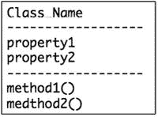

# 4.使用图像上传构建动态图库

你知道如何制作一个简单的动态网站。你知道怎么写表格。你知道如何用`$_GET`或`$_POST`访问 URL 变量。我说是时候好好利用你的新知识了。让我们用一个允许用户上传新图片的表单来构建一个动态图片库。在这个过程中，你会学到不少东西。

*   建立一个动态网站。
*   编写命名函数。
*   使用`$_GET`和`$_POST`超全局数组。
*   用一个`while`循环迭代。
*   使用 PHP 的原生`DirectoryIterator`类。
*   编写自定义对象方法。
*   用 PHP 的`$_FILES`超全局数组上传文件。
*   规划并编写一个易于上传文件的类。

## 建立动态网站

在`XAMPP/htdocs`中为这一章创建一个名为`ch4`的新项目文件夹。从第三章[中复制`templates`和`classes`文件夹以及里面的 PHP 文件。创建新文件夹`css`、`views`和`img`。](03.html)

### 先决条件:一个有一些图像的文件夹

图片库应该有一些图片。此图像库将仅使用 JPEG 图像。为你的图库准备少量 JPEG 图片。将图像保存在`img`文件夹中。

我们坚持使用与前几章相同的站点架构。这将使得重用以前项目中的代码变得更加容易。重用您自己的代码将帮助您更快地开发您的解决方案，这最终将使您成为更有价值的开发人员。

### 创建导航

该网站将有两个主要页面视图:一个用于显示图库，另一个用于显示允许用户上传新图像的表单。因为我们知道我们需要这两个页面视图，所以我们可以准备一个包含两个导航项的站点导航。在`views`文件夹中创建一个新文件，并将其命名为`navigation.php`。

`<?php`

`return "`

`<nav>`

`<a href='index.php?page=gallery'>Gallery</a>`

`<a href='index.php?page=upload'>Upload new image</a>`

`</nav>`

`";`

### 创建两个虚拟页面视图文件

在编写新代码时，从小处着手总是一个好主意。让我们准备两个单独的页面视图:一个用于图库，一个用于上传表单。每个页面视图将从单独的文件中生成和返回。因此，我们在`views`文件夹中创建两个文件。

`<?php`

`//complete source code for views/gallery.php`

`return "<h1>Image Gallery</h1>";`

`<?php`

`//complete source code for views/upload.php`

`return "<h1>Upload new images</h1>";`

您会注意到 PHP 块没有结束分隔符，也就是说，代码中没有`?>`。你可能还记得《T2》第一章中的内容，没有必要结束 PHP 代码块，除非你特别想在你的文件中写一些静态 HTML。只要你只写 PHP，你就不必结束你的 PHP 代码块。另一方面，如果您愿意，您可以用`?>`结束 PHP 代码块。无论如何都没什么区别。

### 创建索引文件

每个网站都应该有一个索引文件。这将是用户唯一会请求的文件，因此，它就像是所有网站内容的大门。让我们创建一个`index.php`文件，并显示一个链接到两个非常简单的页面视图的功能性动态导航。

`<?php`

`//complete code for index.php`

`error_reporting( E_ALL );`

`ini_set( "display_errors", 1 );`

`include_once "classes/Page_Data.class.php";`

`$pageData = new Page_Data();`

`$pageData->title = "Dynamic image gallery";`

`$pageData->content = include_once "views/navigation.php";`

`$userClicked = isset($_GET['page']);`

`if ( $userClicked ) {`

`$fileToLoad = $_GET['page'];`

`} else {`

`$fileToLoad = "gallery";`

`}`

`$pageData->content .=include_once "views/$fileToLoad.php";`

`$page = include_once "templates/page.php";`

`echo $page;`

### 测试时间到了

到目前为止，所有的代码都和我们在前几章所做的一样，所以它应该不会给你带来什么惊喜。总的来说，我们只有不到 20 行代码，但是这足以执行一个初始测试。当你在做代码的时候，建议你写一点代码，测试一下，然后再多写一点。

如果你经常测试你的进度，你就能在错误发生的初期就发现它们。在更少的代码行中更容易发现错误，所以让我们尽可能早地捕捉错误。

初学者可能很难知道什么时候测试以及会遇到什么情况。显然，不太了解 PHP 的初学者将很难预测一段 PHP 代码的行为。学会预测 PHP 代码的行为是很重要的。

学习这项技能的最好方法是发挥你的想象力:在你将`http://localhost/ch4/`载入浏览器之前，试着猜测你会在那里看到什么。试着猜测你的网站在这一点上会有什么表现。

要执行测试，您必须打开您的 XAMPP 管理器并启动 Apache。Apache 运行后，您就可以将`http://localhost/ch4/`加载到浏览器中了。一切如你所料吗？我希望你能看到一个非常基本的网站，动态导航显示两个链接的工作。如果你没有，你应该慢慢地阅读你的代码，寻找任何不合适的地方，例如，拼写错误的变量名。您还可以将您的代码与您以前使用动态导航的项目进行比较。

## 向一个页面添加两个样式表

在开发更大的网站时，使用多个样式表是很常见的。我们可以用如下代码从`index.php`开始做:

`$pageData->css = "<link href='css/layout.css' rel='stylesheet' />";`

`$pageData->css .= "<link href='css/navi.css' rel='stylesheet' />";`

您可能还记得，`$pageData`对象是在包含`templates/page.php`之前在`index.php`中创建的。`$pageData->css`房产在`templates/page.php`使用。本质上，`templates/page.php`就像 HTML5 页面的骨架。通过提供在 HTML5 页面中使用的内容，`$pageData`对象提供了骨骼的所有肌肉。骨骼和肌肉在`index.php`处连接。

上面的代码会工作得很好。但是我想借此机会向您介绍另一个干净代码原则:保持干燥。

### 保持干燥

所有优秀的程序员都试图保持干燥。DRY 是“不要重复自己”的缩写。当你发现自己在写重复的代码时，你应该经常停下来想一想:有没有一种方法可以重新组织这段代码以避免重复？前面的例子重复了生成`<link>`元素的代码。我在这里强调了重复的代码。

`$pageData->css =``"<link href='``css/layout.css`T3】

`$pageData->css .=``"<link href='``css/navi.css`T3】

重复是丑陋的！有更聪明的方法来解决这个代码问题。恰好有一种更聪明的方法涉及到一个非常强大的概念:对象方法。让我们实现一个添加样式表的方法。

### 用方法改进 Page_Data 类

对象方法就像函数一样。最大的区别是方法是在类定义中声明的，通常用于对象属性。这里有一个方法可以让`Page_Data`类在添加样式表时避免重复:

`<?php`

`//complete code listing for classes/Page_Data.class.php`

`class Page_Data {`

`public $title = "";`

`public $content = "";`

`public $css = "";`

`public $embeddedStyle = "";`

`//declare a new method`

`public function addCSS( $href ){`

`$this->css .= "<link href='$href' rel='stylesheet' />";`

`}`

`}`

要添加样式表，您必须生成一个具有唯一的`href`属性的`<link>`元素。要添加另一个样式表，您必须用另一个唯一的`href`属性生成另一个`<link>`元素。这两个`<link>`元素是相同的，除了`href`属性。

对象方法`addCSS()`利用了这一点。该方法需要一个表示`href`属性的参数。每次调用该方法时，都会创建一个新的`<link>`元素。所有创建的`<link>`元素将一起存储在对象的`$css`属性的一个字符串中。

### 是函数还是方法？

您可以看到方法是用关键字`function`声明的。事实上，前面的方法看起来就像您已经编写的一个命名函数。功能和方法几乎相同。唯一的语法区别是方法是在类定义中声明的函数。除此之外，没有明显的区别。

### 这是什么？

当我提到我的个人财产时，我会用“我的”——比如我的头发、身高和体重。my 这个词是一个自我指称。当从类定义内部引用 PHP 对象属性时，必须使用关键字`$this`:这是 PHP 对象用于自我引用的单词。所以，`$this->css`是对象对其`$css`属性的内部引用。

在前面的方法中，可以看到使用`$this`关键字的必要性。没有它，您就不能引用`$css`属性。如果你不能引用`$css`属性，对象就不会记得创建的`<link>`元素。

### 使用新方法

使用`index.php`中的新方法将非常简单。在一个新的`Page_Data`对象被创建之后和最终的`echo`之前，你可以添加两行代码来添加两个样式表到`index.php`页面。

`$pageData->addCSS('css/layout.css');`

`$pageData->addCSS('css/navigation.css');`

您需要两个单独的样式表来测试此时是否一切正常。让我们创建两个非常简单的样式表来测试一些东西。

`/* code listing for css/layout.css */`

`h1{color:red;}`

`/* code listing for css/navigation.css*/`

`nav a{text-decoration: none; color:black}`

`nav a:hover{text-decoration: underline;}`

现在保存您的文件并在浏览器中加载`http://localhost/ch4/index.php`。如果一切正常，所有的`<h1>`元素应该是红色的，导航项目应该是黑色的，并且没有下划线，直到你用鼠标悬停它们。这个设计肯定不好看，但是它展示了新的 object 方法的预期效果。

### 您只能使用声明的方法

PHP 只能按预期使用。您只能使用在类定义中实际声明的方法。在代码示例中，您声明了一个用于添加样式表的方法，因此现在可以添加样式表了。您不能向您的`$pageData`对象添加铅笔。

`//this would trigger an error`

`$pageData->addPencil( "2b" );`

这似乎是一个非常明显的观察，但是重要的是要认识到，对象只有当你在类定义中声明方法时才具有你给它们的行为。如果您试图在一个对象上调用一个方法，而这个对象的类定义中没有声明这个方法，PHP 将显示一个错误消息。

## 准备显示图像的功能

在编辑器中打开`views/gallery.php`文件，并声明一个简短的函数，该函数简单地返回一个 HTML 字符串，该字符串包含一个带有一个`<li>`的`<ul>`。

`<?php`

`//complete source code for views/gallery.php`

`//function call`

`return showImages();`

`//function defintion`

`function showImages(){`

`$out = "<h1>Image Gallery</h1>";`

`$out .= "<ul id='images'>";`

`$out .= "<li>I will soon list all images";`

`$out .= "</ul>";`

`return $out;`

`}`

看看函数`showImages()`中的变量`$out`如何使用增量连接，在几行代码中逐渐获得越来越多的内容。最后，当 HTML 字符串完成时，变量`$out`被返回给调用者。调用者将是你的代码中调用函数`showImages()`的地方，也就是在`views/gallery.php`的开头。

在`views/gallery.php`的开头可以看到一个`return`语句。一旦 HTML 字符串从`showImages()`返回，整个事情就返回到`index.php`，因为`views/gallery.php`是从`index.php`开始包含的。本质上，生成的字符串被返回到`index.php`，在那里它将被添加到`$pageData`对象，与页面模板合并，并回显到浏览器。

### 循环

我希望函数、变量和增量连接慢慢开始对您有意义。是时候关注迭代了:在代码中重复一些东西。让我们从`while`循环开始。`while`只要条件为真，循环将重复相同的代码块。基本语法是

`while ( $condition ) {`

`//repeat stuff here`

`}`

一个`while`循环在语法上非常类似于一个`if`语句。如果条件成立`true`，后续代码块中的代码将重复；它会循环。这里有一个简单的例子来说明这个概念:

`<?php`

`$number = 1;`

`while ( $number < 5 ) {`

`echo "the while loop has concluded $number loops ";`

`$number = $number + 1;`

`}`

如果您要运行这段代码，您将会在浏览器中看到如下四行内容:

`the while loop has concluded 1 loops`

`the while loop has concluded 2 loops`

`the while loop has concluded 3 loops`

`the while loop has concluded 4 loops`

请注意，代码块重复了四次。这是因为括号内声明的条件。它表示只要`$number`小于 5，代码块就将重复。代码块每运行一次，`$number`就加 1。当`while`循环重复四次时，变量`$number`的值为 5。因为 5 不小于 5，所以`while`循环终止，第五行永远不会被回显。

循环非常适合多次重复相同的操作。PHP 中还有其他种类的循环结构。如果您从其他书籍或互联网上查找 PHP 代码，您可能会遇到它们。其他类型的循环都非常类似于`while`循环，尽管语法不同。

### 使用目录运算符在文件夹中查找文件

我们可以使用一个`while`循环为在`img`文件夹中找到的每个`JPEG`文件创建``元素。但是`while`循环不能自己查看文件夹。我们可以使用一个专门为查找文件夹而设计的本地 PHP 对象:它被称为`DirectoryIterator`。

迭代只是“循环”的一个技术术语，就像目录是“文件夹”的一个技术名称一样所以，你可以从它的名字猜测出一个`DirectoryIterator`可以遍历文件夹中的文件。这就是它所做的一切，而且做得非常好。这里有一个一般的例子:

`$filesInFolder = new DirectoryIterator( $folder );`

`$numItemsInFolder = 0;`

`while ( $filesInFolder->valid() ) {`

`$numItemsInFolder = $numItemsInFolder + 1;`

`$filesInFolder->next();`

`}`

`echo "found $numItemsInFolder items in folder named $folder";`

看到`while`循环的条件了吗？你正在调用`DirectoryIterator`对象的方法`valid()`。如果`DirectoryIterator`对象当前指向文件夹中的一个有效项目，它将返回 true。你大概能猜到方法`next()`是做什么的。这将使`DirectoryIterator`指向文件夹中的下一项。

因此，通过将一个`while`循环与`$filesInFolder->valid()`和`$filesInFolder->next()`相结合，您可以构建一个循环，重复一个代码块，重复的次数与文件夹中的项目一样多。前面的代码将做到这一点。

### 显示所有图像

让我们在图库中实现一个类似的代码块。下面是我的最终版本:

`//edit existing function`

`function showImages(){`

`$out = "<h1>Image Gallery</h1>";`

`$out .= "<ul id='images'>";`

`$folder = "img";`

`$filesInFolder = new DirectoryIterator( $folder);`

`while ( $filesInFolder->valid() ) {`

`$file = $filesInFolder->current();`

`$filename = $file->getFilename();`

`$src = "$folder/$filename";`

`$fileInfo = new Finfo( FILEINFO_MIME_TYPE );`

`$mimeType = $fileInfo->file( $src );`

`if ( $mimeType === 'image/jpeg' ) {`

`$out .= "<li></li>";`

`}`

`$filesInFolder->next();`

`}`

`$out .= "</ul>";`

`return $out;`

`}`

如果保存并运行这段代码，您将会看到 PHP 生成了一个包含``元素的列表，显示了文件夹中所有的 JPEG 图像。如果您的文件夹中有两张 JPEG 图像，您将在您的在线画廊中看到这两张图像，如果您有十张 JPEG 图像，您将看到十张图像。这一切都是因为函数`showImages()`而动态发生的。

Note

used `Finfo`对象在 PHP 5.3.0 中是默认启用的，但在某些 PHP 安装中可能被禁用。或者，您可以使用`mime_content_type( $src )`来获取文件的 mime 类型，但是您应该知道`mime_content_type()`已经被弃用了:您不能相信它将来会工作。您可以在该书的配套网站上使用`mime_content_type`()找到源代码。

使用一点 PHP，您可以创建对您的客户更有吸引力的解决方案。想一想保持这个图片库的更新有多容易？您的客户只需在正确的文件夹中多放几张图片，图库就会更新。

## 创建表单视图

你可以写一些 CSS 让画廊更漂亮。我们将会谈到这一点，但首先，我想向您展示如何通过 HTML 表单向图库上传新图像。让我们从显示一个表单开始。从某种意义上说，表单就像站点导航:它是静态 HTML 的一部分，不需要修改。在`views`文件夹中为其创建一个单独的文件。调用文件`upload-form.php`，如下:

`<?php`

`return "`

`Upload new jpg images</h1>`

`<form method='post' action='index.php?page=upload' enctype='multipart/form-data' >`

`<label>Find a jpg image to upload</label>`

`<input type='file' name='image-data' accept='image/jpeg'/>`

`<input type='submit' value='upload' name='new-image' />`

`</form>";`

前面的一些应该看起来很熟悉。我们有一个带有`method`和`action`属性的 HTML 表单。但是这个表单和你之前写的表单有点不一样。

您注意到为表单声明的`enctype`属性了吗？表单使用的默认编码不允许文件上载。我们必须明确声明这个特殊的表单应该使用`multipart/form-data`作为`content-type`，因为这是通过 HTTP 上传文件所必需的。

另一个显著的不同是新的输入属性`type='file'`。它将创建一个文件上传控件，允许用户浏览他们自己的图像文件上传硬盘。还请注意同一个`<input>`元素上的`accept`属性。它实际上声明了唯一可以通过这个表单上传的文件是带有`image/jpeg`的`content-type`的文件。

声明一个`accept`属性对最终用户非常有帮助。当它被声明时，它将缩小用户可以通过表单选择的文件的范围。帮助用户选择具有适当文件类型的文件。你应该知道`accept`属性是不被老版本的浏览器支持的。所以，使用旧浏览器的用户不会得到`accept`属性带来的额外好处。但这不会损害表单的基本功能:无论使用哪种浏览器，所有用户都可以选择上传一个文件。

Note

`accept`属性可以用于任何互联网媒体类型。互联网媒体类型是识别文件类型的标准方式。在 [`http://en.wikipedia.org/wiki/Internet_media_type`](http://en.wikipedia.org/wiki/Internet_media_type) 查看更多互联网媒体类型。

### 显示用于上传图像的表单

要实际显示上传表单，您必须在适当的时候包含 HTML 片段。您希望当用户单击“上传新图像”导航项目时显示表单。因此，要显示表单，您必须更新`views/upload.php`中的代码，如下所示:

`<?php`

`//complete source code for views/upload.php`

`$output = include_once "views/upload-form.php";`

`return $output;`

如果你保存你的工作并在你的浏览器中加载`http://localhost/ch/index.php?page=upload`,你可以看到一个文件上传控件的样子，但是不要期望能够真正上传文件。

Note

文件上传控件在不同的浏览器上会有不同的呈现方式。通常，您会使用一些自定义 CSS 来设计 HTML 元素的外观，但是文件上传控件很难进行样式化。如果你愿意，可以在互联网上搜索解决方案，并准备在多种浏览器和浏览器版本中严格测试你的设计。

### $ _ 文件

当您试图通过 HTML 表单上传文件时，可以通过名为`$_FILES`的 PHP 超全局数组访问文件日期。在实际上传文件之前，让我们看看 PHP 看到了什么。您可以使用`print_r()`来检查`$_FILES`，就像您在上一章中使用它来检查`$_POST`一样。更新`views/upload.php`，如下:

`<?php`

`//complete source code for views/upload.php`

`//$newImageSubmitted is TRUE if form was submitted, otherwise FALSE`

`$newImageSubmitted = isset( $_POST['new-image'] );`

`if ( $newImageSubmitted ) {`

`//this code runs if form was submitted`

`$output = upload();`

`} else {`

`//this runs if form was NOT submitted`

`$output = include_once "views/upload-form.php";`

`}`

`return $output;`

`//declare new function`

`function upload(){`

`$out = "<pre>";`

`$out .=print_r($_FILES, true);`

`$out .= "</pre>";`

`return $out;`

`}`

在`views/upload.php`中声明一个新函数，并在文件顶部添加一个条件语句。HTML `<pre>`元素将保留文本格式，比如制表符。原生 PHP 函数`print_r()`会输出一个数组，这样人眼就能读懂。

这足以让您测试您的上传表单。保存您的工作并在浏览器中运行。通过表单选择某个`.jpg`文件，您应该会看到如下输出。

`Array (`

`[image-data] => Array (`

`[name] => alberte-lea.jpg`

`[type] => image/jpeg`

`[tmp_name] => /Applications/XAMPP/xamppfiles/temp/phpYPcBjK`

`[error] => 0`

`[size] => 119090`

`)`

`)`

从那个输出中，你可以扣除相当多。你可以看到`$_FILES`是一个`array`。在前面的示例中，`$_FILES`有一个索引:`image-data`。需要注意的是，它之所以被称为`image-data`，是因为表单中的文件上传控件元素的`name`属性被设置为`image-data`。

在`$_FILES['image-data']`里面，还有另外一个数组，有五个索引:`name`、`type`、`tmp` _ `name`、`error`、`size. name`、`type`、`size`索引应该是显而易见的，剩下的可能第一次碰到就有点晦涩难懂了。

#### tmp_name

上传表单时，其文件数据将临时存储在 web 服务器的内存中。PHP 可以通过`$_FILES` `['image-data']['tmp_name']`访问临时存储的文件数据。您必须访问文件数据才能将临时文件永久保存在服务器的文件系统上。

#### 错误

上传文件时可能会出错。该图片库运行在安装了 XAMPP 的本地 web 服务器上。您可能遇到的最常见的问题可能是过于严格的文件权限设置。如果您遇到上传错误，您可以检查`$_FILES` `[ ['image-data']['error']`以获得相关的错误代码。可以在 [`www.php.net`](http://www.php.net/) 查阅 PHP 手册。它可以帮助您理解遇到的任何错误代码的含义。在本书的后面，我将向您展示如何以编程方式处理上传错误。

## 用 PHP 上传文件

用 PHP 将文件上传到 web 服务器很简单。您只需访问临时文件数据并永久保存它。在此过程中，您必须指明要保存在哪个文件夹中，以及要另存为什么文件名。有一个本地 PHP 函数可以做到这一点。

`move_uploaded_file( $fileData, $destination );`

该函数有两个参数。第一个是`$fileData`，应该保存有效的文件数据。第二个文件夹`$destination`应该是一个现有的可写文件夹。函数`move_uploaded_file()`返回一个布尔值。如果文件保存成功，它将返回`TRUE`，如果出错，将返回`FALSE`。

### 规划上传者课程

作为一名 PHP 开发人员，在您的一生中，您可能需要多次编写代码来上传文件。以这样一种方式编写一些用于上传的代码是一个好主意，这样您可以在以后的项目中轻松地重用它。对象很容易重用，所以计划一个可以重用的类，通过 PHP 对象上传文件。

#### 用户模式

我喜欢使用简单的 UML 类图来规划类。你可以在图 [4-1](#Fig1) 中看到虚类的基本符号。

图 4-1。

Basic UML diagram

注意类名的命名约定:名字总是以大写字母开头。如果类名是一个复合词，用下划线分隔单词，第二个单词以大写字母开头。

Note

UML 是“统一建模语言”的缩写该语言为记录代码提供了标准语法。UML 不仅仅是这些类图。

#### 上传者类别要求

您知道您将需要保存从表单接收的文件数据。因此，该类需要一个存储文件数据的属性和一个将其保存为文件的方法。您知道文件需要一个名称，所以这个类需要一个`$filename`属性。最后，你知道文件必须保存在某个地方。您需要一个属性来记住保存文件的`$destination`，并且您可以添加一个方法来指定保存位置。了解了这些需求，您就可以开始计划新的类定义了。你可以绘制一个 UML 类图，如图 [4-2](#Fig2) 所示。

图 4-2。

UML diagram of the `Uploader` class

有了计划和 UML 类图，就很容易开始编写类定义。创建一个新文件`classes/Uploader.class.php`，如下所示:

`<?php`

`class Uploader {`

`private $filename;`

`private $fileData;`

`private $destination;`

`public function saveIn( $folder ) {`

`$this->destination = $folder;`

`}`

`public function save(){`

`//no code here yet`

`}`

`}`

前面的代码声明了一个类，该类具有用花括号分隔的类名和类代码块。在该类中，声明了三个属性和两个方法。很容易看出前面的类框架是基于 UML 类图的。

从代码中可以看到，每当调用方法`saveIn`时，属性`destination`就会获得它的值。属性`filename`和`fileData`没有任何值。您可以从超级全局数组`$_FILES`中获得`filename`和`fileData`值。如果每当一个新的`Uploader`对象被创建时，它们就能得到值，那么它们的值就能反映出你想在那时上传的任何文件，这就太好了。

#### `__`构造魔法()

碰巧的是，您可以声明一个只运行一次的方法，无论何时创建一个新的`Uploader`对象。用面向对象的术语来说，这样的方法叫做构造函数。在 PHP 语法中，它被称为`__construct`。这是一种所谓的神奇方法。请注意在方法名前有两个下划线字符。为`Uploader`声明一个构造方法，这样每当创建一个新的`Uploader`对象时，`filename`和`fileData`属性就可以从`$_FILES`中获取它们的值。

`<?php`

`//complete code for classes/Uploader.class.php`

`class Uploader {`

`private $filename;`

`private $fileData;`

`private $destination;`

`//declare a constructor method`

`public function __construct( $key ) {`

`$this->filename = $_FILES[$key]['name'];`

`$this->fileData = $_FILES[$key]['tmp_name'];`

`}`

`public function saveIn( $folder ) {`

`$this->destination = $folder;`

`}`

`public function save(){`

`//no code here yet`

`}`

`}`

还记得您必须知道用于上传文件的`<input type='file'>`元素的`name`属性吗？您需要`name`属性来访问`$_FILES`中的所有文件数据。在前面的代码中，构造函数方法将一个`$key`作为参数。`$key`的值应该与`name`属性的值相同。有了这些，构造函数方法就可以访问上传文件的数据，这些数据只驻留在服务器的内存中，直到被保存。

#### 保存上传的文件

课程即将完成。您只需完成保存新文件的方法。当您在本地 web 服务器上工作时，在执行文件上载时可能会遇到一个常见问题:目标文件夹可能不可写。因为您可以预料到该特定错误，所以您可以在代码中为其做好准备，如下所示:

`//partial code for classes/Uploader.class.php`

`//edit the save method in the Uploader class`

`public function save(){`

`$folderIsWriteAble = is_writable( $this->destination );`

`if( $folderIsWriteAble ){`

`$name = "$this->destination/$this->filename";`

`$succes = move_uploaded_file( $this->fileData, $name );`

`} else {`

`trigger_error("cannot write to $this->destination");`

`$succes = false;`

`}`

`return $succes;`

`}`

通读这段代码，您可能会猜到 PHP 将检查目标文件夹是否可写。如果不是，PHP 将触发一条错误消息，告诉您哪里出错了。换句话说，如果您遇到这个特定的上传错误，PHP 将显示一条错误消息。错误消息是好的；它们帮助您诊断代码中的错误。

### 使用 Uploader 类

您现在可以充分利用`Uploader`类并上传一个文件。在`views/upload.php`中不需要很多代码，因为大多数代码都是在`Uploader`类中编写的。

`//partial code for views/upload.php`

`//edit existing function in views/upload.php`

`function upload(){`

`include_once "classes/Uploader.class.php";`

`//image-data is the name attribute used in <input type='file' />`

`$uploader = new Uploader( "image-data" );`

`$uploader->saveIn("img");`

`$fileUploaded = $uploader->save();`

`if ( $fileUploaded ) {`

`$out = "new file uploaded";`

`} else {`

`$out = "something went wrong";`

`}`

`return $out;`

`}`

这有多酷？你有一个完全动态的图片库，用户可以通过网站上传自己的图片。也许还不完全是这样，但是我希望你会同意你真的开始使用 PHP 来创造一些有趣和有用的东西。

#### 什么会出错？

我在学习在本地 web 服务器上通过 PHP 上传文件的学生中看到的最常见的错误是，目标文件夹的文件权限设置过于严格。如果您遇到这个问题，`Uploader`对象将触发一个 PHP 错误并通知您。解决方案很简单:更改目标文件夹的权限设置，这样每个人都有读/写权限。

另一个常见问题发生在 PHP 通过`$_FILES`找不到任何文件数据的时候。如果在创建一个新的`Uploader`对象时提供了一个错误的`$key`，这种情况就会发生。创建新的`Uploader`对象时，必须向`Uploader`构造函数传递一个参数。该参数必须包含 HTML 表单中文件上传控件的`name`属性。在前面例子中使用的`<form>`中，有一个文件上传控件。

`<input type='file' name='image-data' />`

要上传通过那个`<input>`元素接收的文件，您需要一个知道在哪里寻找比特流的`Uploader`对象。当`Uploader`对象被创建时，您必须将相关的`name`属性值作为参数传递。在这种情况下，您必须使用字符串`image-data`，如下所示:

`$uploader = new Uploader("image-data");`

### 单一责任原则

我希望你惊叹于`Uploader`类定义的美丽。它的设计和编写只有一个目的:上传文件。它有三个属性和两个方法。属性是关于要上传的文件的，方法是关于上传文件的。

单一责任原则是面向对象编程中常用的原则。单一责任原则声明一个类应该为单一的目的而编写。该类的所有属性和方法都应该直接与这个目的相关。这个类应该只有一个改变的理由。

例如:`Uploader`只有一个改变的理由。如果你想用它上传不同的文件，它会改变。单一责任原则是在代码中为之奋斗的美好理想。这又是真正的卷毛定律，只是这一次，应用于面向对象编程。

Note

你可以在 [`http://en.wikipedia.org/wiki/Single_responsibility_principle`](http://en.wikipedia.org/wiki/Single_responsibility_principle) 了解更多关于单一责任原则的内容。

你已经直觉地知道单一责任原则是一个好主意。如果你买了一台多功能厨房实用机器，可以制作咖啡和冰淇淋，烤面包和炸香肠，你会认为它制作的咖啡相当糟糕。事实上，你可以相信它会很糟糕地完成所有的动作。如果你想要很棒的咖啡，你会给自己买一台只有一个目的的机器:咖啡机！

如果你欣赏好咖啡，你可能会想到一些煮不出好咖啡的咖啡机。你正在学习 PHP，这样你就可以计划和构建类来做一件伟大的事情。

## 摘要

在这一章中，你已经看到了如何使用对象和对象方法创建一个动态图库。您已经看到了一个原生 PHP 对象，并学会了使用它的一些方法，但是您还声明了一个带有属性和方法的自定义类定义。您甚至试图使用`while`循环来自动重复代码。

您现在已经编写了两个类定义:`Uploader`和`Page_Data`。我怀疑你没有完全理解类、对象、属性和方法是什么。在本书中，你将接触到更多的类和对象。在接下来的几页中有大量的例子和解释等着你，所以坚持住。学习需要时间，我们才刚刚开始。。。

现在你已经看够了基本的 PHP。随着您对数据库驱动的动态网站越来越熟悉，我们将很快继续探索数据库，并了解您可以在项目中实现的新的可能性。但是首先，我们将进行一次简短而激烈的迂回，涉及一点 JavaScript 和客户端脚本。