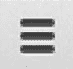

# 五、使用 JavaScript 和 CSS 给你的图片库增添趣味

这一章完全是选读！你可以把它看作是来自 PHP 的一个小弯路的邀请。本章探索了一种将 JavaScript 集成到 PHP 项目中的方法。在这个过程中，你将不得不学习一些 JavaScript 来开发一个交互式图库。你可以探索这条弯路，或者干脆跳过它。

如果你关注任何关于网页设计和网页开发的博客，你一定会遇到一些涉及 JavaScript 的东西。也许你会遇到一些你想在你的 PHP 项目中实现的东西。这并不是一本真正关于 JavaScript 的书，但是我将向您展示一些使用 JavaScript 的例子。我的目标是向您展示一种在 PHP 项目中集成 JavaScript 的方法。如果你真的想学习 JavaScript，你必须参考其他资源。

Note

想了解更多关于浏览器中 JavaScript 的知识？考虑拿一本 Rex van der Spuy 的《HTML5 和 JavaScript 基础游戏设计》(Apress，2012)。您将使用 HTML5、CSS 和 JavaScript 为浏览器构建游戏。这是一种有趣的学习方式！

## 客户端与服务器端编程

PHP 是一种很好的 web 开发语言。它非常受欢迎有很多原因。但是 PHP 只是众多服务器端脚本语言中的一种。服务器端语言只在您的服务器上运行；没有办法在浏览器中执行 PHP 代码。到目前为止，您已经编写了输出 HTML 的 PHP 代码，HTML 被发送到浏览器。

为了更改生成的 HTML 中的任何内容，浏览器必须向服务器发送一个 HTTP 请求，这样 PHP 就可以运行并发回一个 HTTP 响应。但是发送一个 HTTP 请求，等待 PHP 运行，最后接收一个 HTTP 响应需要时间和带宽。

在某些情况下，当系统需要时，简单地运行一些代码会更好。幸运的是，有一种方法:可以使用 JavaScript 在浏览器中以编程方式操作 HTML，JavaScript 恰好是唯一一种在浏览器中本地运行的脚本语言。您可以在服务器端选择许多不同的语言。在客户端，也就是在浏览器中，只有一个:JavaScript。

JavaScript 是一种奇妙的语言，但是不同版本的不同浏览器以不同的方式实现了 JavaScript 的不同部分。因此，在一个浏览器中运行良好的 JavaScript 可能会在另一个浏览器中引发令人尴尬的错误。

处理这些差异的一种常见方法是使用渐进式增强，这基本上意味着您以这样一种方式编写代码，即您漂亮的 JavaScript 只能在完全理解它的浏览器中运行。

JavaScript 的渐进式增强为启用了 JavaScript 的现代浏览器提供了最佳的用户体验。旧浏览器或禁用了 JavaScript 的浏览器仍然可以提供所有内容。额外的 JavaScript 特性应该对不支持的浏览器保持隐藏，这样可以避免 JavaScript 错误。本章介绍的图像库使用渐进式增强。

## 编码灯箱画廊

让我们为图库编写一个所谓的 lightbox，以一种美观的方式呈现图像。灯箱是一种非常常见的显示图像的方式。当用户点击网页上的一个小图片时，JavaScript 会在所有页面内容上放置一个半透明的覆盖层。点击图像的大版本将显示在覆盖图的顶部。

从服务器端的 PHP，您将继续为每个访问浏览器提供所有 JPEG 图像的列表。但是如果用户有一个顶级的浏览器，你可以提供一个更好的解决方案:所有图片的小缩略图，这样用户可以快速浏览整个图库。如果用户点击一个缩略图，你真的可以把焦点放在那个特定的图片上。您可以将所有其他内容隐藏在半透明的覆盖图后面，真正突出显示所选图片。你甚至可以显示点击图像的更大版本:这是一个灯箱画廊。

这就是渐进式改进的意义所在:为所有浏览器提供所有内容，但为有能力的浏览器提供更好的用户体验。我们开始吧！

### 嵌入外部 JavaScript 文件

可以直接在 HTML 中编写 JavaScript 代码，但不推荐这样做。更好的方法是保持 HTML 和 JavaScript 的分离。可以在一个 HTML 文件中嵌入几个 JavaScript 文件，就像可以将多个样式表链接到一个 HTML 文件一样。要将 JavaScript 链接到 HTML 文件，可以使用一个``

属性应该指向一个现有的 JavaScript 文件，所以路径正确是很重要的。您可能想知道为什么`";`

`}`

`public function addCSS( $href ){`

`$this->css .= "<link href='$href' rel='stylesheet' />";`

`}`

`}`

请注意名为`$scriptElements`的新公共属性。它将容纳页面所需的任意数量的`<script>`元素。还要注意公共函数`addScript()`。看看它如何把一个`$src`作为参数。`$src`应该保存一个 JavaScript 文件的路径。接收到的路径将用于创建一个`<script>`元素。创建的`<script>`元素将通过增量连接的方式与任何先前添加的`<script>`元素一起存储。

### 为 JavaScript 文件准备页面模板

您必须更新页面模板文件以接受 JavaScript 的`<script>`元素，就像您更新页面模板以接受 CSS 的`<link>`元素一样。编辑`template/page.php`:

`<?php`

`//complete code listing for templates/page.php`

`return "<!DOCTYPE html>`

`<html>`

`<head>`

`<title>$pageData->title</title>`

`<meta http-equiv='Content-Type' content='text/html;charset=utf-8' />`

`$pageData->css`

`$pageData->embeddedStyle`

`</head>`

`<body>`

`$pageData->content`

`$pageData->scriptElements`

`</body>`

`</html>";`

PHP 将通过`$pageData->scriptElements`的方式嵌入脚本元素。请注意，任何`<script>`元素都将放在页面上任何其他内容之后。这样做的时候，可以确保在 JavaScript 开始执行之前，所有的 HTML 元素都被加载到浏览器内存中。这正是我们想要的！

JavaScript 经常被用来操作 HTML。在我们操作它之前，有必要将 HTML 加载到浏览器内存中。

### 编写和运行外部 JavaScript 文件

我喜欢把我的 JavaScript 文件放在一个指定的文件夹中，以保持一个组织良好的文件结构。我建议你也习惯这样做。创建一个名为`js`的新文件夹。使用您的编辑器创建一个名为`lightbox.js`的新 JavaScript 文件。把它保存在你的`js`文件夹里。

`//complete code listing for js/lightbox.js`

`window.console.log("Hello from Javascript");`

要运行 JavaScript 代码，必须告诉浏览器有一个 JavaScript 要运行。您可以从`index.php`指向一个外部 JavaScript 文件。您将要编写的 JavaScript 将操纵您的 HTML，因此某些属性会动态地改变。

您还需要一个外部样式表。下面是来自`index.php`的一小段代码，展示了如何指向外部样式表以及如何指向外部 JavaScript。这些代码行属于在新的`$pageData`对象被创建之后和生成的`$page`被回显之前的`index.php`:

`//partial code listing for index.php`

`//this line of code you already have. It creates a Page_Data object`

`$pageData = new Page_Data();`

`//new code below`

`//add this new line to embed an external Javascript file to your index.php`

`$pageData->addScript("js/lightbox.js");`

`//no other changes in index.php`

您有一个外部 JavaScript，并且您已经从`index.php`链接到它。您编写的任何 JavaScript 代码现在都应该可以完美运行了。如果你使用 Google Chrome 浏览器或者其他类似 JavaScript 控制台的浏览器，测试起来非常简单。我建议你使用谷歌浏览器，除非你已经习惯了另一个带有 JavaScript 控制台的浏览器。

首先，打开谷歌 Chrome。接下来，通过点击浏览器右上角的打开 Chrome 菜单。选择工具➤ JavaScript 控制台。当控制台打开时，只需在 Chrome 浏览器中加载 http://localhost/ch4/index.php。您应该会在控制台中看到一条消息，如图 [5-1](#Fig1) 所示。

图 5-1。

The JavaScript Console in Google Chrome

### 使用 window.console.log()

如您所见，控制台中的消息与您在 JavaScript 代码中编写的完全相同:

`window.console.log("Hello from Javascript");`

在 JavaScript 中，`window`是一个表示打开的浏览器窗口的对象。在`window`对象中，你可以找到`console`对象。`console`对象有一个在 JavaScript 控制台窗口中输出消息的方法`log()`。记录到控制台通常用于检查一些 JavaScript 是否按预期工作。

在本例中，您使用它来检查 JavaScript 是否运行。如果您在控制台中没有看到消息，那么您知道您的 JavaScript 没有运行。在这种情况下，您可以检查`index.php`的 HTML 源代码，看看是否找到链接到现有 JavaScript 文件的`<script>`元素。也许没有`<script>`元素，或者它的`src`属性没有指向您的 JavaScript 文件。请确保您已经正确完成了前面的所有步骤。

从您编写的这一行 JavaScript 代码中，您可以推断出 JavaScript 类似于 PHP，因为它有对象和方法。您还可以看到 JavaScript 语法有一点不同。JavaScript 的对象操作符是一个`.`，而 PHP 使用的是`->`。如果 JavaScript 具有与 PHP 完全相同的语法，您应该编写以下代码:

`//If Javascript had PHP’s object operator`

`window->console->log("hello");`

我希望你能注意到功能上的相似之处和句法上的不同。JavaScript 在许多方面与 PHP 非常相似，但语法略有不同。在某些方面，JavaScript 和 PHP 确实不同，但那是另一回事了。

### JavaScript 数组

您已经尝试在 PHP 中使用数组:`$_GET`和`$_POST`是超全局数组。让我们仔细看看数组，看看如何在 JavaScript 中使用它们。打开您的`lightbox.js`文件并编写一些 JavaScript，如下所示:

`var pets = new Array("cat", "dog", "canary");`

`var firstPet = pets[0];`

`window.console.log( "The first pet is at index 0\. It is a " + firstPet);`

#### 使用 var 声明变量

首先声明一个变量`pets`并分配它来保存一个新的数组对象。您使用关键字`var`来声明一个 JavaScript 变量。新的数组对象包含一个由三个字符串值组成的列表。这就是数组所能做的:它们可以保存一个项目列表。

为了对数组做任何有意义的事情，你必须能够在正确的时间获得正确的数组项。数组项是根据它们在列表中的位置来记忆的。这种职位的专业术语是`index`。数组中的第一项的`index`为 0，第二项的`index`为 1，依此类推。从数组中获取项的一般语法如下:

`arrayName[index];`

如果您回头看看 pets 示例的代码，您可以看到变量`firstPet`保存了在`pets`数组中的`index` 0 处找到的项目。再说一次，JavaScript 非常类似于 PHP。要从 PHP 数组中获取一个项目，我们可以使用完全相同的语法。

#### 遍历数组项

循环通常与数组一起使用。通过一个简单的`while`循环，您可以遍历数组中的所有元素:

`var pets = new Array("cat", "dog", "canary");`

`var index = 0;`

`while ( index < pets.length ) {`

`window.console.log( pets[index] );`

`index = index + 1;`

`}`

再一次，您可以看到 JavaScript 和 PHP 是非常相似的语言:它们都可以使用`while`循环。前面的循环将遍历`pets`数组中的每一项，并将每一项输出到控制台。

在第一次迭代中，变量`index`将保存值 0，因此，代码输出“cat”，这是在`pets[0]`找到的项目。

`while`循环的条件规定，只要`index`小于`pets`数组的长度，换句话说，只要`index`小于 3，循环就会继续。

在第一次迭代结束时，`index`的值被改变。它开始的值是 0，现在变成了 1，因为`index = 0 + 1`。在下一次迭代中，代码将向控制台输出“dog ”,因为在`pets[1]`找到了`dog`。变量`index`变成 2，循环继续，于是“金丝雀”出现在控制台上。

现在，`index`变为 3，因此`while`循环终止，因为 3 不小于 3。

### 简单渐进增强

在这个 lightbox 脚本中，您希望 JavaScript 为使用新浏览器的用户提供更好的体验。您可以通过响应只有相对较新的浏览器才能理解的事件来做到这一点。您可以在`js/lightbox.js`中这样做，如下所示:

`//complete code for js/lightbox.js`

`function init(){`

`window.console.log("Welcome, user with a new browser");`

`}`

`document.addEventListener("DOMContentLoaded", init, false);`

注意上面代码中使用的`document`对象。`document`是一个本地 JavaScript 对象。浏览器中加载的每个 HTML 网页都有自己的`document`对象。您可以使用`document`对象来检索和操作加载页面中的 HTML 内容。

前面的代码指定在调度事件`DOMContentLoaded`时自动调用函数`init`。当浏览器完成加载 DOM(文档对象模型)时，将调度`DOMContentLoaded`事件。DOM 是页面上 HTML 的表示。只有新浏览器会调度`DOMContentLoaded`事件。因此，您从函数`init()`内部编写或调用的任何 JavaScript 代码只有在用户拥有相对较新的浏览器时才会运行。

#### 使用事件侦听器

事件监听器是 JavaScript 自带的。这是 JavaScript 和 PHP 真正不同的一点，因为 PHP 中没有事件监听器。事件侦听器用于将事件与函数相关联。这个想法是，每次某个事件发生时，应该运行一个特定的函数。添加事件侦听器的一般语法如下:

`object.addEventListener(event, event handler, useCapture);`

如您所见，`addEventListener`有三个参数:一个事件、一个事件处理程序和 useCapture。

##### 事件

第一个参数指定监听哪个事件。不同的对象可以响应不同的事件。在前面的例子中，您正在监听文档对象的`DOMContentLoaded`事件。浏览器将调度该事件，`document`对象可以响应该事件，但前提是您明确告诉它监听该事件。

##### 事件处理程序

第二个参数指定在听到事件时运行哪个函数。`addEventListener`为特定事件注册一个事件处理函数。在您的示例中，您已经注册了函数`init`作为文档对象的`DOMContentLoaded`事件的事件处理程序。

##### 可选的使用捕获

addEventListener 的第三个参数表示一个称为 useCapture 的高级主题。对于大多数现代浏览器，这是一个可选参数，意味着您不必指定它。如果没有明确设置为`true`，大多数浏览器会简单地假设它为`false`。但是有些浏览器和浏览器版本需要设置这个参数，所以你不妨养成设置的习惯。

根据经验，您可以声明第三个参数并将其设置为`false`。你可能会遇到一种特殊的情况，需要你把它设置为`true`，但在本书的代码示例中不会出现。这是一个可以通过参考其他资源自己探索的 JavaScript 主题。

### 为覆盖图和大图像创建标记

您已经为渐进式增强建立了一个非常基本的框架:`init`函数只有在浏览器支持的情况下才会运行。

是时候开始使用 lightbox 画廊了。首先添加一些 JavaScript 来动态创建一个小 HTML，为在透明覆盖层上显示大图像提供标记结构。您必须更新`js/lightbox.js`中的`init()`功能，如下所示:

`//edit existing function`

`function init() {`

`var lightboxElements = "
";`

`lightboxElements += "

";`

`lightboxElements += "";`

`lightboxElements += "
";`

`document.querySelector("body").innerHTML += lightboxElements;`

`}`

这段代码将创建一串 HTML 元素，并将它们添加到已经在`<body>`中找到的 HTML 元素之后。请特别注意``元素。它缺少一个`src`属性，所以此时它不显示图片。如果保存您的工作并在浏览器中加载 http://localhost/ch4，您可能会惊讶地发现，尽管您尽了所有的 JavaScript 努力，似乎什么都没有改变。如果您的 JavaScript 工作正常，您应该有一个页面，并在末尾添加一些 HTML 元素。但是它们不包含任何内容，所以您什么也看不到——到目前为止！

在前面的代码示例中，您可以看到 JavaScript 可以像 PHP 一样连接字符串。请注意，JavaScript 的增量连接运算符不同于 PHP。这是功能相同，语法不同的另一种情况。

`//Javascript's incremental concatenation operator`

`+=`

`//PHP's incremental concatenation operator`

`.=`

#### document.querySelector()

函数中的最后一行看起来好像没有你在书中用过的东西。`querySelector()`是`document`对象的一个方法。如果你熟悉 CSS 选择器，这绝对是一个非常好的方法。通过`querySelector()`，您可以使用 CSS 选择器语法从加载的页面中选择 HTML 元素。

`document.querySelector("body").innerHTML += lightboxElements;`

前面一行使用`querySelector`来获取`<body>`元素及其所有内容。JavaScript 将存储在变量`lightboxElements`中的 HTML 字符串添加到`<body>`中的现有内容之后。要访问`<body>`中的 HTML 内容，可以使用`innerHTML`属性。

### 显示覆盖图

我认为用 JavaScript 创建一个`
`元素是非常值得的。但是如果你能看到它作为一个覆盖层工作，那就更有价值了。您可以通过在现有的样式表中添加一点 CSS 来实现这一点。我把我的放在`css/layout.css`里。

`/*declare a new style rule in css/layout.css */`

`div#overlay{`

`position: absolute;`

`width: 100%;`

`height:100%;`

`top:0px;`

`left:0px;`

`background:black;`

`opacity: 0.85;`

`}`

如果保存该文件并在浏览器中重新加载 http://localhost/ch4，应该会看到一个半透明的覆盖图，覆盖了浏览器视窗中所有可见的内容。如果向下滚动，可以看到覆盖图只覆盖了视窗，而不是整个页面内容。这是应该的。看到这个覆盖图是 JavaScript 代码正在做一些事情的视觉确认。但是您只希望当用户单击特定图像时显示覆盖图。此外，您可能希望被单击的图像显示在覆盖图的顶部。你还有一些工作要做。

### 隐藏覆盖图并调整缩略图大小

默认情况下，您会希望图像显示为小缩略图。当一个缩略图被点击时，覆盖图应该出现以隐藏其他缩略图，并且被点击的图像应该几乎全屏显示。要实现这一点，你需要 CSS 和 JavaScript。您可以从准备一些 CSS 规则开始，稍后您可以通过 JavaScript 使用这些规则。在`css/layout.css`中，你的样式表还有一些规则:

`/*hide overlay and big-image*/`

`div#overlay.hidden, img#big-image.hidden{ opacity: 0; left:-200%; }`

`/*resize images and display them as a horisontal list*/`

`li.lightbox img{ height: 100px; }`

`li.lightbox{ display: inline-block; margin: 10px; }`

如果刷新浏览器，可以看到覆盖图被隐藏了。您还可以看到，尽管使用了 CSS，缩略图仍未调整大小。不要太惊讶。原因很简单，因为`<li>`元素还没有设置为`lightbox`的`class`属性。您将使用 JavaScript 动态设置`class`。但是在编写更多的 JavaScript 之前，我想让你看看隐藏图像和覆盖的 CSS。您可以看到，这两个元素都被设计为完全透明，并且位于左侧很远的位置，即使它们不是完全透明的，它们也是不可见的。请记住，重要的是覆盖图和大图都有一个设置为`hidden`的`class`属性。如果类未设置为`hidden`，两个元素都将显示。

默认情况下，没有属性设置为`lightbox`的`<li>`元素。所以，上面写的 CSS 规则目前不适用于任何东西。您可以通过编写一些 JavaScript 来声明一个`class`属性，并在用于图库图像的所有`<li>`元素上将该属性的值设置为`lightbox`,但只针对有能力的浏览器。更新`js/lightbox.js`如下:

`//complete code listing for js/lightbox.js`

`//edit existing function`

`function init(){`

`var lightboxElements = "
";`

`lightboxElements += "

";`

`lightboxElements += "";`

`lightboxElements += "
";`

`document.querySelector("body").innerHTML += lightboxElements;`

`//add a new function call here`

`prepareThumbs();`

`}`

`//declare a new function`

`function toggle(){`

`window.console.log("show or hide a big image");`

`}`

`//declare new function`

`function prepareThumbs() {`

`var liElements = document.querySelectorAll("ul#images li");`

`var i = 0;`

`var image, li;`

`//loop through all <li> elements`

`while ( i < liElements.length ) {`

`li = liElements[i];`

`//set class='lightbox'`

`li.setAttribute("class", "lightbox");`

`image = li.querySelector("img");`

`//register a click event handler for the  elements`

`image.addEventListener("click", toggle, false);`

`i += 1;`

`}`

`}`

`document.addEventListener("DOMContentLoaded", init, false);`

保存此代码并刷新浏览器。您应该会看到小缩略图的水平列表。当您单击一个图像时，您应该会在控制台窗口中看到一条消息，提示“显示或隐藏大图像”

这是一个步骤中的一大块代码。让我们调查一下，弄清楚到底发生了什么。

#### 仅向支持的浏览器显示缩略图

JavaScript 使用渐进式增强，并有效地隐藏了浏览器可能无法理解的 JavaScript 特性。还记得函数`init()`如何只在浏览器调度`DOMContentLoaded`事件时运行吗？只有相对较新的浏览器才会调度该事件。如前所述，当给定页面的所有 HTML 元素都加载到浏览器的内存中时，它就会被调度。

函数`prepareThumbs()`是从函数`init()`内部调用的，所以`prepareThumbs()`只能在新的浏览器中运行。您已经有效地隐藏了旧浏览器中的 JavaScript:您拥有渐进式改进！

#### 用 querySelectorAll()获取 HTML 元素的数组

接下来，看看如何将`class`属性添加到图库的所有`<li>`元素上。第一个任务是选择所有的`<li>`元素。您已经为该任务使用了方法`querySelectorAll()`。`querySelectorAll()`就像`querySelector()`，除了它返回的不仅仅是一个 HTML 元素，而是匹配所用 CSS 选择器的所有 HTML 元素。

`var liElements = document.querySelectorAll("ul#images li");`

在前一行中，变量`liElements`将保存在`<ul>`中找到的所有`<li>`元素的数组，并将`id`属性设置为`images`。

Note

你可以在 [`www.kirupa.com/html5/finding_elements_dom_using_querySelector.htm`](http://www.kirupa.com/html5/finding_elements_dom_using_querySelector.htm) 了解更多关于使用`querySelector()`和`querySelectorAll()`的信息。

您已经看到了如何遍历一组宠物。遍历 HTML 元素的数组就是这样。在`prepareThumbs()`内部，可以看到一个`while`循环。只要变量`i`保存的值小于找到的`<li>`元素的数量，它就会一直循环下去。这实际上意味着您将使用图像的`id`属性遍历`<ul>`元素中的每个`<li>`项目。

变量`i`可以用作索引，从所有`<li>`元素的数组中获取一个特定的`<li>`元素。每一个`<li>`都会被记忆在变量`li`中，每一个`<li>`都会得到一个`lightbox`的`class`属性。此类`<li>`元素有一个 CSS 规则，这就是为什么缩略图在浏览器中显示为水平列表。还有另一个 CSS 规则在这样的`<li>`元素中选择``元素。该规则将缩略图的宽度调整为 100 像素。

仍然在`while`循环中，使用`querySelector()`选择`<li>`元素中的``元素。您为每个``元素分配一个事件监听器。所以，每当用户点击一个``，函数`toggle()`就会被调用。换句话说，您为每个``元素注册了一个名为`toggle()`的事件处理函数。

### 显示大图像

每当用户点击一个``元素，函数`toggle()`就会运行。在这一点上，它没有多大作用。它只是在控制台窗口中输出一条消息。你在寻找一种不同的行为。如果单击了缩略图，您希望透明覆盖图隐藏所有缩略图，并且您希望显示所单击图像的大版本。如果单击一个大图像，您希望覆盖图和大图像消失，这样所有缩略图再次变得清晰可见。您将需要一个 CSS 规则来设计大图像的样式，还需要一些 JavaScript 来操作 HTML 类属性。你可以从 CSS 开始。给`css/layout.css`再加一条规则:

`/*partial code listing for css/layout.css*/`

`/*new CSS rule for showing the big-image*/`

`#big-image.showing{`

`max-width: 80%;`

`max-height:90%;`

`position:absolute;`

`background-color: white;`

`padding: 10px;`

`top:5%;`

`left: 10%;`

`}`

要在浏览器中看到一些动作，您还必须向 js/lightbox.js 中声明的`toggle()`函数添加一些代码，如下所示:

`//edit existing function`

`function toggle( event ){`

`//which image was clicked`

`var clickedImage = event.target;`

`var bigImage = document.querySelector("#big-image");`

`var overlay = document.querySelector("#overlay");`

`bigImage.src = clickedImage.src;`

`//if overlay is hidden, we can assume the big image is hidden`

`if ( overlay.getAttribute("class") === "hidden" ) {`

`overlay.setAttribute("class", "showing");`

`bigImage.setAttribute("class", "showing");`

`} else {`

`overlay.setAttribute("class", "hidden");`

`bigImage.setAttribute("class", "hidden");`

`}`

`}`

您可以看到 JavaScript 并没有真正显示或隐藏大图像或覆盖图。JavaScript 所做的只是操纵`#overlay`和`#big-image`的类属性。你可以在你的浏览器中检查覆盖和图像实际上是隐藏的。如果您单击缩略图，覆盖图将出现在缩略图的顶部，大图像将出现在覆盖图的顶部。

这种效果是通过联合 CSS 和 JavaScript 实现的。在 CSS 中，规则规定了如何呈现`#overlay`和`#big-image`。如果这些元素上的`class`被设置为`hidden`，它们将被隐藏。如果没有设置`class hidden`，将显示元素。JavaScript 动态操纵`class`属性。CSS 声明如何呈现`#big-image`和`#overlay`，这取决于`class`属性的当前值。

JavaScript 有一个非常简单的工作:它只负责在覆盖图和大图像上设置`class`属性。如果`class`属性当前被设置为`hidden`，它将被更改为`showing`。否则，如果类别未设置为`hidden`，则会设置为`hidden`。

让我们更详细地检查一下`toggle`中的代码，以便更好地理解它和 JavaScript。

#### 使用 MouseEvent 对象

首先要注意的是添加到`toggle()`函数中的`event`参数。函数`toggle()`被调用，因为它被注册为``元素上点击事件的事件处理程序。它是从事件侦听器中调用的。当这种情况发生时，一个`Event`对象在事件被触发时被传递。当用户点击鼠标按钮时，点击被触发，因此，被发送的`Event`对象是一个`MouseEvent`对象。

事件对象有很多非常有用的属性，可以在代码中使用。`MouseEvent`对象有一个`target`属性，它保存了对被点击的 HTML 元素的引用。

Note

如果在 toggle()函数中添加以下代码行，您可以在控制台窗口中看到其他可用的属性:`window.console.log(event);`。

您使用`MouseEvent.target`属性来获取被点击的``元素。您可以用它来替换大图片的`src`属性和被点击图片的`src`属性。本质上，您使用它来显示单击缩略图的大版本，如以下代码所示:

`bigImage.src = clickedImage.src;`

#### 棒形纽扣

toggle 的意思是在两种状态之间转换。当你开灯的时候，你拨动灯的开关，当你关掉灯的时候，你拨动同样的灯的开关。在这段 JavaScript 中，您想要切换覆盖图和大图像。

如果覆盖元素的`class`属性被设置为`hidden`，您想要隐藏覆盖和大图像。如果覆盖图的`class`属性设置为`showing`，您希望显示覆盖图和大图。如果你查看`toggle`函数，你可以看到用代码表达的同样的想法。

`if ( overlay.getAttribute("class") === "hidden" ) {`

`//code to show overlay and image`

`} else {`

`//code to hide overlay and image`

`}`

#### 操纵属性

要读取`class`属性的值，可以使用`getAttribute()`方法。这是所有 HTML 对象都有的标准 JavaScript 方法。`getAttribute()`方法可以用来读取任何属性的值。一般语法如下:

`element.getAttribute( whichAttribute );`

`getAttribute()`方法将返回在指定元素中找到的请求属性的值。有一个类似的方法，叫做`setAttribute()`，用于改变属性值。一般语法如下:

`element.setAttribute( whichAttribute, newValue );`

方法可以为特定 HTML 元素的指定属性设置一个新值。在前面的`toggle()`函数中，您使用它来更改覆盖图和大图像的属性值。

### 隐藏大图像

此时，您可以单击缩略图来显示覆盖图和大图。太棒了。但是你不能再隐藏覆盖图或大图了，这不是很好。要启用隐藏，只需将`toggle()`函数注册为单击大图像时触发的事件处理程序。这可以通过`init()`函数中的以下(粗体)两行额外代码来完成:

`//edit existing function`

`function init(){`

`var lightboxElements = "
";`

`lightboxElements += "

";`

`lightboxElements += "";`

`lightboxElements += "
";`

`document.querySelector("body").innerHTML += lightboxElements;`

`//new code: register toggle as event handler`

`var bigImage = document.querySelector("#big-image")`

`bigImage.addEventListener("click",toggle, false);`

`//end of changes`

`prepareThumbs();`

`}`

自己测试一下。在这一点上，你应该能够点击一个缩略图来显示覆盖图顶部的大图像。如果你点击大图，大图和覆盖图将再次隐藏，从而显示下面的缩略图。

### 使用 CSS 动画

如果半透明覆盖可以淡入隐藏缩略图，那不是很好吗？这可能是使灯箱画廊更加漂亮的最后一笔。您可以通过在`css/layout.css`中添加以下(粗体)单行 CSS 来创建 CSS 动画:

`#overlay{`

`position: absolute;`

`width: 100%;`

`height:100%;`

`top:0px;`

`background:black;`

`opacity: 0.85;`

`left:0px;`

`/*this is the animation to fade the overlay in gradually over 1 second*/`

`transition: opacity 1s ease-in;`

`}`

### 编码挑战

灯箱画廊现在完成了。如果您浏览互联网，可以很容易地找到更多 JavaScript 驱动的图片库的例子。也许你会遇到一个你想在画廊里实施的行为。

一个非常常见的功能是在显示大图时单击覆盖图。大多数图库会在点击覆盖图时切换。这并不难实现，所以也许这是一个你可以自己解决的任务。您只需将`toggle`注册为覆盖图中检测到的点击事件的事件处理程序。这种方法是可行的，但会触发一个 JavaScript 错误。您可以在控制台中看到错误消息。对您来说，一个额外的编码挑战可能是找出错误消息的含义，以及如何更改代码以避免错误。

你可以在 [`www.webmonkey.com/2010/02/make_a_javascript_slideshow/`](http://www.webmonkey.com/2010/02/make_a_javascript_slideshow/) 找到另一个 JavaScript 库的教程，有下一个和上一个按钮。也许你可以弄清楚如何在你的 lightbox gallery 中实现这样的按钮。这可能是一个有趣的学习经历，也是你的灯箱画廊的一个很好的补充。

## 摘要

你已经在相对较少的几页中涵盖了很多内容。主要目标是为您提供一种在 PHP 项目中集成 JavaScript 解决方案的方法。在这个过程中，您使用了一个相对简单的 lightbox image gallery。

您已经看到 PHP 和 JavaScript 语言在许多方面都很相似。通常，只是语法不同，有时甚至不是这样。这对你来说是个好消息。一旦你学会了 PHP，你就可以相对容易地学习 JavaScript。

另一方面，您也看到了 JavaScript 和 PHP 之间的显著差异。要真正精通这两种语言，你最终会想要密切关注这些差异。

也许最重要的区别是 JavaScript 是一种客户端脚本语言，而 PHP 是一种服务器端脚本语言。您的 JavaScript 代码在用户的浏览器中运行。PHP 只在你的服务器上运行，所以浏览器永远看不到你的 PHP。浏览器只会得到 PHP 创建的结果。

Note

实际上，JavaScript 可以在服务器上运行。在互联网上搜索`node.js`以了解更多信息。此外，PHP 可以在没有 web 服务器的情况下运行。但是 JavaScript 多用于客户端，PHP 多用于服务器端。

到目前为止，您已经看到当 PHP 完成它的任务时，它将创建一个输出。输出通常是发送到浏览器的 HTML 文件。JavaScript 可以在浏览器中操作 HTML，而不需要联系服务器。您最终可能会想要学习更多的 JavaScript，但是这超出了本书的范围。