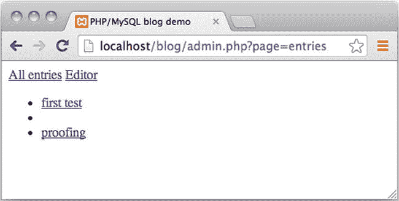

# 9.删除和更新条目

事情将会是这样的:一个章节将会以某种方式改善你的博客的公众形象，下一个章节将会集中在改善秘密博客管理模块上，他们将会像那样保持交替。本章着重于改进秘密博客管理模块。

让我们继续沿着对象和类的模型-视图-控制器(MVC)路径。管理模块的第二次迭代将向您展示如何通过条目编辑器更新和删除现有条目。在改进条目管理器的过程中，您将学习如何编写小型的非正式代码测试。这些测试旨在强调开发博客的实验过程，而不仅仅是向你展示一个博客的完整代码。如果您将测试集成到开发过程中，您将提高整体代码质量并减少调试时间。

在这一章中，你还将学习如何创建 HTML 表单，将变化传达给用户。此外，您还将重温 JavaScript 渐进增强的思想。阅读本章可能会稍微改变你的视角:你不再仅仅关注你的代码是如何工作的。你将开始关注如何使用代码来设计一个为你的用户工作的系统。

## 创建管理链接的模型

看看你现有的编辑器在 http://localhost/blog/admin . PHP？page =编辑器。您可以清楚地看到，已经有按钮可用于保存或删除现有条目。还可以看到少了点什么。您应该单击哪里将现有条目加载到条目编辑器中，以便编辑或删除它？

我相信你能想出许多聪明的方法来完成这项任务。我建议采用一种与您刚刚在博客上所做的非常相似的方法:我建议您向管理员显示所有条目的列表。单击一个条目应该会将其加载到条目编辑器中。我采用这种方法的主要动机是它与你已经为博客条目所做的相似。再做一遍会给你一个很好的学习循环。根据我当老师的经验，重复是必不可少的——尤其是对初学者来说。

另一个优点是在`Blog_Entry_Table`类中已经有了一个`getAllEntries()`方法。您可以重用现有的方法。所以，你已经处理了模型。为了确保您可以从控制器访问条目数据，您可以编写一点代码来测试这个假设。在你的代码编辑器中打开`controllers/admin/entries.php`,然后完全重写，如下所示:

`<?php`

`//complete code for controller/admin/entries.php`

`include_once "models/Blog_Entry_Table.class.php";`

`$entryTable = new Blog_Entry_Table( $db );`

`//get a PDOStatement object to get access to all entries`

`$allEntries = $entryTable->getAllEntries();`

`//test that you can get the first row as a StdClass object`

`$oneEntry = $allEntries->fetchObject();`

`//prepare test output`

`$testOutput = print_r( $oneEntry, true );`

`//return test output to front controller, to admin.php`

`return "<pre>$testOutput</pre>";`

如果一切正常，当您加载 http://localhost/blog/admin . PHP 时，应该会看到一个条目的`StdClass`表示。page =浏览器中的条目。输出应该如下所示:

`stdClass Object (`

`[entry_id] => 1`

`[title] => Testing title`

`[intro] => bla bla`

`)`

这个小测试证实了条目控制器确实可以访问条目数据。您可以在浏览器中看到第一个条目的内容。

您可以从前面的输出中学到一些东西。您可以看到您的`$testOutput`变量保存了一个类型为`StdClass`的对象。你可以看到它有三个属性，叫做`entry_id`、`title`和`intro`。您甚至可以看到这三个属性的值。

你必须学会理解 PHP 的行为。当您构建自己的 web 应用时，理解您使用的 PHP 代码尤为重要。这是一个好机会。您可以看看产生这个输出的 PHP 代码。看看您是否能够通过代码工作，并理解创建前面的输出所涉及的每个小过程。这里有三个问题可以指导你:

*   输出如何从`controllers/admin/entries.php`到达`admin.php`，在那里你的浏览器可以看到它？
*   为什么有三个属性？为什么不是一个或四个或其他数字？
*   `fetchObject()`方法是做什么的？

花点时间研究这些问题，找到自己的答案。一旦你真正理解了这些问题的答案，你就能更好地开始开发你自己的 PHP/MySQL 项目。

### 显示管理链接

随着模型的尝试、测试和理解，您可以开始处理视图了。你需要的是一个可点击的博客条目标题列表。这意味着您必须遍历数据库中找到的所有条目。

你可以采取一种和你在博客上采取的方法非常相似的方法。您可以使用一个`while`循环，通过一个`PDOStatement`对象遍历数据库记录。数据库表中的每一行数据都将由一个单独的`<li>`元素表示。

您可以将单个博客标题包装在`<a>`元素中，以创建一个可点击的条目列表。在`views/admin/entries-html.php`中创建一个新文件，如下:

`<?php`

`//complete code for views/admin/entries-html.php`

`if( isset( $allEntries ) === false ) {`

`trigger_error('views/admin/entries-html.php needs $allEntries');`

`}`

`$entriesAsHTML = "<ul>";`

`while ( $entry = $allEntries->fetchObject() ) {`

`//notice two URL variables are encoded in the href`

`$href = "admin.php?page=editor&amp;id=$entry->entry_id";`

`$entriesAsHTML .= "<li><a href='$href'>$entry->title</a></li>";`

`}`

`$entriesAsHTML .= "</ul>";`

`return $entriesAsHTML;`

仔细看看生成的`href`值。点击一个条目会请求一个类似`admin.php?page=editor&id=2`的 URL。这样，编辑器控制器将可以访问被点击条目的`entry_id`。

可以看到这段代码和`views/list-entries-html.php`中的非常相似。实际上，这也许太相似了。如果您要重构博客代码，这将是重构的一个候选。有人可能会说你没有违反卷毛定律，但你确实进入了一个灰色地带。您可以重构代码，使用相同的视图文件以稍微不同的方式列出所有条目。另一方面，这种解决方案会导致代码更加复杂。我喜欢让我的观点尽可能简单。因此，我建议您保持这段代码不变，因为它是可行的，并且不会过于复杂。

我想让你明白，组织你的代码没有正确或错误的解决方案。你可以用许多不同的方法来写一个任务的解决方案。您决定如何组织您的代码取决于您如何考虑您的代码。在前一种情况下，我必须在简短、抽象的代码或重复、简单的代码之间做出选择。比起较长的代码，我更喜欢较短的代码，但比起抽象代码，我也更喜欢简单的代码。在这个例子中，我决定支持简单代码而不是短代码。

要显示新视图，您必须更新 entries 控制器，以便它加载视图。现在，`controllers/admin/entries.php`中的代码输出一个`StdClass`对象。您这样做是为了测试相关的模型代码是否如预期的那样工作。您可以完全删除 entries 控制器中的测试代码，以便它返回您新创建的视图。更新`controllers/admin/entries.php`中的代码，如下所示:

`<?php`

`//complete code for controller/admin/entries.php`

`include_once "models/Blog_Entry_Table.class.php";`

`$entryTable = new Blog_Entry_Table( $db );`

`$allEntries = $entryTable->getAllEntries();`

`$entriesAsHTML = include_once "views/admin/entries-html.php";`

`return $entriesAsHTML;`

您现在可以测试您的代码了。加载 http://localhost/blog/admin . PHP？page=entries，您应该会看到一个格式良好的可点击博客条目标题列表。如果单击标题，将显示空条目编辑器。您可以更改这一点，这样条目编辑器将加载编辑器内显示的被点击的博客条目的内容。

### 用要编辑的条目填充表单

有时，条目编辑器表单应该显示空白字段，以便您可以创建新条目。在其他时候，编辑器应该显示一个现有的条目，以便可以对其进行编辑。用户应该点击一个博客标题，将它加载到编辑器中。

单击这样的博客标题会将条目的`entry_id`作为 URL 变量编码到 HTTP 请求中。因此，如果条目的`entry_id`可以作为 URL 变量使用，那么您应该将相应的条目加载到编辑器中。如果没有找到这样的 URL 变量，您应该显示一个空白编辑器。

您可以通过在编辑器视图中添加一些占位符来实现这一点。如果视图找到条目的数据，它应该显示它；否则，它应该显示空的编辑器字段。下面是更新后的`views/admin/editor-html.php`:

`<?php`

`//complete code for views/admin/editor-html.php`

`//new code added here`

`//check if required data is available`

`$entryDataFound = isset( $entryData );`

`if( $entryDataFound === false ){`

`//default values for an empty editor`

`$entryData = new StdClass();`

`$entryData->entry_id = 0;`

`$entryData->title = "";`

`$entryData->entry_text = "";`

`}`

`//changes in existing code below`

`//notice object properties used in <input> and <textarea>`

`return "`

`<form method='post' action='admin.php?page=editor' id='editor'>`

`<input type='hidden' name='id' value='$entryData->entry_id' />`

`<fieldset>`

`<legend>New Entry Submission</legend>`

`<label>Title</label>`

`<input type='text' name='title' maxlength='150'`

`value='$entryData->title' />`

`<label>Entry</label>`

`<textarea name='entry'>$entryData->entry_text</textarea>`

`<fieldset id='editor-buttons'>`

`<input type='submit' name='action' value='save' />`

`<input type='submit' name='action' value='delete' />`

`</fieldset>`

`</fieldset>`

`</form>";`

这里要注意的主要原则是使用对象属性作为内容占位符。例如:PHP 在`$entryData->entry_text`中找到的任何数据都将显示在`<teaxtarea>`元素中。如果`$entryData->entry_text`是一个空字符串，那么`<textarea>`将为空。另一方面，如果`$entryData->entry_text`持有来自数据库的数据，则`<textarea>`将显示来自数据库的内容。

您可以在编辑器视图中看到一个新的`<input>`类型。有一个隐藏的输入。用户看不到隐藏的输入。您可以使用它来存储正确处理提交的表单输入所需的值。该隐藏输入将存储当前显示的条目的`entry_id`，如果编辑器字段为空，则为 0。

用现有条目填充空编辑器的最后一步是获取被点击条目的内容。您已经在您的`Blog_Entry_Table`类中声明了一个`getEntry()`方法。您可以在编辑器控制器中使用它。更新`controllers/admin/editor.php`中的代码，如下所示:

`//partial code for controllers/admin/editor.php`

`//add this code near the end of the script`

`//in my example this is line 21`

`//introduce a new variable: get entry id from URL`

`$entryRequested = isset( $_GET['id'] );`

`//create a new if-statement`

`if ( $entryRequested ) {`

`$id = $_GET['id'];`

`//load model of existing entry`

`$entryData = $entryTable->getEntry( $id );`

`$entryData->entry_id = $id;`

`}`

`//no new code below`

`$editorOutput = include_once "views/admin/editor-html.php";`

`return $editorOutput;`

您可以从您的数据库中获取条目数据，因为您已经将它的`entry_id`作为一个 URL 变量。因为您有一个`entry_id`，所以您可以获得该特定博客条目的所有内容。你自己看吧。保存工作，将浏览器指向 http://localhost/blog/admin . PHP？页面=条目。单击一个标题可以看到编辑器中填充了被单击条目的`title`和`entry_text`。

编辑器还不太完善。您可以在编辑器中看到任何现有条目，但不能保存任何更改。如果您单击 Save 按钮，您可以看到一个新条目将被插入，即使您试图编辑一个现有的条目。您的编辑器还不能编辑现有条目，也不能删除现有条目。删除非常容易，所以让我们先实现它。

### 处理条目删除

显然，应该可以删除条目。这是一个非常简单的操作，也是一个很好的起点。您将需要对编辑器的模型和控制器进行一些更改。

该模型应该有一些代码来从数据库中实际删除条目数据。该视图已经有一个删除按钮，所以这里不需要做任何更改。必须更新控制器，以便它在用户单击删除时做出反应。

### 从数据库中删除条目

要从数据库的`blog_entry`表中删除一行数据，您将需要 SQL。您还需要`PDO`为您的 SQL 准备一个`PDOStatement`。执行`PDOStatement`应删除已识别的条目。花一分钟思考一下。您应该在哪里编写删除条目的代码？

要删除一个条目，您需要 PHP 操作`blog_entry`数据库表。您已经有了一个表数据网关对象，您的`Blog_Entry_Table`对象。表数据网关的目的是提供对给定表的单点访问。每当您想要访问该表时，应该使用相关表数据网关对象。因此，删除`blog_entry`表中条目的 PHP 代码属于您的`Blog_Entry_Table`。您可以通过在`models/Blog_Entry_Table.class.php`中声明一个新方法来实现它，如下所示:

`//partial code for models/Blog_Entry_Table.class.php`

`//declare a new method inside the Blog_Entry_Table class`

`public function deleteEntry ( $id ) {`

`$sql = "DELETE FROM blog_entry WHERE entry_id = ?";`

`$data = array( $id );`

`$statement = $this->makeStatement( $sql, $data );`

`}`

从数据库中删除数据是最后的操作；无法撤销！重要的是，千万不要不小心删除了不该删除的内容。幸运的是，您的数据库表设计得当:每条记录都有一个主键。这意味着如果你有一个条目的主键，每一条记录都可以被唯一地标识。由此可见，您可以通过`entry_id`安全地删除`blog_entry`，因为您可以信任要删除的正确条目。这里不会出现数据意外丢失的情况！

### 响应删除请求

编辑器模型准备好删除条目后，是时候用代码更新控制器了，以确定是否单击了 delete 按钮。如果单击了 Delete 按钮，控制器应该调用模型来删除相关条目。如何知道删除按钮是否被点击了？看看编辑器表单的 HTML:

`//partial code for views/admin/editor-html.php`

`//two buttons, one name, different values`

`<fieldset id='editor-buttons'>`

`<input type='submit' name='action' value='save' />`

`<input type='submit' name='action' value='delete' />`

`</fieldset>`

单击编辑器表单中的任何提交按钮都会对一个名为`action`的 URL 变量进行编码。如果您点击了保存按钮，那么`action`的值为`save`，如果您点击了删除按钮，那么`delete`的值为。URL 变量`action`的值可以告诉你用户点击了哪个按钮。更新`controllers/admin/editor.php`中的代码，如下所示:

`<?php`

`//complete code for controllers/admin/editor.php`

`include_once "models/Blog_Entry_Table.class.php";`

`$entryTable = new Blog_Entry_Table( $db );`

`$editorSubmitted = isset( $_POST['action'] );`

`if ( $editorSubmitted ) {`

`$buttonClicked = $_POST['action'];`

`$insertNewEntry = ( $buttonClicked === 'save' );`

`// new code: was "delete" button clicked`

`$deleteEntry = ( $buttonClicked === 'delete' );`

`//new code: get the entry id from the hidden input in editor form`

`$id = $_POST['id'];`

`if ( $insertNewEntry ) {`

`$title = $_POST['title'];`

`$entry = $_POST['entry'];`

`$entryTable->saveEntry( $title, $entry );`

`//new code here`

`} else if ( $deleteEntry ) {`

`$entryTable->deleteEntry( $id );`

`}`

`//end of new code. No changes below`

`}`

`$entryRequested = isset( $_GET['id'] );`

`if ( $entryRequested ) {`

`$id = $_GET['id'];`

`$entryData = $entryTable->getEntry( $id );`

`$entryData->entry_id = $id;`

`}`

`$editorOutput = include_once "views/admin/editor-html.php";`

`return $editorOutput;`

测试你的作品！加载 http://localhost/blog/admin . PHP？page =浏览器中的条目；单击一个条目将其加载到编辑器中；并删除该条目。单击 Delete 按钮应该会删除条目并重新加载空编辑器。确认所选条目实际上已被删除。

有一个小细节我想提请你注意。`entry_id`可以在两个不同的地方找到。在代码的一部分，你在`$_POST['id']`中寻找`entry_id`；在代码的另一部分，你在`$_GET['id']`中寻找。有点奇怪的是，他们持有相同的价值观，但服务于不同的目的。也许考虑一下这些 URL 变量是在哪里编码的会有所帮助。

每当用户点击 http://localhost/blog/admin . PHP 上列出的博客标题时,`$_GET['id']`就会被编码。页面=条目。因此，`$_GET['id']`表示用户希望在条目编辑器中看到的博客条目的`entry_id`。

每当一个条目被加载到条目编辑器中时，`$_POST['id']`就会被编码。它表示用户刚刚在编辑器中看到的条目的`entry_id`。因此，`$_GET['id']`表示要加载的条目，而`$_POST['id']`表示已经加载的条目。

### 准备模型以更新数据库中的条目

您有一个可以创建新条目和删除现有条目的编辑器。下一步是更新您的编辑器代码，以便您可以更新现有的条目。更新数据库中的现有条目肯定是模型的工作。您可以向您的`Blog_Entry_Table`类添加一个`updateEntry()`方法，如下所示:

`//Partial code for models/Blog_Entry_Table.class.php`

`//declare new method`

`public function updateEntry ( $id, $title, $entry) {`

`$sql = "UPDATE blog_entry`

`SET title = ?,`

`entry_text = ?`

`WHERE entry_id = ?";`

`$data = array( $title, $entry, $id );`

`$statement = $this->makeStatement( $sql, $data) ;`

`return $statement;`

`}`

还记得民意测验中的 SQL update 语句吗？他们又来了！在前面的代码中不应该出现意外。下一个任务是在适当的时候调用新方法，即当用户点击 Save 时调用`updateEntry()`,同时一个现有的条目被加载到条目编辑器中。

### 管制员:我应该插入还是更新？

当用户单击 Save 时，应该在数据库中插入或更新显示的条目。采取哪种操作取决于条目编辑器表单中显示的条目。还记得编辑器视图中的隐藏输入吗？它存储当前显示条目的`entry_id`，如果编辑器字段为空，则为 0。您可以使用它来检查管理员用户是否试图在`blog_entry`表中插入一个新行或者更新一个现有的行。

当单击 Save 按钮时，您可以从隐藏的输入中获取值。如果编辑器为空，隐藏输入的值为 0。这意味着管理员用户刚刚创建了一个新条目。您的代码应该在`blog_entry`中插入一个新行。如果它包含任何其他整数，您应该用相应的`entry_id`更新`blog_entry`。处理用户交互的代码属于控制器。是时候修改一下`controllers/admin/editor.php`中`if`语句的一些代码了，如下所示:

`//partial code for controllers/admin/editor.php`

`//this is line 6 in my script`

`$editorSubmitted = isset( $_POST['action'] );`

`if ( $editorSubmitted ) {`

`$buttonClicked = $_POST['action'];`

`//new code begins here`

`$save = ( $buttonClicked === 'save' );`

`$id = $_POST['id'];`

`//id id = 0 the editor was empty`

`//so user tries to save a new entry`

`$insertNewEntry = ( $save and $id === '0' );`

`//comment out or delete the line below`

`//$insertNewEntry = ( $buttonClicked === 'save' );`

`$deleteEntry = ($buttonClicked === 'delete');`

`//if $insertNewEntry is false you know that entry_id was NOT 0`

`//That happens when an existing entry was displayed in editor`

`//in other words: user tries to save an existing entry`

`$updateEntry = ( $save and $insertNewEntry === false );`

`//get title and entry data from editor form`

`$title = $_POST['title'];`

`$entry = $_POST['entry'];`

`if ( $insertNewEntry ) {`

`$entryTable->saveEntry( $title, $entry );`

`//new code below`

`} else if ( $updateEntry ){`

`$entryTable->updateEntry( $id, $title, $entry );`

`//end of code changes`

`} else if ( $deleteEntry ) {`

`$entryTable->deleteEntry( $id );`

`}`

`}`

请记住，用户可能会在以下两种不同的情况下单击保存按钮:

*   用户想要保存新条目。
*   用户希望保存现有条目中的一些更改。

您的代码必须能够区分这两种用户操作。这就是为什么当显示空编辑器时，名为`entry_id`的隐藏输入的值为 0。因此，当用户点击 Save 按钮，并且`entry_id`为 0 时，用户实际上是在尝试插入一个新条目。看一下前面的代码，注意它是如何在代码中表达的。慢慢读下面的代码，让意思深入理解。不要急于完成学习过程的这一步:

`//code fragments from controllers/admin/editor.php – make no changes`

`//$save becomes TRUE if the button with the value of 'save' was clicked`

`$save = ( $buttonClicked === 'save' );`

`//and later in the same script...`

`//$insertNewEntry becomes TRUE only if $save is TRUE and $id is 0\. Both conditions must be TRUE`

`$insertNewEntry = ( $save and $id === '0' );`

记住这一点也很好，如果编辑器中显示了一个现有的条目，隐藏的`entry_id`将具有一个不同于 0 的值。因此，如果用户点击 Save 并且`entry_id`不为 0，那么用户实际上是在尝试更新一个现有的条目。一旦您的代码确定了用户请求的动作，调用`saveEntry()`或`updateEntry()`是一件很简单的事情。你可以在`if-else if`语句的代码中看到这一点。测试你的工作进度。您应该能够将现有条目加载到编辑器中并对其进行更改。您还应该能够创建一个新条目。

### 传达变更

条目编辑器“静默地”进行任何更改，它不会通知用户条目是否已保存。您可以改进编辑器，以便它向用户提供反馈。可以想象，有许多可能的方法。我建议您在保存新条目或现有条目时显示一条消息条目已保存。您可以更改代码，以便将更改清楚地传达给用户，并继续在编辑器中显示保存的条目。这些改进将需要模型、视图和控制器中的代码更改。

#### 步骤 1:更新模型

PHP 实际上不能继续显示保存的条目，因为整个条目编辑器是随着每个新的 HTTP 请求从头开始生成的。不可能只改变 PHP 生成的 HTML 页面的一小部分。PHP 将改变一切或者什么都不改变。

Note

嗯，也许不是完全不可能。如果您将 PHP 和 JavaScript 与 AJAX 结合使用，您可以做到这一点，但这超出了本书的范围。

但总会有别的办法。您可以给用户这样的印象，即一个条目继续被加载到编辑器中。您可以简单地立即重新加载它。为了能够在编辑器中重新加载保存的条目，您需要它的`entry_id`。您已经知道任何更新条目的`entry_id`，但是您不知道刚刚插入数据库的新条目的`entry_id`。更新`models/Blog_Entry_Table.class.php`中的`saveEntry()`方法，使其返回已保存条目的`entry_id`，如下所示:

`//partial code for models/Blog_Entry_Table.class.php`

`//edit existing method`

`public function saveEntry ( $title, $entry ) {`

`$entrySQL = "INSERT INTO blog_entry ( title, entry_text )`

`VALUES ( ?, ?)";`

`$formData = array($title, $entry);`

`$entryStatement = $this->makeStatement( $entrySQL, $formData );`

`//new code below`

`//return the entry_id of the saved entry`

`return $this->db->lastInsertId();`

`}`

注意`lastInsertId()`方法。这是一个标准的`PDO`方法，通常非常方便。它做了您所期望的事情:它返回最近插入的行的 id。它所要求的只是用一个自动递增的主键来创建这个表。

#### 步骤 2:更新控制器

既然`saveEntry()`方法返回了一个`entry_id`，你也必须在控制器中修改一些代码，以记住返回的`entry_id`。在`controllers/admin/editor.php`上稍加改动就可以完成。您只需声明一个存储返回值的变量，如下所示:

`//partial code for controllers/admin/editor.php`

`//this is line 16 in my script`

`//update existing if-statement`

`if ( $insertNewEntry ) {`

`//introduce a variable to hold the id of a saved entry`

`$savedEntryId = $entryTable->saveEntry( $title, $entry );`

`} else if ( $updateEntry ){`

`$entryTable->updateEntry( $id, $title, $entry );`

`//in case an entry was updated`

`//overwrite the variable with the id of the updated entry`

`$savedEntryId = $id;`

`} else if ( $deleteEntry ) {`

`$entryTable->deleteEntry( $id );`

`}`

Note

这个项目正变得越来越复杂，脚本也越来越长。您可能越来越难准确地知道在哪里实现代码更改。如果你遇到困难，你可以从本书的伙伴网站 [`www.apress.com`](http://www.apress.com/) 下载特定章节的完整源代码。

实现了前面的代码更改后，编辑器控制器现在知道了刚刚通过条目编辑器表单提交的条目的`entry_id`。如果 PHP 可以找到一个名为`$savedEntryID`的变量，您就知道一个条目刚刚被保存或更新。

如果 PHP 找到了`$savedEntryID`，您应该显示一条消息告诉用户条目已经保存。您希望编辑器显示创建或更新的条目。因此，您必须获得一个`StdClass`对象，并带有条目数据来呈现它。但不仅如此:您希望显示一条确认消息，表明条目是否被保存或更新。你可以在控制器中，在视图加载之前在`controllers/admin/editor.php`中完成。

`//partial code for controllers/admin/editor.php`

`//update existing if-statement`

`$entryRequested = isset( $_GET['id'] );`

`if ( $entryRequested ) {`

`$id = $_GET['id'];`

`$entryData = $entryTable->getEntry( $id );`

`$entryData->entry_id = $id;`

`//new code: show no message when entry is loaded initially`

`$entryData->message = "";`

`}`

`//new code below: an entry was saved or updated`

`$entrySaved = isset( $savedEntryId );`

`if ( $entrySaved ) {`

`$entryData = $entryTable->getEntry( $savedEntryId );`

`//display a confirmation message`

`$entryData->message = "Entry was saved";`

`}`

`//end of new code`

`$editorOutput = include_once "views/admin/editor-html.php";`

`return $editorOutput;`

此时，您的条目编辑器应该重新加载一个保存或更新的博客条目。你可以很容易地测试它。加载 http://localhost/blog/admin . PHP？page =浏览器中的条目。单击条目标题，将条目加载到条目编辑器表单中。稍微修改一下条目，然后单击 Save。您应该看到表单被重新加载并继续显示条目。

与以前相比，这是一个改进，以前单击 Save 会导致一个空的条目编辑器表单。试着把自己想象成一个普通用户。从这个角度来看，您可能会同意，从系统获得清晰的反馈会更好，这表明条目确实被保存了。等一下。反馈信息呢？我没看到！你就快成功了。一条反馈消息保存在 PHP 内存中，名为`$entryData->message`。这将是一个小任务，以更新视图和显示反馈信息。

#### 步骤 3:更新视图

此时，您从模型中获得了一个新的或更新的条目的`entry_id`。您的控制器确定条目是否刚刚被保存或更新，并添加适当的确认消息。最后一步是更新视图，以便确认消息与条目一起显示。更新`views/admin/editor-html.php`中的代码，如下所示:

`<?php`

`//complete code for views/admin/editor-html.php`

`$entryDataFound = isset( $entryData );`

`if( $entryDataFound === false ){`

`//default values for an empty editor`

`$entryData = new StdClass();`

`$entryData->entry_id = 0;`

`$entryData->title = "";`

`$entryData->entry_text = "";`

`//notice $entryData->message is blank when the editor is empty`

`$entryData->message = "";`

`}`

`//notice new code below: $entryData->message is embedded`

`return "`

`<form method='post' action='admin.php?page=editor' id='editor'>`

`<input type='hidden' name='id' value='$entryData->entry_id'/>`

`<fieldset>`

`<legend>New Entry Submission</legend>`

`<label>Title</label>`

`<input type='text' name='title' maxlength='150' value='$entryData->title' />`

`<label>Entry</label>`

`<textarea name='entry'>$entryData->entry_text</textarea>`

`<fieldset id='editor-buttons'>`

`<input type='submit' name='action' value='save' />`

`<input type='submit' name='action' value='delete' />`

`
$entryData->message
`

`</fieldset>`

`</fieldset>`

`</form>";`

通过在浏览器中加载编辑器来测试您的工作。如果您创建一个新条目并保存它，您应该看到编辑器消息条目已保存。太棒了！您的编辑器提供了清晰的反馈，您知道您的新条目已被保存。您还可以尝试加载一个现有条目，进行一些编辑上的更改并保存。同样，您应该看到条目已保存。

从用户的角度来看，您的条目编辑器现在有了很大的改进。传达变化几乎和实际做出变化一样重要。

### 坚持一个头衔

我们慢慢开始像关注功能一样关注可用性。既然你已经在条目编辑器上工作了，我想指出一个可用性缺陷。不需要指定标题就可以创建一个新的博客条目！出于演示的目的，我已经在这里做了(见图 [9-1](#Fig1) )。问题是您使用博客条目标题来列出管理模块中的所有条目。

图 9-1。

A title-less blog entry listed in the admin module

问题是没有标题的博客条目不能被点击，因此，这样的条目不会被加载到条目编辑器表单中。这有点不幸，但也许不是大问题，因为创建的博客条目将显示给访问`index.php`的普通用户。

如果你真的想编辑博客条目，你可以通过 phpMyAdmin。你可能会说这是可用性问题，而不是功能问题。从功能上来说，编辑条目是可能的，但是如果所有的博客条目都可以通过条目编辑器来编辑，那么对用户来说会更方便、更容易。

一个解决方案是改变你的条目编辑器，所以它坚持必须为博客条目声明一个标题。您可以简单地在标题的`<input>`元素上添加一个`required`属性。这样做，如果没有声明标题，就不可能提交条目编辑器表单。更新`views/admin/editor-html.php`中的一行代码，如下:

`//partial code for views/admin/editor-html.php`

`//notice the added required attribute`

`<input type='text' name='title' maxlength='150' value='$entryData->title'``required`T2】

在您的代码中实现这一小小的更改，并尝试保存一个没有标题的新条目。当您尝试保存时，您将看到表单未被提交。你得到的只是一个小小的警告，如图 [9-2](#Fig2) 所示。

图 9-2。

Trying to create a blog entry without a title

这个解决方案在大多数现代浏览器中都可以很好地工作，但是在撰写本文时，有一些值得注意的例外。它不能在 Safari 中运行，也不能在许多移动浏览器中运行。

Note

使用 r `equired`属性进行客户端表单验证是 HTML5 的新功能。在 [`http://caniuse.com/form-validation`](http://caniuse.com/form-validation) 可以看到目前哪些浏览器支持这样的表单验证。

### 通过渐进式增强提高编辑器的可用性

用一个简单的 HTML 属性来修复可用性缺陷是很棒的，因为它很容易实现。不幸的是，并不是所有的浏览器都支持`required`属性。但是这也很好，因为这是一个锻炼 JavaScript 的机会。

属性可以用来阻止使用 Chrome、Firefox、Opera 和 Internet Explorer 更新版本的用户提交表单。苹果的 Safari 浏览器不会阻止表单提交，即使必填字段没有填写。一个可能的解决方案是使用 JavaScript 来检测是否支持`required`属性。如果不是，您可以使用 JavaScript 来防止不完整的表单提交。问题是当 JavaScript 询问 Safari 是否支持`required`时，Safari 会声称支持。但事实上，Safari 并不真正支持`required`属性。

您可以考虑使用 JavaScript 来检测访问浏览器的名称。这可以通过 JavaScript 的`navigator.userAgent`来实现。可惜 Chrome 的`navigator.userAgent`字符串里有 Safari 这个词。因此，您的 JavaScript 很容易将 Chrome 误认为 Safari。更糟糕的是，用户代理字符串很容易被欺骗。所以，用户代理字符串不是很可靠。

我提出一个不同的解决方案:为所有现代浏览器提供一个 JavaScript 解决方案。继续使用完全符合 HTML5 的浏览器的`required`属性，禁用 JavaScript。接受禁用 JavaScript 的 Safari 用户可以创建没有标题的博客条目。

首先，你要确保你的 JavaScript 只在现代浏览器中运行。你不希望古老的浏览器被我们现代的 JavaScript 卡住。你可以使用你已经在[第五章](05.html)中试过的方法。为 JavaScript 文件创建一个新文件夹。你可以称之为`js`。在`js/editor.js`中创建新的 JavaScript 文件。

`//complete code for js/editor.js`

`function init(){`

`console.log('your browser understands DOMContentLoaded');`

`}`

`document.addEventListener("DOMContentLoaded", init, false);`

### 嵌入您的外部 JavaScript

前面的脚本使用了`DOMContentLoaded`事件对旧浏览器隐藏您的 JavaScript。但是现在还不能测试您的 JavaScript 代码。您的浏览器必须首先加载 JavaScript 文件。为此，您可以在代码编辑器中打开`admin.php`，并使用您在[第 5 章](05.html)中创建的`Page_Data->addScript()`方法嵌入 JavaScript 文件，如下所示:

`//partial code for admin.php`

`include_once "models/Page_Data.class.php";`

`$pageData = new Page_Data();`

`$pageData->title = "PHP/MySQL blog demo";`

`$pageData->addCSS("css/blog.css");`

`//new code: add the Javascript file here`

`$pageData->addScript("js/editor.js");`

`//no changes below`

现在，您可以保存和测试进度。打开您的浏览器及其 JavaScript 控制台。如果你用的是 Chrome，你可以用 Cmd+Alt+J 打开控制台，如果你用的是 Mac，或者用 Ctrl+Alt+J 打开。

一旦浏览器的 JavaScript 控制台打开，就可以将浏览器导航到 http://localhost/blog/admin . PHP？页面=条目。注意控制台中的小输出，如图 [9-3](#Fig3) 所示。它确认您的浏览器运行 JavaScript 代码。

图 9-3。

A console message in Chrome

### 如果标题为空，则显示警告

您希望系统在允许表单提交之前告诉用户输入标题。因此，您需要一个 HTML 元素来向用户输出消息。您可以在网上找到的许多聚合填充将动态地创建这样的 HTML 元素并设置其样式。我想保持 JavaScript 非常简单，所以我不想用 JavaScript 创建 HTML 元素。我建议采用一种更简单但不太优雅的方法，将一个空的 HTML 元素硬编码到视图中，如下所示:

`//partial code for views/admin/editor-html.php`

`//notice the 
 element added`

`<form method='post' action='admin.php?page=editor' id='editor'>`

`<input type='hidden' name='id' value='$entryData->entry_id' />`

`<fieldset>`

`<legend>New Entry Submission</legend>`

`<label>Title</label>`

`<input type='text' name='title' maxlength='150' value='$entryData->title' required/>`

`

`

`<label>Entry</label>`

您可以使用 JavaScript 来检测条目编辑器表单何时被提交。如果标题为空，您可以阻止表单提交并显示一条错误消息。只有标题不为空时，才应提交表单。以下是如何用 JavaScript 表达的:

`//Complete code for js/editor.js`

`//declare new function`

`function checkTitle (event) {`

`var title = document.querySelector("input[name='title']");`

`var warning = document.querySelector("form #title-warning");`

`//if title is empty...`

`if (title.value === "") {`

`//preventDefault, ie don't submit the form`

`event.preventDefault();`

`//display a warning`

`warning.innerHTML = "*You must write a title for the entry";`

`}`

`}`

`//edit existing function`

`function init(){`

`var editorForm = document.querySelector("form#editor");`

`editorForm.addEventListener("submit", checkTitle, false);`

`}`

`document.addEventListener("DOMContentLoaded", init, false);`

前面的代码可以工作，但是完全符合 HTML5 的浏览器永远不会执行您的`checkTitle()`函数，因为`required`属性会导致浏览器显示一个标准警告。因此，Chrome 等浏览器会显示标准警告，而 Safari 会显示 JavaScripted 警告。这真的不是什么大问题，但是不同浏览器的标准警告看起来不同。如果你在 Chrome 和 Firefox 中测试你的博客条目编辑器，你就可以自己看到了。如果您希望您的编辑器在多个浏览器上看起来相似，您应该编写 JavaScript 来抑制标准浏览器警告，而显示您的 JavaScript 警告。这很容易做到，只需对`js/editor.js`中声明的`init()`函数做一点小小的改动，如下所示:

`//partial code for js/editor.js`

`//edit existing function`

`function init(){`

`var editorForm = document.querySelector("form#editor");`

`var title = document.querySelector("input[name='title']");`

`//this will prevent standard browser treatment of the required attribute`

`title.required = false;`

`editorForm.addEventListener("submit", checkTitle, false);`

`}`

就这样！如果用户使用现代浏览器，您的代码将依赖于使用 JavaScript 的客户端验证。你可以在 Safari 中看到它的运行，如图 [9-4](#Fig4) 。使用完全符合 HTML5 的浏览器和禁用 JavaScript 的用户将使用 HTML5 `required`属性接受客户端验证。禁用 JavaScript 的 Safari 用户运气不好:他们将能够创建一个没有标题的博客条目。运行不支持`required`属性和不支持现代 JavaScript 的遗留浏览器的用户将不得不接受他们可以创建没有标题的博客条目。拥有这种过时技术的用户将获得不太理想的体验，但至少他们可以创建博客条目。

图 9-4。

Testing editor in Safari with JavaScript enabled. A user cannot submit an entry without a title

### 其他可用性缺陷

在这一点上，编辑器还有其他的可用性缺陷。一个是管理员必须知道一点 HTML 来以任何方式格式化条目。此外，这也是一个很大的缺点，管理员可能会发现使用图像作为博客条目的一部分相当麻烦。

似乎这还不够，指示条目是否已保存的确认消息有时会有点误导。如果您创建一个新条目并保存它，您将看到条目已保存的确认。如果您继续进一步编辑该条目，确认消息仍会显示该条目已保存，即使不再是这样。

这不太好。一般情况下，你不希望误导信息！您将在第 11 章中继续提高博客条目编辑器的可用性。

### 编码挑战:修复可用性缺陷

我希望你注意到一个可用性缺陷，你可以尝试用 PHP 来弥补。当您将一个现有的博客条目加载到编辑器中时，`<legend>`元素的值将是 New Entry Submission。那是误导`<legend>`。当你创建一个新的博客条目时，它很合适，但是当你编辑一个现有的条目时，它就不好了！

可以用 PHP 改。一如既往，解决这个问题有许多方法。一种方法是认为问题只与视图有关。这意味着你只需要修改`views/admin/editor-html.php`中的代码。

如果你查看你的代码，你会发现你已经有了一个`$entryData->message`。你用它在不同的时间显示不同的信息。您可以采用类似的方法，声明一个`$entryData->legend`。您可以用新的`$entryData->legend`替换硬编码的`<legend>`值。更大的问题是给`$entryData->legend`分配一个合适的值。当您将现有条目加载到编辑器中时，`$entryData->legend`的值可能是编辑条目。当您加载一个空编辑器时，该值可能是新条目提交。挑战在于你要让它发生。

## 摘要

在本章中，您已经大大改进了条目编辑器。它现在可以删除或编辑现有条目，并提供一些客户端验证来增强用户体验。回到[第 5 章](05.html)，你已经了解了渐进式改进的概念，这是使用 JavaScript 的一种常见方法。在本章中，您已经看到了另一个常见的 JavaScript 任务:使用 JavaScript polyfill 来修复浏览器之间的不一致。

就代码而言，这一章主要是重复已经讨论过的原则。代码变得越来越复杂，尤其是编辑器控制器。尽管复杂性增加了，但您仍然会看到以前涵盖的原则。

但是有些事情已经发生了根本性的变化:你已经开始使用代码来设计用户体验。你不再仅仅关心让代码工作的基本问题。你开始更多地从用户的角度关注它是如何工作的。你正在编写代码来设计与用户交流的系统。这是一个你将在后续章节中进一步探讨的话题。