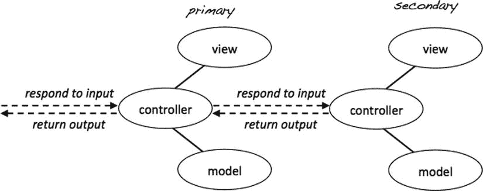

# 10.通过用户评论和搜索改进你的博客

这一章回到你博客的公众形象。此时，博客访问者可以看到您写的所有博客条目的列表，并可以单击某个条目来阅读全部内容。

现代 web 应用最重要的特性之一是允许用户通过评论系统进行交互。几乎所有现存的博客都允许其读者对条目发表评论。这增加了用户和博客作者的体验，使每个人都能够继续作者通过他的帖子发起的对话。本章向你展示了如何给博客添加评论系统。

这将是一个机会，让你加强对已经学过的一些东西的掌握，并掌握另外一些技能。在本章中，您将

*   设计用户评论表单
*   处理复杂的视图
*   开发一个控制器脚本来处理用户与表单的交互
*   为用户注释创建新的数据库表
*   使用外键将评论与博客条目相关联
*   使用继承来避免冗余代码
*   编写一个类来提供对注释表的访问

## 构建和显示评论条目表单

任何评论系统的基本部分是用户界面。您需要一个允许用户为博客条目撰写评论的表单。表单是一个视图。你还需要一个相应的模型和一个控制器。你必须从某个地方开始。在`views/comment-form-html.php`中创建一个新文件，如下:

`<?php`

`//complete code for views/comment-form-html.php`

`$idIsFound = isset($entryId);`

`if( $idIsFound === false ) {`

`trigger_error('views/comments-html.php needs an $entryId');`

`}`

`return "`

`<form action='index.php?page=blog&amp;id=$entryId' method='post' id='comment-form'>`

`<input type='hidden' name='entry-id' value='$entryId' />`

`<label>Your name</label>`

`<input type='text' name='user-name' />`

`<label>Your comment</label>`

`<textarea name='new-comment'></textarea>`

`<input type='submit' value='post!' />`

`</form>";`

要显示注释表单，您需要一个注释控制器。它在早期阶段的工作只是加载视图并返回 HTML 以显示评论表单。

`<?php`

`//complete code for controllers/comments.php`

`$comments = include_once "views/comment-form-html.php";`

`return $comments;`

到目前为止，代码简短扼要，非常像前面的代码示例。您可能会注意到，评论表单还不会出现在浏览器的任何地方。注释控制器加载注释视图。但是谁应该加载评论控制器并实际显示评论表单呢？

### 综合观点

仅当显示完整条目时，才应显示注释表。所以，显示条目的页面也应该显示一个评论表单:这是一个由其他视图组成的复杂视图。图 [10-1](#Fig1) 显示了组合视图的简单解决方案。找出部件的层次结构，并从“主控制器”加载“次控制器”

图 10-1。

Constructing complex views

您已经在自己制作的前端控制器中完成了这项工作。以`admin.php`中的代码为例。它加载一个模型和一个视图来制作 HTML5 页面。生成 HTML5 页面是`admin.php`主要关心的问题。但是根据不同的条件，`admin.php`会进一步加载编辑器控制器或列表条目控制器，每个控制器都会返回一些要嵌入到生成的页面中的内容。所以，`admin.php`是主控制器，后续加载的控制器是次控制器。

当前的任务是显示一个博客条目和一个 HTML 表单，以便用户可以对条目进行评论。在这种情况下，显而易见，主要控制器是博客控制器。评论表单仅在博客条目的上下文中有意义。博客控制器加载博客条目。博客控制器也应该加载评论控制器。在`controllers/blog.php`中，你可以这样表达:

`<?php`

`//complete code for controllers/blog.php`

`include_once "models/Blog_Entry_Table.class.php";`

`$entryTable = new Blog_Entry_Table( $db );`

`if ( $isEntryClicked ) {`

`$entryId = $_GET['id'];`

`$entryData = $entryTable->getEntry( $entryId );`

`$blogOutput = include_once "views/entry-html.php";`

`//new code here: load the comments`

`$blogOutput .=include_once "controllers/comments.php";`

`//no other changes`

`} else {`

`$entries = $entryTable->getAllEntries();`

`$blogOutput = include_once "views/list-entries-html.php";`

`}`

`return $blogOutput;`

现在你可以开始测试你的进步了！导航至`http://localhost/blog/index.php`并点击阅读更多以查看显示的一个条目。在博客条目的最后，您应该会看到显示的评论表单。你现在还不能提交任何新的评论，这并不奇怪。可以看到表单完全没有样式。这不是一个美丽的景象。您可以根据自己的喜好设计评论表格。这里有一个小小的 CSS 让你开始。我已经将这些新的 CSS 规则添加到我的样式表中。

`/*partial code for css/blog.css*/`

`form#comment-form{`

`margin-top:2em;`

`padding-top: 0.7em;`

`border-top:1px solid grey;`

`}`

`form#comment-form label, form#comment-form input[type='submit']{`

`padding-top:0.7em;`

`display:block;`

`}`

### 在数据库中创建注释表

在开始处理注释之前，您需要有一个存储注释的地方。在`simple_blog`数据库中创建一个名为 comment 的表。您将使用它来存储关于评论的所有信息。您必须在该表中存储几种不同类型的信息，如下所示:

*   `comment_id`:注释的唯一标识符。这是表的主键。您可以使用`AUTO_INCREMENT`属性，这样新的评论就会被自动分配一个惟一的 id 号。
*   `entry_id`:评论对应的博客条目的标识。该列是一个`INT`值。`entry_id`引用了另一个表中的主键。`entry_id`是一个所谓的外键。
*   `author`:评论作者的名字。该列最多接受 75 个字符，属于`VARCHAR`类型。
*   `txt`:实际的注释文本。我本应该将该列称为 text，但是 text 是一个保留的 SQL 关键字，所以我不能使用它。列的数据类型应该是`TEXT`。
*   `date`:评论发布的日期，存储为`TIME_STAMP`。您可以为该列设置一个默认值:`CURRENT_TIMESTAMP`，当用户向表中添加新的注释时，它将为确切的日期和时间提供一个`TIME_STAMP`。

要创建这个表，在浏览器中导航到`http://localhost/phpmyadmin`，选择`simple_blog`数据库，并打开 SQL 选项卡。执行以下命令创建注释表:

`CREATE TABLE comment (`

`comment_id INT NOT NULL AUTO_INCREMENT,`

`entry_id INT NOT NULL,`

`author VARCHAR( 75 ),`

`txt TEXT,`

`date TIMESTAMP DEFAULT CURRENT_TIMESTAMP,`

`PRIMARY KEY (comment_id),`

`FOREIGN KEY (entry_id) REFERENCES blog_entry (entry_id)`

`)`

评论是用户对一个特定博客条目的回应。因此，每个新评论必须与一个博客条目唯一关联。你的博客很快会显示评论，但是所有的评论不应该一直显示。当显示特定的博客条目时，应该只显示与该博客条目相关的评论。

由此可见，您的数据库必须以这样一种方式设计，以表示博客条目和评论之间的关系。数据库设计必须支持任何一个评论只能与一个博客条目相关。一个合理的解决方案是创建一个包含一列`entry_id`的注释表，如表 [10-1](#Tab1) 所示。这样，一个评论将知道它相关的条目的`entry_id`。

表 10-1。

Comment Rows Related to Specific Entries

<colgroup><col> <col> <col> <col> <col></colgroup> 
| comment_id | 条目 id | 作者 | 文本文件（textfile） | 日期 |
| --- | --- | --- | --- | --- |
| one | one | 托马斯 | […] | 2014-03-02 12:54:15 |
| Two | eight | 托马斯 | […] | 2014-03-02 13:25:41 |
| three | one | 布伦南 | […] | 2014-03-07 01:43:19 |

看一下表 [10-1](#Tab1) 中显示的填充注释表。看看任何一条评论是如何与特定条目的`entry_id`明确相关的？这样，每个评论都知道它与哪个博客条目相关。还要注意，一个博客条目可能有许多相关的评论。在前面的例子中，带有`entry_id = 1`的条目有两个注释。这种关系在关系数据库术语中称为一对多关系。

### 使用外键

在两个表之间建立关系时，使用外键约束是非常常见的。您可以看到在前面的 SQL 语句中是如何声明外键约束的。但这到底是为了什么？

外键约束就是约束，也就是说，它限制某些东西。当一个表字段用约束声明时，你不能随便插入任何东西。约束限制了字段可以接受的数据。

外键约束也是对外表中主键列的引用。在前面的例子中，注释表的`entry_id`是对`blog_entry`表的`entry_id`列的引用。

used 外键约束有助于维护数据的完整性，因为 comment 表只接受可以在`blog_entry`表中找到的带有`entry_id`的注释。换句话说，评论表将只接受与现有博客条目相关的评论。

现在您已经有了一个准备好接受评论的数据库表，每个博客条目都显示有一个表单，用于接受来自用户的新评论。在 MVC 术语中，您必须编写一个插入注释的模型并更新您的控制器，这样它才能响应表单提交。一般来说，控制器应该处理用户交互，而模型应该处理核心逻辑并操纵数据库。您可以开始编写模型或控制器的代码。从哪里开始并不重要。

### 构建 Comment_Table 类

从模型开始，从某个地方开始。您刚刚在数据库中创建了一个新表。您可能还记得，您已经使用了表数据网关设计模式来访问您的`blog_entry`表。

表数据网关提供了从 PHP 代码到一个数据库表的单点访问。让我们继续使用表数据网关模式，创建一个新的类来提供对注释表的单点访问。您可以将新类称为`Comment_Table`，这样它的名字就清楚地表明了它所代表的内容。

Note

表数据网关模式有一个简单的经验法则:每个表都应该有一个对应的表数据网关类。一桌一课！

如果你回想一下`Blog_Entry_Table`类，你会对你在新的类中需要什么有一个很好的想法。要访问数据库表，你需要一个 PDO 对象。每当你实例化一个`Blog_Entry_Table`时，你把一个 PDO 对象作为参数传递给构造函数。接收到的 PDO 对象存储在一个`$db`属性中，它似乎很好地完成了这项工作。您可以按原样重用这些代码。

拥有一个`makeStatement()`方法也很方便，就像在`Blog_Entry_Table`中一样。使用`makeStatement()`方法，您在`Comment_Table`中的代码可以保持整洁(不要重复自己)，或者至少是整洁的，您很快就会看到。

为了快速轻松地开始，您可以简单地从`Blog_Entry_Table`类中复制相关代码，并将其粘贴到一个新的`Comment_Table`类中。一旦你复制了相同的代码，你就可以开始声明`Comment_Table`独有的新方法。在`models`文件夹中新建一个名为`Comment_Table.class.php`的文件:

`<?php`

`//complete code for models/Comment_Table.class.php`

`class Comment_Table {`

`//code below can be copied from models/Blog_Entry_Table.class.php`

`private $db;`

`public function __construct ( $db ) {`

`$this->db = $db;`

`}`

`private function makeStatement ( $sql, $data = null ){`

`$statement = $this->db->prepare( $sql );`

`try{`

`$statement->execute( $data );`

`} catch (Exception $e) {`

`$exceptionMessage = "
You tried to run this sql: $sql 
`

`
Exception: $e
";`

`trigger_error($exceptionMessage);`

`}`

`return $statement;`

`}`

`} //end of class`

你记得 DRY 吗？两个不同的类有两个相同的方法和一个相同的属性是不是有点可惜？重复代码是公认的代码味，上面的代码肯定很臭！问题是你有两个在某些方面完全相同的类。

这是一个非常普遍的问题——甚至有一个名称。这类常见问题有很多解决方法。我想向您展示一个面向对象编程独有的解决方案。这个解决方案叫做继承。

### 通过继承保持干燥

使用继承，您可以创建一个单独的类定义，从而让代码在几个类之间共享。接下来，您可以创建单独的子类，在其中保存各个类的唯一代码，比如您的`Comment_Table`和`Blog_Entry_Table`。你可以在图 [10-2](#Fig2) 中看到这个想法。

图 10-2。

Subclasses inherit properties and methods from a parent class

图 [10-2](#Fig2) 展示了如何在一个父类中声明一些你想在多个类中共享的代码。该父母的所有孩子出生时都具有这些属性。在图 [10-2](#Fig2) 中，可以看到`A_Child`和`Another_Child`都有一个`$sharedProperty`和一个`sharedMethod()`。这些是从父类继承的。在图 [10-2](#Fig2) 中，还可以看到`A_Child`和`Another_Child`各有特殊的属性和方法。这些是在子类定义中声明的。比如只有`A_Child`有`changeA()`方法。

你可以用这个想法在`Blog_Entry_Table`和`Comment_Table`类之间共享`$db`和`makeStatement()`。你可以在图 [10-3](#Fig3) 中看到这样的架构。

图 10-3。

Using inheritance to make DRY table data gateway classes

`Comment_Table`和`Blog_Entry_Table`类都将带有从父类`Table`继承的`$db`属性和`makeStatement()`方法。`$db`和`makeStatement()`的代码在`Table`类中只需编写一次。在`Comment_Table`和`Blog_Entry_Table`中仍然可以访问`$db`和`makeStatement()`，因为它们都是同一个父对象的子对象。

### 是一种关系

在面向对象的术语中，父类和子类之间的关系称为 is-a 关系。一个`Comment_Table`就是一个`Table`。`Table`是一个通用的抽象概念，代表了数据库表的一般概念。`Comment_Table`是一个特定数据库表的表示。

物体之间关系的概念是你日常思维中用到的。咖啡是一种饮料。橙汁也是一种饮料。橙汁和咖啡有一些共同的特征，尽管它们明显不同。饮料是可消费液体的抽象概念。咖啡和橙汁是特殊种类的可消费液体。您可能会想出许多其他抽象概念及其具体实现的例子。面向对象编程借用了广泛使用的人类推理模式，并用它给计算机程序带来层次化的顺序。

### 在代码中使用继承

您可以创建如图 [10-3](#Fig3) 所示的解决方案。想要在子类之间共享的代码必须有公共的或受保护的访问修饰符。任何带有私有访问修饰符的属性或方法都不会通过继承来共享。下面是一个普通的`Table`类的样子。在`models`文件夹中创建一个名为`Table.class.php`的新文件:

`<?php`

`//complete code for models/Table.class.php`

`class Table {`

`//notice protected, not private`

`protected $db;`

`public function __construct ( $db ) {`

`$this->db = $db;`

`}`

`//notice protected, not private`

`protected function makeStatement ( $sql, $data = null ){`

`$statement = $this->db->prepare( $sql );`

`try {`

`$statement->execute( $data );`

`} catch (Exception $e) {`

`$exceptionMessage = "
You tried to run this sql: $sql 
`

`
Exception: $e
";`

`trigger_error($exceptionMessage);`

`}`

`return $statement;`

`}`

`}`

protected 访问修饰符与您已经使用的 private 访问修饰符非常相似。不能从外部访问受保护的方法和属性。它们只能从类本身内部访问。但是如果在这里使用 private，`makeStatement()`方法和`$db`属性对子类不可用。

为了让这些代码对一个子类可用，比如`Comment_Table`，你必须在你的代码中包含`Table`类定义脚本，并使用关键字`extends`。下面是几乎完全重写的干`Comment_Table`应该是什么样子:

`<?php`

`//complete code for models/Comment_Table.class.php`

`//include parent class definition`

`include_once "models/Table.class.php";`

`//extend current class from parent class`

`class Comment_Table extends Table{`

`//delete all previous code inside class`

`//it should be completely empty`

`}`

看到`Comment_Table`类在这一点上仅仅是一个空代码块了吗？从代码中一点也看不出来，但是`Comment_Table`与生俱来就有一个`makeStatement()`方法和一个`$db`属性。你在`Comment_Table`课上看不到它们，但在这里可以看到。它们继承自`Table`类，因为使用了`extends`关键字；`Comment_Table`延伸了`Table`。因此，在`Table`中声明的所有公共和受保护的方法和属性在`Comment_Table`中都是直接可用的。一个`Comment_Table`就是一个`Table`。图 [10-4](#Fig4) 显示了代码架构。

图 10-4。

A `Comment_Table` is a special kind of table

### 向数据库中插入新的注释

您可以向`Comment_Table`添加一个方法，这样您就可以向数据库中插入新的注释。调用新方法`saveComment()`:

`<?php`

`//complete code for models/Comment_Table.class.php`

`include_once "models/Table.class.php";`

`class Comment_Table extends Table{`

`//declare a new method inside the Comment_Table class`

`public function saveComment ( $entryId, $author, $txt ) {`

`$sql = "INSERT INTO comment ( entry_id, author, txt)`

`VALUES (?, ?, ?)";`

`$data = array( $entryId, $author, $txt );`

`$statement = $this->makeStatement($sql, $data);`

`return $statement;`

`}`

`}`

这段代码应该让我们明白什么是继承。看`$this->makeStatement()`怎么用在`Comment_Table`里？这是可能的，因为`makeStatement()`方法是从`Table`类继承的。`Comment_Table`是“天生”的，所有公共的和受保护的属性和方法都在`Table`类中声明。

#### 测试 saveComment()方法

是时候测试一下`Comment_Table`类和它的`saveComment()`方法是否有效了。您可以硬编码一个初步的注释，并只是为了测试的目的而插入它。评论控制者应该负责与评论相关的用户交互，所以编辑`controllers/comments.php`:

`<?php`

`//complete code for controllers/comments.php`

`//include class definition`

`include_once "models/Comment_Table.class.php";`

`//create a new object, pass it a PDO database connection object`

`$commentTable = new Comment_Table($db);`

`//insert a test comment for entry_id = 1`

`//assuming an entry_id of 1.`

`$commentTable->saveComment( 1, "me", "testing, testing" );`

`$comments = include_once "views/comment-form-html.php";`

`return $comments;`

前面的测试代码假设您有一个`entry_id = 1`。如果没有，可以使用`blog_entry`数据库表中的另一个`entry_id`。当您编写完测试代码后，您可以在浏览器中导航到`http://localhost/blog/index.php?page=blog`并点击任何 Read more 链接来运行您的测试代码。代码应该在注释表中插入一个测试注释。为了查看你的代码是否有效，你必须加载`http://localhost/phpmyadmin`并浏览注释表。您应该会看到一行插入到您的注释表中，如图 [10-5](#Fig5) 所示。

图 10-5。

A row inserted into the comment table, as seen in phpMyAdmin

注意，`comment_id`和`date`字段值是自动创建的。从注释控制器接收`entry_id`、`author`和`txt`值，并通过`saveComment()`方法插入到`Comment_Table`对象中。

### 检索给定条目的所有注释

在数据库中有对`entry_id = 1`的评论真是太好了。但这不是一个特别有用的评论，只要博客访问者不能在他们的浏览器中看到它。要显示给定条目的所有评论，您必须获取与给定条目的`entry_id`相关联的所有评论的数据。您的`Comment_Table`应该是从 PHP 到评论数据库表的单点访问。在`models/Comment_Table.class.php`中声明一个新方法来获取特定`entry_id`的所有条目，如下所示:

`//partial code for models/Comment_Table.class.php`

`//declare new method inside the Comment_Table class`

`public function getAllById ( $id ) {`

`$sql = "SELECT author, txt, date FROM comment`

`WHERE entry_id = ?`

`ORDER BY comment_id DESC";`

`$data = array($id);`

`$statement = $this->makeStatement($sql, $data);`

`return $statement;`

`}`

花点时间阅读一下前面代码中使用的 SQL 语句。它将在`SELECT author`、`txt`和`date`列显示与特定`entry_id`相关的所有评论。请记住，`entry_id`被声明为外键。它是对`blog_entry`表主键的引用。通过`entry_id`，您可以明确地识别一个特定的`blog_entry`:您知道一个评论与哪个博客条目相关。

注释将按照`DESC`结束顺序中的`comment_id`值按时间顺序排序。换句话说，具有较高`comment_id`值的评论将在具有较低`comment_id`值的评论之前列出。`comment_id`列被声明为`auto_incrementing`，这意味着插入的第一个注释将自动获得值为 1 的`comment_id`。下一个注释将得到值为 2 的`comment_id`，依此类推。因此，最新的评论将具有最高的`comment_id`值。因此，上面的 SQL 语句首先列出新的注释，然后列出旧的注释。

再一次，您可以意识到`makeStatement()`方法是从`Table`类继承而来的。可以使用`Comment_Table`类里面的`makeStatement()`。实际上，您可能还记得`makeStatement()`是用受保护的访问修饰符声明的。这意味着`makeStatement()`方法只能从类内部调用。在你的系统中不可能从任何其他 PHP 脚本中调用`makeStatement()`。

#### 测试 getAllById()

你已经知道了。你大概经历过很多次。每当您键入一些代码时，您可能会在代码中引入一个 bug—一个编程错误。唯一明智的做法是写几行代码，然后测试代码是否按预期运行。把虫子抓在摇篮里！

打开 comments 控制器，写一点代码来测试`getAllById()`方法是否正常工作。如果你用一个条目的`entry_id`调用`getAllById()`，你知道至少有一个相关的评论，你应该得到一个`PDOStatement`。调用`PDOStatement`的`fetchObejct()`,你应该得到一个`StdClass`对象，代表注释表中的一行数据。您可以重写`controllers/comments.php`来测试新的`getAllById()`方法，如下所示:

`<?php`

`//complete code for controllers/comments.php`

`include_once "models/Comment_Table.class.php";`

`$commentTable = new Comment_Table($db);`

`//query database`

`$allComments = $commentTable->getAllById( $entryId );`

`//get first row as a StdClass object`

`$firstComment = $allComments->fetchObject();`

`$testOutput = print_r( $firstComment, true );`

`die( "<pre>$testOutput</pre>" );`

`//PHP dies before coming to these lines`

`$comments = include_once "views/comment-form-html.php";`

`return $comments;`

浏览浏览器至`http://localhost/blog/index.php?page=blog`，点击阅读更多内容运行测试。如果一切顺利，您应该会看到如下所示的输出:

`stdClass Object (`

`[author] => me`

`[txt] => testing, testing`

`[date] => 2014-03-03 10:29:33`

`)`

如果您看到类似的输出，您已经确认`getAllById()`按预期工作。`die()`函数将杀死 PHP 进程，因此它将有效地阻止 PHP 进程。为了调试或测试，提前终止 PHP 脚本有时会很有用。

#### 创建用于列出注释的视图

此时，你应该有一个确定的测试。您将需要一个显示所有评论的视图。在`views/comments-html.php`中创建一个新文件:

`<?php`

`//complete code for views/comments-html.php`

`$commentsFound = isset( $allComments );`

`if($commentsFound === false){`

`trigger_error('views/comments-html.php needs $allComments' );`

`}`

`$allCommentsHTML = "<ul id='comments'>";`

`//iterate through all rows returned from database`

`while ($commentData = $allComments->fetchObject() ) {`

`//notice incremental concatenation operator .=`

`//it adds <li> elements to the <ul>`

`$allCommentsHTML .= "<li>`

`$commentData->author wrote:`

`
$commentData->txt
`

`</li>";`

`}`

`//notice incremental concatenation operator .=`

`//it helps close the <ul> element`

`$allCommentsHTML .= "</ul>";`

`return $allCommentsHTML;`

#### 查找视图和模型以显示注释

您可以在您的注释控制器中注释掉或者删除测试代码。显示注释的最后一步是加载视图，该视图将显示从数据库中检索到的所有注释:

`<?php`

`//complete code for controllers/comments.php`

`include_once "models/Comment_Table.class.php";`

`$commentTable = new Comment_Table($db);`

`$comments = include_once "views/comment-form-html.php";`

`//new code starts here`

`$allComments = $commentTable->getAllById( $entryId );`

`//notice the incremental concatenation operator .=`

`$comments .=include_once "views/comments-html.php";`

`//no changes below`

`return $comments;`

在浏览器中查看任何博客条目。您应该会看到博客条目，然后是评论表单，最后是与该博客条目相关的所有评论的列表。

### 通过注释表单插入注释

您有一个评论表单，评论会显示出来。你也证明了你的`saveComment()`方法是有效的。通过表单插入来自用户的新评论应该是一件小事。要从表单中获取输入，您需要知道表单使用什么 HTTP 方法，以及表单中使用了什么 name 属性。

对于 web 开发人员来说，使用 PHP 检索表单输入是一项非常常见的任务。这是你真的应该在这本书结束时彻底理解的东西。我可以假设你完全明白我的意思，并且你已经完全理解了这个话题，但是我宁愿给你一个机会来测试你自己的理解。看一下下面的代码，看看您是否能弄清楚注释表单使用了什么方法，以及哪些 name 属性用于输入和文本区域元素。

`//partial code for views/comment-form-html.php`

`//make NO code changes`

`return "`

`<form action='index.php?page=blog&amp;id=$entryId' method='post' id='comment-form'>`

`<input type='hidden' name='entry-id' value='$entryId' />`

`<label>Your name</label>`

`<input type='text' name='user-name' />`

`<label>Your comment</label>`

`<textarea name='new-comment'></textarea>`

`<input type='submit' value='post!' />`

`</form>";`

这不是一个特别困难的挑战，是吗？表单方法是`post`。有一个名为`user-name`的`<input>`字段，一个名为`entry-id`的隐藏`<input>`，一个名为`new-comment`的`<textarea>`。了解了这一点，就很容易在注释控制器中编写一点 PHP 来插入来自用户的新注释，如下所示:

`<?php`

`//complete code for controllers/comments.php`

`include_once "models/Comment_Table.class.php";`

`$commentTable = new Comment_Table($db);`

`//new code here`

`$newCommentSubmitted = isset( $_POST['new-comment'] );`

`if ( $newCommentSubmitted ) {`

`$whichEntry = $_POST['entry-id'];`

`$user = $_POST['user-name'];`

`$comment = $_POST['new-comment'];`

`$commentTable->saveComment( $whichEntry, $user, $comment );`

`}`

`//end of new code`

`$comments = include_once "views/comment-form-html.php";`

`$allComments = $commentTable->getAllById( $entryId );`

`$comments .=include_once "views/comments-html.php";`

`return $comments;`

将浏览器指向任何博客条目，并通过表单提交新评论。您应该会看到提交的评论与您对该博客条目的任何其他评论一起列出。你的评论系统有效！

### 熟能生巧

自从你开始读这本书以来，你已经有了很大的进步。看看你的博客就知道了:和你在[第一章](01.html)写的“来自 PHP 的你好”相去甚远。最重要的发展是你的思想发生了变化。你现在知道一些 PHP 和 MySQL。在你真正熟悉你所学的东西之前，你还需要许多小时的经验。

在没有我的指导下尝试应用一些学到的经验如何？您可以更改`Blog_Entry_Table`类，使其从`Table`继承，以实践继承。这与你对`Comment_Table`类所做的非常相似。

或者您可以向用户提供反馈，让他们知道系统已经注册了一个新提交的评论。这将非常类似于您在条目管理器中提供的确认消息。

下面是您可以完成的另一项任务:当用户阅读没有评论的博客条目时，您可以显示如下消息:

`Be the first to comment this article`

你可以在风景里做。您应该让 PHP 计算从数据库返回了多少行注释。如果返回了 0 行，您知道博客条目没有评论，您应该输出一条类似前面的消息。

现在你有了一个评论系统，用户可以偶然发现一个稍微复杂的系统行为。假设一个用户阅读了一个博客条目并发表了评论。之后，用户想要返回到所有博客条目的列表。所以，她点击了浏览器的后退按钮。但是等等！这不会把用户带回索引。如果每个博客条目都有一个`<a>`链接回`index.php`不是很好吗？你能实现这样的链接吗？

你可能会发现写自己的代码会减慢你的速度。这是意料之中的事。但是，只有当你开始编写自己的代码时，你才能学会编写自己的代码——你最好尽早开始。

## 搜索条目

你的博客系统已经取得了很大的进步。您可能已经通过条目编辑器添加了一些条目。访问你的博客的人可能会寻找你曾经写过的一些特别的东西，但他们可能不记得你是在哪个条目写的了。你需要给他们一个选项来搜索条目。

您应该显示一个搜索表单，以便访问者可以输入搜索文本。您应该使用任何输入的搜索文本在数据库中执行搜索，并返回与输入的搜索词匹配的任何条目。

你能看到三个责任吗？您需要一个视图来显示搜索表单，另一个视图来显示搜索结果。您需要一个模型来执行数据库搜索并返回结果。您将需要一个控制器来响应用户交互。如果表单被提交，控制器应该显示搜索结果；如果没有，显示搜索表单。

### 搜索视图

从一小步开始总是一个好主意。您可以为搜索视图创建 HTML 表单。这没什么稀奇的。在`views/search-form-html.php`中创建一个新文件:

`<?php`

`//complete code for views/search-form-html.php`

`return "<aside id='search-bar'>`

`<form method='post' action='index.php?page=search'>`

`<input type='search' name='search-term' />`

`<input type='submit' value='search'>`

`</form>`

`</aside>";`

视图将显示一个 HTML 搜索表单。您可能不熟悉 input 元素上使用的搜索类型属性。搜索字段只是一种特殊的单行文本字段。搜索字段将记住用户以前的搜索词，并向用户提供一个下拉列表，建议用户以前的搜索词。

并非所有浏览器都支持搜索类型。但是任何不支持它的浏览器都会默认一个基本的`<input type='text'>`，所以搜索表单仍然可以工作，即使一个浏览器不支持该搜索类型。

Note

要检查哪个浏览器支持哪些 HTML5 元素，请咨询 [`http://caniuse.com`](http://caniuse.com/) 。

要显示搜索表单，您应该考虑希望何时显示它。在每个页面视图上显示搜索表单会很好。为了显示搜索表单而不考虑其他显示的内容，您可以从前端控制器`index.php`加载它。在`index.php`的末尾附近添加一行代码:

`//partial code for index.php`

`//new code: include the search view before the blog controller`

`$pageData->content .=include_once "views/search-form-html.php";`

`//end of new code`

`$pageData->content .=include_once "controllers/blog.php";`

`$page = include_once "views/page.php";`

`echo $page;`

通过在浏览器中加载`http://localhost/blog/index.php`来测试您的进度。您应该会看到搜索表单显示在所有博客条目列表的前面。如果你点击阅读更多，你应该看到一个特定的博客条目。请注意，搜索表单仍会显示。

### 响应用户搜索

显示搜索表单时，很容易编写一个搜索词并提交它。尝试一下，您将在浏览器中看不到任何结果——没有检测到搜索表单提交。最终，您会希望显示搜索结果列表。您可以从初步的搜索控制器开始。在`controllers/search.php`中创建一个新文件:

`<?php`

`//complete code for controllers/search.php`

`return "You just searched for something";`

执行搜索后，您希望从索引中加载搜索控制器。如果没有执行搜索，`index.php`应该加载博客控制器。注意搜索表单的`action`属性:

`//partial code from views/search-form-html.php, don't change anything`

`<form method='post' action='index.php?page=search'>`

每当用户提交搜索表单时，一个名为`page`且值为`search`的 URL 变量将被编码为请求的一部分。因此，当`page`的值为`search`时，您的 web 应用应该显示搜索结果。从`index.php`这将很容易实现:

`//partial code for index.php`

`//new code starts here, in line 17 in my index.php`

`$pageRequested = isset( $_GET['page'] );`

`//default controller is blog`

`$controller = "blog";`

`if ( $pageRequested ) {`

`//if user submitted the search form`

`if ( $_GET['page'] === "search" ) {`

`//load the search by overwriting default controller`

`$controller = "search";`

`}`

`}`

`$pageData->content .=include_once "views/search-form-html.php";`

`//comment out or delete this line`

`//$pageData->content .=include_once "controllers/blog.php";`

`$pageData->content .=include_once "controllers/$controller.php";`

`//end of changes`

`$page = include_once "views/page.php";`

`echo $page;`

就是这样。您的前端控制器将只显示博客或搜索页面。只有在执行搜索后，才会显示搜索页面。通过将浏览器导航到`http://localhost/blog/index.php`来测试进度。您应该会看到博客条目列表。现在做一些搜索。您应该会看到来自搜索控制器的一条短消息。它说，“你刚刚搜索了一些东西”，这基本上确认了搜索控制器被加载。

### 搜索模型

您有一个搜索表单视图，还有一个初步的搜索控制器。是时候研究一个搜索模型了，这样您就可以执行实际的搜索了。要执行搜索，您必须查询您的`blog_entry`数据库表。您已经有了一个`Blog_Entry_Table`类来提供对该表的单点访问。明智的做法是给`Blog_Entry_Table`添加另一个方法。在`models/Blog_Entry_Table.class.php`里做理智的事，如下:

`//Declare new method in Blog_Entry_Table class`

`public function searchEntry ( $searchTerm ) {`

`$sql = "SELECT entry_id, title FROM blog_entry`

`WHERE title LIKE ?`

`OR entry_text LIKE ?";`

`$data = array( "%$searchTerm%", "%$searchTerm%" );`

`$statement = $this->makeStatement($sql, $data);`

`return $statement;`

`}`

也许这个`$data`数组需要一些解释。当两个项目完全相同时，创建一个包含两个独立项目的数组是不是很奇怪？那么，SQL 中未命名占位符的数量必须与您执行的数组中的项数完全匹配。因为 SQL 中有两个占位符，所以您需要一个包含两个值的数组用于搜索。在前面的示例中，您的代码将在两个不同的表列中搜索相同的搜索词。

Note

答？表示准备好的 SQL 语句中未命名的占位符。

因为您搜索两列，所以在 SQL 语句中需要两个占位符。因为您在两列中搜索相同的搜索词，所以这两个占位符应该替换为相同的值。这就是为什么`$data`数组的长度应该是 2，即使这两项是相同的。

#### 使用相似条件进行搜索

上面的 SQL 语句演示了一个我在本书前面的例子中没有用到的 SQL 关键字:`LIKE`。让我们看一个稍微简单一点的例子，然后逐步使用前面使用的语法:

`SELECT entry_id, title FROM blog_entry WHERE title LIKE 'test'`

该查询将返回一个结果集，其中包含任何`blog_entry`行的`entry_id`和`title`属性，以及`title`属性恰好为`test`。因此，标题为“这是一个测试”的行不会是结果的一部分。

这样的查询非常清楚地说明了`LIKE`是如何工作的。但作为搜索，用处不大。为了进行更有用的搜索，您可以在`LIKE`条件中添加一个通配符。

`SELECT entry_id, title FROM blog_entry WHERE title LIKE 'test%'`

`%`字符代表通配符。通配符代表任何东西。因此，该查询将返回标题以“test”开头，后跟任何内容的所有行的结果集。将返回一个标题为“测试是否有效”的行。标题为“这是一个测试”的行不会被返回。当然，您可以找出两个通配符如何极大地改进查询。

`SELECT entry_id, title FROM blog_entry WHERE title LIKE '%test%'`

这样的查询将返回一个标题为“测试是否有效”的行和一个标题为“这是一个测试”的行因此，如果您只想搜索标题中带有单词 test 的条目，前面的查询将是完美的。您可以轻松扩大搜索范围，也可以在`entry_text`列中查找匹配项:

`SELECT entry_id, title FROM blog_entry WHERE title LIKE '%test%'`

`OR entry_text LIKE '%test%'`

在搜索单词 test 时，这非常有用。但是你可以有把握地假设你的博客访问者会搜索其他单词或短语。因此，您需要创建一个用空占位符准备的 SQL 语句。PHP 可以检索访问者的搜索词，并将其插入占位符所在的位置。下面是用于搜索 is 的最后一条 SQL 语句:

`SELECT entry_id, title FROM blog_entry WHERE title LIKE '%?%'`

`OR entry_text LIKE '%?%'`

这个最终的 SQL 语句将为任何行返回`entry_id`和`title`，其中`title`或`entry_text`与用户提交的搜索词相匹配。

#### 试验模型

用小步骤编码，中间穿插非正式测试！你可以在你的控制器中使用`print_r()`来测试你的`searchEntry()`方法是否有效。您可以对一个您知道应该返回结果的术语进行硬编码搜索。我知道我在博客条目中使用了单词 test，所以我对 test 进行了硬编码搜索，并期望得到一个结果。为此，我更新`controllers/search.php`，如下:

`<?php`

`//complete code for controllers/search.php`

`//load model`

`include_once "models/Blog_Entry_Table.class.php";`

`$blogTable = new Blog_Entry_Table( $db );`

`//get PDOStatement object from model`

`$searchData = $blogTable->searchEntry( "test" );`

`//get first row from result set`

`$firstResult = $searchData->fetchObject();`

`//inspect first row`

`$searchOutput = print_r($firstResult, true);`

`$searchForm = include_once "views/search-form-html.php";`

`$searchOutput .= $searchForm;`

`//display all output on index.php`

`return $searchOutput;`

保存您的代码并在浏览器中加载`http://localhost/blog/index.php`。现在执行一些搜索—搜索什么并不重要。当您提交搜索表单时，您应该会看到以下内容:一个打印的对象。它看起来会像下面这样:

`stdClass Object ( [entry_id] => 3 [title] => This is a test )`

### 搜索结果视图

您刚才看到的输出是一个搜索结果的表示。它证实了`searchEntry()`方法是有效的。为了以用户可能喜欢的方式显示搜索结果，您需要一个搜索视图。您必须在返回的数据周围包装一些 HTML。在`views/search-result-html.php`中创建一个新文件:

`<?php`

`//complete code for views/search-results-html.php`

`$searchDataFound = isset( $searchData );`

`if( $searchDataFound === false ){`

`trigger_error('views/search-results-html.php needs $searchData');`

`}`

`$searchHTML = "<section id='search'> 
`

`You searched for <em>$searchTerm</em>
<ul>";`

`while ( $searchRow = $searchData->fetchObject() ){`

`$href = "index.php?page=blog&amp;id=$searchRow->entry_id";`

`$searchHTML .= "<li><a href='$href'>$searchRow->title</li>";`

`}`

`$searchHTML .= "</ul></section>";`

`return $searchHTML;`

前面的代码假设存在一个`$searchData`变量。如果没有找到，将触发错误。如果找到了`$searchData`变量，代码将使用`while`语句遍历结果集。`while`循环将为每个匹配搜索的`blog_entry`创建一个`<li>`元素。

### 从控制器加载搜索结果视图

要在浏览器中显示搜索结果，您必须加载搜索结果视图。将一个视图与一个模型联系起来是一个控制器的任务。更新您的搜索控制器，更新您在`controllers/search.php`中的代码:

`<?php`

`//complete code for controllers/search.php`

`include_once "models/Blog_Entry_Table.class.php";`

`$blogTable = new Blog_Entry_Table( $db );`

`$searchOutput = "";`

`if ( isset($_POST['search-term']) ){`

`$searchTerm = $_POST['search-term'];`

`$searchData = $blogTable->searchEntry( $searchTerm ) ;`

`$searchOutput = include_once "views/search-results-html.php";`

`}`

`//delete all the code your wrote for testing the searchEntry method`

`return $searchOutput;`

就这样。您的前端控制器将只显示博客或搜索页面。搜索页面将显示搜索结果，即使没有匹配项。

### 练习:改进搜索

你注意到搜索中的一个小问题了吗？尝试搜索一个你绝对知道在数据库中没有匹配的术语。我试图搜索“#€%，显然，没有匹配。我查看了生成的 HTML 源代码，以下是我的发现:

`<section id='search'>`

`
You searched for <em>"#€%</em>
`

`<ul></ul>`

`</section>`

那永远不会是有效的 HTML，也不是特别用户友好的。代码的一个小变化可以将一个单独的`<li>`元素附加到`<ul>`中。也许没有条目与您的搜索匹配。你能改变吗？您可能需要知道，如果没有结果集，一个`PDOStatement`将保存值`FALSE`。

## 摘要

你在这一章中涵盖了很多内容，包括学习和改进你的博客。博客访问者可能会注意到评论系统。就互动交流而言，评论系统是一个游戏改变者。突然间，你不仅仅是向全世界发布你的想法。有了评论系统，你就邀请了你和你的读者之间的双向交流。

我很高兴有机会向您展示面向对象编程的经典特征之一:继承。这是保持干燥的一个非常聪明的方法，只要你不过度使用它。

编写长继承链是可能的。你可以创建一个狗类，它是狼的孩子，是犬科动物的孩子，是四足动物的孩子，是哺乳动物的孩子。但是经验表明，浅继承关系更可取。长的遗传链会导致依赖性问题，因为狗依赖于狼的存在，而狼又依赖于犬科动物，犬科动物又依赖于四足动物。保持你的继承链短，你会没事的。

在这一章中，您将直接面对数据库设计中的外键以及使用通配符搜索数据库表。这两个都是重要的话题，作为一名 web 开发人员，你在未来一定会再次遇到。