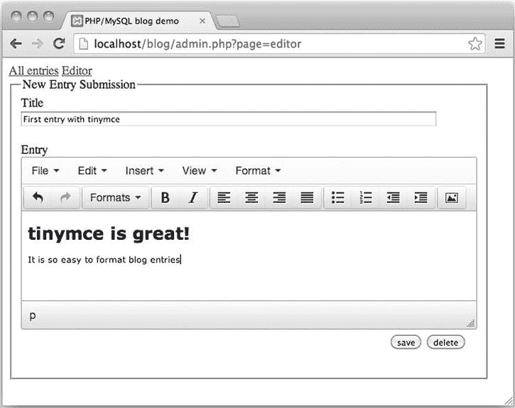
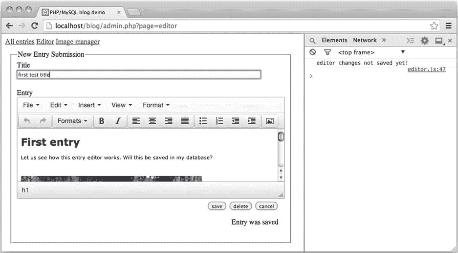

# 11.向博客条目添加图像

你的博客已经完成了！当然还有改进的空间，但它功能齐全。管理模块可以用来创建博客条目，但是有一些严重的缺陷。

*   如果数据库中有与博客条目相关的评论，它不能删除该条目。
*   它不能给博客文章添加图片，我相信你会想用图片给你的博客文章增添情趣。
*   为了写博客，管理员必须了解 HTML，并不是所有伟大的作家都同样擅长 HTML。
*   管理员可以创建一个没有标题的条目，有效地使用户无法访问博客条目。

我相信你可以想出其他你想添加到管理模块的功能。本章将实现刚刚列出的特性。在此过程中，您将了解以下内容:

*   删除条目和相关注释
*   为您的条目编辑器使用 WYSIWYG 编辑器
*   将图像上传到服务器
*   从服务器中删除图像文件

## 问题:无法删除带有注释的条目

我相信你会同意评论系统是一个很大的改进。不幸的是，注释也在管理模块中引入了不必要的系统行为。无法删除带有注释的条目。

我想让你在解决问题之前看到它。转到`http://localhost/blog/admin.php?page=editor`并创建新的博客条目。现在将你的浏览器指向`http://localhost/blog/index.php`，点击阅读你刚刚创建的条目。通过意见表为新条目添加一两条意见。现在你有了一个带有评论的博客条目。

在你的浏览器中加载`http://localhost/blog/admin.php?page=entries`并点击你刚刚写的博客条目的标题。博客条目将被加载到您的博客条目编辑器中。点击删除，尝试删除帖子。单击 Delete 应该会给出一条类似于下面所示的错误消息。

`Exception: exception 'PDOException' with message 'SQLSTATE[23000]: Integrity constraint violation: 1451 Cannot delete or update a parent row:` `a foreign key constraint fails`

### 了解外键约束

遇到错误总是有点烦人，但这是一个友好的错误。这确实可以防止您破坏数据库的完整性。Table [11-1](#Tab1) 查看我的表，以查看我通过编辑器表单创建的博客条目。

表 11-1。

One Row from the `blog_entry` Table

<colgroup><col> <col> <col> <col></colgroup> 
| 条目 id | 标题 | 条目 _ 文本 | 创造 |
| --- | --- | --- | --- |
| Seventeen | 删除我 | 测试测试 | 2014-03-23 10:26:18 |

我还创建了一个与该特定博客条目相关的评论。表 [11-2](#Tab2) 显示了注释表中的相应行。

表 11-2。

One Row from the Comment Table

<colgroup><col> <col> <col> <col> <col></colgroup> 
| comment_id | 条目 id | 作者 | 文本文件（textfile） | 日期 |
| --- | --- | --- | --- | --- |
| four | Seventeen | 托马斯 | 测试注释 | 2014-03-23 10:26:40 |

假设你用`entry_id = 17`删除了`blog_entry`。你可能会有一个与不再存在的博客条目相关的评论。注释只有在正确的上下文中才有意义。与`comment_id = 4`的评论会失去它的上下文；它会失去它的完整性。你可以想象如果用`entry_id = 17`插入一个新的博客条目会发生什么。该博客条目将带有完全不相关的评论。

外键约束的目的是维护数据完整性。所以，当你试图删除一个有评论的`blog_entry`时，MySQL 会阻止你，因为删除操作会在你的系统中留下一个叛逆的评论，没有有意义的上下文。只有没有评论的博客条目可以被删除，而不会丢失数据完整性。

### 删除博客条目前的评论

一旦你看到只有没有评论的博客条目才能被删除而不丧失数据完整性，那么解决方案就很容易看到了:删除博客条目时，你应该先删除任何与该条目相关的评论。您已经有了一个类，它提供了对注释表的单点访问。您可以添加一个新方法来删除与特定`entry_id`相关的所有注释，如下所示:

`//partial code for models/Comment_Table.class.php`

`//declare new method`

`public function deleteByEntryId( $id ) {`

`$sql = "DELETE FROM comment WHERE entry_id = ?";`

`$data = array( $id );`

`$statement = $this->makeStatement( $sql, $data );`

`}`

应该在删除博客条目之前调用此方法。博客条目从`Blog_Entry_Table`类中删除。一个解决方案是让`Blog_Entry_Table`类使用`Comment_Table`类，如下所示:

`//partial code for models/Blog_Entry_Table.class.php`

`//edit existing method`

`public function deleteEntry ( $id ) {`

`//new code: delete any comments before deleting entry`

`$this->deleteCommentsByID( $id );`

`$sql = "DELETE FROM blog_entry WHERE entry_id = ?";`

`$data = array( $id );`

`$statement = $this->makeStatement( $sql, $data );`

`}`

`//new code: declare a new private method inside Blog_Entry_Table.class.php`

`private function deleteCommentsByID( $id ) {`

`include_once "models/Comment_Table.class.php";`

`//create a Comment_Table object`

`$comments = new Comment_Table( $this->db );`

`//delete any comments before deleting entry`

`$comments->deleteByEntryId( $id );`

`}`

前面的代码完成后，您就可以开始测试了。您应该能够通过编辑器删除任何博客条目。如果有任何与`blog_entry`相关的注释，这些注释将首先被删除，以避免违反外键约束。

## 利用所见即所得提高可用性

所见即所得的缩写。有了 WYSIWYG HTML 编辑器，对 HTML 知之甚少或一无所知的管理员可以编写以编程方式标记为 HTML 的博客条目。所见即所得编辑器看起来很像任何其他文字处理软件，但它可以将文本保存为 HTML，而不是保存为`.doc`或`.odf`文件。

### 集成 TinyMCE

TinyMCE 是一个流行的开源所见即所得编辑器。它集成在许多流行的 CMS 系统中，如 Drupal、Joomla 和 WordPress。很快，它将集成到您的条目编辑器中，这将是一个非常棒的改进。

集成 TinyMCE 相当容易。第一步，从 [`www.tinymce.com/download/download.php`](http://www.tinymce.com/download/download.php) 下载。解压缩下载的文件，并在现有的`js`文件夹中保存一份`tinymce`文件夹的副本。查看一下`js/tinymce`内部，确认您可以找到主 JavaScript 文件`tinymce.min.js`。这就是你的`admin.php`应该使用的 JavaScript 文件。

TinyMCE JavaScript 和 CSS 文件可以将普通的`<textarea>`元素变成所见即所得编辑器。你所要做的就是初始化 TinyMCE 并把它指向你的文本区域。您可以从`views/admin/editor-html.php`开始，如下所示:

`//partial code for views/admin/editor-html.php`

`//notice the new `

`";`

看看这两个``

每当 TinyMCE 编辑器以任何方式改变时，该代码将调用函数`updateEditorMessage()`。那正是你想要的。

Note

了解如何在 [`www.tinymce.com/wiki.php/Configuration`](http://www.tinymce.com/wiki.php/Configuration) 配置 TinyMCE。

期末考试的时间到了。将一个现有条目加载到条目编辑器中，稍加修改，然后保存。现在，您应该看到一条编辑器消息，说明条目已保存。对条目再做一点修改，看看编辑器消息如何立即变成 Changes not saved！这是您的 JavaScript 函数`updateEditorMessage()`的工作，该函数通过 TinyMCE `change`事件调用，由 TinyMCE 编辑器中的任何更改触发。

需要记住的一点是，TinyMCE 依赖于 JavaScript。如果不启用 JavaScript，条目编辑器不会给人留下深刻印象。任何博客管理员都必须承认，他们需要一个支持 JavaScript 的现代浏览器。

下一章将向您展示如何限制对管理模块的访问。您将创建一个登录表单，以便只允许拥有正确用户名和密码的用户使用管理模块。

## 摘要

本章对管理模块进行了一些重大改进。在这个过程中，您还有机会了解 PHP 文件上传以及如何用 PHP 删除文件。

您已经仔细研究了与定制 PHP 异常一起使用的`try-catch`语句。您已经看到了如何使用`try-catch`，以便您的 PHP 代码可以优雅地失败。您已经使用异常向用户提供了有意义的错误消息。您应该知道一些开发人员会反对这种异常的使用。一些开发人员会说，你能预测的任何错误都不是例外。这些情况不应使用例外。最终决定权在你:至少现在，你有选择权。

我希望你和 TinyMCE 的合作给你带来了开胃菜。在网上可以找到许多可靠的、记录良好的 JavaScript，将这样的 JavaScript 集成到您的项目中可以极大地提高您的工作质量。另一方面，你应该小心处理你不完全理解的库和框架。如果你向客户交付一个项目，然后发现系统中有一个 bug，如果你不理解使用的代码，你可能很难修复这个 bug。和例外的情况一样，最终都要做出明智的决定。