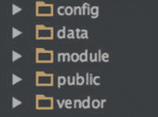
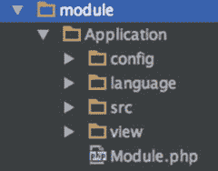
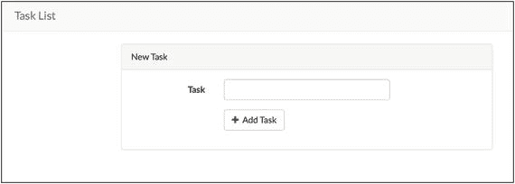

# 五、框架

即使你对 PHP 非常陌生，你也可能已经偶然发现了一些 PHP 框架。Symfony、Zend、Laravel、Yii 和 CakePHP 只是你可以使用的一些流行的选择。

当我在 1999 年第一次开始用 PHP 开发时，这些选项都不可用。那时候，PHP 应用是逻辑、HTML、JavaScript、SQL 查询以及更多分散在成百上千个文件中的东西的混合体。几年后，一些 PHP 开发框架在 2005-2006 年间开始成形，其中一些至今仍然存在并蓬勃发展(例如 Symfony 和 Zend Framework)。

诚然，我最初抵制使用这些新框架之一的想法。此时，我已经开始为我的站点和应用开发某种类型的已定义结构，因为我试图模仿 MVC 风格的结构，并将某种类型的分离和组织引入到我周围正在开发的疯狂中。我不想丢掉它，去学习一些对 PHP 来说非常新的东西。然而，随着这些框架开始成熟，社区支持开始建立，我意识到我没有一个好的理由继续坚持下去。我一头扎进了这些流行的框架中，并且从未后悔过这个决定。

## 为什么要使用框架？

这是我经常被那些还没有和一个人一起工作的人问到的问题。一个框架有什么特别之处，以至于我应该使用它，而不是自己做独立的 PHP 开发？好处有很多:

*   所有站点和应用都熟悉的定义好的结构
*   一个为框架代码库的改进做出贡献的社区，可以回答之前已经问过和回答过的问题(堆栈溢出，有人吗？)
*   一套预先开发的功能，您不必为每个应用重新开发
*   您可以使用模块、库和插件来立即添加附加功能
*   更好的可测试性，有可能与 PHPUnit 集成进行单元测试
*   与 ORM 的现有集成
*   在应用中预先建立设计模式的使用。通常，使用一个框架意味着你不得不至少在某种程度上遵循它的范例，这可以产生更好的结构和组织的代码
*   可重用和可维护的代码目的

关于 PHP 和框架的更多信息，请参考`phpframeworks.com`。

Note

框架不是任何 PHP 开发的必需品。但是，它们是一个非常有价值的工具，可以帮助您构建更好的应用。

那么，框架是什么样子的呢？让我们深入研究一些广受欢迎和社区支持的框架。对于每个框架示例，我们将了解:

*   安装是多么容易
*   框架的总体结构
*   如何让一个简单的动作和控制器工作
*   如何进行简单的数据库调用并显示结果

## Zend 框架 2

我们将从查看 Zend Framework 2 开始。Zend Framework 2，俗称 ZF2，是由 Zend Technologies 创建的第二代企业级框架。Zend Technologies 是由 Andi Gutmans 和 Zeev Suraski 创办的公司，自从拉斯马斯·勒德尔夫最初创建 PHP 以来，他们为 PHP 的发展做出了很大贡献。ZF2 标榜自己是模块化的、安全的、可扩展的、高性能的、企业就绪的，并得到了一个庞大而活跃的社区基础的支持。正如其模块化一样，ZF2 依赖于 Composer，由许多组件组成，所有组件都可以通过 Packagist 获得。

### 安装 ZF2

安装和运行 Zend Framework 2 非常简单快速。

Note

由于框架实现的 PHP 5.3+中的新特性，以及许多组件的主要重写，ZF2 与 ZF1 不向后兼容。

对于这个例子，我们将使用 Composer 安装 ZF2 框架应用，它可以在 GitHub ( [`https://github.com/zendframework/ZendSkeletonApplication`](https://github.com/zendframework/ZendSkeletonApplication) )上获得:

```php
$ composer create-project -n -sdev zendframework/skeleton-application zf2

```

该命令将在名为`zf2`的文件夹中安装 ZF2 框架应用。当它完成时，你应该在新创建的`zf2`文件夹中看到一些目录(图 [5-1](#Fig1) )。



图 5-1。

Directories in the newly created zf2 folder following installation of the ZF2 skeleton framework application

每个文件夹都有特定的用途，并作为任何 ZF2 应用的基础结构。这些文件夹的功能如下:

*   `config`–所有的全局应用配置文件都可以在这个目录中找到。诸如定义应用中的模块、数据库配置、日志配置和应用缓存配置都包含在这里。
*   `data`–该文件夹是存储应用数据的地方。缓存文件、日志文件和其他类似的文件都存储在这里。
*   `module`–`module`文件夹是您的所有应用逻辑所在的位置。在这里，您可以找到组成您的应用的所有各种模块。我们很快就会看到`module`文件夹的结构。
*   public——`public`文件夹是你的应用的网络根目录。在您的 web 服务器配置中，文档根目录将设置为该文件夹。这里存储了所有面向公众的资产，如 JavaScript、CSS、图像、字体等。
*   `vendor`–该文件夹包含您在应用中安装的所有第三方模块。这是通过 Composer 安装的任何东西在应用中的默认位置。

您刚刚安装的 ZF2 框架应用附带了一个方便的浮动文件，可以让您快速启动运行框架应用的虚拟机。正如我们在第 [2](2.html) 章中提到的，要启动并运行它，你只需要运行:

```php
$ vagrant up

```

安装完成后，您应该会在浏览器中看到应用的框架(图 [5-2](#Fig2) )。


图 5-2。

The ZF2 skeleton framework displayed in a browser

这个例子的目的是探索在每个框架中定义一个控制器和动作并执行一个简单的数据库查询是多么容易。ZF2 框架应用已经为我们定义了一个控制器和动作，这就是你在图 [5-2](#Fig2) 中看到的欢迎页面。当我们解构`module`目录布局时，让我们看看组成这个显示的代码。

### 组件

ZF2 中的模块是您在应用中划分功能组的地方。ZF2 是围绕模块化系统的概念构建的。例如，如果您的应用具有面向用户的一面、一个管理员和一组批处理进程，那么每一个都可以被分离到它们自己的模块中。对于我们的例子，如果你展开`module`目录，你会看到默认的应用模块包含在框架应用中(图 [5-3](#Fig3) )。



图 5-3。

The default Application module contained in the skeleton app

这是 ZF2 模块的默认结构；每个文件夹都包含应用的重要部分，如下所示:

*   `config`–这里是放置模块特定配置的地方。定义了诸如路线、控制器和视图模板之类的东西。
*   这是你的模块的翻译文件所在的地方。框架应用使用 ZendI18n 模块，并使用`.po`文件来提供文本翻译。
*   这是绝大多数模块代码所在的地方。该文件夹包含构成模块的控制器、窗体、服务和其他应用逻辑。
*   `view`–`view`文件夹包含您的应用视图，即 MVC 中的“V”。默认情况下，ZF2 使用`.phtml`文件，这是应用表示层的纯 PHP 模板方法。
*   `Module.php` -这个文件包含了`module`类，这是 ZF2 为了实例化你的模块所期望的唯一的东西。在本模块中，您可以执行注册监听器、附加配置、自动加载器等活动。

### 控制器

控制器将应用动作与视图联系起来。框架应用包含使控制器和动作工作所需的最低限度:

```php
class IndexController extends AbstractActionController
{
    public function indexAction()
    {
        return new ViewModel();
    }
}

```

ZF2 中控制器类和文件的命名约定分别是`ControllerNameController`和`ControllerNameController.php`。`ControllerName`部分必须以大写字母开头。控制器中定义的每个动作都是定义为`actionNameAction`的公共方法。动作必须以小写字母开头。这遵循类和方法的命名约定的 PSR-1 标准。

查看前面示例中的`indexAction`方法，包含的唯一代码是返回`ViewModel()`的实例化。ZF2 中的`ViewModel`负责为您的应用设置和调用合适的视图模板，以及设置视图变量和某些您可用的选项。默认情况下，`ViewModel()`将使用与您的动作同名的视图。

以下是控制器和视图模型的简单示例:

```php
use Zend\View\Model\ViewModel

;

```

### 数据库ˌ资料库

对于我们的示例，我们将创建一个简单的表，其中包含用户的姓名和电子邮件地址，然后检索它并将其显示在我们的视图中。尽管 ZF2 支持强大的对象关系映射器(ORM ),比如 Doctrine，但我们将使用 ZF2 中可用的数据库提取层，称为 Zend\Db。

首先，让我们创建简单的数据库表，并用一些简单的数据填充它:

```php
CREATE TABLE user (
   id int(11) NOT NULL auto_increment,
   name varchar(100) NOT NULL,
   email varchar(100) NOT NULL,
   PRIMARY KEY (id)
 );

INSERT INTO user VALUES
(null,'Bob Jones','bob.jones@example.tld'),
(null,'Sally Hendrix','sallyh@example.tld'),
(null,'Carl Davidson','cdavidson@example.tld');

```

#### 凭据配置

为了能够连接到我们的新数据库，我们需要向 ZF2 提供数据库名称、类型、用户名和密码的配置信息。这是在名为`global.php`和`local.php`的两个文件的全局`config`文件夹中完成的。在这里，我们还将配置`ServiceManager`，我们将使用它将所有东西连接在一起，然后使它对我们的应用可用:

```php
global.php
return array(
    'db' => [
        'driver' => 'Pdo',
        'dsn' => 'mysql:dbname=app;host=localhost',
        'driver_options' => [
            PDO::MYSQL_ATTR_INIT_COMMAND => 'SET NAMES \'UTF8\''
        ], 

    ],
    'service_manager' => [
        'factories' => [
            'Zend\Db\Adapter\Adapter'
            => 'Zend\Db\Adapter\AdapterServiceFactory',
        ],
    ],
);

local.php
return array(
    'db' => [
        'username' => 'YOUR_DB_USERNAME_HERE',
        'password' => 'YOUR_DB_USERNAME_PASSWORD_HERE',
    ],
);

```

#### 模型

接下来，我们将创建我们的模型层。本例的模型层将包含一个非常简单的表(实体)表示和另一个与 Zend\Db `TableGateway`交互的类，该类将执行我们的选择查询。

首先，我们的实体，它位于`src/Application/Model/Entity/User.php:`下

```php
namespace Application\Model\Entity;

class User
{
    public $id;
    public $name;
    public $email;

    public function exchangeArray($data)
    {
        $this->id = (!empty($data['id'])) ? $data['id'] : null;
        $this->name = (!empty($data['name'])) ? $data['name'] : null;
        $this->email  = (!empty($data['email'])) ? $data['email'] : null;
    }
}

```

这使用了`exchangeArray`，您可能还记得它是 PHP 标准库(SPL)的一部分，将传递给它的数据映射到构成我们的表的三个方法。

接下来，在`src/Application/Model/User.php`下找到与 Zend `TableGateway`交互的类:

```php
namespace Application\Model;

use Zend\Db\TableGateway\TableGateway;

class User
{

    protected $tableGateway;

    public function __construct(TableGateway $tableGateway)
    {
        $this->tableGateway = $tableGateway;
    }

    public function fetchAll()
    {
        $results = $this->tableGateway->select();
        return $results;
    }
}

```

#### 服务经理

我们使用 ZF2 服务管理器来允许我们的新实体作为服务在我们的控制器中被调用。我们通过向`Module.php`添加代码来做到这一点:

```php
public function getServiceConfig()
    {
        return array(
            'factories' => array(
                'Application\Model\User' =>  function($sm) {
                    $tableGateway = $sm->get('UserTableGateway');
                    $table = new User($tableGateway);
                    return $table;
                },
                'UserTableGateway' => function ($sm) {
                    $dbAdapter = $sm->get('Zend\Db\Adapter\Adapter');
                    $resultSetPrototype = new ResultSet();
                    $resultSetPrototype->setArrayObjectPrototype(new UserEntity());
                    return new TableGateway('user', $dbAdapter, null, $resultSetPrototype);
                },
            ),
        ); 

    }

```

### 视角

ZF2 中的视图名称和文件夹结构通常遵循模块名称空间名称、控制器名称和动作。

Note

视图层的组件可能是变量、容器、视图模型、呈现器等。

以下是我们在 skeleton 应用中使用的示例代码:

```php
view (folder containing views)
- application (Namespace name)
  - index (controller name)
    - index.phtml (Action name)

```

ZF2 中的视图模板采用纯 PHP 方法，而不是单独的模板语言，并且默认使用`.phtml`扩展名。如果您查看示例应用中的`index.phtml`文件，您会注意到 HTML 和简单 PHP 的混合。

### 查询和显示

最后一步是将我们的新`users`表作为服务加载，查询整个表，并显示结果。我们将首先实例化`ServiceLocator`，它用于在我们的应用中查找和加载服务。然后我们让它专门加载我们的`User`类并返回实例化的对象。看这里:

```php
<?php

namespace Application\Controller;

use Zend\Mvc\Controller\AbstractActionController;
use Zend\View\Model\ViewModel;

class IndexController extends AbstractActionController
{
    protected $user;

    public function indexAction()
    {
        if (!$this->user) {
            $sm = $this->getServiceLocator();
            $this->user = $sm->get('Application\Model\User');
        }

        $users = $this->user->fetchAll();

        return new ViewModel([
            'users' => $users,
        ]);
    }
}

```

在这段代码中，我们获得了 ZF2 服务定位器的一个实例，并使用`get`方法来检索我们的`User`模型。接下来，我们查询这个表，并使用 ZF2 `ViewModel`对象将结果传递给我们的模板。

在我们看来，我们将添加一个新的 div 和 table，并在我们的操作中使用`ViewModel`迭代传递的结果:

```php
<div class="row">
    <div class="col-md-12">
        <div class="panel panel-default">
            <div class="panel-heading">
                <h3 class="panel-title">Users</h3>
            </div>
            <div class="panel-body">
                <table class="table table-striped">
                    <thead>
                    <tr>
                        <th>Name</th>
                        <th>Email</th>
                    </tr>
                    </thead>
                    <tbody
                    <?php foreach ($users as $album): ?>
                        <tr>
                            <td><?php echo $this->escapeHtml($album->name); ?></td>
                            <td><?php echo $this->escapeHtml($album->email); ?></td>
                        </tr>
                    <?php endforeach; ?>
                    </tbody>
                </table>
            </div>
        </div>
    </div>

</div>

```

现在，当我们再次加载我们的页面时，我们将看到刚才查询的表的结果通过我们的视图模板显示出来(图 [5-4](#Fig4) )。


Figure 5-4.

## 第二号交响曲

我们要看的下一个框架是 Symfony，特别是 Symfony 2 (SF2)。Symfony 的历史和 Zend Framework 一样长，是另一个坚实、可靠、面向企业的框架，由一个庞大、充满活力的社区提供支持。Symfony 由 SensioLabs 支持，由杨奇煜·波登西耶于 2004 年末创建，旨在为 Sensio 更快地创建网站。在创建它后不久，他决定开源它，11 年后，我们在这里有一个数千人的社区支持一个伟大的框架。

Note

截至发稿时，Symfony 3 刚刚发布。本教程重点介绍 Symfony 2 和当前可用的 Symfony 演示应用。

### 安装 SF2

虽然有几种安装 Symfony 2 (SF2)的方法，但目前的最佳做法是使用 Symfony 安装程序。要使用安装程序，只需运行适合您的操作系统的命令。

#### Linux 和 OS X

```php
$ sudo curl -LsS https://symfony.com/installer -o /usr/local/bin/symfony
$ sudo chmod a+x /usr/local/bin/symphony

```

这将创建一个全局 symfony 命令，可以在系统中的任何地方执行。

#### Windows 操作系统

转到您的项目目录并执行以下命令:

```php
c:\> php -r "readfile('https://symfony.com/installer');" > symphony

```

#### 安装演示

一旦安装了 Symfony 安装程序，我们就可以安装 Symfony 演示应用了。这个应用将提供 SF2 中控制器、动作和数据库查询的功能演示。要安装此演示，只需键入:

```php
$ symfony demo

```

Tip

本书提供的示例代码包含一个类似于我们的 ZF2 项目提供的用于 Symfony 演示的浮动文件。

#### 应用目录结构

一旦安装成功，你应该在新创建的`symphony` `_demo`文件夹中看到一些目录(图 [5-5](#Fig5) )。


图 5-5。

Directories in the newly created symphony_demo folder

就像 ZF2 一样，每个文件夹都有特定的用途；它们是任何 SF2 应用的基础结构。这些文件夹的功能如下:

*   app–这是 Symfony 的核心文件夹，因为它包含所有配置、日志、缓存文件、AppKernel 和自动加载程序，还可以包含其他关键数据，如视图和翻译文件。
*   bin–该文件夹是存储应用数据的地方。缓存文件、日志文件和其他类似的文件都存储在这里。
*   src—`module`文件夹是您所有应用逻辑的所在。Symfony 应用逻辑被划分成“包”在这里，您将拥有组成您的应用的所有不同的包。这与我们看到的 ZF2 的模块文件夹非常相似。我们很快就会看到一个包的文件夹结构。
*   vendor–该文件夹包含您在应用中安装的所有第三方模块。这是通过 Composer 安装的任何东西在应用中的默认位置。
*   web——`web`文件夹是您的应用的 web 根目录，就像`public`文件夹是 ZF2 的根目录一样。这是您的 web 服务器配置将设置为文档根的内容。这里存储了所有面向公众的资产，如 JavaScript、CSS、图像、字体等。

安装并运行演示程序后，您应该会在浏览器中看到演示应用(图 [5-6](#Fig6) )。


图 5-6。

The demo application running in a browser

SF2 演示应用已经为我们定义了工作控制器、动作和数据库查询，如果您单击欢迎页面上的 Browse Application 按钮，就会看到这个示例应用。当我们解构 bundle 和 app 目录布局时，让我们来看看组成这个功能的代码。

#### 束

就像 ZF2 中的模块一样，SF2 中的包是您在应用中划分功能组的地方。

以我们的演示应用为例，您看到的主要应用包含在`AppBundle`包中。允许您在每个演示应用页面上查看源代码的功能包含在一个单独的包中，`CodeExplorerBundle`。对于我们的例子，如果你展开`AppBundle`目录，你会看到组成演示应用的许多目录(图 [5-7](#Fig7) )。


图 5-7。

The expanded AppBundle directory showing the directories that make up the demo app

因为这是一个完整的演示应用，所以在这个包中还设置了许多其他组件。就本例而言，我们将只关注几个关键部分，如下所示:

*   控制器——这是一个包中包含的所有控制器所在的位置。
*   entity——它在 MVC (model)中主要充当“M ”,因为它包含所有将数据库映射到代码的数据库实体。
*   `AppBundle.php`–与 ZF2 `module.php`类似，这个文件包含`AppBundle`类，它将包中包含的代码转换成功能 Symfony 代码。

您可能会注意到，这个包中没有我们的视图模板。虽然你的应用视图可以放在你的包`—`中，而且在过去，根据定义的 Symfony 最佳实践，这是保存它们`—`的正常位置，但是最好将它们放在`app/Resources/views`目录的`app`文件夹中。

#### 控制器

正如我们在 ZF2 中所探讨的，控制器将应用动作与视图联系起来。演示应用包含几个控制器，但是在这个例子中我们只关注`BlogController`和`indexAction`:

```php
public function indexAction($page)
{
    $query = $this->getDoctrine()->getRepository('AppBundle:Post')->queryLatest();

    $paginator = $this->get('knp_paginator');
    $posts = $paginator->paginate($query, $page, Post::NUM_ITEMS);
    $posts->setUsedRoute('blog_index_paginated');

    return $this->render('blog/index.html.twig', array('posts' => $posts));
}

```

与 ZF2 一样，SF2 控制器命名约定遵循控制器文件名和类名的 StudlyCaps，每个动作都在 camelCase 中定义，同样遵循 PSR-1 标准。

SF2 使用`render`方法来定义和呈现视图模板，并将任何数据传递给模板进行解释和处理。从前面的代码中我们可以看到，这个操作正在呈现名为`index.html.twig`的视图模板，它位于 blog 目录中。

#### 数据库ˌ资料库

Symfony 2 不包括我们之前看到的数据库抽象层，比如 Zend\Db。默认情况下，SF2 被配置为使用 Doctrine，这是一个强大的对象关系映射器(ORM)库。虽然我们为 ZF2 示例创建了一个模型(实体)层，但是 Symfony 演示应用中已经存在一些实体。我们的`indexAction`正在调用的博文示例的实体位于`AppBundle/Entity`目录中，名为`Post.php`。

除了提供实体之外，我们的演示应用还利用了数据库表`post`的存储库。Doctrine 中的存储库允许您定义在数据库上执行定制查询的方法。在我们的`indexAction`中，它调用了`PostRepository`和`queryLatest()`方法。让我们来看看组成这个方法的代码:

```php
public function queryLatest()
{
    return $this->getEntityManager()
        ->createQuery('
            SELECT p
            FROM AppBundle:Post p
            WHERE p.publishedAt <= :now
            ORDER BY p.publishedAt DESC
        ')
        ->setParameter('now', new \DateTime())
    ;
}

```

这种方法利用了教条查询语言(DQL ),非常类似于常规 SQL。它在语法上等效于以下 SQL:

```php
SELECT p.*
FROM post p
WHERE p.published_at <= NOW()
ORDER BY p.published_at DESC

```

这个特定的代码返回一个 Doctrine 实体管理器对象，该对象包含按发布日期降序排列的文章数据。`indexAction`通过以下代码进行查询:

```php
$query = $this->getDoctrine()->getRepository('AppBundle:Post')->queryLatest();

```

这段代码获取教条对象，加载位于`AppBundle`中的`Post`存储库，最后调用前面的`queryLatest()`方法。然后，这将被移交给演示应用用来提供结果分页的另一个库，最后，应用通过使用以下代码行将`post`数据变量传递给 Twig 模板:

```php
return $this->render('blog/index.html.twig', array('posts' => $posts));

```

Tip

ZF2 也可以被配置为作为 ORM 使用 Doctrine，而不是使用 Zend 数据库抽象库。

#### 视角

SF2 中的视图名称和文件夹结构通常遵循控制器名称和动作。对于我们从演示应用中检查的示例代码，如下所示:

```php
view (folder containing views)
- blog (controller name)
  - index.html.twig (Action name)

```

默认情况下，Symfony 使用 Twig 模板引擎。Twig 是一种轻量级但功能强大的模板语言，它使用简单的语法并将模板解析为纯 PHP 文件。

Note

虽然 Symfony 支持纯 PHP 模板，就像 Zend Framework 2 一样，但人们认为 Twig 将成为 Symfony Framework 3 唯一官方支持的模板引擎。

#### 显示结果

我们的演示应用的最后一步是处理 Symfony `render`方法传入的数据，并将其显示在博客索引视图模板中。让我们来看看模板中处理这个问题的代码块:

```php

    <article class="post">
        <h2>
            <a href="{{ path('blog_post', { slug: post.slug }) }}">
                {{ post.title }}
            </a>
        </h2>

        {{ post.summary|md2html }}
    </article>

    <div class="well">{{ 'post.no_posts_found'|trans }}</div>


```

这段代码使用了标准 PHP `foreach`的 Twig 等价物，就像我们在 ZF2 示例中使用的一样。然而，如果通过`else`语句在`post`变量中没有可用的数据，Twig `for`方法有一个自动处理的约定。

## 拉维尔 5 号

我们要看的最后一个 PHP 框架是 Laravel。Laravel 是较新的框架之一，但它在 PHP 社区中迅速流行起来，因为它干净、快速且易于使用。

Laravel 最重要的特性之一是它非常可配置、可扩展，是一个非常有用的刀片模板引擎。Laravel 是由 Taylor Otwell 创建的，旨在为一个名为 CodeIgniter 的过时 PHP 框架提供一种高级替代方案。Laravel 的第一个测试版是在 2011 年 6 月。

### 安装 Laravel 5

正如其他框架一样，有几种方法可以安装 Laravel。推荐的方式是通过 Composer。出于本练习的目的，我们将使用 Laravel quickstart 项目和 Laravel Homestead 游民箱。Homestead 是一个完全配置好的流浪者盒子，带有 PHP7 和运行 Laravel 所需的所有系统要求。

首先，克隆快速启动项目:

```php
$ git clone https://github.com/laravel/quickstart-basic laravel

```

现在安装所有的依赖项:

```php
$ cd laravel

$ composer install

```

接下来，安装宅基地。这将为您提供工具来生成运行 Laravel Homestead 框的流浪者文件:

```php
$ composer require laravel/homestead --dev

$ php vendor/bin/homestead make

```

现在调出新框:

```php
$ vagrant up

```

最后，ssh 进入 new box 并运行数据库迁移脚本，为 Laravel quickstart 应用安装示例数据库:

```php
$ vagrant ssh

$ cd laravel

$ php artisan migrate

```

使用`Homestead.yaml`配置文件中生成的设置构建家园框。如果您打开这个文件，您将看到为这个新的流浪者虚拟机定义的 IP。在这种情况下，默认设置为 192.168.10.10。如果您在浏览器中加载该网站，您应该会看到快速启动应用页面(图 [5-8](#Fig8) )。



图 5-8。

The quickstart app page displayed in a browser

### 应用目录结构

如果您查看安装 Laravel quickstart 项目的目录，您会看到组成 Laravel 应用的各种文件夹(图 [5-9](#Fig9) )。


图 5-9。

The folders that comprise a Laravel application

与我们研究的其他框架一样，每个目录都存储了应用的一个特定部分。以下是三个最重要的目录:

*   app——这是所有代码存在的地方。
*   bootstrap——它主要充当 MVC(模型)中的“M ”,因为它包含所有将数据库映射到代码的数据库实体。
*   config——类似于 ZF2 `module.php`文件，这个文件包含了`AppBundle`类，它将包中包含的代码转换成功能 Symfony 代码。

### 应用逻辑

与 Zend Framework 或 Symfony 不同，在基本的 Laravel 应用中，没有通过模块或捆绑包的方式进行划分。通过在 Laravel 应用文件夹下创建单独的文件夹，并相应地命名底层代码，可以实现有点类似的方法，但这与其他框架不同，不是必需的。

### 控制器和路线

在 Laravel 中，有两种方法可以提供 MVC 应用的控制器层。最简单的方法是使用`app/Http/routes.php`文件并声明一个匿名函数。这是我们正在研究的 quickstart 应用所采用的方法，如下所示:

```php
Route::get('/', function () {
    return view('tasks', [
        'tasks' => Task::orderBy('created_at', 'asc')->get()
    ]);
});  

```

如果您想将它移到一个控制器中，您可以将您的控制器添加到`app/Http/Controllers`目录中，并在`routes.php`文件中定义控制器:

```php
namespace App\Http\Controllers;

use App\User;
use App\Http\Controllers\Controller;

class TaskController extends Controller
{
    public function tasks()
    {
        $tasks = Task::orderBy('created_at', 'asc')->get();

        return view('tasks', ['tasks' => $tasks]);
    }
}

```

现在我们在`routes.php`中定义路线:

```php
Route::get('/', TaskController@tasks);

```

这条路径告诉 Laravel 使用`IndexController`并执行`tasks`方法。

### 数据库ˌ资料库

Laravel 在基础安装中包含了自己的基于 ActiveRecord 的对象关系映射(ORM)库实现。雄辩被吹捧为简单易用。与前面的例子不同，每个数据库都用一个模型类表示，而不是使用实体。正如您可以从包含的`Task`模型中看到的，所需的代码非常少:

```php
namespace App;

use Illuminate\Database\Eloquent\Model;

class Task extends Model
{
    //
}

```

默认情况下，Laravel 将尝试使用模型类名的复数小写版本作为它所代表的数据库表名。在本例中，应该是`tasks`。它还期望每个表都有一个名为`id`的主键列以及两个名为`created_at`和`updated_at`的时间戳列。当视图中的所有任务都被检索到时，这些将被使用。

### 视角

Laravel 中的所有视图都存储在`resources/views`目录下。视图模板可以任意排列，例如在主`views`目录下的子目录中。Laravel 提供了使用纯 PHP 模板或 Blade 的能力，Blade 是 Laravel 创建的一种模板语言。快速启动应用的视图是用 Blade 编写的，可以在`resources/views/tasks.blade.php`下找到。

### 显示结果

让我们再来看看在`routes.php`文件中声明的匿名函数:

```php
return view('tasks', [
        'tasks' => Task::orderBy('created_at', 'asc')->get()
    ]);

```

这将使用带有 concertive 的`get()`方法来检索由必需的`created_at`列排序的所有任务。这相当于运行以下 SQL 语句:

```php
SELECT * FROM tasks ORDER BY created_at ASC

```

最后，通过调用`view()`方法并将数据传递给它，代码将数据交给模板使用。如果我们看一下模板，我们可以看到 Blade 语法检查变量`$tasks,`中是否有任何结果，如果有，它用一个`foreach`循环遍历它们:

```php
<!-- Current Tasks -->
@if (count($tasks) > 0)
<div class="panel panel-default">
    <div class="panel-heading">
        Current Tasks
    </div>

    <div class="panel-body">
        <table class="table table-striped task-table">
            <thead>
            <th>Task</th>
            <th>&nbsp;</th>
            </thead>
            <tbody>
            @foreach ($tasks as $task)
            <tr>
                <td class="table-text">
                    <div>{{ $task->name }}</div>
                </td>

                <!-- Task Delete Button -->
                <td>
                    <form action="/task/{{ $task->id }}" method="POST">
                        {{ csrf_field() }}
                        {{ method_field('DELETE') }}

                        <button type="submit" class="btn btn-danger">
                            <i class="fa fa-btn fa-trash"></i>Delete
                        </button>
                    </form>
                </td>
            </tr>
            @endforeach
            </tbody>
        </table>
    </div>
</div>
@endif

```

## 微观框架

当您希望框架提供的结构和开发速度时，微框架是一种替代方案，但它比传统的完整框架提供的“花哨”和开销更少。

PHP 有许多不同的微框架。以下是一些目前流行的选择:

*   silex——这是 Sensio Labs 的一个微框架，基于几个不同的 Symfony 组件。
*   lumen——这是 Laravel 的一个微观框架，基于 Laravel 的一些基础。
*   slim——这被认为是目前最小最快的 PHP 微框架之一。
*   这是一个开源的 PHP 全栈框架，是作为 C 扩展编写的。
*   Yii -这是一个开源的、面向对象的、基于组件的 MVC PHP 框架。

### 何时使用微框架

关于什么时候使用微框架，什么时候使用完整框架，没有硬性规定。这完全是个人决定，可能会因项目而异。顾名思义，微框架通常被认为是用于小型项目的，但是没有什么可以阻止你将它用于任何规模的项目。与任何框架一样，您需要仔细权衡所构建内容的范围、大小和功能，并在此基础上做出决定。通读任何给定框架的文档和特性，无论它是微观的还是完整的，都会让您对该框架能为您提供什么有重要的了解。

### 使用微框架

那么用微框架开发是什么样子的呢？让我们深入研究一下一个非常简单的“hello world”示例，它使用了我之前列出的三个框架。在每个例子中，我们只需安装框架并定义一个简单的路由和控制器来打印“hello world”。

Tip

本书提供的示例代码包含一个基本的浮动文件，该文件提供了一个简单的 VM 来运行微框架示例。

#### Silex

要开始使用 Silex，我们首先要安装它。使用 Composer 是简单且值得推荐的方法。为此，让我们创建一个需要 Silex 的`composer.json`文件:

```php
{
  "require": {
    "silex/silex": "∼1.3"
  }
}

```

现在，我们运行`composer install`:

```php
$ composer install
Loading composer repositories with package information
Installing dependencies (including require-dev)
...
Writing lock file
Generating autoload files

```

就这样`—` Silex 现在已经设置好了，可以使用了。要创建这个极其简单的示例，我们只需创建一个包含 Silex autoloader 的文件，定义路由，执行 Silex，并显示一个简单的 HTML 响应。让我们来看看实现这一点所需的代码:

```php
<?php

require_once __DIR__.'/../vendor/autoload.php';

// Initialize Silex
$app = new Silex\Application();

// Define a route and anonymous function for our "controller"
$app->get('/hello-world', function () {
    return '<h1>Hello World!</h1>';
});

$app->run();

```

现在，如果我们在浏览器中访问`/hello-world`，我们会看到“Hello World！”输出到屏幕上。当然，Silex 比简单的路由和 HTML 响应更强大。Silex 提供了 Symfony 为您提供的许多其他功能和服务，包括:

*   Twig 服务提供商，因此您也可以利用 Silex 中 Twig 模板的功能。
*   动态路由
*   使用教条的数据库交互
*   表单、验证和会话处理
*   日志、PHPUnit 集成等等

#### 流明

名单上的下一个是卢蒙。我们可以通过首先安装 Lumen 安装程序或者使用`composer create-project`来安装 Lumen。对于我们的例子，我们将使用`composer create-project`并在 Laravel Homestead 流浪者盒子上运行这个例子，就像我们在前面的 Laravel 例子中所做的那样:

```php
$ composer create-project --prefer-dist laravel/lumen lumen
Installing laravel/lumen (v5.2.1)
...
Writing lock file
Generating autoload files

```

现在，安装了 Lumen 之后，让我们添加 Homestead 流浪者配置:

```php
$ composer require laravel/homestead --dev

$ php vendor/bin/homestead make

```

我们现在可以启动我们的流浪者盒子，并测试我们简单的“hello world”示例。正如 Laravel 一样，我们在`app/Http/routes.php`下定义路线。创建我们的示例的语法看起来几乎与 Silex 中的完全一样:

```php
<?php

// Define our hello world route
$app->get('/hello-world', function () {
    return '<h1>Hello World!</h1>';
});

```

正如您在这里可能注意到的，这个例子和 Silex 例子之间最大的区别是没有包含和执行 Silex 的`run`方法的自动加载器。这是因为这一切都发生在`public/index.php`下定义的前端控制器中:

```php
<?php

$app = require __DIR__.'/../bootstrap/app.php';

$app->run();

```

如您所见，这与 Silex 微框架的结构几乎完全相同。这两者之间的主要区别是框架的底层组件。如果您已经偏好 Symfony 或 Laravel，这将有助于您在这两个框架之间做出更容易的决定。

#### 微小的

我们名单上的最后一个是斯利姆。要安装 Slim，我们将使用 Composer，就像我们使用 Silex 一样。我们将创建一个`composer.json`文件，然后运行`composer install`:

```php
{
  "require": {
    "slim/slim": "^3.0"
  }
}

$ composer install
Loading composer repositories with package information
...
Writing lock file
Generating autoload files

Now that Slim is installed, we'll define a single file to which we'll pass our request. This will define the route as well as an anonymous function to perform the "hello world" response:

<?php

use Psr\Http\Message\ServerRequestInterface as Request;
use Psr\Http\Message\ResponseInterface as Response;

// Include Slim autoloader
require_once __DIR__.'/../vendor/autoload.php';

// Initialize Slim
$app = new Slim\App();

// Define a route and anonymous function to serve as a controller
$app->get('/hello-world', function (Request $request, Response $response) {
    $response->getBody()->write("Hello World!");

    return $response;
});

$app->run();

```

正如您在这里看到的，这也非常类似于 Silex。我们包含了 Slim autoloader，初始化 Slim，定义我们的路线并传入所需的`Request`和`Response`对象，返回我们的文本，最后执行 Slim。

如果您浏览 Slim 的源代码和文档，您会很快注意到它肯定比 Silex 或 Lumen 要轻得多。它确实提供了一些附加功能，比如在你的应用中使用 Twig 模板，但是你会注意到它缺少其他一些现成的默认功能，比如数据库交互。尽管在选择要使用的微框架时应该考虑到这一点，但应该注意的是，由于 Slim 使用了 Composer 以及 Composer 提供的模块化，您可以快速且相当容易地利用 ORM，如 Doctrine 或 Laravel 的口才。

## 摘要

在这一章中，我们讨论了使用 PHP 开发框架给你带来的好处，以及如何快速地使用一些最流行的完整框架和微框架。尽管我们只是触及了使用框架的表面，但希望你现在对它们是如何工作的有了更好的理解，并且能够马上开始在你的项目中使用。