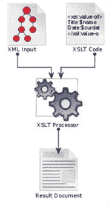

# 七、数据格式和类型

本章分为六大部分:

*   可扩展置标语言
*   肥皂
*   REST web 服务
*   数据
*   日期和时间
*   PHP SPL 数据结构

虽然这个主题不是 Zend 考试的三个高度重要的领域之一，但是你可以期待从这个部分中被问到一些相对详细的问题。

## 可扩展置标语言

XML 代表可扩展标记语言，是一种以结构化方式存储数据的方法。使用 XML 的一个优点是，它是一种公认的数据标准，因此是一种在系统之间交换数据的便捷方式。

在业界，作为数据交换过程，已经从 XML 转向 JSON，但是 XML 仍然与日常实践相关，并且是 Zend 考试的一部分。

### XML 的基础知识

这不是一本关于 PHP 的入门书，所以我不会极其详细地介绍 XML 的所有元素。如果我们深入到那个细节层次，这本书就太长了。确保您至少熟悉下表中的所有术语，因为我们在研究 PHP 的 XML 处理能力时会用到它们。

  
| 学期 | 描述 |
| --- | --- |
| 标准通用标识语言 | 标准化通用标记语言。XML 是它的一个子集。 |
| 文档类型声明 | DTD 用合法元素和属性的列表定义了 XML 文档结构的合法构件。 |
| 实体 | 实体可以声明在 XML 文档的其余部分中不允许的名称和值。例如，HTML 将`<`声明为一个实体来表示小于符号`<`。这些声明也可以用作快捷方式，并在整个文档中保持拼写和值的一致性。 |
| 元素 | 元素是 XML 文档的基本构造块。元素可以嵌套并包含元素，也可以包含值。元素可能有属性。 |
| 格式良好的 | XML 格式良好的文档是符合 XML 1.0 规范规定的语法规则的文档，因为它必须满足物理和逻辑结构。 [<sup>1</sup>](#Fn1) |
| 有效的 | 根据 DTD 验证的 XML 文档既“格式良好”又“有效”。 |

如果您对这些定义不太确定，那么请务必阅读关于 XML 的全面教程，并阅读本节的链接脚注。

### 格式良好且有效的

让我详细解释一下这些术语的意思，因为知道它们的区别很重要。

一个文件是良构的，如果:

*   它只有一个根元素
*   标签被正确地打开和关闭
*   根据以下列表，它的所有实体都是格式良好的:
    *   它们只包含正确编码的 Unicode 字符
    *   不会出现像`<`或`&`这样的语法标记
    *   标记名必须完全匹配，并且不能包含符号

如果文档格式良好并且符合 DTD，则该文档是有效的。

Note

PHP 不要求 XML 文档是有效的，但是它要求 XML 文档格式良好，以便用标准库来解析它们。

### XML 处理指令

处理指令允许文档包含应用的指令。它们包含在`<?`和`?>`标记中，看起来像这样，例如:

```php
<?PITarget PIContent?>

```

一个用例可能是通知应用某个元素是特定的数据类型，如下例所示:

```php
<?var type="string" ?>

```

最常见的用法是包含 XSLT 或 CSS 样式表，如下所示:

```php
<?xml-stylesheet type="text/xsl" href="style.xsl"?>
<?xml-stylesheet type="text/css" href="style.css"?>

```

### 用 PHP XSL 进行 XML 转换

PHP XSL 扩展允许 PHP 应用 XSLT 转换。

尽管这通常用于应用样式表，但重要的是要知道许多其他形式的转换也是可能的。

XSL 是一种表达 XML 文档样式表的语言。它类似于 CSS，因为它描述了如何显示 XML 文档。

XSL 定义了 XSLT，它是 XML 文档的转换语言，允许将 XML 文档处理成其他文档。

XSLT 处理器接收一个输入 XML 文件、一些 XSLT 代码，然后生成一个新文档。摘自维基百科知识共享的图 [7-1](#Fig1) 说明了这一点。



图 7-1。

XSLT processor

这方面的一个用例可以是创建一个可以由浏览器呈现的 XHTML 文档。

输入 XML 将从一个 PHP 程序接收，该程序包含关于从哪里检索 XSL 样式表的处理指令。浏览器将检索这个样式表，并在其中应用 XSLT 代码来生成 XHTML。

  
| 首字母缩略词 | 事实真相 |
| --- | --- |
| 可扩展样式表语言（Extensible Stylesheet Language 的缩写） | 表达样式表的语言 |
| 可扩展样式表语言转换 | 将 XML 处理成另一个 XML 文档的转换语言 |

PHP 手册 [<sup>2</sup>](#Fn2) 中有一个简单的例子，说明如何使用 PHP 通过 XSL 转换 XML 文件:

```php
<?php

$xslDoc = new DOMDocument();
$xslDoc->load("collection.xsl");

$xmlDoc = new DOMDocument();
$xmlDoc->load("collection.xml");

$proc = new XSLTProcessor();
$proc->importStylesheet($xslDoc);
echo $proc->transformToXML($xmlDoc);

```

### 用 PHP 解析 XML

PHP 中有两种类型的 XML 解析器。有几个解析 XML 的 PHP 扩展，但是它们都属于这两种类型之一。

所有的 PHP XML 扩展都使用相同的底层库，因此可以在它们之间传递数据。

所有 XML 例程都需要启用`LibXML`扩展和`Expat`库。这两者在 PHP 中都是默认启用的。

#### 树形分析器

树解析器试图一次解析整个文档，并将其转换成树结构。很明显，如果您试图解析一个非常大的文档，这可能会带来问题。

PHP 中有两种树解析器:

*   SimpleXML
*   数字正射影像图

#### 基于事件的分析器

这些解析器比树解析器更快，消耗的内存更少。它们通过一个节点一个节点地读取 XML 文档来工作，并为您提供了一个机会来挂钩与这个读取过程相关的事件。

基于事件的解析器的两个例子是:

*   的成员
*   XML Expat 解析器

XML Expat 解析器是一个基于非验证事件的解析器，也内置在 PHP 的核心中。它不需要 DTD，因为它不验证 XML，只要求 XML 格式良好。

#### 错误代码

PHP 手册 [<sup>3</sup>](#Fn3) 列出了几个 XML 错误代码。这个列表是底层`libxml`库的 733 个错误代码的子集。

这里是您应该熟悉的 XML 常量的部分列表，因为它们比其他代码更常见。

  
| 字首码 | 描述 |
| --- | --- |
| `XML_ERROR_SYNTAX` | XML 的格式不正确。 |
| `XML_ERROR_INVALID_TOKEN` | 您在 XML 中使用了无效字符。 |
| `XML_ERROR_UNKNOWN_ENCODING` | 无法解析您的 XML，因为无法确定编码方案。 |
| `XML_OPTION_CASE_FOLDING` | 默认情况下启用，并将元素名称设置为大写。 |
| `XML_OPTION_SKIP_WHITE` | 跳过源文档中多余的空白。 |

#### 字符编码

当 PHP 解析 XML 文档时，它会执行一个称为源代码编码的过程来读取文档。

支持三种编码形式:

*   UTF-8
*   ISO-8859-1(默认)
*   美国-阿斯凯

UTF-8 是一种多字节编码方案，这意味着单个字符可以由多个字节表示。其他两种方案都是单字节的。

PHP 在内部存储数据，然后在将数据传递给函数时执行目标编码。

默认情况下，目标编码设置为与源编码相同，但这是可以更改的。但是，在创建解析对象后，不能更改源编码。

如果解析器遇到源编码不能表示的字符，它将返回一个错误。

如果目标编码方案不能包含字符，那么该字符将被降级以适应编码方案。实际上，这意味着它们被一个问号所取代。

#### XML 扩展

XML 扩展允许您创建 XML 解析器和定义处理程序。您应该熟悉以下功能。

  
| 功能 | 使用 |
| --- | --- |
| `xml:parser_create($encoding)` | 用指定的编码创建 XML 分析器。 |
| `xml:parser_create_ns($encoding, $separator=":")` | 使用支持 XML 命名空间的指定编码创建 XML 分析器。 |
| `xml:parser_free($xmlparser)` | 释放 XML 解析器。 |
| `xml:set_element_handler($xmlparser, $start, $end)` | 这告诉解析器在 XML 文档中每个元素的开头和结尾调用哪个函数。您可以通过`FALSE`来禁用特定的处理程序。`$start`和`$end`都必须是可调用的，并且通常是存在于作用域中的函数的字符串名称。 |

处理元素开始的函数必须接受三个参数:

*   XML 解析器资源
*   一个字符串，它将包含正在分析的元素的名称
*   元素具有的属性数组

结束处理函数必须接受两个参数:

*   XML 解析器资源
*   一个字符串，它将包含正在分析的元素的名称

`xml:set_object($xmlparser, $object)`函数允许在对象中使用 XML 解析器。这意味着您可以将对象的方法设置为用于设置元素处理程序的函数。

`xml:parse_into_struct($parser, $xml, $valueArr, $indexArr)`函数将 XML 字符串解析成两个并行的数组结构，一个(index)包含指向 values 数组中适当值的位置的指针。这最后两个参数必须通过引用传递。

### 数字正射影像图

DOM 是文档对象模型的缩写。`DOMDocument`类对于处理 XML 和 HTML 很有用。

它使用 UTF-8 编码，需要`libxml2`扩展(Gnome XML 库)和`expat`库。它是一个树解析器，在创建内部树表示之前将整个文档读入内存。

下面是一些`DOMDocument`语法的基本示例:

```php
<?php
$domDoc = new DomDocument();
$domDoc->load("library.xml");
// $domDoc->loadXML($xmlString);
// $domDoc->loadHTMLFile("index.html");
// $domDoc->loadHTML($htmlDocumentString);
$domDoc->save(); // (to a file in XML format)
$xmlString = $domDoc->saveXML();
$htmlDocumentString = $domDoc->saveHTML();
$domDoc->saveHTMLFile(); // (to a file in HTML format)
$xpath = new DomXpath($dom);
$elements = $xpath->query("//*[@id]"); // find all elements with an id
echo "I found {$result->length} elements<br>";
if (!is_null($elements)) {
    foreach ($elements as $element) {
        echo "<br/>[". $element->nodeName. "]";

        $nodes = $element->childNodes;
        foreach ($nodes as $node) {
            echo $node->nodeValue. "\n";
        }
    }
}

```

您应该熟悉 DOM 类的以下方法:

  
| 方法 | 描述 |
| --- | --- |
| `createElement` | 创建一个节点元素，该元素可以用 node 类的`appendChild`方法追加。 |
| `createElementNS` | 与`createElement`一样，但是支持带有名称空间的文档。 |
| `saveXML` | 将 XML 树转储回字符串。 |
| `save` | 将 XML 树转储回文件中。 |
| `createTextNode` | 创建类`DOMText`的新实例。 |

#### DOM 节点

`DOMNode`类用于处理 DOM 树中的节点。

您可以通过调用`DOMDocument`的这些方法之一来检索节点:

*   `getElementById`
*   `getElementsByTagName`
*   `getElementsByTagNameNS`

这些方法返回一个`DOMNodeList`对象，可以使用`foreach()`遍历该对象。

`getElementById()`函数要求您指定哪个属性属于类型`id`。你可以通过包含一个定义它的 DTD 或者通过调用`setIdAttribute()`函数来做到这一点。无论是哪种情况，都必须验证文档才能调用函数。

当使用`insertBefore()`插入一个节点作为兄弟节点时，您需要引用父节点并指定您想要在之前插入新节点的兄弟节点。此示例显示了语法:

```php
<?php
$xmlString = <<<XML
<root>
<teams>
<team>Silverbacks</team>
<team foo="winner">Golden Eyes</team>
</teams>
</root>
XML;

$domDoc = new DOMDocument();
$domDoc->loadXML($xmlString);
$xpath = new DomXPath($domDoc);
$team2 = $xpath->query('teams/team[2]');
$parent = $xpath->query('teams');
$textElement = $domDoc->createElement('team', 'Bearhides');
$parent->item(0)->insertBefore($textElement, $team2->item(0));

```

在本例中，我们希望在两个现有团队之间插入一个新团队。为此，我们找到了团队和家长。

Note

这些变量包含`DOMElements`。我们不能使用`parent()`方法，因为它是在`DOMNode`类上定义的。

您应该熟悉`DOMNode`类的这些方法。

  
| 方法 | 描述 |
| --- | --- |
| `appendChild` | 在子节点的末尾添加一个新的子节点。 |
| `insertBefore` | 在引用节点前添加新的子节点。 |
| `parentNode` | 节点的父节点，如果没有父节点，则为 null。 |
| `cloneNode` | 克隆一个节点，也可以克隆它的所有后代节点。 |
| `setAttributeNS` | 将名称空间为`namespaceURI`且名称为`name`的属性设置为给定值。如果该属性不存在，将会创建它。 |

Note

您需要将一个节点作为参数传递给这些函数。

如果你试图使用`appendChild()`，那么你必须首先使用一个类似`DOMDocument::createElement()`的函数来创建节点。

### SimpleXML

SimpleXML 是一个扩展，它牺牲了对复杂需求的健壮处理，而支持提供一个简单的接口。它需要 simpleXML 扩展，并且只支持 XML 规范的 1.0 版本。

Caution

是一个树解析器，在解析文档时将整个文档加载到内存中。这可能使它不适合非常大的文档。

SimpleXML 提供了一种面向对象的方法来访问 XML 数据。它创建的所有对象都是`SimpleXMLElement`类的实例。元素成为这些对象的属性，属性可以作为关联数组来访问。

#### 创建 SimpleXML 对象

您可以使用过程方法或通过面向对象的方法创建 SimpleXML 对象:

```php
<?php
// procedural from string variable
$xml = simple_xml:load_string($string_of_xml);
// procedural from file
$xml = simple_xml:load_file('filename.xml');
// object oriented from variable
$xml = new SimpleXMLElement($string_of_xml);

```

#### 迭代 SimpleXML 对象

`children()`方法返回子对象的可遍历数组。

您可以创建一个算法来检查节点的子节点，然后递归地遍历它们。PHP 手册页上有这样一个例子。

#### 检索信息

  
| 功能 | 行动 |
| --- | --- |
| `SimpleXMLElement::construct()` | 创建一个新的`SimpleXMLElement`对象。 |
| `SimpleXMLElement::attributes()` | 标识元素的属性。 |
| `SimpleXMLElement::getName()` | 检索元素的名称。 |
| `SimpleXMLElement::children()` | 返回给定节点的子节点。 |
| `SimpleXMLElement::count()` | 返回一个节点有多少个子节点。 |
| `SimpleXMLElement::asXML()` | 以格式良好的 XML 字符串形式返回元素。 |
| `SimpleXMLElement::xpath()` | 在当前节点上运行`xpath`查询。 |

#### 语言

XPath [<sup>4</sup>](#Fn4) 是一种定义 XML 文档各部分的语言。它将 XML 文档建模为一系列节点，并使用路径表达式在文档中导航和选择节点。

`SimpleXMLElement::xpath()`对 XML 数据运行 XPath 查询，并返回与指定路径匹配的子数组。

W3Cschools 的网站上有 XPath 用法的例子。 [<sup>5</sup>](#Fn5)

应该注意，与 PHP 结构不同，XPath 结果不是从零开始的。XPath `/college/student[1]/name`将返回第一个学生，而不是第二个学生，如果它是从零开始的，就会出现这种情况。

包含`xpath`结果的 PHP 数组是从零开始的。换句话说，如果您将结果存储在名为`$array`的数组变量中，那么`$array[0]`将对应于上例中的`college/student[1]/`名称。

您可以使用这样的 XPath 来检索文本值:`/college/student/name[text()]`。

您可以像这样指定范围:`/college/student[attendance<80]/name`。

#### 在 DOM 和 SimpleXML 之间交换数据

函数`simple_xml:import_dom()`将把一个 DOM 节点转换成一个`SimpleXML`对象。

您可以使用`dom_import_simplexml()`将`SimpleXML`对象转换为 DOM。

## 肥皂

SOAP [<sup>6</sup>](#Fn6) 最初是简单对象访问协议的首字母缩写。业界发布了 1.0 和 1.1 版本。从版本 1.2 开始，该标准由 W3C 控制，缩写已经消失，使得 SOAP 只是一个普通的名称。

PHP SOAP 扩展用于编写 SOAP 服务器和客户端。它要求启用`libxml`，这是默认 PHP 安装的情况。

SOAP 缓存功能在`php.ini`文件中用`soap.wsdl_cache_*`设置进行配置。

如果 SOAP 可用，那么它会提供一组预定义的常量。这些常量与 SOAP 版本、编码、身份验证、缓存和持久性相关。

只有两个 SOAP 函数:

*   `is_soap_fault()`返回 SOAP 调用是否失败。
*   `use_soap_error_handler()`用于 SOAP 服务器，并设置 PHP 是否应该使用 SOAP 错误处理程序。如果设置为 false，则使用 PHP 错误处理程序，而不是向客户端发送 SOAP 错误。

SOAP 的其余功能在类中提供。

### 肥皂有什么作用

SOAP 允许定义和交换复杂的数据类型，并为各种消息传递模式提供了一种机制，其中最常见的是远程过程调用(RPC)。

这实际上允许开发人员在服务器上执行一个函数，将复杂数据作为参数传递给它，并接收复杂数据。

SOAP web 服务是由 WSDL (Web 服务描述语言)定义的。大多数人把这个首字母缩略词读作“whizz-dill”。

WSDL 使用 XML 结构定义数据类型。它还描述了可以远程调用的方法，指定了它们的名称、参数和返回类型。

服务器和客户端之间的 SOAP 消息以称为 SOAP 信封的 XML 结构发送。

### 使用 SOAP 服务

`SoapClient`类用于连接和使用 SOAP 服务。

可以解析一个 WSDL 文件来发现哪些方法是可用的，然后以一种易于使用的方式呈现给你。

```php
<?php
$client = new SoapClient("http://example.com/login?wsdl");
$params = array('username'=>'name', 'password'=>'secret');
// call the login method directly
$client->login($params);

// If you want to call __soapCall, you must wrap the arguments in another array as follows:
$client->__soapCall('login', array($params));

```

在前面的示例中，我们连接到一个示例 WSDL，并使用两种不同的方法调用 login 方法。注意，使用`SoapClient::__soapCall()`方法需要将参数包装在一个数组中。

SOAP 服务提供 WSDL 并不是强制性的。如果需要使用这样的服务，可以将 null 作为 WSDL 文件传递，但是需要提供关于服务端点的信息。您必须提供位置和 URI 选项，并且可以选择提供有关 SOAP 服务版本的其他信息，如下例所示:

```php
<?php
$client = new SoapClient(null,
    ['location' => 'http://example.com/soap.php',
        'uri' => 'http://test-uri/',
        'style'    => SOAP_DOCUMENT,
        'use'      => SOAP_LITERAL));
    ]);

```

当构造`SoapClient`类时，可以将 trace 参数设置为 true，以便调试原始 SOAP 信封头和主体。

以下两个调试命令要求跟踪为真，并允许您检查请求的详细信息:

*   `SoapClient::__getLastRequestHeaders()`
*   `SoapClient::__getLastRequest()`

### 提供肥皂服务

`SoapServer`类提供一个 SOAP 服务器。它支持版本 1.1 和 1.2，并且可以在有或没有 WSDL 服务描述的情况下使用。

下面是一个设置 SOAP 服务器的示例:

```php
<?php
$options = ['uri'=>'http://localhost/test'];
$server = new SoapServer(NULL, $options);
$server->setClass('MySoapServer');
$server->handle();

```

我们可以看到，我们首先创建了带有一系列选项的服务器。在本例中，我们没有在第一个参数中提供 WSDL，因此我们必须在选项数组中提供服务器名称空间的 URI。

一旦我们有了一个`SoapServer`类的实例，我们就传入它将用来服务请求的类名。连接到服务器的 SOAP 客户端可以调用该类中的方法。

除了设置一个类之外，你还可以使用一个具体的对象来处理 SOAP 请求，方法是用`SoapServer::setObject()`函数将它作为一个参数传递。

## REST Web 服务

REST 是表述性状态转移的缩写，是一种架构风格，而不是 PHP 扩展或命令集。REST 有几个旨在提高 web 服务性能和可维护性的约束。

Tip

将“面向服务的架构”与“微服务架构”进行比较，前者通常在 SOAP 中实现，后者通常在 REST 中实现。

REST 有几个类似于 HTTP 请求类型的动词。这导致了一些混乱，但是需要注意的是，REST 并不一定要使用 HTTP 作为传输层来进行通信。HTTP 恰好对 REST 非常方便，因为它是无状态的，请求类型可以很好地转换成 REST 动词。

REST 公开了链接到资源的统一资源标识符(URI)。这些链接被称为 REST 端点。根据用来访问它们的 HTTP 类型，它们将对资源执行一个动作(改变它的状态)。HTTP 类型用于通知要执行的 REST 动词。

REST 关注资源并提供对这些资源的访问。资源可以是类似于“用户”的东西。就像数据库模式表示用户实体一样，REST 将在 JSON 或 XML 结构中表示用户。

一个表示应该是服务器和客户端都可读的。REST 可以用来传输 JSON 和/或 XML。我们稍后会更详细地讨论这个问题。

在 PHP 中，REST APIs 最常见的用途之一是为支持 AJAX 的前端提供服务，比如用 Angular 或 ReactJS 编写的前端。

### 应用和资源状态

REST 服务器不应该记住应用的状态，客户机应该发送执行所需的所有信息。

这意味着对服务器的每个请求都是独立的。如果对服务器的请求失败，不会影响其他请求的成功或失败。这提高了应用的可靠性。

服务器不负责记住应用处于什么状态，而是依赖客户端发送处理请求所需的所有信息。这意味着客户端存储和维护应用状态(而不是服务器)。

应用无状态对水平伸缩有着重要的影响。因为没有单独的服务器维护状态，所以请求可以到达组中的任何服务器并被正确处理。

REST 提供访问的资源的状态应该在请求之间持续。资源状态在服务器上维护。

### 休息动词

REST 有几个用于改变服务器上资源状态的动词。

动词既可以作用于单个资源，也可以作用于一组资源。

     
| 资源 | `GET` | `PUT` | `POST` | `DELETE` |
| 募捐 | 列出您可以从中检索成员的 URIs | 用另一个集合替换该集合 | 在集合中创建新条目 | 删除整个集合 |
| 单一实体 | 检索单个元素的表示 | 替换该元素，如果它不存在，则创建它 | 创建新成员 | 删除成员 |

`PUT`和`POST`看起来很相似，但是有一个重要的区别。`POST`要求您为一个元素指定所有必需的属性，并将创建一个新元素。`PUT`将替换您为现有记录指定的属性，除非您正在创建新记录，否则您不需要提供所有属性。

为了举例说明，让我们考虑一个有名字和头衔的用户。首先，我们`POST`创建一个名为“Alice”、头衔为“Mrs”的新用户。然后爱丽丝毕业了，成为了一名医生，所以我们`PUT`到她的记录中，只包括了“博士”这个头衔。我们不需要指定她的名字，因为我们不需要，她的名字也不会被改变。

### 恨死我了

HATEOAS 代表“超文本是国家的引擎”。在这个概念中，来自服务器的响应将包括关于客户端接下来可以采取什么动作的信息。这些选项将用超文本标记出来。

目的是让客户不需要预先知道`REST`服务的端点。相反，当他们进行查询时，将为他们提供通过应用所需的端点。

让我们考虑一个例子:

```php
GET /account/12345 HTTP/1.1

HTTP/1.1 200 OK
<?xml version="1.0"?>
<account>
<account_number>12345</account_number>
<balance currency="usd">100.00</balance>
<link rel="deposit" href="/account/12345/deposit" />
<link rel="withdraw" href="/account/12345/withdraw" />
<link rel="transfer" href="/account/12345/transfer" />
<link rel="close" href="/account/12345/close" />
</account>

```

在前面的例子中，从 HATEOAS， [<sup>7</sup>](#Fn7) 上的维基百科页面，我们正在检索一个银行账户的信息。服务器用可用于进一步操作的 URIs 列表进行响应。例如，如果帐户余额为负，服务器可能不包括取款的链接。服务器通过暴露与上一次操作相关的附加 URIs 来引导客户端通过 API。

### 请求标题

HTTP 允许在其请求中传递标头。REST 客户机将使用这些来指示服务器它们正在提供什么以及它们期望得到什么。

REST 客户机应该使用 accept 头向服务器指出它想要返回哪种内容(表示)。例如，如果客户机将 accept 头设置为`text/xml`，它就告诉服务器它需要一个 XML 格式的响应。

客户端还将设置一个`Content-Type`头，通知服务器其有效负载的 MIME 类型。有关更多详细信息，请参见响应标题中的部分。

### 回应标题和代码

`Content-Type`头是由服务器发送的，它定义了被发送的主体的 MIME 类型。例如，服务器可以将`content-type`设置为`application/json`,以表明响应的主体包含 JSON 格式的文本。

服务器还将设置一个状态代码，通知客户端请求的结果。这里列出了一些常见的代码，但还有更多。 [<sup>8</sup>](#Fn8)

  
| 密码 | 意义 |
| --- | --- |
| `200` | 请求处理成功 |
| `201` | 资源已创建 |
| `202` | 资源已接受处理，但尚未处理 |
| `400` | 错误的请求(客户端错误) |
| `401` | 未经授权；客户端在访问该资源之前必须进行自我验证 |
| `403` | 禁止；客户端已经对自己进行了身份验证，但是没有权限访问该资源 |
| `500` | 服务器或应用错误 |

Tip

在响应正文中发送与 HTTP 响应代码相矛盾的消息是非常糟糕的做法。

在 Zend 框架中，术语“上下文切换”指的是根据程序是响应 REST 请求还是其他请求来改变程序的输出。

例如，对于普通请求，您可以用 HTML 页面来响应，如果请求是通过`XMLHttpRequest` (AJAX)发出的，您可以用 JSON 来响应。

您也可以用 XML 或 JSON 来响应，这取决于客户机指示它需要什么类型的内容作为响应。

另一个例子是用不同的布局来响应，这取决于使用的是哪种浏览器(例如，移动设备还是桌面设备)。

您应该熟悉服务器对同一 URL 的调用做出不同响应的概念，这取决于客户端如何设置其请求。

### 发送请求

`curl`扩展是 PHP 中发送 REST 请求的常用方式。Curl 允许您指定头和请求类型。

有包装了`curl`函数的库。其中比较受欢迎的是 Guzzle， [<sup>9</sup>](#Fn9) 这款软件安装和使用都很简单。它提供了非常广泛的特性，在我撰写本文时，我认为它是 PHP 请求客户端的最佳选择。

## 数据

JSON 是 JavaScript 对象符号的首字母缩写。在 PHP 中，它经常与 Ajax 一起使用，Ajax 是异步 JavaScript 和 XML 的缩写。

JSON 允许您将对象序列化为字符串，以便它可以在服务之间传输。Ajax 是传输字符串的一种方式。

这些技术一起允许您在浏览器中的 JavaScript 应用和服务器上的 PHP 应用之间进行通信。

缺省情况下，JSON 扩展加载在 PHP 中，并提供处理与 JSON 相互转换的方法。

它提供了许多常量，包括:

  
| 常数 | 意义 |
| --- | --- |
| `JSON_ERROR_NONE` | 确认是否发生了 JSON 错误。 |
| `JSON_ERROR_SYNTAX` | 确认解析 JSON 时是否有语法错误，并帮助检测编码错误。 |
| `JSON_FORCE_OBJECT` | 如果一个空的 PHP 数组被编码，这个选项将强制它被编码为一个对象。 |

该扩展提供了三个功能。

`json_decode()`将一个字符串作为第一个参数，并返回一个对象。如果第二个参数设置为 true，它将返回一个关联数组。

从 PHP 5.3 开始，提供了两个额外的选项— `$depth`和`$options`。深度是指递归深度，目前唯一的选择是`JSON_BIGINT_AS_STRING`，它将大整数的浮点数转换为字符串。

如果超过递归深度，`json_decode()`将返回`NULL`，`json_last_error_msg()`将返回`"Maximum stack depth exceeded"`。如果阵列的层数超过您指定的可接受深度，就会发生这种情况。

例如，考虑以下代码:

```php
<?php
$arr = [
    "fruits" => [
        "apple" => ["taste" => "sweet", "color" => "yellow"],
        "banana" => ["taste" => "sour", "color" => "green"],
        "cherry" => ["taste" => "sweet", "color" => "red"]
    ],
    "vegetables" => "yuck"
];
$str = json_encode($arr);
$decode = json_decode($str, true, 1);
echo json_last_error_msg(); // Maximum stack depth exceeded

```

该数组有两层，因为每个水果都包含一个数组。我们指定只解码一个深度级别，因此`$decode`将是`NULL`，脚本将输出`"Maximum stack depth exceeded"`。

`json_encode()`将任何类型的变量(除了资源)作为参数，并返回 JSON 表示。它有两个可选参数——`$depth`和`$options`——与前面描述的相同。

`json_last_error()`返回前一个函数中出现的最后一个错误代码，而`json_last_error_msg()`返回一个字符串消息。

Tip

记住第 6 章的内容，JSON 是序列化传输到客户端的数据的首选方式。

## 日期和时间

PHP 提供了几个从服务器获取日期和时间的函数。您应该在配置中设置一个默认时区，或者在运行时在脚本中设置它。您应该设置时区来匹配您的服务器所在的时区，以便 PHP 可以正确地解释服务器时间。这也让您的脚本知道夏令时等调整。

PHP 5.2 引入了`DateTime`类，它处理大范围的日期和时间计算。建议使用这个类，而不要使用像`date()`和`time()`这样的函数。

要创建一个新的`DateTime`对象，您可以向它传递一个它可以解析的字符串。它可以理解多种字符串格式，如下例所示:

```php
<?php
$strings = [
    'Next monday',
    'Yesterday',
    '', // now
    '2016-12-25',
    '25 December 2016',
    '-1 week',
    '+1 days'
];
foreach ($strings as $example) {
    $dateTime = new DateTime($example);
    echo $dateTime->format(DateTime::COOKIE) . PHP_EOL;
}

```

本例中数组中的所有字符串都将被理解。

如果日期格式不明确，那么您可以使用`DateTime::createFromFormat()`命令来创建对象。

例如，日期 2013 年 6 月 3 日将被一个美国人写成 06-03-2013，而世界上的其他人将写成 03-06-2013。如果您向 PHP 提供这些字符串中的任何一个，它都不知道您是指 2013 年 6 月 3 日还是 2013 年 3 月 6 日。

要解决这种不确定性，您可以指定在字符串中使用哪种格式，如下所示:

```php
<?php
$dateTime = DateTime::createFromFormat('d-m-Y', '06-03-2013');
echo $dateTime->format(DateTime::COOKIE);

```

该脚本将输出类似于欧洲中部时间 2013 年 3 月 6 日星期三 12:56:42 的内容。注意，如果您在创建一个`DateTime`类时省略了时间，将使用脚本运行的时间。

### 格式化日期

在这些例子中，我们使用了由`DateTime`提供的一个类常量来格式化我们的日期。

手册中列出了这些常量，它们是日期显示或存储的常见用例。它们出现在下表中:

  
| 常数 | 格式 |
| --- | --- |
| `ATOM` | `Y-m-dTH:i:sP` |
| `COOKIE` | `l, d-M-Y H:i:s T` |
| `ISO8601` | `Y-m-dTH:i:sO` |
| `RFC822` | `D, d M y H:i:s O` |
| `RFC850` | `l, d-M-y H:i:s T` |
| `RFC1036` | `D, d M y H:i:s O` |
| `RFC1123` | `D, d M Y H:i:s O` |
| `RFC2822` | `D, d M Y H:i:s O` |
| `RFC3339` | `Y-m-dTH:i:sP` |
| `RSS` | `D, d M Y H:i:s O` |
| `W3C` | `Y-m-dTH:i:sP` |

这些是字符串常量，包含日期和时间格式代码。格式化代码被替换为一个由`DateTime`类生成的值。例如，符号“Y”被替换为存储日期的四位数年份。

显然，声明常量的目的是让你不必去记忆字符串，所以不用担心学习格式。我包含了格式化字符串，因为它们很好地表明了常用的格式。

日期和时间格式代码区分大小写。例如，“Y”是两位数的年份，“Y”是四位数的年份。

格式化字符串中未被识别为格式化字符的字符将被原封不动地放入输出中。因此，字符串“Y-m-d”在输出时将包括年、月和日之间的连字符，就像这样“2015-12-25”。

您可以在手册页上找到 PHP 日期和时间格式代码的列表， [<sup>10</sup>](#Fn10) ，但这里是上表中的那些:

   
| 密码 | 用…替换 | 示例 |
| --- | --- | --- |
| `Y` | 整整四位数的年份 | One thousand nine hundred and ninety-nine |
| `M` | 两位数的月份，带前导零 | 06 |
| `d` | 一个月中的某一天，带前导零的两位数 | Fourteen |
| `D` | 三个字母的文本日 | 杀了他，Wed |
| `H` | 带前导零的 24 小时制小时 | 00, 09, 12, 23 |
| `i` | 两位数的分钟，带前导零 | 05,15,25,45 |
| `s` | 两位数秒，带前导零 | 05,15,25,45 |
| `P` | 与格林威治时间(GMT)的差异，小时和分钟之间有冒号(PHP 5.1.3+) | +02:00 |
| `O` | 与格林威治时间(GMT)的时差(小时) | +0200 |
| `T` | 时区缩写 | 是啊，这个 |

### 日期计算

使用`DateTime`类方法`modify()`可以执行最简单的计算。例如，要查找一个月后的日期和时间，您可以执行以下操作:

```php
<?php
$dateTime = new DateTime();
$dateTime->modify('+1 month');
echo $dateTime->format(DateTime::COOKIE) . PHP_EOL;

```

然而，PHP 提供了一种更加灵活的方式来处理日期计算。

`DateInterval`类用于存储固定的时间量(年、月、日、小时等)。)或一个相对时间字符串，其格式为`DateTime`的构造函数支持的格式。

`DateTime`类允许你从`DateTime`中`add()`或`sub()`出一个`DateInterval`。它将处理闰年和其他时间调整，同时这样做。

为了在创建一个`DateInterval`对象时指定一个固定的时间量，我们向它的构造函数传递一个字符串。该字符串总是以`P`开头，然后以降序列出每个日期单元的编号。可选地，出现字母`T`，然后包括时间单位。

举几个例子来说明这一点更有意义:

  
| 线 | 描述 |
| --- | --- |
| `P14D` | 14 天 |
| `P2W` | 两周 |
| `P2W5D` | 这是无效的；不能在一个字符串中同时指定周和日；这些星期将被忽略 |
| `P2WT5H` | 两周零五个小时 |
| `P1Y2M3DT4H5M` | 一年，两个月，三天，四小时，五分钟 |

请注意:

*   每个字符串都以 P 开头
*   单位数位于表示单位的字母之前
*   时间单位通过字母 T 与日期单位分开
*   单位按降序排列

下面是一个代码示例:

```php
<?php
$dateTime = DateTime::createFromFormat('d-m-Y H:i:s', '01-12-2016 13:14:15');
$dateInterval = new DateInterval('P1M2DT3H4M5S');
$dateTime->add($dateInterval);
echo $dateTime->format(DateTime::COOKIE) . PHP_EOL;

```

此代码输出日期和时间，即 12 月 1 日 13:14:15 之后的一个月、两天、三小时、四分钟和五秒。

### 手动日期计算

有时，您需要使用 UNIX 风格的时间戳。这个时间戳是一个数字，它保存了自 UNIX 纪元 1970 年 1 月 1 日以来经过的秒数。时间戳的一个优点是它不受时区的限制。

有几个 PHP 函数可以让你创建一个时间戳。`strtotime()`函数是一种非常灵活的将日期时间描述转换成时间戳的方法。它足够智能，可以识别像“下周一”或“+1 年”这样的短语，以及像“2017 年 4 月 1 日”这样更普通的字符串。

`mktime()`函数接受每个小时、分钟、秒、月、日或年的参数。`mktime()`返回给定参数的 UNIX 时间戳。如果参数无效，函数返回`FALSE`。

请注意，参数的顺序不会随着单元大小的增加而增加，而是按照“h i s m d y”的顺序。

您可以从右到左省略参数，在这种情况下，它们将默认为当前日期值。所以如果当前年份是 2016 年，你在没有指定年份的情况下调用`mktime()`，PHP 会假设你指的是 2016 年。

如果您传递给`mktime()`的参数大于允许的值，`mktime()`会认为您引用的是下一个周期。

例如，十二月有 31 天。如果您调用`mktime(0, 0, 0, 12, 32, 2016)`，那么您将获得下个月第一天的时间戳；换句话说，2017 年 1 月 1 日。

### 比较日期

`DateTime::diff()`方法允许您比较两个`DateTime`对象之间的差异。它返回一个`DateInterval`,包含所表示的两个日期之间的时间段。

注意，`DateTime`类为您处理时区和夏令时转换。

让我们试着找出离圣诞节还有多长时间。

```php
<?php
$now = new DateTime();
$christmas = new DateTime('25 december');
if ($now > $christmas) {
    $christmas = new DateTime('25 december next year');
}
$interval = $christmas->diff($now);
// 97 days until Christmas
echo  $interval->days . ' days until Christmas' . PHP_EOL;

```

请注意这段代码中的以下内容:

*   不向构造传递任何参数都使用当前日期和时间。
*   我们可以使用像`>`、`<`和`==`这样的数学运算符来比较`DateTime`对象。
*   当创建一个`DateTime`时，我们可以使用相当灵活的语言，例如“明年 12 月 25 日”用于当前日期在圣诞节和新年之间的情况。
*   `diff()`方法返回一个`DateInterval`。
*   对象有许多公共属性，可以访问这些属性来度量年、月，在本例中是天。

## PHP SPL 数据结构

标准 PHP 库(SPL)是用来解决常见问题的接口和类的集合。它包括几个帮助你处理标准数据结构的类。

### 与数据结构相关的接口

在我们看 SPL 数据结构类之前，有必要看一下它们实现的一些接口。这使得记住这些类有什么功能变得相当容易。

#### 迭代程序

`Iterator`接口扩展了`Traversable`接口。

`Iterator`接口 [<sup>11</sup>](#Fn11) 定义了用于在集合中移动的五种方法。

  
| 方法 | 目的 |
| --- | --- |
| `current` | 返回当前元素 |
| `key` | 返回当前元素的键 |
| `next` | 向前移动到下一个元素 |
| `rewind` | 将迭代器倒回到第一个元素 |
| `valid` | 检查当前位置是否有效 |

#### 可穿越

实现可遍历接口 [<sup>12</sup>](#Fn12) 的类可以使用`foreach()`进行循环。

这个接口不能自己实现，它只能通过实现一个告诉类如何迭代集合的接口来实现。

实际上，这意味着要实现可遍历接口，您必须实现`Iterator`或`IteratorAggregate`接口。

#### 数组式访问

该接口提供了以数组形式访问对象的能力。为此，您需要实现四种方法:

  
| 方法 | 目的 |
| --- | --- |
| `offsetExists` | 偏移是否存在 |
| `offsetGet` | 要检索的偏移量 |
| `offsetSet` | 为指定的偏移量赋值 |
| `offsetUnset` | 取消偏移设置 |

如果您的类实现了此接口，那么您将能够在引用从它实例化的对象时使用数组语法。

#### 可数的

如果您的类实现了`Countable`接口，您将能够使用`count()`函数来找出它有多少个元素。

`Countable`接口有一个名为`count`的抽象方法。当你在一个对象上调用 PHP 函数`count()`时，这个方法将被调用，这个对象是从一个实现接口的类实例化而来的。

```php
<?php
class BadCount implements Countable
{
  public function count()
  {
    return 42;
  }
}
$a = new BadCount;
echo count($a);  // 42

```

在这个简单的例子中，这个类中的`count()`方法总是返回数字`42`。在一个更复杂的例子中，我们可以在这里实现逻辑，定义如何返回对象的计数。

### 列表

列表是元素的有序集合。同一个值可能在一个列表中出现多次。双向链表中的每个元素都包含一个到链中上一个和下一个元素的链接。

`SplDoublyLinkedList` [<sup>13</sup>](#Fn13) 类实现了`Iterator`、`ArrayAccess`和`Countable`接口。此外，它还实现了一些方法，让您可以更改迭代器的行为，以及在列表的前面或后面添加或删除条目。

`SplStack`类 [<sup>14</sup>](#Fn14) 扩展了`SplDoublyLinkedList`类。它本质上是一个`SplDoublyLinkedList`，你调用了`setIteratorMode()` [<sup>15</sup>](#Fn15) ，并设置列表使用`IT_MODE_LIFO`进行迭代，并在模式`IT_MODE_KEEP`下运行。这告诉迭代器像堆栈一样遍历列表(后进先出)，遍历元素而不是删除它们。

`SplQueue`类 [<sup>16</sup>](#Fn16) 也扩展了`SplDoublyLinkedList`类。它实现了方法`enqueue`和`dequeue`，这两个方法分别将一个元素添加到队列的末尾或删除队列前面的元素。

Caution

`SplStack`和`SplQueue`类都继承自`SplDoublyLinkedList`类，所以你可能会错误地调用它们的错误方法。

这里有一个使用堆栈的例子，展示了一些你可以使用的方法。下表显示了堆栈中包含的值。

  
| 密码 | 堆栈包含 |
| --- | --- |
| `<?php` |  |
| `$stack = new SplStack();` | `Null` |
| `$stack->push(5);` | `5` |
| `// this uses array syntax to add a new element` |  |
| `$stack[] = 4;` | `5, 4` |
| `// now we push another number to the end of queue` |  |
| `$stack->push(3);` | `5, 4, 3` |
| `// this inserts the number 100 into position 1` |  |
| `// elements below it are shuffled down` |  |
| `$stack->add(1, 100);` | `5, 100, 4, 3` |
| `// this returns the last value in the queue` |  |
| `echo "Pop: " . $stack->pop() . PHP_EOL;` | `0, 100, 4` |
| `foreach ($stack as $key => $value) {` |  |
| `echo "$key => $value" . PHP_EOL;` |  |
| `}` |  |

这段代码的输出如下:

```php
Pop: 3
2 => 4
1 => 100
0 => 5

```

Note

密钥以降序(2，1，0)包含在堆栈中。

### 很

堆是树状结构，其中父节点可以有零个、一个或多个子节点。堆定义了一个比较规则，允许您确定一个节点是大于还是小于另一个节点。在堆中，父节点总是等于或大于其子节点。比较函数用于确定一个节点是大于还是小于另一个节点。

Note

`SplHeap`类是一个抽象类。使用时需要实现`compare`函数。

`SplHeap`类实现了`Iterator` [<sup>17</sup>](#Fn17) 接口，这意味着您可以使用`foreach()`在其中移动。

`SplMaxHeap`类从`SplHeap`扩展而来，在顶部保持最大值。它通过为您实现`compare()`功能来实现这一点。同样，`SplMinHeap`类将最小值保持在顶部。

Note

`SplMinHeap`和`SplMaxHeap`只是扩展了`SplHeap`并实现了`compare()`来提供定向排序的类。

让我们看一个简单的堆的例子:

```php
<?php
class MyHeap extends SplHeap
{
  function compare($a, $b)
  {
    return $a <=> $b;
  }
}

$heapExample = new MyHeap;
$heapExample->insert(10);
$heapExample->insert(5);
$heapExample->insert(15);

while ($heapExample->valid()) {
  echo $heapExample->current() . PHP_EOL;
  $heapExample->next();
}

```

这段代码按照降序输出数字，因为当我们插入数字时，它会应用`compare()`函数来确定将它们放在哪里。

Note

如果我们修改代码并扩展`SplMinHeap`或`SplMaxHeap`而不是`SplHeap`，输出与之前的代码相同！

我可以听到你烦恼地说`SplMinHeap`应该把最低的值放在最上面，那么为什么输出显示 15 仍然在最上面呢？答案是因为`SplMinHeap`和`SplMaxHeap`类提供的只是`compare()`函数的默认实现，我们在类定义中覆盖了它。

您可以扩展`SplMinHeap`,但是只要您的`compare()`函数保持不变，就像前面的例子一样，您将始终拥有一个最大堆。为了获得一个最小堆的工作实现(在我们的例子中)，你需要或者交换飞船操作符的操作数，或者完全避免实现`compare()`函数，而使用在`SplMinHeap`中声明的函数。

### 数组

`SplFixedArray` [<sup>18</sup>](#Fn18) 结构以连续的方式存储数据，可通过索引访问。它比普通的 PHP 数组更快，但也不太灵活，因为它是固定长度的，只能使用整数作为索引。

`SplFixedArray`类实现了`Iterator`接口和`ArrayAccess`接口。

### 地图

映射是一种保存键值对的结构。PHP 数组是一种映射，因为它存储整数(或字符串)键的值。

`SplObjectStorage`提供了从对象到数据的映射，或者如果您忽略数据，它可以作为一个对象集。

`SplObjectStorage`不是抽象类，可以直接实例化。它实现了`Countable`、`Iterator`、`Serializable`和`ArrayAccess`接口。

因为它实现了`ArrayAccess`接口，所以您可以使用数组语法来引用结构内部对象的数据，如下所示:

```php
<?php
$bucket = new SplObjectStorage();
$file = new StdClass;
$metaData = ['name' => 'passwords.xslx', 'size' => '102400'];
$bucket[$file] = $metaData;

```

在本例中，我们将数据(元数据)映射到一个对象的特定实例(文件)。

### SPL 数据结构概述

  
| [T2`SplHeap`](http://php.net/manual/en/class.splheap.php) | 堆是一个树集合，其中父级的子级必须始终具有低于其父级的值。有不同类型的堆。 |
| [T2`SplMaxHeap`](http://php.net/manual/en/class.splmaxheap.php) | 这是一种最大值保存在堆顶部的堆。 |
| `SplMinHeap` | 在这种类型的堆中，最小值保存在顶部。 |
| `SplPriorityQueue` | 这是一个队列，其中每个元素都有一个与之关联的“优先级”。一个用例的例子是带宽管理，其中特定类型的流量比其他流量具有更高的优先级。 |
| `SplFixedArray` | 这是一个更快的数组实现，但是它限制了您使用一个固定长度的数组，该数组只包含整数。 |
| `SplObjectStorage` | 这个类提供了一种方便的方法来映射对象及其数据。 |

还有一个名为`DS`的扩展，它提供了可选的数据结构。你可以在 PHP 网站 [<sup>19</sup>](#Fn19) 上找到它的文档，在 GitHub 上找到它的源代码。你不需要在 Zend 考试中知道它。

Chapter [7](07.html) Quiz

Q1:对还是错？无法在目标 XML 编码方案中编码的字符会生成错误。

 
| 真实的 |
| 假的；他们会发出警告 |
| 假的；它们符合编码方案(转换成问号) |
| 以上都不是 |

Q2:对还是错？如果请求失败，服务器不可能发送带有 HTTP 状态代码 200 的`REST`响应。

 
| 真实的 |
| 错误的 |

Q3:这段代码会输出什么？

 
| 语法错误；它不会运行 |
| 没什么；没有错误消息，所以`echo`语句不输出任何内容 |
| 超过了最大堆栈深度 |
| 致命错误，`json_decode`的第二个参数不能是"【T1 " " |

```php
<?php
$arr = [
  "fruits" => [
    "apple" => ["taste" => "sweet", "color" => "yellow"],
    "banana" => ["taste" => "sour", "color" => "green"],
    "cherry" => ["taste" => "sweet", "color" => "red"]
  ],
  "vegetables" => "yuck"
];
$str = json_encode($arr);
$decode = json_decode($str, true, 1);
echo json_last_error_msg();

```

Q4:您应该为您的 PHP 应用设置默认时区。您可以使用以下哪种方法来实现这一点？选择尽可能多的适用项。

 
| 使用功能`set_date_default_timezone()` |
| 编辑`php.ini` |
| 在 PHP 上使用 Linux `time()`命令 |
| 使用 PHP 的`ini_set()`函数，像这样:`ini_set('date.timezone', 'Europe/Edinburgh');` |

Q5:这段代码会输出什么？

 
| `4` |
| `5` |
| `A fatal error will occur` |

```php
<?php
$stack = new SplStack();
$stack->push(5);
$stack[1] = 4;
echo $stack->pop();

```

Q6:下面的 PHP 代码有什么问题？

 
| 语法错误；它根本不会跑 |
| 登录方法的参数需要像这样传递:`$client->login([$params]);` |
| 你不能直接调用`SoapClient`上的方法 |
| 没什么不对；这会有用的 |

```php
<?php
$client = new SoapClient("http://example.com/login?wsdl");
$params = array('username'=>'name', 'password'=>'secret');
// call the login method directly
$client->login($params);

```

Q7:这段代码会输出什么？

 
| 语法错误；它不会跑 |
| 银背企鹅 |
| 金色的眼睛 |
| 它将生成一个警告，因为`xpath`将无法评估 |

```php
<?php
$xmlString = <<<XML
<root>
<teams>
<team>Silverbacks</team>
<team>Golden Eyes</team>
</teams>
</root>
XML;
$xml = new SimpleXMLElement($xmlString);
$result = $xml->xpath('teams/team[1]');
echo $result[0];

```

Q8:可以用 ______ 函数将 SimpleXML 对象转换成 DOM。

 
| dom_import_simplexml() |
| 简单 xml:导入 dom() |
| 简单 xml:导出 dom() |
| 以上都不是 |

Q9:这个脚本的输出是什么？

 
| 这将产生致命的错误 |
| 在团队列表的开头有一个新团队的 XML 文档 |
| 两个团队之间有一个新团队的 XML 文档 |
| 以上都不是 |

```php
<?php
$xmlString = <<<XML
<root>
<teams>
<team>Silverbacks</team>
<team foo="winner">Golden Eyes</team>
</teams>
</root>
XML;
$domDoc = new DOMDocument();
$domDoc->loadXML($xmlString);
$textElement = $domDoc->createElement('team', 'Bearhides');
$result = $domDoc->xpath('teams/team[2]');
$result[1]->insertBefore($textElement);
echo $domDoc->saveXML();

```

Q10:下面的代码会输出什么？

 
| 这将产生致命的错误 |
| 未来一年、两个月、三天、四小时零五分钟的日期 |
| 以上都不是 |

```php
<?php
$dateTime = new DateTime();
$interval = new DateInterval('P1Y2M3D4H5M');
$dateTime->add($interval);
echo $dateTime->format(DateTime::COOKIE);

```

Footnotes [1](#Fn1_source)

[T2`https://en.wikipedia.org/wiki/Well-formed_document`](https://en.wikipedia.org/wiki/Well-formed_document)

  [2](#Fn2_source)

[T2`https://php.net/manual/en/xsltprocessor.transformtoxml.php`](https://php.net/manual/en/xsltprocessor.transformtoxml.php)

  [3](#Fn3_source)

[T2`https://php.net/manual/en/xml.error-codes.php`](https://php.net/manual/en/xml.error-codes.php)

  [4](#Fn4_source)

[T2`https://en.wikipedia.org/wiki/XPath`](https://en.wikipedia.org/wiki/XPath)

  [5](#Fn5_source)

[T2`https://www.w3schools.com/xml/xml:xpath.asp`](https://www.w3schools.com/xml/xml:xpath.asp)

  [6](#Fn6_source)

[T2`https://en.wikipedia.org/wiki/SOAP`](https://en.wikipedia.org/wiki/SOAP)

  [7](#Fn7_source)

[T2`Https://en.wikipedia.org/wiki/HATEOAS`](https://en.wikipedia.org/wiki/HATEOAS)

  [8](#Fn8_source)

[T2`https://www.w3.org/Protocols/rfc2616/rfc2616-sec10.html`](https://www.w3.org/Protocols/rfc2616/rfc2616-sec10.html)

  [9](#Fn9_source)

[T2`http://docs.guzzlephp.org/en/stable/`](http://docs.guzzlephp.org/en/stable/)

  [10](#Fn10_source)

[T2`https://php.net/manual/en/function.date.php`](https://php.net/manual/en/function.date.php)

  [11](#Fn11_source)

[T2`https://php.net/manual/en/class.iterator.php`](https://php.net/manual/en/class.iterator.php)

  [12](#Fn12_source)

[T2`https://php.net/manual/en/class.traversable.php`](https://php.net/manual/en/class.traversable.php)

  [13](#Fn13_source)

[T2`https://php.net/manual/en/class.spldoublylinkedlist.php`](https://php.net/manual/en/class.spldoublylinkedlist.php)

  [14](#Fn14_source)

[T2`https://php.net/manual/en/class.splstack.php`](https://php.net/manual/en/class.splstack.php)

  [15](#Fn15_source)

[T2`https://php.net/manual/en/spldoublylinkedlist.setiteratormode.php`](https://php.net/manual/en/spldoublylinkedlist.setiteratormode.php)

  [16](#Fn16_source)

[T2`https://php.net/manual/en/class.splqueue.php`](https://php.net/manual/en/class.splqueue.php)

  [17](#Fn17_source)

[T2`https://php.net/manual/en/class.iterator.php`](https://php.net/manual/en/class.iterator.php)

  [18](#Fn18_source)

[T2`https://php.net/manual/en/class.splfixedarray.php`](https://php.net/manual/en/class.splfixedarray.php)

  [19](#Fn19_source)

[T2`https://docs.php.net/manual/en/book.ds.php`](https://docs.php.net/manual/en/book.ds.php)