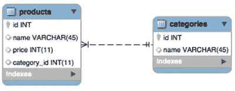

# 10.数据库和 SQL

数据库是一种保存数据的工具，这些数据是您打算经常引用并需要长期保存的。

PHP 使用扩展与一系列数据库进行交互。例如，要与 MySQL 数据库交互，可以使用`mysqli`扩展提供的函数。

Note

`mysqli`结尾有个“我”。这是现已废弃的`mysql`扩展的替代品。像“预准备语句”这样的特性只在新的扩展中可用。

PHP 还提供了抽象层，在代码和数据库之间提供了一个应用层。我们将在本书中探讨 PDO (PHP 数据对象)。

在本书中，我们将重点关注关系数据库，但在传递关系数据库的替代方案时，这是值得一提的。MongoDB 是一个非常受欢迎的 NoSQL 数据库，它提供了一个 PHP 驱动程序，允许你连接到数据库。我们将关注原生关系数据库，MongoDB 驱动程序不太可能包含在您的 Zend 考试中。

Zend 考试要求你了解基本的 SQL。如果问题没有特别说明，假设的环境将是 MySQL。

## 数据库基础

让我们首先确定关系数据库的一些概念是清楚的。

### 键

键施加约束，比如`PRIMARY`和`UNIQUE`。主键可以在一列或多列上定义。它保证数据库中的每一行对于键中的列都有唯一的值组合。行的主键不能为空值。

一个表只能有一个主键。外键也可以在一列或多列上定义。它引用了另一个表上的主键。这是一个唯一的引用，因此被引用表中只有一行链接到包含外键的表。

图 [10-1](#Fig1) 用外键`category_id`表示产品所属的类别。



图 10-1。

Both tables have primary keys named id

### 指数

索引是实现键约束所需的数据结构。索引加快了检索记录的速度。数据库引擎将在磁盘或内存中创建一个结构，其中包含索引列中的数据。这种结构针对查找进行了优化，有助于数据库更快地找到表中的行。

每当向表中插入一行时，都需要更新索引。这增加了编写的开销。

没有索引就不能有键，但是可以索引没有键的列。如果您不想强制实现惟一性，但又想加速在`WHERE`子句中包含这些列的`SELECT`语句，那么您可以这样做。

键和索引之间的绑定非常紧密，在 MySQL 中它们被认为是同义词。

### 关系

关系是关系数据库的核心特征。通过声明表之间的关系，您可以实施参照完整性并最大限度地减少脏数据。

有几种类型的关系。

<colgroup><col> <col></colgroup> 
| 关系 | 描述 |
| --- | --- |
| 一对一 | 父表中的一行只能引用子表中的一行。 |
| 一对多 | 父表中的一行可以被子表中的多行引用。 |
| 多对多 | 父表中任意数量的行可以被子表中任意数量的行引用。 |

通过表之间的关系，您可以将逻辑上相关的数据存储在一个表中，与其他数据区分开来。

例如，您可以有一个`products`表来存储您销售的产品的信息。产品属于类别。一个类别可以包含许多不同的产品。这意味着 category 表中的一行可以被 products 表中的多行引用。

### SQL 数据类型

SQL 数据库表中的列具有分配给它们的数据类型。正如 PHP 变量类型一样，SQL 类型可以存储不同格式的数据。

每个数据库管理器实现的 SQL 数据类型略有不同，并且在不同类型之间有不同的优化。

我们讨论一些常见的数据类型，避免关注任何特定的 SQL 实现。

### 数字类型

整数的类型在存储它们的值所用的字节数上有所不同。

下表说明了 MySQL 数据库的整数大小: [<sup>1</sup>](#Fn1)

<colgroup><col> <col> <col> <col></colgroup> 
| 整数类型 | 字节 | (带符号的)值 | (无符号)值 |
| --- | --- | --- | --- |
| `BIGINT` | eight | -9223372036854775808 转+ 9223372036854775807 | 0 到 18446744073709551615 |
| `INTEGER` | four | -2147483648 转+2147483647 | 0 到 4294967295 |
| `MEDIUMINT` | three | -8388608 至+8388607 | 0 到 16777215 |
| `SMALLINT` | Two | -32768 至+32767 | 0 到 65535 |
| `TINYINT` | one | -128 至+127 | 0 到 255 |

Tip

MySQL 允许你为整数指定一个参数，这个参数实际上是一个显示值，不影响底层存储。这是一个相当普遍的误解，认为参数是为了精度。

非整数类型可以存储在`NUMERIC`或`DECIMAL`值中。SQL-92 标准规定,`NUMERIC`类型必须具有规定的精确精度，而`DECIMAL`类型必须至少同样精确。这些数据类型的实现因供应商而异。

它们都采用相同的参数:

```php
NUMERIC(21,3)

```

第一个参数指定精度的总位数，第二个参数指定必须存储多少位十进制精度。

在本例中，我们将存储一个总共有 21 位的数字，其中 3 位出现在小数点后。

### 字符类型

SQL 允许将字符存储在固定长度或可变长度的字符串中。

固定长度的字符串在磁盘上总是被分配相同数量的字节。在某些数据库实现中，这有助于提高读取性能。权衡的结果是，如果存储在固定长度数据存储中的字符串比分配的字符数短，则存储的字符会比实际需要的多。

可变长度字符串可以膨胀到给定的限制大小。数据库引擎根据字符串的长度分配存储。数据库实现将存储被存储的字符串的长度。这将是至少一个字符来表示字符串的结尾，但是在一些引擎中，每个可变字符串将导致更大的存储开销。

一般来说，当存储一个字符串时，你知道它总是有一个特定的长度，比如一个散列，你应该把它存储在一个固定长度的字符字段中。这将提高性能，并且不会导致存储浪费。

## 使用 SQL

我们不会关注 SQL 的任何具体实现，而是尝试使用通用语句。Zend 考试不会测试你对特定数据库引擎的了解，但会期望你了解基本的 SQL 语法。

### 创建数据库和表

`CREATE`语句可以用来创建数据库和表格。创建数据库很简单；您只需指定数据库的名称:

```php
CREATE DATABASE mydatabase;

```

创建表时，可以指定要存储在其中的列的列表。对于每一列，可以指定名称、数据类型和属性。

```php
CREATE TABLE IF NOT EXISTS users (
  id int unsigned NOT NULL AUTO_INCREMENT,
  name varchar(255) NOT NULL,
  email varchar(255) NOT NULL,
  password varchar(60) NOT NULL,
  PRIMARY KEY (id),
  UNIQUE KEY users_email_unique (email)
);

```

### 删除数据库和表

`CREATE`的逆运算是`DROP`语句。

```php
DROP TABLE category;
DROP DATABASE mydatabase;

```

如果您指定了外键，数据库将不会允许您删除违反其中一个约束的表。

例如，参考我们的产品和类别示例。如果我们尝试删除 category 表，但仍有产品引用它，数据库引擎应该不允许该操作。

### 检索数据

`SELECT`语句用于检索数据。`SELECT`的语法可能非常复杂，是不同供应商之间差异最大的语句之一。你需要了解基本的用法和加入你的 Zend 认证。

在这个简单的伪代码查询示例中，我们从表中检索价格超过 100 个货币单位的产品名称。我们指定希望结果按价格降序返回。

```php
SELECT name
  FROM products
  WHERE price > 100
  ORDER BY price DESC

```

您可以指定用逗号分隔的多个列名，或者使用通配符`*`来接收所有列。

PHP 接收的数据格式取决于您用来调用查询的驱动程序和函数。您通常会收到一个对象或数组，其中包含与列相对应的键/属性。

### 插入新数据

`INSERT`语句用于在数据库中创建新行。您需要提供一个列列表以及要插入其中的值。标记为`NOT NULL`的列是必需的，在创建行时必须指定一个值。

```php
INSERT INTO products
  (name, price, category_id) VALUES
  ('cheeseburger', 100, 3)

```

如果不指定列名，SQL 将假定您按照列在表中出现的顺序提供值。如果你改变了你的表的结构，这可能是一个缺点。

否则，如示例所示，先指定列名，然后指定值。这些值按顺序分配给列。因此，在这个例子中，产品的名称被设置为`'cheeseburger'`，它的价格是 100，它被放入 ID 值为 3 的类别中(无论它是什么)。

### 更新数据

`UPDATE`语句接受类似于`INSERT`语句的值列表，以及类似于`SELECT`语句的可选`WHERE`子句。

您必须指定现有数据要更新到的值，以及必须更新的行的标准。

```php
UPDATE products
  SET price = price + 100
  WHERE category_id = 3;

```

### 汇总数据

您可以使用数据库执行计算并将结果发送给您。

<colgroup><col> <col></colgroup> 
| 声明 | 返回 |
| --- | --- |
| `AVG` | 数据值的平均值 |
| `SUM` | 找到的所有数据值的总和 |
| `COUNT` | 找到了多少条记录 |
| `DISTINCT COUNT` | 找到了多少条唯一记录 |
| `MIN` | 数据集中的最小值 |
| `MAX` | 数据集中的最高值 |

使用这些函数如下所示:

```php
SELECT AVG(price) FROM products;

```

### 分组数据

您可以告诉 SQL 在将数据返回给您之前，按列或列的组合对数据进行分组。这通常与聚合函数一起使用很有用。

让我们考虑一个例子，我们想找出我们每个客户购买的总销售额。

```php
SELECT email, SUM( sales_value )
        FROM  `transactions`
        GROUP BY email

```

在本例中，我们对具有相同电子邮件地址的事务进行分组。SQL 数据库引擎将应用`SUM`语句，将每个组中的销售值相加，然后返回该值。

我在`SELECT`语句中包含了电子邮件地址，因此输出将包含客户的电子邮件地址，以及包含其电子邮件地址的所有交易的销售额总和。

## 连接

联接用于根据提供的标准连接表。这允许您从相关表中检索信息。

在产品和类别数据库中，您可以通过将`categories`表连接到`products`表来检索产品的类别名称:

```php
SELECT *
FROM  products
JOIN categories ON categories.id = products.category_id

```

我们将`categories`表连接到`products`表，并向 SQL 发出如何匹配行的指令。如果`categories`表中的`id`列与`products`表中的`category_id`列相匹配，那么将包含该表中的一行。

### 连接类型

有几种连接表的方法。

<colgroup><col> <col></colgroup> 
| 连接类型 | 影响 |
| --- | --- |
| `INNER JOIN` | 选择在两个表中都有匹配值的记录，如上例所示 |
| `LEFT OUTER JOIN` | 从左表中选择具有匹配右表记录的表 |
| `RIGHT OUTER JOIN` | 从右表中选择与左表记录匹配的记录 |
| `FULL OUTER JOIN` | 选择与左表或右表记录匹配的所有记录 |

这些连接可以用图解法表示，如图 [10-2](#Fig2) 所示。


图 10-2。

Many ways to join tables

## 准备好的声明

当您向 SQL 引擎发出命令时，它必须解析该命令才能执行它。执行完该语句后，SQL 将丢弃编译后的代码，结果是需要单独解析使用相同 SQL 命令的重复调用。显然，这导致了重复劳动。

您可以通过使用准备好的语句来避免 SQL 重复工作，这些语句将成为 SQL 存储的已解析代码模板，以供多次重用。

预准备语句还提供了显著的安全优势。参数被绑定到准备好的语句，并且不作为代码字符串的一部分。这意味着您的参数不可能侵入代码，这意味着您不再需要担心转义代码来防止 SQL 注入。在您不再担心数据进出数据库之前，请记住存储的 XSS 攻击的可能性。

```php
<?php
// prepare and bind
$stmt = $conn->prepare("INSERT INTO users (username, password) VALUES (?, ?)");
$stmt->bind_param("ss", $username, $password);

// set parameters
$username = "bob";
$password = password_hash("password", PASSWORD_BCRYPT);

// run the statement
$stmt->execute();

```

## 处理

事务是一组 SQL 语句，要么全部成功，要么无效。

事务完成后，数据库不能使任何表约束失效，并且必须处于所有更改都已持久化的状态。数据库必须有某种方法来确保事务可以同时运行而不会相互干扰，例如，通过增加另一个事务所依赖的主键。

总之，事务是一组 SQL 语句，必须以“全有或全无”的方式成功完成。运行后，数据库必须处于一致状态，并且必须能够从错误中恢复。

交易的语法因供应商而异，但是有三个重要的陈述。

*   一条语句将标记事务块的开始。其后的 SQL 语句将是事务的一部分。
*   有两个语句可以结束事务。其中一个将告诉 SQL 继续进行事务正在进行的所有更改。
*   另一个 end 语句将告诉 SQL，无论出于什么原因，您都希望放弃事务，而是恢复到事务开始时数据库所处的状态。

以下是三种最常见的供应商陈述:

<colgroup><col> <col> <col></colgroup> 
| 关系型数据库 | 数据库备份方法 | 神谕 |
| --- | --- | --- |
| `START TRANSACTION` | `BEGIN TRANSACTION` | `START TRANSACTION` |
| `COMMIT` | `COMMIT TRANSACTION` | `COMMIT` |
| `ROLLBACK` | `ROLLBACK WORK` | `ROLLBACK` |

## PHP 数据对象(PDO)

PDO 是一个数据抽象层，它为您提供了一个与多个数据源交互的接口。使用 PDO 时，无论供应商是谁，您都可以使用相同的函数与数据库进行交互。

理解 PDO 是一个访问抽象层并且不抽象 SQL 或数据类型是很重要的。您传递给`PDO::query()`或准备好的语句的 SQL 必须对您正在连接的供应商有效。

PDO 使用数据库适配器连接到数据库。这些适配器类实现了 PDO 接口，并将特定于供应商的函数作为常规扩展函数公开。

PDO 是在 PHP 配置文件中配置的。运行时，您可以使用`PDO::setAttribute()`功能更改选项。

PDO 扩展提供了几个预定义的常量。对于 Zend 考试，您不需要记住所有的内容，但是可以浏览 PHP 手册并熟悉它们。

PDO 将模拟不支持预准备语句的数据库的预准备语句，但是将使用数据库的本机预准备语句功能。

### 连接到 PDO

要用 PDO 连接到数据库，需要创建一个 PDO 类的实例。如果需要，构造函数接受数据库源(DSN)和用户名/密码的参数。

```php
<?php
try {
    $dbh = new PDO('mysql:host=localhost;dbname=test', $user, $pass);
} catch (PDOException $e) {
    echo "Error connecting to database: " . $e->getMessage();
}

```

如果连接到数据库时出现错误，将会抛出一个`PDOException`。注意异常的堆栈跟踪可能包含完整的数据库连接细节是非常重要的。一定要抓住它，不要让它被展示出来。

要在完成后关闭连接，可以将 PDO 变量设置为`null`。

```php
$dbh = null;

```

数据库连接会在运行脚本结束时自动关闭，除非您将它们持久化。持久数据库连接不会被关闭，而是被缓存以供脚本的另一个实例使用。这减少了每次 web 应用运行时需要连接到数据库的开销。

### PDO 的交易

PDO 也提供了事务命令，但是没有模拟正确的事务处理。这意味着您只能在本地支持事务的数据库上使用 PDO 事务函数。这些功能是`PDO::beginTransaction()`、`PDO::commit()`和`PDO::rollBack()`。

```php
<?php
$dsn = 'mysql:host=localhost;dbname=example';
$pdo = new PDO($dsn, 'dbuser', 'dbpass');
$pdo->setAttribute(PDO::ATTR_EMULATE_PREPARES, TRUE);
$pdo->setAttribute(PDO::ATTR_ERRMODE,
    PDO::ERRMODE_EXCEPTION);
$password = password_hash("password", PASSWORD_BCRYPT);
try {
    $pdo->beginTransaction();
    $pdo->exec("
          INSERT INTO users
              (username, password)
          VALUES
              ('bob', '{$password}'");
    // some more update or insert statements
    $pdo->commit();
} catch (PDOException $e) {
    $pdo->rollBack();
    echo 'Rolled back because: ' . $e->getMessage();
}

```

在这个例子中，我们连接到数据库`with` PDO，并启动一个事务。

我们将所有的 PDO 事务功能包装在一个`try...catch`块中。如果 PDO 语句运行失败，它将抛出一个`PDOException`。我们使用`catch`块回滚事务。

### 获取 PDO 结果

我们使用`PDO::fetch()`方法 [<sup>2</sup>](#Fn2) 从 PDO 结果中检索数据。PDO 将保持一个光标来遍历结果集，并使用它来确定返回给你的元素。

PDO 将以您在第一个参数`fetch()`中指定的格式将数据返回给您。

<colgroup><col> <col></colgroup> 
| 提取样式 | 返回 |
| --- | --- |
| `PDO::FETCH_ASSOC` | 返回一个以数据库列为关键字的关联数组。 |
| `PDO::FETCH_NUM` | 返回由结果集返回的按列号索引的数组。 |
| `PDO::FETCH_BOTH` | 返回一个数组，该数组同时包含`ASSOC`和`NUM`样式提取的索引。 |
| `PDO::FETCH_BOUND` | 返回 true 并将结果集中列的值赋给 PHP 变量，这些变量是用`PDOStatement::bindColumn()`方法绑定的。 |
| `PDO::FETCH_CLASS` | 返回所请求类的新实例，该实例将结果集的列映射到该类中的命名属性。 |
| `PDO::FETCH_INTO` | 更新所请求类的现有实例，映射为`FETCH_CLASS`。 |
| `PDO::FETCH_OBJ` | 返回一个匿名对象，其属性名对应于结果集中的列名。 |
| `PDO::FETCH_LAZY` | 组合`PDO::FETCH_BOTH`和`PDO::FETCH_OBJ`并在访问时创建对象变量名。 |
| `PDO::FETCH_NAMED` | 至于`PDO::FETCH_ASSOC`，返回一个关联数组。如果有多个同名列，则该键引用的值将是具有该列名的行中所有值的数组。 |

### 在 PDO 准备发言稿

并非所有数据库引擎都支持预处理语句，这是 PDO 为不支持预处理语句的适配器模拟的唯一特性。

在 PDO 中，预处理语句的语法与使用本地函数非常相似。

```php
<?php
$stmt = $dbh->prepare("INSERT INTO users (name, email) VALUES (:name, :value)");
$stmt->bindParam(':name', $name);
$stmt->bindValue(':email',’alice@example.com’);

// insert one row
$name = 'one';
$stmt->execute();

```

浏览这个例子，我们看到使用了`prepare()`方法来创建语句对象。

我们使用两种不同形式的绑定参数来演示这种差异。

在第一个例子`bindParam()`中，我们将一个变量绑定到语句参数。当语句执行时，参数将采用执行时变量的值。

绑定变量的第二种方法是`bindValue()`，将一个文字绑定到语句参数。如果您在`bindValue()`中使用了变量名，那么将使用绑定时的变量值。在语句执行之前对变量的更改不会影响参数值。

您也可以在调用 execute 时将要绑定的值作为数组传递，如下例所示:

```php
<?php
$stmt = $pdo->prepare('SELECT * FROM users WHERE email = :email AND status=:status');
$stmt->execute(['email' => $email, 'status' => $status]);
$user = $stmt->fetch();

```

在 SQL 语句中只能绑定值，而不能绑定像表名或列这样的实体。您只能绑定标量值，而不能绑定像数组或对象这样的复合变量。

### 多次致电 PDO 准备陈述

您已经看到,`bindParam()`方法在语句执行时将变量值插入到语句参数中。您可以看到，使用`bindParam()`允许您重复调用准备好的语句，在每次调用中使用不同的参数值。

方法`closeCursor()`用于清除数据库光标，并将语句返回到可以再次执行的状态。当先前执行的语句仍有未预取的行时，一些数据库在执行准备好的语句时会出现问题。

Chapter [10](10.html) Quiz

Q1:你可以使用 _ _ _ _ _ _ _ _ _ _ _ _ _ _ 函数从数组中构建一个适合用于`GET`或`POST`的 HTTP 查询字符串。

<colgroup><col></colgroup> 
| `http_build_query()` |
| `http_build_param()` |
| `parse_url()` |
| `urlencode()` |

Q2:PHP 函数`encodeurl()`用于:

<colgroup><col></colgroup> 
| 确保 URL 是 UTF 8 编码的。 |
| 将 URL 中的保留字符转换为%编码符号。 |
| 从数组中构建一个适合于`GET`参数的字符串。 |
| 没有这个 PHP 函数。 |

Q3:使用准备好的语句有什么好处；选择尽可能多的适用选项？

<colgroup><col></colgroup> 
| 它们比使用普通查询更安全。 |
| 对于重复查询，它们更快。 |
| 您可以在不同的数据库供应商中使用相同的查询。 |
| 以上都不是。 |

问题 4:我将客户信息存储在一个表中。每一行都有一个`account_id`，它是一个名为`accounts`的表的外键。对于 ID 为`123`的客户，如何从地址表中选择`postcode`列？

<colgroup><col></colgroup> 
| 从“帐户”中选择“邮政编码”，其中 customer _ id = 123 |
| 从“accounts”中选择“postcode”作为“acc ”,在“cust . id ”=“ACC . id”上加入“customers”作为“cust ”,其中“c ”. id = 123 |
| 在' c . account _ id `= ` a `. id '上，从' accounts '中选择'邮政编码'作为' a ',加入' customers '作为' c ',其中' c`.id = 123 |
| 在“c . id ”=“a . id”上，从“accounts”中选择“postcode”作为“a”完全外部连接“customers”作为“c ”,其中“c . id”= 123 |

Footnotes [1](#Fn1_source)

[T2`https://dev.mysql.com/doc/refman/5.7/en/integer-types.html`](https://dev.mysql.com/doc/refman/5.7/en/integer-types.html)

  [2](#Fn2_source)

[T2`https://secure.php.net/manual/en/pdostatement.fetch.php`](https://secure.php.net/manual/en/pdostatement.fetch.php)