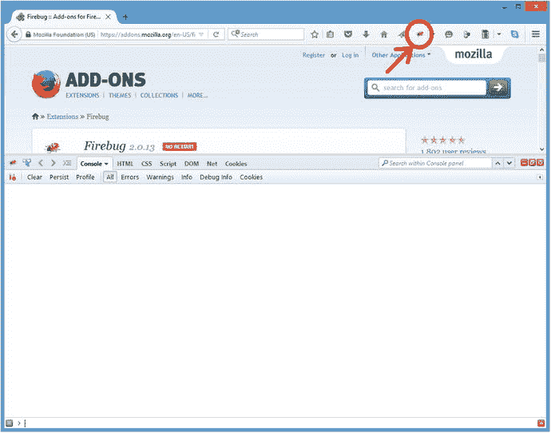
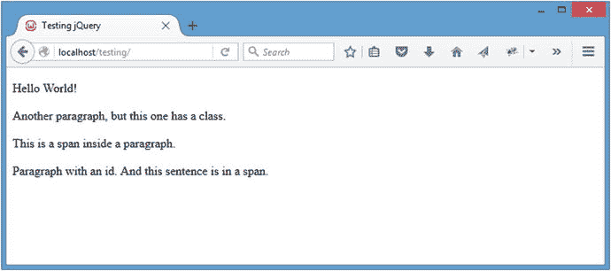

# 1.jQuery 简介

Electronic supplementary material The online version of this chapter (doi:[10.​1007/​978-1-4842-1230-1_​1](http://dx.doi.org/10.1007/978-1-4842-1230-1_1)) contains supplementary material, which is available to authorized users.

为了全面理解 jQuery 及其在现代 web 编程中的应用，有必要花点时间回顾一下 jQuery 的起源，它的构建是为了满足什么需求，以及在 jQuery 出现之前 JavaScript 编程是什么样子的。

在这一章中，您将了解 JavaScript 库和它们寻求满足的需求，以及为什么 jQuery 是大多数 web 开发人员的首选库。您还将学习 jQuery 的基础知识，包括如何在您的应用中使用这个库，以及 jQuery 的核心——它强大的选择器引擎——是如何工作的。

## 选择 jQuery 而不是 JavaScript

JavaScript 语言在软件开发社区中有着非常复杂的名声。许多语法在表面上类似于我们熟悉的语言，如 C 或 Java。但是 JavaScript 代码的语义可能非常不同，这往往会让外行感到沮丧。(著名的软件架构师道格拉斯·克洛克福特写了很多关于这方面的文章，如果你想更深入地了解，当然值得在网上查找他的资料。)

浏览器给 web 开发过程增加了另一层甚至更严重的复杂性。不同的浏览器提供了不同的 JavaScript 解释器实现。而且，您实际上无法控制最终用户将运行的浏览器，也无法控制它对您所依赖的功能的支持。但是情况并不像看上去的那么糟糕；web 开发社区已经站出来提供帮助。

### 了解 JavaScript 库

与 JavaScript 相关的陡峭的学习曲线和浏览器支持问题多年来一直是开发人员的痛处，随着挫折的增加，一些雄心勃勃的开发人员开始构建 JavaScript 库，也称为 JavaScript 框架。

这些库旨在简化 JavaScript 的使用，并通过创建易于使用的控制函数来消除日常 JavaScript 任务中的一些繁重工作，使新老开发人员更容易使用 JavaScript 的强大功能。库在 AJAX 领域特别有用(这个术语最初源于异步 JavaScript 和 XML)。正如您将在后面看到的，AJAX 是通过异步执行对服务器的请求(通常用户甚至不会注意到)来提高 web 应用响应能力的关键。

JavaScript 库为常见任务提供了更简单的语法，这为开发人员带来了更快的工作流程，为初学者带来了更轻松的学习曲线。它们还通过在其内置方法中为您进行所有兼容性检查，消除了编写跨浏览器 JavaScript 代码时的一些麻烦，这在编写代码时可以节省大量时间。

Note

使用 jQuery 的 AJAX 工具和直接的 JavaScript 方法之间的区别将在第 2 章中探讨。

有很多 JavaScript 库可用。目前使用的几种最流行的是 Prototype ( [`www.prototypejs.org`](http://www.prototypejs.org/) )、MooTools ( [`http://mootools.net`](http://mootools.net/) )、Yahoo！UI 库( [`http://developer.yahoo.com/yui`](http://developer.yahoo.com/yui) )、AngularJS ( [`https://angularjs.org/`](https://angularjs.org/) )、Dojo ( [`https://dojotoolkit.org/`](https://dojotoolkit.org/) )，等等。它们中的许多为各种目的提供了非常不同的功能，但是我们将关注最流行的库:jQuery，它专门用于促进与 web 浏览器最常见的交互。

### 了解 jQuery 的好处

每个 JavaScript 框架都有自己的好处。jQuery 也不例外，它提供了以下好处:

*   小文件大小(从版本 2.1.4 开始大约 80KB)
*   极其简单的语法
*   可链接方法
*   用于扩展框架的简单插件架构
*   一个巨大的在线社区
*   [`http://api.jquery.com`](http://api.jquery.com/) 大文档
*   用于增加功能的可选 jQuery 扩展，如 jQueryUI

### 了解 jQuery 的历史

jQuery 是开发者 John Resig 的智慧结晶，于 2006 年初在纽约的 BarCamp 上首次发布(关于 BarCamp 的更多信息，请参见 [`http://barcamp.org`](http://barcamp.org/) )。Resig 在他的网站上提到，他创建 jQuery 是因为他对当前可用的库不满意，并认为可以通过减少“语法错误”并为常见操作添加特定控件( [`http://ejohn.org/blog/selectors-in-javascript/`](http://ejohn.org/blog/selectors-in-javascript/) )来极大地改善这些库。

jQuery 在开发社区大受欢迎，并迅速获得了发展势头。其他开发人员开始帮助改进这个库，最终在 2006 年 8 月 26 日发布了第一个稳定的 jQuery 版本 1.0。

从那以后，jQuery 已经发展到了 2.1.4 版本(在撰写本文时)，并且已经看到了来自开发社区的大量插件的涌入。插件是 jQuery 的扩展，不是核心库的一部分。在第 10 章中，你会学到更多关于(和构建)jQuery 插件的知识。

## 设置测试环境

因为理解一门新语言没有比动手更好的方法，所以您需要一个测试环境来尝试一些 jQuery 入门练习。幸运的是，设置这个测试环境是一个简单的两步过程:安装 Firefox，然后安装 Firebug。

在本书中，所有的练习都将假设您正在使用 Firefox 浏览器和 Firebug 插件，因为它有出色的 JavaScript 测试控制台。

### 安装 Firefox

要让 Firefox 在你的电脑上运行，导航到 [`http://firefox.com`](http://firefox.com/) 并下载最新版本的 Firefox(在撰写本文时为 42.0 版本)，可从 [`www.mozilla.org/en-US/firefox/products/`](http://www.mozilla.org/en-US/firefox/products/) `.`下载

### 安装萤火虫

要安装 Firebug，使用 Firefox 导航到 [`http://getfirebug.com/downloads`](http://getfirebug.com/downloads) ，点击最新版本的下载链接(撰写本文时为 2.0.13)。这将带您进入 Firebug 的 Firefox 附加组件目录条目。在那里，点击“添加到 Firefox”按钮，这将在浏览器中弹出安装对话框(见图 [1-1](#Fig1) )。单击“安装”按钮，等待附件安装。

图 1-1。

The installation dialog for Firebug

安装程序完成后，状态栏中会出现一个类似闪电的图标。单击该图标将调出 Firebug 控件，从控制台开始(参见图 [1-2](#Fig2) )。

图 1-2。

The Firebug add-on opens to the console panel Note

Firebug 的用处远不止于 JavaScript 调试。对于任何 web 开发者来说，这都是一个无价之宝。欲了解更多信息，请访问 [`http://getfirebug.com`](http://getfirebug.com/) 。

Setting up a local testing environment

尽管本书中介绍的练习并不要求设置本地测试环境，但是这样做是一个很好的开发实践。本地测试允许更快、更安全的开发，并且通常比尝试在远程服务器上开发更容易。

安装 XAMPP

要快速方便地在您的计算机上设置本地开发环境，请按照以下步骤下载并安装 XAMPP。

Visit [`www.apachefriends.org/en/xampp.html`](http://www.apachefriends.org/en/xampp.html) , and download the latest version of XAMPP for your operating system (7.0.1 as of this writing). Throughout this book, PHP version 7.x will be assumed; this will become important starting with [Chapter 3](03.html).   Open the downloaded file. For a PC, run the EXE file, select a directory, and install. For a Mac, mount the DMG, and drag the XAMPP folder into your `Applications` folder.   Open the XAMPP Control Panel in the XAMPP folder, and start Apache.   Navigate to `http://localhost/` to ensure than XAMPP is working. If so, the XAMPP home page will let you know.  

除了 XAMPP 的 Windows 和 Mac 版本，还有 Linux 和 Solaris 的发行版。每个操作系统在安装 XAMPP 时都有不同之处，所以请参考帮助部分，以获得在您的机器上运行本地测试环境的更多信息。

## 在网页中包含 jQuery

要在项目中使用 jQuery，需要将该库加载到 HTML 文档中，以便脚本可以访问该库的方法。如果没有首先加载这个库，任何使用 jQuery 语法的脚本都可能导致 JavaScript 错误。幸运的是，加载 jQuery 非常简单，开发人员可以通过几个选项来完成。

### 包括 jQuery 库的下载副本

将 jQuery 包含在项目中的第一个选项是在项目的文件结构中保存该库的副本，并像包含任何其他 JavaScript 文件一样包含它:

``

### 包括 jQuery 库的远程托管副本

第二种选择是包含 Google 托管的 jQuery 库的副本。这样做是希望您的网站的访问者将拥有一个已经从另一个网站缓存的包含相同文件的库的副本，这减少了网站用户的加载时间。

远程副本就像下载的副本一样包含在内:

``

`</body>`

`</html>`

Note

在结束 body 标记(`</body>`)之前加载 JavaScript 是为了防止脚本阻止其他页面元素(比如图像)的加载。这样做还可以防止 JavaScript 在元素完全加载到页面之前运行，这可能会导致意外行为或 JavaScript 错误。

保存该文件并在 Firefox 中导航至`http://localhost/testing/`(参见图 [1-3](#Fig3) )。

图 1-3。

The test file loaded in Firefox

您将使用这个文件来熟悉 jQuery 的基本操作。

### jQuery 函数简介

jQuery 的核心是 jQuery 函数。这个函数是 jQuery 的核心和灵魂，在每个实现 jQuery 的实例中都要用到。在 jQuery 的大多数实现中，使用快捷方式`$()`而不是`jQuery()`来保持代码简洁。

我们不会深入研究这个函数的编程理论，但基本上它创建了一个 jQuery 对象，并计算作为其参数传递的表达式。然后，它决定应该如何响应，并相应地修改自己。

Caution

某些其他 JavaScript 库也使用`$()`函数，因此当试图同时使用多个库时可能会发生冲突。jQuery 通过`jQuery.noConflict()`为这种情况提供了一个解决方案。详见 [`http://docs.jquery.com/Core/jQuery.noConflict`](http://docs.jquery.com/Core/jQuery.noConflict) 。

### 使用 CSS 语法选择 DOM 元素

jQuery 中的一切都围绕着它极其强大的选择器引擎。本章的其余部分将教您使用 jQuery 从文档对象模型(DOM)中选择元素的不同方法。

Note

DOM 是组成 HTML、XHTML 和 XML 文档的对象和节点的集合。它独立于平台和语言；这实质上意味着开发人员可以使用多种编程语言(比如 JavaScript)在多个平台(比如 web 浏览器)上访问和修改 DOM 信息，而不会出现兼容性问题。

jQuery 最强大和最吸引人的特性之一是开发人员能够轻松地在 DOM 中选择元素。伪 CSS 选择器 [1](#Fn1) 的使用为 jQuery 增添了令人难以置信的强大功能。伪 CSS 允许开发者在他的 HTML 中瞄准特定的元素实例。由于几乎相同的语法，这对任何以前有 CSS 经验的人都特别有帮助。本质上，使用与设置样式规则相同的 CSS 语法，您可以通过以下方式选择元素:

*   基本选择器
*   层次选择器
*   过滤
    *   基本过滤器
    *   内容过滤器
    *   可见性过滤器
    *   属性过滤器
    *   子过滤器
*   表单过滤器

#### 基本选择器

基本选择器允许开发人员通过标记类型、类名、ID 或它们的任意组合来选择元素。在查看`http://localhost/testing/`的同时，启动 Firebug 对话框，点击控制台选项卡(参见图 [1-4](#Fig4) )。如果控制台面板被禁用，请单击控制台选项卡，然后选择启用。本章中的所有示例都将使用该控制台。

图 1-4。

The Firebug console after executing a command Note

如果您熟悉 CSS，您将能够浏览这一部分，因为选择器的行为与它们的 CSS 对应物相同。

##### 按标记类型选择元素

要通过标记类型选择元素，只需使用标记的名称(如`p`、`div`或`span`)作为选择器:

`element`

要选择测试文档中的所有段落(`
`)标签，请在控制台底部输入以下代码片段:

`$("p");`

按回车键，代码将执行。以下结果将显示在控制台上(参见图 [1-4](#Fig4) ):

`> $("p");`

`Object[``p, p.foo, p, p#bar`T2】

第一行显示执行的命令，第二行显示代码返回的内容。您的测试文档中有四个段落标记:两个没有 class 或 ID 属性，一个有 class `foo`，一个有 ID `bar`(您将在接下来的小节中学习这个语法)。当您将标记名传递给 jQuery 函数时，所有实例都会被找到并添加到 jQuery 对象中。

##### 按类名选择标签

正如您可以按标记类型选择一样，您也可以按元素的指定类来选择元素。其语法是在类名前加一个句点(`.`):

`.class`

通过在控制台中执行以下代码片段，选择具有类`foo`的所有元素:

`$(".foo");`

执行后，控制台中将显示以下内容:

`> $(".foo");`

`Object[``p.foo, span.foo`T2】

paragraph 标签和 span 都被返回，因为它们都有类`foo`。

##### 按 ID 选择元素

要通过 ID 属性选择元素，可以使用前面带有散列符号(`#`)的 ID 的 CSS 语法:

`#id`

将 ID 为`bar`的所有元素与以下内容进行匹配:

`$("#bar");`

您的文档中只有一个段落的 ID 为“bar ”,您可以在结果中看到:

`> $("#bar");`

`Object[``p#bar`T2】

##### 组合选择器以实现更精确的选择

在某些情况下，可能需要只隔离对应于某个类的某些标签，这很容易通过在选择器中组合标签类型和类来实现。

在控制台中输入以下内容，仅选择类别为`foo`的段落标记:

`$("p.foo");`

控制台中的结果确认 span 被忽略，即使它有类`foo`:

`> $("p.foo");`

`Object[p.foo]`

##### 使用多个选择器

如果需要访问多个元素，可以使用多个选择器一次访问所有这些元素。例如，如果您想要选择类别为`foo`的任何段落标签或 ID 为`bar`的任何元素，您可以使用以下代码:

`$("p.foo,#bar");`

这将返回至少与字符串中指定的一个选择器匹配的元素:

`> $("p.foo,#bar");`

`Object[``p.foo, p#bar`T2】

#### 层次选择器

有时候，仅仅通过元素、类或 ID 进行选择是不够的。有些时候，您需要访问包含在另一个元素中、旁边或后面的元素，比如从除了刚才单击的菜单项之外的所有菜单项中删除一个活动类，从选定的无序列表中取出所有列表项，或者在选择一个表单项时更改包装元素的属性。

##### 选择后代元素

选择后代元素(包含在其他元素中的元素)是使用祖先选择器(后跟一个空格)和后代选择器来完成的，如下所示:

`ancestor descendent`

要在测试文档中选择后代跨度，请在 Firebug 控制台中执行以下命令:

`$("body span");`

这将查找包含在文档正文标签(`<body>`)内的所有范围，即使这些范围也在段落标签内:

`> $("body span");`

`Object[``span, span.foo`T2】

##### 选择子元素

子元素是后代选择器的一种更具体的样式。只有下一级元素才被考虑进行匹配。要选择子元素，请使用父元素后跟一个大于号(`>`)，再后跟要匹配的子元素:

`parent>child`

在您的测试文件中，通过在控制台中输入以下命令，尝试选择 body 元素的子元素:

`$("body>span");`

因为 body 元素中没有直接包含的跨度，所以控制台将输出以下内容:

`> $("body>span");`

`Object[ ]`

接下来，过滤作为段落元素的直接子元素的所有 span 元素:

`$("p>span");`

结果输出如下所示:

`> $("p>span");`

`Object[``span, span.foo`T2】

##### 选择下一个元素

有时候在脚本中，你需要选择 DOM 中的下一个元素。这是通过为开始元素提供一个标识符来实现的(这里任何选择器模式都适用)，后跟一个加号(`+`)，再跟一个匹配下一个实例的选择器，如下所示:

`start+next`

通过键入以下命令，在控制台中尝试这样做:

`$(".foo+p");`

只有一个类为`foo`的元素，所以只返回一个段落元素:

`> $('.foo+p');`

`Object[``p`T2】

接下来，使用更一般的查询，并在任何段落元素之后选择下一个段落元素:

`$('p+p');`

标记中有四个段落，除了最后一个以外，所有段落都有一个`next`段落，因此控制台将在结果中显示三个元素:

`> $('p+p');`

`Object[``p.foo, p, p#bar`T2】

这个结果集是 HTML 标记中的第二、第三和第四段。

##### 选择同级元素

兄弟元素是同一元素中包含的任何元素。选择同级元素的工作方式类似于选择下一个元素，只是同级选择器将匹配起始元素之后的所有同级元素，而不仅仅是下一个元素。

要选择同级元素，请使用起始元素选择器，后跟一个等价符号(`∼`)，以及匹配同级元素的选择器，如下所示:

`start∼siblings`

要将段落之后的所有同级与类`foo`匹配，请在控制台中执行以下命令:

`$(".foo∼p");`

结果集将如下所示:

`> $(".foo∼p");`

`Object[``p, p#bar`T2】

#### 基本过滤器

过滤器是访问 DOM 中元素的另一种非常强大的方法。您可以根据元素的位置、当前状态或其他变量来查找元素，而不是依赖于元素类型、类或 id。

过滤器的基本语法是冒号(`:`)后跟过滤器名称:

`:filter`

在某些过滤器中，参数可以用括号传递:

`:filter(parameter)`

最常见和最有用的过滤器将在接下来的几节中介绍。

Note

为了快速进入实际开发，这里没有涵盖所有可用的过滤器。有关可用过滤器的完整列表，请参见 jQuery 文档。

##### 选择第一个或最后一个元素

过滤器最常见的用途之一是确定一个元素是集合中的第一个还是最后一个元素。使用过滤器，找到第一个或最后一个元素非常简单。您只需将过滤器`:first`或`:last`附加到任何选择器上，就像这样:

`$("p:last");`

在控制台中执行时，将返回以下内容:

`> $("p:last");`

`Object[``p#bar`T2】

##### 选择与选择器不匹配的元素

如果您需要找到所有不匹配选择器的元素，`:not()`过滤器是最简单的方法。将这个过滤器和一个选择器作为它的参数添加到您的选择器中，结果集将返回匹配原始选择器的任何元素，但不包括作为参数传递给`:not()`的选择器。

例如，

`$("p:not(.foo)");`

将返回以下结果集:

`> $("p:not(.foo)");`

`Object[``p, p, p#bar`T2】

##### 选择偶数或奇数元素

与`:first`和`:last`类似，`:even`和`:odd`过滤器在语法上很简单，并且分别返回您可能期望的结果集的偶数或奇数元素:

`$("p:odd");`

在控制台中执行前面一行将产生以下输出:

`> $("p:odd");`

`Object [``p.foo, p#bar`T2】

##### 按索引选择元素

如果您需要通过索引获取一个特定的元素，`:eq()`过滤器允许您通过传递一个索引作为过滤器的参数来指定需要哪个元素:

`$("p:eq(3)");`

这将输出以下内容:

`> $("p:eq(3)");¸`

`Object[``p#bar`T2】

Note

一个元素的索引是指它在集合中其他元素中的位置。编程中的计数从零(`0`)开始，因此第一个元素在索引`0`处，第二个元素在索引`1`处，依此类推。

#### 内容过滤器

过滤器也可用于根据内容选择元素。这些范围可以从包含某些文本到包围给定的元素。

##### 选择包含特定文本的元素

要仅选择包含特定文本的元素，使用`:contains()`过滤器，其中要匹配的文本作为参数传递给过滤器:

`$("p:contains(Another)");`

在控制台中执行时，前面的行将返回以下内容:

`> $("p:contains(Another)");`

`Object[``p.foo`T2】

Note

`:contains()`过滤器区分大小写，这意味着匹配文本时大小写很重要。一个不区分大小写的过滤器版本已经被开发社区的成员添加到 API 文档的`:contains()`条目的注释中。关于这个过滤器的更多信息，请参见 [`http://api.jquery.com/contains-selector`](http://api.jquery.com/contains-selector) 。

##### 选择包含特定元素的元素

如果您只需要选择包含另一个元素的元素，您可以使用`:has()`过滤器。这类似于`:contains()`，除了它接受一个元素名而不是一串文本:

`$("p:has(span)");`

在控制台中执行时，会输出以下内容:

`> $("p:has(span)");`

`Object[``p, p#bar`T2】

仅返回包含 span 元素的段落。

##### 选择作为父元素的元素

与`:empty`，`:parent`相反，它只匹配包含子元素的元素，子元素可以是其他元素、文本或者两者都是。

使用以下选项选择所有父段落:

`$("p:parent");`

因为示例 HTML 文档中的所有段落都包含文本(在某些情况下还包含其他元素)，所以所有段落都在结果集中返回:

`> $("p:parent");`

`Object[``p, p.foo, p, p#bar`T2】

#### 可见性过滤器

可见性过滤器`:hidden`和`:visible`将分别选择隐藏和可见的元素。选择所有可见段落，如下所示:

`$("p:visible");`

因为 HTML 示例中的元素当前都没有隐藏，所以这将返回以下结果集:

`> $("p:visible");`

`Object[``p, p.foo, p, p#bar`T2】

#### 属性过滤器

元素属性也是选择元素的好方法。属性是元素中进一步定义它的任何东西(包括 class、href、ID 或 title 属性)。对于下面的例子，您将访问 class 属性。

Note

请记住，在生产脚本中尽可能使用 ID `(#id`和 class ( `.class`)选择器会更快(也更好);下面的例子只是为了演示过滤器的功能。

##### 选择与属性和值匹配的元素

要匹配具有给定属性和值的元素，请用方括号(`[]`)将属性-值对括起来:

`[attribute=value]`

要选择 class 属性为`foo`的所有元素，请在控制台中执行以下命令:

`$("[class=foo]");`

这将返回以下内容:

`> $("[class=foo]");`

`Object[``p.foo, span.foo`T2】

##### 选择没有属性或与属性值不匹配的元素

相反，要选择不匹配属性-值对的元素，请在属性和值之间的等号前插入感叹号(`!`):

`[attribute!=value]`

通过运行以下命令，选择所有不包含类别`foo`的段落:

`$("p[class!=foo]");`

这将导致以下结果:

`> $("p[class!=foo]");`

`Object[``p, p, p#bar`T2】

#### 子过滤器

子过滤器为`:even`、`:odd`或`:eq()`的使用增加了一种选择。主要区别在于这组过滤器在`1`而不是`0`开始分度(像`:eq()`一样)。

##### 通过索引或等式选择偶数或奇数参数或参数

作为一个更加通用的过滤器，`:nth-child()`提供了四个不同的选项作为选择元素时的参数:偶数、奇数、索引或等式。

像其他子过滤器一样，这个过滤器在`1`而不是`0`开始索引，所以第一个元素在索引`1`，第二个元素在`2`等等。

使用`:odd`，结果集包含类别为`foo`且 ID 为`foo`的段落；使用`:nth-child()`选择奇数段落，通过执行以下命令查看过滤器处理方式的差异:

`$("p:nth-child(odd)");`

控制台中显示的结果如下:

`> $("p:nth-child(odd)");`

`Object[``p, p`T2】

虽然这个输出看起来很奇怪，但是不匹配的结果是元素索引方式不同的结果。

##### 选择第一个或最后一个子元素

虽然与`:first`和`:last`非常相似，`:first-child`和`last-child`的不同之处在于返回的元素集可以包含多个匹配。例如，要查找段落元素的最后一个子元素，可以使用

`$("p span:last");`

这将在控制台中返回以下内容:

`> $("p span:last");`

`Object[``span.foo`T2】

但是，如果您需要找到段落元素的最后一个子元素，您可以使用`:last-child`来代替:

`$("p span:last-child");`

这使用每个父对象作为引用，而不是整个 DOM，所以结果是不同的:

`> $("p span:last-child");`

`Object[``span, span.foo`T2】

#### 表单过滤器

如今，表单是网站的重要组成部分，它们的主要作用激发了一组专门针对表单的过滤器。

因为您的 HTML 示例中没有任何表单元素，所以您需要为下面的示例添加一些新的标记。在`index.html`中，在最后一个段落标记和第一个脚本标记之间添加以下 HTML:

`<form action="#" method="post">`

`<fieldset>`

`<legend>Sign Up Form</legend>`

`<label for="name">Name</label> `

`<input name="name" id="name" type="text" /> `

`<label for="password">Password</label> `

`<input name="password" id="password"`

`type="password" />  `

`<label>`

`<input type="radio" name="loc" />`

`I’m on my computer`

`</label> `

`<label>`

`<input type="radio" name="loc" checked="checked" />`

`I’m on a shared computer`

`</label>  `

`<input type="submit" value="Log In" /> `

`<label>`

`<input type="checkbox" name="notify"`

`disabled="true" />`

`Keep me signed in on this computer`

`</label> `

`</fieldset>`

`</form>`

保存后，在`http://localhost/testing/`在浏览器中重新加载页面以查看测试表单(见图 [1-5](#Fig5) )。

图 1-5。

The form as it appears after editing index.html Note

由于该页面包含一个密码字段，并且您正在普通(不安全)模式下运行，您可能会看到如图 [1-5](#Fig5) 所示的安全警告。将 apache 设置配置为安全运行会让您走得太远，但是生产应用当然应该在安全(https)模式下运行。更多信息见 [`https://httpd.apache.org/docs/2.4/ssl/`](https://httpd.apache.org/docs/2.4/ssl/) 的文档。

##### 按表单元素类型匹配

最常见的特定于表单的过滤器只是匹配表单元素类型。可用的过滤器有`:button`、`:checkbox`、`:file`、`:image`、`:input`、`:password`、`:radio`、`:submit`和`:text`。

要选择所有无线电输入，请使用以下代码:

`$("input:radio");`

这将在控制台中输出以下内容:

`> $("input:radio");`

`Object[ input property value = "on" attribute value = "null", input property value = "on" attribute value = "null" ]`

这些过滤器特别有用，因为所有提供的类型都是输入元素，所以如果没有这些过滤器，只匹配某些类型的输入会有点困难。

##### 仅选择启用或禁用的表单元素

此外，使用`:enabled`和`:disabled`可以使用过滤器来选择启用或禁用的表单元素。要选择所有禁用的表单元素，请使用以下代码:

`$(":disabled");`

这将在控制台中输出以下内容:

`> $(":disabled");`

`Object[ input property value = "on" attribute value = "null" ]`

`:disabled`过滤器禁用并返回“让我在这台计算机上保持登录”复选框。

##### 选择选中或选定的表单元素

单选和复选框输入有一个`checked`状态，选择输入有一个`selected`状态。提供过滤器来分别使用`:checked`或`:selected`检索处于任一状态的表单元素。

要在 HTML 示例中选择当前选中的单选按钮，请在控制台中执行以下代码:

`$(":checked");`

这将返回控制台中当前选择的无线电输入:

`> $(":checked");`

`Object[ input property value = "on" attribute value = "null" ]`

## 摘要

在这一章中，你学习了什么是 jQuery，为什么要创建它，以及它的基本工作原理。您还使用 XAMPP、Firefox 和 Firebug 插件设置了开发环境。

现在，您应该可以使用 jQuery 强大的选择器引擎轻松地从 DOM 中选择元素了。这一章有点枯燥，但是在开始编写更重的代码之前，充分理解 jQuery 是非常重要的。

在下一章中，您将学习如何使用 jQuery 的内置方法来遍历、访问和操作 DOM。

Footnotes [1](#Fn1_source)

[`www.w3schools.com/CSS/css_pseudo_classes.asp`](http://www.w3schools.com/CSS/css_pseudo_classes.asp) 。