# 九、使用正则表达式执行表单验证

Electronic supplementary material The online version of this chapter (doi:[10.​1007/​978-1-4842-1230-1_​9](http://dx.doi.org/10.1007/978-1-4842-1230-1_9)) contains supplementary material, which is available to authorized users.

作为开发人员，您有责任确保您的用户数据对您的应用有用，因此您需要确认关键信息在存储到数据库之前已经过验证。

在日历应用的情况下，日期格式是至关重要的:如果格式不正确，应用将在几个地方失败。为了验证数据库中只允许有效的日期，您将使用正则表达式(regexes)，这是强大的模式匹配工具，与严格的字符串比较搜索相比，它允许开发人员对数据进行更多的控制。

在开始向应用添加验证之前，您需要熟悉正则表达式的使用。在本章的第一节，你将学习如何使用正则表达式的基本语法。然后，您将使用正则表达式进行服务器端和客户端验证。

## 熟悉正则表达式

正则表达式通常被认为是令人生畏的、困难的工具。事实上，正则表达式在程序员中的名声如此之差，以至于关于它们的讨论经常夹杂着这样一句话:

> Some people think, "I know, I can use regular expressions." Now they have two problems. —— Jamie Zavinsky

这种观点并非完全没有根据，因为正则表达式具有复杂的语法，几乎没有出错的余地。然而，在克服了最初的学习曲线之后，正则表达式是一个非常强大的工具，在日常编程中有无数的应用。

### 理解基本正则表达式语法

在本书中，您将学习 Perl 兼容的正则表达式(PCRE)语法。这种语法与 PHP 和 JavaScript 以及大多数其他编程语言兼容。

Note

您可以在 [`http://en.wikipedia.org/wiki/Perl_Compatible_Regular_Expressions`](http://en.wikipedia.org/wiki/Perl_Compatible_Regular_Expressions) 了解更多关于 PCRE 的信息。

#### 设置测试文件

要了解如何使用正则表达式，您需要一个用于测试的文件。在`public`文件夹中，创建一个名为`regex.php`的新文件，并将以下代码放入其中:

`<!DOCTYPE html`

`PUBLIC "-//W3C//DTD XHTML 1.0 Strict//EN"`

`"`[`http://www.w3.org/TR/xhtml1/DTD/xhtml1-strict.dtd`](http://www.w3.org/TR/xhtml1/DTD/xhtml1-strict.dtd)T2】

`<html xmlns="`[`http://www.w3.org/1999/xhtml`](http://www.w3.org/1999/xhtml)T2】

`<head>`

`<meta http-equiv="Content-Type"`

`content="text/html;charset=utf-8" />`

`<title>Regular Expression Demo</title>`

``

`</head>`

`<body>`

`<?php`

`/*`

`* Store the sample set of text to use for the examples of regex`

`*/`

`$string = <<<TEST_DATA`

`<h2>Regular Expression Testing</h2>`

`
`

`In this document, there is a lot of text that can be matched`

`using regex. The benefit of using a regular expression is much`

`more flexible, albeit complex, syntax for text`

`pattern matching.`

`
`

`
`

`After you get the hang of regular expressions, also called`

`regexes, they will become a powerful tool for pattern matching.`

`
`

`
`

`TEST_DATA;`

`/*`

`* Start by simply outputting the data`

`*/`

`echo $string;`

`?>`

`</body>`

`</html>`

保存该文件，然后在浏览器中加载`http://localhost/regex.php`以查看示例脚本(参见图 [9-1](#Fig1) )。

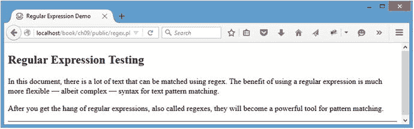

图 9-1。

The sample file for testing regular expressions

#### 用正则表达式替换文本

为了测试正则表达式，您将使用`<em>`标签包装匹配的模式，这些标签在测试文档中被设计为具有顶部和底部边框，以及黄色背景。

用正则表达式实现这一点类似于在 PHP 中使用`str_replace()`和`preg_replace()`函数。传递一个要匹配的模式，后跟一个用于替换匹配模式的字符串(或模式)。最后，传递要在其中执行搜索的字符串:

`preg_replace($pattern, $replacement, $string);`

Note

`preg_replace()`中的 p 表示使用了 PCRE。PHP 也有`ereg_replace()`，使用略有不同的 POSIX 正则表达式语法；然而，从 PHP 5.3.0 开始，`ereg`函数族就被弃用了。

在基本层面上，`str_replace()`和`preg_replace()`之间唯一的区别是传递给模式的`preg_replace()`的元素必须使用分隔符，这让函数知道正则表达式的哪一部分是模式，哪一部分由修饰符或影响模式匹配的标志组成。在本节的稍后部分，您将了解更多关于修改器的内容。

`preg_replace()`中 regex 模式的分隔符可以是位于模式开头和结尾的任何非字母数字、非反斜杠和非空白字符。最常见的是使用正斜杠(`/`)或散列符号(`#`)。例如，如果您想在一个字符串中搜索字母 cat，那么模式应该是`/cat/`(或者`#cat#`、`%cat%`、`@cat@`等等)。

#### 选择正则表达式与常规字符串替换

为了探究`str_replace()`和`preg_replace()`之间的区别，尝试使用这两个函数用`<em>`标签包装任何出现的单词 regular。对`regex.php`进行如下修改:

`<!DOCTYPE html`

`PUBLIC "-//W3C//DTD XHTML 1.0 Strict//EN"`

`"`[`http://www.w3.org/TR/xhtml1/DTD/xhtml1-strict.dtd`](http://www.w3.org/TR/xhtml1/DTD/xhtml1-strict.dtd)T2】

`<html xmlns="`[`http://www.w3.org/1999/xhtml`](http://www.w3.org/1999/xhtml)T2】

`<head>`

`<meta http-equiv="Content-Type"`

`content="text/html;charset=utf-8" />`

`<title>Regular Expression Demo</title>`

``

`</head>`

`<body>`

`<?php`

`/*`

`* Store the sample set of text to use for the examples of regex`

`*/`

`$string = <<<TEST_DATA`

`<h2>Regular Expression Testing</h2>`

`
`

`In this document, there is a lot of text that can be matched`

`using regex. The benefit of using a regular expression is much`

`more flexible, albeit complex, syntax for text`

`pattern matching.`

`
`

`
`

`After you get the hang of regular expressions, also called`

`regexes, they will become a powerful tool for pattern matching.`

`
`

`
`

`TEST_DATA;`

`/*`

`* Use str_replace() to highlight any occurrence of the word`

`* "regular"`

`*/`

`echo str_replace("regular", "<em>regular</em>", $string);`

`/*`

`* Use preg_replace() to highlight any occurrence of the word`

`* "regular"`

`*/`

`echo preg_replace("/regular/", "<em>regular</em>", $string);`

`?>`

`</body>`

`</html>`

在您的浏览器中执行这个脚本输出测试信息两次，结果相同(见图 [9-2](#Fig2) )。

图 9-2。

The word regular highlighted with both regexes and regular string replacement

### 深入了解模式修改器的基础知识

你可能注意到了，题目中的正则这个词并没有突出显示。这是因为前面的例子是区分大小写的。

要用简单的字符串替换来解决这个问题，您可以选择使用`str_ireplace()`函数，除了不区分大小写之外，它几乎与`str_replace()`相同。

对于正则表达式，您仍然使用`preg_replace()`，但是您需要一个修饰符来表示不区分大小写。修饰符是模式定界符后面的一个字母，为正则表达式提供关于它应该如何处理模式的附加信息。对于不区分大小写，应该应用修饰符`i`。

通过进行粗体显示的修改，修改`regex.php`以使用不区分大小写的替换功能:

`<!DOCTYPE html`

`PUBLIC "-//W3C//DTD XHTML 1.0 Strict//EN"`

`"`[`http://www.w3.org/TR/xhtml1/DTD/xhtml1-strict.dtd`](http://www.w3.org/TR/xhtml1/DTD/xhtml1-strict.dtd)T2】

`<html xmlns="`[`http://www.w3.org/1999/xhtml`](http://www.w3.org/1999/xhtml)T2】

`<head>`

`<meta http-equiv="Content-Type"`

`content="text/html;charset=utf-8" />`

`<title>Regular Expression Demo</title>`

``

`</head>`

`<body>`

`<?php`

`/*`

`* Store the sample set of text to use for the examples of regex`

`*/`

`$string = <<<TEST_DATA`

`<h2>Regular Expression Testing</h2>`

`
`

`In this document, there is a lot of text that can be matched`

`using regex. The benefit of using a regular expression is much`

`more flexible, albeit complex, syntax for text`

`pattern matching.`

`
`

`
`

`After you get the hang of regular expressions, also called`

`regexes, they will become a powerful tool for pattern matching.`

`
`

`
`

`TEST_DATA;`

`/*`

`* Use str_ireplace() to highlight any occurrence of the word`

`* "regular"`

`*/`

`echo str_ireplace("regular", "<em>regular</em>", $string);`

`/*`

`* Use preg_replace() to highlight any occurrence of the word`

`* "regular"`

`*/`

`echo preg_replace("/regular/i", "<em>regular</em>", $string);`

`?>`

`</body>`

`</html>`

现在，在浏览器中加载文件将突出显示所有出现的单词 regular，无论大小写如何(参见图 [9-3](#Fig3) )。

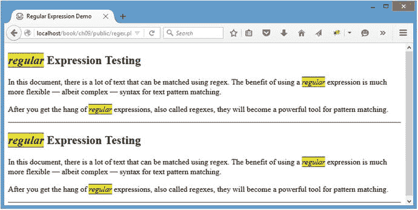

图 9-3。

A case-insensitive search of the sample data

正如你所看到的，这种方法有一个缺点:标题中大写的 regular 在被替换时被改为小写。在下一节中，您将学习如何通过在正则表达式中使用组来避免这个问题。

### 用反向引用变得有趣

当您应用正则表达式最有用的特性之一:分组和反向引用时，它的威力就开始显现了。组是用括号括起来的模式的任何一部分。一个组可以在替换字符串中(或者在模式的后面)使用反向引用，即一个命名组的编号引用。

这听起来很混乱，但实际上很简单。正则表达式中从左到右的每组括号都存储有一个数字反向引用，可以使用反斜杠和反向引用的编号(`\1`)或使用美元符号和反向引用的编号(`$1`)来访问。

这样做的好处是，它让正则表达式能够在替换中使用匹配的值，而不是像`str_replace()`及其类似物中那样使用预先确定的值。

为了将前面例子中的替换内容保留在适当的情况下，您需要使用两次`str_replace()`；然而，只需一次函数调用，就可以通过使用`preg_replace()`中的反向引用达到同样的效果。

对`regex.php`做如下修改，看看正则表达式中反向引用的威力:

`<!DOCTYPE html`

`PUBLIC "-//W3C//DTD XHTML 1.0 Strict//EN"`

`"`[`http://www.w3.org/TR/xhtml1/DTD/xhtml1-strict.dtd`](http://www.w3.org/TR/xhtml1/DTD/xhtml1-strict.dtd)T2】

`<html xmlns="`[`http://www.w3.org/1999/xhtml`](http://www.w3.org/1999/xhtml)T2】

`<head>`

`<meta http-equiv="Content-Type"`

`content="text/html;charset=utf-8" />`

`<title>Regular Expression Demo</title>`

``

`</head>`

`<body>`

`<?php`

`/*`

`* Store the sample set of text to use for the examples of regex`

`*/`

`$string = <<<TEST_DATA`

`<h2>Regular Expression Testing</h2>`

`
`

`In this document, there is a lot of text that can be matched`

`using regex. The benefit of using a regular expression is much`

`more flexible, albeit complex, syntax for text`

`pattern matching.`

`
`

`
`

`After you get the hang of regular expressions, also called`

`regexes, they will become a powerful tool for pattern matching.`

`
`

`
`

`TEST_DATA;`

`/*`

`* Use str_replace() to highlight any occurrence of the word`

`* "regular"`

`*/`

`$check1 = str_replace("regular", "<em>regular</em>", $string);`

`/*`

`* Use str_replace() again to highlight any capitalized occurrence`

`* of the word "Regular"`

`*/`

`echo str_replace("Regular", "<em>Regular</em>", $check1);`

`/*`

`* Use preg_replace() to highlight any occurrence of the word`

`* "regular", case-insensitive`

`*/`

`echo preg_replace("/(regular)/i", "<em>$1</em>", $string);`

`?>`

`</body>`

`</html>`

如前面的代码所示，使用`str_replace()`进行任何复杂的字符串匹配已经变得很麻烦。然而，在保存前面的更改并重新加载浏览器后，您可以使用正则表达式和标准字符串替换来获得想要的结果(参见图 [9-4](#Fig4) )。

图 9-4。

A more complex replacement Note

本节中的其余示例将只使用正则表达式。

### 匹配字符类

在某些情况下，希望匹配的不仅仅是一个单词。例如，有时您希望验证是否只使用了特定范围的字符(即，确保只为电话号码提供了数字，或者用户名字段中没有使用特殊字符)。

正则表达式允许您指定一个字符类，它是一组用方括号括起来的字符。例如，要匹配字母 a 和字母 c 之间的任何字符，可以在模式中使用`[a-c]`。

可以修改`regex.php`高亮显示 A-C 中的任意字符，另外可以将模式移入变量，在样本数据底部输出；这有助于您了解加载脚本时使用的是什么模式。添加以粗体显示的代码来实现这一点:

`<!DOCTYPE html`

`PUBLIC "-//W3C//DTD XHTML 1.0 Strict//EN"`

`"`[`http://www.w3.org/TR/xhtml1/DTD/xhtml1-strict.dtd`](http://www.w3.org/TR/xhtml1/DTD/xhtml1-strict.dtd)T2】

`<html xmlns="`[`http://www.w3.org/1999/xhtml`](http://www.w3.org/1999/xhtml)T2】

`<head>`

`<meta http-equiv="Content-Type"`

`content="text/html;charset=utf-8" />`

`<title>Regular Expression Demo</title>`

``

`</head>`

`<body>`

`<?php`

`/*`

`* Store the sample set of text to use for the examples of regex`

`*/`

`$string = <<<TEST_DATA`

`<h2>Regular Expression Testing</h2>`

`
`

`In this document, there is a lot of text that can be matched`

`using regex. The benefit of using a regular expression is much`

`more flexible, albeit complex, syntax for text`

`pattern matching.`

`
`

`
`

`After you get the hang of regular expressions, also called`

`regexes, they will become a powerful tool for pattern matching.`

`
`

`
`

`TEST_DATA;`

`/*`

`* Use regex to highlight any occurence of the letters a-c`

`*/`

`$pattern = "/([a-c])/i";`

`echo preg_replace($pattern, "<em>$1</em>", $string);`

`/*`

`* Output the pattern you just used`

`*/`

`echo "\n
Pattern used: <strong>$pattern</strong>
";`

`?>`

`</body>`

`</html>`

重新加载页面后，你会看到字符高亮显示(见图 [9-5](#Fig5) )。您可以使用`[abc]`、`[bac]`或任何其他字符组合获得相同的结果，因为该类将匹配该类中的任何一个字符。此外，因为您使用了不区分大小写的修饰符(`i`)，所以不需要包含字母的大写和小写版本。如果没有修饰符，您将需要使用`[A-Ca-c]`来匹配三个字母的任意一种情况。

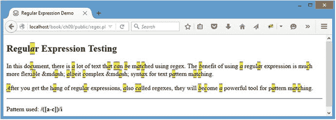

图 9-5。

Any character from A-C is highlighted

#### 匹配除。。。

要匹配除类中的字符之外的任何字符，请在字符类前面加上一个脱字符号(`^`)。为了突出显示除 A-C 以外的任何字符，使用图案`/([^a-c])/i`(参见图 [9-6](#Fig6) )。

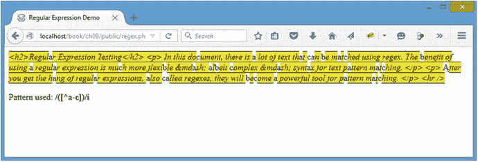

图 9-6。

Highlighting all characters, except letters A-C Note

值得一提的是，前面的模式将字符类括在括号内。字符类不存储反向引用，所以以后仍必须使用括号来引用匹配的文本。

#### 使用字符类速记

某些字符类有一个速记字符。例如，每个单词、数字或空格字符都有一个速记类:

*   Word 字符类速记(`\w`):匹配类似`[A-Za-z0-9_]`的模式
*   数字字符类速记(`\d`):匹配类似`[0-9]`的模式
*   空白字符类速记(`\s`):匹配类似`[ \t\r\n]`的模式

使用这三个简写类可以提高正则表达式的可读性，这在处理更复杂的模式时非常方便。

您可以通过将速记字符大写来排除特定类型的字符:

*   非单词字符类速记(`\W`):匹配类似`[^A-Za-z0-9_]`的模式
*   非数字字符类速记(`\D`):匹配类似`[^0-9]`的模式
*   非空白字符类速记(`\S`):匹配类似`[^ \t\r\n]`的模式

Note

`\t`、`\r`、`\n`是代表制表符和换行符的特殊字符；空格由常规空格字符( )表示。

### 查找单词边界

另一个需要注意的特殊符号是单词边界符号(`\b`)。通过将它放在一个模式之前和/或之后，可以确保该模式不包含在另一个单词中。例如，如果您想匹配单词 stat，而不是恒温器、统计数据或狂喜，您可以使用这个模式:`/\bstat\b/`。

### 使用重复运算符

当使用字符类时，只有一个字符匹配，除非模式指定了不同的字符数。正则表达式为您提供了几种方法来指定要匹配的字符数:

*   星号(`*`)匹配一个字符的零个或多个出现。
*   加号运算符(`+`)匹配一个或多个出现的字符。
*   特殊的重复运算符(`{min,max}`)允许您指定字符匹配的范围。

当使用可能包含也可能不包含某个模式片段的字符串时，匹配零个或多个字符非常有用。例如，如果您想要匹配 John 或 John Doe 的所有出现，您可以使用这个模式来匹配这两个实例:`/John( Doe)*/`。

匹配一个或多个字符有助于验证至少输入了一个字符。例如，如果您希望验证用户在表单输入中至少输入了一个字符，并且该字符是有效的单词字符，那么您可以使用这个模式来验证输入:`/\w+/`。

最后，匹配特定范围的字符在匹配数字范围时特别有用。例如，您可以使用这个模式来确保一个值在`0`和`99`之间:`/\b\d{1,2}\b/`。

在您的示例文件中，使用这个 regex 模式查找恰好由四个字母组成的任何单词:`/(\b\w{4}\b)/`。您可以在图 [9-7](#Fig7) 中看到结果。

图 9-7。

Matching only words that consist of exactly four letters

### 检测字符串的开头或结尾

此外，您可以强制模式从字符串的开头或结尾(或两者)开始匹配。如果模式以一个插入符号(`^`)开始，正则表达式只有在模式以一个匹配字符开始时才匹配。如果以美元符号(`$`)结尾，则只有在字符串以前面的匹配字符结尾时，正则表达式才会匹配。

您可以组合这些不同的符号，以确保整个字符串匹配一个模式。这在验证输入时很有用，因为您可以验证用户只提交了有效的信息。例如，您可以使用这个 regex 模式来验证用户名是否只包含字母 A-Z、数字 0-9 和下划线字符:`/^\w+$/`。

### 使用替代方案

在某些情况下，最好使用一种模式或另一种模式。这被称为交替，它是使用管道字符(`|`)来完成的。这种方法允许您为匹配定义两种或多种可能性。例如，您可以使用这个模式来匹配`regex.php` : `/\b(\w{3}|\w{6,7})\b/`中的三个、六个或七个字母的单词。图 [9-8](#Fig8) 显示了结果。

图 9-8。

Using alternation to match only three-, six-, and seven-letter words

### 使用可选项目

在某些情况下，有必要允许某些项目是可选的。例如，要匹配单词 like 表达式的单复数形式，您需要使 s 可选。

为此，请在可选项目后放置一个问号(`?`)。如果模式的可选部分长于一个字符，则需要在一个组中捕获它(您将在下一节中使用这种技术)。

现在，使用这个模式来突出显示所有出现的单词 expression 或 expressions: `/(expressions?)/i`。图 [9-9](#Fig9) 显示了结果。

图 9-9。

Matching a pattern with an optional s at the end

### 把这一切放在一起

现在您已经对正则表达式有了大致的了解，是时候使用您的新知识来编写一个正则表达式模式，它将匹配任何出现的短语正则表达式或正则表达式，包括复数形式。

首先，查找短语 regex: `/(regex)/i`(参见图 [9-10](#Fig10) )。

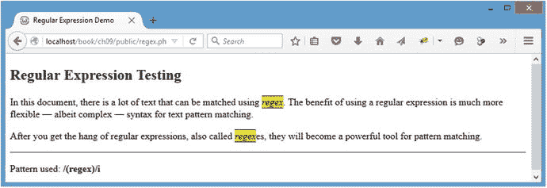

图 9-10。

Matching the word regex

接下来，通过在末尾插入一个可选的 es 来增加短语成为复数的能力:`/(regex` `(es)?` `)/i`(见图 [9-11](#Fig11) )。

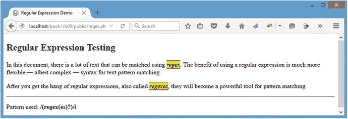

图 9-11。

Adding the optional match for the plural form of regex

接下来，添加到模式中，使其也匹配单词 regular，并在单词 regular 后面加一个空格，并使匹配可选:`/(reg` `(ular\s)?` `ex(es)?)/i`(参见图 [9-12](#Fig12) )。

图 9-12。

Adding an optional check for the word regular

现在扩展模式以匹配单词 expression 作为 es: `/(reg(ular\s)?ex(` `pression|` `es)?)/i`(见图 [9-13](#Fig13) )。

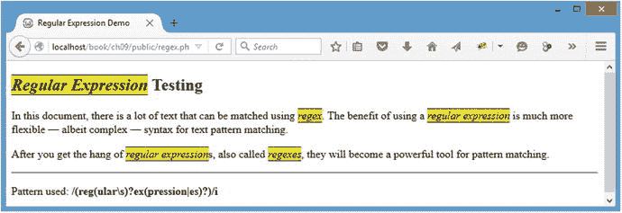

图 9-13。

Adding alternation to match expression

最后，在匹配表达式的末尾加一个可选的 s:`/(reg(ular\s)?ex(pression``s?``|es)?)/i`(见图 [9-14](#Fig14) )。

图 9-14。

The completed regular expression Tip

本章中的例子介绍了正则表达式最常见的特性，但并没有涵盖正则表达式必须提供的所有特性。Jan Goyvaerts 在 [`www.regular-expressions.info/`](http://www.regular-expressions.info/) 为学习正则表达式的所有细节以及测试它们的一些工具提供了一个极好的资源。

## 添加服务器端日期验证

现在您已经对正则表达式有了基本的了解，可以开始验证用户输入了。对于这个应用，您需要确保日期格式是正确的，这样应用就不会因为试图解析它无法理解的日期而崩溃。

您将从添加服务器端验证开始。这更像是一个后备方案，因为稍后您将使用 jQuery 添加验证。但是，您不应该仅仅依赖 JavaScript 来验证用户输入，因为用户可以很容易地关闭 JavaScript 支持，从而完全禁用您的 JavaScript 验证工作。

### 定义正则表达式模式来验证日期

实现日期验证的第一步是定义一个正则表达式模式来匹配所需的格式。日历 app 使用的格式是`YYYY-MM-DD HH:MM:SS`。

## 设置测试数据

您需要用一个有效的日期格式和一些无效的格式来修改`regex.php`,这样您就可以测试您的模式了。首先将零个或多个数字字符与您的正则表达式模式进行匹配。为此，请进行以下以粗体显示的更改:

`<!DOCTYPE html`

`PUBLIC "-//W3C//DTD XHTML 1.0 Strict//EN"`

`"`[`http://www.w3.org/TR/xhtml1/DTD/xhtml1-strict.dtd`](http://www.w3.org/TR/xhtml1/DTD/xhtml1-strict.dtd)T2】

`<html xmlns="`[`http://www.w3.org/1999/xhtml`](http://www.w3.org/1999/xhtml)T2】

`<head>`

`<meta http-equiv="Content-Type"`

`content="text/html;charset=utf-8" />`

`<title>Regular Expression Demo</title>`

``

`</head>`

`<body>`

`<?php`

`/*`

`* Set up several test date strings to ensure validation is working`

`*/`

`$date[] = '2016-01-14 12:00:00';`

`$date[] = 'Saturday, May 14th at 7pm';`

`$date[] = '02/03/10 10:00pm';`

`$date[] = '2016-01-14 102:00:00';`

`/*`

`* Date validation pattern`

`*/`

`$pattern = "/(\d*)/";`

`foreach ( $date as $d )`

`{`

`echo "
", preg_replace($pattern, "<em>$1</em>", $d), "
";`

`}`

`/*`

`* Output the pattern you just used`

`*/`

`echo "\n
Pattern used: <strong>$pattern</strong>
";`

`?>`

`</body>`

`</html>`

保存上述代码后，在浏览器中重新加载`http://localhost/regex.php`以查看所有高亮显示的数字字符(参见图 [9-15](#Fig15) )。

图 9-15。

Matching any numeric character

### 匹配日期格式

要匹配日期格式，首先匹配字符串开头的四位数字以验证年份:`/^(\d{4})/`(参见图 [9-16](#Fig16) )。

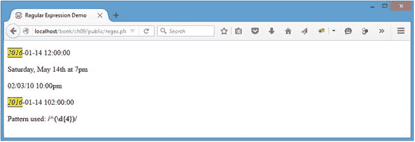

图 9-16。

Validating the year section of the date string

接下来，您需要通过匹配连字符和另外两位数字来验证月份:`/^(\d{4}` `(-\d{2})` `)/`(见图 [9-17](#Fig17) )。

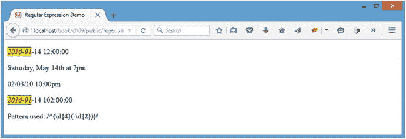

图 9-17。

Expanding the validate month section of the date string

请注意，月份和日期部分是相同的:一个连字符后跟两位数字。这意味着您可以简单地重复月份匹配模式，在组:`/^(\d{4}(-\d{2})` `{2}` `)/`(参见图 [9-18](#Fig18) )之后使用重复运算符来验证日期。

图 9-18。

Adding the day part of the date string to the pattern

现在匹配单个空格和小时段:`/^(\d{4}(-\d{2}){2}` `(\d{2})` `)/`(见图 [9-19](#Fig19) )。

图 9-19。

Validating the hour section of the date string Note

确保包含空格字符。不应该使用速记类(`\s`)，因为在这种情况下新的行和制表符不应该匹配。

为了验证分钟，您匹配一个冒号和两个数字:`/^(\d{4}(-\d{2}){2} (\d{2})` `(:\d{2})` `)/`(参见图 [9-20](#Fig20) )。

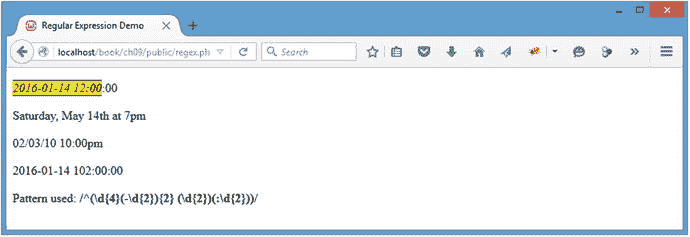

图 9-20。

Validating the minutes section of the date string

最后，重复分钟的模式以匹配秒，然后使用美元符号修饰符来匹配字符串的结尾:`/^(\d{4}(-\d{2}){2} (\d{2})(:\d{2})` `{2}` `)` `$` `/`(见图 [9-21](#Fig21) )。

图 9-21。

Validating the seconds section of the date string and completing the pattern

有了这个正则表达式模式，现在可以验证应用中的日期输入了。

### 向 Calendar 类添加验证方法

为了验证日期字符串，您将向名为`_validDate()`的`Calendar`类添加一个新的私有方法。该方法将接受要验证的日期字符串，然后使用`preg_match()`将其与验证模式进行比较，后者返回在给定字符串中找到的匹配数。因为这个特定的模式只有在整个字符串都符合该模式时才会匹配，所以有效的日期将返回`1`，而无效的日期将返回`0`。如果日期有效，该方法将返回`TRUE`；否则将返回`FALSE`。

通过将以下粗体代码插入到`class.calendar.inc.php`中，将该方法添加到`Calendar`类中:

`<?php`

`declare(strict_types=1);`

`class Calendar extends DB_Connect`

`{`

`private $_useDate;`

`private $_m;`

`private $_y;`

`private $_daysInMonth;`

`private $_startDay;`

`public function __construct($dbo=NULL, $useDate=NULL) {...}`

`public function buildCalendar() {...}`

`public function displayEvent($id) {...}`

`public function displayForm() {...}`

`public function processForm() {...}`

`public function confirmDelete($id) {...}`

`/**`

`* Validates a date string`

`*`

`* @param string $date the date string to validate`

`* @return bool TRUE on success, FALSE on failure`

`*/`

`private function _validDate($date)`

`{`

`/*`

`* Define a regex pattern to check the date format`

`*/`

`$pattern = '/^(\d{4}(-\d{2}){2} (\d{2})(:\d{2}){2})$/';`

`/*`

`* If a match is found, return TRUE. FALSE otherwise.`

`*/`

`return preg_match($pattern, $date)==1 ? TRUE : FALSE;`

`}`

`private function _loadEventData($id=NULL) {...}`

`private function _createEventObj() {...}`

`private function _loadEventById($id) {...}`

`private function _adminGeneralOptions() {...}`

`private function _adminEntryOptions($id) {...}`

`}`

`?` `>`

### 如果日期未通过验证，则返回错误

下一步是修改`processForm()`方法，使它在新条目的开始和结束时间调用`_validDate()`方法。如果验证失败，只需返回一条错误消息。

将以下粗体代码添加到`processForm()`以实现验证:

`<?php`

`declare(strict_types=1);`

`class Calendar extends DB_Connect`

`{`

`private $_useDate;`

`private $_m;`

`private $_y;`

`private $_daysInMonth;`

`private $_startDay;`

`public function __construct($dbo=NULL, $useDate=NULL) {...}`

`public function buildCalendar() {...}`

`public function displayEvent($id) {...}`

`public function displayForm() {...}`

`/**`

`* Validates the form and saves/edits the event`

`*`

`* @return mixed TRUE on success, an error message on failure`

`*/`

`public function processForm()`

`{`

`/*`

`* Exit if the action isn’t set properly`

`*/`

`if ( $_POST['action']!='event_edit' )`

`{`

`return "The method processForm was accessed incorrectly";`

`}`

`/*`

`* Escape data from the form`

`*/`

`$title = htmlentities($_POST['event_title'], ENT_QUOTES);`

`$desc = htmlentities($_POST['event_description'], ENT_QUOTES);`

`$start = htmlentities($_POST['event_start'], ENT_QUOTES);`

`$end = htmlentities($_POST['event_end'], ENT_QUOTES);`

`/*`

`* If the start or end dates aren’t in a valid format, exit`

`* the script with an error`

`*/`

`if ( !$this->_validDate($start)`

`|| !$this->_validDate($end) )`

`{`

`return "Invalid date format! Use YYYY-MM-DD HH:MM:SS";`

`}`

`/*`

`* If no event ID passed, create a new event`

`*/`

`if ( empty($_POST['event_id']) )`

`{`

`$sql = "INSERT INTO `events``

`(`event_title`, `event_desc`, `event_start`,`

``event_end`)`

`VALUES`

`(:title, :description, :start, :end)";`

`}`

`/*`

`* Update the event if it’s being edited`

`*/`

`else`

`{`

`/*`

`* Cast the event ID as an integer for security`

`*/`

`$id = (int) $_POST['event_id'];`

`$sql = "UPDATE `events``

`SET`

``event_title`=:title,`

``event_desc`=:description,`

``event_start`=:start,`

``event_end`=:end`

`WHERE `event_id`=$id";`

`}`

`/*`

`* Execute the create or edit query after binding the data`

`*/`

`try`

`{`

`$stmt = $this->db->prepare($sql);`

`$stmt->bindParam(":title", $title, PDO::PARAM_STR);`

`$stmt->bindParam(":description", $desc, PDO::PARAM_STR);`

`$stmt->bindParam(":start", $start, PDO::PARAM_STR);`

`$stmt->bindParam(":end", $end, PDO::PARAM_STR);`

`$stmt->execute();`

`$stmt->closeCursor();`

`/*`

`* Returns the ID of the event`

`*/`

`return $this->db->lastInsertId();`

`}`

`catch ( Exception $e )`

`{`

`return $e->getMessage();`

`}`

`}`

`public function confirmDelete($id) {...}`

`private function _validDate($date) {...}`

`private function _loadEventData($id=NULL) {...}`

`private function _createEventObj() {...}`

`private function _loadEventById($id) {...}`

`private function _adminGeneralOptions() {...}`

`private function _adminEntryOptions($id) {...}`

`}`

`?>`

您可以通过在`http://localhost/admin.php`向表格中输入错误条目来测试有效性(参见图 [9-22](#Fig22) )。

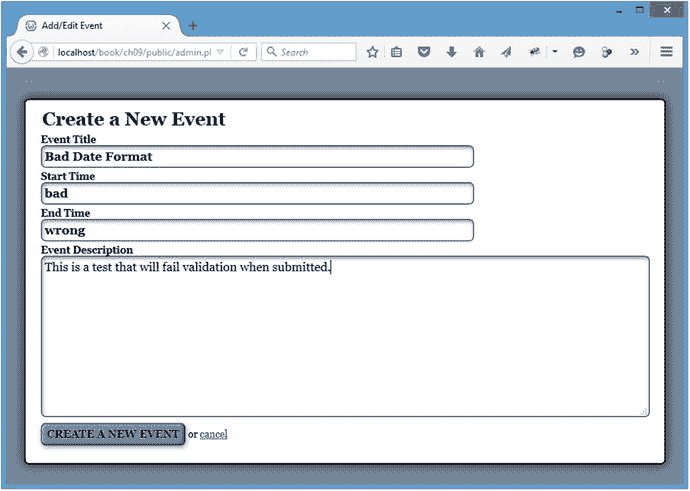

图 9-22。

An entry with bad date values that should fail validation Note

您使用`http://localhost/admin.php`是因为您的服务器端验证被调用的唯一原因是用户禁用了 JavaScript。在这种情况下，模式窗口将不起作用，用户将被带到这个窗体。在启用 JavaScript 的情况下，服务器端充当双重检查和针对恶意用户的额外安全措施。

提交该表单后，应用将简单地输出错误信息并终止(见图 [9-23](#Fig23) )。日历应用是为启用了 JavaScript 的用户设计的；使用这种方法可以防止应用显示错误。

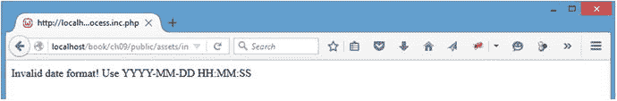

图 9-23。

The error message displayed when invalid dates are supplied

## 添加客户端日期验证

对于大多数用户，JavaScript 将被启用。用户在表单上获得即时反馈要方便得多，因此您将添加新的 jQuery 功能来在客户端验证日期字符串。

### 创建新的 JavaScript 文件来验证日期字符串

因为您将在下一章继续使用这个脚本，所以您应该将它放在一个名为`valid-date.js`的`js`文件夹中的单独文件中。这个文件将包含一个功能上等同于`Calendar`类中的`_validDate()`方法的函数。

它将接受一个日期进行验证，根据您之前使用`match()`编写的日期匹配正则表达式模式进行检查，如果找到匹配，则返回`true`，如果`match()`返回 null，则返回`false`。

您可以通过将以下代码插入到`valid-date.js`中来构建这个函数:

`"use strict";`

`// Checks for a valid date string (YYYY-MM-DD HH:MM:SS)`

`function validDate(date)`

`{`

`// Define the regex pattern to validate the format`

`var pattern = /^(\d{4}(-\d{2}){2} (\d{2})(:\d{2}){2})$/;`

`// Returns true if the date matches, false if it doesn’t`

`return date.match(pattern)!=null;`

`}`

Note

正则表达式模式没有用引号括起来。如果使用引号，模式将被存储为一个字符串，并相应地进行解释。这将导致脚本寻找精确的字符匹配，而不是正确地解释正则表达式模式。

### 在页脚中包含新文件

要使用`validDate()`函数，您需要在`init.js`之前包含新的 JavaScript 文件，以便可以调用该函数。打开`common`文件夹中的`footer.inc.php`，插入以下粗体代码:

``

``

`</body>`

`</html>`

### 如果验证失败，阻止表单提交

现在`init.js`中有了`validDate()`，您需要在提交表单之前添加日期验证。将开始和结束日期存储在变量中(分别是`start`和`end`，然后在允许提交表单之前使用`validDate()`检查它们。

接下来，将 click 处理程序修改为表单上的 Submit 按钮，该按钮用于编辑或创建事件，如果任一日期输入有无效值，则触发一个带有有用错误消息的警报。您还需要防止表单被提交，这样用户就不必重新填充其他表单域。

您可以通过在`init.js`中插入以下粗体代码来实现这一点:

`// Makes sure the document is ready before executing scripts`

`jQuery(function($){`

`var processFile = "assets/inc/ajax.inc.php",`

`fx = {...}`

`$("body").on("click", "li>a", function(event){...});`

`$("body").on("click", ".admin-options form,.admin", function(event){...});`

`$("body").on("click", ".edit-form a:contains(cancel)", function(event){...});`

`// Edits events without reloading`

`$("body").on("click", ".edit-form input[type=submit]", function(event){`

`// Prevents the default form action from executing`

`event.preventDefault();`

`// Serializes the form data for use with $.ajax()`

`var formData = $(this).parents("form").serialize(),`

`// Stores the value of the submit button`

`submitVal = $(this).val(),`

`// Determines if the event should be removed`

`remove = false,`

`// Saves the start date input string`

`start = $(this).siblings("[name=event_start]").val(),`

`// Saves the end date input string`

`end = $(this).siblings("[name=event_end]").val();`

`// If this is the deletion form, appends an action`

`if ( $(this).attr("name")=="confirm_delete" )`

`{`

`// Adds necessary info to the query string`

`formData += "&action=confirm_delete"`

`+ "&confirm_delete="+submitVal;`

`// If the event is really being deleted, sets`

`// a flag to remove it from the markup`

`if ( submitVal=="Yes, Delete It" )`

`{`

`remove = true;`

`}`

`}`

`// If creating/editing an event, checks for valid dates`

`if ( $(this).siblings("[name=action]").val()=="event_edit" )`

`{`

`if ( !validDate(start) || !validDate(end) )`

`{`

`alert("Valid dates only! (YYYY-MM-DD HH:MM:SS)");`

`return false;`

`}`

`}`

`// Sends the data to the processing file`

`$.ajax({`

`type: "POST",`

`url: processFile,`

`data: formData,`

`success: function(data) {`

`// If this is a deleted event, removes`

`// it from the markup`

`if ( remove===true )`

`{`

`fx.removeevent();`

`}`

`// Fades out the modal window`

`fx.boxout();`

`// If this is a new event, adds it to`

`// the calendar`

`if ( $("[name=event_id]").val().length==0`

`&& remove===false )`

`{`

`fx.addevent(data, formData);`

`}`

`},`

`error: function(msg) {`

`alert(msg);`

`}`

`});`

`});`

现在保存这些更改，在浏览器中加载`http://localhost/`，然后使用模态窗口表单创建一个带有坏参数的新事件(见图 [9-24](#Fig24) )。

图 9-24。

An entry that will fail to validate

如果此时单击提交按钮，验证将失败，应用将显示一个警告框，其中包含关于日期格式的错误消息(参见图 [9-25](#Fig25) )。

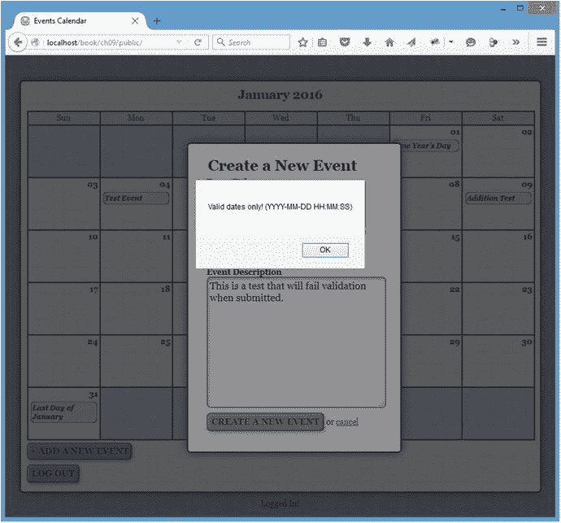

图 9-25。

The error message in an alert box after failing validation

单击警告框中的 OK 按钮后，用户将能够编辑她的条目，而不必重新填充任何字段。

## 摘要

在这一章中，你解决了使用正则表达式进行表单验证的问题。您学到的概念可以应用于验证任何类型的数据，它们将极大地帮助您确保表单中提供的信息可以被您的应用使用。

在下一章中，您将学习如何扩展 jQuery 对象，包括直接扩展 jQuery 核心和为 jQuery 开发定制插件。