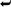

# 十一、PHP 7 简介

在本附录中，我们简要分析了 PHP 语言版本 7 中的一些变化。

大多数遗留代码将保持不变地运行(就像本书前一版本中的所有代码一样)，但是这里我们来看看那些对您的目的最有用的新特性。

Note

要进一步了解 PHP 7 的所有变化，请参见 [`http://php.net/manual/en/migration70.php`](http://php.net/manual/en/migration70.php) 的官方迁移指南。

## 严格打字

对于那些在编码实践中喜欢结构和纪律的人来说，PHP 7 中一个受欢迎的新增功能是可选的每个文件的指令`strict_types`，它使文件中的所有函数调用和返回语句都接受标量类型的“严格”类型检查。而且除了已经存在的`callable`和`array`类型，PHP 7 还增加了`string`、`int`、`float`和`bool`变量类型。参数类型在参数列表中指定，返回类型在参数列表后用冒号指定。

下面是一些严格类型:

`<?php`

`declare(strict_types=1);`

`function doStuff(``int``$int=0,``string``$str="",``float``$flt=0.0,``bool``$b=False)``: string`

`{`

`echo $int . " ";`

`echo $flt . " ";`

`echo $b . " ";`

`return $str;`

`}`

`$output = doStuff(1, "hi there", "2.34", True);` `// Oops! 2.34 should not have quotes!`

`echo $output . " ";`

`?>`

当您在浏览器中加载该脚本时，您将看到如下内容:

`Fatal error``: Uncaught TypeError: Argument 3 passed to doStuff() must be of the type`T2】

`float, string given, called in C:\wamp\www\book\appendix\test.php on line 13 and` 

`defined in C:\wamp\www\book\appendix\test.php:5 Stack trace: #0` 

`C:\wamp\www\book\appendix\test.php(13): doStuff(1, 'hi there', '2.34', true)` 

`#1 {main} thrown in``C:\wamp\www\book\appendix\test.php``on line`T3】

这其实是一件好事！通常情况下，代码尽早失败并发出噪音会更好。无声的臭虫本质上是你(或者更糟，一个用户)会引爆的地雷，通常是在相当不方便的时候。在`doStuff()`的定义中的参数类型声明为它的第三个参数指定了一个`float`，但是却传递了一个`string`(因为引号的原因)。

让我们通过去掉`2.34`周围的引号来修复参数类型错误，然后引入另一个不同的错误——返回类型错误。代码如下:

`<?php`

`declare(strict_types=1);`

`function doStuff(int $int=0, string $str="", float $flt=0.0, bool $b=False): string`

`{`

`echo $int . " ";`

`echo $flt . " ";`

`echo $b . " ";`

`return $flt;` `// Oops! Supposed to be a string (such as $str).`

`}`

`$output = doStuff(1, "hi there", 2.34, True);`

`echo $output . " ";`

`?>`

当您在浏览器中加载这个脚本时，您会看到

`1`

`2.34`

`1`

`Fatal error``: Uncaught TypeError: Return value of doStuff() must be of the type`T2】

`string, float returned in C:\wamp\www\book\appendix\test.php:10 Stack trace:` 

`#0 C:\wamp\www\book\appendix\test.php(13): doStuff(1, 'hi there', 2.34, true) #1` 

`{main} thrown in``C:\wamp\www\book\appendix\test.php``on line`T3】

这一次，你用错误的回球类型“画了犯规”:a `float`而不是承诺的`string`。

尽管这最终是个人(或团队)偏好的问题，但我们相信 PHP 7 中引入的严格类型是非常值得的，并且可能是新添加的特性中最有用的。

## 新例外

除了上面讨论的严格类型之外，PHP 7 还提供了相应的异常:`TypeError`。

下面是使用这种新的异常类型封装在`try`块中的上述代码:

`<?php`

`declare(strict_types=1);`

`function doStuff(int $int=0, string $str="", float $flt=0.0, bool $b=False): string`

`{`

`echo $int . " ";`

`echo $flt . " ";`

`echo $b . " ";`

`return $flt; // Oops! Supposed to be a string (such as $str).`

`}`

`try {`

`$output = doStuff(1, "hi there", 2.34, True);`

`echo $output . " ";`

`} catch(TypeError $e) {`

`echo $e;`

`}`

`?>`

您可以选择如何最好地处理异常，但关键是错误不再是致命的。上面的代码转储关于异常的所有信息:

`1`

`2.34`

`1`

`TypeError: Return value of doStuff() must be of the type string, float returned` 

`in C:\wamp\www\book\appendix\test.php:10 Stack trace: #0` 

`C:\wamp\www\book\appendix\test.php(14): doStuff(1, 'hi there', 2.34, true) #1 {main}`

PHP 7 中还包含了`ArithmeticError`、`AssertionError`、`DivisionByZeroError`和`ParseError`异常。有关更多信息，请参考上面给出的链接。

## 常量数组

另一个受欢迎的特性是定义常量(只读)数组的能力。这保护了查找表和其他在程序执行期间不打算改变的数据。该数组可以根据需要深度嵌套。

与普通变量不同，数组常量前面没有$符号，通常(尽管不是必需的)用大写字母来命名它们。否则，语法是熟悉的:

`<?php`

`declare(strict_types=1);`

`define('ACTIONS', array(`

`'user_login' => array(`

`'object' => 'Admin',`

`'method' => 'processLoginForm',`

`'header' => 'Location: ../../'`

`),`

`'user_logout' => array(`

`'object' => 'Admin',`

`'method' => 'processLogout',`

`'header' => 'Location: ../../'`

`)`

`)`

`);`

`echo ACTIONS['user_logout']['method'];`

`?>`

结果如下:

`processLogout`

如果试图通过添加新值或重新分配现有值来改变常量数组，如下所示:

`<?php`

`declare(strict_types=1);`

`define('ACTIONS', array(`

`'user_login' => array(`

`'object' => 'Admin',`

`'method' => 'processLoginForm',`

`'header' => 'Location: ../../'`

`),`

`'user_logout' => array(`

`'object' => 'Admin',`

`'method' => 'processLogout',`

`'header' => 'Location: ../../'`

`)`

`)`

`);`

`ACTIONS['user_logout']['method'] = 'somethingElse'; // Not allowed!`

`?>`

然后，令人高兴的是，当您的代码运行时，您将立即发现类似这样的消息:

`Fatal error``: Cannot use temporary expression in write context in`T2】

`C:\wamp\www\appendix\test.php``on line`T2】

对于那些喜欢在编码实践中增加结构和安全性的人来说，这又是一个福音。

## 参数解包

添加的另一个方便的特性是参数解包，其中数组变量的元素可以作为一个函数的单独参数展开，该函数需要一个标量列表而不是一个数组作为其输入。这使您可以更加灵活地调用给定的函数，而不必在其定义中重写参数列表(对于库函数，您甚至可能没有这个选项)。

这个操作符通常被称为“splat”操作符(尤其是 Ruby 社区)，由三个点(句点)组成，用法如下:

`<?php`

`declare(strict_types=1);`

`function add($a, $b, $c) {`

`return $a + $b + $c;`

`}`

`$two_more = [2, 5];`

`echo add(1, ...$two_more); // Unpack the elements of $two_more.`

`?>`

你得到预期的总和:

`8`

注意，虽然`...`操作符解包了它所应用的数组中的所有元素，但函数调用仍然只使用其定义中列出的那些参数。换句话说，如果要解包的数组包含两个以上的元素(在本例中)，那么所有附加的元素都会被忽略。(你可以自己试一下，看看类似于`$two_more = [2, 5, 77, -13];`的东西仍然给出与上面的`8`相同的和。)这与现有的 PHP 行为一致。

## 整数除法

增加了一个整数除法函数`intdiv()`，使整数除法变得方便明了。它的工作方式正如您所料:

`<?php`

`declare(strict_types=1);`

`$num = 11;`

`$den = 3;`

`$result = intdiv($num, $den);`

`echo $result;`

`?>`

返回截断的整数值:

`3`

## 句法糖

在撰写本文时，PHP 7 的最终版本仍然悬而未决，我们鼓励您查看最新的文档，但是这里我们提到了一些已经发布的好东西。

添加了一个特殊的条件操作符，称为“null coalesce”操作符，用双问号表示，它扩展了三元条件操作符的功能。null coalesce 运算符在下降到最终值之前检查非 null 值。此外，这个新操作符是可链接的。

一段代码说明了一切:

`<?php`

`declare(strict_types=1);`

`$alpha = null;`

`$beta = null;`

`$gamma = "I’m not null!";`

`echo $alpha ?? 'this value' . " ";`

`echo $alpha ?? $beta ?? $gamma ?? 'that value' . " "; // chainable`

`?>`

输出是

`this value`

`I’m not null!`

我们要看的最后一个特性无疑是受 Perl 社区的启发，它与排序有关。考虑下面的例程，尽管它很笨拙，但它执行不区分大小写的字母排序:

`<?php`

`declare(strict_types=1);`

`$values = ['Zebra', 'zed', 'apple', 'baseball', 'Angel'];`

`usort($values, function($a, $b) {`

`$x = strtolower($a);`

`$y = strtolower($b);`

`return ($x < $y) ? -1 : (($x > $y) ? 1 : 0);`

`});`

`var_dump($values);`

`?>`

这段代码确实完成了工作:

`array(5) { [0]=> string(5) "Angel" [1]=> string(5) "apple" [2]=> string(8) "baseball"` 

`[3]=> string(5) "Zebra" [4]=> string(3) "zed" }`

但是使用新的 PHP 7“飞船”操作符`<=>`，同样的结果可以更好地实现，如下面的代码所示:

`<?php`

`declare(strict_types=1);`

`$values = ['Zebra', 'zed', 'apple', 'baseball', 'Angel'];`

`usort($values, function($a, $b) {`

`return strtolower($a) <=> strtolower($b); // spaceship!`

`});`

`var_dump($values);`

`?>`

您可以检查输出是否与之前完全相同，但是使用了更简洁的代码。

同样，请继续在线查看最新的 PHP 7 文档，以获得对所有语言特性的详尽论述和详细的迁移指南。