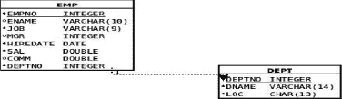
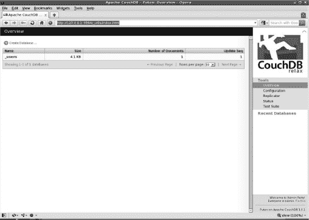
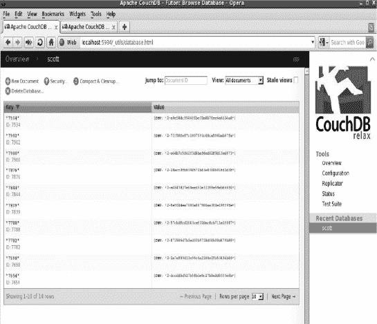
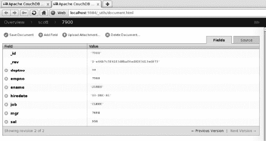

# 七、数据库集成 I

在这一章中，我们将主要讨论 NoSQL 数据库。NoSQL 数据库中最受欢迎的是 MongoDB、CouchDB、Google Big Table 和 Cassandra，但还有其他一些。顾名思义，NoSQL 数据库不是经典的 SQL 数据库，并且不实现 ACID 属性。ACID 代表原子性、一致性、隔离性和持久性，这些都是 RDBMS(关系数据库管理系统)事务的传统特征。

NoSQL 数据库没有事务管理层、提交或回滚事务的能力。它们也是无模式的，这意味着它们不符合传统的模式-表-列模式。它们拥有*集合*，而不是表格，集合不同于表格，因为它们可以保存各种行或文档，正如 NoSQL 数据库所称的那样。行和文档的区别在于，行有固定的结构，由关系模式定义，而文档没有。此外，NoSQL 数据库不存储传统意义上的行；他们储存文件。在 JSON (JavaScript 对象符号)符号中，文档被描述为对象。

下面是一个 JSON 文档的例子:

`var= { "key1":"value1",
           "key2": { "key3":"value3" },
           "key4":["a1","a2","a3"...],
          …
         }`

这种格式是为缩短冗长的 XML 描述而开发的许多格式之一。NoSQL 数据库大多使用 JavaScript 作为内部数据库语言，并结合 JSON 对象符号用于文档操作。创建 NoSQL 数据库有两个目的:

*   原始性能和可扩展性
*   低管理费用

通常，在单个集合中进行搜索的速度非常快，但是没有连接。换句话说，连接被委托给应用。这一速度是通过使用谷歌专利的 map-reduce 算法实现的，该算法使 NoSQL 数据库在松散耦合的集群系统上高度可伸缩和可用。谷歌的算法使这些数据库能够有效地在几台除了网络连接之外不共享任何东西的机器之间分配工作。

这些数据库非常新。它们在 2009 年开始使用，并且没有标准来管理它们用来访问数据库信息的方言。通常，它们有以下命令，实现为对其 API(应用编程接口)的调用:insert、find、findOne、update 和 delete。每个调用的确切语法和可用选项因数据库而异。此外，Cake 或 Symfony 等应用生成器没有经过绝大多数数据库的良好测试，这使得应用开发变得更加困难。

让我们暂时回到酸的要求。它们如下:

*   每个事务作为一个整体成功或失败。如果事务失败，数据库的状态必须如同事务从未发生过一样(原子性)。
*   每个事务必须只能看到在事务开始之前提交的数据(一致性)。
*   在提交更改之前，用户看不到彼此的更改(隔离)。
*   一旦提交，更改将是永久的。特别是，即使数据库系统崩溃，更改也不能丢失(持久性)。

所有主要的关系数据库都遵循 ACID 要求，并模仿银行业务。关系数据库管理系统(RDBMS)世界中的数据库事务是模仿现实世界中的金融事务而建模的。以上都适用于用支票付账。如果有足够的资金，交易将更新付款人和收款人的银行账户；没有足够的资金，两个帐户都不会更新。每笔交易只能看到开始时银行账户的状态。其他用户的交易对彼此没有影响，一旦付款，就应该有永久记录。不遵守 ACID 规则会使 NoSQL 数据库不适合金融交易或任何其他具有类似需求的业务流程。此外，NoSQL 数据库的无模式特性使得它们很难与 Hibernate 这样的对象关系映射器一起使用，这会降低应用的开发速度。NoSQL 数据库最适合大型数据仓库类型的数据库，因为它们的速度和可伸缩性而大放异彩。当然，正如我之前所说的，这些数据库非常新，所以人们应该期待在调试方面的冒险。

### MongoDB 简介

MongoDB 是 NoSQL 数据库中最受欢迎的，因为它易于安装，速度快，支持的特性多。为 MongoDB 安装 PHP 接口非常容易，尤其是在 Unix 或 Linux 上。一个只是执行`pecl install mongo`。结果如下所示:

`pecl install mongo
downloading mongo-1.1.3.tgz ...
Starting to download mongo-1.1.3.tgz (68,561 bytes)
................done: 68,561 bytes
18 source files, building
running: phpize
Configuring for:
PHP Api Version:         20041225
Zend Module Api No:      20060613
Zend Extension Api No:   220060519
building in /var/tmp/pear-build-root/mongo-1.1.3` `….............................
(a lot of compilation messages)
Build process completed successfully
Installing '/usr/lib/php5/20060613+lfs/mongo.so'
install ok: channel://pecl.php.net/mongo-1.1.3
configuration option "php_ini" is not set to php.ini location
You should add "extension=mongo.so" to php.ini`

安装完成。对于 MS Windows，这甚至更容易，因为已经链接的副本可以从`[www.mongodb.org](http://www.mongodb.org)`下载。所有需要做的就是把它放到正确的位置并更新 php.ini 文件。

一旦这样做了，我们就有一大堆的类供我们使用。MongoDB 不遵循 SQL 标准，所以它的数据类型有点不同。每个 MongoDB 数据类型都被定义为一个 PHP 类。MongoDB 类的参考信息可以在 PHP 网站上的`[http://us3.php.net/manual/en/book.mongo.php](http://us3.php.net/manual/en/book.mongo.php)`找到。除了数据类型，还有描述连接、集合、游标和异常的类。集合大致类似于 RDBMS 世界中的表。NoSQL 集合是文档的命名集合，不一定具有相同的结构。如果需要，可以对集合进行索引或分区(“分片”)。集合包含在名为“数据库”的物理对象中，这些对象被实现为数据库文件的集合。如果数据库或集合在插入时不存在，则会自动创建它们。这是一个完全空的 MongoDB 安装在 MongoDB 命令行 shell `mongo`中的样子:

`mongo
MongoDB shell version: 1.6.5
connecting to: test
> show dbs
admin
local
>`

`show dbs`命令将向我们显示可用的数据库。

这本书是关于 PHP 语言的，而不是关于 MongoDB 的，所以我不会详细介绍如何使用 MongoDB 的命令行界面。网上有很多 MongoDB 教程。最好最全的大概就是 MongoDB 网站本身的那个了。

现在，让我们看看第一个 PHP 脚本，它将创建一个名为“scott”的数据库和一个名为“emp”的集合。然后，该集合将由 14 行填充。该合集描述了一家小公司的员工。见[清单 7-1](#list_7_1) 。

***清单 7-1。** PHP 脚本将创建一个名为“scott”的数据库和一个名为“emp”的集合*

`<?php
$host = 'localhost:27017';
$dbname = 'scott';
$colname = "emp";

$EMP = array(
    array("empno" => 7369, "ename" => "SMITH", "job" => "CLERK",
          "mgr" => 7902,"hiredate" => "17-DEC-80", "sal" => 800,
          "deptno" => 20),` `    array("empno" => 7499, "ename" => "ALLEN", "job" => "SALESMAN",
          "mgr" => 7698, "hiredate" => "20-FEB-81", "sal" => 1600,
          "comm" => 300,"deptno"=>30),
    array("empno"=>7521,"ename"=>"WARD","job"=>"SALESMAN","mgr"=>7698,
          "hiredate"=>"22-FEB-81","sal"=>1250,"comm"=>500, "deptno" => 30),
    array("empno" => 7566, "ename" => "JONES", "job" => "MANAGER",
          "mgr" => 7839, "hiredate" => "02-APR-81", "sal" => 2975,
          "deptno" => 20),
    array("empno" => 7654, "ename" => "MARTIN", "job" => "SALESMAN",
          "mgr" => 7698, "hiredate" => "28-SEP-81", "sal" => 1250,
          "comm" => 1400,"deptno"=>30),
    array("empno"=>7698,"ename"=>"BLAKE","job"=>"MANAGER","mgr"=>7839,
          "hiredate"=>"01-MAY-81","sal"=>2850,"deptno"=>30),
    array("empno"=>7782,"ename"=>"CLARK","job"=>"MANAGER","mgr"=>7839,
          "hiredate"=>"09-JUN-81","sal"=>2450,"deptno"=>10),
    array("empno"=>7788,"ename"=>"SCOTT","job"=>"ANALYST","mgr"=>7566,
          "hiredate"=>"19-APR-87","sal"=>3000,"deptno"=>20),
    array("empno"=>7839,"ename"=>"KING","job"=>"PRESIDENT",
          "hiredate" => "17-NOV-81", "sal" => 5000, "deptno" => 10),
    array("empno" => 7844, "ename" => "TURNER", "job" => "SALESMAN",
          "mgr" => 7698, "hiredate" => "08-SEP-81", "sal" => 1500,
           "comm" => 0,"deptno"=>30),
    array("empno"=>7876,"ename"=>"ADAMS","job"=>"CLERK","mgr"=>7788,
          "hiredate"=>"23-MAY-87","sal"=>1100,"deptno"=>20),
    array("empno"=>7900,"ename"=>"JAMES","job"=>"CLERK","mgr"=>7698,
           "hiredate"=>"03-DEC-81","sal"=>950,"deptno"=>30),
    array("empno"=>7902,"ename"=>"FORD","job"=>"ANALYST","mgr"=>7566,
          "hiredate"=>"03-DEC-81","sal"=>3000,"deptno"=>20),
    array("empno"=>7934,"ename"=>"MILLER","job"=>"CLERK","mgr"=>7782,
          "hiredate"=>"23-JAN-82","sal"=>1300,"deptno"=>10));
try {
    $conn=new Mongo($host);
    $db=$conn->selectDB($dbname);
    $coll=$conn->selectCollection($dbname,$colname);
    foreach ($EMP as $emp) {
        $coll->insert($emp, array('safe'=>true));
    }
}
catch(MongoException $e) {
    print "Exception:\n";
    die($e->getMessage()."\n");
}
?>`

代码的结构非常简单。该代码定义了要连接的主机名和端口(localhost:27017)、数据库名(“scott”)和集合名(“emp”)。

 **注意**没有用户名和密码，尽管可以定义它们。最初，该安装对任何想要访问它的人都是完全开放的。但是，可以保护它并要求用户和密码验证。

数组`$EMP`定义了这家小公司的所有雇员。该数组将嵌套数组作为元素，因为 MongoDB 文档由 PHP 关联数组表示。请注意，数组属性不是同质的；有些元素有`comm`属性，有些没有。另外，雇员“国王”没有`mgr`属性。不需要空值、空属性或其他占位符。MongoDB 集合可以存储异构元素。当第一次插入完成时，将创建数据库和集合。了解具体发生了什么的最佳地方是 MongoDB 日志文件。其位置取决于安装。在 Linux 上，它通常驻留在主 MongoDB 目录的“log”子目录中。下面是上面的脚本运行时 MongoDB 日志文件中显示的内容:

`Thu Jan  6 16:15:35 [initandlisten] connection accepted from 127.0.0.1:29427 #3
Thu Jan  6 16:15:35 allocating new datafile /data/db/scott.ns, filling with zeroes...
Thu Jan  6 16:15:35 done allocating datafile /data/db/scott.ns, size: 16MB,  took 0 secs
Thu Jan  6 16:15:35 allocating new datafile /data/db/scott.0, filling with zeroes...
Thu Jan  6 16:15:35 done allocating datafile /data/db/scott.0, size: 64MB,  took 0 secs
Thu Jan  6 16:15:35 allocating new datafile /data/db/scott.1, filling with zeroes...
Thu Jan  6 16:15:35 done allocating datafile /data/db/scott.1, size: 128MB,  took 0 secs
Thu Jan  6 16:15:35 [conn3] building new index on { _id: 1 } for scott.emp
Thu Jan  6 16:15:35 [conn3] done for 0 records 0.001secs
Thu Jan  6 16:15:35 [conn3] end connection 127.0.0.1:29427`

从输出中可以看到，我们的 MongoDB 安装现在有了一个新的数据库。做那件事不需要特权。MongoDB shell 现在显示了一个不同的画面:

`> show dbs
admin
local
scott
> use scott
switched to db scott
> show collections
emp
system.indexes
>`

“scott”数据库现在出现在输出中，`show collections`命令显示名为`emp`的集合。让我们看看 shell 还能做些什么:

`> db.emp.ensureIndex({empno:1},{unique:true});
>  db.emp.ensureIndex({ename:1});
> db.emp.count();
14`

这三个命令将在`empno`属性上创建一个惟一索引，这将防止两行具有相同的`empno`属性值，在`ename`属性上创建一个非惟一索引，并对我们的`emp`集合中的文档进行计数。我们在`emp`集合中有 14 个文档，而不是 14 行。请记住，在 NoSQL 数据库的情况下，我们讨论的是文档，而不是行。

`> db.emp.find({ename:"KING"});
{ "_id" : ObjectId("4d2630f7da50c38237000008"), "empno" : 7839, "ename" : "KING", "job" :
 "PRESIDENT", "hiredate" : "17-NOV-81", "sal" : 5000, "deptno" : 10 }
>`

这里我们实际上已经寻找了属性等于“KING”的`ename`文档，MongoDB 已经向我们返回了具有所需属性的文档。注意结果中的`_id`属性，它不存在于原始的`$EMP`数组中。这就是 object `id`，由 MongoDB 分配给数据库中的每个文档，并保证在整个安装中是惟一的，而不仅仅是在单个数据库中。它可用于搜索特定文档:

`> db.emp.find({"_id":ObjectId("4d2630f7da50c3823700000d")});
{ "_id" : ObjectId("4d2630f7da50c3823700000d"), "empno" : 7934, "ename" : "MILLER",
"job" : "CLERK", "mgr" : 7782, "hiredate" : "23-JAN-82", "sal" : 1300, "deptno" : 10 }`

最后，让我们看看集合中的所有文档:

`> db.emp.find();
{ "_id" : ObjectId("4d2630f7da50c38237000000"), "empno" : 7369, "ename" : "SMITH",
 "job" : "CLERK", "mgr" : 7902, "hiredate" : "17-DEC-80", "sal" : 800, "deptno" : 20 }
{ "_id" : ObjectId("4d2630f7da50c38237000001"), "empno" : 7499, "ename" : "ALLEN",
 "job" : "SALESMAN", "mgr" : 7698, "hiredate" : "20-FEB-81", "sal" : 1600, "comm" : 300,
 "deptno" : 30 }
{ "_id" : ObjectId("4d2630f7da50c38237000002"), "empno" : 7521, "ename" : "WARD",
 "job" : "SALESMAN", "mgr" : 7698, "hiredate" : "22-FEB-81", "sal" : 1250, "comm" : 500,
 "deptno" : 30 }
{ "_id" : ObjectId("4d2630f7da50c38237000003"), "empno" : 7566, "ename" : "JONES",
 "job" : "MANAGER", "mgr" : 7839, "hiredate" : "02-APR-81", "sal" : 2975, "deptno" : 20 }
{ "_id" : ObjectId("4d2630f7da50c38237000004"), "empno" : 7654, "ename" : "MARTIN",
 "job" : "SALESMAN", "mgr" : 7698, "hiredate" : "28-SEP-81", "sal" : 1250, "comm" : 1400,v
 "deptno" : 30 }` `{ "_id" : ObjectId("4d2630f7da50c38237000005"), "empno" : 7698, "ename" : "BLAKE",
 "job" : "MANAGER", "mgr" : 7839, "hiredate" : "01-MAY-81", "sal" : 2850, "deptno" : 30 }
{ "_id" : ObjectId("4d2630f7da50c38237000006"), "empno" : 7782, "ename" : "CLARK",
 "job" : "MANAGER", "mgr" : 7839, "hiredate" : "09-JUN-81", "sal" : 2450, "deptno" : 10 }
{ "_id" : ObjectId("4d2630f7da50c38237000007"), "empno" : 7788, "ename" : "SCOTT",
 "job" : "ANALYST", "mgr" : 7566, "hiredate" : "19-APR-87", "sal" : 3000, "deptno" : 20 }
{ "_id" : ObjectId("4d2630f7da50c38237000008"), "empno" : 7839, "ename" : "KING",
 "job" : "PRESIDENT", "hiredate" : "17-NOV-81", "sal" : 5000, "deptno" : 10 }
{ "_id" : ObjectId("4d2630f7da50c38237000009"), "empno" : 7844, "ename" : "TURNER",
 "job" : "SALESMAN", "mgr" : 7698, "hiredate" : "08-SEP-81", "sal" : 1500, "comm" : 0,
 "deptno" : 30 }
{ "_id" : ObjectId("4d2630f7da50c3823700000a"), "empno" : 7876, "ename" : "ADAMS",
 "job" : "CLERK", "mgr" : 7788, "hiredate" : "23-MAY-87", "sal" : 1100, "deptno" : 20 }
{ "_id" : ObjectId("4d2630f7da50c3823700000b"), "empno" : 7900, "ename" : "JAMES",
 "job" : "CLERK", "mgr" : 7698, "hiredate" : "03-DEC-81", "sal" : 950, "deptno" : 30 }
{ "_id" : ObjectId("4d2630f7da50c3823700000c"), "empno" : 7902, "ename" : "FORD",
 "job" : "ANALYST", "mgr" : 7566, "hiredate" : "03-DEC-81", "sal" : 3000, "deptno" : 20 }
{ "_id" : ObjectId("4d2630f7da50c3823700000d"), "empno" : 7934, "ename" : "MILLER",
 "job" : "CLERK", "mgr" : 7782, "hiredate" : "23-JAN-82", "sal" : 1300, "deptno" : 10 }`

我们的收藏现在有了一个独特的索引。如果我们试图重新执行清单 7-1 中的脚本，结果将如下所示:

`Exception:
E11000 duplicate key error index: scott.emp.$empno_1  dup key: { : 7369 }`

如果插入调用没有一个`safe`参数，就不会抛出异常。当将数据加载到已经存在的具有惟一索引的集合中时，这是一件相当实用的事情。此外，使用`safe`意味着每次插入都将等待，直到所有之前的插入都被物理地写入数据库。换句话说，我们的小脚本将导致每个文档至少一个 I/O，这对于大数据负载来说可能是一个不可接受的性能损失。MongoDB 最常用于数据负载非常大的数据仓库——多达数千万个文档。在这种情况下，使用`safe`写作可能不是一个好主意。通常的做法是使用`safe`插入最后一个文档，这将大大提高性能。`safe`参数也可以用来指定在插入被认为完成之前必须拥有信息的从机数量，但是复制和集群安装的复杂性超出了本书的范围。

#### 查询 MongoDB

现在，让我们做一些查询。清单 7-2 是第一个也是最基本的例子。如前所述，MongoDB 不是一个 SQL 数据库，所以对于那些以前从未使用过 NoSQL 数据库的人来说，它的语法看起来很陌生。

***清单 7-2。**查询 MongoDB 的基本示例*

`<?php
$host = 'localhost:27017';
$dbname = 'scott';
$colname = "emp";
try {
    $conn=new Mongo($host);
    $db=$conn->selectDB($dbname);
    $coll=$conn->selectCollection($dbname,$colname);
    $cursor = $coll->find(array("deptno"=>20));
    $cursor->sort(array("sal"=>1));
    foreach($cursor as $c) {
        foreach($c as $key => $val) {
            if ($key != "_id") { print "$val\t"; }
        }
        print "\n";
    }
}` `catch(MongoException $e) {
    print "Exception:\n";
    die($e->getMessage()."\n");
}
?>`

这个脚本引入了由`find`方法返回的光标对象。Cursor 只是一个迭代对象(实现接口“Iterator”)，表示查询的结果，可以在`foreach`循环中以类似数组的方式使用。这个准数组的`elements`是查询返回的文档。每个文档都是一个关联数组，PHP 用它来表示 MongoDB 文档。执行该脚本时，输出将如下所示:

`7369    SMITH           CLERK           7902    17-DEC-80       800     20
7876    ADAMS           CLERK           7788    23-MAY-87       1100    20
7566    JONES           MANAGER         7839    02-APR-81       2975    20
7788    SCOTT           ANALYST         7566    19-APR-87       3000    20
7902    FORD            ANALYST         7566    03-DEC-81       3000    20`

只有来自`deptno=20`的雇员被返回，因为这是我们查询的条件。然后文档按薪水排序(属性为`sal`)。直到`foreach`循环，查询才真正执行。要检索所有文档，只需使用不带参数的`find()`方法。

这是一个非常简单的查询，要求所有属性等于 20 的文档。MongoDB 能做的远不止这些。MongoDB 查询可以跳过指定数量的文档，并限制查询返回的文档数量。对于那些使用过开源数据库的人来说，这完全类似于 MySQL 或 PostgreSQL `limit`和`offset`查询选项。此类查询语法的一个示例如下所示:

`$cursor = $coll->find()->skip(3)->limit(5);`

如果将它放入清单 7-2 的脚本中，而不是放入指定`deptno=20`标准的那一行，结果将如下所示:

`7521    WARD    SALESMAN        7698    22-FEB-81       1250    500     30
7654    MARTIN  SALESMAN        7698    28-SEP-81       1250    1400    30
7934    MILLER  CLERK           7782    23-JAN-82       1300    10
7844    TURNER  SALESMAN        7698    08-SEP-81       1500    0       30
7499    ALLEN   SALESMAN        7698    20-FEB-81       1600    300     30`

前三个文档被跳过，只返回了五个文档。到目前为止，我们只看到一个简单的等式条件。下一个查询将返回所有属性大于 2900 的文档:

`$cursor = $coll->find(array("sal"=> array('$gt'=>2900)));`

注意嵌套数组中的`$gt`。MongoDB 有操作符`$lt`、`$gt`、`$lte`、`$gte`和`$ne`，分别代表“小于”、“大于”、“小于或等于”、“大于或等于”和“不等于”。这些操作符的语法很简单:用一个带参数的关联数组代替普通值，就像上面的代码行一样。还可以使用 count()函数对光标中的文档进行计数，如下所示:

`printf("%d documents were extracted.\n",$cursor->count());`

请注意`skip`和`limit`选项不会改变计数。换句话说，在显示`$cursor = $coll->find()->skip(3)->limit(5),`的行中，光标计数仍然是 14。MongoDB 还知道如何进行`in`查询。以下查询将返回“deptno”等于 10 或 20 的所有文档:

`$cursor = $coll->find(array("deptno"=> array('$in'=>array(10,20))));`

当然，同样的语法也适用于`$nin`(“not in”)操作符。也可以进行`exists`查询。下面一行将只返回具有`comm`(如“佣金”)属性的文档:

`$cursor = $coll->find(array("comm"=> array('$exists'=>true)));`

下面正好相反的一行将只返回没有`comm`属性的文档:

`$cursor = $coll->find(array("comm"=> array('$exists'=>false)));`

MongoDB 也可以使用正则表达式进行查询。[清单 7-3](#list_7_3) 将只返回 12 月份雇佣的员工的文档。

***清单 7-3。** MongoDB 可以使用正则表达式进行查询*

`<?php
$host = 'localhost:27017';
$dbname = 'scott';
$colname = "emp";
try {
    $conn=new Mongo($host);
    $db=$conn->selectDB($dbname);
    $coll=$conn->selectCollection($dbname,$colname);
    $cursor = $coll->find(array("hiredate"=>
                                new MongoRegex("/\d{2}-dec-\d{2}/i")));
    $cursor->sort(array("deptno"=>1,"sal"=>1));
    $cursor->sort(array("sal"=>1));
    foreach($cursor as $c) {
        foreach($c as $key => $val) {
            if ($key != "_id") { print "$val\t"; }
        }
        print "\n";
    }
    printf("%d documents were extracted.\n",$cursor->count());

}
catch(MongoException $e) {
    print "Exception:\n";
    die($e->getMessage()."\n");
}
?>`

正则表达式`/\d{2}-dec-\d{2}/i`与 PHP `preg`的各种正则表达式具有相同的语法。这个特殊的正则表达式是这样翻译的:两个数字代表一个月中的第几天`(\d{2}`，后面是字符串`-dec-`，再后面是另外两个数字，代表年份。正则表达式末尾的`/i`表示表达式不区分大小写。特别是`dec`和`DEC`都会匹配。该脚本执行将产生以下结果:

`7369    SMITH   CLERK           7902    17-DEC-80       800     20
7900    JAMES   CLERK           7698    03-DEC-81       950     30
7902    FORD    ANALYST         7566    03-DEC-81       3000    20
3 documents were extracted.`

当然，也有可能反其道而行之，匹配所有不符合正则表达式的内容。下面的代码片段就可以做到这一点:

`$cursor = $coll->find(array("hiredate"=>
                             array('$not' =>
                                    new MongoRegex("/\d{2}-dec-\d{2}/i"))));`

请注意，我们正在使用 MongoRegex 类型来让 MongoDB 知道这是一个正则表达式。本章开头提到了类型的类。这是其中之一。当我们将注意力转向更新 MongoDB 时，将演示 MongoDate 类。最后，MongoDB 还有`$where`操作符，它使用 JavaScript 语法:

`    $cursor = $coll->find(array('$where'=>
                                'this.deptno >= 10 & this.deptno<=20'));`

这个表达式中的关键字`this`大致类似于 PHP 中的变量`$this`；它指向当前处于焦点的类的当前实例。JavaScript 和 PHP 都是面向对象的，语法相似。

到目前为止，我们已经集中讨论了如何定位所需的文档。我们还可以定义哪些属性(也称为字段)将在结果集中返回。在[清单 7-4](#list_7_4) 中，我们可以摆脱烦人的对象 id 检查，否则会使我们的输出看起来很难看。在[清单 7-4](#list_7_4) 脚本中，不再需要检查返回的字段是否是对象 id。

***清单 7-4。**定义结果集中返回哪些属性*

`<?php
$host = 'localhost:27017';
$dbname = 'scott';
$colname = "emp";
try {
    $conn=new Mongo($host);
    $db=$conn->selectDB($dbname);
    $coll=$conn->selectCollection($dbname,$colname);
    $cursor = $coll->find(array('$where'=>
                                'this.deptno >= 10 & this.deptno<=20'));
    $cursor->sort(array("deptno"=>1,"sal"=>1));
    $cursor->fields(array("ename"=>true,
                          "job"=>true,
                          "deptno"=>true,
                          "hiredate"=>true,
                          "sal"=>true,
                          "_id"=>false));
    foreach($cursor as $c) {
        foreach($c as $key => $val) {
            print "$val\t";
        }
        print "\n";
    }` `    printf("%d documents were extracted.\n",$cursor->count());

}
catch(MongoException $e) {
    print "Exception:\n";
    die($e->getMessage()."\n");
}
?>`

在 MongoDB 的当前版本中，除了对象`id`，不能混合字段包含和排除。对象`id`仍然会显示，除非它被明确排除。然而，丑陋的如果(`$key != "_id"`)部分不再需要了。以下是该脚本的输出:

`MILLER          CLERK           23-JAN-82       1300    10
CLARK           MANAGER         09-JUN-81       2450    10
KING            PRESIDENT       17-NOV-81       5000    10
SMITH           CLERK           17-DEC-80       800     20
ADAMS           CLERK           23-MAY-87       1100    20
JONES           MANAGER         02-APR-81       2975    20
SCOTT           ANALYST         19-APR-87       3000    20
FORD            ANALYST         03-DEC-81       3000    20
8 documents were extracted.`

#### 更新 MongoDB

本章的这一部分将向您展示如何更新 MongoDB。语法简单明了，所以我还将提到数据仓库领域的一些设计问题。我们的小收藏很好地服务了我们，但是它也有一些缺点。首先，`hiredate`属性存储为一个字符串，这使得按日期排序文档几乎不可能。其次，MongoDB 不能进行连接，所以我们必须将部门信息包含到我们的小集合中。部门编号远不如部门名称和位置清晰易懂。MongoDB 不是关系数据库，所以我们必须将其“反规范化”。在关系世界中，设计看起来像图 7-1 。

***图 7-1。** MongoDB 采集信息设计*

事实上，任何参加过 Oracle 课程的人都应该很容易认出这两个表。因为在 MongoDB 中不可能有连接，所以最好的办法就是将图 7-1 中两个表的信息放入一个集合中。这就是所谓的*反规范化*，在构建于各种数据库而不仅仅是 MongoDB 上的数据仓库领域，这是一种非常常见的做法。好消息是，使用 MongoDB，不需要复杂的 alter table 来实现这一点；我们所需要的只是更新文档本身。[清单 7-5](#list_7_5) 显示了完成所有这些更新的脚本。

***清单 7-5。**脚本更新文档*

`<?php
$host = 'localhost:27017';
$dbname = 'scott';
$colname = "emp";
try {
    $conn=new Mongo($host);
    $db=$conn->selectDB($dbname);
    $coll=$conn->selectCollection($dbname,$colname);
    $cursor = $coll->find();
    foreach($cursor as $c) {
        switch($c["deptno"]) {
            case 10:
                $c["dname"]="ACCOUNTING";
                $c["loc"]="NEW YORK";
                break;
            case 20:
                $c["dname"]="RESEARCH";
                $c["loc"]="DALLAS";
                break;
            case 30:
                $c["dname"]="SALES";
                $c["loc"]="CHICAGO";
                break;
            case 40:
                $c["dname"]="OPERATIONS";
                $c["loc"]="BOSTON";
                break;
        }
        $c["hiredate"]=new MongoDate(strtotime($c["hiredate"]));
        $coll->update(array("_id"=>$c["_id"]),$c);
    }

}
catch(MongoException $e) {
    print "Exception:\n";
    die($e->getMessage()."\n");
}
?>`

首先要注意的是，`update`方法属于`collection`类，而不属于`cursor`类。`cursor`类仅用于遍历集合并为更新准备值。更新本身接受以下参数:定位要更新的文档的标准、将在它们的位置写入的实际文档以及选项数组。`update`方法也支持`safe`选项，就像`insert`方法一样。如果清单 7-2 中的脚本被重新执行，它会向我们显示难以理解的大数字，代替我们曾经漂亮的`hiredate`属性。MongoDB 将日期存储为自纪元以来的毫秒数。纪元当然是 1970 年 1 月 1 日 00:00:00。如果我们使用 mongo shell 而不是清单 7-2 中的脚本，结果如下所示:

`> db.emp.find({"deptno":10});
{ "_id" : ObjectId("4d2630f7da50c38237000006"), "empno" : 7782, "ename" : "CLARK",
 "job" : "MANAGER", "mgr" : 7839, "hiredate" : "Tue Jun 09 1981 00:00:00 GMT-0400 (EDT)",
 "sal" : 2450, "deptno" : 10, "dname" : "ACCOUNTING", "loc" : "NEW YORK" }
{ "_id" : ObjectId("4d2630f7da50c38237000008"), "empno" : 7839, "ename" : "KING",
 "job" : "PRESIDENT", "hiredate" : "Tue Nov 17 1981 00:00:00 GMT-0500 (EST)", "sal" : 5000,
 "deptno" : 10, "dname" : "ACCOUNTING", "loc" : "NEW YORK" }
{ "_id" : ObjectId("4d2630f7da50c3823700000d"), "empno" : 7934, "ename" : "MILLER",
 "job" : "CLERK", "mgr" : 7782, "hiredate" : "Sat Jan 23 1982 00:00:00 GMT-0500 (EST)",
 "sal" : 1300, "deptno" : 10, "dname" : "ACCOUNTING", "loc" : "NEW YORK" }
>`

mongo shell 揭示了`hiredate`属性具有适当日期的所有特征。我们只需要适当地格式化它，我们的小脚本将是完美的。对 www.php.net 的`MongoDate`类的描述表明，MongoDate 有两个公共属性:`sec`表示自纪元以来的秒，`usec`表示自纪元以来的毫秒。我们现在可以使用内置函数 strftime 来正确格式化结果，如下所示:

`foreach($c as $key => $val) {
        if ($val instanceof MongoDate) {
            printf("%s\t",strftime("%m/%d/%Y",$val->sec));
        } else { print "$val\t"; }
}`

经过这一修改，清单 7-4 中的脚本现在将产生可读的预期输出:

`MILLER          CLERK           01/23/1982      1300    10
CLARK           MANAGER         06/09/1981      2450    10
KING            PRESIDENT       11/17/1981      5000    10
SMITH           CLERK           12/17/1980      800     20
ADAMS           CLERK           05/23/1987      1100    20
JONES           MANAGER         04/02/1981      2975    20
SCOTT           ANALYST         04/19/1987      3000    20
FORD            ANALYST         12/03/1981      3000    20
8 documents were extracted.`

有了像正确的日期/时间类型那样存储的`hiredate`属性，现在可以按日期对文档进行排序，并获得正确的时间顺序。此外，我们的`emp`集合现在包含了关于部门的信息，这比仅仅是一个数字有用得多。我们刚刚向构建合适的数据仓库迈出了第一步。

#### MongoDB 中的聚合

当然，适当的数据仓库用于各种类型的趋势和聚集。我们研究了查询 MongoDB 的各种技术，但是目前还没有类似于 group by、sum 和关系数据库中的其他组函数。我们一直将 MongoDB 与关系数据库进行比较，因为 MongoDB 是这个领域的新手；这是一个数据库，其特定目的是简化数据仓库的创建。早在 MongoDB 之前，关系数据库就被用来操作数据仓库，因此对可用工具进行比较是完全合理的。传统数据仓库必须回答的一个问题是计算每个部门的工资总额。

MongoDB 不是关系数据库，所以传统的`select deptno,sum(sal) from emp group by deptno`答案不适用。MongoDB 使用 Google map-reduce 框架来实现同样的事情。该框架首先在“工作人员”之间划分任务(这是“映射”阶段)，然后处理“工作人员”的输出以产生所请求的信息；这是“减少”阶段。MongoDB 将 JavaScript 函数传递给工作进程，这种方法甚至比固定语法组函数如`SUM`或`COUNT`更强大。当然，缺点是 map/reduce 框架的完全使用需要 JavaScript 知识。JavaScript 本身超出了本书的范围，所以只讨论模拟关系数据库中的`SUM`、`COUNT`和`AVG`函数的最基本的例子。此外，MongoDB 还有一个更重要的限制:到目前为止，所有现有的 JavaScript 引擎都是单线程的，这意味着，为了使用并行性，需要配置`sharding`，这是在无共享集群中跨多个节点将数据库划分为多个数据集的 MongoDB 版本。这个限制可能会在未来的版本中删除。

下一个脚本将检索包含在`sal`属性或我们的`emp`集合中的工资总额，以及每个部门的雇员人数和该部门的平均工资。该脚本使用了属于集合类的`group`方法。清单 7-6 展示了这个脚本。

***清单 7-6。**检索工资总额、每个部门的员工人数以及该部门的平均工资的脚本*

`<?php
$host = 'localhost:27017';
$dbname = 'scott';
$colname = "emp";
try {
    $conn = new Mongo($host);
    $db = $conn->selectDB($dbname);
    $coll = $conn->selectCollection($dbname, $colname);
    $keys = array("deptno" => 1);
    $initial = array('sum' => 0, 'cnt' => 0);
    $reduce = new MongoCode('function(obj,prev) {  prev.sum += obj.sal;
                                                   prev.cnt++; }');
    $finalize= new MongoCode('function(obj) {  obj.avg = obj.sum/obj.cnt; }');

    $group_by = $coll->group($keys,
                                               $initial,
                                               $reduce,
                                               array('finalize'=>$finalize));
    foreach ($group_by['retval'] as $grp) {
        foreach ($grp as $key => $val) {
            printf("%s => %s\t", $key, $val);
        }
        print "\n";
    }
}
catch(MongoException $e) {
    print "Exception:\n";
    die($e->getMessage() . "\n");
}
?>`

map-reduce 算法是递归的。`reduce`函数有两个参数:正在处理的当前对象和带有在`initial`变量中指定的属性的对象的前一个值。MongoDB 将遍历数据集，并递归地计算总和以及计数。完成后，它将对结果执行`finalize`功能。`finalize`函数的参数是结果中的对象，包含`deptno`、`count`和`sum`。`finalize`函数将添加`avg`成员。该脚本的输出如下所示:

`deptno => 20    sum => 10875   cnt => 5        avg => 2175
deptno => 30    sum => 9400     cnt => 6        avg => 1566.6666666667
deptno => 10    sum => 8750     cnt => 3        avg => 2916.6666666667`

结果将存储在变量`$group_by`中，该变量本身是一个关联数组，不仅包含操作的结果，还包含关于组的数量、在计算聚合的过程中遍历的文档数量以及操作的最终状态的信息。结果的结构可以通过`print_r`这个调试最常用的函数来揭示。`print_r`函数将变量结构转储到标准输出。在清单 7-6 中[的脚本的情况下，结果看起来像这样:](#list_7_6)

`Array
(
    [retval] => Array
        (
            [0] => Array
                (
                    [deptno] => 20
                    [sum] => 10875
                    [cnt] => 5
                    [avg] => 2175
                )

            [1] => Array
                (
                    [deptno] => 30
                    [sum] => 9400
                    [cnt] => 6
                    [avg] => 1566.6666666667
                )

            [2] => Array
                (
                    [deptno] => 10
                    [sum] => 8750
                    [cnt] => 3
                    [avg] => 2916.6666666667
                )

        )

    [count] => 14
    [keys] => 3
    [ok] => 1
)`

`retval`项将包含我们想要的返回值。`count`项将包含流程中访问过的文档的数量，而`keys`项将包含在数据集中发现的不同组键的数量。`OK`是命令的返回状态；如果有问题，这将包含 0。

另外，请注意，我们在脚本中使用了`MongoCode`类，类似于使用正则表达式查询部分中的 MongoRegex 或更新示例中的`MongoDate`。JavaScript 本身就是一种强大的面向对象语言，可以用来计算比求和、计数或平均复杂得多的集合。这里还有一个通用 map-reduce 框架:

`https://github.com/infynyxx/MongoDB-MapReduce-PHP`

然而，对 map-reduce 和 JavaScript 聚合的进一步讨论需要 JavaScript 知识，因此超出了本书的范围。

#### MongoDB 结论

MongoDB 在数据库领域是一个相对较新的东西，并且是 NoSQL 数据库中最受欢迎的。它是构建数据仓库的一个很好的工具，特别是因为它能够充分利用所谓的“无共享集群架构”它是一个开源数据库，这使它成为构建高性能数据仓库的理想选择。它也有很好的文档记录、很好的支持，并且易于安装、集成到 PHP 和测试。此外，因为它太新了，几乎每天都有更新的版本发布，所以人们必须带着一种冒险的精神来对待 MongoDB 这个项目。

今天，由于许多原因，RDBMS 软件仍然占主导地位。原因之一是标准数据操作语言 SQL 的可用性，而 NoSQL 数据库没有标准化。我们的下一个数据库将是 CouchDB，这是一个 Apache 项目，本质上类似于 MongoDB。

### CouchDB 简介

CouchDB 是由 Apache 基金会领导的一个开源项目。它也是一个无模式的 NoSQL 数据库，具有多版本一致性控制(MVCC)。MVCC 是一种机制，它允许数据库中的同一文档有多个版本。安装 CouchDB 很容易；每个主要操作系统都有相应的软件包。Windows 7 上有一个二进制安装程序，还有针对各种 Linux 发行版和 Unix 系统的软件包。一般来说，安装非常简单明了。然而，CouchDB 主要是一个 Linux 数据库。

虽然 MongoDB 和 CouchDB 都是无模式的，但 CouchDB 比 MongoDB 更一贯地无模式。CouchDB 没有任何类似集合的实体。整个数据库是一个无定形的文档集合。为了使数据库的组织更容易，CouchDB 使用用户定义的视图，编写为 JavaScript 函数，利用 Google map-reduce 框架来组织文档。

和 MongoDB 一样，文档是 JSON 对象。MongoDB 驱动负责将 PHP 关联数组与 JSON 对象相互转换；CouchDB 不会这么做。CouchDB 通过使用 HTTP 协议与外界通信，并返回和接受 JSON 对象。为了方便与 CouchDB 的通信，使用 PECL 安装工具安装 PHP JSON 扩展当然是有帮助的。该扩展提供了函数`json_encode`和`json_decode`，用于在 PHP 关联数组和 JSON 对象之间进行转换。因为这样的架构，CouchDB 的 PHP 库不需要链接，比如 MongoDB 的 PHP 扩展。CouchDB 最流行的 PHP 库是 PHP-on-Couch，可以从

`https://github.com/dready92/PHP-on-Couch`

这个库不需要特殊安装。它可以在任何地方下载，并使用`include`和`require`命令包含在脚本中。如此简单的原因正是 CouchDB 通过使用标准的 HTTP 协议与外界通信。在 Linux 上，有用于与 HTTP 服务器通信的命令行工具。其中最受欢迎的是`curl`，它在使用 CouchDB 时非常有用。第一个命令只打印欢迎屏幕并检查 CouchDB 是否处于活动状态，通常如下所示:

`curl http://localhost:5984
{"couchdb":"Welcome","version":"1.0.1"}`

`curl`实用程序联系了主机`localhost`上的 HTTP 服务器，IP 地址为 127.0.0.1，端口为 5984，服务器回复了一个 JSON 对象，与表单一致。让我们用一个小脚本解析 JSON 对象，如下所示:

`<?
$a='{"couchdb":"Welcome","version":"1.0.1"}';
print_r(json_decode($a,true));
?>`

结果将如下所示:

`Array
(
    [couchdb] => Welcome
    [version] => 1.0.1
)`

换句话说，`json_decode`函数已经将 CouchDB 返回的 JSON 对象转换成了 PHP 关联数组。

#### 使用蒲团

CouchDB 可以接受 HTTP 命令，当然也可以使用`curl -X PUT [http://localhost:5984/dbname](http://localhost:5984/dbname)`命令创建数据库；使用名为 Futon 的 CouchDB 管理界面要舒服得多。可以使用您最喜欢的网络浏览器并将其指向`[http://localhost:5984/_utils](http://localhost:5984/_utils)`来访问该界面。如果服务器不在本地主机上，您应该替换为服务器名称和端口。它是可配置的。在 Opera 中，结果看起来像[图 7-2](#fig_7_2) 。

***图 7-2。** Futon 可以帮助您创建数据库和收藏。*

创建数据库本身就很简单。在左上角，有一个创建数据库按钮。点击它，在对话框中输入 **scott** 作为数据库名称，发送到数据库。瞧啊。创建了名为“scott”的数据库！参见[图 7-3](#fig_7_3) 。

***图 7-3。**数据库名为“斯科特”*

蒲团还可以帮助我们创建视图。视图是用户定义的 JavaScript 函数，实现了 Google 的 map-reduce 协议。第一次评估视图时，会对数据库中的每个文档进行计算，结果存储在 B 树索引中。这种情况只在第一次创建视图时发生。之后，只有添加或更改的文档通过`view`功能运行。因此，为了创建视图，让我们首先创建一些文档。是时候让我们的第一个 PHP 脚本访问 CouchDB 了。它将创建与 MongoDB 相同的“emp”结构。参见[清单 7-7](#list_7_7) 。

***清单 7-7。** PHP 脚本访问 CouchDB*

`<?php
require_once("PHP-on-Couch/couch.php");
require_once("PHP-on-Couch/couchClient.php");
require_once("PHP-on-Couch/couchDocument.php");
$host =  'http://localhost:5984';
$dbname = 'scott';

$EMP = array(
    array("empno" => 7369, "ename" => "SMITH", "job" => "CLERK",
          "mgr" => 7902,"hiredate" => "17-DEC-80", "sal" => 800,
          "deptno" => 20,"_id" => "7369"),
    array("empno" => 7499, "ename" => "ALLEN", "job" => "SALESMAN",
          "mgr" => 7698, "hiredate" => "20-FEB-81", "sal" => 1600,
          "comm" => 300,"deptno"=>30,"_id" => "7499"),
    array("empno"=>7521,"ename"=>"WARD","job"=>"SALESMAN","mgr"=>7698,
          "hiredate"=>"22-FEB-81","sal"=>1250,"comm"=>500, "deptno" => 30,
          "_id" => "7521"),
    array("empno" => 7566, "ename" => "JONES", "job" => "MANAGER",
          "mgr" => 7839, "hiredate" => "02-APR-81", "sal" => 2975,
          "deptno" => 20, "_id" => "7566"),
    array("empno" => 7654, "ename" => "MARTIN", "job" => "SALESMAN",
          "mgr" => 7698, "hiredate" => "28-SEP-81", "sal" => 1250,
          "comm" => 1400,"deptno"=>30, "_id"=>"7654"),
    array("empno"=>7698,"ename"=>"BLAKE","job"=>"MANAGER","mgr"=>7839,
          "hiredate"=>"01-MAY-81","sal"=>2850,"deptno"=>30,"_id" => "7698"),
    array("empno"=>7782,"ename"=>"CLARK","job"=>"MANAGER","mgr"=>7839,
          "hiredate"=>"09-JUN-81","sal"=>2450,"deptno"=>10,"_id" => "7782"),
    array("empno"=>7788,"ename"=>"SCOTT","job"=>"ANALYST","mgr"=>7566,
          "hiredate"=>"19-APR-87","sal"=>3000,"deptno"=>20,"_id" => "7788"),
    array("empno"=>7839,"ename"=>"KING","job"=>"PRESIDENT",
          "hiredate" => "17-NOV-81", "sal" => 5000, "deptno" => 10,
          "_id" => "7839"),` `    array("empno" => 7844, "ename" => "TURNER", "job" => "SALESMAN",
          "mgr" => 7698, "hiredate" => "08-SEP-81", "sal" => 1500,
           "comm" => 0,"deptno"=>30,"_id" => "7844"),
    array("empno"=>7876,"ename"=>"ADAMS","job"=>"CLERK","mgr"=>7788,
          "hiredate"=>"23-MAY-87","sal"=>1100,"deptno"=>20,"_id" => "7876"),
    array("empno"=>7900,"ename"=>"JAMES","job"=>"CLERK","mgr"=>7698,
           "hiredate"=>"03-DEC-81","sal"=>950,"deptno"=>30,"_id" => "7900"),
    array("empno"=>7902,"ename"=>"FORD","job"=>"ANALYST","mgr"=>7566,
          "hiredate"=>"03-DEC-81","sal"=>3000,"deptno"=>20,"_id" => "7902"),
    array("empno"=>7934,"ename"=>"MILLER","job"=>"CLERK","mgr"=>7782,
          "hiredate"=>"23-JAN-82","sal"=>1300,"deptno"=>10,"_id" => "7934"));
try {
    $db=new couchClient($host,$dbname);
    foreach($EMP as $e) {
        $doc=new couchDocument($db);
        $doc->set($e);
        $doc->record();
    }
}
catch(Exception $e) {
    printf("Exception code:%d\n",$e->getCode());
    printf("%s\n",$e->getMessage());
    exit(-1);
}
?>`

提供连接的类`couchClient`和`couchDocument`由包含在`include`路径的`PHP-on-Couch`目录中的初始文件提供。目录的名称是任意的，因为没有安装过程。这里的目录被命名为`PHP-on-Couch`，并放入`include_path`参数中指定的目录中。`include_path`参数是 PHP 解释器的参数，通常在`php.ini`配置文件中指定。除了包含文件和加载数据的实际过程之外，这看起来几乎与关于 MongoDB 的清单 7-1 相同。主要区别在于，`empno`属性在`_id`属性中是重复的，它是一个字符串。CouchDB 允许我们为 ID 分配自己的字符串。当然，ID 必须是唯一的，并且必须是字符串，而不是数字。这就是为什么最初的`empno`列没有简单地重命名为`_id`。如果我们看一看我们友好的 Futon 界面，我们将看到新摄取的文档。参见[图 7-4](#fig_7_4) 。

***图 7-4。**蒲团界面新摄取的文件*

CouchDB 通过 HTTP 协议进行通信，这意味着每条记录在浏览器中都是可见的。我们只需点击任何显示的文档就可以看到它。参见[图 7-5](#fig_7_5) 。

***图 7-5。**每条记录都可以在浏览器中看到。*

标记为`_rev`的修订字段也值得注意。仅显示最后一次修订，但可以检索任何修订。如前所述，CouchDB 有一个版本控制，并且完全符合 ACID。我还提到了 CouchDB 没有即席查询功能。这意味着，为了检索一个文档，必须通过`_id`列查询它。[清单 7-8](#list_7_8) 显示了一个检索和更新单个文档的小脚本。

***清单 7-8。**检索和更新单个文档的脚本*

`<?php
require_once("PHP-on-Couch/couch.php");
require_once("PHP-on-Couch/couchClient.php");
require_once("PHP-on-Couch/couchDocument.php");
$host =  'http://localhost:5984';
$dbname = 'scott';
try {
    $db=new couchClient($host,$dbname);
    $doc = couchDocument::getInstance($db,'7844');
    $doc->sal=1500;
    $doc->record();
}
catch(Exception $e) {
    printf("Exception code:%d\n",$e->getCode());
    printf("%s\n",$e->getMessage());
    exit(-1);
}
?>`

该脚本将检索带有`id='7844'`的文档，将其`sal`属性更新为 1500，并将其存储回来。这个类对于查询文档来说并不完美；它使用一个静态的类函数`getInstance`，在类上下文中调用。这意味着该函数没有作为对象成员被调用；没有调用函数`getInstance`的对象上下文。文档类也使用`__get`和`__set`函数来设置文档的属性。

如果您将文档放回蒲团中检查，您将会看到它的修订已经增加。不幸的是，没有其他键的特别查询。要查询 CouchDB，必须创建一个文档视图。使用 map-reduce JavaScript 函数创建视图。第一次创建视图时，为数据库中的每个文档计算函数，结果存储在 B 树索引中。对于每个添加或修改的文档，索引都会发生变化。视图是使用蒲团创建的。在右上角，数据库的 Futon 视图有 View: selection 字段，它被设置为“All documents”。如果我们将选项滚动到临时视图选项，将出现创建临时视图的表单。视图创建和实现的细节超出了本书的范围。乔·列侬的优秀著作《开始 CouchDB 中对细节做了很好的描述。

出于本书的目的，我在表单中输入了以下 JavaScript 函数来创建名为`deptno30`的视图，并存储在名为`sal`的文档中。视图也是文档，存储在名为`_design`的特殊数据库中。我们的观点是这样的:

`function(doc) {
    if (doc.deptno==30) {
        emit(doc._id, { empno:doc.empno,
                        ename: doc.ename,
                        job: doc.job,
                        mgr:doc.mgr,
                        sal:doc.sal});
    }
}`

该视图将只提取销售部门(部门编号为 30)的雇员的信息。应该注意，该函数返回(“发出”)两个项目:密钥和一个 JSON 文档。如果键为 NULL，CouchDB 将自动分配一个。

这个函数将在数据库中的每个文档上执行，如果`deptno`属性等于 30，它将以 JSON 对象的形式向视图发出`empno`、`ename`、`job`、`mgr`和`sal`属性。视图将用`id="sal"`和`name="deptno30"`保存在文档中。现在我们有了一个可以查询的数据库结构，这个脚本本身很简单，看起来像清单 7-9 。

***清单 7-9。**T3】*

`<?php
require_once("PHP-on-Couch/couch.php");
require_once("PHP-on-Couch/couchClient.php");
require_once("PHP-on-Couch/couchDocument.php");
$host =  'http://localhost:5984';
$dbname = 'scott';
try {
    $db=new couchClient($host,$dbname);
    $deptno30=$db->asArray()->getView('sal','deptno30');` `    foreach ($deptno30['rows'] as $r) {
        foreach ($r['value'] as $key => $value) {
            printf("%s = %s\t",$key,$value);
        }
        print "\n";
    }
}
catch(Exception $e) {
    printf("Exception code:%d\n",$e->getCode());
    printf("%s\n",$e->getMessage());
    exit(-1);
}
?>`

这个脚本调用 couchClient 类的`getView`方法来查询数据库。查询结果以数组的形式返回。可以包括许多其他选项来限制结果的数量、限制返回的关键字、对它们进行排序等等。这些类的文档很少，所以最好的办法是查看类源代码本身。执行该脚本时，结果如下所示:

`empno = 7499    ename = ALLEN     job = SALESMAN  mgr = 7698      sal = 1600
empno = 7521    ename = WARD     job = SALESMAN  mgr = 7698      sal = 1250
empno = 7654    ename = MARTIN   job = SALESMAN  mgr = 7698      sal = 1250
empno = 7698    ename = BLAKE     job = MANAGER   mgr = 7839      sal = 2850
empno = 7844    ename = TURNER  job = SALESMAN  mgr = 7698      sal = 1500
empno = 7900    ename = JAMES     job = CLERK         mgr = 7698      sal = 950`

#### CouchDB 结论

CouchDB 非常强大，但是缺乏特定查询功能在某种程度上限制了它的使用。它非常受欢迎，并且有据可查。PHP 接口易于使用，但也是不必要的。人们可以通过直接使用 HTTP 协议和像 curl 这样的命令行工具来利用 CouchDB 的强大功能。利用`PEAR HTTP_Request`或`HTTP_Request2`包和`JSON`扩展就足以与 CouchDB 通信。

我们的下一个数据库属于 SQL 数据库的范畴。它不是一个成熟的 RDBMS，但是实现了 SQL 92 标准的一个非常重要的子集。

### SQLite 简介

SQLite 是一个基于 SQL 的数据库，适合放在一个文件中，用于嵌入式系统。它被 Firefox 浏览器、Thunderbird 电子邮件客户端和许多其他应用使用，这些应用运行在从手机到主机系统的所有设备上。SQLite 是一个关系数据库，这意味着它实现了 SQL 语言。SQLite 是一款开源软件(`[http://sqlite.org](http://sqlite.org)`)。

与 NoSQL 数据库相比，关系数据库具有相当严格的模式结构。模式是相关对象的集合，主要是表和视图。关系数据库模式的基本单位称为表。这些表仿照真实世界的表:具有列的固定结构，通常称为属性和行。每一行只能包含为表定义的列，没有额外的属性——这也与 NoSQL 数据库相反，后者没有模式，这意味着它们不会在文档上强加固定的行结构。如果某一列不存在于某一行中，该列对于该行的值被设置为 NULL，这个人工值带有一些奇怪的属性。空是关系理论的黑洞。没有什么等于零；只能使用 IS [NOT] NULL 关系运算符测试列是否为 NULL。此外，空值会修改 RDBMS 系统中的逻辑。与空值的逻辑比较总是产生空值，这是除了“真”和“假”值之外，语句逻辑检查的第三个值。是的，没错:关系数据库不使用二进制逻辑。他们使用三元逻辑，表达式求值有三种可能的结果。NULL 实际上不是一个值；这是价值的缺失。

NULL 也是 SQLite 数据类型之一。SQLite 3 支持以下自我解释的数据类型:

*   空
*   整数
*   真实的
*   文本
*   一滴

其他关系数据库也支持各种不同的日期/时间类型，如日期、时间、间隔或时间戳，但 SQLite 是一种嵌入式数据库，其类型仅限于上述类型。“小尺寸”是它的设计目标之一，拥有一个复杂的日期/时间库将显著增加它，所以它在最终版本中被省略了。下一章将描述一个名为 MySQL 的成熟的关系数据库，它对日期/时间数据类型有广泛的支持，但本章的其余部分将介绍 SQLite 及其与 PHP 的集成。

对于关系数据库，还有另外两种重要的实体:视图和约束。视图是预先打包的查询，存储在数据库中用于查询。它们可以出现在查询中允许表的任何地方。视图本质上是命名查询。

顾名思义，约束是我们从数据中需要的规则和条例。SQLite 允许声明约束，但是它不强制约束，除了主键约束，当然，主键约束是最重要的约束。

表的主键约束唯一标识表中的每一行。每一行都必须有一个值，并且所有值都必须互不相同。它有点像银行账号:银行的每个客户都必须有一个，不同的客户有不同的账号。特别是，这意味着主键的值不能为空。主键约束在关系理论中非常重要，纯粹主义者认为每个表都应该有一个主键约束。拥有一个无法唯一标识行的表有什么意义呢？我们如何判断这些行是不同的？

还存在唯一约束，要求值在它们存在的地方是唯一的。这意味着唯一键的值可以为空，与主键相反。如果允许将行插入到表中，还存在要求列有值的 NOT NULL 约束。

Check 约束是对列施加用户计算值限制的列约束。一个例子是要求列值总是正数，不允许负数的约束。最后也是最复杂的约束是外键约束。为了解释它们，让我把本章“更新 MongoDB”一节的图片带回来(见[图 7-6](#fig_7_6) )。

***图 7-6。** MongoDB 采集信息设计*

我们有两个表:一个描述雇员，另一个描述部门。employees 表中的部门号包含在 department 表中的要求称为“外键”EMP 表中`deptno`列的每个值都需要出现在另一个表的主键或唯一键列中，在本例中是 DEPT 表。对于读者来说，理解这些类型的实体并不特定于 SQLite 数据库是很重要的；它们在 SQL 标准中有描述。SQL 标准的最新版本发布于 2008 年。SQL 是一种活生生的语言，在数据库领域占据着至高无上的地位，目前市场上的大多数数据库系统都实现了 SQL。这包括 Oracle、Microsoft SQL Server、IBM DB2 和 Sybase 等商业数据库，以及 MySQL、PostgreSQL、SQL Lite 或 Firebird 等开源数据库。本章前面介绍的 NoSQL 数据库非常新，仍在市场上寻找自己的位置。

这本书是关于 PHP 的，而不是关于数据库和 SQL 标准化的。然而，为了解释如何从 PHP 使用关系数据库，我将尝试解释基础知识。本书并不假定读者熟悉关系数据库系统，但是拥有它肯定会有助于理解本章和下一章的内容。

既然我们知道了在关系数据库中可以合理地预期哪些对象，我们需要说一些关于这些对象是如何操作的，数据是如何检索的，以及如何更新的。关系数据库是根据基本集合论建模的。所有 SQL 语句的主要对象都是子集。包含在`SELECT`语句中的查询允许用户选择一个或多个表的子集。重要的是将由`SELECT`语句返回的数据视为子集，而不是单个的行或记录，因为它们有时被称为。除了`SELECT`语句，还有`INSERT`、`DELETE`、`UPDATE`语句，也是对子集进行操作。

不提到索引，关于关系实体的讨论就不完整。索引不像表或视图那样是逻辑对象；索引是纯粹的物理结构，由管理员创建以加快查询速度。通常会自动创建索引来实现主键和唯一键约束，但 SQLite 不会这样。在 SQLite 中，如果要实施约束，必须手动创建唯一索引。

SQL 不是一种过程语言。SQL 语句指定它们将操作的子集，而不是如何提取该子集。每个关系数据库软件都包含一个称为查询优化器的部分，它在运行时确定 SQL 命令请求的对象的访问路径。具体来说，查询优化器决定哪些索引将用于解析查询和检索所请求的子集，以及哪种方法将用于连接表(如果需要)。

除了查询优化器，所有的关系数据库，SQLite 也不例外，都有数据字典。数据字典就是所谓的元数据——关于数据的数据。它描述数据库中的所有其他对象，对于数据库软件的运行起着至关重要的作用。SQLite 是一个嵌入式数据库，创建时考虑到占用空间小，所以数据字典的角色被委托给一个名为`sqlite_master`的表。此表包含以下各列:

*   名称(对象的名称)
*   类型(对象的类型)
*   tbl_name(表名，对索引很重要)
*   rootpage(数据库文件中对象的开头)
*   sql(对象的创建语句)

大多数其他关系数据库都有一个由数百个表组成的大得多的数据字典。数据字典最好通过命令行界面来演示，这个程序名为`sqlite3`。它通常使用所需的数据库名称作为命令行参数来调用:`sqlite3 scott.sqlite`。

如果数据库`scott.sqlite`不存在，它将被创建。结果将如下所示:

`sqlite3 scott.sqlite
SQLite version 3.3.6
Enter ".help" for instructions
sqlite>`

这个工具有很好的帮助和相当多有用的功能。它可以用来执行 SQL 命令和验证结果，而不需要太多的脚本。然而，正如我不断提醒自己的，这本书是关于 PHP 的。SQLite 是一个嵌入式数据库，这意味着它应该从程序中使用，而不是从像 sqlite3 这样的 CLI 实用程序中使用。所以，让我们开始描述 SQLite 的 PHP 接口。任何关系数据库的任何编程接口都至少有以下组件:

*   连接例程:对于 SQLite 来说，这些非常简单，与其他关系数据库不同，其他关系数据库通常有自己的网络协议和不同的身份验证方法。
*   执行 SQL 例程:根据选项的不同，这些例程可能相对复杂。除了执行 SQL 的例程，每个编程接口通常都提供一个“绑定”变量的方法。后面会看到一些例子，详细解释绑定变量的过程。这一类别中还包括“准备”例程，它将 SQL 语句从可读的文本形式翻译成一个称为“语句句柄”的对象。
*   描述结果集的例程:关系数据库将返回结果集，结果集具有不同的列、不同的名称和数据类型。总是有一个“describe”调用，它将描述返回给调用程序的结果集。
*   将结果集提取到调用程序中的例程:不同的数据库有不同的选项来加速数据检索，因此这也不是完全无关紧要的。

如果接口有类，通常会有一个`connection`类、`statement`类和一个`result` `set`类。由于历史原因，`result`集合类有时也被称为`cursor`类。这并没有描述开发人员在编写访问关系数据库的程序时所使用的语言。

当然，这些组件存在于 SQLite 的 PHP 接口中。所以，事不宜迟，让我们看看我们的第一个 SQLite 例子(见[清单 7-10](#list_7_10) )。该脚本将创建数据库结构，包括前面显示的 emp 和 dept 表，以及一个外键和一个索引。

***清单 7-10。** SQLite 示例*

`<?php
$DDL = <<<EOT
CREATE TABLE dept
(
  deptno integer NOT NULL,
  dname text,
  loc text,
  CONSTRAINT dept_pkey PRIMARY KEY (deptno)
);
CREATE TABLE emp
(
  empno integer NOT NULL,
  ename text ,
  job text ,
  mgr integer,
  hiredate text,
  sal real,
  comm real,
  deptno integer,
  CONSTRAINT emp_pkey PRIMARY KEY (empno),
  CONSTRAINT fk_deptno FOREIGN KEY (deptno)
      REFERENCES dept (deptno) ON DELETE CASCADE
);
CREATE UNIQUE INDEX pk_emp on emp(empno);
CREATE INDEX emp_deptno on emp(deptno);
CREATE UNIQUE INDEX pk_dept on dept(deptno);
EOT;
try {
    $db = new SQLite3("scott.sqlite");
    @$db->exec($DDL);
    if ($db->lastErrorCode() != 0) {
        throw new Exception($db->lastErrorMsg()."\n");
    }
    print "Database structure created successfully.\n";
}
catch(Exception $e) {
    print "Exception:\n";
    die($e->getMessage());
}
?>`

这个脚本主要由 DDL 变量中的 SQL 命令组成。真正活跃的部分在`try`块中，它通过将这个变量传递给用于执行 SQL 语句的`query`方法来执行这个变量。该方法返回一个`resultset`或`cursor`类的实例，该实例可用于找出查询返回的列数、它们的名称和类型，以及检索数据。

我们的`$DDL`命令创建表和索引，不返回任何列。那么，我们应该如何知道命令是否成功呢？不幸的是，SQLite3 类不抛出异常:异常必须由程序员抛出。然而，SQLite 确实提供了确定最后一个错误代码和消息的方法，然后可以使用这些方法来创建和抛出一个异常。成功的代码是 0，其他的都表示错误。

当这个脚本被执行时，它将创建一个数据库`scott.sqlite`(如果它不存在的话),并将创建我们想要的数据库结构。您还应该注意到几个 SQL 语句被捆绑在一起:两个`create table`语句和三个`create index`语句作为一个单元执行。此外，尽管 SQLite 不强制约束，唯一索引将防止重复数据被输入到表中。它们不会阻止将空值插入主键列。

现在，我们的表已经创建好了，我们必须向其中加载一些数据。要加载的数据位于两个逗号分隔值(CSV)文件中，因此需要一个相对通用的脚本来将 CSV 文件加载到数据库中。该脚本将接受两个命令行参数，表名和文件名。这样一个脚本是一个很好的工具，可以演示所有关系数据库管理系统(RDBMS)中的许多概念。这两个文件如下所示:

`*Emp.csv*

7369,SMITH,CLERK,7902,17-DEC-80,800,,20
7499,ALLEN,SALESMAN,7698,20-FEB-81,1600,300,30
7521,WARD,SALESMAN,7698,22-FEB-81,1250,500,30
7566,JONES,MANAGER,7839,02-APR-81,2975,,20
7654,MARTIN,SALESMAN,7698,28-SEP-81,1250,1400,30
7698,BLAKE,MANAGER,7839,01-MAY-81,2850,,30
7782,CLARK,MANAGER,7839,09-JUN-81,2450,,10
7788,SCOTT,ANALYST,7566,19-APR-87,3000,,20
7839,KING,PRESIDENT,,17-NOV-81,5000,,10
7844,TURNER,SALESMAN,7698,08-SEP-81,1500,0,30
7876,ADAMS,CLERK,7788,23-MAY-87,1100,,20
7900,JAMES,CLERK,7698,03-DEC-81,950,,30
7902,FORD,ANALYST,7566,03-DEC-81,3000,,20
7934,MILLER,CLERK,7782,23-JAN-82,1300,,10

*Dept.csv*

10,ACCOUNTING,"NEW YORK"
20,RESEARCH,DALLAS
30,SALES,CHICAGO
40,OPERATIONS,BOSTON`

将数据分别加载到`emp`和`dept`表中的脚本看起来像清单 7-11 中的[。](#list_7_11)

*清单 7-11**。**将数据加载到`emp`和`dept`表*中的脚本

`<?php
if ($argc != 3) {
    die("USAGE:script7.11 <table_name> <file name>\n");
}
$tname = $argv[1];
$fname = $argv[2];
$rownum = 0;

function create_insert_stmt($table, $ncols) {
    $stmt = "insert into $table values(";
    foreach(range(1,$ncols) as $i) {
        $stmt.= ":$i,";
    }
    $stmt = preg_replace("/,$/", ')', $stmt);
    return ($stmt);
}
try {
    $db = new SQLite3("scott.sqlite");
    $res = $db->query("select * from $tname");
    if ($db->lastErrorCode() != 0) {
        throw new Exception($db->lastErrorMsg());
    }
    $ncols = $res->numColumns();
    $res->finalize();
    $ins = create_insert_stmt($tname, $ncols);
    print "Insert stmt:$ins\n";
    $res = $db->prepare($ins);
    $fp=new SplFileObject($fname,"r");
    while ($row = $fp->fgetcsv()) {
        if (strlen(implode('',$row))==0) continue;
        foreach(range(1,$ncols) as $i) {
            $res->bindValue(":$i", $row[$i - 1]);
        }
        $res->execute();
        if ($db->lastErrorCode() != 0) {
            print_r($row);
            throw new Exception($db->lastErrorMsg());
        }
        $rownum++;
    }
    print "$rownum rows inserted into $tname.\n";
}
catch(Exception $e) {
    print "Exception:\n";
    die($e->getMessage() . "\n");
}
?>`

执行时，结果如下所示:

`./script7.11.php emp emp.csv
Insert stmt:insert into emp values(:1,:2,:3,:4,:5,:6,:7,:8)
14 rows inserted into emp.
./script7.11.php dept dept.csv
Insert stmt:insert into dept values(:1,:2,:3)
4 rows inserted into dept.`

现在，我们来讨论一下剧本。这个脚本实际上是有用的，因为它很容易移植到各种数据库。正如[清单 7-10](#list_7_10) 中的脚本一样，最重要的部分是在`try`块中的部分。首先要注意的是对`try`块开头的查询:

`$res = $db->query("select * from $tname");  `

`query`方法执行作为字符串传递给它的查询，并返回一个`statement`类的实例。`statement`类用于找出查询返回的列的名称和类型信息，以及检索数据本身。但是，请注意，没有从表中检索到任何行；对查询结果的检查只是为了确定返回的列数。这是通过调用`statement`类的“numColumns”方法完成的:

`$ncols = $res->numColumns();`

当表中的列数已知时，可以构造 insert 语句，并使用“finalize”调用关闭查询的结果集。当不再需要游标时，最好关闭它们，这样可以防止内存泄漏和致命的混乱。现在，让我们回到构造 insert 语句。创建 insert 语句有两种可能的策略:

*   可以为需要插入的每一行构造一个单独的 insert 语句。这迫使数据库将每个这样构造的 SQL 语句作为一个单独的语句来解析并执行它。解析每个语句意味着将它传递给查询优化器。这可能是一个开销很大的操作，尤其是在更复杂的数据库中，这些数据库将对象统计信息视为查询优化的一部分。这经常(但不总是)更容易编程，尤其是当程序在已知的一组表和列上操作时。
*   我们可以构造一个语句，为每个要插入的值指定占位符，解析一次并执行多次，每次执行语句时都将新值绑定到占位符。这样做需要使用来自编程接口的“bind”调用，因此通常比使用内置字符串操作函数简单地创建 SQL 语句更复杂，但几乎总是会导致代码明显更快。

这个脚本方便地将创建的`insert`语句打印在标准输出上，这样我们就可以看到我们手工制作的结果。对于 emp 表，结果如下所示:

`insert into emp values(:1,:2,:3,:4,:5,:6,:7,:8)`

实体“:1”、“2”、“3”...“:8”称为占位符。以冒号(":")开头的任何字母数字字符串都是合法的占位符。当要求数据库准备包含占位符的语句时，它会将其解析为内部形式，但在提供占位符的实际值之前无法执行该语句。这部分是通过使用`bindValue`或`bindParam`调用完成的，它们将占位符绑定到一个值或变量。在这个脚本中，使用了`bindValue`调用，因为主循环每次都会返回一个新的变量`$row`，所以将其作为参数绑定是没有意义的。它可以在一开始就声明，使其成为全局变量，但是使用全局变量是一种不被认可的编程实践。全局变量使程序不可读，并可能导致名称冲突和错误。`prepare`方法返回`statement`类的一个实例，该类也有一个`execute`方法。一旦所有占位符都有了已知的值，通过绑定调用，就可以一遍又一遍地执行该语句，而不需要重新解析，只需为每次执行提供一组新的值。绑定调用如下所示:

`$res->bindValue(":$i", $row[$i – 1]);`

选择占位符名称的`:$i`形式的主要原因是为了能够在一个循环中绑定值。这就把我们带到了剧本本身的结尾。这个脚本还有一点需要注意:主循环中奇怪的“if”条件，通过使用`implode`和`strlen`检查`$row`是否为空。在 PHP 5.3 的某些版本中，`SplFileObject`对象将在文件末尾返回一个空行，如果没有这个条件，它将被插入到表中，因为 SQLite 不强制约束。其他数据库会拒绝主键为空的行，但也会回滚整个事务，从而删除所有以前插入的行，这并不是预期的结果。对于将所有错误检查内置到类本身中而言，拥有“if”语句是一个很小的代价，而不必编写类似以下的代码:

`$fp = fopen($fname, "r");
if (!$fp) {
    die("Cannot open $fname for reading!\n");
}`

这是好心的 SPL 的作者们做的。在结束本章之前，还有一件事要做。到目前为止，我们已经创建了 SQLite 表并加载了数据，但是实际上我们还没有从数据库中检索到任何东西。将要执行的查询是一个标准连接:

`select e.ename,e.job,d.dname,d.loc
from emp e join dept d on(d.deptno=e.deptno);`

这种类型的查询称为联接，因为它将两个(或更多)表中的数据联接起来，以行的形式显示出来。这种特殊的语法称为 ANSI join 语法，在数据库之间非常容易移植。这个完全相同的查询可以在任何关系数据库上执行，甚至不需要改变一个字符。

执行[清单 7-10](#list_7_10) 和[清单 7-11](#list_7_11) 中显示的脚本将提供数据库结构和其中的数据，因此在编写脚本之前，可以使用前面提到的`sqlite3`命令行工具测试该查询。只打印数据太琐碎，也没什么意思，所以脚本还会打印列标题，并相应地确定列格式。所以，在这里，在[清单 7-12](#list_7_12) 中。

***清单 7-12。**T3】*

`<?php
$QRY = "select e.ename,e.job,d.dname,d.loc
              from emp e join dept d on(d.deptno=e.deptno)";
$colnames = array();
$formats = array();
$ncols = 0;
try {
    $db = new SQLite3("scott.sqlite");
    $res = $db->query($QRY);` `    if ($db->lastErrorCode() != 0) {
        throw new Exception($db->lastErrorMsg());
    }
    // Get the number of columns
    $ncols = $res->numColumns();
    // For every column, define format, based on the type
    foreach (range(0, $ncols - 1) as $i) {
        $colnames[$i] = $res->columnName($i);
        switch ($res->columnType($i)) {
            case SQLITE3_TEXT:
                $formats[$i] = "% 12s";
            break;
            case SQLITE3_INTEGER:
                $formats[$i] = "% 12d";
            break;
            case SQLITE3_NULL:
                $formats[$i] = "% 12s";
            break;
            default:
                $formats[$i] = "%12s";
        }
    }
    //  Print column titles, converted to uppercase.
    foreach ($colnames as $c) {
        printf("%12s", strtoupper($c));
    }
    //  Print the boundary
    printf("\n% '-48s\n", "-");
    //  Print row data
    while ($row = $res->fetchArray(SQLITE3_NUM)) {
        foreach (range(0, $ncols - 1) as $i) {
            printf($formats[$i], $row[$i]);
        }
        print "\n";
    }
}
catch(Exception $e) {
    print "Exception:\n";
    die($e->getMessage() . "\n");
}
?>`

该脚本的输出如下所示:

`/script7.12.php
 ENAME    JOB                DNAME               LOC
------------------------------------------------ ---------------------
SMITH      CLERK            RESEARCH         DALLAS
ALLEN      SALESMAN     SALES                CHICAGO
WARD      SALESMAN     SALES                CHICAGO
JONES      MANAGER      RESEARCH         DALLAS
MARTIN   SALESMAN      SALES                CHICAGO` `BLAKE     MANAGER       SALES                CHICAGO
CLARK     MANAGER       ACCOUNTING    NEW YORK
SCOTT     ANALYST         RESEARCH        DALLAS
KING       PRESIDENT      ACCOUNTING    NEW YORK
TURNER  SALESMAN       SALES               CHICAGO
ADAMS    CLERK             RESEARCH        DALLAS
JAMES     CLERK             SALES                CHICAGO
FORD      ANALYST         RESEARCH        DALLAS
MILLER    CLERK             ACCOUNTING    NEW YORK`

这个脚本包含通常的嫌疑人，一些新的调用。新方法有`columnName`、`columnType`和`fetchArray`。`columnName()`方法很琐碎；它将列号作为参数，编号从零开始，并返回列名。`columnType`类似于`columnName`，返回预定义的常数，这些常数被恰当地命名为:`SQLITE3_INTEGER`、`SQLITE3_FLOAT`、`SQLITE3_TEXT`、`SQLITE3_BLOB`和`SQLITE3_NULL`。类型名称是不言自明的。如果是浮点型，其他数据库也会返回像列大小和小数位数这样的信息，但是 SQLite 是嵌入式数据库，不会这样做。

最后一个方法是`fetchArray`，它将从数据库中以逐行的方式返回数据，将行显示为普通数组、关联数组或两者都有，这取决于模式参数，它可以取三个值之一:`SQLITE3_NUM`、`SQLITE3_ASSOC`或`SQLITE3_BOTH`。

#### SQLite 结论

SQLite 的 PHP 接口与我们在许多其他数据库(如 MySQL 或 PostgreSQL)的接口中看到的正常调用是一致的，这两者将在下一章中描述。随着无线计算的出现，SQLite 获得了极大的流行。它不是一个成熟的 RDBMS 系统，具有多版本、行级锁定、网络访问协议、参与两阶段分布式提交的能力，甚至可以强制执行基本约束。然而，它有一个非常熟悉的 SQL 接口和编程语言扩展，对于以前使用过关系数据库系统的人来说，这使得它非常容易学习。它是一个完美的数据库，可以保存 Firefox 书签、电子邮件联系人列表、电话号码，甚至是手机上的歌曲播放列表。PHP 和 Apache 也可以在许多平台上使用，包括移动平台，比如 iPhone，这使得 PHP/SQLite 组合非常适合移动应用开发。SQLite 和 PHP 的组合有一些有趣的可能性，这超出了本书的范围。可以扩展 SQLite 并注册 PHP 函数，以便在 SQL 中工作，甚至用作聚合函数。这两种产品都在快速发展，我相信这种结合只会越来越好。

### 总结

本章致力于 PHP 与非经典关系数据库(如 MySQL 或 Oracle)的集成。所有这些数据库都非常新。例如，本章描述的 SQLite3 只在 PHP 5.3 或更高版本中可用。MongoDB 和 CouchDB 也是非常新的技术。目前，数据库软件领域继续由关系数据库统治，毕竟，关系数据库是在考虑金融交易的情况下建模的。

在下一章，我们将研究一个成熟的关系数据库，MySQL 和两个抽象层，PDO 和 ADOdb。在这一章的最后，还会谈到 Sphinx 工具，这是一个非常流行的全文搜索软件。