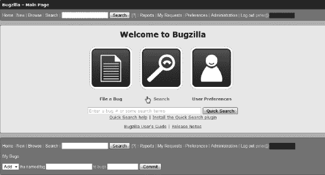
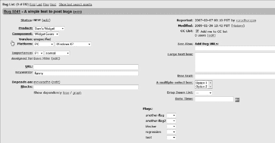
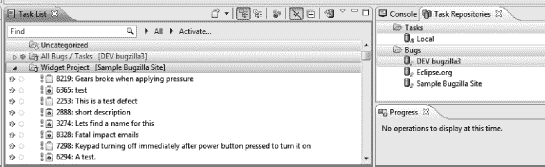
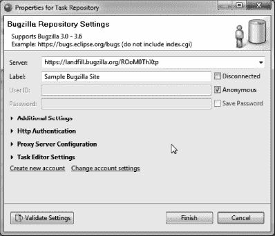
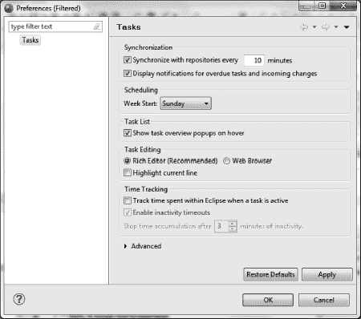

## 12

## 使用 Zend Studio 为 Eclipse、Bugzilla、Mylyn 和 Subversion 进行敏捷开发

近年来，敏捷开发变得越来越流行。这是一种计算机编程方法，它认为两个人组成的编程团队实际上比程序员单独工作更有效率。两人一组工作的概念也有反对者，有些人可能认为两个程序员同时在同一台机器上工作实际上是浪费开发时间。首先，让我们看看敏捷开发的一些基本原则。然后，我们将看看本章标题中提到的产品和工具的使用，以及如何使用它们来实现这些原则。

### 敏捷开发的原则

敏捷开发有许多方面，在现有的程序员团队中实现它们需要一些时间。可能会有来自各方的阻力，从程序员到管理层，所以在开始使用这些原则之前，一定要计划好你的方法和交付时间表。

敏捷编程的定义和概念需要范式的转变，以及对概念的坚实基础和理解。一旦你理解了敏捷开发应该如何工作的概念，你当然可以自由地发明你自己的术语，因为这在术语上不是一门精确的科学。在我将一个开发团队转移到敏捷方法的经历中，我喜欢使用汽车拉力赛的概念来表达团队成员“简单”角色的想法。在一场拉力赛中，每辆车都有驾驶员和导航员。集会通常会持续一段时间；如果是短途拉力赛，单日就可以完成(一个小的编程任务)，如果是多阶段拉力赛(一个较长的编程任务)，那么沿途可能会有进站或者休息点。最终反弹结束，结果确定。这与敏捷开发中采用的方法相同。

 **注意**这种敏捷开发的方法和交付是对我成功之处的个人适应和提炼。有不同的类比和方法可能不适合你，也有可能适合你。例如，以快速状态会议开始编程日的每日站立会议的想法在我当前的情况下不工作。这对你的团队来说可能是最好的事情。调味是这里的基本概念。

继续汽车拉力赛的概念，参与者通常会得到一份描述或一张要走的路线的地图。拉力赛组织者准备路线，并向每辆车的导航员提供详细信息。然后导航员计划他们的车在拉力赛开始时将要走的具体路线。有些拉力赛不允许练习跑球场路线，只提供地图；一些组织者提供大量的路线信息——简而言之，路线的知识在不同的集会上可能有很大的不同。

然后，导航员根据手头的信息尽可能准确地规划路线。当事件到达时，信息可能已经改变。

敏捷开发中的计划和完成编程任务没有什么不同。必须利用提供的信息尽可能多地研究这个问题；这是导航员的工作。计划的执行将由司机来完成。驾驶程序员的工作和拉力车手是一样的。专注地听着导航员，以最佳速度操作设备，以便在最佳和最准确的时间框架内到达目的地。

这些是敏捷开发中的基本角色。现在让我们看看这些角色在解决编程任务或修复 bug 的活动中是如何工作的。下面的叙述将有助于展示一次集会从开始到结束是如何进行的。

### 敏捷开发集会

项目负责人(集会组织者)需要适当的时间来计划在即将到来的集会的时间框架内需要完成的事情。我发现反弹持续时间不应该超过两周，稍后我会解释原因；当然，这取决于要完成的工作。拉力赛课程(要完成的任务)将被记录下来并分配给导航员，导航员将依次花费适当的时间来研究问题或 bug，并计划解决项目所需的步骤。然后，导航员选择一个合适的驱动程序(程序员)开始工作。理想情况下，领航员有权选择他们自己的驾驶员，因为他们最了解要完成什么，因此应该选择最适合这项工作的人。当拉力赛开始时，领航员会亲自坐在车手旁边，和他们讨论任务。

这似乎是浪费时间的地方，但当你真正想一想，有人告诉司机去哪里和注意什么实际上可以更准确和更有效地完成工作。当司机不那么分心时(查看电子邮件、浏览脸书或 YouTube ),专注度和成就感会呈指数级上升。导航员给驾驶员的详细指示水平将取决于他们各自的经验和技能水平，所以这种动态将不得不自行解决。我只想说，导航员不应该一键一键地告诉司机做什么，就像一个真正的导航员不会告诉司机什么时候换挡一样。

 **注意**导航员在这里起着更大的作用，应该认真对待。他们必须计划路线，并标记沿途的里程碑或检查点，以便团队不会在途中迷路。当我将敏捷开发引入我的工作环境时，我实际上发现了一些很好的在线视频，是真实的汽车拉力赛，并让我的团队观看了这些视频。它实际上以一种更实际的方式给他们带来了概念。分享一些好的集会和坏的集会(崩溃)的视频，向您的开发团队展示敏捷开发的道路上可能也有障碍。

有一些思想流派认为，导航员和驾驶员坐在一起的实际时间应该限制在几个小时，然后他们应该改变一些事情:改变角色，改变任务，或者两者都改变。这也需要一个团队一个团队地解决，但是不时地休息一下是个好主意。

因此，一旦集会组织者设定了集会的日期范围，就应该计划沿途停车。如果反弹时间很长，那么止损点应该放在时间线上的战略点，如果反弹时间相对较短，那么止损点可以放在最后。无论哪种方式，整个开发团队都应该走到一起，总结已经完成了什么，失败了什么，以及还需要做什么。在敏捷开发的其他术语中，停站会议也被称为 scrums，但是我认为交叉类比和混合这样的术语会令人困惑。

 **注意**在使用这种敏捷开发方法进行编程时，应该仔细考虑开发环境。我建议至少有三个独立的环境:一个用于集会时间的本地开发环境，一个用于执行工作质量保证的测试环境，当然还有生产环境。

现在，自然地，试图遵循这种敏捷开发方法进行编程将需要一些时间来适应，并且需要获得适当的工具以便在该环境中工作。例如，你不会在土路拉力赛中驾驶加长豪华轿车，尽管有一天这可能被证明是一种取悦大众的方式……你先看看这里吧！

本章的剩余部分将集中在工具的组合上，我发现这些工具对敏捷开发方法从计划到实现的工作非常有帮助。首先，我将分别讨论这些工具，并向您展示它们各自的好处和优势，然后讨论如何实现集成。

 **注**如果你确实想在某个时候在你的开发车间实施敏捷开发，本章的结尾将为进一步的学习和准备提供一些参考。

### Bugzilla 简介

Bugzilla 是一个开源的基于网络的工具，允许用户跟踪他们的许多项目中的问题和错误。老实说，在*nix 环境下设置有点棘手，我建议找一个有经验的 Linux 管理员来确保它设置正确，但是一旦它稳定下来，就会像广告中说的那样运行。我们已经学会在我们所有的项目任务中使用它，包括状态报告和产品增强工作；任何与项目相关的东西都可以而且应该记录在 Bugzilla 中(不应该严格地局限于 bug)。Bugzilla 的基本主屏幕如[图 12-1](#fig_12_1) 所示。这是取自 Bugzilla 的免费在线演示网站。

***图 12-1。【Bugzilla 的主页***

一旦你建立了错误报告网站，你将不得不建立至少一个项目，在其中你将跟踪错误/任务。设置这些很容易，但是应该考虑清楚以便以后使用。例如，将您的开发项目分解成单独的模块，并将它们视为“产品”或发布版本可能会更好。从长远来看，这种粒度级别将对您有所帮助，因为它允许更精确地跟踪任务和 bug。

在 Bugzilla 中键入要跟踪的产品后，您可以开始添加要跟踪的单个任务或 bug。在图 12-2 中，您可以看到在 Bugzilla 的这个实例中被跟踪的一些任务的部分列表；在[图 12-3](#fig_12_3) 中，您可以看到单个任务上可记录的部分细节。

***图 12-2。**Bugzilla bug/任务列表*

Bugzilla 本身就是一个管理项目细节和跟踪任务(有些是真正的 bug)的好工具。此外，在 Bugzilla 中，您可以定制对 bug 的搜索，调整任务类别和严重性级别，甚至使用内置的报告部分来查看任务完成持续时间。因此，就这一点而言，我建议将其纳入您的项目管理工具包。然而，故事远不止如此。

***图 12-3。**Bugzilla bug/任务的部分细节*

### Mylyn 为月食

Mylyn 是一个为 Eclipse 构建的任务记录模块。它是 Eclipse IDE 的一个独立附件，因此可以用于任何 Eclipse 编码风格或语言(Java、C++、PHP 等等)。它最好的特性之一是它如何记录当前正在执行的工作的上下文，稍后会有更多的内容。在 Zend Studio for Eclipse 的世界中，Mylyn 被直接绑定到任务列表视图中，可以立即用于单独的任务。如果你是一个单独的程序员，这很好，因为你不需要和任何人分享你的代码。图 12-4 显示了 Studio 中带有未分类部分的任务列表视图，以及来自示例 Bugzilla 服务器的小部件项目部分。未分类部分是用于独奏的部分。再往下钻一点，[图 12-5](#fig_12_5) 显示了一个单独任务的细节。在这里，我们可以看到任务的当前状态、您可能想要添加到任务中的任何日程安排，以及关于任务的任何注释或备注。这本身就很棒；尤其是单人编程。然而，一旦您看到 Mylyn 连接到 Bugzilla 服务器，您就会意识到这个 Zend Studio for Eclipse view 的应用范围要广得多。

***图 12-4** 。Zend Studio 中 Buzilla 服务器内容的示例显示*

连接到 Bugzilla 服务器非常简单；您所要做的就是在 Task Repositories 视图中创建一个新条目。这在[图 12-6](#fig_12_6) 中显示。一旦用正确的凭证建立了这个连接，您就需要为它创建一个查询。这个查询可以充当 Bugzilla 中所有产品和任务的过滤器，这样，如果您正在处理一个特定的项目或系统发布，您就可以通过识别和过滤所涉及的部分来更好地集中精力。

***图 12-5。**Zend Studio*中出现的 Bugzilla 项目细节

***图 12-6。**样例 Bugzilla 存储库连接设置*

### Bugzilla 和 Mylyn 在 Eclipse 内结合

更多的时候，程序员在团队中合作和工作。这是 Mylyn 和 Bugzilla 可以以另一种奇妙的方式合作的地方。一旦您为团队开发准备好了任务，您就可以在 Bugzilla 中或者在 Zend Studio for Eclipse 的任务列表视图中将它们分配给团队成员；这是集会组织者的任务。在 Zend Studio for Eclipse 中，您甚至可以对 Bugzilla 任务做更多的事情。可以选择添加附件(文档、图像等)、更改任务状态、更新其属性(任务可能影响什么操作系统、严重性级别、优先级级别等)，以及更改团队中工作分配给谁。所有这些都可以在 IDE 中完成，这样您就不必为了完成某些工作而反复切换屏幕。

一旦在 Zend Studio for Eclipse 中建立了到 Bugzilla 服务器的连接，我们鼓励您创建至少一个到该服务器的查询，这样您就可以专注于当前需要关注的任务。您可以进行多个查询，如果愿意，每个项目一个查询，并根据需要在它们之间切换。正如你在[图 12-7](#fig_12_7) 中所看到的，查询设计页面可能非常复杂，如果你愿意，可以直接过滤到硬件和操作系统级别。在本例中，我对查询进行了微调，只显示与 Sam 的小部件项目相关的任务。如果我有一个潜在的非常大的查询结果集，如本例所示，我可以在视图工具栏中的 Task List 视图的关键字搜索特性中进一步细化我要查找的内容。

***图 12-7。**任务库查询/过滤界面*

既然 bug 和任务已经连接到 Zend Studio for Eclipse，那么是时候开始使用这些项目来跟踪您的进度，直到它们得到解决。如果你再次查看[图 12-4](#fig_12_4) ，你会在任务列表视图中从左数第二个位置看到一个模糊的圆圈列。几段前我提到过，跟踪任务或 bug 的上下文是 Mylyn 更好、最强大的特性之一。所以现在我们来看看这个特性背后的细节。一旦你选择了你想要完成的任务，在你执行任何相关的工作之前，一定要点击这个圆圈。这样做是为了“激活”任务，Mylyn 将开始记录正在进行的工作的上下文。Mylyn 开始跟踪您在任务处于“活动”状态时打开的所有文件，然后如果您几天后回到同一任务并重新激活它，则您上次处理该任务时在该任务上下文中打开的所有文件将在编码区域中自动为您打开。[图 12-8](#fig_12_8) 显示了一个特定 bug 的上下文以及与之相关的文件；`DebugDemo.php`在这种情况下及其所属的项目。Mylyn 不仅跟踪 bug 上下文中打开的文件，还跟踪您处理过并随后关闭的文件。

***图 12-8。**单个 bug /任务的详细上下文跟踪*

这个上下文页面的另一个优点是，如果文件是关闭的(但仍然是 bug 上下文的一部分)，您可以双击文件名，它将被打开进行编辑。这可以节省在大型项目文件列表中查找文件的时间。所有这些都是在打开或激活任务时完成的，所以这里唯一的问题是，在处理特定的任务或 bug 时，要确保记得打开和关闭任务的上下文记录功能。

除了任务列表视图中任务或 bug 的上下文显示之外，还有 PHP Explorer 视图的延续。一旦任务被激活，浏览器中列出的文件将被过滤到 bug 上下文中的文件。这是有利的，因为它再次将许多文件的大型项目的混乱减少到只有那些与手头的 bug 或任务相关的文件。这个特性可以通过 PHP Explorer 工具栏图标来切换打开或关闭，这个图标看起来像三个炮弹，带有“关注活动任务”的气泡帮助文本

Bugzilla 的另一个很棒的特性也可以在 Zend Studio for Eclipse 中维护，那就是管理与任务或 bug 相关的附件。如果您有附带的文档，如完整的 bug 报告、设计文档、测试计划或已发现 bug 的屏幕截图，这将非常方便。[图 12-9](#fig_12_9) 显示了一个 jpg 图像到一个任务的附件。

***图 12-9。**工作室显示的 Bug，附带一个文件*

另一件要考虑的事情是，如果你的开发团队中的一些成员不使用 Zend Studio for Eclipse，那会怎样，这可能令人震惊。这将有效地结束在该 IDE 中使用 Mylyn 的巨大优势。值得庆幸的是，一旦通过存储库连接与 Bugzilla 服务器建立了连接(参见[图 12-6](#fig_12_6) )，任务中记录的大部分数据将被转发到 bug 服务器，如果在 Bugzilla 中直接进行了任何更新，那么这些信息将定期下载到 Zend Studio for Eclipse。有一个持续的双向反馈，有助于保持一切同步。这种双向更新的时间可以在任务列表视图的首选项屏幕中控制，或者通过单击鼠标来触发(任务列表工具栏项目，看起来像一个上面有两个箭头的蓝色圆柱体)。要设置自动同步时间，只需通过单击视图任务栏上的视图菜单图标打开首选项控制窗口，您将看到首选项选项。如图[图 12-10](#fig_12_10) 所示。可以看到，这里有许多附加选项来控制任务列表视图。我不会在这里详细讨论它们，但是请注意，您可以跟踪每项任务所花费的时间，并且能够计算非活动时间段。

***图 12-10。**任务库更新的首选项窗口*

在任务列表视图中，还可以按类别(按项目)顺序(这是默认设置)或按即将到来的截止日期查看 bug。这可以让你看到哪些任务需要立即关注，哪些可以等待一段时间。任务栏上有一个开关，允许你用“分类”和“预定”的标题来控制这个特性它是右边第二个工具栏项目。沿着这个任务栏你会看到更多的选项，允许你控制它的信息。从右边数第三个，有一条线穿过勾号图标，是另一个开关；这个工具可以让你过滤掉所有已经完成的任务，这样就可以让你的视野更加清晰。接下来是折叠/展开按钮，允许您管理所有任务的列表显示。下一个(看起来像三个炮弹)是另一个开关，但这个允许你过滤本周的所有任务，再次帮助你管理被太多工作淹没的可能性。最后，在这个工具栏上是“查看”菜单(已经提到用于查看首选项)，您可能已经注意到在这个弹出菜单上有许多其他选项。这里值得一提的最后一个是标题为“显示 UI 图例”的。点击此菜单项，您将看到如图[图 12-11](#fig_12_11) 所示的项目列表。简而言之，这是您将在任务列表视图中看到的所有图标的备忘单，简要解释了每个图标的含义。

***图 12-11。【Zend Studio for Eclipse 中的 Mylyn 图标图例***

### 外推利益

既然您已经看到了 Mylyn 和 Bugzilla 集成特性的许多好处，我想向您展示一些可以在 Zend Studio for Eclipse 的其他领域获得的推断性好处。这些是与其他集成有一些重叠的特性，因此对您和您的敏捷开发团队是有益的。

第一次外推可以在任务窗口的上下文区域中看到。在这里，如果您与 Subversion (SVN)或 CVS 之类的代码存储库进行了集成(现在谁不这样做呢),您可以在有问题的 bug 的过滤视图(上下文)中看到并管理整个存储库的交互。市场上还有其他类似的软件库工具，如 Git 和 Mercurial，但我们关注 SVN 是因为它在 Zend Studio 中的集成点。如图 12-12 中的[所示，我打开了一个上下文窗口，显示了一个已经被修改并保存在本地的文件，在文件名`DemoDebug.php`旁边有一个>标记。正如您所看到的，这是一种更清晰的方式来查看您的任务和项目中的哪些文件需要提交到存储库中。请记住，只有当您在 Mylyn 中“激活”了 bug 时，才能管理这种文件跟踪。](#fig_12_12)

***图 12-12。【Zend Studio 中一个 bug 的上下文窗口***

当您在代码评审期间查看代码变更时，可以看到下一个有益的推断。在这里，您可以从 bug 的上下文中访问短列表；右键单击项目(或单个文件)将允许您将您的工作与代码库中最新版本(修订号)的工作进行比较。如果愿意，您还可以在存储库中追溯到以前的承诺(修订号)。[图 12-13](#fig_12_13) 显示了在整个项目中比较承诺历史的可能性。如果您愿意，这种类型的代码更改审查也可以在您保存文件的本地历史上执行。当然，选择使用哪一个(存储库或本地历史)取决于您，但也可能取决于您将工作提交到存储库的频率。

***图 12-13。**本地文件与 SVN 存储库文件的历史比较。*

在图 12-13 中，你可以在顶部看到 SVN 版本号列表，后面是这些版本提交的详细时间。屏幕下方的下一部分显示了在所选修订号的活动期间发生了更改的文件，这是最后一次执行提交(这不同于我们当前在本地进行的工作，还没有提交到存储库中)。屏幕下方的下一个部分实际上显示了我们正在为这个特定任务工作并且尚未提交的已更改文件，下面的部分显示了已经进行的实际逐行代码更改，以及它们与存储库中文件的当前状态相比如何。

### 总结

现在，我已经向您介绍了这一奇妙的工具集合，以及如何从 Zend Studio for Eclipse 中管理和控制它(主要是),您应该有足够的信息来开始使用这些工具，从而为您的开发工作带来巨大的好处。如果我没有最终发现这种编程方法，我无法想象今天我管理任务和项目的能力会达到什么程度。当然，我花了几年时间来实现这种工具组合，首先将 Zend Studio for Eclipse 和 SVN 结合使用，然后将 Bugzilla 添加到组合中，最后发现 Zend Studio for Eclipse 和 Mylyn 之间的集成。但是，您可以立即开始使用这种完全集成的产品，节省了我花在探索上的时间。

如果您现在才发现极限编程(XP)、代码集会、早期/经常发布等敏捷开发的巨大优势，那么您也应该看到这种工具的聚合如何帮助您变得更加敏捷。

您可能已经注意到，我并没有涵盖这些工具的每个方面以及它们各自的工具栏按钮，因为在本章的范围内涵盖会变得非常乏味，而且通过自己发现某些细微差别并获得经验也可以获得相当高的成就。获得一点“发现了！”当你协同使用这些工具的时候，你自己的时刻确实非常令人满意。然而，我不想让你没有一些资源，你可以用这些工具进一步学习和扩展你的知识。它们是:

*   Zend Studio for Eclipse 主页:`[www.zend.com/en/products/studio/](http://www.zend.com/en/products/studio/)`
*   Bugzilla 主页:`[www.bugzilla.org/](http://www.bugzilla.org/)`
*   Mylyn 月食页面:`[www.eclipse.org/mylyn/](http://www.eclipse.org/mylyn/)`
*   Mylyn 主页:`[http://tasktop.com/mylyn/](http://tasktop.com/mylyn/)`
*   视频:Mik Kersten 博士的 W-JAX 2008 主题演讲:重新定义 IDE 的“我”:`[http://tasktop.com/videos/w-jax/kersten-keynote.html](http://tasktop.com/videos/w-jax/kersten-keynote.html)`